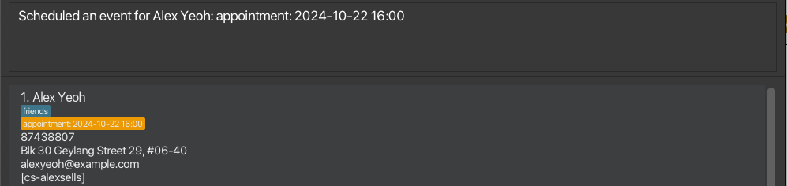
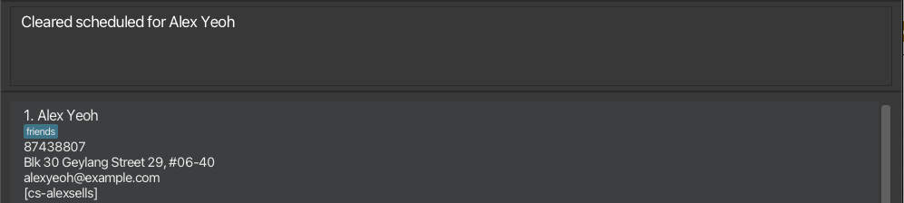
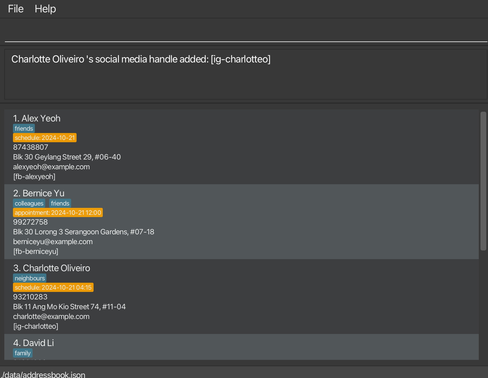
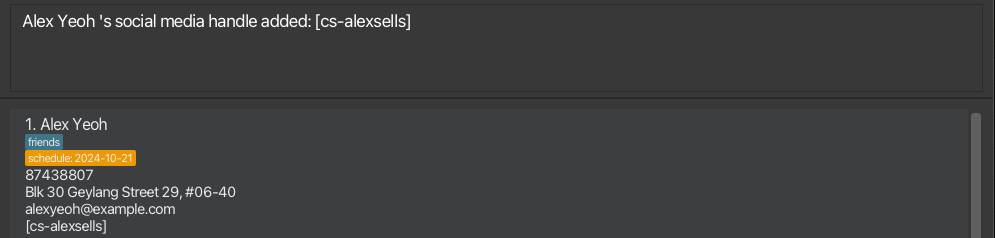
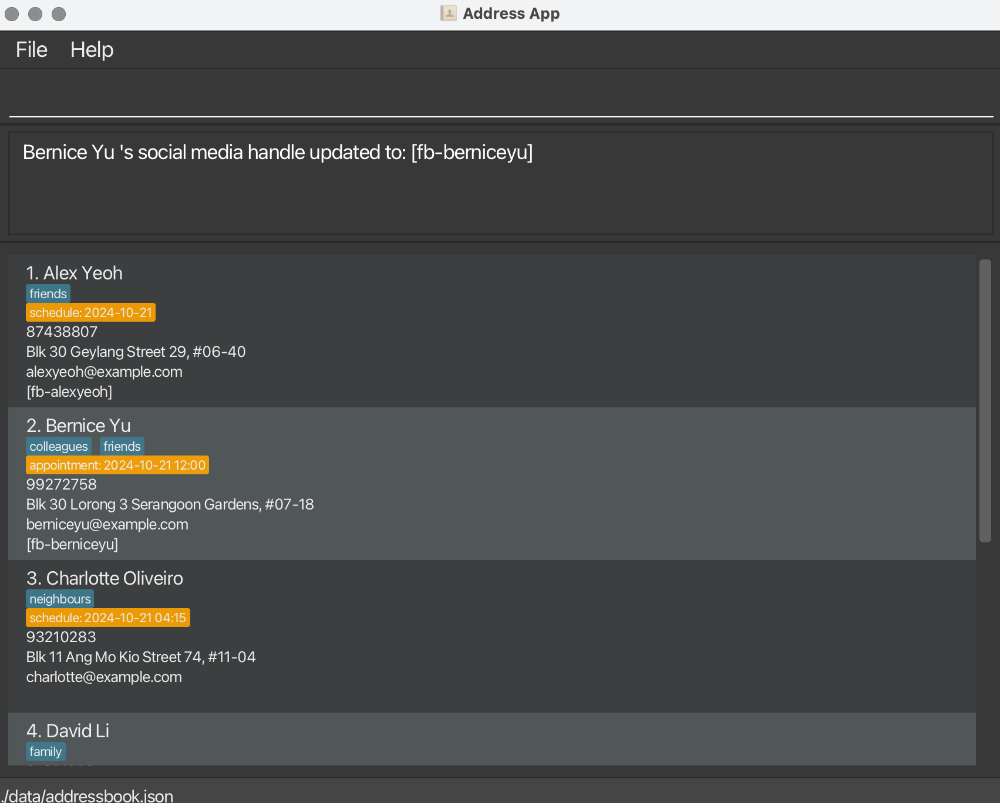
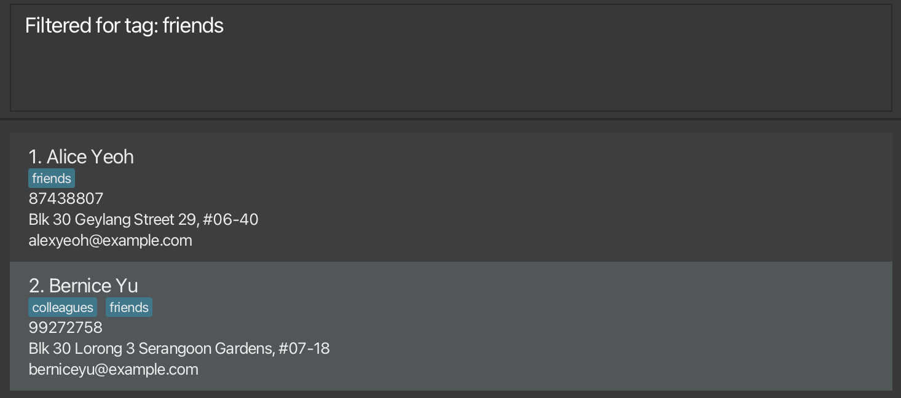
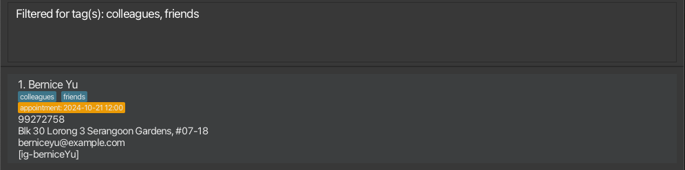
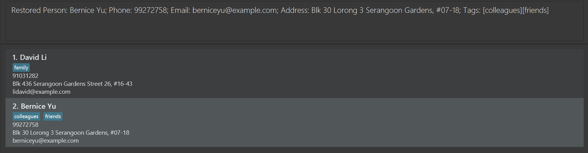
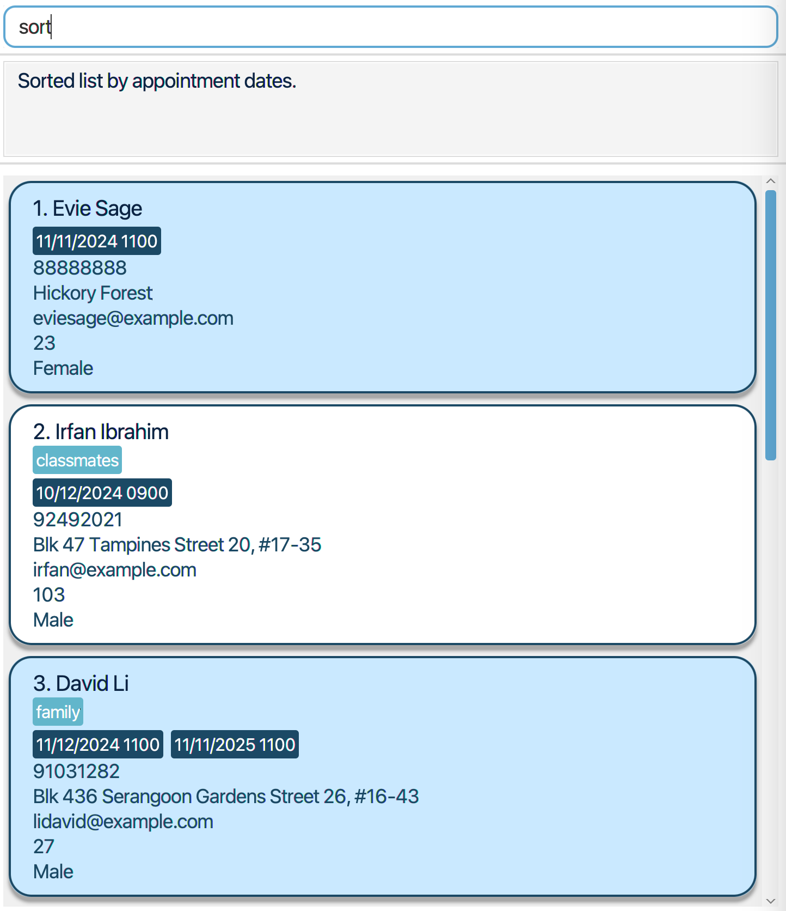
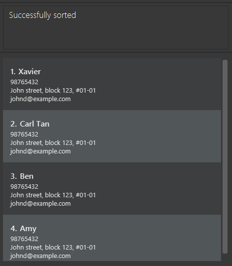

AddressBook Level 3 (AB3) is a **desktop app for managing contacts, optimized for use via a Command Line Interface** (CLI) while still having the benefits of a Graphical User Interface (GUI). If you can type fast, AB3 can get your contact management tasks done faster than traditional GUI apps.

* Table of Contents
{:toc}

--------------------------------------------------------------------------------------------------------------------

## Quick start

1. Ensure you have Java `17` or above installed in your Computer.

1. Download the latest `.jar` file from [here](https://github.com/se-edu/addressbook-level3/releases).

1. Copy the file to the folder you want to use as the _home folder_ for your AddressBook.

1. Open a command terminal, `cd` into the folder you put the jar file in, and use the `java -jar addressbook.jar` command to run the application. 
   A GUI similar to the below should appear in a few seconds. Note how the app contains some sample data. 
   

1. Type the command in the command box and press Enter to execute it. e.g. typing **`help`** and pressing Enter will open the help window. 
   Some example commands you can try:

   * `list` : Lists all contacts.

   * `add n/John Doe p/98765432 e/johnd@example.com a/John street, block 123, #01-01` : Adds a contact named `John Doe` to the Address Book.

   * `delete 3` : Deletes the 3rd contact shown in the current list.

   * `clear` : Deletes all contacts.

   * `exit` : Exits the app.

1. Refer to the [Features](#features) below for details of each command.

--------------------------------------------------------------------------------------------------------------------

## Features

**:information_source: Notes about the command format:** 

* Words in `UPPER_CASE` are the parameters to be supplied by the user. 
  e.g. in `add n/NAME`, `NAME` is a parameter which can be used as `add n/John Doe`.

* Items in square brackets are optional. 
  e.g `n/NAME [t/TAG]` can be used as `n/John Doe t/friend` or as `n/John Doe`.
* 
* Items together in curly square brackets means one and only one of them must be given as input. 
  e.g `{n/NAME t/TAG}` can be used as `n/John Doe` or as `t/friends`.

* Items with `…`​ after them can be used multiple times including zero times. 
  e.g. `[t/TAG]…​` can be used as ` ` (i.e. 0 times), `t/friend`, `t/friend t/family` etc.

* Parameters can be in any order. 
  e.g. if the command specifies `n/NAME p/PHONE_NUMBER`, `p/PHONE_NUMBER n/NAME` is also acceptable.

* Extraneous parameters for commands that do not take in parameters (such as `help`, `list`, `exit` and `clear`) will be ignored. 
  e.g. if the command specifies `help 123`, it will be interpreted as `help`.

* If you are using a PDF version of this document, be careful when copying and pasting commands that span multiple lines as space characters surrounding line-breaks may be omitted when copied over to the application.

### Viewing help : `help`

Shows a message explaning how to access the help page.

Format: `help`

### Adding a person: `add`

Adds a person to the address book.

Format: `add n/NAME p/PHONE_NUMBER e/EMAIL a/ADDRESS [t/TAG]…​`

:bulb: **Tip:**
A person can have any number of tags (including 0)

Examples:
* `add n/John Doe p/98765432 e/johnd@example.com a/John street, block 123, #01-01`
* `add n/Betsy Crowe t/friend e/betsycrowe@example.com a/Newgate Prison p/1234567 t/criminal`

### Listing all persons : `list`

Shows a list of all persons in the address book.

Format: `list`

### Editing a person : `edit`

Edits an existing person in the address book.

Format: `edit INDEX [n/NAME] [p/PHONE] [e/EMAIL] [a/ADDRESS] [t/TAG]…​`

* Edits the person at the specified `INDEX`. The index refers to the index number shown in the displayed person list. The index **must be a positive integer** 1, 2, 3, …​
* At least one of the optional fields must be provided.
* Existing values will be updated to the input values.
* When editing tags, the existing tags of the person will be removed i.e adding of tags is not cumulative.
* You can remove all the person’s tags by typing `t/` without
    specifying any tags after it.
* Note that you cannot edit `schedule` information using the `edit` command. Please use the `schedule` command instead.

Examples:
*  `edit 1 p/91234567 e/johndoe@example.com` Edits the phone number and email address of the 1st person to be `91234567` and `johndoe@example.com` respectively.
*  `edit 2 n/Betsy Crower t/` Edits the name of the 2nd person to be `Betsy Crower` and clears all existing tags.

### Scheduling Contacts: `schedule`

Adds a schedule to contact in the address book.
Schedule names can be renamed based on your requirements. 

Format: `schedule INDEX [sn/ALTERNATE_NAME] [sd/SCHEDULE_DATE] [st/SCHEDULE_TIME]`

* A schedule will only be valid if it has a `SCHEDULE_DATE`. `ALTERNATE_NAME` and `SCHEDULE_TIME` will not be displayed unless a schedule has a `SCHEDULE_DATE`.
* `INDEX` refers to the number shown in the displayed person list, and is 1-based.
* If all the optional parameters are omitted and the contact has an existing schedule, the existing schedule will be removed.
* If the provided contact does not have an existing schedule, the `schedule` command must be provided with at least `SCHEDULE_DATE` to attach a schedule to the contact.
* If the provided contact has an existing schedule, the provided parameters will overwrite the existing schedule's parameters and keep the omitted parameters unchanged.
* `ALTERNATE_NAME` must strictly be alphanumerical.
* `SCHEDULE_DATE` must be in the format `yyyy-MM-dd`.
* `SCHEDULE_TIME` must be in the format `HH:mm`.

Examples:
* `schedule 1 sn/appointment sd/2024-10-22 st/16:00`: schedules an appointment on 2024-10-22 at 16:00 for the contact at index 1  

* `schedule 1`: clears the schedule for the contact at index 1, if any.  

### Renaming a Tag : `renameTag`

Renames an existing tag in the address book.

Format: `renameTag INDEX ot/OLDTAG nt/NEWTAG`

* Renames the tags called `OLDTAG` to `NEWTAG`.
* Contacts with the tag `OLDTAG` will now have `NEWTAG`, with `OLDTAG` removed
* If `OLDTAG` is not an existing tag, `[OLDTAG] tag is not found` will be returned.

### Adding Social Media : `socialMedia`

Adds or updates the social media handle to an existing person.

Format: `socialMedia [ig/USERNAME] [fb/USERNAME] [cs/USERNAME]`

* Contacts will have their social media handle displayed as `[ig-igusername]` or `[fb-fbusername]` or `[cs-csusername]`.
* `ig`,`fb`, and `cs` is used to represent Instagram, Facebook, and Carousell handles respectively.
* If the contact already has an existing social media handle, their handle will be updated.
* Hence, we can only add one social media handle to each contact.

Examples:
*  `socialMedia 3 ig/charlotteo` Adds the handle `[ig-charlotteo]` to the third contact Charlotte.

*  `socialMedia 1 cs/alexsells` Updates the first contact Alex's social media to `[cs-alexsells]`.

*  `socialMedia 2 fb/berniceyu` Updates the second contact Bernice's social media to `[fb-berniceyu]`.

### Locating persons by name: `find`

Finds persons whose names contain any of the given keywords.

Format: `find KEYWORD [MORE_KEYWORDS]`

* The search is case-insensitive. e.g `hans` will match `Hans`
* The order of the keywords does not matter. e.g. `Hans Bo` will match `Bo Hans`
* Only the name is searched.
* Only full words will be matched e.g. `Han` will not match `Hans`
* Persons matching at least one keyword will be returned (i.e. `OR` search).
  e.g. `Hans Bo` will return `Hans Gruber`, `Bo Yang`

Examples:
* `find John` returns `john` and `John Doe`
* `find alex david` returns `Alex Yeoh`, `David Li` 
  

### Filter persons by tag: `filter`

Filters the list of contacts and displays those with the provided tag.

Format: `filter [t/TAG]...`

* The filter is case-sensitive.
* Filters for users whose tags contains all the input tags.
* The tag provided must only contain alphanumeric characters
* If the provided tag does not match any contact, an empty list will be shown.

Examples:
* `filter t/friends` will filter for contacts that has tag `friends` 
  
* * `filter t/friends t/colleagues` will filter for contacts that has both tags `friends` and `colleagues` 
    
* `filter t/bestFriends` will display an empty list if there are no contacts with tag `bestFriends` 
  

### Deleting a person : `delete`

Deletes the specified person from the address book.

Format: `delete INDEX`

* Deletes the person at the specified `INDEX`.
* The index refers to the index number shown in the displayed person list.
* The index **must be a positive integer** 1, 2, 3, …​
0000
Examples:
* `list` followed by `delete 2` deletes the 2nd person in the address book.
* `find Betsy` followed by `delete 1` deletes the 1st person in the results of the `find` command.

### Restoring a deleted person : `restore`

Restores the person deleted from the address book by the 'delete' command.

format: `restore`

* Restores the last person deleted from the address book by the 'delete' command.
* Only works if person has been deleted by the 'delete' command within the session.
* Does not work if same person has been added to the address book after deletion using add command.

Examples:
* `restore` will restore the most recently deleted person, in this case, the 2nd person Bernice Yu.
  

### Sort persons by name: `sort`

Sorts and displays the list of persons by schedule or name alphabetically in either ascending or descending order

Format: `sort {n/[ORDER], sch/[ORDER]}`

* `[ORDER]` can be either "asc" / "ascending" or "desc" / "descending" (case-insensitive).
* If no order is provided, persons will be sorted in ascending order by default.
* Contact list will be sorted alphabetically by name with `n/` and by schedule with `sch/`.

Examples:
* `sort n/` will sort by persons names alphabetically in ascending order
* `sort sch/` will sort by schedule in ascending order
* `sort n/ascending` will sort by persons names alphabetically in ascending order
  
* `sort n/descending` will sort by persons names alphabetically in descending order
  
* `sort sch/ascending` will sort by schedule in ascending order
  
* `sort sch/descending` will sort by schedule in descending order
  

### Clearing all entries : `clear`

Clears all entries from the address book.

Format: `clear`

### Exiting the program : `exit`

Exits the program.

Format: `exit`

### Saving the data

AddressBook data are saved in the hard disk automatically after any command that changes the data. There is no need to save manually.

### Editing the data file

AddressBook data are saved automatically as a JSON file `[JAR file location]/data/addressbook.json`. Advanced users are welcome to update data directly by editing that data file.

:exclamation: **Caution:**
If your changes to the data file makes its format invalid, AddressBook will discard all data and start with an empty data file at the next run. Hence, it is recommended to take a backup of the file before editing it. 
Furthermore, certain edits can cause the AddressBook to behave in unexpected ways (e.g., if a value entered is outside of the acceptable range). Therefore, edit the data file only if you are confident that you can update it correctly.

### Archiving data files `[coming in v2.0]`

_Details coming soon ..._

--------------------------------------------------------------------------------------------------------------------

## FAQ

**Q**: How do I transfer my data to another Computer? 
**A**: Install the app in the other computer and overwrite the empty data file it creates with the file that contains the data of your previous AddressBook home folder.

--------------------------------------------------------------------------------------------------------------------

## Known issues

1. **When using multiple screens**, if you move the application to a secondary screen, and later switch to using only the primary screen, the GUI will open off-screen. The remedy is to delete the `preferences.json` file created by the application before running the application again.
2. **If you minimize the Help Window** and then run the `help` command (or use the `Help` menu, or the keyboard shortcut `F1`) again, the original Help Window will remain minimized, and no new Help Window will appear. The remedy is to manually restore the minimized Help Window.

--------------------------------------------------------------------------------------------------------------------

## Command summary

Action | Format, Examples
--------|------------------
**Add** | `add n/NAME p/PHONE_NUMBER e/EMAIL a/ADDRESS [t/TAG]…​`   e.g., `add n/James Ho p/22224444 e/jamesho@example.com a/123, Clementi Rd, 1234665 t/friend t/colleague`
**Clear** | `clear`
**Delete** | `delete INDEX`  e.g., `delete 3`
**Edit** | `edit INDEX [n/NAME] [p/PHONE_NUMBER] [e/EMAIL] [a/ADDRESS] [t/TAG]…​`  e.g.,`edit 2 n/James Lee e/jameslee@example.com`
**Find** | `find KEYWORD [MORE_KEYWORDS]`  e.g., `find James Jake`
**List** | `list`
**Help** | `help`
**Restore** | `restore`
**Sort** | `sort [ORDER]`  e.g., `sort asc`
**Rename Tag** | `renameTag ot/OLDTAG nt/NEWTAG`  e.g., `renameTag ot/manager nt/boss`
**Filter** | `filter [t/TAG]`  e.g., `filter t/friends`
**Social Media** | `socialMedia INDEX [ig/USERNAME]`  e.g., `socialMedia 1 ig/myUsername` 

