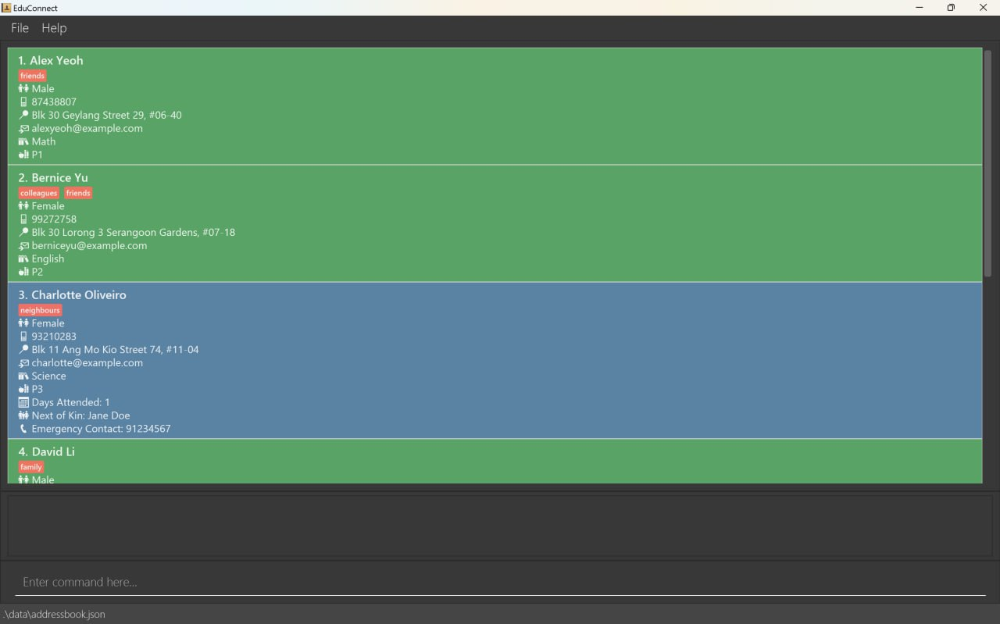
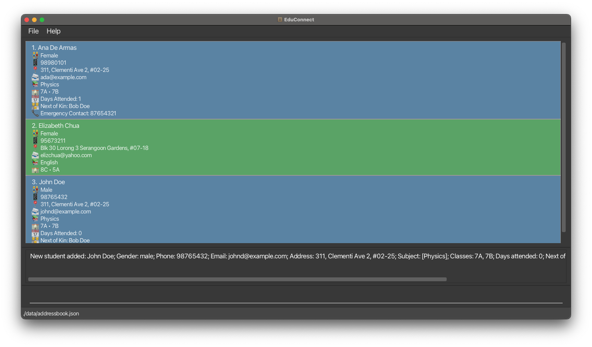
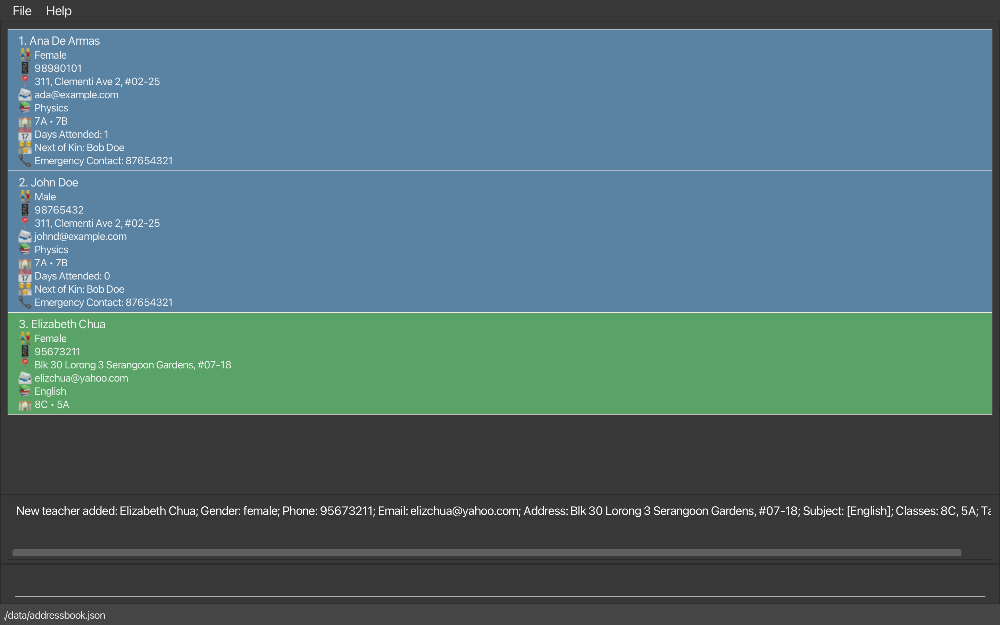
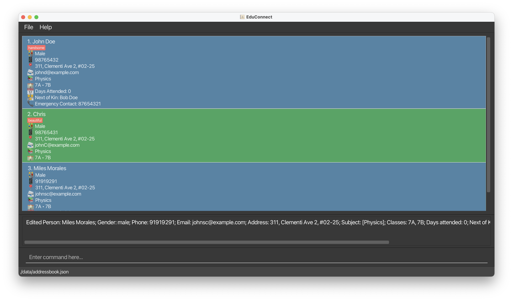
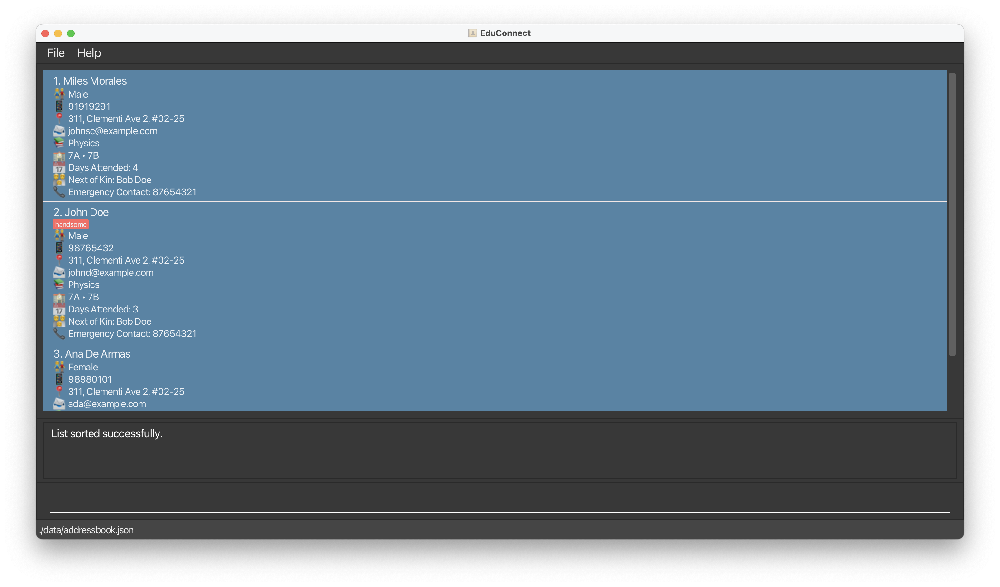
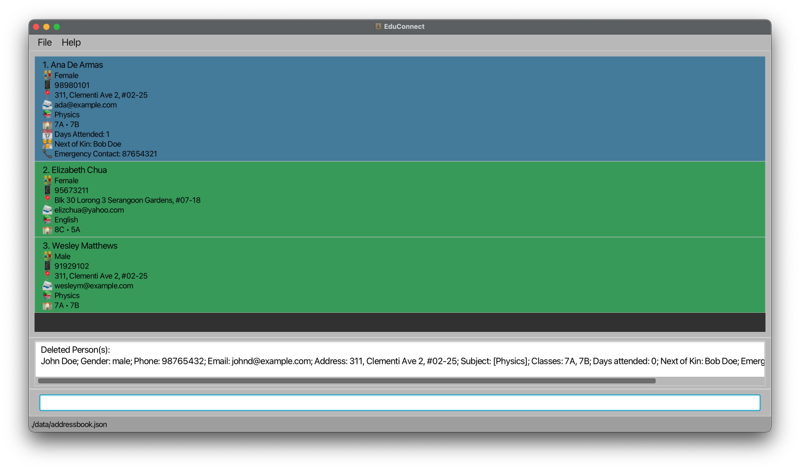

Welcome to EduConnect – a tool designed to help teachers manage student and teacher details with speed and simplicity. EduConnect streamlines your everyday tasks, such as tracking attendance and managing contact information, allowing you to organize important information in a fast, efficient way. By typing commands, you can quickly update, search, and handle details with minimal effort, making it a valuable companion for busy school environments.

## Table of Contents
* Table of Contents
{:toc}

--------------------------------------------------------------------------------------------------------------------

## Quick Start

{: .alert .alert-info}
> :information_source: **Note:**
>
> If you're new to this User Guide, check out the [How to Use This User Guide](#how-to-use-this-user-guide) section
> to get familiar with the terms and layout we use.

1. Check that Java is installed:
   - EduConnect requires **Java 17 or higher** to run. If you're not sure if you have the correct Java version installed or how to install **Java 17**, you can find more information at the [FAQ](#faq) section.

2. Download EduConnect onto your computer:
   - Download the latest version of EduConnect by clicking [here](https://github.com/AY2425S1-CS2103T-F12-2/tp/releases).

3. Move the file to a folder:
   - After downloading, place the `educonnect.jar` file in any folder on your computer where you'd like to store the app.

4. Open EduConnect:
   - Open the "Command Prompt" (for Windows) or "Terminal" (for Mac/Linux).
   - Type `cd` followed by the folder location where you saved the EduConnect file. For example:
     - On Windows: `cd C:\Users\YourName\Documents\EduConnect`
     - On Mac/Linux: `cd /Users/YourName/Documents/EduConnect`
   - Then type this command to start the app:

        `java -jar educonnect.jar`
   - After a few seconds, the EduConnect window will appear with some sample data to help you get started. Here are some screenshots of how it might look:
    
      

    **macOS User Interface**: 
    
    **Windows User Interface**:
    
    
    {: .alert .alert-info}
    > :information_source: **Note:**
    > * EduConnect will look slightly different on macOS and Windows. Specifically, the emojis on macOS will be in color, while those on Windows will appear in monochrome.
    > * The screenshots in this User Guide will primarily be from macOS.

5. Enter a command:

   - Type a command in the command box and press **Enter** to send it. For example, typing `help` and pressing **Enter** will open a help window.

   - Here are some commands you can try:
       - `list`: Displays all the student and teacher details.
       - `student /name John Doe /gender male /contact 98765432 /email johnd@example.com /address 311, Clementi Ave 2, #02-25 /subject Physics /classes 7A,7B /attendance 0 /nok Bob Doe /emergency 87654321`: Adds a new student with the specified details.
       - `delete 3`: Deletes the 3rd contact shown in the current list.
       - `clear`: Deletes all entries.
       - `exit`: Exits the app.

For more detailed explanations of each command, see the [Features](#features) section below.  
If you have any questions or need help, please refer to the [FAQ](#faq) section.

[Back to Table of Contents](#table-of-contents)

--------------------------------------------------------------------------------------------------------------------

## Parameter Details
The table below provides a quick overview of each parameter associated with a command in EduConnect, along with the specific constraints to keep in mind when using them.

{: .alert .alert-warning}
> :exclamation: **Warning:**
>
> * Make sure the constraints for each parameter are met when entering a command. Not following these constraints may lead to errors and prevent the command from being executed correctly.
>
> * A person is considered a duplicate if they share the same phone number or email address, regardless of whether they are a student or teacher. For example, adding a student with the phone number `12345678` will result in an error if another student or teacher already has that phone number. 

| Parameter           | Definition                                                        | Constraints                                                                                                                      | Examples                                                                   |
|---------------------|-------------------------------------------------------------------|----------------------------------------------------------------------------------------------------------------------------------|----------------------------------------------------------------------------|
| `NAME`              | The name of the person.                                           | - Must only contain alphanumeric characters and spaces   - Compulsory field                                                  | `John Doe`, `Elizabeth Chua`                                               |
| `GENDER`            | The gender of the person.                                         | - Must be either `male` or `female`  - Compulsory field                                                                      | `male`, `female`                                                           |
| `PHONE_NUMBER`      | The contact number of the person.                                 | - Must be exactly 8 digits long as according to Singapore's phone numbers  - Compulsory field                                | `98765432`, `92160436`                                                     |
| `EMAIL`             | The email address of the person.                                  | - Must be in the format `example@domain`  - Compulsory field   - Top-Level domain is optional                            | `johnd@example.com`, `elizchua@yahoo.com`                                  |
| `ADDRESS`           | The residential address of the person.                            | - Any value is allowed   - Optional field                                                                                    | `311, Clementi Ave 2, #02-25`, `Blk 30 Lorong 3 Serangoon Gardens, #07-18` |
| `SUBJECT`           | The subject taught by the teacher or taken by the student.        | - Must only contain alphanumeric characters and spaces   - Compulsory field                                                  | `Physics`, `English`                                                       |
| `CLASSES`           | The class(es) associated with the person.                         | - Must only contain alphanumeric characters   - Multiple classes are separates by a comma   - Compulsory field | `7A`, `5A, 8C`                                                             |
| `ATTENDANCE`        | The attendance count of the student.                              | - Must be a non-negative integer   - Optional **student** only field                                                         | `0`, `5`                                                                   |
| `NEXT_OF_KIN`       | The next of kin of the student.                                   | - Follows the same specifications as `NAME`     - Compulsory **student** only field                                          | `John Doe`, `Elizabeth Chua`                                               |
| `EMERGENCY_CONTACT` | The contact to use in cases of emergencies involving the student. | - Follows the same specifications as `PHONE_NUMBER`   - Compulsory **student** only field                                    | `98765432`, `92160436`                                                     |
| `TAG`               | A label assigned to a person for categorization.                  | - Must only contain alphanumeric characters    - Optional field                                                              | `friend`, `family`                                                         |
| `INDEX`             | The position of the person in the displayed list.                 | - Must be a positive integer and less than or equal to the largest index displayed on the GUI                                    | `1`, `2`, `3`                                                              |
| `ATTRIBUTE`         | The attribute by which the list is to be sorted.                  | - Must be one of `name`, `subject`, `class` or `attendance`                                                                      | `name`, `subject`, `class`, `attendance`                                   |

{: .alert .alert-info}

> **:information_source: Notes about the command format:** 
>
> * Words in `UPPER_CASE` are the parameters to be supplied by the user. 
  e.g. in `clear /name NAME`, `NAME` is a parameter which can be used as `clear /name John Doe`.
>
> * Items in square brackets are optional. 
  e.g. `edit INDEX [/name NAME] [/contact PHONE_NUMBER]` can be used as `edit 1 /name John` or as `edit 2 /contact 94567732` or as `edit /name John /contact 94567732`.
>
> * Items followed by `…`​ can be repeated multiple times, or not used at all. 
  e.g. `[/tag TAG]…​` can be used as ` ` (i.e. 0 times), `/tag friend`, `/tag friend /tag family` etc.
>
> * Parameters can be in any order. 
  e.g. if the command specifies `/name NAME /contact PHONE_NUMBER`, `/contact PHONE_NUMBER /name NAME` is also acceptable.
>
> * Any extra parameters entered for commands that don’t require them (like `help`, `list`, and `exit`) will be ignored. 
  e.g. if the command specifies `help 123`, it will be interpreted as `help`.
>
> * If you are using a PDF version of this document, be careful when copying and pasting commands that span multiple lines as space characters around line-breaks may not transfer correctly when pasted into the application.

[Back to Table of Contents](#table-of-contents)

--------------------------------------------------------------------------------------------------------------------

## Features

### Adding a Person

##### Adding a student: `student`

Adds a student to EduConnect.

Format: `student /name NAME /gender GENDER /contact PHONE_NUMBER /email EMAIL [/address ADDRESS] /subject SUBJECT [/subject SUBJECT]…​ /classes CLASSES [/attendance ATTENDANCE] /nok NEXT_OF_KIN /emergency EMERGENCY_CONTACT [/tag TAG]…​`

{: .alert .alert-info}
> :information_source: **Note:**
>
> The address, attendance and tag fields are optional when creating a student.
> If not specified, attendance will default to 0, and the address field will be greyed out in the GUI.
>
> The subject field is required at least once and can be repeated if needed. (e.g. `/subject Math /subject Science`)

{: .alert .alert-warning}
> :exclamation: **Warning:**
>
> The `student` command will show an error if the student's phone number or email address matches another person's phone number or email address. For more information, refer to the [Parameter Details](#parameter-details) section.

Example:
* The command `student /name John Doe /gender male /contact 98765432 /email johnd@example.com /address 311, Clementi Ave 2, #02-25 /subject Physics /classes 7A,7B /attendance 0 /nok Bob Doe /emergency 87654321` adds a student with the following details:
    * the name John Doe
    * the gender male
    * the contact number 9876 5432
    * the email address johnd@example.com
    * the address 311, Clementi Ave 2, #02-25
    * the subject taken as Physics
    * the classes 7A and 7B
    * a starting attendance of 0 days
    * the next of kin whose name is Bob Doe
    * an emergency contact 8765 4321

{: .alert .alert-secondary}
> When a new student is added using the example command above, they will be displayed as shown below, with the following example success message:
> 
> 
> 
> _New student added: John Doe; Gender: male; Phone: 98765432; Email: johnd@example.com; Address: 311, Clementi Ave 2, #02-25; Subject: [Physics]; Classes: 7A, 7B; Days attended: 0; Next of Kin: Bob Doe; Emergency Contact: 87654321; Tags:_
>

##### Adding a teacher: `teacher`

Adds a teacher to EduConnect.

Format: `teacher /name NAME /gender GENDER /contact PHONE_NUMBER /email EMAIL [/address ADDRESS] /subject SUBJECT [/subject SUBJECT]…​ /classes CLASSES [/tag TAG]…​`

{: .alert .alert-info}
> :information_source: **Note:**
>
> The address and tag fields are optional when creating a teacher.
> If not specified, the address field will be greyed out in the GUI.
>
> The subject field is required at least once and can be repeated if needed. (e.g. `/subject Math /subject Science`)

{: .alert .alert-warning}
> :exclamation: **Warning:**
>
> The `teacher` command will show an error if the teacher's phone number or email address matches another person's phone number or email address. For more information, refer to the [Parameter Details](#parameter-details) section.

Example:
* The command `teacher /name Elizabeth Chua /gender female /contact 95673211 /email elizchua@yahoo.com /address Blk 30 Lorong 3 Serangoon Gardens, #07-18 /subject English /classes 5A, 8C` adds a teacher with the following details:
    * the name Elizabeth Chua
    * the gender female
    * the contact number 9567 3211
    * the email address elizchua@yahoo.com
    * the address Blk 30 Lorong 3 Serangoon Gardens, #07-18
    * the subject she teaches as English
    * the classes she teaches 5A and 8C

{: .alert .alert-secondary}
> When a new teacher is added using the example command above, they will be displayed as shown below, with the following example success message:
> 
> 
>
> _New teacher added: Elizabeth Chua; Gender: female; Phone: 95673211; Email: elizchua@yahoo.com; Address: Blk 30 Lorong 3 Serangoon Gardens, #07-18; Subject: [English]; Classes: 8C, 5A; Tags:_

[Back to Table of Contents](#table-of-contents)

### Managing Entries

#### Editing a person : `edit`

Edits an existing student or teacher in EduConnect.

Format: `edit INDEX [/name NAME] [/gender GENDER] [/contact PHONE] [/email EMAIL] [/address ADDRESS] [/subject SUBJECT]…​ [/classes CLASSES] [/tag TAG]…​ [/nok NEXT_OF_KIN] [/emergency EMERGENCY_CONTACT]`

* Edits the person at the specified `INDEX`. The index refers to the index number shown in the displayed person list.
* The `INDEX` **must be a positive integer** 1, 2, 3, …​
* At least one of the optional fields must be provided.
* Existing values will be replaced with the new input values provided in the command.

{: .alert .alert-warning}
> :exclamation: **Warning:**
>
> The `edit` command will show an error if the edited field results in a duplicate entry. For example, if you try to edit a person's phone number which match another person's phone number, the command will not be executed. For more information, refer to the [Parameter Details](#parameter-details) section.

Examples:
*  `edit 1 /contact 91234567 /email johndoe@example.com` edits the phone number and email address of the 1st person in the displayed list to be `91234567` and `johndoe@example.com` respectively.
*  `edit 2 /name Betsy Crower` edits the name of the 2nd person in the displayed list to be `Betsy Crower`.

{: .alert .alert-secondary}
> When a person is edited using the example command above, they will be displayed as shown below, with the following example success message:
>
> 
>
> _Edited Person: Miles Morales; Gender: male; Phone 91919291; Email: johnsc@example.com; Address: 311, Clementi Ave 2, #02-25; Subject: [Physics]; Classes: 7A, 7B; Days attended: 0; Next of Kin: John Morales; Emergency Contact: 87654321; Tags:_

#### Deleting a person : `delete`

Deletes the specified person(s) from EduConnect.

Format: `delete INDEX…​`

* You can delete one or more people by specifying their `INDEX`(es) in the list.
* The index refers to the index number shown in the displayed person list.
* The index **must be a positive integer** 1, 2, 3, …​
* The indexes entered must be unique.

{: .alert .alert-warning}
> :exclamation: **Warning:**
>
> The command will not be executed if any of the provided indexes are invalid.

Examples:
* `list` followed by `delete 2` deletes the 2nd person in EduConnect.
* `find /name Betsy` followed by `delete 1` deletes the 1st person in the results of the `find` command.
* `delete 1 2 3` deletes the 1st, 2nd and 3rd persons in the list in one command.

#### Clearing entries : `clear`

Clears all entries from EduConnect or specific entries based on the provided parameters.

Format: `clear [/name NAME] [/gender GENDER] [/contact PHONE] [/email EMAIL] [/address ADDRESS] [/subject SUBJECT] [/classes CLASSES] [/tag TAG]…​`

* If no fields are provided, all entries will be cleared.
* If one or more optional fields are provided, only entries matching **at least one** of those fields will be cleared.

{: .alert .alert-warning}
> :exclamation: **Warning:**
>
> The `clear` command works on the overall list of entries and not on a filtered list produced by the `find` command.

Examples:
* `clear` clears all entries in EduConnect.
* `clear /classes 7A` clears all entries related to class 7A (students or teachers).
* `clear /name John /subject Physics` clears entries for all persons named John or anyone associated with the subject Physics.

[Back to Table of Contents](#table-of-contents)

### Attendance Taking

#### Marking attendance : `mark`

Increases the attendance of **all** students in EduConnect by 1.

Format: `mark`

{: .alert .alert-warning}
> :exclamation: **Warning:**
>
> The `mark` command works on the overall list of entries and not on a filtered list produced by the `find` command. It affects the attendance of **all** student entries.

#### Unmarking attendance : `unmark`

Decreases the attendance of the specified student(s) in EduConnect by 1.

Format: `unmark INDEX…​`

* You can unmark attendance for one or more students by specifying their `INDEX`(es) in the list.
* The index refers to the index number shown in the displayed person list.
* The index **must be a positive integer** 1, 2, 3, …​
* The indexes entered must be unique.
* The person corresponding to the index must be a student.
* The student must have attended at least one day to be unmarked.

{: .alert .alert-success}
> :bulb: **Tip:**
>
> Use the `find` command to filter the list of students before unmarking their attendance.

{: .alert .alert-warning}
> :exclamation: **Warning:**
>
> The command will not be executed if any of the provided indexes are invalid.

Example:
* `unmark 2` reduces the attendance of the student at index 2 in EduConnect by 1.
* `find /name John` followed by `unmark 1` reduces the attendance of the 1st student within the filtered list.
* `unmark 1 2 3` reduces the attendance of the 1st, 2nd and 3rd students in the list by 1.

#### Reset attendance: `resetAttendance`

Resets the attendance of all students in EduConnect to 0.

{: .alert .alert-info}
> :information_source: **Note:**
>
> The `resetAttendance` command works on the overall list of entries and not on a filtered list produced by the `find` command. It affects the attendance of all student entries.

Format: `resetAttendance`

[Back to Table of Contents](#table-of-contents)

### Organizing Entries

#### Listing all persons : `list`

Displays a list of all person(s) in EduConnect.

Format: `list`

{: .alert .alert-success}
> :bulb: **Tip:**
>
> Use this command after `find` to return to the full list of students and teachers.

#### Finding persons: `find`

Finds and displays person(s) who satisfies the provided parameters.

Format: `find [/name NAME] [/gender GENDER] [/contact PHONE] [/email EMAIL] [/address ADDRESS] [/subject SUBJECT] [/classes CLASSES] [/tag TAG]…​`

* At least one of the optional fields must be provided.
* The search is case-insensitive. e.g. `hans` will match `Hans`.
* The order of the keywords does not matter. e.g. `/name Hans Bo` will match `Bo Hans`.

{: .alert .alert-info}
> :information_source: **Note:**
>
> The find command performs an OR search, meaning that if multiple fields are specified, any match in any of the fields will return a result. Example: `/name Hans Bo` will return Hans Gruber, Bo Yang.
> 
> If none of the entries match the search criteria, EduConnect will return the full list of all entries, with the message `No possible entries in EduConnect to find!`.

{: .alert .alert-warning}
> :exclamation: **Warning:**
> 
> Only full words will be matched e.g. `/name Han` will not match `Hans`.

Examples:
* `find /name John` returns `John` and `John Doe`.
* `find /name Mary /classes 7A` returns `Mary Tan` (who has the name "Mary") and `David Lee` (who teaches or is in class 7A).
* `find /subject English` returns `Elizabeth` who has the subject English

{: .alert .alert-secondary}
> When the find command above is entered, the following results will be displayed, with the following success message:
>
> 
>
> _Found 1 matching entries!_

#### Sorting persons : `sort`

Sorts and displays the list of person(s) by name, subject, class, or attendance.

Format: `sort ATTRIBUTE`

* Sorts the results based on the specified `ATTRIBUTE`. The available attributes are `name`, `subject`, `class`, `attendance`.
* `sort name` sorts the results by name in alphabetical order.
* `sort subject` sorts the results by the subjects they take in alphabetical order. Only the **first subject** in each person's list of subjects is considered when sorting.
* `sort class` sorts the results by class in alphanumerical order. Only the **first class** in each person's list of classes is considered when sorting.
* `sort attendance` sorts the results by the number of days attended by students in descending order. Teachers, who do not have an attendance count, are placed at the end of the list
* Sorting is case-insensitive.

{: .alert .alert-info}
> :information_source: **Note:**
>
> Explanation on sorting by first item:
> When sorting by attributes such as subject or class, only the first item in the list of subjects or classes is considered. For instance:
> * If a student has subjects listed as "Math, Physics, Chemistry", the `sort subject` command will use "Math" as the primary sorting key.
> * Similarly, if a teacher is associated with classes "5A, 7C, 8B", the `sort class` command will use "5A" as the sorting key.

{: .alert .alert-warning}
> :exclamation: **Warning:**
>
> The `sort` command works on the overall list of entries and not on a filtered list produced by the `find` command.

Examples:
* `sort attendance` sorts the list of students by attendance in descending order.

{: .alert .alert-secondary}
> When the list of persons is sorted by attendance using the example command above, they will be displayed as shown below, with the following example success message:
>
> 
>
> _List sorted successfully._

[Back to Table of Contents](#table-of-contents)

### Command History

EduConnect has a built-in command history which allows users to navigate through previously entered valid commands in the command box by pressing the **Up** and **Down** arrow keys.    For example, if you have entered `delete 1` and then `unmark 2`, pressing the **Up** arrow key will display `unmark 2` in your command box, and pressing it again will display `delete 1`.

{: .alert .alert-warning}
> :exclamation: **Warning:**
>
> The command history is only stored for the current session. When you close EduConnect, the history is cleared and cannot be retrieved in future sessions.

#### Undoing the last command : `undo`

Reverts the most recent change made to EduConnect.

Format: `undo`

* Reverts EduConnect to its previous state.
* Only commands that modify the state of EduConnect (e.g., `student`, `teacher`, `delete`, `edit`, `clear`, `sort`) can be undone.
* Multiple `undo` commands can be used consecutively to revert multiple changes, one step at a time.

{: .alert .alert-warning}
> :exclamation: **Warning:**
>
> The `undo` command only works within the current session. Once you close EduConnect, the history of changes is cleared, and you will not be able to undo any actions from previous sessions.

Examples:
* `edit 1 /name Alex Koh` followed by `undo` restores the name of the 1st person back to its original state.
* `delete 3` followed by `undo` restores the deleted person back to the list.

#### Redoing the last command : `redo`

Restores the most recently undone change in EduConnect.

Format: `redo`

* Restores EduConnect to the state before the `undo` command.
* Only commands that were undone can be redone.
* Multiple `redo` commands can be used consecutively to reapply multiple changes, one step at a time.

{: .alert .alert-warning}
> :exclamation: **Warning:**
>
> The `redo` command only functions in the current session. If EduConnect is closed, the action history is lost, and you will not be able to redo any previously undone actions from past sessions.

Examples:
* `edit 1 /name Alex Koh` followed by `undo` and then `redo` restores the name of the 1st person back to `Alex Koh`.
* `delete 3` followed by `undo` and then `redo` removes the person at position 3 from the list.

[Back to Table of Contents](#table-of-contents)

### Other Features

#### Changing themes

EduConnect allow you to change between 2 different themes: Dark Mode and Light Mode.

Under the `File` menu, select `Change Theme` button to switch between the 2 different themes.

{: .alert .alert-warning}
> :exclamation: **Warning:**
>
> The selected theme will not be saved after closing the application. EduConnect will revert to its default theme, which is Dark Mode, when reopened.

{: .alert .alert-secondary}
> 
>
> _Here is an example of how the menu looks._

{: .alert .alert-secondary}
> 
>
> _The dark theme will be the default theme when you open EduConnect._

{: .alert .alert-secondary}
> 
>
> _The light theme can be toggled by following the above instructions._

#### Viewing help : `help`

Shows a message with a URL link to access the user guide.

Format: `help`

{: .alert .alert-secondary}
> 
>
> _Here is an example of how the help window looks._

#### Exiting the program : `exit`

Exits the program.

Format: `exit`

[Back to Table of Contents](#table-of-contents)

### For Advanced Users

#### Saving the data

EduConnect data are saved in the hard disk automatically after any command that changes the data. There is no need to save manually.

#### Editing the data file

EduConnect data are saved automatically as a JSON file `[JAR file location]/data/addressbook.json`. Advanced users are welcome to update data directly by editing that data file.

{: .alert .alert-warning}
> :exclamation: **Warning:**
> * If your changes to the data file makes its format invalid, EduConnect will discard all data and start with an empty data file at the next run. Hence, it is recommended to take a backup of the file before editing it.
> * Furthermore, certain edits can cause the EduConnect to behave in unexpected ways (e.g., if a value entered is outside of the acceptable range). Therefore, edit the data file only if you are confident that you can update it correctly.

[Back to Table of Contents](#table-of-contents)

--------------------------------------------------------------------------------------------------------------------

## How to Use This User Guide
This section provides tips on how to effectively navigate through the user guide to find and understand the information you need quickly.
### Glossary

This section defines key terms and concepts used throughout the user guide.

- **Case-insensitive**: Refers to text matching that ignores uppercase and lowercase differences.
- **Command**: A text instruction that you type into the command box to perform a specific action in EduConnect.
- **Command box**: The text input field where you type commands to interact with EduConnect.
- **Command Format**: The required structure for entering commands in EduConnect.
- **Constraints**: The rules or conditions that a parameter must meet.
- **Entries**: Refers to the list of students and teachers stored in EduConnect.
- **Filtered list**: A subset of the full list of entries that match specific search criteria.
- **GUI**: Graphical User Interface. An interface that allows users to interact with the EduConnect application.
- **JSON file**: A file format used to store data in a structured way that is easy for software to read and write.
- **Parameter**: A value that you provide to a command to specify details about the action to be performed.
- **Person**: Refers to either a student or a teacher in EduConnect.
- **Top-level domain**: The last part of an email address, such as `.com`, `.org`, or `.net`.

### Annotated Box Conventions

This section explains the different types of annotated boxes used in the user guide to highlight important information.

{: .alert .alert-info}
> :information_source: **Note:**
>
> This box contains additional information that can help you use EduConnect more effectively.

{: .alert .alert-success}
> :bulb: **Tip:**
>
> This box contains helpful tips to enhance your experience with EduConnect.

{: .alert .alert-warning}
> :exclamation: **Warning:**
>
> This box contains warnings about potential issues or important things to be aware of.

[Back to Table of Contents](#table-of-contents)

--------------------------------------------------------------------------------------------------------------------

## FAQ

**Q**: How do I transfer my data to another Computer? 
**A**: First, install EduConnect on the new computer. Then, copy the data file from your old computer and replace the empty data file in the new installation folder with your existing one. This will transfer all your previous data to the new computer.

**Q**: How do I check my Java version? 
**A**: You can check your Java version by opening the Command Prompt (Windows) or Terminal (Mac/Linux) and typing `java -version`. Press Enter, and the Java version installed on your computer will be displayed.

**Q** How do I install Java 17? 
**A**: You can download Java 17 from the [Oracle website](https://docs.oracle.com/en/java/javase/17/install/overview-jdk-installation.html). Follow the installation instructions provided on the website to install Java 17 on your computer.

--------------------------------------------------------------------------------------------------------------------

## Known issues

1. **When using multiple screens**, if you move the application to a secondary screen, and later switch to using only the primary screen, the GUI will open off-screen. The remedy is to delete the `preferences.json` file created by the application before running the application again.
2. **If you minimize the Help Window** and then run the `help` command (or use the `Help` menu, or the keyboard shortcut `F1`) again, the original Help Window will remain minimized, and no new Help Window will appear. The remedy is to manually restore the minimized Help Window.

--------------------------------------------------------------------------------------------------------------------

## Command summary
Below is a summary of the commands available in EduConnect. For more details, please navigate to the corresponding header by clicking on the table below.

| Action                                                        | Format, Examples                                                                                                                                                                                                                                                                                                                                                                                                                                           |
|---------------------------------------------------------------|:-----------------------------------------------------------------------------------------------------------------------------------------------------------------------------------------------------------------------------------------------------------------------------------------------------------------------------------------------------------------------------------------------------------------------------------------------------------|
| [**Add Student**](#adding-a-student-student)                  | `student /name NAME /gender GENDER /contact PHONE_NUMBER /email EMAIL [/address ADDRESS] /subject SUBJECT [/subject SUBJECT]…​ /classes CLASSES [/attendance ATTENDANCE] /nok NEXT_OF_KIN /emergency EMERGENCY_CONTACT [/tag TAG]…​`   e.g., `student /name John Doe /gender male /contact 98765432 /email johnd@gmail.com /address 311, Clementi Ave 2, #02-25 /subject Physics /classes 7A /attendance 0 /nok Bob Doe /emergency 87654321`            |
| [**Add Teacher**](#adding-a-teacher-teacher)                  | `teacher /name NAME /gender GENDER /contact PHONE_NUMBER /email EMAIL [/address ADDRESS] /subject SUBJECT [/subject SUBJECT]…​ /classes CLASSES [/tag TAG]…​`   e.g., `teacher /name Elizabeth Chua /gender female /contact 95673211 /email elizchua@yahoo.com /address Blk 30 Lorong 3 Serangoon Gardens, #07-18 /subject English /classes 5A, 8C`                                                                                                    |
| [**Edit**](#editing-a-person--edit)                           | `edit INDEX [/name NAME] [/gender GENDER] [/contact PHONE] [/email EMAIL] [/address ADDRESS] [/subject SUBJECT] [/classes CLASSES] [/tag TAG]…​ [/nok NEXT_OF_KIN] [/emergency EMERGENCY_CONTACT]`  e.g.,`edit 2 /name James Lee /email jameslee@example.com`                                                                                                                                                                                           |
| [**Delete**](#deleting-a-person--delete)                      | `delete INDEX`  e.g., `delete 3`, `delete 1 2 4`                                                                                                                                                                                                                                                                                                                                                                                                        |
| [**Clear**](#clearing-entries--clear)                         | `clear [/name NAME] [/gender GENDER] [/contact PHONE] [/email EMAIL] [/address ADDRESS] [/subject SUBJECT] [/classes CLASSES] [/tag TAG]…​`  e.g., `clear`, `clear /name Jacob`                                                                                                                                                                                                                                                                        |
| [**Mark Attendance**](#marking-attendance--mark)              | `mark`                                                                                                                                                                                                                                                                                                                                                                                                                                                     |
| [**Unmark Attendance**](#unmarking-attendance--unmark)        | `unmark INDEX…​`   e.g., `unmark 1`, `unmark 1 2 3`                                                                                                                                                                                                                                                                                                                                                                                                    |
| [**Reset Attendance**](#reset-attendance-resetattendance)     | `resetAttendance`                                                                                                                                                                                                                                                                                                                                                                                                                                          |
| [**List**](#listing-all-persons--list)                        | `list`                                                                                                                                                                                                                                                                                                                                                                                                                                                     |
| [**Find**](#finding-persons-find)                             | `find [/name NAME] [/gender GENDER] [/contact PHONE] [/email EMAIL] [/address ADDRESS] [/subject SUBJECT] [/classes CLASSES] [/tag TAG]…​`  e.g., `find /name James /classes 8B`                                                                                                                                                                                                                                                                        |
| [**Sort**](#sorting-persons--sort)                            | `sort ATTRIBUTE` e.g.,`sort name`,`sort subject`                                                                                                                                                                                                                                                                                                                                                                                                       |
| [**Undo**](#undoing-the-last-command--undo)                   | `undo`                                                                                                                                                                                                                                                                                                                                                                                                                                                     |
| [**Redo**](#redoing-the-last-command--redo)                   | `redo`                                                                                                                                                                                                                                                                                                                                                                                                                                                     |
| [**Help**](#viewing-help--help)                               | `help`                                                                                                                                                                                                                                                                                                                                                                                                                                                     |
| [**Exit**](#exiting-the-program--exit)                        | `exit`                                                                                                                                                                                                                                                                                                                                                                                                                                                     |

[Back to Table of Contents](#table-of-contents)
