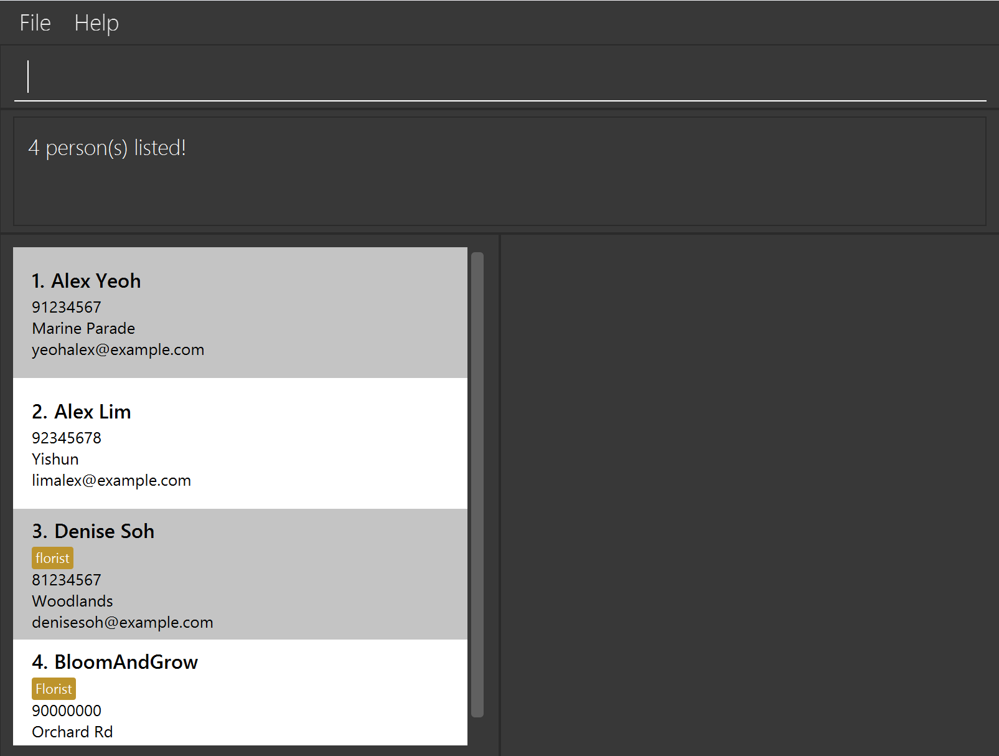

# Bridal Boss User Guide

**Bridal Boss** is a desktop app designed for small to medium-scale **wedding planners to streamline contact management**. 
It is optimized for use via a **Command Line Interface** (CLI) while still having the benefits of a Graphical User Interface (GUI). 
If you can type fast, Bridal Boss will help you manage contacts faster than traditional GUI apps, combining speed with functionality to enhance your wedding planning experience. 

<!-- * Table of Contents -->
<page-nav-print />

--------------------------------------------------------------------------------------------------------------------

## Quick start

1. Ensure you have Java `17` or above installed in your Computer.

1. Download the latest `.jar` file from [here](https://github.com/AY2425S1-CS2103T-T11-3/tp/releases).

1. Copy the file to the folder you want to use as the _home folder_ for your AddressBook.

1. Open a command terminal, `cd` into the folder you put the jar file in, and use the `java -jar BridalBoss.jar` command to run the application.<br>
   A GUI similar to the below should appear in a few seconds. Note how the app contains some sample data.<br>
   
1. At the top is the command box for users to enter their commands. The column on the left contains the list of client and vendor contacts while the right column contains a list of weddings. <br>

1. Type the command in the command box and press Enter to execute it. e.g. typing **`help`** and pressing Enter will open the help window.<br>
   Some example commands you can try:

   * `list` : Lists all contacts.

   * `add n/John Doe p/98765432 e/johnd@example.com a/John street, block 123, #01-01` : Adds a contact named `John` to Bridal Boss.

   * `view 3` : Views the 3rd contact shown in the current list.

   * `clear` : Deletes all contacts.

   * `exit` : Exits the app.

1. Refer to the [Features](#features) below for details of each command.

[↥ Back to Top](#bridal-boss-user-guide)

--------------------------------------------------------------------------------------------------------------------

## Common Scenarios

### Understanding the Address Book Structure

Bridal Boss manages two main types of entries:
1. **Contacts List**: Shows all people in your address book
    - Clients (people who have their own wedding)
    - Vendors (people who can be assigned to weddings)

2. **Weddings List**: Shows all weddings with their:
    - Wedding name
    - Client
    - Date (if specified)
    - Venue (if specified)
    - Assigned vendors

Here are some common scenarios to help you understand how to use Bridal Boss:
#### 1. Setting Up a New Client's Wedding
1. First, add the client as a contact:
   `add n/Sarah Chen p/91234567 e/sarah@example.com a/123 Orchard Road`
   [↗ See add command details](#adding-a-person-add)

2. Create their wedding:
   `addw n/Sarah's Garden Wedding c/Sarah Chen d/2024-12-25 v/Botanical Gardens`
   [↗ See addw command details](#adding-a-wedding-addw)

3. View the created wedding:
   `vieww Sarah`
   [↗ See vieww command details](#viewing-wedding-details-vieww)

#### 2. Managing Vendors for a Wedding
1. Add vendors as contacts:<br>
   `add n/John Doe p/91234567 e/john@photo.com a/456 River Valley r/photographer`<br>
   `add n/Mary Tan p/82345678 e/mary@flowers.com a/789 Garden Road r/florist`

2. Assign them to a wedding (use `list` first to see indices):<br>
   `assign John Doe w/1`<br>
   `assign Mary Tan w/1`<br>
   [↗ See assign command details](#assigning-a-person-assign)

3. Check wedding assignments:
   `vieww 1`

#### 3. Making Changes to Existing Entries
1. Update contact details:<br>
   `edit John Doe p/91234599       # Update phone number`<br>
   `edit Mary Tan a/100 New Road   # Update address`<br>
   [↗ See edit command details](#editing-a-person-edit)

2. Modify wedding details:<br>
   `editw w/1 d/2024-12-31         # Change date`<br>
   `editw w/1 v/New Venue          # Change venue`<br>
   [↗ See editw command details](#editing-a-wedding-editw)

#### 4. Finding and Filtering Contacts
1. Search by name (exact name match):
   `find john                      # Finds "John" or "John Doe"`
   [↗ See find command details](#finding-persons-by-name-find)

2. Filter by multiple criteria:<br>
   `filter r/photographer          # All photographers`<br>
   `filter n/John r/photographer   # Johns or photographers`<br>
   [↗ See filter command details](#filtering-persons-filter)

### Common Mistakes to Avoid

1. ❌ Creating a wedding without adding the client first
   `addw n/Beach Wedding c/John Doe   # Fails if John isn't a contact`

   ✅ Correct approach:<br>
   `add n/John Doe p/91234567 e/john@example.com a/123 Main St`<br>
   `addw n/Beach Wedding c/John Doe`

2. ❌ Trying to delete a client who has a wedding
   `delete John   # Fails if John has an active wedding`

   ✅ Correct approach:<br>
   `deletew 1     # Delete the wedding first`<br>
   `delete John   # Then delete the contact`

3. ❌ Assigning a client to their own wedding as vendor
   `assign Sarah Chen w/1    # Fails if wedding 1 is Sarah's wedding`

   ✅ Correct approach:
    - Clients cannot be vendors in their own wedding
    - Create a new contact if the same person is both client and vendor

### Quick Tips
- Use `list` frequently to see updated indices
- For name-based commands, use index if you get multiple matches
- Check [validation rules](#validation-rules) when adding/editing entries
- Check [general command format](#general-command-format) for command structure
- Check [general command details](#general-command-details) for detailed command usage
- View the [command summary](#command-summary) for quick reference

[↗ See more tips in FAQ section](#faq)

[↥ Back to Top](#bridal-boss-user-guide)

---

## Features

### General Command Details

Below are the detailed descriptions of each command, including examples, error messages, and important notes.

#### Viewing Help: `help`

Displays instructions on how to access the help page.

- **Format**: `help`

---

#### Adding a Person: `add`

Adds a new person to the address book.

- **Format**: `add n/NAME p/PHONE_NUMBER e/EMAIL a/ADDRESS [r/ROLE] [w/WEDDING_INDEX]...`
- **Notes**:
    - All fields except `[r/ROLE]` and `[w/WEDDING_INDEX]` are required.
    - A person can have either 0 or 1 role.
    - A person can be assigned to 0 or multiple weddings.
- **Validation**:
    - Ensure all fields meet the criteria specified in the [Validation Rules](#validation-rules).
- **Examples**:
    - `add n/John Doe p/98765432 e/johnd@example.com a/123 Street`
    - `add n/Betsy Crowe p/91234567 e/betsycrowe@example.com a/Tanglin Mall r/florist`
    - `add n/Betsy Crowe p/91234567 e/betsycrowe@example.com a/Tanglin Mall w/1 w/2` (assuming wedding list has at least 2 weddings)

---

#### Listing All Persons: `list`

Displays a list of all persons and weddings in the address book.

- **Format**: `list`

---

#### Editing a Person: `edit`

Edits the details of an existing person.

- **Formats**:
    - **By Index**: `edit INDEX [n/NAME] [p/PHONE] [e/EMAIL] [a/ADDRESS]`
    - **By Name**: `edit NAME [n/NAME] [p/PHONE] [e/EMAIL] [a/ADDRESS]`
- **Notes**:
    - At least one of the optional fields must be provided.
    - Existing values will be updated to the new values.
    - If multiple matches are found when using name-based format, the system will prompt for index.
- **Examples**:
    - `edit 1 p/91234567 e/johndoe@example.com`
        - Edits the phone number and email of the person at index 1.
    - `edit John Doe n/John Smith`
        - Changes the name of `John Doe` to `John Smith`.

---

#### Finding Persons by Name: `find`

Finds persons whose names contain any of the given keywords.

- **Format**: `find KEYWORD [MORE_KEYWORDS]`
- **Notes**:
    - Case-insensitive search.
    - Order of keywords does not matter.
    - Only the name is searched.
    - Only full words will be matched.
    - Returns persons matching at least one keyword (logical `OR` search).
- **Examples**:
    - `find John` returns `John` and `John Doe`.
    - `find alex david` returns `Alex Yeoh`, `David Li`.

---

#### Viewing a Contact: `view`

Displays detailed information about a specified person.

- **Formats**:
  - By Index: `view INDEX`
  - By Name: `view NAME`
    - `NAME` will be divided into separate keywords, using spaces to distinguish each keyword
- **Notes**:
    - Case-insensitive matching.
    - Matches contacts containing ALL the keyword(s) (logical `AND` search).
    - Wedding list is only updated when one unique person is found. 
    - When multiple matches are found, only the person list is updated.
- **Information Displayed**:
    - Personal details (name, phone, email, address).
    - Current role (if any).
    - Own wedding (if the person is a client).
    - Weddings where the person is assigned as a vendor (if any).
    - Wedding person owns (if any) will have an ```Own Wedding``` label.
- **Examples**:
    - `view Mike` displays details for `Mike`.
    - `view Alex Yeo` displays details for `Alex Yeo`.
<br>
*Viewing a contact with multiple matches: contact details are shown and weddings remain unfiltered*

---

#### Deleting a Person: `delete`

Deletes a specified person from the address book or removes wedding jobs assigned to specified person.

- **Formats**:
    - **By Index**: `delete INDEX`
    - **By Name**: `delete NAME`
- **Notes**:
    - **Deleting a person**:
        - If multiple matches are found when using name-based format, the system will prompt for index.
        - Cannot delete a client who has an active wedding.
          - Error: "Cannot delete this person as they are a client in a wedding. Please delete their wedding first."
        - Deleting a person will remove them from their assigned weddings.

- **Examples**:
    - `delete 2` deletes the person at index 2.
    - `delete Betsy` deletes Betsy if there's only one match.

---
  
#### Removing Wedding Jobs Assigned to a Person: `delete`

Removes wedding jobs assigned to specified person.

- **Formats**:
  - **By Index**: `delete INDEX [w/WEDDING_INDEX]...`
  - **By Name**: `delete NAME [w/WEDDING_INDEX]...`
- **Notes**:
  - **Removing wedding jobs assigned to a person**:
    - If multiple matches are found when using name-based format, the system will prompt for index.
    - Can remove multiple weddings jobs a person is assigned to.
    - Wedding indices must be valid and must refer to weddings that the specified person is already assigned to.
    - If no wedding indices are provided, the contact specified will be deleted.
- **Examples**:
  - `delete 1 w/1` removes wedding job at index 1 that person at index 1 is assigned to.
  - `delete Alice w/1 w/2` removes wedding jobs at index 1 and 2 assigned to Alice, if there's only one match to 'Alice'.

---

#### Clearing All Entries: `clear`

Clears all entries from the address book.

- **Format**: `clear`
- **Warning**:
    - This action cannot be undone.

---

#### Filtering Persons: `filter`

Filters and lists persons whose fields match the specified keywords.

- **Format**: `filter [n/NAME] [r/ROLE] [e/EMAIL] [p/PHONE] [a/ADDRESS]`
- **Notes**:
    - At least one field must be provided.
    - Parameters can be in any order.
    - Case-insensitive search.
    - Returns persons matching any of the fields (logical `OR` search).
- **Field-Specific Matching**:
    - **Name**: Allow partial matches.
    - **Role**: Requires exact role match.
    - **Email**: Requires substring email match.
    - **Phone**: Requires exact number match.
    - **Address**: Requires substring address match.
  - **Validation**:
    - Ensure all fields provided meet the criteria specified in the [Validation Rules](#validation-rules).
- **Examples**:
    - `filter n/John` returns persons with names containing `John`.
    - `filter n/Al Ye` returns persons with names containing both `Al` and `Ye`.
    - `filter r/vendor` returns persons with role `vendor`.
    - `filter e/john@gmail.com` returns persons with emails containing `john@gmail.com`.
    - `filter p/91234567` returns the person with phone number `91234567`.
    - `filter n/John r/vendor` returns persons with names containing `John` or with role `vendor`.
    - `filter e/john@gmail.com a/Jurong` returns persons with emails containing "john@gmail.com" or address containing "Jurong".<br>

Visual Example:
<br>
*`filter e/alex@gmail.com r/florist` Example of filtering results showing matched persons, weddings remain empty/unfiltered*

[↥ Back to Top](#bridal-boss-user-guide)

---

#### Wedding Management Commands

##### Adding a Wedding: `addw`

Adds a new wedding to the address book.

- **Format**: `addw n/WEDDING_NAME c/CLIENT [d/DATE] [v/VENUE]`
- **Notes**:
    - Wedding name (`n/`) and client (`c/`) are required.
    - Client can be specified by index or name.
        - If multiple matches are found when using name, the system will prompt for index.
        - Names are considered matched if they contain the inputted words, either together or separate (for more than one word names)
    - A client can have only one active wedding.
- **Validation**:
    - Ensure all fields meet the criteria specified in the [Validation Rules](#validation-rules).
- **Examples**:
    - `addw n/Beach Wedding c/1 d/2024-12-31 v/Sentosa Beach`
        - Adds a wedding named "Beach Wedding" for the client at index 1.
    - `addw n/Garden Wedding c/John Doe v/Botanical Gardens`
        - Adds a wedding for "John Doe" if there's only one match.<br>

Visual Example:<br>
<br>
*Example of successfully adding a new wedding with all fields specified*

---

##### Editing a Wedding: `editw`

Edits the details of an existing wedding.

- **Format**: `editw w/INDEX [n/NAME] [d/DATE] [v/VENUE]`
  - At least one optional field (`NAME`, `DATE`, `VENUE`) must be provided.

- **Notes**:
  - Client cannot be changed after creation. 
  - Existing values will be updated to the new values. 
  - Date and venue must adhere to validation rules specified in the [Validation Rules for Wedding Fields](#wedding-fields). 
  - Make use of `list` command to refresh the list with the updated information.
- **Examples**:
  - `editw w/1 n/Sunset Wedding`
    - Changes the name of the wedding at index 1 to "Sunset Wedding".
  - `editw w/2 d/2025-01-01 v/Grand Hotel`
    - Updates the date and venue of the wedding at index 2.

---

##### Viewing Wedding Details: `vieww`

Views the details of a wedding.

- **Formats**:
    - **By Index**: `vieww INDEX`
    - **By Keyword**: `vieww KEYWORD`
- **Notes**:
    - Keyword can be the wedding name.
    - Person list will only be updated when one unique wedding is found.
    - If multiple matches are found, the system will prompt for index.
    - Wedding list will be truncated to the matched wedding(s).
    - Use `list` to view all weddings again.
- **Information Displayed**:
    - Wedding name, client details, date, venue.
    - Assigned vendors.
    - Client of wedding will have a ```Client``` label.
- **Examples**:
    - `vieww 1` displays details of the wedding at index 1.
    - `vieww John` displays John's wedding if there's only one match.

---

##### Deleting a Wedding: `deletew`

Deletes a wedding from the address book.

- **Formats**:
    - **By Index**: `deletew INDEX`
    - **By Keyword**: `deletew KEYWORD`
- **Notes**:
    - Deleting a wedding removes the client-wedding relationship and all vendor assignments.
    - If multiple matches are found when using keyword, the system will prompt for index.
- **Examples**:
    - `deletew 2` deletes the wedding at index 2.
    - `deletew Beach Wedding` deletes the wedding named "Beach Wedding" if there's only one match.

---

#### Assigning a Person: `assign`

Assigns a role and/or weddings to a person.

- **Formats**:
    - **By Index**: `assign INDEX [r/ROLE] [w/WEDDING_INDEX]...`
    - **By Name**: `assign NAME [r/ROLE] [w/WEDDING_INDEX]...`
- **Notes**:
    - At least one of `[r/ROLE]` or `[w/WEDDING_INDEX]` must be provided.
    - **Role Assignment**:
        - Each person can have either 0 or 1 role at a time.
        - Assigning a new role replaces the existing role.
        - Role can be blank using `r/` to remove the role of a person.
    - **Wedding Assignment**:
        - Can assign a person to multiple weddings.
        - Wedding indices must be valid and refer to existing weddings.
        - Cannot assign the same person to the same wedding multiple times.
        - Cannot assign a client to their own wedding as a vendor.
- **Examples**:
    - `assign 1 r/florist`
        - Assigns the role "florist" to the person at index 1.
    - `assign 1 w/1 w/2`
        - Assigns the person at index 1 to weddings at indices 1 and 2.
    - `assign 1 r/`
      - Removes the role of person at index 1.
    -  `assign John Doe r/photographer w/2`
        - If there's only one match for "John Doe", assigns them the role "photographer" and to wedding at index 2.<br>

Visual Examples:<br>
**Error Example**:<br>
<br>
*Example of error when trying to assign a client to their own wedding*

**Success Example**:<br>
<br>
*Example of successfully assigning a person to a role*

---

#### Exiting the Program: `exit`

Exits the application.

- **Format**: `exit`

---

#### Saving the Data

- **Automatic Saving**:
    - Data is automatically saved after any command that modifies the data.
- **Storage Location**:
    - Data is saved as a JSON file at `[JAR file location]/data/addressbook.json`.

[↥ Back to Top](#bridal-boss-user-guide)

---

#### Editing the Data File

Advanced users can edit the data file directly to modify the address book data. However, exercise caution when doing so.

- **File Location**:
    - `[JAR file location]/data/addressbook.json`
- **Caution**:
    - **Backup First**:
        - Make a copy of the data file before editing.
    - **Validity**:
        - Incorrect file formats or invalid data can cause the application to discard all data and start with an empty data file upon the next run.
          - Changing ownWedding field of a person to 0 will only result in wedding having no client and would not corrupt the file.
          - However, changing the hashcode of the `weddingJobs` to an incorrect value will result in a corrupted file and restart the application with an empty data file.
- **Recommendation**:
    - Edit the data file only if you are confident in updating it correctly.

---

### Additional Notes

- **Using PDFs**:
    - When copying commands from a PDF, ensure that spaces and line-breaks are correctly maintained to avoid errors.
- **Error Messages**:
    - The application provides specific error messages to guide users in correcting their commands.
- **Case Sensitivity**:
  - Commands must be **lowercase** (`add, addw, edit, editw etc.`)
  - Parameters prefixes (`n/..., e/...` ) are **case-sensitive**.

[↥ Back to Top](#bridal-boss-user-guide)

### General Command Format

- **Command Structure**:
    - Commands are case-sensitive, i.e. must be in **lower-case only**. <br> e.g. `clear` will be accepted but `Clear` will not.
    - Parameters are case-insensitive unless specified.
    - For optimum viewing experience, restrict fields to 50 characters or less.
- **Parameters in `UPPER_CASE`** are to be supplied by the user.
    - e.g., in `add n/NAME`, `NAME` is a parameter to be replaced: `add n/John Doe`.
- **Optional Parameters** are enclosed in square brackets `[ ]`.
    - e.g., `n/NAME [r/ROLE]` can be `n/John Doe r/florist` or just `n/John Doe`.
- **Multiple Parameters**:
    - Parameters with `...` after them can be used multiple times (including zero times).
        - e.g., `[w/WEDDING_INDEX]...` can be used as ` ` (zero times), `w/1`, `w/1 w/2`, etc.
- **Flexible Order**:
    - Parameters can be in any order.
        - e.g., if the command specifies `n/NAME p/PHONE_NUMBER`, you can input `p/PHONE_NUMBER n/NAME`.
- **Extraneous Parameters**:
    - Commands that do not take in parameters (e.g., `help`, `list`, `exit`, and `clear`) will ignore any extra parameters.
        - e.g., `help 123` will be interpreted as `help`.
- **Client Parameter (`c/`)**:
    - In wedding commands, accepts either an index number or a name.
        - e.g., `c/1` or `c/John Doe` are both valid.
- **Date Format**:
    - Dates must be specified in `YYYY-MM-DD` format.
        - e.g., `d/2024-12-31` for December 31st, 2024.
- **Role Parameter (`r/`)**:
    - Must be a single-word alphanumeric string (no spaces or special characters).
        - e.g., `r/photographer` is valid, but `r/wedding planner` is not.
- **Email Addresses**:
    - Must follow strict validation rules (see [Validation Rules](#validation-rules)).
- **Phone Numbers**:
    - Must start with 6, 8 or 9 and be exactly 8 digits long, i.e. valid Singaporean number.
- **Copying Commands**:
    - When copying commands that span multiple lines (e.g., from a PDF), ensure that spaces are correctly included.
---

### Validation Rules

#### Names

- **Allowed Characters**:
    - Alphabets, spaces, apostrophes (`'`), and hyphens (`-`).
- **Restrictions**:
    - Cannot be blank.
    - Maximum length of 70 characters.
- **Examples**:
    - `John Doe`, `Mary-Jane`, `O'Connor`.

#### Phone Numbers

- **Format**:
    - Must start with 6, 8 or 9.
    - Exactly 8 digits long.
    - Numbers only; no spaces or special characters.
- **Uniqueness**:
    - Each phone number must be unique in the system.
- **Examples**:
    - `91234567`, `82345678`, `67891234`.

#### Email Addresses

- **Format**:
    - Must be in the form `local-part@domain`
- **Local-part Rules**:
    - Can contain alphanumeric characters and `+`, `_`, `.`, `-`
    - Cannot start or end with a special character
    - Example: `user.name`, `john.doe-123`, `user+tag`
- **Domain Rules**:
    - Domain labels (parts between dots) must:
        - Start with an alphanumeric character 
        - End with at least 2 alphanumeric characters
        - Can contain hyphens between alphanumeric characters
        - Each label must contain at least one character
    - Examples of valid domains:
        - `example.com`
        - `my-company.com`
        - `school.edu.sg`
        - `sub1.sub2.example.com`
- **Uniqueness**:
    - Each email must be unique in the system
- **Valid Examples**:
    - `john@example.com`
    - `user.name+tag@my-company.com`
    - `sales@company-name.com.sg`
- **Invalid Examples**:
    - `user@e-a` (does not end with 2 alphanumeric characters)
    - `user@-domain.com` (domain label starts with hyphen)
    - `user@domain-.com` (domain label ends with hyphen)
    - `user@.com` (domain label must contain at least one alphanumeric character)
#### Roles

- **Format**:
    - Single-word alphanumeric string.
- **Restrictions**:
    - No spaces or special characters.
    - Case-insensitive for matching.
- **Examples**:
    - `photographer`, `florist`, `coordinator`.

#### Wedding Fields

- **Wedding Name**:
    - Cannot be blank
    - Must follow same restrictions as Person names:
      - Maximum 70 characters
      - Can only contain alphabets, spaces, apostrophes (') and hyphens (-)
- **Date**:
    - Must be in `YYYY-MM-DD` format
    - Must be a valid calendar date 
    - Optional field - only validated when v/ prefix is provided

- **Venue**:
    - Optional field - only validated when v/ prefix is provided
    - When provided, cannot be blank or consist only of whitespace
- **Client**:
    - A client can have only one wedding at a time.

#### Addresses

- **Restrictions**:
    - Cannot be blank.
    - Can contain any characters except leading/trailing spaces.
    - No length restriction.

---

### Index vs. Name-Based Commands

Certain commands (`edit`, `delete`, `deletew`, `view`, `vieww`, `assign`) support both index-based and name-based formats.

#### Index Format

- **Usage**:
  - Uses the position number from the displayed list.
  - Only positive non-zero integers are accepted.
    - **Format**: `COMMAND INDEX [parameters]`
    - **Example**:
      - `edit 1 n/John Smith`

#### Name-Based Format

- **Usage**:
  - Uses the person's or wedding's name.
    - **Format**: `COMMAND NAME [parameters]`
      - **Behavior**:
        - **Case-insensitive matching**.
        - **Full name matching**: Searches for names containing the entire keyword (not necessarily as substring).
        - **Single Match**:
          - Command executes immediately.
        - **Multiple Matches**:
          - System displays a list of matching entries with indices.
          - User must re-enter the command using the index.
        - **No Matches**:
          - Displays "No matches found" message.
- **Examples**:<br>
  <br>
  *When multiple matches are found, the system displays a list with indices*

   <br>
  *User selects a specific index to complete the command*

[↥ Back to Top](#bridal-boss-user-guide)

---

### Cross-Reference Validations

#### Client-Wedding Relationship

- **One Wedding per Client**:
    - A client can have only one wedding at a time.
- **Deletion Restrictions**:
    - Cannot delete a client who is associated with an active wedding.
- **Assignment Restrictions**:
    - Cannot assign a client as a vendor to their own wedding.

#### Person-Wedding Relationships

- **Vendor Assignments**:
    - A person can be assigned to multiple weddings as a vendor.
    - Cannot assign the same person to the same wedding multiple times.
    - A person without a role can still be assigned to a wedding.
- **Deletion Effects**:
    - Deleting a wedding removes all vendor assignments related to that wedding.
    - Can delete a vendor who is assigned weddings

#### Role-Person Relationship

- **Single Role per Person**:
    - Each person can have at most one role.
    - Assigning a new role replaces any existing role.

---

## 📚 **FAQ**

**Q**: **How do I transfer my data to another Computer?**  
**A**: 🖥️ Install the app on the other computer and overwrite the empty data file it creates with the file that contains the data of your previous AddressBook home folder.

---

**Q**: **How do I input the name of a person with `d/o` or `s/o` in it?**  
**A**: ✏️ You can input the name as `son of` or `daughter of` respectively.

---

**Q**: **How do I add a wedding for an existing client?**  
**A**: First, use `list` to see all contacts. Then, use either `addw n/WEDDING_NAME c/INDEX` using the client's index number, or `addw n/WEDDING_NAME c/CLIENT_NAME` using the client's name.

---

**Q**: **What happens if I try to delete a client who has a wedding?**  
**A**: ⚠️ The system will prevent you from deleting the client and show an error message. You must first delete the client's wedding before deleting the contact.

---

**Q**: **Can I change a wedding's client after creation?**  
**A**: ❌ No, a wedding's client cannot be changed after creation. You would need to create a new wedding for the different client.

---

**Q**: **Can a client have multiple weddings?**  
**A**: 📅 No, each client can only have one wedding at a time.

---

**Q**: **Can I assign multiple roles to a person?**  
**A**: 🚫 No, each person can only have at most one role at a time. Assigning a new role will replace the existing one.

---

**Q**: **What happens when I delete a wedding?**  
**A**: Deleting a wedding will remove all vendor assignments to that wedding and remove the client-wedding relationship. The contacts themselves are not deleted.

---

**Q**: **Can I use the same phone number or email for different contacts?**  
**A**: 📛 No, phone numbers and email addresses must be unique in the system. You'll receive an error message if you try to add or edit a contact with duplicate information.

---

**Q**: **What happens if I find multiple contacts with the same name?**  
**A**: When using name-based commands, if multiple matches are found, the system will show you a list of matching contacts with their indices. You'll need to use the index number to specify which contact you want to work with.

---

**Q**: **How can I see all weddings a vendor is assigned to?**  
**A**: Use the `view` command with the vendor's name or index. The system will show all weddings they are assigned to as part of their contact details.

---

**Q**: **Can I search for contacts by partial name match?**  
**A**: ✅ Yes, use the `find` command which matches partial names. However, note that it matches whole words only (e.g., "John" will match "John Doe" but not "Johnny").

---

**Q**: **What's the difference between `find` and `filter` commands?**  
**A**: `find` and `filter` have different search capabilities:
- **`find`**:
    - 🔍 Searches only names
    - Supports partial word matches
    - Allows multiple name searches (e.g., `find alex david` returns both `Alex Yeoh` and `David Li`)
    - Uses OR logic (matches any keyword)

- **`filter`**:
    - Can search across multiple fields (name, role, email, phone, address)
    - Requires exact word matches for names and roles
    - Each field can only have one value - if you specify multiple values for the same field, only the last one is used
        - e.g., `filter n/John n/Peter` will only search for "Peter"
    - Uses OR logic between different fields
        - e.g., `filter n/John r/vendor` returns contacts with either name "John" OR role "vendor"
    - Cannot search for multiple names like `find` does - must use exact single name

---

**Q**: **How do I remove a role from a contact?**  
**A**: Roles can be removed using the assign command.  
&nbsp;&nbsp;&nbsp;&nbsp;Example: `assign 1 r/` to remove the role of person at index 1.

---

**Q**: **What happens to wedding assignments if I edit a contact's details?**  
**A**: ✏️ Editing a contact's basic details (name, phone, email, address) does not affect their wedding assignments or role. These relationships remain intact.

---

**Q**: **Can I export my contact and wedding data?**  
**A**: While there's no direct export command, you can copy the data file (addressbook.json) which contains all your data. This file is located in the same folder as the application.

--------------------------------------------------------------------------------------------------------------------

## Known issues

1. **When using multiple screens**, if you move the application to a secondary screen, and later switch to using only the primary screen, the GUI will open off-screen. The remedy is to delete the `preferences.json` file created by the application before running the application again.
2. **If you minimize the Help Window** and then run the `help` command (or use the `Help` menu, or the keyboard shortcut `F1`) again, the original Help Window will remain minimized, and no new Help Window will appear. The remedy is to manually restore the minimized Help Window.
3. Persons are able to have multiple weddings on the same day.
4. Client of a wedding can be assigned another wedding job (for a different wedding) on the same day.
5. Long fields (more than 50 characters) may not display fully in the GUI.
6. Incorrect error message shown when the number entered is too large.
7. User may not be able to "unclick" after clicking on a field on the GUI.
8. User may be able to add weddings that are in the past.
9. Adjusting the window size may cause the GUI to display to hide wedding details
[↥ Back to Top](#bridal-boss-user-guide)

--------------------------------------------------------------------------------------------------------------------

## Command summary

| Action      | Format, Examples                                                                                                                                                                                                                               |
|-------------|------------------------------------------------------------------------------------------------------------------------------------------------------------------------------------------------------------------------------------------------|
| **Add**     | `add n/NAME p/PHONE_NUMBER e/EMAIL a/ADDRESS [r/ROLE] [w/WEDDING_INDEX]... …​` <br> e.g., `add n/James Ho p/92224444 e/jamesho@example.com a/123, Clementi Rd, 1234665 r/florist w/1 w/2`                                                      |
| **Clear**   | `clear`                                                                                                                                                                                                                                        |
| **Delete**  | #1: `delete INDEX [w/WEDDING_INDEX]...` or <br> #2: `delete NAME [w/WEDDING_INDEX]...`<br> e.g., `delete 1`, `delete Alex`, `delete Alex Tan`, `delete 1 w/1`, `delete Alex w/1 w/2`                                                           |
| **Edit**    | #1: `edit INDEX [n/NAME] [p/PHONE_NUMBER] [e/EMAIL] [a/ADDRESS]` or <br> #2: `edit NAME [n/NAME] [p/PHONE_NUMBER] [e/EMAIL] [a/ADDRESS]`<br> e.g.,`edit 2 n/James Lee e/jameslee@example.com`, `edit James n/James Lee e/jameslee@example.com` |
| **View**    | #1: `view NAME` or <br> #2: `view INDEX` e.g., `view Alex`, `view 1`                                                                                                                                                                           |
| **Find**    | `find KEYWORD [MORE_KEYWORDS]`<br> e.g., `find James Jake`                                                                                                                                                                                     |
| **Filter**  | `filter [n/NAME] [p/PHONE_NUMBER] [e/EMAIL] [a/ADDRESS] [r/ROLE]`<br> e.g., `filter r/friends`                                                                                                                                                 |
| **View**    | `view KEYWORD`<br> e.g., `view Alex`, `view Alex Tan`                                                                                                                                                                                          |
| **List**    | `list`                                                                                                                                                                                                                                         |
| **Addw**    | `addw n/WEDDING_NAME c/CLIENT [d/DATE] [v/VENUE]` <br> e.g., `addw n/Beach Wedding c/1 d/2024-12-31 v/Sentosa Beach`                                                                                                                           |
| **Editw**   | `editw w/INDEX [n/NAME] [d/DATE] [v/VENUE]`<br> e.g., `editw w/1 d/2024-12-31 v/Garden Venue`                                                                                                                                                  |
| **Vieww**   | `vieww INDEX` or `vieww KEYWORD`<br> e.g., `vieww 1`, `vieww John`                                                                                                                                                                             |
| **Deletew** | #1: `deletew INDEX` or <br> #2: `deletew KEYWORD`<br> e.g., `deletew 1`, `deletew Beach Wedding`                                                                                                                                               |
| **Assign**  | `assign INDEX [r/ROLE] [w/WEDDING_INDEX]...` or `assign NAME [r/ROLE] [w/WEDDING_INDEX]...`<br> e.g., `assign 1 r/vendor`, `assign John Doe r/photographer w/1 w/2`, `assign 1 r/`                                                             |
| **Help**    | `help`                                                                                                                                                                                                                                         |
| **Exit**    | `exit`                                                                                                                                                                                                                                         |

[↥ Back to Top](#bridal-boss-user-guide)
