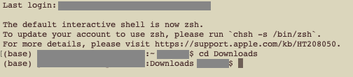
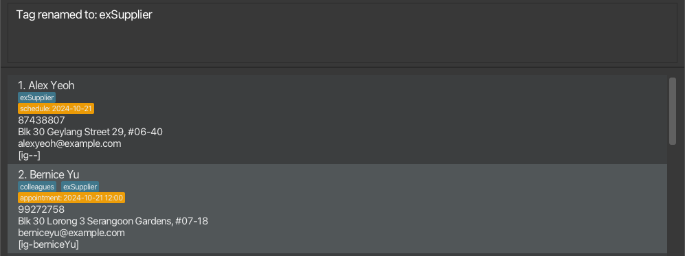
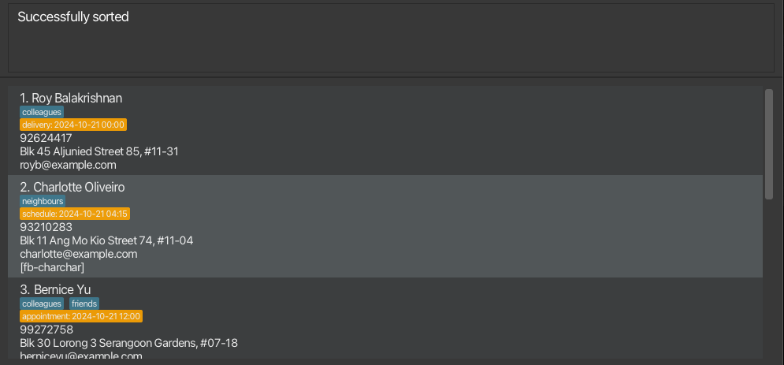
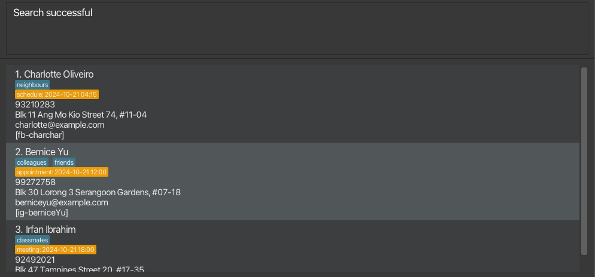

Own a home-based nail salon? Or are you a private tutor? Perhaps a single-person bakery?
Is the amount of contacts to manage becoming overwhelming? You've come to the right place!

BlitzBiz is a **desktop app for managing contacts** for micro-business owners.
As long as you are comfortable typing, BlitzBiz can get your contact management tasks done faster than traditional point-and-click apps.
BlitzBiz is capable of tracking multiple modes of contact and schedule related matters, if required.

* Table of Contents
{:toc}

--------------------------------------------------------------------------------------------------------------------

## Quick start

1. Ensure you have Java `17` or above installed in your computer (the Oracle version can be accessed [here](https://www.oracle.com/java/technologies/downloads/#jdk23-windows)).
For Mac users, please ensure you have this specific distribution, which can be installed by following this guide [here](https://se-education.org/guides/tutorials/javaInstallationMac.html).

2. Download the latest `.jar` file from [here](https://github.com/AY2425S1-CS2103T-W12-1/tp/releases).

3. Copy the file to the folder you want to use as the _home folder_ for your BlitzBiz application.

4. Open a command terminal. This can be done by accessing the Terminal Application on Mac or Powershell on Windows.

5. Use the command `cd [DIRECTORY]` into the folder you put the jar file in.
For example, if the jar file was stored in the `Downloads` folder, the command will be as follows.

6. Use the command `java -jar BlitzBiz.jar` to run the application. 
   A GUI similar to the below should appear in a few seconds. Note how the app contains some sample data. 
   

7. Type the command in the command box and press Enter to execute it. e.g. typing **`help`** and pressing Enter will open the help window. 
   Some example commands you can try:

   * `list` : Lists all contacts.

   * `add n/John Doe p/98765432 e/johnd@example.com a/John street, block 123, #01-01` : Adds a contact named `John Doe` to the list of contacts in BlitzBiz.

   * `delete 3` : Deletes the 3rd contact shown in the current list.

   * `clear` : Deletes all contacts.

   * `exit` : Exits the app.

8. Refer to the [Commands Summary](#command-summary) below for a quick overview of all provided commands, their formats and some examples.

9. Refer to the [Features](#features) below for details of each command.

--------------------------------------------------------------------------------------------------------------------

## Features

**:information_source: Notes about the command format:** 

* Words in `UPPER_CASE` are the parameters to be supplied by the user. 
  e.g. in `add n/NAME`, `NAME` is a parameter which can be used as `add n/John Doe`.

* Items in square brackets are **optional**. 
  e.g. `n/NAME [t/TAG]` can be used as `n/John Doe t/friend` or as `n/John Doe`.

* Items in angular brackets means **at least one** of the items must be provided. 
  e.g. `<p/PHONE_NUMBER a/ADDRESS>` can be used as `p/91234567`, `a/My Street`, or `p/91234567 a/My Street`, but not ` ` (both arguments are missing).  

* Items together in curly square brackets means **one and only one** of them must be given as input. 
  e.g. `{n/NAME t/TAG}` can be used as `n/John Doe` or as `t/friends`.

* Items with `…`​ after them can be used multiple times including zero times. 
  e.g. `[t/TAG]…​` can be used as ` ` (i.e. 0 times), `t/friend`, `t/friend t/family` etc.

* Parameters can be in any order. 
  e.g. if the command specifies `n/NAME p/PHONE_NUMBER`, `p/PHONE_NUMBER n/NAME` is also acceptable.

* Extraneous parameters for commands that do not take in parameters (such as `help`, `list`, `exit` and `clear`) will be ignored. 
  e.g. if the command specifies `help 123`, it will be interpreted as `help`.

* If you are using a PDF version of this document, be careful when copying and pasting commands that span multiple lines as space characters surrounding line-breaks may be omitted when copied over to the application.

### Contact Management

This segment introduces functions that are involved with adding, editing or deleting contacts and their details.
To better understand the constraints of the different fields involved, please head over to our [Argument Constraints Summary](#argument-constraints-summary).
Don't worry, you can quickly navigate back to the command you were at by clicking the hyperlink in the `Relevant Commands` column!

Jump over to [Viewing and Searching](#viewing-and-searching) or [Utility Features](#utility-features)

#### Adding a person : `add`

Met someone new and important for your business? Save their contact with our `add` feature!

Format: `add n/NAME <p/PHONE_NUMBER e/EMAIL a/ADDRESS cs/CAROUSELL_HANDLE fb/FACEBOOK_HANDLE ig/INSTAGRAM_HANDLE> [sn/SCHEDULE_NAME] [sd/SCHEDULE_DATE] [st/SCHEDULE_TIME] [t/TAG]…​`

**:information_source: Notes about the `add` command:** 

* A contact **must** have a name.
* Contacts with duplicate names (exact matches) are strictly not allowed.
* A contact **must** have **at least one** of phone, email, address, or any social media handle
  * Social media handles consists of only Carousell, Facebook and Instagram.
  * Note the leading (at the front) and trailing (at the back) whitespaces (spaces) will be removed for each argument. After the removal of the whitespaces, if the resulting argument provided is an empty string, the parameter is treated as not being provided
  * E.g. `a/ ` (address provided is a whitespace character ` `), after removing the whitespaces, the address provided is an empty string. The address parameter is then deemed to not have been provided.
* Each contact can have **at most one** social media handle
  * If multiple social media handles are provided in the `add` command, only the first in the order of (Carousell, Facebook, Instagram) will be added.
  * E.g. if a handle for Carousell, `cs/CAROUSELL_HANDLE`, and Instagram, `ig/INSTAGRAM_HANDLE`, was provided in this command, the handle for Carousell will be taken instead of the handle for Instagram.
* Adding a schedule is optional, but if a schedule is added, it **must** have a schedule date.
  * If a schedule date is not provided, the fields of schedule name, `sn`, and schedule time, `st` will be ignored.
* For more details on the argument's constraints, head over to [Argument Constraints Summary](#argument-constraints-summary)

:bulb: **Tip:** A person can have any number of tags (including 0)

Examples:
* Adding a contact with multiple fields, such as phone number, email address, physical address.  
`add n/John Doe p/98765432 e/johnd@example.com a/John Street, Block 123, #01-01`
* Adding a contact with only a social media handle. Tag is added to contact as well.  
`add n/Adam An t/customer ig/theAdamAn`
* Adding a contact with a schedule.  
`add n/Danny t/student p/91234567 sd/2024-12-12 st/16:00`

#### Editing a person : `edit`

Someone changed their contact information? Edit it using our `edit` feature!

Format: `edit INDEX <n/NAME p/PHONE e/EMAIL a/ADDRESS t/TAG…​>`

**:information_source: Notes about the `edit` command:** 

* Edits the person at the specified `INDEX`.
The index refers to the index number shown in the displayed person list.
View our [Viewing and Searching](#viewing-and-searching) section for more information.
The index **must be a positive integer** 1, 2, 3, …​.
* **At least one** of the fields must be provided.
* Existing values will be updated to the input values.
* When editing tags, the existing tags of the person will be removed i.e. adding of tags is not cumulative.
* You can remove all the person’s tags by typing `t/` without
  specifying any tags after it.
* For more details on the argument's constraints, head over to [Argument Constraints Summary](#argument-constraints-summary)

:exclamation: **Caution:**
You **cannot** edit schedule and social media information using the `edit` command.
Please use the [`schedule`](#scheduling-contacts--schedule) to edit schedule information and the [`socialMedia`](#adding-social-media--socialmedia) commands to edit social media information instead.

Examples:
* Edit the phone number and email address of the 1st person to be `91234567` and `johndoe@example.com` respectively.  
`edit 1 p/91234567 e/johndoe@example.com`
* Edit the name of the 2nd person to be `Betsy Crower` and clears all existing tags.  
`edit 2 n/Betsy Crower t/`

#### Adding Social Media : `socialMedia`

Adds or updates the social media handle to an existing person.
Perfect for contacts who keep changing their handles.

Format: `socialMedia INDEX [ig/USERNAME] [fb/USERNAME] [cs/USERNAME]`

**:information_source: Notes about the `socialMedia` command:** 

* `INDEX` refers to the number shown in the displayed person list, and is a positive integer, starting from 1.  
  View our [Viewing and Searching](#viewing-and-searching) section for more information.
* Contacts will have their social media handle displayed as `[ig-igusername]` or `[fb-fbusername]` or `[cs-csusername]`.
* `ig`,`fb`, and `cs` is used to represent Instagram, Facebook, and Carousell handles respectively.
* If the contact already has an existing social media handle, their handle will be updated.
* Hence, we can only add one social media handle to each contact.
* Handles must be non-empty, have a limit of 30 characters,and consist only of alphanumeric characters, or `-`, `_` and `.`.
* If multiple handles are entered, only the last handle will be accepted.  
  e.g., `socialMedia 1 ig/first cs/second` will only add the handle `[cs-second]` to the user.

Examples:
*  Updates the first contact Alex's social media to `[cs-alexsells]`.  
   `socialMedia 1 cs/alexsells`  
   

#### Scheduling Contacts : `schedule`

Have an appointment with a contact? Or are you expecting a delivery from a supplier?
Add a schedule to contact and give it a name based on your requirements!

Format: `schedule INDEX [sn/SCHEDULE_NAME] [sd/SCHEDULE_DATE] [st/SCHEDULE_TIME]`

**:information_source: Notes about the `schedule` command:** 

* A schedule will only be valid if it has a `SCHEDULE_DATE`. `SCHEDULE_NAME` and `SCHEDULE_TIME` will not be displayed unless a schedule has a `SCHEDULE_DATE`.
* `INDEX` refers to the number shown in the displayed person list, and is a positive integer, starting from 1.  
  View our [Viewing and Searching](#viewing-and-searching) section for more information.
* If **all** the optional parameters are omitted and the contact has an existing schedule, the existing schedule will be **removed**.
* If the provided contact **does not have an existing schedule**, the `schedule` command **must** be provided with at least `SCHEDULE_DATE` to attach a schedule to the contact.
* If the provided contact **has an existing schedule**, the provided parameters will overwrite the existing schedule's parameters and keep the omitted parameters unchanged.
* `SCHEDULE_NAME` must strictly be alphanumerical.
* `SCHEDULE_DATE` must be in the format `yyyy-MM-dd`.
* `SCHEDULE_TIME` must be in the format `HH:mm`.

:exclamation: **Caution:**

When performing the [`search`](#search-persons-by-schedule-range--search) command, contacts with an existing schedule,
but no `SCHEDULE_TIME` provided will have their schedule time's treated as `00:00`.

Examples:
* Schedules an appointment on 2024-10-22 at 16:00 for the contact at index 1  
`schedule 1 sn/appointment sd/2024-10-22 st/16:00`  
  
* Clears the schedule for the contact at index 1, if any.  
`schedule 1`  
  

#### Renaming a Tag : `renameTag`

Renames all occurrences of an existing tag in the address book, if possible.
Great for changing the relationship of a group of contacts at one time!

Format: `renameTag ot/OLDTAG nt/NEWTAG`

**:information_source: Notes about the `renameTag` command:** 

* Renames the tags called `OLDTAG` to `NEWTAG`.
* Contacts with the tag `OLDTAG` will now have `NEWTAG`, with `OLDTAG` removed
* If `OLDTAG` is not an existing tag, `[OLDTAG] tag is not found` will be returned.
* If there are any contacts with both `[OLDTAG]` and `[NEWTAG]`, the `[OLDTAG]` will not be renamed as this will lead to duplicated tags.

Examples:
* Suppose we have a group of contacts with an existing tag `supplier`. We want to update all of these tags to `exSupplier`.  
`renameTag ot/supplier nt/exSupplier`  

#### Deleting a person : `delete`

Deletes the specified person from the address book.

Format: `delete INDEX`

**:information_source: Notes about the `delete` command:** 

* Deletes the person at the specified `INDEX`.
* The index refers to the index number shown in the displayed person list.
* The index **must be a positive integer** 1, 2, 3, …​

  Examples:
* `list` followed by `delete 2` deletes the 2nd person in the address book.
* `find Betsy` followed by `delete 1` deletes the 1st person in the results of the `find` command.

### Viewing and Searching

This segment describes functions that help with finding and looking for a specific contact or group of contacts.
For commands that involve providing an `INDEX`, such as `edit`, `schedule`, `socialMedia` and `delete`, modifying the displayed list is crucial for editing the correct contact.

Jump over to [Contact Management](#contact-management) or [Utility Features](#utility-features)

#### Listing all persons : `list`

Shows a list of all persons in the address book.
Perfect for viewing all contacts after performing [`filter`](#filter-persons-by-tag--filter), [`search`](#search-persons-by-schedule-range--search) or [`find`](#locating-persons-by-name--find)!

:bulb: **Tip:** Sometimes some of the commands in this section can return an empty list.
Use the [`list`](#listing-all-persons--list) command to view all contacts again!

Format: `list`

#### Sort persons by name : `sort`

Sorts and displays the list of persons by schedule or name alphabetically in either ascending or descending order.

Format: `sort {n/[ORDER], sch/[ORDER]}`

**:information_source: Notes about the `sort` command:** 

* `[ORDER]` can be either "asc" / "ascending" or "desc" / "descending" (case-insensitive).
* If no order is provided, persons will be sorted in ascending order by default.
* Contact list will be sorted alphabetically by name with `n/` and by schedule with `sch/`.
* If the list is filtered/searched before executing the sort command, it will display the sorted filter/search list.
* Executing the `list` function after will show the sorted full list.
* When sorting by schedules:
    1. Contacts with no schedules will appear at the end of the list.
    2. Contacts with a date but no time as schedule will be sorted under the assumption that their time is 00:00.

Examples:
* Sort by persons names alphabetically in ascending order  
  `sort n/`
* Sort by schedule in ascending order.  
  `sort sch/ascending`  
  

#### Filter persons by tag : `filter`

Filters the list of contacts and displays those with the provided tag(s).
Use this feature to view all contacts with the same group of tag(s).

Format: `filter [t/TAG]...`

**:information_source: Notes about the `filter` command:** 

* The filter is **case-sensitive**.
* Filters for users whose tags contains all the input tags.
* The tag provided must only contain alphanumeric characters
* If the provided tag(s) does not match any contact, an empty list will be shown.

Examples:
* `filter t/friends t/colleagues` will filter for contacts that has both tags `friends` and `colleagues`. In this example, only one contact has both tags provided. 
  

#### Locating persons by name : `find`

Finds persons whose **names** contain any of the given keywords.
Great if you know who exactly you want to find!

Format: `find KEYWORD [MORE_KEYWORDS]`

**:information_source: Notes about the `find` command:** 

* The search is case-insensitive. e.g. `hans` will match `Hans`
* The order of the keywords does not matter. e.g. `Hans Bo` will match `Bo Hans`
* Only the name is searched.
* Only full words will be matched e.g. `Han` will not match `Hans`
* Persons matching at least one keyword will be returned (i.e. `OR` search).
  e.g. `Hans Bo` will return `Hans Gruber`, `Bo Yang`

Examples:
* `find John` returns `john` and `John Doe`
* `find alex david` returns `Alex Yeoh`, `David Li` 
  

#### Search persons by schedule range : `search`

Need to know who you have a schedule with this week?
Use our `search` feature, which searches for a list of persons within a given range of schedule.

Format: `search [b/START_DATETIME] [en/END_DATETIME]`

**:information_source: Notes about the `search` command:** 

* `START_DATETIME` and `END_DATETIME` must adhere to the datetime format yyyy-MM-dd HH:mm
* Either `[b/START_DATETIME]` or `[en/END_DATETIME]` or both has to be provided
* It will search for schedules between the given `[b/START_DATETIME]` and `[en/END_DATETIME]`
* If `[b/START_DATETIME]` is not provided, it will search for all schedules that is before or equals to `[en/END_DATETIME]`
* If `[en/END_DATETIME]` is not provided, it will search for all schedules that is after or equals to `[b/START_DATETIME]`
* Persons with no schedule given will not appear in the search results
* Persons with only a date as a schedule but not time will be searched under the assumption that time is 00:00
* Search result will be inclusive of the beginning time and end time
* If no matching result, an empty list will be provided.

Examples:
* Search for the list of persons with schedules after 2024-11-11 12:00.  
`search b/2024-11-11 12:00`
* Search for the list of persons with schedules before 2024-11-12 12:00.  
`search en/2024-11-12 12:00`
* Search for the list of persons with schedules between 2024-10-21 04:00 and 2024-10-27 23:59.  
`search b/2024-10-21 04:00 en/2024-10-27 23:59`  
  

### Utility Features

This segment describes features of BlitzBiz that helps users with using the app in general.

Jump over to [Contact Management](#contact-management) or [Viewing and Searching](#viewing-and-searching)

#### Viewing help : `help`

Need to quickly access this user guide while using BlitzBiz? Get **help** with this one simple command!

Format: `help`

#### Restoring a deleted person : `restore`

Used `delete` on the wrong person by accident? Well don't worry get their information back with the `restore` command!

Format: `restore`

**:information_source: Notes about the `restore` command:** 

* Restores the last person deleted from the address book by the [`delete`](#deleting-a-person--delete) command.
* Only works if person has been deleted by the 'delete' command within the session.
* Does not work if same person has been added to the address book after deletion using add command.

Examples:
* Restore the most recently deleted person, in this case, the 2nd person Bernice Yu.  
`restore`  
  

#### Backing up save file : `backup`

Worried about your save file? Create a backup file and keep it anywhere you want!

Format: `backup`

**:information_source: Notes about the `backup` command:** 

* Creates a backup save of the current BlitzBiz data
* Backup BlitzBiz data will be saved as a JSON file at `[JAR file location]/backup/addressbook.json`.
* If an `addressbook.json` file already exists in the backup folder it will be overwritten.
* The backup file can be used in order to restore the BlitzBiz data in case of data loss, or to transfer the data to another device.
* Users can safely move or copy the backup file to another device, without worrying about negative consequences.

#### Clearing all entries : `clear`

Clears all your contacts, great for a fresh start!

:exclamation: **Caution:**

Clears **all** entries from the BlitzBiz app.

Format: `clear`

#### Exiting the program : `exit`

Format: `exit`

### Data Management

#### Saving the data

BlitzBiz data is saved in the hard disk automatically after any command that changes the data. There is no need to save manually.

#### Editing the data file

BlitzBiz data is saved automatically as a JSON file `[JAR file location]/data/addressbook.json`. Advanced users are welcome to update data
directly by editing that data file.

:exclamation: **Caution:**
If your changes to the data file makes its format invalid, BlitzBiz will discard all data and start with an empty data file at the next run. Hence, it is recommended to make a backup of the file using the backup command  before editing it. 
Furthermore, certain edits can cause the app to behave in unexpected ways (e.g., if a value entered is outside of the acceptable range). Therefore, edit the data file only if you are confident that you can update it correctly.

## Upcoming features

### Mass Adding / Bulk Importing of Contacts
Have a whole list of contacts to add? We will introduce a bulk importing feature in our next iteration!

### Priority Scheduling
Want to ensure you do not schedule multiple schedules on the same date and time?
We will add more flexibility to our `schedule` feature next!

### Country Code in Phone Numbers
Have contacts from different parts of the world?
We aim to bring even more flexibility for the phone numbers of contacts by allowing you to key in country codes in the app's next iteration!

--------------------------------------------------------------------------------------------------------------------

## FAQ

**Q**: How do I transfer my data to another Computer? 
**A**: To safely transfer your data, install the app in the other computer. Use the `backup` command on your original computer and transfer the `addressbook.json` file at `[JAR file location]/backup`
to `[JAR file location]/data` in your new computer.

--------------------------------------------------------------------------------------------------------------------

## Known issues

1. **When using multiple screens**, if you move the application to a secondary screen, and later switch to using only the primary screen, the GUI will open off-screen. The remedy is to delete the `preferences.json` file created by the application before running the application again.
2. **If you minimize the Help Window** and then run the `help` command (or use the `Help` menu, or the keyboard shortcut `F1`) again, the original Help Window will remain minimized, and no new Help Window will appear. The remedy is to manually restore the minimized Help Window.

--------------------------------------------------------------------------------------------------------------------

## Command summary

| Action                                                  | Format, Examples                                                                                                                                                                                                                                                                            |
|---------------------------------------------------------|---------------------------------------------------------------------------------------------------------------------------------------------------------------------------------------------------------------------------------------------------------------------------------------------|
| **[Add](#adding-a-person--add)**                        | `add n/NAME <p/PHONE_NUMBER e/EMAIL a/ADDRESS cs/CAROUSELL_HANDLE fb/FACEBOOK_HANDLE ig/INSTAGRAM_HANDLE> [sn/SCHEDULE_NAME] [sd/SCHEDULE_DATE] [st/SCHEDULE_TIME] [t/TAG]…​`   e.g., `add n/James Ho p/22224444 e/jamesho@example.com a/123, Clementi Rd, 1234665 t/friend t/colleague` |
| **[Edit](#editing-a-person--edit)**                     | `edit INDEX <n/NAME p/PHONE_NUMBER e/EMAIL a/ADDRESS t/TAG…​>`  e.g., `edit 2 n/James Lee e/jameslee@example.com`                                                                                                                                                                        |
| **[Social Media](#adding-social-media--socialmedia)**   | `socialMedia INDEX <ig/USERNAME fb/USERNAME cs/USERNAME>`  e.g., `socialMedia 1 ig/myUsername`                                                                                                                                                                                           |
| **[Schedule](#scheduling-contacts--schedule)**          | `schedule INDEX [sn/SCHEDULE_NAME] [sd/SCHEDULE_DATE] [st/SCHEDULE_TIME]`   e.g., `schedule 1 sn/appointment sd/2024-12-12 st/12:00`                                                                                                                                                     |
| **[Rename Tag](#renaming-a-tag--renametag)**            | `renameTag ot/OLDTAG nt/NEWTAG`  e.g., `renameTag ot/manager nt/boss`                                                                                                                                                                                                                    |
| **[Delete](#deleting-a-person--delete)**                | `delete INDEX`  e.g., `delete 3`                                                                                                                                                                                                                                                         |
| **[List](#listing-all-persons--list)**                  | `list`                                                                                                                                                                                                                                                                                      |
| **[Sort](#sort-persons-by-name--sort)**                 | `sort {n/[ORDER] sch/[ORDER]}`  e.g., `sort n/asc`                                                                                                                                                                                                                                       |
| **[Filter](#filter-persons-by-tag--filter)**            | `filter [t/TAG]…​`  e.g., `filter t/friends`                                                                                                                                                                                                                                             |
| **[Find](#locating-persons-by-name--find)**             | `find KEYWORD [MORE_KEYWORDS]`  e.g., `find James Jake`                                                                                                                                                                                                                                  |
| **[Search](#search-persons-by-schedule-range--search)** | `search [b/START_DATETIME] [en/END_DATETIME]`  e.g., `search b/2024-11-11 12:00 en/2024-11-12 12:00`                                                                                                                                                                                     |
| **[Help](#viewing-help--help)**                         | `help`                                                                                                                                                                                                                                                                                      |
| **[Restore](#restoring-a-deleted-person--restore)**     | `restore`                                                                                                                                                                                                                                                                                   |
| **[Backup](#backing-up-save-file--backup)**             | `backup`                                                                                                                                                                                                                                                                                    |
| **[Clear](#clearing-all-entries--clear)**               | `clear`                                                                                                                                                                                                                                                                                     |
| **[Exit](#exiting-the-program--exit)**                  | `exit`                                                                                                                                                                                                                                                                                      |

## Argument constraints summary

| Argument                                                                | Prefix Label                | Constraints                                                                                                                                                                                                                                                                                                                                                                                                                                                                                                                                           | Relevant Commands                                                                                                    |
|-------------------------------------------------------------------------|-----------------------------|-------------------------------------------------------------------------------------------------------------------------------------------------------------------------------------------------------------------------------------------------------------------------------------------------------------------------------------------------------------------------------------------------------------------------------------------------------------------------------------------------------------------------------------------------------|----------------------------------------------------------------------------------------------------------------------|
| **Name**                                                                | `n/`                        | Must only contain alphanumeric characters (letters and numbers only)   Must be at most 50 characters long                                                                                                                                                                                                                                                                                                                                                                                                                                          | [`add`](#adding-a-person--add)   [`edit`](#editing-a-person--edit)                                                |
| **Phone**                                                               | `p/`                        | Must only contain numeric characters   Must be between 8 and 15 characters long, both inclusive                                                                                                                                                                                                                                                                                                                                                                                                                                                    | [`add`](#adding-a-person--add)   [`edit`](#editing-a-person--edit)                                                |
| **Email**                                                               | `e/`                        | The local part (before the `@`) must only contain alphanumeric characters (letters and numbers only), and these special characters, not including the parenthesis (`+._-`)   The special characters cannot be beside one another   The domain part (after the `@`) consists of domain names separated by `.`   Each domain name must be at least 2 characters long, only contain alphanumeric characters or hyphens (which cannot be the first or the last character)   The total length of the email must be at most 254 characters long | [`add`](#adding-a-person--add)   [`edit`](#editing-a-person--edit)                                                |
| **Address**                                                             | `a/`                        | N/A                                                                                                                                                                                                                                                                                                                                                                                                                                                                                                                                                   | [`add`](#adding-a-person--add)   [`edit`](#editing-a-person--edit)                                                |
| **Carousell Handle**   **Facebook Handle**   **Instagram Handle** | `cs/`   `fb/`   `ig/` | Must only contain alphanumeric characters (letters and numbers only), full stops, hyphens, and underscores   Must be at most 30 characters long                                                                                                                                                                                                                                                                                                                                                                                                    | [`add`](#adding-a-person--add)   [`socialMedia`](#adding-social-media--socialmedia)                               |
| **Schedule Name**                                                       | `sn/`                       | Must only contain alphanumeric characters (letters and numbers only)                                                                                                                                                                                                                                                                                                                                                                                                                                                                                  | [`add`](#adding-a-person--add)   [`schedule`](#scheduling-contacts--schedule)                                     |
| **Schedule Date**                                                       | `sd/`                       | Must be in the format `yyyy-MM-dd`                                                                                                                                                                                                                                                                                                                                                                                                                                                                                                                    | [`add`](#adding-a-person--add)   [`schedule`](#scheduling-contacts--schedule)                                     |
| **Schedule Time**                                                       | `st/`                       | Must be in the format `hh:mm`                                                                                                                                                                                                                                                                                                                                                                                                                                                                                                                         | [`add`](#adding-a-person--add)   [`schedule`](#scheduling-contacts--schedule)                                     |
| **Tag**   **Old Tag**   **New Tag**                               | `t/`   `ot/`   `nt/`  | Must only contain alphanumeric characters (letters and numbers only)                                                                                                                                                                                                                                                                                                                                                                                                                                                                                  | [`add`](#adding-a-person--add)   [`edit`](#editing-a-person--edit)   [`renameTag`](#renaming-a-tag--renametag) |
| **Order**   (as described in `sort`)                                 | N/A                         | Must only be one of `asc`, `desc`, `ascending`, `descending`   Order is case insensitive                                                                                                                                                                                                                                                                                                                                                                                                                                                           | [`sort`](#sort-persons-by-name--sort)                                                                                |
| **Keyword**   (as described in `find`)                               | N/A                         | N/A                                                                                                                                                                                                                                                                                                                                                                                                                                                                                                                                                   | [`find`](#locating-persons-by-name--find)                                                                            |
| **Start DateTime**   **End DateTime**                                | `b/`   `en/`             | Must be in the format `yyyy-MM-dd hh:mm`                                                                                                                                                                                                                                                                                                                                                                                                                                                                                                              | [`search`](#search-persons-by-schedule-range--search)                                                                |
