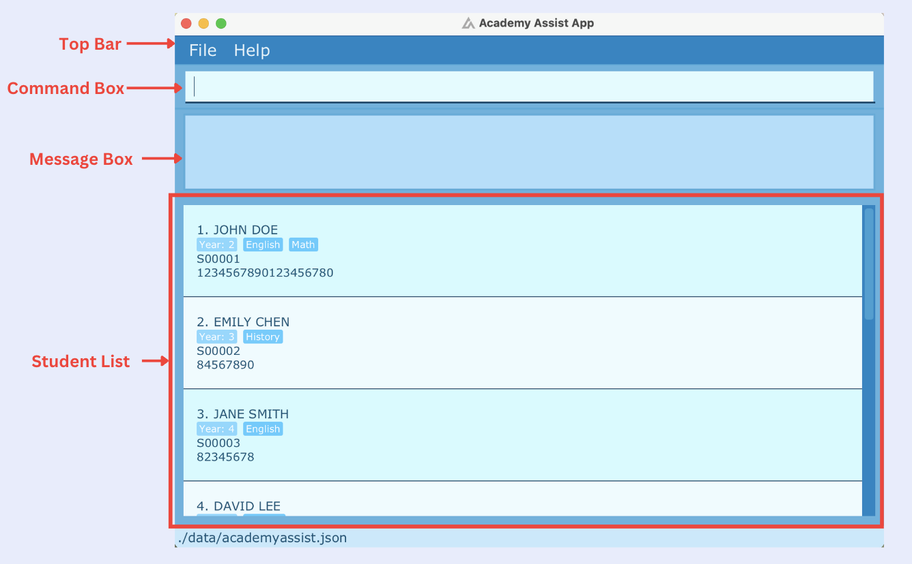

---

layout: default.md
title: "User Guide"
pageNav: 3

---

# VolunTier User Guide

<page-nav-print />

--------------------------------------------------------------------------------------------------------------------

## Introduction
VolunTier is a **top _Tier_** solution for volunteer organizations specializing in teaching students and managing a growing clientele efficiently. 
Designed for those **comfortable with the Command Line Interface (CLI) and quick typing**, 
VolunTier is ideal for Singapore-based users with extensive tutor and tutee data to manage across three subjects. 
It streamlines the process of adding, editing, and deleting records for volunteers, students, and shared lessons.

<box type="info" seamless>

Tutor and Tutees can both be referred to as Person.

</box>

## Quick start

### Installation of application

1. Ensure you have Java `17` or above installed in your Computer.

2. Download the latest `.jar` file from [here](https://github.com/AY2425S1-CS2103T-F08-1a/tp/releases).

3. Copy the file to the folder you want to use as the _home folder_ for your VolunTier app.

4. Open a command terminal, `cd` into the folder you put the jar file in, and use the `java -jar VolunTier.jar` command to run the application.<br>
   A GUI similar to the below should appear in a few seconds. Note how the app contains some sample data.<br>

5. Type the command in the command box and press Enter to execute it. e.g. typing **`help`** and pressing Enter will open the help window.<br>
   Some example commands you can try:

* `list` : Lists all contacts.

* `addTutor \n John Doe \p 98765432 \e johndoe@example.com \a 311, Clementi Ave 2, 123456 \h 6 ` : Adds a tutor named `John Doe` with the phone number `98765432`, email `johndoe@example.com`, residing at `311, Clementi Ave 2, 123456`, and records `6` hours of tutoring.

* `delete 3` : Deletes the 3rd contact shown in the current list.

* `clear` : Deletes all contacts.

* `exit` : Exits the app.

7. Refer to the [Features](#features) below for details of each command.

--------------------------------------------------------------------------------------------------------------------


### CLI tutorial

Skip to [Features](#features) if you are proficient in CLI.

This tutorial introduces you to the basics of using the Command Line Interface (CLI) on Unix-based systems (Linux/macOS) and Windows. By the end, you’ll be comfortable navigating the file system, managing files, and running basic commands through the terminal.

#### 1. **What is the CLI?**
The CLI is a text-based interface where users interact with the operating system by typing commands. It allows for:
- **Efficient operations** compared to GUI
- **Advanced automation** with scripts and batch commands

#### 2. **Opening the Terminal**

##### On macOS:
Type `Terminal` in Spotlight Search (`F4` or `Cmd + Space`)

##### On Windows:
Search for command prompt or Powershell in the start menu.

##### On Linux:
```shell
Ctrl + Alt + T
```
--------------------------------------------------------------------------------------------------------------------
### User Interface



1. **Menu**: Provides access to the File and Help options.
2. **Person List**: Displays the list of tutors and tutees.
3. **Response Box**: Shows feedback for users from the VolunTier app.
4. **Tutor Hours Chart**: Displays a bar chart when the `vtc` command is used.
5. **Command Box**: The area where user commands are entered.

--------------------------------------------------------------------------------------------------------------------

## Features

<box type="tip" seamless>

start the app with `java -jar VolunTier.jar` after navigating to the folder containing the JAR file.

</box>

<box type="info" seamless>

**Notes about the command format:**<br>

* Words in `UPPER_CASE` are the parameters to be supplied by the user.<br>
  e.g. in `addTutor \n NAME`, `NAME` is a parameter which can be used as `addTutor \n John Doe`.

* Items in square brackets are optional.<br>
  e.g `\n NAME [\h HOURS]` can be used as `\n John Doe \h 10` or as `\n John Doe`.

* Items with `…`​ after them can be used multiple times including zero times.<br>
  e.g. `[\s SUBJECT]…​` can be used as ` ` (i.e. 0 times), `\s English`, `\s English \s Math` etc.

* Parameters can be in any order.<br>
  e.g. if the command specifies `\n NAME \p PHONE_NUMBER`, `\p PHONE_NUMBER \n NAME` is also acceptable.

* Extraneous parameters for commands that do not take in parameters (such as `help`, `list`, `undo`, `redo`, `exit` and `clear`) will be ignored.<br>
  e.g. if the command specifies `help 123`, it will be interpreted as `help`.

* `INDEX` refers to the index number shown in the displayed person list.<br>
  Index **must be a positive integer**.

* If you are using a PDF version of this document, be careful when copying and pasting commands that span multiple lines as space characters surrounding line-breaks may be omitted when copied over to the application.

* Users who have used VolunTier before can jump to [Command Summary](#command-summary)
  
</box>


### Viewing help : `help`

Shows the command summary and a message explaining how to access the help page.

Format: `help`


### Adding a Tutor: `addTutor`

Adds a Tutor to VolunTier.

Format: `addTutor \n NAME \p PHONE_NUMBER \e EMAIL \a ADDRESS [\h HOURS] [\s SUBJECT]…​`

Examples:
* `addTutor \n Alice Pauline \p 98722342 \e alicep@example.com \a Alice street, block 123, 999888 \s math \s science`
* `addTutor \n John Doe \p 98765432 \e johnd@example.com \a Mingyang street, block 123, 888777 \h 6 \s english`

### Adding a Tutee: `addTutee`

Adds a tutee to VolunTier.

Format: `addTutee \n NAME \p PHONE_NUMBER \e EMAIL \a ADDRESS [\h HOURS] [\s SUBJECT]…​`

<box type="tip" seamless>

**Tips:**

* Names can include alphanumeric characters as well as the special characters `/`, `,`, `'` and `-`.

* Phone number must be 8 integer digits and start with 8, 9, or 6.

* Address must have any text followed by a comma and a 6-digit postal code.<br>
  e.g. `Tampines, 234678`.

* Hours must be a non-negative integer, with a maximum of 876,000 (100 years).

* Hours will default to 0 if it is not specified.

* A person can have any number of subjects (including 0).

* A person cannot be a Tutor and a Tutee at the same time.

</box>


### Adding a Lesson: `addLesson`

Adds a lesson in VolunTier between a Tutor and Tutee. A lesson must have a Tutor, a Tutee and a subject.

Format: `addLesson TUTOR_INDEX TUTEE_INDEX \s SUBJECT`

* Adds a lesson between the Tutor at the specified `TUTOR_INDEX` and the Tutee at the specified `TUTEE_INDEX` for the specified `SUBJECT`.
* The Tutor, Tutee, and the Lesson added must have matching subjects.

Examples:
* `addLesson 1 2 \s science`

### Listing all persons : `list`

Shows a list of all persons in VolunTier.

Format: `list`


### Editing a person : `edit`

Edits an existing person in VolunTier.

Format: `edit INDEX [\n NAME] [\p PHONE_NUMBER] [\e EMAIL] [\a ADDRESS] [\h HOURS] [\s SUBJECT]…​`

* Edits the person at the specified `INDEX`.
* At least one of the optional fields must be provided.
* Existing values will be updated to the input values.
* When editing subjects, the existing subjects of the person will be removed i.e adding of subjects is not cumulative.

Examples:
*  `edit 2 \p 91234567 \e johndoe@example.com` Edits the phone number and email address of the 1st person to be `91234567` and `johndoe@example.com` respectively.
*  `edit 3 \n Betsy Crower \s` Edits the name of the 2nd person to be `Betsy Crower` and removes all subjects linked.

### Locating persons by name: `find`

Finds persons whose names contain any of the given keywords.

Format: `find KEYWORD [MORE_KEYWORDS]`

* The search is case-insensitive. e.g `hans` will match `Hans`
* The order of the keywords does not matter. e.g. `Hans Bo` will match `Bo Hans`
* Only the name is searched.
* Only full words will be matched e.g. `Han` will not match `Hans`
* Persons matching at least one keyword will be returned (i.e. `OR` search).
  e.g. `Hans Bo` will return `Hans Gruber`, `Bo Yang`

Examples:
* `find John` returns `john` and `John Doe`
* `find alex david` returns `Alex Yeoh`, `David Li`

### Locating persons by subject: `findSubject`

Finds persons who have any of the SUBJECT(s).


Format: `findSubject SUBJECT [MORE_SUBJECTS]`

* The search is case-insensitive. e.g., `math` will match `Math`
* The order of the keywords does not matter. e.g., `math science` will match `science math`
* Only the subject field is searched.
* Only full words will be matched e.g., `mat` will not match `math`
* Persons matching at least one keyword will be returned (i.e., `OR` search).
  e.g., `math science` will return persons with subjects `Math`, `Science`, `Math and Science`

Examples:
* `findSubject English` returns persons with subjects `English`
* `findSubject math english` returns persons with subjects `English`, `Math`

### Deleting a person : `delete`

Deletes the specified person from VolunTier.

Format: `delete INDEX`

* Deletes the person at the specified `INDEX`.
* When a person is deleted, their associated lessons will be removed as well.

Examples:
* `list` followed by `delete 2` deletes the 2nd person in VolunTier.
* `find Betsy` followed by `delete 1` deletes the 1st person in the results of the `find` command.

> **⚠️ Warning:** Deleting a person will permanently remove all lessons associated with them. Ensure you have selected the correct person before proceeding with deletion.

### Deleting a lesson : `deleteLesson`

Deletes the specified lesson from VolunTier.

Format: `deleteLesson TUTOR_INDEX TUTEE_INDEX \s SUBJECT`

* Deletes the lesson between the Tutor at the specified `TUTOR_INDEX` and the Tutee at the specified `TUTEE_INDEX` for the specified `SUBJECT`.

Examples:
* `findSubject Math` followed by `deleteLesson 2 5 \s Math` deletes the lesson between the Tutor with index 2 and the Tutee with index 5.

### Viewing a person's details : `view`

Displays additional details of a person that might not be shown on their card.

Format: `view INDEX`

* Views the details of the person at the specified `INDEX`.
* Details that are not shown on Person Card but can be viewed includes Hours and the person they are paired with along with the subject.

Examples:
* `list` followed by `view 3` displays the details of the 3rd person in the address book.
* `find Lisa` followed by `view 1` displays the details of the 1st person in the results of the `find` command.

### Undoing a command : `undo`

Reverses the most recent command executed.

Format: `undo`

* You can only undo commands executed during the current session.

Examples:
* If you accidentally deleted a person, `undo` will add that person back along with their associated lessons.

### Redoing a command : `redo`

Reapplies a command that was previously undone.

Format: `redo`

* Redo is only available immediately after an undo.

Examples:
* If you `undo` the addition of a new Tutor by mistake, `redo` will restore that entry.

<box type="info" seamless>

The undo and redo commands only apply to actions that modify data in the VolunTier address book, such as `edit` or `addTutor`. Commands that do not alter data, like `view`, cannot be undone or redone.

</box>


### Viewing command history : `history`

Provides a list of commands executed, from the most recent to the earliest.

Format: `history`

* History displays only commands executed during the current session.
* History displays all commands that was entered, regardless if it was successful or not.

Examples:
* If you accidentally add a Tutor as a Tutee using the `addTutee` command instead of `addTutor`, `history` lets you easily select and copy the previous command, saving you from retyping it.
* If you were in the middle of updating records and was distracted, `history` will allow you to find out where you left off last.

### Viewing chart of tutors’ volunteer hours : `vtc`

Generates a chart displaying the total volunteering hours of all volunteer tutors.

Format: `vtc`

Examples:
* To see an overview of volunteer contributions, `vtc` will display a chart with each tutor's name and total hours logged.

<box type="info" seamless>

`vtc` will cause all persons to be listed.

</box>


### Clearing all entries : `clear`

Clears all entries from VolunTier.

Format: `clear`


### Importing people from CSV files : `import`

Allows users to import data from a CSV file and add multiple persons at once to the address book.
If any rows fail the validation check or contain duplicates, they are skipped, and detailed feedback is provided to the user.

Format: `import \f FILEPATH`

* Use this to import your current users from your Excel spreadsheets to VolunTier.
* The .csv file to be imported must have these headings in this order: “name”, “phone”, “email”, “address”, “hours”, “role” and “subjects”.
* There should be no empty rows in your CSV file.
* For optional fields like hours and subject, leave a blank.<br>
  For example, the following row leaves hours and subject blank: John, 91234567, john@gmail.com, “1 Jurong, 123456”, , Tutor,
* For any field that requires a comma, surround it in quotes like this: "1 Jurong, 123456".
* For more than one subject, separate it with a semicolon like this: English; Science.


Example:
*  `import \f ~/data/new_persons.csv` imports a list of people in new_persons.csv located in ~/data/ into VolunTier.
* Output: `5 persons added. Rows with duplicates: [2, 4]. The following rows had data which failed some constraints: Row 3: Invalid email format. Row 5: Missing phone number.`

<box type="info" seamless>

Import only works for a list of persons. It does not support the lessons feature.

</box>


### Exiting the program : `exit`

Exits the program.

Format: `exit`

--------------------------------------------------------------------------------------------------------------------

### Saving the data

VolunTier data is saved in the hard disk automatically after any command that changes the data. There is no need to save manually.

### Editing the data file

VolunTier data are saved automatically as a JSON file `[JAR file location]/data/addressbook.json`. Advanced users are welcome to update data directly by editing that data file.

<box type="warning" seamless>

**Caution:**
If your changes to the data file makes its format invalid, VolunTier will discard all data and start with an empty data file at the next run.  Hence, it is recommended to take a backup of the file before editing it.<br>
Furthermore, certain edits can cause the VolunTier to behave in unexpected ways (e.g., if a value entered is outside the acceptable range). Therefore, edit the data file only if you are confident that you can update it correctly.

</box>

--------------------------------------------------------------------------------------------------------------------

## FAQ

**Q**: How do I transfer my data to another Computer?<br>
**A**: Install the app in the other computer and overwrite the empty data file it creates with the file that contains the data of your previous AddressBook home folder.

**Q**: Can I customize the subjects offered in VolunTier?<br>
**A**: Currently, VolunTier supports only three basic subjects: Math, Science, and English. Custom subjects are not supported, but this feature may be considered in future updates.

**Q**: Is it possible to export my data from VolunTier?<br>
**A**: VolunTier currently does not support an export feature directly. However, you can manually copy the addressbook.json file from the data folder and use it as a backup or to transfer data to another instance.

--------------------------------------------------------------------------------------------------------------------

## Known issues

1. **When using multiple screens**, if you move the application to a secondary screen, and later switch to using only the primary screen, the GUI will open off-screen. The remedy is to delete the `preferences.json` file created by the application before running the application again.
2. **If you minimize the Help Window** and then run the `help` command (or use the `Help` menu, or the keyboard shortcut `F1`) again, the original Help Window will remain minimized, and no new Help Window will appear. The remedy is to manually restore the minimized Help Window.
3. **Viewing Tutor Chart when tutor's name is very long** will cause layout issues and make the chart difficult to interpret. We are aware of this issue and plan to address it in future implementations to improve readability and user experience. As the average Singaporean would not have such long names, the remedy for now is to keep their names short by abbreviation. 

--------------------------------------------------------------------------------------------------------------------

## Command summary

Action     | Format, Examples
-----------|----------------------------------------------------------------------------------------------------------------------------------------------------------------------
**Add Lesson**   | `addLesson TUTOR_INDEX TUTEE_INDEX \s SUBJECT` <br> e.g., `addLesson 1 2 \s science`
**Add Tutor**    | `addTutor \n NAME \p PHONE_NUMBER \e EMAIL \a ADDRESS [\h HOURS] [\s SUBJECT]…​` <br> e.g., `addTutor \n James Ho \p 92224444 \e jamesho@example.com \a 123, Clementi Rd, 123465 \h 7 \s math`
**Add Tutee**    | `addTutee \n NAME \p PHONE_NUMBER \e EMAIL \a ADDRESS [\h HOURS] [\s SUBJECT​]…​` <br> e.g., `addTutee \n Evan Lee \p 88889999 \e evanlee@example.com \a 345, Clementi Rd, 123465 \h 2 \s english`
**Clear**  | `clear`
**Delete** | `delete INDEX`<br> e.g., `delete 3`
**Delete Lesson**| `deleteLesson TUTOR_INDEX TUTEE_INDEX \s SUBJECT `<br> e.g., `deleteLesson 1 2 \s science`
**Edit**   | `edit INDEX [\n NAME] [\p PHONE_NUMBER] [\e EMAIL] [\a ADDRESS] [\h HOURS] [\s SUBJECT]…​`<br> e.g.,`edit 2 \n James Lee \e jameslee@example.com`
**Find**   | `find KEYWORD [MORE_KEYWORDS]`<br> e.g., `find James Jake`
**Find Subject** | `findSubject SUBJECT [MORE_SUBJECTS]` <br> e.g., `findSubject math science`
**History**	    | `history`
**Import** | `import \f FILEPATH`
**List**   | `list`
**Undo**   | `undo`
**Redo**   | `redo`
**View**   | `view INDEX`<br> e.g., `view 2`
**View Tutor Hours**   | `vtc`
**Exit**   | `exit`
**Help**   | `help`

