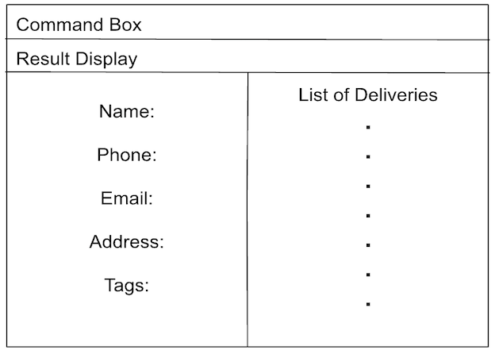

# LogiLink User Guide

LogiLink allows you, as a logistics coordinator, to manage your contacts on your desktop with keyboard commands. 

If you type fast, you can complete your contact management tasks faster with LogiLink than with mouse-based apps.

<!-- * Table of Contents -->
* [Quick start](#quick-start)
* [Features](#features)
  * [Viewing help: `help`](#viewing-help--help)
  * [Adding a contact or delivery: `add`](#adding-a-contact-or-delivery-add)
  * [Listing all contacts: `list`](#listing-all-contacts--list)
  * [Editing a contact or delivery: `edit`](#editing-a-contact-or-delivery-edit)
  * [Locating contacts or deliveries by name: `find`](#locating-contacts-or-deliveries-by-name-find)
  * [Locating deliveries by item: `finddel`](#locating-deliveries-by-item-finddel)
  * [Archiving a contact or delivery: `archive`](#archiving-a-contact-or-delivery--archive)
  * [Unarchiving a contact or delivery: `unarchive`](#unarchiving-a-contact-or-delivery--unarchive)
  * [Sorting contacts or deliveries in ascending order: `asort`](#sorting-the-contacts-or-delivery-list-in-ascending-order-asort)
  * [Sorting contacts or deliveries in descending order: `dsort`](#sorting-the-contacts-or-delivery-list-in-descending-order-dsort)
  * [Deleting a contact or delivery: `delete`](#deleting-a-contact-or-delivery--delete)
  * [Inspecting a contact: `inspect`](#inspecting-a-contact--inspect)
  * [Assigning a delivery to an employee: `assign`](#assigning-a-delivery-to-an-employee--assign)
  * [Returning to the main window: `back`](#returning-to-the-main-window--back)
  * [Clearing all entries: `clear`](#clearing-all-entries--clear)
  * [Exiting the program: `exit`](#exiting-the-program--exit)
* [FAQ](#faq)
* [Known issues](#known-issues)
* [Command summary](#command-summary)
* [Glossary](#glossary)

<page-nav-print />

--------------------------------------------------------------------------------------------------------------------
## Quick start

1. Ensure you have Java `17` or above installed in your Computer.
   - If you do not, you can download the Java `17` installer from [here](https://www.oracle.com/java/technologies/javase/jdk17-archive-downloads.html).

1. Download the latest `.jar` file from [here](https://github.com/AY2425S1-CS2103T-T12-3/tp/releases).

1. Copy the `.jar` file to the folder you want to use as the _home folder_ for LogiLink.

1. Within this _home folder_, open a command terminal (Right-click > Open in Terminal) and enter `java -jar LogiLink.jar` to run LogiLink. 
   - A window similar to the diagram should appear, and the program should contain some sample data. 
   

1. Type the command in the command box and press Enter to execute it. e.g. typing **`help`** and pressing Enter will open the help window. 
   Some example commands you can try:

   * `list` : Lists all contacts.

   * `add n/John Doe p/98765432 e/johnd@example.com r/Client a/John street, block 123, #01-01` : Adds a contact named `John Doe` to the contacts list.

   * `delete 3` : Deletes the 3rd contact shown in the current list.

   * `clear` : Deletes all contacts.

   * `exit` : Exits the app.

1. Refer to the [Features](#features) below for details of each command.

--------------------------------------------------------------------------------------------------------------------

## Features

<box type="info" seamless>

**Notes about the command format:**
* There are two windows in this program:
  - Main window: the default window you see when opening LogiLink.
  - Inspect window: the window you see when inspecting a contact.  

* Words in `UPPER_CASE` are parameters you need to provide. 
  e.g. In `add n/NAME`, `NAME` is where you would enter a name, like `add n/John Doe`.

* Square brackets [ ] mean that the parameter is optional. 
  e.g `n/NAME [t/TAG]` means you can enter either `n/John Doe t/friend` or `n/John Doe`.

* Ellipsis (...) means you can repeat the parameter multiple times, or leave it out completely. 
e.g. `[t/TAG]…​`lets you add any number of tags like `t/friend`, `t/friend t/family`, etc., or you can skip the tags altogether.

* You can enter parameters in any order. 
  e.g. If the command format is `n/NAME p/PHONE_NUMBER`, then entering parameters in the order `p/PHONE_NUMBER n/NAME` is also acceptable.

*  Commands that do not require parameters (like `help`, `list`, `exit` and `clear`) will ignore anything extra you type. 
  e.g. If you enter `help 123`, it will simply run the `help` command and ignore the `123`.

* If you are using a PDF version of this document, be careful when copying and pasting commands that span multiple lines. Sometimes, the spaces around line-breaks may not copy correctly, which could cause issues when you paste them into
the app.
</box>

### Viewing help : `help`
**<ins>When in the main or inspect window**

Shows a help window with a list of commonly used commands for the current window. You can click on any command button to automatically enter it into the command box.

Note: 
* Does not show an exhaustive list of all available commands, only the most helpful. 

<box type="tip" seamless>

**Tip**: You can use the TAB, ENTER and ESC keys to navigate the help window.

Format: `help`

### Adding a contact or delivery: `add`
**<ins>When in the main window**

Adds a contact to the contacts list.

Format: `add n/NAME p/PHONE_NUMBER e/EMAIL a/ADDRESS [r/ROLE] [t/TAG]…​`

Examples:
* `add n/John Doe p/98765432 e/johnd@example.com a/John street, block 123, #01-01, S123456 r/client`
* `add n/Betsy Crowe t/friend e/betsycrowe@example.com r/worker a/Newgate Prison, S123456 p/1234567 t/criminal`

 
Note: 

* `NAME` is required to be unique, most users will not save 2 `Alex` into their contacts, they will distinguish them.
* `EMAIL` and `PHONE` can be duplicated to give the user freedom, but there will be a warning.

**<ins>When in the inspect window**

Adds a delivery to the delivery list of a contact.

Format: `add i/ITEM…​ e/ETA a/ADDRESS c/COST s/STATUS [t/TAG]…​`

Examples:
* `add i/Chair e/2025-04-04 a/John street, block 123, #01-01, S123456 c/$20 s/delivered`
* `add i/Monitor i/Mouse e/2020-02-02 a/311, Clementi Ave 2, #02-25, S120300 c/$100 s/not delivered t/Difficult address to deliver t/Best before Wednesday`

<box type="tip" seamless>

**Tip:** A contact or delivery can have as many tags as you like — even none!
</box>

### Listing all contacts : `list`
**<ins>When in the main window**

Shows a list of all contacts added to the contacts list. If the contact type is specified, it only shows the contacts with the specified type.

Format: `list [clients/employees]`

**<ins>When in the inspect window**

Shows a list of all deliveries added to a contact's delivery list. 

Format: `list`

### Editing a contact or delivery: `edit`
**<ins>When in the main window**

Edits an existing contact in the contacts list.

Format: `edit INDEX [n/NAME] [p/PHONE] [e/EMAIL] [r/ROLE] [a/ADDRESS] [t/TAG]…​`

* Edits the contact at the specified `INDEX`.
  - The index is the number displayed next to the contact's name in the list.
  - The index **must be a positive number** (starting from 1).
* You must provide at least one optional field (in [ ]). This means you need to update at least one of the following fields: name, phone, email, role, address, or tag.
* Editing tags will replace **all** existing ones. If you simply want to remove all tags, type 't/' without specifying any tags after.

Examples:
*  `edit 1 p/91234567 e/johndoe@example.com` changes the phone number and email address of the 1st contact to `91234567` and `johndoe@example.com` respectively.
*  `edit 2 n/Betsy Crower t/` changes the name of the 2nd contact to be `Betsy Crower` and clears all of its tags.

**<ins>When in the inspect window**

Edits an existing delivery in the delivery list of a contact.

Format: `edit INDEX [i/ITEM]…​ [e/ETA] [a/ADDRESS] [c/COST] [s/STATUS] [t/TAG]…​`

* The same rules apply as in the main window section.
* At least one item must be specified when editing a delivery. You cannot remove all items by typing `i/` without adding any items after it.

Examples:
*  `edit 1 i/Speaker c/$50` changes the items and cost of the 1st delivery to be `Speaker` and `$50` respectively.
*  `edit 2 s/delivered t/` changes the status of the 2nd delivery to be `delivered` and clears all of its tags.

### Locating contacts by name: `find`
**<ins>When in the main window**

Finds contacts whose names contain any of the given keywords.

Format: `find KEYWORD [MORE_KEYWORDS]`
* **Case-insensitive search**: The search does not distinguish between upper or lower case. e.g `hans` will match `Hans`
* **Keyword order does not matter**: You can enter keywords in any order. e.g. `Hans Bo` will match `Bo Hans`
* **Only names are searched**: The search only looks at the contact's name, not other details like phone number or address.
* **Matches partial words**: e.g. `Han` will match `Hans`
* **"OR" search**: If a contact's name contains any of the keywords, it will be shown. e.g. `Hans Bo` will return `Hans Gruber`, `Bo Yang`

Examples:
* `find John` returns `john` and `John Doe`
* `find alex david` returns `Alex Yeoh`, `David Li`

**<ins>When in the inspect window**

Find command does not work in the inspect window.

### Locating deliveries by item: `finddel`
**<ins>When in the main window**

`finddel` does not work in the main window.

**<ins>When in the inspect window**

Finds deliveries that contain any of the given items.

Format: `finddel ITEM [MORE_ITEMS]`
* **Case-insensitive search**: The search does not distinguish between upper or lower case. e.g `mouse` will match `Mouse`
* **Keyword order does not matter**: You can enter keywords in any order. e.g. `Mouse Monitor` will match `Monitor Mouse`
* **"OR" search**: If a delivery contains any of the items, it will be shown. e.g. `Mouse Monitor` will return `Mouse Chair`, `Monitor Desk`

Examples:
* `finddel Chair` returns any delivery that contains the item chair.
* `find Chair Desk` returns any delivery that contains the item chair, desk, or both.

### Archiving a contact or delivery : `archive`
**<ins>When in the main window**

Archives the specified contact(s) from the contacts list. 
Archived contact(s) will be less visible and moved to the bottom of the list.

Format: `archive [INDEXES]...`

* Archive the contact(s) at the specified `INDEXES`.
* The index is the number displayed next to the contact's name in the list.
* The indexes **must be positive numbers** (starting from 1).
* The indexes **must be unique**. For example, `archive 1 2 2 4` is not allowed because `2` appears more than once.

Examples:
* `back` followed by `archive 2 3` archives the 2nd and 3rd contact in the contact list.

Note:
* You will not be able to use `inspect` and `edit` for archived contacts.

**<ins>When in the inspect window**

Archives the specified delivery or deliveries from the delivery list of a contact.
* The same rules apply as in the main window section.

Examples:
* `archive 2` archives the 2nd delivery in the delivery list of the inspected contact.
* `archive 2 3` archives the 2nd and 3rd deliveries in the delivery list of the inspected contact.

Note:
* You will not be able to use `edit` for archived deliveries.

### Unarchive a contact or delivery : `unarchive`
**<ins>When in the main window**

Unarchives the specified contact(s) to restore their visibility in the contacts list, if they were previously archived.

Format: `unarchive [INDEXES]...`

* Undoes the archive action for the contact(s) at the specified `INDEXES`.
* The index is the number displayed next to the contact's name in the list.
* The indexes **must be positive numbers** (starting from 1).
* The indexes **must be unique**. For example, `archive 1 2 2 4` is not allowed because `2` appears more than once.

Examples:
* `back` followed by `unarchive 2 3` unarchives the 2nd and 3rd contact in the contacts list.

**<ins>When in the inspect window**

Unarchives the specified delivery or deliveries to restore their visibility in the delivery list of a contact, if they were previously archived.
* The same rules apply as in the main window section.

Examples:
* `unarchive 2` unarchives the 2nd delivery in the delivery list of the inspected contact.
* `unarchive 2 3` unarchives the 2nd and 3rd deliveries in the delivery list of the inspected contact.

### Sorting the contacts or delivery list in ascending order: `asort`
**<ins>When in the main window**

Sorts all contacts in the contacts list by the specified attribute, from lowest to highest.

Format `asort by/ [ATTRIBUTE]`

* Attributes you can sort by: date, email, name, phone, role.

Examples:
* `asort by/ name` sorts the contacts list by name, in ascending alphabetical order (e.g. A, B, C, ...).
* `asort by/ date` sorts the contacts list by the date the contacts were added, from oldest to newest (e.g. 2024-10-31 before 2024-11-1).

**<ins>When in the inspect window**

Sorts all deliveries in the delivery list of a contact by the specified attribute, from lowest to highest.

Format `asort by/ [ATTRIBUTE]`

* Attributes you can sort by: address, cost, date, eta, id, status.

Examples:
* `asort by/ cost` sorts the delivery list by cost, from lowest to highest (e.g. $1, $100, $1000, ...).
* `asort by/ status` sorts the delivery list by delivery status, where `not delivered` deliveries come before `delivered` deliveries.

### Sorting the contacts or delivery list in descending order: `dsort`

`dsort` works the same way as `asort`, except the sorting is now done from highest to lowest.

Simply use the same format as `asort`, but replace `asort` with `dsort`.

### Deleting a contact or delivery : `delete`
**<ins>When in the main window**

Deletes the specified contact(s) from the contacts list.

Format: `delete [INDEXES]...`

* Deletes the contact(s) at the specified `INDEXES`.
* The index is the number displayed next to the contact's name in the list.
* The indexes **must be positive numbers** (starting from 1).

Examples:
* `list` followed by `delete 2 3` deletes the 2nd and 3rd contact in the contacts list.
* `find Betsy` followed by `delete 1` deletes the 1st person in the results of the `find` command.

**<ins>When in the inspect window**

Deletes the specified delivery or deliveries from the delivery list of a contact.
* The same rules apply as in the main window section.

Examples:
* `delete 2` deletes the 2nd delivery in the delivery list of the inspected contact.
* `delete 2 3` deletes the 2nd and 3rd deliveries in the delivery list of the inspected contact.

### Inspecting a contact : `inspect`
**<ins>When in the main window**

Inspects a specified contact from the contacts list to see their delivery list.

Format: `inspect [INDEX]`

* Inspects the contact at the specified `INDEX`.
* The index is the number displayed next to the contact's name in the list.
* The index **must be a positive number** (starting from 1).

Examples:
* `list` followed by `inspect 1` inspects the 1st contact in the contacts list.

**<ins>When in the inspect window**

`inspect` does not work in the inspect window.

### Assigning a delivery to an employee : `assign`
**<ins>When in the main window**

`assign` does not work in the main window.

**<ins>When in the inspect window**

Assigns the specified delivery from the delivery list of a client to the specified employee. It does not work when inspecting an employee.

Format: `assign INDEX n/EMPLOYEE_NAME`

* Assigns the delivery at the specified `INDEX` to the employee specified by `EMPLOYEE_NAME`.
* The index is the number displayed at the top of a delivery in the delivery list of a contact.
* The index **must be a positive number** (starting from 1).
* The worker name should match an existing worker in the contact list.

Examples:
* `assign 1 n/Betsy Crowe` assigns first delivery of the current contact to employee Betsy Crowe.

### Returning to the main window : `back`
**<ins>When in the main window**

`back` does not do anything in the main window.

**<ins>When in the inspect window**

Takes you back to the main window.

Format: `back`

### Clearing all entries : `clear`
**<ins>When in the main or inspect window**

Clears all contacts from the contacts list.

Format: `clear`

**<ins>When in the main or inspect window**

`clear` does not work in the inspect window.

### Exiting the program : `exit`
**<ins>When in the main or inspect window**

Exits LogiLink.

Format: `exit`

### Saving the data

LogiLink data is saved in the hard disk automatically after any command that changes the data. There is no need to save manually.

### Editing the data file

LogiLink automatically saves your data as a JSON file `[JAR file location]/data/LogiLink.json`. Advanced users are welcome to update data directly by editing that data file.

<box type="warning" seamless>

**Caution:**
If your changes to the data file makes its format invalid, LogiLink will erase all data and start with an empty data file on the next launch. To avoid losing your information, we recommended creating a backup of the file before making
any changes. 

Certain changes you make to the file could cause LogiLink to behave unexpectedly (e.g., entering an invalid value). So, only edit the data file if you are confident you can do so correctly.
</box>

--------------------------------------------------------------------------------------------------------------------

## FAQ

**Q**: How do I transfer my data to another Computer? 
**A**: Install the app in the other computer and overwrite the empty data file it creates with the file that contains the data of your previous LogiLink home folder.

--------------------------------------------------------------------------------------------------------------------

## Known issues

1. **When using multiple screens**
 - If you are using multiple screens and move the app to a secondary screen, then later switch to using only the primary screen, the app might open off-screen. 
 - To fix this, simply delete the `preferences.json` file created by the app, then restart the app.

--------------------------------------------------------------------------------------------------------------------

## Command summary

Action     | Format, Examples
-----------|----------------------------------------------------------------------------------------------------------------------------------------------------------------------
**Add**    | <ins>Main Window:</ins>  `add n/NAME p/PHONE_NUMBER e/EMAIL r/ROLE a/ADDRESS [t/TAG]…​`   e.g., `add n/James Ho p/22224444 e/jamesho@example.com r/Client a/123, Clementi Rd, S123456 t/friend t/colleague`  <ins>Inspect Window:</ins>  `add i/ITEM…​ e/ETA a/ADDRESS c/COST s/STATUS [t/TAG]…​`   e.g., `add i/Monitor i/Mouse e/2020-02-02 a/311, Clementi Ave 2, #02-25, S120300 c/$100 s/not delivered t/Difficult address to deliver`
**Archive**| <ins>Both Windows:</ins>  `archive INDEXES`  e.g., `archive 3`, `archive 3 4`
**Assign** | <ins>Main Windows:</ins>  Does not work  <ins>Inpsect Windows:</ins>  `assign INDEX n/EMPLOYEE_NAME`   e.g., `assign 1 n/Betsy Crowe`
**Back**   | <ins>Both Windows:</ins>  `back`
**Clear**  | <ins>Both Windows:</ins>  `clear`
**Delete** | <ins>Both Windows:</ins>  `delete INDEXES`  e.g., `delete 3`, `delete 3 4`
**Edit**   | <ins>Main Window:</ins>  `edit INDEX [n/NAME] [p/PHONE_NUMBER] [e/EMAIL] [a/ADDRESS] [t/TAG]…​`  e.g.,`edit 2 n/James Lee e/jameslee@example.com`  <ins>Inspect Window:</ins>  `edit INDEX [i/ITEM]…​ [e/ETA] [a/ADDRESS] [c/COST] [s/STATUS] [t/TAG]…​`   e.g., `edit 1 i/Speaker c/$50`
**Find**   | <ins>Main Window:</ins>  `find KEYWORD [MORE_KEYWORDS]`  e.g., `find James Jake`  <ins>Inspect Window:</ins>  Does not work
**Find Delivery**| <ins>Main Window:</ins>  Does not work  <ins>Inspect Window:</ins>  `finddel ITEM [MORE_ITEMS]` e.g., `finddel Monitor Mouse`
**Help**   | <ins>Both Windows:</ins>  `help`
**Inspect**| <ins>Main Window:</ins>  `inspect INDEX`  e.g., `inspect 2`  <ins>Inspect Window:</ins>  Does not work
**List**   | <ins>Main Window:</ins>  `list` or `list clients` or `list employees`  <ins>Main Window:</ins>  `list`
**Sort Ascending**| <ins>Both Windows:</ins>  `asort by/ATTRIBUTE`
**Sort Descending**| <ins>Both Windows:</ins>  `dsort by/ATTRIBUTE`
**Unarchive**| <ins>Both Windows:</ins>  `unarchive INDEXES`  e.g., `unarchive 3`, `unarchive 3 4`

--------------------------------------------------------------------------------------------------------------------

## Glossary

Terms            | Meaning
-----------------|----------------------------------------------------------------------------------------------------------------------------------------------------------------------
**Archive**      |The action of moving an item, from an active or accessible state to a preserved state by reducing its immediate availability and visibility.
**Unarchive**    |The action of restoring a previously archived item, to an active or accessible state.
**Client**    |A contact that has the role `client`
**Employee**    |A contact that has the role `employee`
