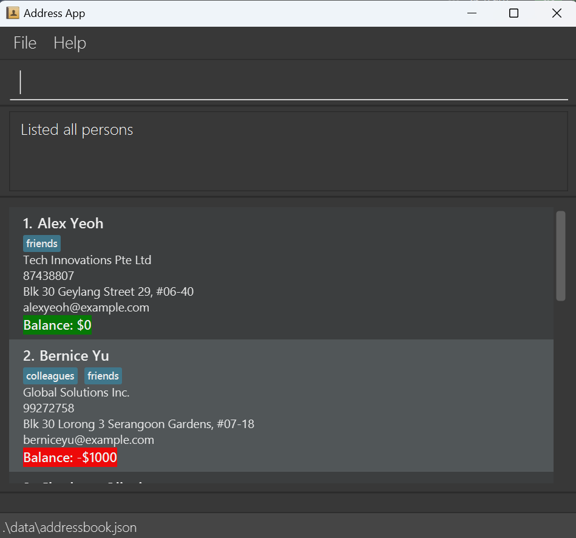
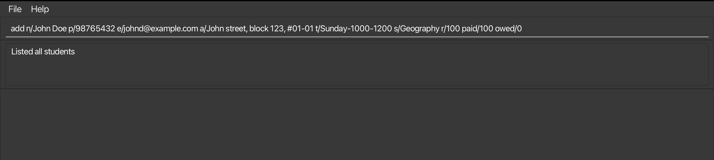
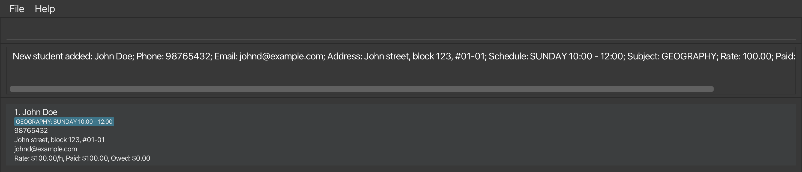
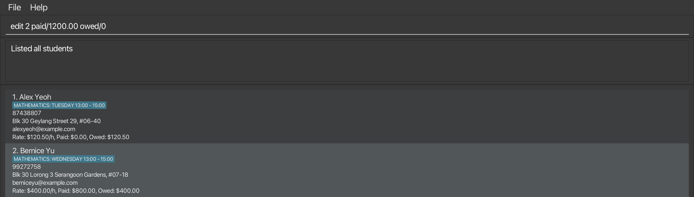
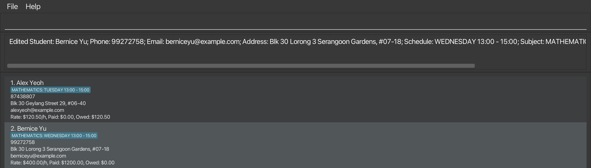
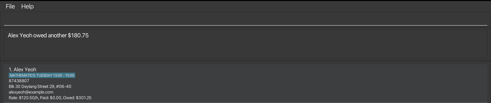
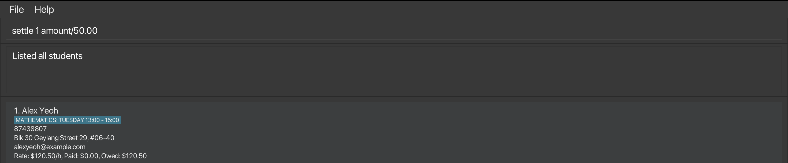
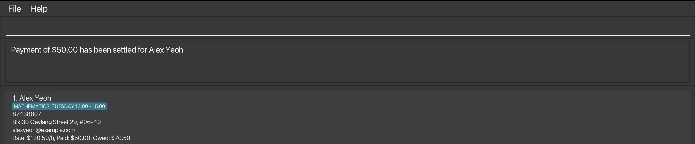
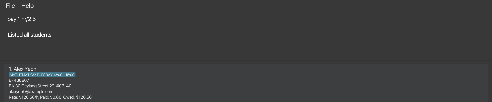
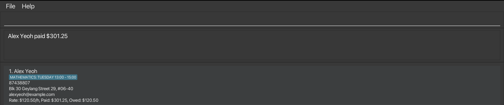

#  UGTeach User Guide

UGTeach is a **desktop app for managing your students' contacts** that aims to empower **Singapore-based undergraduate private tutors** to **efficiently manage payments and organize schedules**. It streamlines tutoring operations and ensures you stay organized.

Whether you're a Command Line Interface (CLI) pro or new to command lines, **we've got you covered**. Our app offers both a **CLI interface for advanced users** and a **GUI for those who prefer a more visual experience**.
If you can type fast, UGTeach can get your contact management tasks done **faster than traditional GUI apps**.

<!-- * Table of Contents -->
<page-nav-print />

--------------------------------------------------------------------------------------------------------------------

## Quick start

1. Ensure you have Java `17` or above installed in your Computer.
   1. To check if you have Java installed, open a command terminal:
      * Windows: Open Windows PowerShell or open the start menu and enter `cmd`.
      * MacOS: Open the Terminal app or press Cmd and spacebar together and enter `terminal`.
      * Linux: Open the Terminal app or press the "Ctrl + Alt + T" keys simultaneously.
   1. In the terminal, type `java -version`.
   1. Look for a line that starts with `java version`. You should see a number, like `17.0.2`. Ensure that this version number is 17 or higher.
   1. If Java is not installed or the version is below 17, visit the [official Java download page](https://www.oracle.com/java/technologies/downloads/#java17) and install the latest version. Choose the appropriate download link for your operating system (Linux, or Windows).
   1. For Mac users, you should install this specific `Azul JDK 17` distribution by following this [guide](https://se-education.org/guides/tutorials/javaInstallationMac.html).

1. Download the latest `.jar` File:
    * Download the `.jar` file from [here](https://github.com/AY2425S1-CS2103T-F14a-1/tp/releases).
    * By default, the jar file would be saved in the Downloads folder.

1. Copy the file to the folder you want to use as the _home folder_ for UGTeach.

1. Before you run the application for the **first time**, ensure that your _home folder_ **does not contain** a `config.json` and `preferences.json` file. If it does, delete them.

1. Open a command terminal, `cd` into the folder that you put the jar file in.
   * For example, if the jar file is still in the Downloads folder, type `cd Downloads`

1. Use the `java -jar ugteach.jar` command to run the application.  
   A GUI similar to the image shown below should appear in a few seconds. Note how the app contains some sample data.
    
   

1. Type the command in the command box and press Enter to execute it. e.g. typing **`help`** and pressing Enter will open the help window.  
   Some example commands you can try:

   * `list` : Lists all contacts.

   * `add n/John Doe p/98765432 e/johnd@example.com a/John street, block 123, #01-01 t/Sunday-1000-1200 s/Geography r/100 paid/100 owed/0`: Adds a contact named `John Doe` to the UGTeach data file.

   * `delete 3` : Deletes the 3rd contact shown in the current list.

   * `clear` : Deletes all contacts.

   * `exit` : Exits the app.

1. Refer to the [Features](#features) below for details of each command.

--------------------------------------------------------------------------------------------------------------------

## Command summary

Action     | Format, Examples
-----------|----------------------------------------------------------------------------------------------------------------------------------------------------------------------
**Help**   | `help`
**List**   | `list`
**Add**    | `add n/NAME p/PHONE_NUMBER e/EMAIL a/ADDRESS t/SCHEDULE s/SUBJECT r/RATE [paid/PAID] [owed/OWED]`   e.g., `add n/James Ho p/82224444 e/jamesho@example.com a/123, Clementi Rd, 1234665 t/Monday-0800-1000 s/GP r/300 paid/300`
**Edit**   | `edit INDEX [n/NAME] [p/PHONE_NUMBER] [e/EMAIL] [a/ADDRESS]…​`  e.g.,`edit 2 paid/1200.00 owed/0`
**Delete** | `delete INDEX`  e.g., `delete 3`
**Find**   | `find [n/KEYWORD [MORE_KEYWORDS]] [d/DAY [MORE_DAYS]]`  e.g., `find n/Alex d/Friday`
**Owe**    | `owe INDEX hr/HOURS_OWED`  e.g., `owe 1 hr/1.5`
**Settle** | `settle INDEX amount/AMOUNT`  e.g., `settle 1 amount/500.00`
**Pay**   | `pay INDEX hr/HOURS_PAID`  e.g., `pay 1 hr/2.5`
**Income**  | `income`
**Remind**   | `remind`
**Clear**  | `clear`
**Exit**   | `exit`

<box type="warning" header="##### Notes">

* The prefixes (e.g. `a/`, `s/` or `paid`) are case-insensitive, i.e. you can use `a/`, `s/` or `pAId/` instead.

* You should not use the prefixes in any other cases, e.g. as content of **ADDRESS**.
</box>

## Features

<box type="info">

##### Notes about the command format

* Words in `UPPER_CASE` are the parameters to be supplied by you. 
  e.g. in `add n/NAME`, `NAME` is a parameter which can be used as `add n/John Doe`.

* Items in square brackets are optional. 
  e.g `n/NAME [owe/OWED_AMOUNT]` can be used as `n/John Doe owe/100.00` or as `n/John Doe`.

* Parameters can be in any order. 
  e.g. if the command specifies `n/NAME p/PHONE_NUMBER`, `p/PHONE_NUMBER n/NAME` is also acceptable.

* There should be at least one space between any two parameters, or between the command word and its parameters. 
  e.g. `edit 1 n/Sean` is acceptable, but `edit 1n/Sean` or `edit1 n/Sean` is not.

* No two students can have both same **NAME** and **PHONE_NUMBER**, but different students may share a **PHONE_NUMBER**.

  > Reason: Siblings can use a parent's phone number as their **PHONE_NUMBER**.

* For commands that do not take in parameters (such as `help`, `list`, `remind`, `income`, `exit` and `clear`), any extra text that comes after the command word will be ignored. 
  e.g. if the command specifies `help 123`, it will be interpreted as `help`. 
  e.g. if the command specifies `list help`, it will be interpreted as `list`, as the extra text `help` is ignored.

* If you are using a PDF version of this document, be careful when copying and pasting commands that span multiple lines as space characters surrounding line-breaks may be omitted when copied over to the application.
</box>

### Viewing help : `help`

Shows a message explaining how to access the help page.

**Format**: `help`

### Listing all students: `list`

Shows a list of all students in UGTeach.

**Format:** `list`

**Output:**

### Adding a student: `add`

Adds a student to UGTeach.

**Format:** `add n/NAME p/PHONE_NUMBER e/EMAIL a/ADDRESS t/SCHEDULE s/SUBJECT r/RATE [paid/PAID_AMOUNT] [owed/OWED_AMOUNT]`

**Example:**
* `add n/John Doe p/98765432 e/johnd@example.com a/John street, block 123, #01-01 t/Sunday-1000-1200 s/Geography r/100 paid/100 owed/0`

**Before (using an empty UGTeach):**

**After:**

<box type="important">

##### Constraints

* **NAME** must only contain alphanumeric characters and spaces. 
  * **NAME** is case-insensitive.
* **ADDRESS** has no restrictions.
* **SCHEDULE** must be in the format of `DAY_OF_THE_WEEK`-`START_TIME`-`END_TIME` (strictly no space in between).
  * **DAY_OF_THE_WEEK** is one of `Monday` `Tuesday` `Wednesday` `Thursday` `Friday` `Saturday` `Sunday`.
  * **DAY_OF_THE_WEEK** is case-insensitive.
  * **START_TIME** and **END_TIME** are represented as `HHmm`.
* **PHONE_NUMBER** should be 8 digits that starts with 3, 6, 8 or 9.
  > Reason: This constraint follows the convention set by Singapore's National Numbering Plan.
* **RATE** is the tuition fee per hour. It must meet the following criteria:
  * It is a positive numeric value with at most 2 decimal places.
  * Minimum: $0.01 (must be a positive value)
  * Maximum: $1000.00 (two decimal places allowed)
  > Reason for the maximum value: It is unlikely for an undergraduate tutor to have an hourly rate higher than $1000.00.
* **PAID_AMOUNT** and **OWED_AMOUNT** must be at least 0 with at most 2 decimal places.
      <i>Example: </i> `12.00`, `0.0` or `7`.
  * Special case: `-0`, `-0.0`, `-0.00` are not allowed! UGTeach will behave weirdly if you enter these values.
* **SUBJECT** should only be
`Economics`  `Literature`  `Music`  `Biology`  `Chemistry`  `Science`  
`English`  `Chinese`  `Malay` `Tamil`  `Mathematics`  `History`  `Geography`  `Physics` or `GP`.
  * **SUBJECT** is case-insensitive.
* You cannot add a duplicated student into UGTeach. Refer to [Glossary](#glossary) for more details on a duplicated student.

</box>

<box type="tip" header="##### Tips">

* **ADDRESS** can be used to record the location of tuition sessions. For example, you might enter the students's address if the tuition takes place at their home, or use "My Place" or your own address if the sessions are held at your location.
* UGTeach will inform you of clashing schedules. You can modify them using the [`edit` command](#editing-a-student-edit).
  

</box>

### Editing a student: `edit`

Edits an existing student in UGTeach.

**Format:** `edit INDEX [n/NAME] [p/PHONE_NUMBER] [e/EMAIL] [a/ADDRESS] [r/RATE] [paid/PAID_AMOUNT] [owed/OWED_AMOUNT]`

**Examples:**

* `edit 1 p/87438808 e/alexyeoh100@example.com` edits the phone number and email address of the 1st student to be `87438808` and `alexyeoh100@examnple.com` respectively.

* `edit 2 paid/1200.00 owed/0` edits the paid amount of the 2nd student to be `$1200.00` and edits the owed amount to be `$0.00`.

**Before:**

**After:**

<box type="important" header="##### Constraints">

* The <md>**INDEX**</md> refers to the index number shown in the **displayed student** list. The index **must be a positive integer** 1, 2, 3, …​
* At least one of the optional fields must be provided. You may refer to
[Constraints of Add command](#constraints) for acceptable values of each field.
* Existing values will be updated to the input values.
</box>

<box type="tip" header="##### Tips">

* You may refer to [`pay` command](#receiving-payment-from-a-student-pay), 
[`owe` command](#recording-unpaid-tuition-fee-of-a-student-owe) and [`settle` command](#settling-outstanding-fees-from-a-student-settle)
for convenient ways to update the paid amount and owed amount.
* **ADDRESS** can be used to record the location of tuition sessions. For example, you might enter the student's address if the tuition takes place at their home, or use "My Place" or your own address if the sessions are held at your location.
</box>

### Deleting a student : `delete`

Deletes the specified student from UGTeach.

**Format:** `delete INDEX`

**Examples:**
* `list` followed by `delete 2` deletes the 2nd student stored in UGTeach.
* `find n/Bernice` followed by `delete 1` deletes the 1st student in the results of the `find` command.

**Output:**

<box type="important" header="##### Constraints">

* The **INDEX** refers to the index number shown in the **displayed** student list.
* The **INDEX must be a positive integer** 1, 2, 3, …​

</box>

### Finding students' information: `find`

Finds students whose names contain any of the given keywords *and* their tuition day contains any of the given days.

**Format:** `find [n/KEYWORD [MORE_KEYWORDS...]] [d/DAY [MORE_DAYS...]]`

**Examples:**
* `find n/alex` returns `Alex Yeoh` and `Alex Tan`
* `find n/Alex d/Friday` returns `Alex Tan` 
* `find n/Alex Bernice d/Wednesday Friday` returns `Bernice Yu` and`Alex Tan`

**Output for `find n/Alex Bernice d/Wednesday Friday`:** 

<box type="important" header="##### Constraints">
<markdown>
* <b>DAY</b> must be one of `Monday` `Tuesday` `Wednesday` `Thursday` `Friday` `Saturday` `Sunday`.
* <b>KEYWORD</b> must be only alphanumeric characters.
* At least one of the optional fields must be provided.
</markdown>
</box>

<box type="tip" header="##### Tips">
<markdown>

* The search will always be done on the full list of students (The list of students seen when you type [`list`](#listing-all-students-list)).
  i.e. The `find` command will not be affected by the previous `find` command.
* The search result list will be ordered based on the students' index in the full list.
* The search is case-insensitive. e.g. `alex` will match `Alex`
* Only full words will be matched e.g. `alex` will not match `Alexander`
* The order of the parameters does not matter. 
 e.g. `find d/Friday n/Alex` will return the same result as `find n/Alex d/Friday`
* The search finds all the students whose 
    * names matches at least one of the keywords **AND** 
    * the tuition day matches the days.
    * e.g. `find n/Alex Bernice d/Wednesday Friday` returns `Bernice Yu` and`Alex Tan` because:
        * while `Alex Yeoh`, `Alex Tan` and `Bernice Yu` matches one of keywords `Alex` or `Bernice`,
        * only `Alex Tan` and `Bernice Yu` has a tuition on `Wednesady` or `Friday`.
</markdown>
</box>

### Recording unpaid tuition fee of a student: `owe`

Records the tuition fee that the student is unable to pay immediately after the lesson. 

When he/she pays the outstanding fees at a later time, you should use the [`settle` command](#settling-outstanding-fees-from-a-student-settle) to settle the tuition fee owed by the student 

**Format:** `owe INDEX hr/HOURS_OWED`

**Example:**
* `owe 1 hr/1.5` updates the tuition fee owed by the 1st student in the list.

**Before:**

**After:**

<box type="important" header="##### Constraints">

* The **INDEX** refers to the index number shown in the displayed student list.
* The **INDEX must be a positive integer** 1, 2, 3, …​
* **HOURS_OWED** must be a positive multiple of 0.5, i.e. 0.5, 1.0, 1.5, etc

</box>

<box type="tip" header="##### Tips">

* In case you made a mistake using the <md>`owe`</md> command, you can use the [`edit` command](#editing-a-student-edit) to fix the OWE_AMOUNT to your preference.

</box>

### Settling outstanding fees from a student: `settle`

Settles the amount owed by the student and adds it to the paid amount. To record payment which is not related to the owed amount, you may use the [`pay` command](#receiving-payment-from-a-student-pay).

**Format:** `settle INDEX amount/AMOUNT`

**Example:**
* `settle 1 amount/50.00`

**Before:**

**After:**

<box type="important" header="##### Constraints">

* The **INDEX** refers to the index number shown in the displayed student list.
* The **INDEX** **must be a positive integer** 1, 2, 3, …​
* **AMOUNT** must be a positive value and must not be more than **OWED_AMOUNT**.

</box>

### Receiving payment from a student: `pay`

Updates the amount of tuition fee paid by the specified student after a lesson. 

Recording payment using the `pay` command does not update the owed amount. You should use the [`settle` command](#settling-outstanding-fees-from-a-student-settle) to settle the tuition fee owed by the student after he/she pays the outstanding fees.

**Format:** `pay INDEX hr/HOURS_PAID`

**Example:**
* `pay 1 hr/2.5` updates the tuition amount paid by the 1st student in UGTeach.

**Before:**

**After:**

<box type="important" header="##### Constraints">

* The **INDEX** refers to the index number shown in the displayed student list.
* The **INDEX must be a positive integer** 1, 2, 3, …​
* **HOURS_PAID** should be a positive multiple of 0.5, i.e. 0.5, 1.0, 1.5, etc

</box>

<box type="tip" header="##### Tips">

* In case you made a mistake using the <md>`pay`</md> command, you can use the [`edit` command](#editing-a-student-edit) to fix the PAID_AMOUNT to your preference.

</box>

### Showing income data: `income`

Shows the total amount of tuition fee that you have been paid, as well as the total amount that is owed.

**Format:** `income`

**Examples**
* Entering `income` when all entries are listed gives the total tuition fee paid, as well as the total amount that is owed.
* Entering `find n/Alex` followed by `income` shows total tuition fee paid, as well as the total amount that is owed, from
  students whose name contains Alex

**Output:**

### Getting a reminder for today: `remind`

Reminds you of all your lessons scheduled for `today`. UGTeach automatically reminds you when you launch it.

**Format:** `remind`

**Output:**

<box type="tip" header="##### Tips">

* If you would like to see your schedule for other days, you can use the [`find` command](#finding-students-information-find) 
to find your schedule for a specific day of the week.

</box>

### Clearing all entries : `clear`

Clears all data from the data file of UGTeach.

<box type="warning" header ="##### Caution">

This action is irreversible and your deleted data cannot be recovered. Do not use this command unless you are sure you want to delete **all data**.

</box>

**Format:** `clear`

### Exiting the program : `exit`

Exits the program.

**Format:** `exit`

### Saving the data

UGTeach data are saved in the hard disk automatically after any command that changes the data. There is no need to save manually.

### Editing the data file

UGTeach data are saved automatically as a JSON file `[JAR file location]/data/ugteach.json`. Advanced users can update data directly by editing that data file, although **not recommended**.

<box type="warning" header="##### Caution">
<markdown>
If you are **not fully comfortable with JSON formatting** or **unsure about the data constraints specified in this guide**, we **strongly advise** against directly editing the data file.

However, if you choose to proceed, we recommend creating a backup (e.g., by copying the file to another location) to safeguard against potential errors.

Please note:
* **Invalid format**: If your edits render the file format invalid, UGTeach will reset to an empty data file on the next run.
* **Unexpected behavior**: Certain edits—such as entering values outside the acceptable range or causing duplicate entries—can result in unpredictable application behavior, such as complete wipe out of data. Only proceed if you are confident in making accurate updates.

</markdown>
</box>

--------------------------------------------------------------------------------------------------------------------

## Glossary
* **CLI**: Command-line interface, where you interact with the system using your keyboard.
* **Duplicated student:** Two students are duplicates if they have the exact same **NAME** and the same **PHONE NUMBER** at the same time.
    * You can add 2 students with _different names_ but the _same phone number_ (e.g., siblings using a parent's phone number to register).
    * You can add 2 students with the _exact same name_ but _different phone numbers_ (e.g., you may have 2 students with the same name).
    * You cannot add a duplicated student or edit an existing student to make it a duplicate in UGTeach.
* **GUI**: allows you to interact with your computer through text-based commands. It provides a way to run programs, navigate through files and directories, manage processes, and perform various other tasks.
* **JSON**: is a lightweight data-interchange format. Click [here](https://www.json.org/json-en.html) to find out more.

--------------------------------------------------------------------------------------------------------------------
## FAQ
 
**Q**: How do I transfer my data to another Computer? 
**A**: Install the app in the other computer and overwrite the empty data file it creates with the file that contains the data of your previous UGTeach home folder.

--------------------------------------------------------------------------------------------------------------------
 
## Known issues

1. **When using multiple screens**, if you move the application to a secondary screen, and later switch to using only the primary screen, the GUI will open off-screen. The remedy is to delete the `preferences.json` file created by the application before running the application again.
1. **If you minimize the Help Window** and then run the `help` command (or use the `Help` menu, or the keyboard shortcut `F1`) again, the original Help Window will remain minimized, and no new Help Window will appear. The remedy is to manually restore the minimized Help Window.
1. **owed/ and paid/ do not accept negative `0` values** (e.g. `-0`, `-0.0`, `-0.00`). UGTeach behaves weirdly if you enter these values, which is unlikely in daily use case. Be assured that UGTeach will behave normally if you enter `0`, `0.0` or `0.00`.
--------------------------------------------------------------------------------------------------------------------
