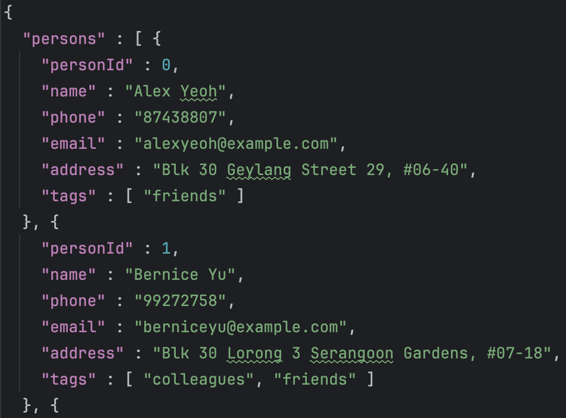
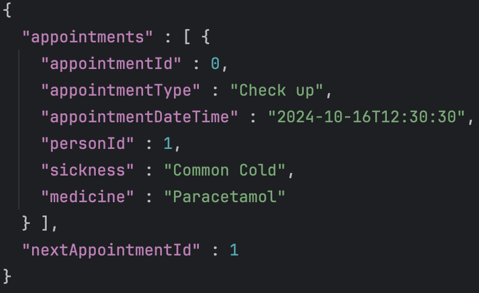

<br>


# User Guide

DocTrack is a desktop application for general practitioners (GPs) to quickly 
access patient contact details, appointments, and treatment records.
If you type fast, this application can serve as an excellent substitute
for your large medical files.

<!-- * Table of Contents -->
<page-nav-print />

<br>

---

<br>

## Quick start

1. Ensure you have Java `17` or above installed in your computer.
- To install `Java 17`, download Java. Refer to the [guide for installing Java](https://docs.oracle.com/en/java/javase/17/install/overview-jdk-installation.html).
  - Alternatively, download it from [here](https://www.oracle.com/java/technologies/javase/jdk17-archive-downloads.html).
- To check your Java version, refer [here](https://www.java.com/en/download/help/version_manual.html#).

2. Download our latest release file from [here](https://github.com/se-edu/addressbook-level3/releases). It is a `.jar` file.
For more information, see this: 
- [What is a JAR file?](https://docs.oracle.com/javase/8/docs/technotes/guides/jar/jarGuide.html)
- [How to run a JAR file](https://stackoverflow.com/questions/5774970/run-jar-file-in-command-prompt).
   

3. Copy the file to the folder you want to use as the _home folder_ for your DocTrack application.


4. Open a [command terminal](https://developer.mozilla.org/en-US/docs/Learn/Tools_and_testing/Understanding_client-side_tools/Command_line) of your preference, and run the commands:
    ```
    cd HOME_FOLDER
    java -jar DocTrack.jar
   ```
    For example, if you copied `DocTrack.jar` into the folder `C:/Users/user/Documents`,
    run the commands:
    ```
   cd C:/Users/user/Documents
   java -jar DocTrack.jar
   ```
    

5. A GUI similar to the one below should appear in a few seconds. Note how the DocTrack application contains some sample data.
   <br>
   


6. Type the command in the command box, which is indicated by `Enter command here...`. Press `Enter` to execute it. 
    * E.g. Typing **`help`** and pressing `Enter` will open the help window.<br>
   
   Some other examples of commands you can try:
   * `list person` : Lists all contacts.
   * `add person n/John Doe p/98765432 e/johnd@example.com a/John street, block 123, #01-01` : Adds a contact named `John Doe` to the Address Book.
   * `delete person 3` : Deletes the 3rd contact shown in the current list.
   * `clear person` : Deletes all contacts.
   * `exit` : Exits the app.

7. Refer to the [Command Overview](#command-overview) below for details of each command.

<br>

---

<br>

## Interacting with DocTrack

All interactions with the DocTrack platform are done through a series of **commands** entered by the user. These commands allow you to perform various **tasks**, such as adding, editing, listing, and managing persons/appointments. The commands are designed to be flexible and user-friendly, allowing **data fields** in any order, handling multiple entries for specific fields.

Here are some **key points** to keep in mind when using commands:

- You should supply all the fields (words in `UPPER_CASE`) that are needed for a command.<br>
  e.g. in `add person n/NAME`, `NAME` is a field which can be used as `add person n/John Doe`.

- The `INDEX` in command formats like `person edit` and `person delete` refers to the index number (shown beside the person or appointment) in the displayed list. The index **must be a positive integer** 1, 2, 3, …​

- Items in square brackets are optional.<br>
  e.g `n/NAME [t/TAG]` can be used as `n/John Doe t/friend` or as `n/John Doe`.

- Items with `…`​ after them can be used zero times or more times.<br>
  e.g. `[t/TAG]…​` can be used as ` ` (i.e. 0 times), `t/friend`, `t/friend t/family` etc.

- You can add fields in any order.<br>
  e.g. if the command specifies `n/NAME p/PHONE_NUMBER`, `p/PHONE_NUMBER n/NAME` is also acceptable.

- If you add extraneous fields for commands that do not take in fields (such as `help`, `list person`, `list appt`, `exit` and `clear`), they will be ignored.<br>
  e.g. if the command specifies `help 123`, it will be interpreted as `help`.

- If you are using a PDF version of this document, be careful when copying and pasting commands that span multiple lines. This is because some space characters surrounding line-breaks may be omitted when copied over.

<br>

---

<br>

## Command Overview

The following sections describe the various commands available in the DocTrack platform:

- [Person Commands](#person-commands)
- [Appointment Commands](#appointment-commands)
- [General Commands](#general-commands)

<br>

### Summary of commands

| Action                                                              | Format                                                                                                                    | Examples                                                                                                  |
|---------------------------------------------------------------------|---------------------------------------------------------------------------------------------------------------------------|-----------------------------------------------------------------------------------------------------------|
| **[Add person](#adding-a-person-add-person)**                       | `add person n/NAME p/PHONE_NUMBER e/EMAIL a/ADDRESS <br/><br/>[t/TAG]…​`                                                            | `add person n/James Ho p/22224444 e/jamesho@example.com a/123, Clementi Rd, 1234665 t/friend t/colleague` |
| **[List all persons](#listing-all-persons-list-person)**            | `list person`                                             <br/>                                                                | `list person`                                                                                             |
| **[Edit person](#editing-a-person-edit-person)**                    | `edit person INDEX [n/NAME] [p/PHONE_NUMBER] [e/EMAIL] [a/ADDRESS] [t/TAG]…​`                                             | `edit person 2 n/James Lee e/jameslee@example.com`                                                        |
| **[Find person](#finding-persons-by-name-find-person)**             | `find person KEYWORD [MORE_KEYWORDS]`                                                                                     | `find person James Jake`                                                                                  |
| **[Delete person](#deleting-a-person-delete-person)**               | `delete person INDEX`                                                                                                     | `delete person 3`                                                                                         |
| **[Clear all persons](#clearing-all-persons-clear-person)**         | `clear person`                                                                                                            | `clear person`                                                                                            |
| **[Add appointment](#adding-an-appointment-add-appt)**              | `add appt i/PATIENT_ID d/DATE_TIME ty/APPOINTMENT_TYPE` `s/SICKNESS` `m/MEDICINE`                   <br/>           <br/> | `add appt i/John Doe d/2024-12-01 09:30 ty/Consulation s/Diabetes m/Insulin`                              |
| **[List all appointments](#listing-all-appointments-list-appt)**    | `list appt`                                                                                                               | `list appt`                                                                                               |
| **[Edit appointment](#editing-an-appointment-edit-appt)**           | `edit appt INDEX [i/PATIENT_ID] [d/DATE_TIME] [ty/APPOINTMENT_TYPE] [s/SICKNESS] [m/MEDICINE]`                            | `edit appt 3 d/2024-12-05 13:00 m/Panadol`                                                                |
| **[Find appointment](#finding-an-appointment-find-appt)**           | `find appt KEYWORD [MORE_KEYWORDS]`                                                                                       | `find appt 2024-12-05`                                                                                    |
| **[Delete appointment](#deleting-an-appointment-delete-appt)**      | `delete appt INDEX`                                                                                                       | `delete appt 2`                                                                                           |
| **[Clear all appointments](#clearing-all-appointments-clear-appt)** | `clear appt`                                                                     <br/>                                    | `clear appt`                                                                                              |
| **[Help](#viewing-help-help)**                                      | `help`                                                                                                                    | `help`                                                                                                    |
| **[Exit](#exiting-the-program-exit)**                               | `exit`                                                                                                                    | `exit`                                                                                                    |

<br>

---

<br>

### Person Commands

A **person** is a patient with several fields: a name, a phone number, an email, an address and optional tags. These patients can be uniquely identified by their **patient ID (PID)** for easy reference. DocTrack allows you interact with patient information through different commands, which can be seen below.

<br>

##### Adding a person: `add person`

Adds a person to the address book.

**Format**: `add person n/NAME p/PHONE_NUMBER e/EMAIL a/ADDRESS [t/TAG]…​`

<box type="tip" seamless>

**Tip:** A person can have any number of tags (including 0). For example, `t/friend t/likes coding` has 2 tags and it is valid. 
</box>

**Examples**:

- `add person n/John Doe p/98765432 e/johnd@example.com a/John street, block 123, #01-01`
- `add person n/Betsy Crowe t/friend e/betsycrowe@example.com a/Newgate Prison p/1234567 t/criminal`

<br>

##### Listing all persons : `list person`

Shows a list of all persons in the address book.

**Format**: `list person`

<br>

##### Editing a person : `edit person`

Edits an existing person in the address book.

**Format**: `edit person INDEX [n/NAME] [p/PHONE] [e/EMAIL] [a/ADDRESS] [t/TAG]…​`

- Edits the person at the specified `INDEX`.
- At least one of the optional fields must be provided.
- Existing values will be updated to the input values.
- When editing tags, the existing tags of the person will be removed i.e adding of tags is not cumulative.
- You can remove all the person’s tags by typing `t/` without
  specifying any tags after it.

**Examples**:

- `edit person 1 p/91234567 e/johndoe@example.com` Edits the phone number and email address of the 1st person to be `91234567` and `johndoe@example.com` respectively.
- `edit person 2 n/Betsy Crower t/` Edits the name of the 2nd person to be `Betsy Crower` and clears all existing tags.

<br>

##### Finding persons by name: `find person`

Finds persons whose names contain any of the given keywords.

**Format**: `find person KEYWORD [MORE_KEYWORDS]`

- The search is case-insensitive. e.g `hans` will match `Hans`
- The order of the keywords does not matter. e.g. `Hans Bo` will match `Bo Hans`
- Only the name is searched.
- Only full words will be matched e.g. `Han` will not match `Hans`
- Persons matching at least one keyword will be returned (i.e. `OR` search).
  e.g. `Hans Bo` will return `Hans Gruber`, `Bo Yang`

**Examples**:

- `find person John` returns `john` and `John Doe`
- `find person alex david` returns `Alex Yeoh`, `David Li`<br><br>
  

<br>

##### Deleting a person : `delete person`

Deletes the specified person from the address book.

**Format**: `delete person INDEX`

- Deletes the person at the specified `INDEX`.

<box type="warning" seamless style="border: 1px solid red; background-color: #ffdddd;">

**Warning:** This action is irreversible. Ensure you have selected the correct person before deleting.

</box>

**Examples**:

- `list` followed by `delete person 2` deletes the 2nd person in the address book.
- `find Betsy` followed by `delete person 1` deletes the 1st person in the results of the `find` command.

<br>

##### Clearing all persons : `clear person`

Clears all entries from the address book after a validation check from the user.

**Format**: `clear person`

<box type="warning" seamless style="border: 1px solid red; background-color: #ffdddd;">

**Warning:** This action is irreversible. Ensure you have a backup of the patient data before clearing. 

</box>


<br>

---

<br>

### Appointment Commands

- An **appointment** is defined by several fields: an appointment type, appointment date & time, ID of the patient who is associated with the appointment, sickness, and medicine.  
- You can interact with appointments in DocTrack using the instructions below:

<br>

##### Adding an appointment: `add appt`

Adds an appointment to the DocTrack. 

**Format**: `add appt i/PATIENT_ID d/DATE_TIME ty/APPOINTMENT_TYPE s/SICKNESS m/MEDICINE`

<box type="tip" seamless>

**Note:** Format of `DATE_TIME` is `dd/MM/yyyy HH:mm:ss`. For example, `29/03/2025 10:30:00`.
</box>

**Examples**:

- `add appt i/John Doe d/2024-12-01 09:30 ty/Consulation s/Diabetes m/Insulin`
- `add appt i/Jo An d/30/01/2024-12-01 16:40:00 ty/Follow-up s/Asthma m/Inhaler`

<br>

##### Listing all appointments : `list appt`

Shows a list of all appointments in DocTrack.

**Format**: `list appt`

<br>

##### Editing an appointment : `edit appt`

Edits an existing appointment in DocTrack.

**Format**: `edit appt INDEX [i/PATIENT_ID] [d/DATE_TIME] [ty/APPOINTMENT_TYPE] [s/SICKNESS] [m/MEDICINE]`

- Edits the appointment at the specified `INDEX`.
- At least one of the optional fields must be provided.
- Existing values will be updated to the input values.

<box type="tip" seamless>

**Note:** Format of `DATE_TIME` is `dd/MM/yyyy HH:mm:ss`. For example, `29/03/2025 10:30:00`.
</box>

**Examples**:

- `edit appt 3 d/2024-12-05 13:00 m/Budesonide` Edits the date and time and the medicine to be `29/03/2025 10:30` and `Budesonide` respectively.

<br>

##### Deleting an appointment : `delete appt`

Deletes the specified appointment from DocTrack.

**Format**: `delete appt INDEX`

- Deletes the appointment at the specified `INDEX`.

<box type="warning" seamless style="border: 1px solid red; background-color: #ffdddd;">

**Warning:** This action is irreversible. Ensure you have selected the correct appointment before deleting.

</box>

**Examples**:

- `list appt` followed by `delete appt 2` deletes the 2nd appointment in DocTrack.

<br>

##### Clearing all appointments : `clear appt`

Clears all entries from the appointment book after a validation check from the user.

**Format**: `clear appt`

<box type="warning" seamless style="border: 1px solid red; background-color: #ffdddd;">

**Warning:** This action is irreversible. Ensure you have a backup of the appointment data before clearing.

</box>

<br>

---

<br>

### General Commands

**General commands** can help you with miscellaneous tasks related to patient and appointment management.

<br>

##### Viewing help : `help`

Shows a message explaining how to access the help page.


**Format**: `help`

<br>

##### Exiting the program : `exit`

Exits the program.

**Format**: `exit`

<br>

##### Saving the data

AddressBook data are saved in the hard disk automatically after any command that changes the data. There is no need to save manually.

<br>

##### Editing the data file

AddressBook data are saved automatically as a JSON file `[JAR file location]/data/addressbook.json`. Advanced users are welcome to update data directly by editing that data file.

<box type="warning" seamless>

**Caution:**
If your changes to the data file makes its format invalid, AddressBook will discard all data and start with an empty data file at the next run. Hence, it is recommended to take a backup of the file before editing it.<br>
Furthermore, certain edits can cause the AddressBook to behave in unexpected ways (e.g., if a value entered is outside the acceptable range). Therefore, edit the data file only if you are confident that you can update it correctly.
</box>

<br>

---

<br>

## FAQ

**Q**: How is my data stored?<br>
**A**: The data is stored in [.json](https://www.json.org/json-en.html) files, located in the `data` folder. The details of patients are stored in the `addressbook.json` file, while the appointments are stored in the `appointmentbook.json` file.
Examples:






<br><br>

**Q**: How do I transfer my data (in the `addressbook.json` and `appointmentbook.json` files) to another 
computer?<br>
**A**: [Install the DocTrack app](#quick-start) in the other computer. When you run it, it creates empty [.json](https://www.json.org/json-en.html) files in the `data` folder. Replace these empty files with the `addressbook.json` and `appointmentbook.json` files from your previous computer.

<br>

---

<br>

## Known issues

1. **When using multiple screens**, if you move the application to a secondary screen, and later switch to using only the primary screen, the GUI will open off-screen. The remedy is to delete the `preferences.json` file created by the application before running the application again.
2. **If you minimize the Help Window** and then run the `help` command (or use the `Help` menu, or the keyboard shortcut `F1`) again, the original Help Window will remain minimized, and no new Help Window will appear. The remedy is to manually restore the minimized Help Window.

