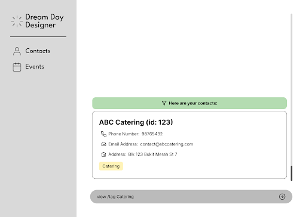

# Dream Day Designer User Guide

Dream Day Designer (DDD) is a **desktop app for wedding planners to keep track of clients' requirements and vendor services, optimized for use via a Line Interface** (CLI) while still having the benefits of a Graphical User Interface (GUI). If you can type fast, DDD can get your contact management tasks done faster than traditional GUI apps.

<!-- * Table of Contents -->
<page-nav-print />

--------------------------------------------------------------------------------------------------------------------

## Quick start

1. Ensure you have Java `17` or above installed in your Computer.

1. Download the latest `.jar` file from [here](https://github.com/se-edu/addressbook-level3/releases).

1. Copy the file to the folder you want to use as the _home folder_ for your DDD.

1. Open a command terminal, `cd` into the folder you put the jar file in, and use the `java -jar dreamdaydesigner.jar` command to run the application. 
   A GUI similar to the below should appear in a few seconds. Note how the app contains some sample data. 
   

1. Type the command in the command box and press Enter to execute it. e.g. typing **`help`** and pressing Enter will open the help window. 
   Some example commands you can try:

   * `view` : Lists all contacts.

   * `add n/John Doe p/98765432 e/johnd@example.com a/John street, block 123, #01-01` : Adds a contact named `John Doe` to DDD.

   * `delete 3` : Deletes the 3rd contact shown in the current list.

   * `clear` : Deletes all contacts.

   * `exit` : Exits the app.

1. Refer to the [Features](#features) below for details of each command.

--------------------------------------------------------------------------------------------------------------------

## Features

<box type="info" seamless>

**Notes about the command format:** 

* Words in `UPPER_CASE` are the parameters to be supplied by the user. 
  e.g. in `view /tag [TAG]`, `TAG` is a parameter which can be used as `view /tag `.

* Items with `…`​ after them can be used multiple times including zero times. 
  e.g. `/tag [TAG]…​` can be used as ` ` (i.e. 0 times), `/tag catering`, `/tag budget conscious /tag small scale` etc.

* Parameters can be in any order. 
  e.g. if the command specifies `/name [NAME] /hp [PHONE_NUMBER]`, `/hp [PHONE_NUMBER] /name [NAME]` is also acceptable.

* Extraneous parameters for commands that do not take in parameters (such as `help`, `list`, `exit` and `clear`) will be ignored. 
  e.g. if the command specifies `help 123`, it will be interpreted as `help`.

* If you are using a PDF version of this document, be careful when copying and pasting commands that span multiple lines as space characters surrounding line-breaks may be omitted when copied over to the application.
</box>

### Viewing help : `help`

Shows a message explaining how to access the help page.

Format: `help`

### Create a new contact: `add`

Add new contact (client or vendor) to contact list.

Format:

`add vendor /name [NAME] /hp [PHONE_NUMBER] /email [EMAIL] /address [ADDRESS] /service [SERVICE_TYPE] /tag [TAG]…​`

`add client /name [NAME] /hp [PHONE_NUMBER] /email [EMAIL] /address [ADDRESS] /date [WEDDING_DATE] /tag [TAG]…​`
<box type="tip" seamless>

**Tip:** A person can have any number of tags (including 0)
</box>

Examples:
* `add vendor /name ABC Catering /hp 98765432 /email contact@abccatering.com /address Blk 123 Bukit Merah St 7 /service Catering`
* `add client /name Jane Doe /hp 91234567 /email jane.doe@example.com /address Blk 231 Sembawang St 4 /date 2024-12-15`

### Listing all persons : `view`

Shows a list of all contacts in DDD, sorted alphabetically.

Format: `view`

### Locating contacts by tag: `view /tag`

View all contacts based on tags.

Format: `view /tag [TAG]`

* Only one tag name can be specified each time. 
* If more than one word is entered, the entire phrase will be treated as one tag.
* Casing does not matter. e.g. `Vendor` will match `vendor`
* Only full words will be matched e.g. `Clients` will not match `Client`

Examples:
* `view /tag Catering` returns all contacts that have the tag `Catering` or `catering`
  

### Deleting a contact : `delete`

Deletes an existing contact (client or vendor) from the contact list using the contact's unique contact ID.

Format: 
`delete vendor /id [CONTACT_ID]` 

`delete client /id [CONTACTID]`

* Deletes the contact of the specific type with the specified `contact ID`.
* The contact ID is **guaranteed to be a positive integer** 1, 2, 3, …​

Examples:
* `delete vendor /id 123`
* `delete client /id 456`

### Clearing all entries : `clear`

Clears all entries from DDD.

Format: `clear`

### Exiting the program : `exit`

Exits the program.

Format: `exit`

### Saving the data

DDD data are saved in the hard disk automatically after any command that changes the data. There is no need to save manually.

If you want to save the data to somewhere else or rename it into a new file, you can also save the data by using the `save` command.

Format: `save /dir [DIRECTORY] /name [NAME_OF_JSON_FILE]`

Examples:
* `save /dir . /name contacts`
* `save /dir ../data/ /name food_provider`
* `save /dir ~/Desktop/ /name all_names`

### Editing the data file

DDD data are saved automatically as a JSON file `[JAR file location]/data/ddd.json`. Advanced users are welcome to update data directly by editing that data file.

<box type="warning" seamless>

**Caution:**
If your changes to the data file makes its format invalid, DDD will discard all data and start with an empty data file at the next run.  Hence, it is recommended to take a backup of the file before editing it. 
Furthermore, certain edits can cause the DDD to behave in unexpected ways (e.g., if a value entered is outside the acceptable range). Therefore, edit the data file only if you are confident that you can update it correctly.
</box>

### Archiving data files `[coming in v2.0]`

_Details coming soon ..._

--------------------------------------------------------------------------------------------------------------------

## FAQ

**Q**: How do I transfer my data to another Computer? 
**A**: Install the app in the other computer and overwrite the empty data file it creates with the file that contains the data of your previous DDD home folder.

--------------------------------------------------------------------------------------------------------------------

## Known issues

1. **When using multiple screens**, if you move the application to a secondary screen, and later switch to using only the primary screen, the GUI will open off-screen. The remedy is to delete the `preferences.json` file created by the application before running the application again.
2. **If you minimize the Help Window** and then run the `help` command (or use the `Help` menu, or the keyboard shortcut `F1`) again, the original Help Window will remain minimized, and no new Help Window will appear. The remedy is to manually restore the minimized Help Window.

--------------------------------------------------------------------------------------------------------------------

## Command summary

| Action                    | Format, Examples                                                                                                                                                                                                                                                     |
|---------------------------|----------------------------------------------------------------------------------------------------------------------------------------------------------------------------------------------------------------------------------------------------------------------|
| **Create Vendor Contact** | `add vendor /name [NAME] /hp [PHONE_NUMBER] /email [EMAIL] /address [ADDRESS] /service [SERVICE_TYPE] /tag [TAG]…​`   e.g., `add vendor /name ABC Catering /hp 98765432 /email contact@abccatering.com /address Blk 123 Bukit Merah St 7 /service Catering`       |
| **Create Client Contact** | `add client /name [NAME] /hp [phone number] /hp [PHONE_NUMBER] /email [EMAIL] /address [ADDRESS] /date [WEDDING_DATE] /tag [TAG]…​`   e.g., `add client /name Jane Doe /hp 91234567 /email jane.doe@example.com /address Blk 231 Sembawang St 4 /date 2024-12-15` |
| **Clear**                 | `clear`                                                                                                                                                                                                                                                              |
| **Delete Vendor Contact** | `delete vendor /id [CONTACT_ID]`  e.g., `delete vendor /id 123`                                                                                                                                                                                                   |
| **Delete Client Contact** | `delete client /id [CONTACT_ID]`  e.g., `delete client /id 456`                                                                                                                                                                                                   |
| **View**                  | `view /tag [TAG]`  e.g., `view /tag entertaining`                                                                                                                                                                                                                 |
| **View All**              | `view`                                                                                                                                                                                                                                                               |
| **Save**                  | `save /dir [DIRECTORY] /name [NAME_OF_JSON_FILE]`  e.g., `save /dir ~/Desktop/ /name all_names`                                                                                                                                                                   |
| **Help**                  | `help`                                                                                                                                                                                                                                                               |
