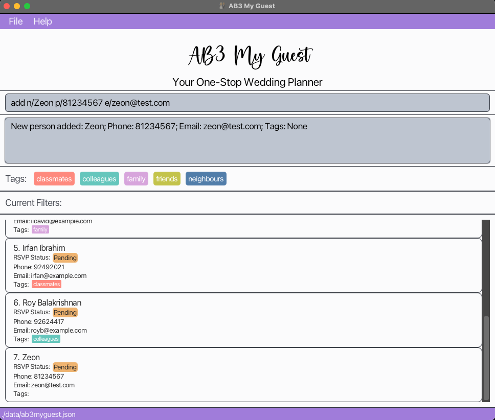
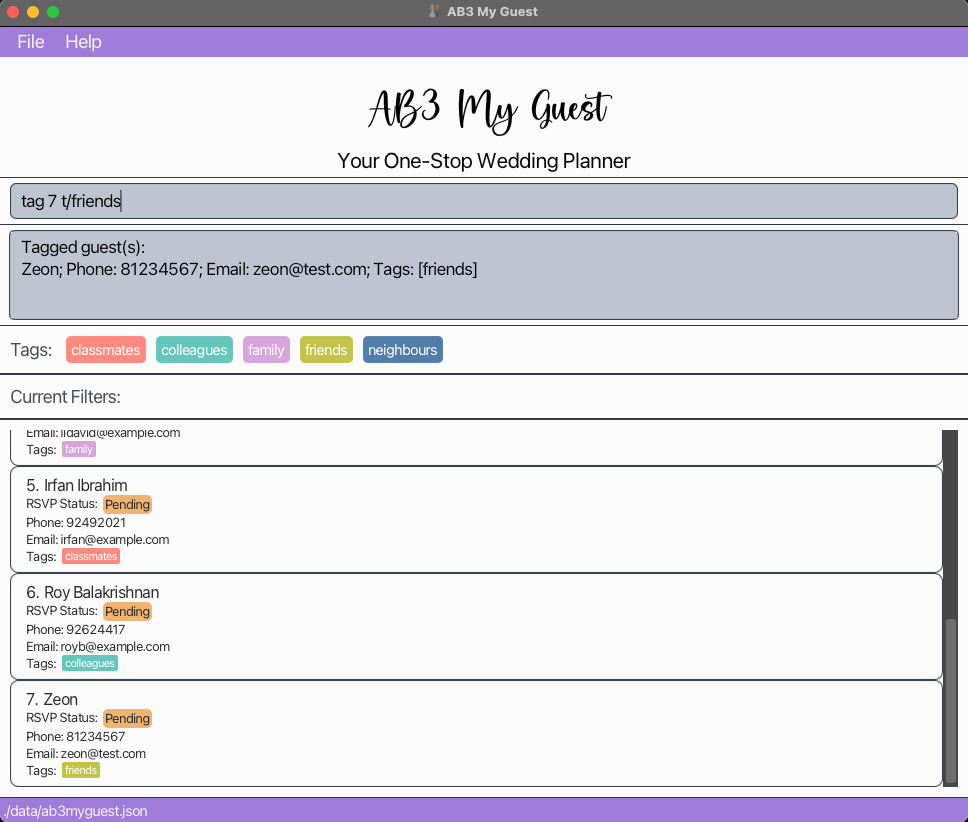
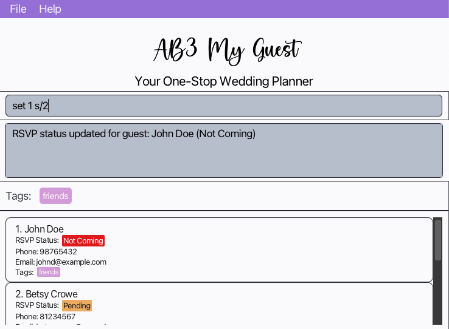
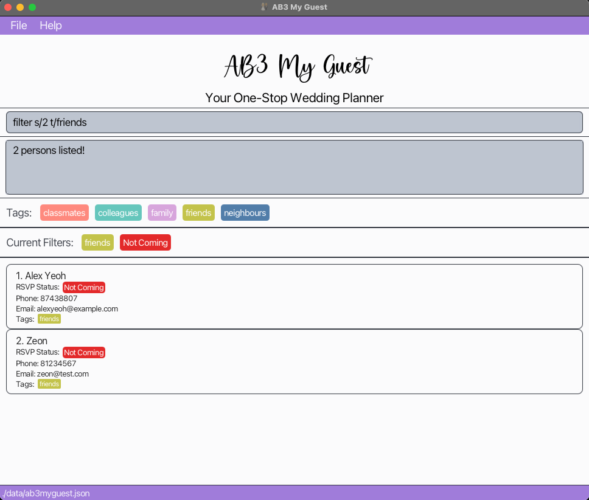
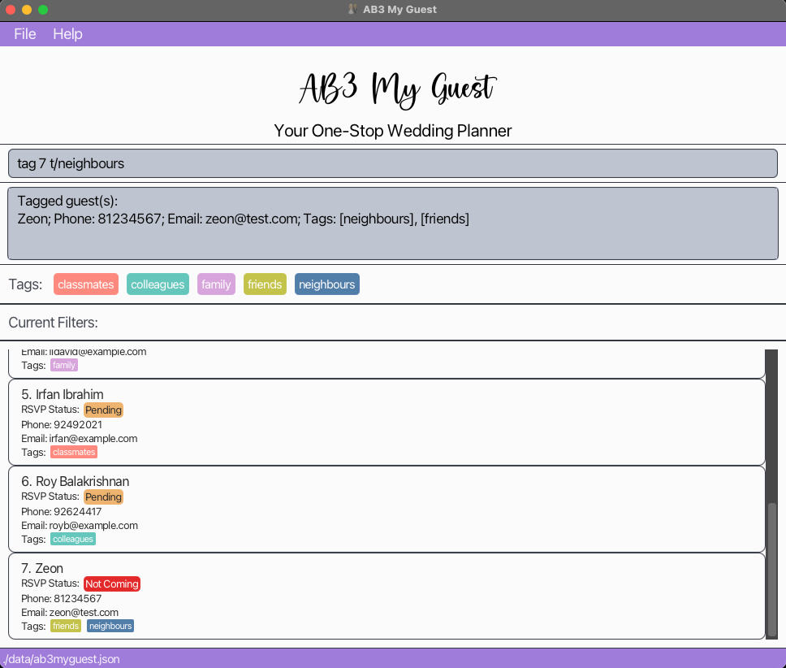
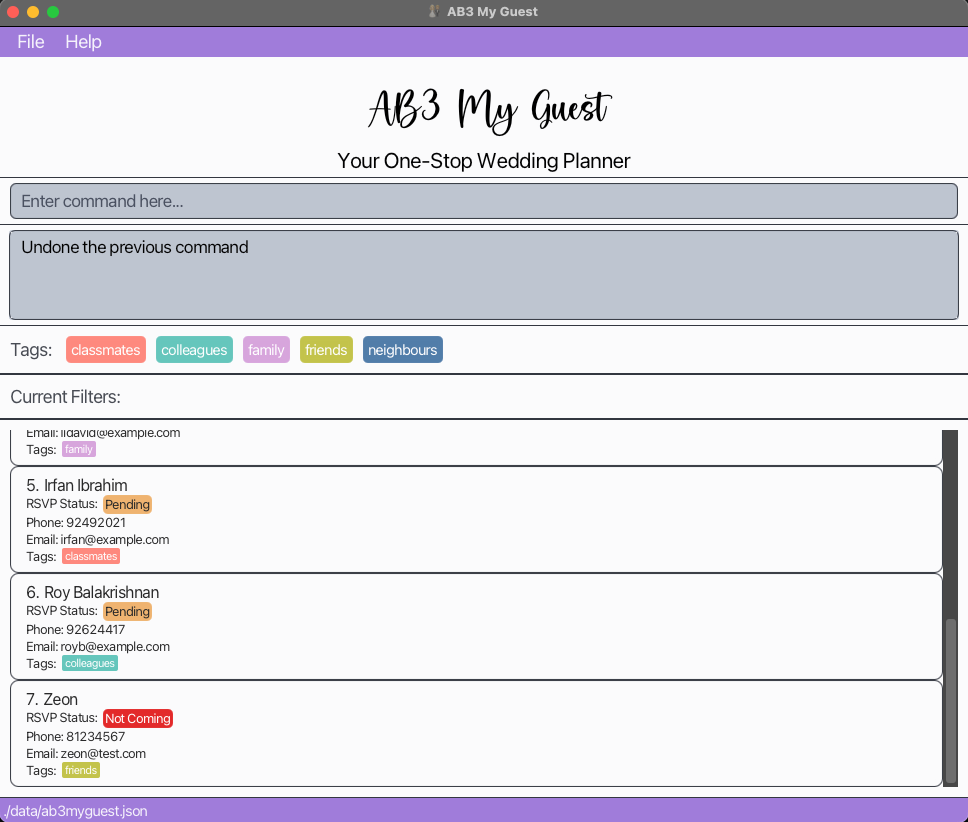

Managing dozens of guests, AB3 My Guest is your go-to wedding planner which supports _bulk tagging_, _layer filtering_, and a dedicated RSVP field to track your wedding's attendees!

AB3 My Guest is a **desktop app for managing wedding guests, optimized for use via a Command Line Interface** (CLI) while still having the benefits of a Graphical User Interface (GUI). If you can type fast, AB3 My Guest can get your guest management tasks done faster than traditional methods of managing guest lists!

* Table of Contents
{:toc}
--------------------------------------------------------------------------------------------------------------------

## Quick start

1. Ensure you have Java `17` or above installed in your computer. To check, open a command terminal, and type `java -version`.

2. Download the latest `.jar` file from [here](https://github.com/AY2425S1-CS2103T-W11-2/tp/releases).

3. Copy the file to the folder you want to use as the _home folder_ for your AB3 My Guest application.

4. To open the application,

    * Open a command terminal in your computer.
    * `cd` into the folder you put the jar file in (e.g If the jar file is stored in `/Desktop/TestFile`, then the command should be `cd /Desktop/TestFile`)
    * Use the `java -jar ab3myguest.jar` command to run the application. 
    * A GUI similar to the below should appear in a few seconds. Note how the app contains some sample data. 

5. Type the command in the command box and press Enter to execute it. e.g. typing **`help`** and pressing Enter will open the help window. 
   Some example commands you can try:

   * `list` : Lists all guests.

   * `add n/John Doe p/98765432 e/johndoe@example.com` : Adds a guest named `John Doe` to the guest list.

   * `delete 3` : Deletes the 3rd guest shown in the **current** list.

   * `clear` : Deletes all contacts.

   * `exit` : Exits the app.

6. Refer to the [Features](#features) below for details of each command.
7. Do note that users should open only one instance of AB3 My Guest at a time.

--------------------------------------------------------------------------------------------------------------------

## Features

**:information_source: Notes about the command format:** 

* Words in `UPPER_CASE` are the parameters to be written by the user. 
  e.g. in `add n/NAME p/PHONE_NUMBER e/EMAIL`, `NAME`, `PHONE_NUMBER` and `EMAIL` are parameters which are user inputs, such as `add n/John Doe p/91234567 e/johndoe@example.com`.

* Items in square brackets are optional. 
  e.g. `n/NAME [t/TAG]` can be used as `n/John Doe t/bride's side` or as `n/John Doe`.

* Items with `…`​ after them can be used multiple, including zero times. 
  e.g. `[t/TAG]…​` can be used as ` ` (i.e. 0 times), `t/friends`, `t/friends t/family` etc.

* Parameters can be in any order. 
  e.g. the `add` command specifies `n/NAME p/PHONE_NUMBER`, `p/PHONE_NUMBER n/NAME` is also acceptable.

* Extraneous parameters for commands that do not take in parameters (such as `help`, `list`, `exit`, `clear`, `undo`) will be ignored. 
  e.g. if the command specifies `help 123`, it will be interpreted as `help`.

* If you are using a PDF version of this document, be careful when copying and pasting commands that span multiple lines as space characters surrounding line-breaks may be omitted when copied over to the application.

### Viewing help : `help`

Shows a message explaining how to access the help page.

Format: `help`

### Listing all guests : `list`

Shows a list of **all** guests in the guest list.

Format: `list`

### Adding a guest: `add`

Adds a guest to the guest list.

Format: `add n/NAME p/PHONE_NUMBER e/EMAIL [t/TAG]…​`
* Names cannot be more than 100 characters long.
* Names are **case-sensitive**. eg. 'John Doe' is different from 'john doe'
* Guests with the exact same name cannot be added to the guest list. Users are advised to add their guests' last names or other identifiers if needed.
* Phone numbers must be **exactly** 8 digits.
* Tags must be created before they can be assigned to a guest. Refer to [newtag](#creating-a-new-tag-newtag) on how to create a tag.

:bulb: **Tip:**
A guest can have any number of tags (including 0)

Examples:
* `add n/John Doe p/98765432 e/johnd@example.com t/broom's side`
* `add n/Betsy Crowe p/81234567 e/betsycrowe@example.com t/bride's side`
* `add n/Zeon p/81234567 e/zeon@example.com`

### Deleting a guest : `delete`

Deletes the specified guest from the address book.

Format: `delete INDEX`

* Deletes the guest at the specified `INDEX`.
* Only one guest can be deleted in each delete command.
* The index refers to the index number shown in the displayed guest list.
* The index **must be within the index boundaries of the guest list**. ie. If there are 10 guests, INDEX accepts values from 1 to 10.

Examples:
* `list` followed by `delete 2` deletes the 2nd guest in the address book.
* `find yu` followed by `delete 2` deletes the 2nd guest in the results of the `find` command.

### Editing a guest : `edit`

Edits an existing guest in the address book.

Format: `edit INDEX [n/NAME] [p/PHONE] [e/EMAIL] [t/TAG]…​`

* Edits the guest at the specified `INDEX`. The index refers to the index number shown in the displayed guest list. 
* The index **must be within the index boundaries of the guest list**. ie. If there are 10 guests, INDEX accepts values from 1 to 10.
* At least one of the optional fields must be provided.
* Fields which are not provided will not be edited.
* All optional fields must adhere to the restrictions specified in the `add` command.
* If the input values are valid, existing values will be updated to the input values.
* When editing tags, the existing tags of the guest will be removed i.e. adding of tags is not cumulative.
* You can remove all the guest’s tags by typing `t/` without
  specifying any tags after it.

Examples:
*  `edit 1 p/91234567 e/johndoe@example.com`
*  `edit 1 n/Alan Yeoh t/`

### Creating a new tag: `newtag`

Creates new tag(s) that can be used to tag guests with.

Format: `newtag t/TAG1…​`
* Each tag name cannot be more than 50 characters long.
* Tag name can only contain alphanumeric characters, apostrophes, parenthesis and whitespaces.
* Tag name cannot be empty, or consist of only whitespaces.
* Leading and trailing spaces are ignored. e.g `newtag t/ bride's side  t/ groom's side  ` is the same as `newtag t/bride's side t/groom's side`.
* Duplicate tags (with the same name) are **not** allowed.
* Tag names are **case-insensitive**. e.g `newtag t/BRIDE'S SIDE` is the same as `newtag t/Bride's Side`
* Only 30 (or fewer) predefined tags can exist at any point.
* Attempting to add tags with mix of invalid and valid names at once will result in an error.
* Attempting to add a mix of duplicate and non-duplicate tags at once will only allow the non-duplicate tags to be added.

:bulb: **Tip:**
You may add any number of tags at once (as long as the total number does not exceed 30). e.g. `newtag t/bride's side t/groom's side t/friends`

Examples:
* `newtag t/bride's side`
* `newtag t/bride's side t/groom's side`

### Deleting an existing tag: `deletetag`

Deletes existing tag(s) defined previously.

Format: `deletetag [-force] t/TAG1…​`
* Each tag name cannot be more than 50 characters long.
* Tag name can only contain alphanumeric characters, apostrophes, parenthesis and whitespaces.
* Tag name cannot be empty, or consist of only whitespaces.
* Leading and trailing spaces are ignored. e.g `deletetag t/ bride's side  t/ groom's side` is the same as `deletetag t/bride's side t/groom's side`.
* User cannot delete a tag that has not been added via `newtag` before.
* If any guest currently has the tag `friends`, `deletetag t/friends` will not work. To force delete the tag and remove it from all guests, use `deletetag -force t/friends`.
* Tag names are **case-insensitive**. e.g `deletetag t/BRIDE'S SIDE` is the same as `deletetag t/Bride's Side`.
* Attempting to delete a mix of existing and non-existent tags at once will only allow the existing tags to be deleted.

:bulb: **Tip:**
You may delete any number of tags at once. e.g. `deletetag t/bride's side t/groom's side t/friends`

Examples:
* `deletetag t/bride's side`
* `deletetag t/bride's side t/groom's side`
* `deletetag -force t/bride's side`

### Renaming a tag : `renametag`

Renames a tag currently in the tag list.

Format: `renametag t/TAG1 t/TAG2`

* Renames the tag `TAG1` to become `TAG2`.
* Only one tag can be renamed in each rename command.
* The new tag name cannot be a tag already in the current tag list e.g. `friends` and `colleagues` already exist in the tag list. `renametag t/friends t/colleagues` is an invalid command.
* The target tag must be a tag that has been defined via `newtag` before. e.g. `friends` is a predefined tag but `colleagues` is not. `renametag t/colleagues t/friends` is an invalid command.

Examples:
* `renametag t/friends t/colleagues`

### Tagging a guest: `tag`

Tags a guest with the specified tag.

Format: `tag INDEX…​ t/TAG…​`
* Tag must have already been defined using `newtag` before tagging it to a guest.
* The index(es) **must be within the index boundaries of the guest list**. ie. If there are 10 guests, INDEX accepts values from 1 to 10.
* Attempting to tag guests with an invalid tag will not halt tagging of valid tags.  e.g. `friends` is a tag not created while `bride's side` is. The command `tag 1 t/friends t/bride's side` will still successfully tag `bride's side` on the guest indexed at 1. 
* Attempting to tag guests with a tag already on some will not halt tagging of the tag on other guests.  e.g. `friends` is a tag on guest indexed at 1 but not on guest indexed at 2. The command `tag 1 2 t/friends` will still successfully tag `friends` on the guest indexed at 2.

Examples:
* `tag 1 t/bride's side`
* `tag 1 2 3 t/bride's side`
* `tag 1 t/bride's side t/friends`
* `tag 1 2 3 t/bride's side t/friends`

### Removing a tag from a guest: `untag`

Removes a tag from a guest.

Format: `untag INDEX…​ t/TAG…​`
* A guest must already have the tag for it to be removed.
* Index(es) of the guest(s) must be within valid range (i.e. greater than 0 and less than or equals to the current shown list length)
* Attempting to untag guests with an invalid tag will not halt untagging of valid tags.  e.g. `friends` is a tag not created while `bride's side` is. The command `untag 1 t/friends t/bride's side` will still successfully untag `bride's side` on the guest indexed at 1.
* Attempting to untag guests with a tag already on some will not halt untagging of the tag on other guests.  e.g. `friends` is a tag on guest indexed at 1 but not on guest indexed at 2. The command `untag 1 2 t/friends` will still successfully tag `friends` on the guest indexed at 1.

Examples:
* `untag 1 t/bride's side`
* `untag 1 2 3 t/bride's side`
* `untag 1 t/bride's side t/friends`
* `untag 1 2 3 t/bride's side t/friends`

### Setting RSVP status for a guest : `setrsvp`

Toggles the RSVP status for a guest between `Coming`, `Not Coming` and `Pending`.

Format: `setrsvp INDEX s/STATUS_INDEX`
* Toggles the RSVP status of the guest at the specified `INDEX`. The index refers to the index number shown in the displayed guest list.
* The index **must be within the index boundaries of the guest list**. ie. If there are 10 guests, INDEX accepts values from 1 to 10.
* `STATUS_INDEX` accepts 3 possible values:
  * `1` represents `Coming`
  * `2` represents `Not Coming`
  * `3` represents `Pending`
* By default, the RSVP status for all guests is `Pending`.

:bulb: **Tip:**
You may only set one guest's RSVP status in each command. i.e. Setting multiple guests' statuses at once is not supported.

Example:
* `setrsvp 1 s/1`
* `setrsvp 2 s/3`
* `setrsvp 1 s/2`

### Filtering using RSVP status or tags : `filter`

Filters the currently shown list based on RSVP status or tag. Filter predicates are displayed in the filter panel.

Format: `filter [s/STATUS_INDEX] [t/TAG]…​`
* At least one of the optional fields must be provided.
* `STATUS_INDEX` accepts 3 possible values:
    * `1` represents `Coming`
    * `2` represents `Not Coming`
    * `3` represents `Pending`
* The filter accepts multiple predicates. For example, `filter t/bride's side t/neighbours` and `filter s/3 t/neighbours` are both valid commands.
* Note that `filter s/3 t/neighbours` is equivalent to typing `filter s/3` then `filter t/neighbours` or `filter t/neighbours s/3`.
* Only one RSVP status can be used for filtering in each command, but multiple tags can be used. i.e `filter s/1 s/2` is not a valid command.

:bulb: **Tip:**
You can clear all filters by running the `list` command.

Example:
* `filter s/1`
* `filter t/bride's side t/neighbours`
* `filter s/3 t/neighbours`

### Locating guests by name: `find`

Finds guests whose names contain any of the given keywords.

Format: `find KEYWORD…​`

* The search is case-insensitive. e.g. `alex` will match `Alex`
* The order of the keywords does not matter. e.g. `Alex Yu` will match `Yu Alex`
* Only the name is searched.
* Only full words will be matched e.g. `Ale` will not match `Alex`
* Guests matching at least one keyword will be returned (i.e. `OR` search).
  e.g. `Alex Yu` will return `Alex Yeoh`, `Bernice Yu` and `Terrence Yu`
* Find will apply to the whole list, not the currently filtered list, 
 ignoring all previous filter and find commands.
 i.e. `find alex bernice` is not the same as `find alex` followed by `find bernice`.

Examples:
* `find alex`
* `find alex yu`

### Undoing latest command : `undo`

Undoes the changes from the latest command.

Format: `undo`

* Commands that can be undone:
  * `add`
  * `delete`
  * `newtag`
  * `deletetag`
  * `renametag`
  * `tag`
  * `untag`
  * `edit`
  * `filter`
  * `find`
  * `setrsvp`
* Only the **latest** successfully executed command can be undone.

Examples:
* `tag 7 t/neighbours` is the latest successfully executed

### Clearing all entries : `clear`

Clears all entries from the address book. i.e deleting all guests.

Format: `clear`

:bulb: **WARNING:**
This command will permanently delete all guests in your address book.   Ensure that you have saved a copy of the address book somewhere else.

### Exiting the program : `exit`

Exits the program.

Format: `exit`

### Saving the data

AB3 My Guest data is saved in the hard disk automatically after any command that changes the data. There is no need to save manually.

### Editing the data file

AB3 My Guest data is saved automatically as a JSON file `[JAR file location]/data/addressbook.json`. Advanced users are welcome to update data directly by editing that data file.

:exclamation: **Caution:**
If your changes to the data file makes its format invalid, AB3 My Guest will discard all data and start with an empty data file at the next run. Hence, it is recommended to take a backup of the file before editing it. 
Furthermore, certain edits can cause the AB3 My Guest application to behave in unexpected ways (e.g., if a value entered is outside the acceptable range). Therefore, edit the data file only if you are confident that you can update it correctly.

### Archiving data files `[coming in v2.0]`

A future development is archiving data files to protect against accidental `clear` commands or corrupted data files which cannot be recovered. 
This feature will allow users to archive data files, acting as a backup.

--------------------------------------------------------------------------------------------------------------------

## FAQ

**Q**: How do I transfer my data to another Computer? 
**A**: Install the app in the other computer and overwrite the empty data file it creates with the file that contains the data of your previous AB3 My Guest home folder.

**Q**: I accidentally entered the command `clear` and removed my entire list of guests. How do I recover it? 
**A**: Unfortunately, there is no way to recover the list. Hence, we recommend occasionally copying the JSON file at `[JAR file location]/data/addressbook.json` into a separate file saved in your computer.

--------------------------------------------------------------------------------------------------------------------

## Known issues

1. **When using multiple screens**, if you move the application to a secondary screen, and later switch to using only the primary screen, the GUI will open off-screen. The remedy is to delete the `preferences.json` file created by the application before running the application again.
2. **If you minimize the Help Window** and then run the `help` command (or use the `Help` menu, or the keyboard shortcut `F1`) again, the original Help Window will remain minimized, and no new Help Window will appear. The remedy is to manually restore the minimized Help Window.

--------------------------------------------------------------------------------------------------------------------

## Command summary

Command | Format, Examples
--------|------------------
**Help** | `help`
**List** | `list`
**Add** | `add n/NAME p/PHONE_NUMBER e/EMAIL [t/TAG]…​`   e.g. `add n/John Doe p/91234567 e/johndoe@example.com t/groom's side`
**Delete** | `delete INDEX`  e.g., `delete 3`
**Edit** | `edit INDEX [n/NAME] [p/PHONE_NUMBER] [e/EMAIL] [t/TAG]…​`  e.g.`edit 2 n/James Lee e/jameslee@example.com`
**NewTag** | `newtag t/TAG…​`   e.g. `newtag bride's side`
**DeleteTag** | `deletetag t/TAG…​`   `deletetag -force t/TAG…​`  e.g. `deletetag t/bride's side`  e.g. `deletetag -force t/bride's side`
**RenameTag** | `renametag t/TAG1 t/TAG2`   e.g. `renametag t/friends t/colleagues`
**Tag** | `tag INDEX…​ t/TAG…​`   e.g. `tag 1 2 t/groom's side t/family`
**Untag** | `untag INDEX…​ t/TAG…​`   e.g. `untag 1 2 t/bride's side t/family`
**SetRSVP** | `setrsvp INDEX STATUS_INDEX`
**Filter** | `filter [s/STATUS_INDEX] [t/TAG]…​`   e.g. `filter s/3 t/neighbours`
**Find** | `find KEYWORD…​`  e.g. `find James Jake`
**Clear** | `clear`
**Undo** | `undo`
**Exit** | `exit`

