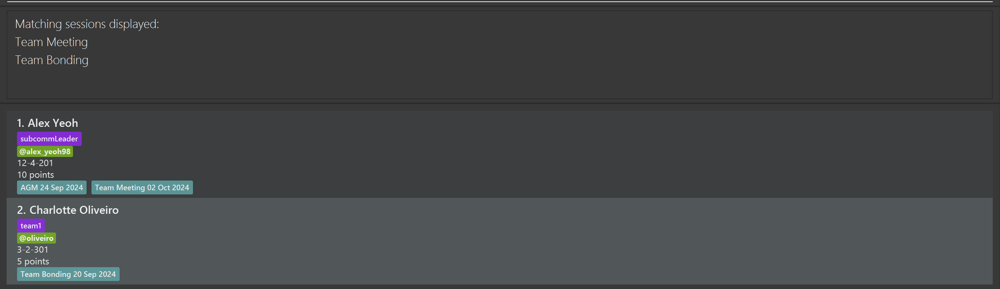

<!--
layout: default.md
title: "User Guide"
pageNav: 3

---

-->

# HallPointer User Guide

HallPointer is a **dedicated desktop app designed specifically for CCA leaders in hall environments** to efficiently manage and track members' information with ease and accuracy. Unlike general-purpose applications like Excel, HallPointer offers a streamlined, single-step platform that is optimized for quick command-based input and offers a more intuitive experience through its integration of both CLI and GUI elements.

With HallPointer, you can easily track member details such as names, Telegram handles, room numbers, points earned, and session attendance, all in one organized space. The app maintains built-in logic for tracking and updating member information, reducing the risk of manual errors and eliminating the need for complex formulas or repetitive data entry. By automating key management tasks and ensuring data consistency, HallPointer frees up time for CCA leaders, allowing them to focus on what truly matters—building a vibrant and engaged community.

If you’re a CCA leader who values speed, organization, and reliability, HallPointer is the perfect tool to simplify your workflow and enhance your member tracking processes.

<!-- * Table of Contents -->
<page-nav-print />

---

Share

JL
You said:

<!--
layout: default.md
title: "User Guide"
pageNav: 3

---

-->

# HallPointer User Guide

HallPointer is a **desktop app for managing contacts, optimized for use via a Line Interface** (CLI) while still having the benefits of a Graphical User Interface (GUI). If you can type fast, it can get your contact management tasks done faster than traditional GUI apps.

<!-- * Table of Contents -->
<page-nav-print />

---

## Quick start

1. Ensure you have Java 17 or above installed in your Computer.

1. Download the latest .jar file from [here](https://github.com/ay2425s1-cs2103t-w14-3/tp/releases/latest).

1. Copy the file to the folder you want to use as the _home folder_ for your .

1. Open a command terminal, cd into the folder you put the jar file in, and use the java -jar hallpointer.jar command to run the application. 
   A GUI similar to the below should appear in a few seconds. Note how the app contains some sample data. 
   

1. Type the command in the command box and press Enter to execute it. e.g. typing **help** and pressing Enter will open the help window. 
   Some example commands you can try:

   - list_members : Lists all contacts.

   - add_member n/John Doe r/4-3-301 t/johndoe123 tag/logistics : Adds a contact named John Doe to Hall Pointer.

   - delete_member 3 : Deletes the 3rd contact shown in the current list.

   - clear : Deletes all contacts.

   - exit : Exits the app.

1. Refer to the [Features](#features) below for details of each command.

---

## Features

<box type="info" seamless>

**Notes about the command format:** 

- Words in UPPER_CASE are the parameters to be supplied by the user. 
  e.g. in add_member n/NAME, NAME is a parameter which can be used as add_member n/John Doe.

- Items in square brackets are optional. 
  e.g n/NAME [t/TAG] can be used as n/John Doe t/friend or as n/John Doe.

- Items with …​ after them can be used multiple times including zero times. 
  e.g. [t/TAG]…​ can be used as   (i.e. 0 times), t/friend, t/friend t/family etc.

- Parameters can be in any order. 
  e.g. if the command specifies n/NAME tg/TELEGRAM, tg/TELEGRAM n/NAME is also acceptable.

- Extraneous parameters for commands that do not take in parameters (such as help, list, exit and clear) will be ignored. 
  e.g. if the command specifies help 123, it will be interpreted as help.

- If you are using a PDF version of this document, be careful when copying and pasting commands that span multiple lines as space characters surrounding line-breaks may be omitted when copied over to the application.

</box>

### Viewing help : help

Shows a message explaning how to access the help page.

Format: help

### Adding a member: add_member

Adds a member to Hall Pointer.

Format: add_member n/NAME r/BLOCK/FLOOR/ROOM_NUMBER t/TELEGRAM_HANDLE [tag/TAG]…​​

<box type="tip" seamless>

**Tip:** A member can have any number of tags (including 0)

</box>

Examples:

- add_member n/John Doe r/4-3-301 t/johndoe123
- add_member n/Betsy Crowe r/2-5-120 t/betsy_crowe tag/logistics

### Listing all members : list

Shows a list of all members in Hall Pointer.

Format: list

### Updating a member : update_member

Updates an existing member in Hall Pointer.

Format: update_member INDEX [n/NAME] [r/BLOCK-FLOOR-ROOM_NUMBER] [t/TELEGRAM_HANDLE] [tag/TAG]…​​

- Updates the member at the specified INDEX. The index refers to the index number shown in the displayed member list. The index **must be a positive integer** 1, 2, 3, …​
- At least one of the optional fields must be provided.
- Existing values will be updated to the input values.
- When updating tags, the existing tags of the member will be removed i.e adding of tags is not cumulative.
- You can remove all the member’s tags by typing tag/ without
  specifying any tags after it.

Examples:

- update_member 1 t/johndoe123_updated n/Johnson Doe Updates the telegram and name of the 1st member to be johndoe123_updated and Johnson Doe respectively.
- update_member 2 n/Betsy Crower tag/ Updates the name of the 2nd member to be Betsy Crower and clears all existing tags.

### Locating members by name: find_members

Finds members whose names contain any of the given keywords.

Format: find_members KEYWORD [MORE_KEYWORDS]

- The search is case-insensitive. e.g hans will match Hans
- The order of the keywords does not matter. e.g. Hans Bo will match Bo Hans
- Only the name is searched.
- Only full words will be matched e.g. Han will not match Hans
- Members matching at least one keyword will be returned (i.e. OR search).
  e.g. Hans Bo will return Hans Gruber, Bo Yang

Examples:

- find_members John returns john and John Doe
- find_members alex david returns Alex Yeoh, David Li 
  

### Deleting a member : delete_member

Deletes the specified member from Hall Pointer.

Format: delete_member INDEX

- Deletes the member at the specified INDEX.
- The index refers to the index number shown in the displayed member list.
- The index **must be a positive integer** 1, 2, 3, …​

Examples:

- list_members followed by delete_member 2 deletes the 2nd member in Hall Pointer.
- find_members Betsy followed by delete_member 1 deletes the 1st member in the results of the find command.

### Adding a Session: add_session

Adds a session to Hall Pointer and associates it with specified members.

Format: add_session s/NAME d/DATE p/POINTS m/INDEX...

- Adds a session with the specified NAME, DATE, and POINTS.
- **Points** should be between 0 and 100. A maximum of 100 points can be awarded to any session.
- The index (INDEX) refers to the index number shown in the displayed member list and **must be a positive integer** (1, 2, 3, …).
- If one or more INDEX values are provided, the session will be associated with those members.

Examples:

- list_members followed by add_session s/Rehearsal d/24 Oct 2024 p/2 m/1 m/3 Adds a session named "Rehearsal" on 24 Oct 2024 worth 2 points, associated with the members at indexes 1 and 3 in the displayed list.

### Locating members with associated sessions by name: find_sessions

Finds members whose sessions' names contain any of the given keywords.

Format: find_sessions KEYWORD [MORE_KEYWORDS]

- The search is case-insensitive. e.g hans will match Hans
- The order of the keywords does not matter. e.g. Hans Bo will match Bo Hans
- Only the name is searched.
- Only full words will be matched e.g. Han will not match Hans
- Members matching at least one keyword will be returned (i.e. OR search).
  e.g. Hans Bo will return Hans Gruber, Bo Yang
- The search does not care if the member is currently displayed.

Examples:

- find_sessions Team returns any member with a sessions such as "Team meeting" and "Team bonding"
- find_sessions team returns Alex Yeoh, Charlotte Oliveiro 
  

### Deleting a Session: delete_session

Deletes a session associated with one or more members in Hall Pointer.

Format: delete_session s/NAME m/INDEX...

- Deletes the session with the specified NAME.
- The index (INDEX) refers to the index number shown in the displayed member list and **must be a positive integer** (1, 2, 3, …).
- The session will be deleted only for those members whose INDEX values are provided.

#### Examples:

- list_members followed by delete_session s/Rehearsal m/1 m/3 Deletes the session named "Rehearsal" for the members at indexes 1 and 3 in the displayed list.

### Clearing all entries : clear

Clears all entries from Hall Pointer.

Format: clear

### Exiting the program : exit

Exits the program.

Format: exit

### Saving the data

data are saved in the hard disk automatically after any command that changes the data. There is no need to save manually.

### Editing the data file

HallPointer data are saved automatically as a JSON file [JAR file location]/data/hallpointer.json. Advanced users are welcome to edit data directly by editing that data file.

<box type="warning" seamless>

**Caution:**
If your changes to the data file makes its format invalid, HallPointer will discard all data and start with an empty data file at the next run. Hence, it is recommended to take a backup of the file before editing it. 
Furthermore, certain edits can cause the Hall Pointer system to behave in unexpected ways (e.g., if a value entered is outside the acceptable range). Therefore, edit the data file only if you are confident that you can update it correctly.

</box>

### Archiving data files [coming in v2.0]

_Details coming soon ..._

---

## FAQ

**Q**: How do I transfer my data to another Computer? 
**A**: Install the app in the other computer and overwrite the empty data file it creates with the file that contains the data of your previous HallPointer home folder.

---

## Known issues

1. **When using multiple screens**, if you move the application to a secondary screen, and later switch to using only the primary screen, the GUI will open off-screen. The remedy is to delete the preferences.json file created by the application before running the application again.
2. **If you minimize the Help Window** and then run the help command (or use the Help menu, or the keyboard shortcut F1) again, the original Help Window will remain minimized, and no new Help Window will appear. The remedy is to manually restore the minimized Help Window.

---

## Command summary

| Action            | Format, Examples                                                                                                                                            |
| ----------------- | ----------------------------------------------------------------------------------------------------------------------------------------------------------- |
| **Add_member**    | add_member n/NAME r/BLOCK-FLOOR-ROOM_NUMBER t/TELEGRAM_HANDLE [tag/TAG]…​​   e.g., add_member n/James Ho r/4-3-301 t/jamesho123 tag/friend tag/colleague |
| **Update member** | update_member INDEX [n/NAME] [r/BLOCK-FLOOR-ROOM_NUMBER] [t/TELEGRAM_HANDLE] [tag/TAG]…​…​  e.g.,update_member 2 n/James Lee r/5-2-203 t/jameslee99      |
| **Delete_member** | delete_member INDEX  e.g., delete_member 3                                                                                                               |
| **Add_session**   | add_session s/NAME d/DATE p/POINTS m/INDEX...​   e.g., add_member n/James Ho r/4-3-301 t/jamesho123 tag/friend tag/colleague                             |
| **Update member** | update_member INDEX [n/NAME] [r/BLOCK-FLOOR-ROOM_NUMBER] [t/TELEGRAM_HANDLE] [tag/TAG]…​…​  e.g.,update_member 2 n/James Lee r/5-2-203 t/jameslee99      |
| **Delete_member** | delete_member INDEX  e.g., delete_member 3                                                                                                               |
| **Find**          | find_members KEYWORD [MORE_KEYWORDS]  e.g., find_members James Jake                                                                                      |
| **List**          | list_members                                                                                                                                                |
| **Clear**         | clear                                                                                                                                                       |
| **Help**          | help                                                                                                                                                        |

update my table with all the commands
ChatGPT said:
ChatGPT
Here is the updated command summary table including all commands:

Action Format, Examples
Add member add_member n/NAME r/BLOCK-FLOOR-ROOM_NUMBER t/TELEGRAM_HANDLE [tag/TAG]…​​
e.g., add_member n/James Ho r/4-3-301 t/jamesho123 tag/friend tag/colleague
Update member update_member INDEX [n/NAME] [r/BLOCK-FLOOR-ROOM_NUMBER] [t/TELEGRAM_HANDLE] [tag/TAG]…​…​
e.g.,update_member 2 n/James Lee r/5-2-203 t/jameslee99
Delete member delete_member INDEX
e.g., delete_member 3
Add session add_session s/NAME d/DATE p/POINTS m/INDEX...​
e.g., add_session s/Rehearsal d/24 Oct 2024 p/2 m/1 m/3
Update session update_session INDEX s/NAME [d/DATE] [p/POINTS] [m/INDEX]...
e.g., update_session 1 s/Updated Name d/25 Oct 2024 p/5
Delete session delete_session s/NAME m/INDEX...
e.g., delete_session s/Rehearsal m/1 m/3
Find members find_members KEYWORD [MORE_KEYWORDS]
e.g., find_members James Jake
Find sessions find_sessions KEYWORD [MORE_KEYWORDS]
e.g., find_sessions Team meeting
List members list_members
Clear clear
Help help
Exit exit
This table now includes commands for adding, updating, and deleting sessions, along with relevant examples. Let me know if there's anything else you'd like to add.

You said:
give me in markdown format
ChatGPT said:
ChatGPT
Here's the updated command summary table in Markdown format:

markdown
Copy code
| Action | Format, Examples |
| ------------------ | ------------------------------------------------------------------------------------------------------------------------------------------------------------------------------------ |
| **Add member** | `add_member n/NAME r/BLOCK-FLOOR-ROOM_NUMBER t/TELEGRAM_HANDLE [tag/TAG]…​​`   e.g., `add_member n/James Ho r/4-3-301 t/jamesho123 tag/friend tag/colleague` |
| **Update member** | `update_member INDEX [n/NAME] [r/BLOCK-FLOOR-ROOM_NUMBER] [t/TELEGRAM_HANDLE] [tag/TAG]…​…​`  e.g.,`update_member 2 n/James Lee r/5-2-203 t/jameslee99` |
| **Delete member** | `delete_member INDEX`  e.g., `delete_member 3` |
| **Add session** | `add_session s/NAME d/DATE p/POINTS m/INDEX...​`   e.g., `add_session s/Rehearsal d/24 Oct 2024 p/2 m/1 m/3` |
| **Update session** | `update_session INDEX s/NAME [d/DATE] [p/POINTS] [m/INDEX]...`  e.g., `update_session 1 s/Updated Name d/25 Oct 2024 p/5` |
| **Delete session** | `delete_session s/NAME m/INDEX...`  e.g., `delete_session s/Rehearsal m/1 m/3` |
| **Find members** | `find_members KEYWORD [MORE_KEYWORDS]`  e.g., `find_members James Jake` |
| **Find sessions** | `find_sessions KEYWORD [MORE_KEYWORDS]`  e.g., `find_sessions Team meeting` |
| **List members** | `list_members` |
| **Clear** | `clear` |
| **Help** | `help` |
| **Exit** | `exit` |
This Markdown table includes all the commands with their formats and examples. Let me know if you need further modifications!

You said:
change list members command to just list
ChatGPT said:
ChatGPT
Here’s the updated Markdown table with the List command instead of List members:

markdown
Copy code
| Action | Format, Examples |
| ------------------ | ------------------------------------------------------------------------------------------------------------------------------------------------------------------------------------ |
| **Add member** | `add_member n/NAME r/BLOCK-FLOOR-ROOM_NUMBER t/TELEGRAM_HANDLE [tag/TAG]…​​`   e.g., `add_member n/James Ho r/4-3-301 t/jamesho123 tag/friend tag/colleague` |
| **Update member** | `update_member INDEX [n/NAME] [r/BLOCK-FLOOR-ROOM_NUMBER] [t/TELEGRAM_HANDLE] [tag/TAG]…​…​`  e.g.,`update_member 2 n/James Lee r/5-2-203 t/jameslee99` |
| **Delete member** | `delete_member INDEX`  e.g., `delete_member 3` |
| **Add session** | `add_session s/NAME d/DATE p/POINTS m/INDEX...​`   e.g., `add_session s/Rehearsal d/24 Oct 2024 p/2 m/1 m/3` |
| **Update session** | `update_session INDEX s/NAME [d/DATE] [p/POINTS] [m/INDEX]...`  e.g., `update_session 1 s/Updated Name d/25 Oct 2024 p/5` |
| **Delete session** | `delete_session s/NAME m/INDEX...`  e.g., `delete_session s/Rehearsal m/1 m/3` |
| **Find members** | `find_members KEYWORD [MORE_KEYWORDS]`  e.g., `find_members James Jake` |
| **Find sessions** | `find_sessions KEYWORD [MORE_KEYWORDS]`  e.g., `find_sessions Team meeting` |
| **List** | `list` |
| **Clear** | `clear` |
| **Help** | `help` |
| **Exit** | `exit` |
Let me know if there’s anything else you'd like to adjust!

You said:
If I were to do add_member n/tag/John Doe r/4-3-301 t/3efqfqef tag/logistics, this is a valid input that will return a person with a name tag/John Doe, but if I do instead add_member n/ tag/John Doe r/4-3-301 t/3efqfqef tag/logistics, it will throw an error as seen in image below. However, if I do add_member n/ John Doe r/4-3-301 t/johndoe123 tag/logistics, it does add in a person with the name John Doe. Seems to have certain inconsistencies with what is an acceptable name input, could be clarified in the User Guide too. Suggestion is to just not allow the slashes in the input name as I think this will create problems.

As this is my final bug report for this, just want to say overall I think yall did a good job and it is great that most of the commands are designed simple enough for any user to follow along and use. The adding of sessions, tele handles, tags also make the UI very colourful which is nice. Hope my bug reports were helpful to some extent and all the best for your actual practical!

how should i disclaim on this in the user guide?

### Adding a member: add_member

Adds a member to Hall Pointer.

Format: add_member n/NAME r/BLOCK/FLOOR/ROOM_NUMBER t/TELEGRAM_HANDLE [tag/TAG]…​​

<box type="tip" seamless>

**Tip:** A member can have any number of tags (including 0)

</box>

Examples:

- add_member n/John Doe r/4-3-301 t/johndoe123
- add_member n/Betsy Crowe r/2-5-120 t/betsy_crowe tag/logistics
  ChatGPT said:
  ChatGPT
  To clarify acceptable name input in the User Guide, you could add a note that highlights restrictions on the name field, specifically mentioning that slashes (/) and leading spaces are not allowed. Here’s an example of how you could update the Adding a member section:

Adding a member: add_member
Adds a member to Hall Pointer.

Format: add_member n/NAME r/BLOCK/FLOOR/ROOM_NUMBER t/TELEGRAM_HANDLE [tag/TAG]…​​

<box type="tip" seamless>
Tip: A member can have any number of tags (including 0)

</box> <box type="warning" seamless>
Note: The NAME field should not contain slashes (/) or leading spaces, as these may cause errors or unintended behavior when adding a member. Ensure the name starts directly with the first character and avoid any unsupported symbols.

</box>
Examples:

add_member n/John Doe r/4-3-301 t/johndoe123
add_member n/Betsy Crowe r/2-5-120 t/betsy_crowe tag/logistics
This addition should provide clarity for users on how to format the NAME field and avoid issues with unexpected inputs.

You said:
give me in markdown format
ChatGPT said:
ChatGPT
Here’s the updated Adding a member section in Markdown format:

markdown
Copy code

### Adding a member: `add_member`

Adds a member to Hall Pointer.

Format: `add_member n/NAME r/BLOCK/FLOOR/ROOM_NUMBER t/TELEGRAM_HANDLE [tag/TAG]…​​`

> **Tip:** A member can have any number of tags (including 0).

> **Note:** The `NAME` field should not contain slashes (`/`) or leading spaces, as these may cause errors or unintended behavior when adding a member. Ensure the name starts directly with the first character and avoid any unsupported symbols.

Examples:

- `add_member n/John Doe r/4-3-301 t/johndoe123`
- `add_member n/Betsy Crowe r/2-5-120 t/betsy_crowe tag/logistics`
  This format includes both the tip and the note for additional clarity. Let me know if there’s anything more you'd like to add!

You said:
i want to allow slash for s/o
ChatGPT said:
ChatGPT
If you want to allow slashes specifically for cases like "s/o" (e.g., "John Doe s/o Jane Doe"), you could refine the Note to clarify that slashes are acceptable only in that context and should not appear at the beginning or without surrounding text. Here’s how to word this in the User Guide in Markdown:

markdown
Copy code

### Adding a member: `add_member`

Adds a member to Hall Pointer.

Format: `add_member n/NAME r/BLOCK/FLOOR/ROOM_NUMBER t/TELEGRAM_HANDLE [tag/TAG]…​​`

> **Tip:** A member can have any number of tags (including 0).

> **Note:** The `NAME` field should not contain leading spaces or slashes (`/`) at the start or end. Slashes are only allowed in specific contexts like "s/o" within a name, such as `John Doe s/o Jane Doe`. Ensure names follow this format to prevent errors.

Examples:

- `add_member n/John Doe r/4-3-301 t/johndoe123`
- `add_member n/Betsy Crowe s/o Alice Crowe r/2-5-120 t/betsy_crowe tag/logistics`
  This approach clarifies the specific usage of slashes in names, helping users avoid unintended errors while providing flexibility for "s/o" notations.

You said:

# HallPointer User Guide

HallPointer is a **desktop app for managing members, optimized for use via a Line Interface** (CLI) while still having the benefits of a Graphical User Interface (GUI). If you can type fast, it can get your contact management tasks done faster than traditional GUI apps.

give me a convincing introduction for my app hall pointer in the user guide. It is a app that helps a CCA leader in hall to track members information such as name, telegram, room number, points that are assigned and sessions attended. It offers a 1 step platform which is simple to use, with logic maintaitned by the app so it has advantages over applications such as excel. Add more ddetials when required
ChatGPT said:
ChatGPT
HallPointer User Guide
HallPointer is a dedicated desktop app designed specifically for CCA leaders in hall environments to efficiently manage and track members' information with ease and accuracy. Unlike general-purpose applications like Excel, HallPointer offers a streamlined, single-step platform that is optimized for quick command-based input and offers a more intuitive experience through its integration of both CLI and GUI elements.

With HallPointer, you can easily track member details such as names, Telegram handles, room numbers, points earned, and session attendance, all in one organized space. The app maintains built-in logic for tracking and updating member information, reducing the risk of manual errors and eliminating the need for complex formulas or repetitive data entry. By automating key management tasks and ensuring data consistency, HallPointer frees up time for CCA leaders, allowing them to focus on what truly matters—building a vibrant and engaged community.

If you’re a CCA leader who values speed, organization, and reliability, HallPointer is the perfect tool to simplify your workflow and enhance your member tracking processes.

You said:
give me in markdown format
ChatGPT said:
ChatGPT
markdown
Copy code

# HallPointer User Guide

HallPointer is a **dedicated desktop app designed specifically for CCA leaders in hall environments** to efficiently manage and track members' information with ease and accuracy. Unlike general-purpose applications like Excel, HallPointer offers a streamlined, single-step platform that is optimized for quick command-based input and offers a more intuitive experience through its integration of both CLI and GUI elements.

With HallPointer, you can easily track member details such as names, Telegram handles, room numbers, points earned, and session attendance, all in one organized space. The app maintains built-in logic for tracking and updating member information, reducing the risk of manual errors and eliminating the need for complex formulas or repetitive data entry. By automating key management tasks and ensuring data consistency, HallPointer frees up time for CCA leaders, allowing them to focus on what truly matters—building a vibrant and engaged community.

If you’re a CCA leader who values speed, organization, and reliability, HallPointer is the perfect tool to simplify your workflow and enhance your member tracking processes.
This Markdown-formatted introduction highlights the key features and benefits of HallPointer, emphasizing its utility for CCA leaders in a hall setting. Let me know if you'd like to add anything else!

You said:

<!--
layout: default.md
title: "User Guide"
pageNav: 3

---

-->

# HallPointer User Guide

HallPointer is a **dedicated desktop app designed specifically for CCA leaders in hall environments** to efficiently manage and track members' information with ease and accuracy. Unlike general-purpose applications like Excel, HallPointer offers a streamlined, single-step platform that is optimized for quick command-based input and offers a more intuitive experience through its integration of both CLI and GUI elements.

With HallPointer, you can easily track member details such as names, Telegram handles, room numbers, points earned, and session attendance, all in one organized space. The app maintains built-in logic for tracking and updating member information, reducing the risk of manual errors and eliminating the need for complex formulas or repetitive data entry. By automating key management tasks and ensuring data consistency, HallPointer frees up time for CCA leaders, allowing them to focus on what truly matters—building a vibrant and engaged community.

If you’re a CCA leader who values speed, organization, and reliability, HallPointer is the perfect tool to simplify your workflow and enhance your member tracking processes.

<!-- * Table of Contents -->
<page-nav-print />

---

## Quick start

1. Ensure you have Java 17 or above installed in your Computer.

1. Download the latest .jar file from [here](https://github.com/ay2425s1-cs2103t-w14-3/tp/releases/latest).

1. Copy the file to the folder you want to use as the _home folder_ for your .

1. Open a command terminal, cd into the folder you put the jar file in, and use the java -jar hallpointer.jar command to run the application. 
   A GUI similar to the below should appear in a few seconds. Note how the app contains some sample data. 
   

1. Type the command in the command box and press Enter to execute it. e.g. typing **help** and pressing Enter will open the help window. 
   Some example commands you can try:

   - list_members : Lists all contacts.

   - add_member n/John Doe r/4-3-301 t/johndoe123 tag/logistics : Adds a contact named John Doe to Hall Pointer.

   - delete_member 3 : Deletes the 3rd contact shown in the current list.

   - clear : Deletes all contacts.

   - exit : Exits the app.

1. Refer to the [Features](#features) below for details of each command.

---

## Features

<box type="info" seamless>

**Notes about the command format:** 

- Words in UPPER_CASE are the parameters to be supplied by the user. 
  e.g. in add_member n/NAME, NAME is a parameter which can be used as add_member n/John Doe.

- Items in square brackets are optional. 
  e.g n/NAME [t/TAG] can be used as n/John Doe t/friend or as n/John Doe.

- Items with …​ after them can be used multiple times including zero times. 
  e.g. [t/TAG]…​ can be used as   (i.e. 0 times), t/friend, t/friend t/family etc.

- Parameters can be in any order. 
  e.g. if the command specifies n/NAME tg/TELEGRAM, tg/TELEGRAM n/NAME is also acceptable.

- Extraneous parameters for commands that do not take in parameters (such as help, list, exit and clear) will be ignored. 
  e.g. if the command specifies help 123, it will be interpreted as help.

- If you are using a PDF version of this document, be careful when copying and pasting commands that span multiple lines as space characters surrounding line-breaks may be omitted when copied over to the application.

</box>

### Viewing help : help

Shows a message explaning how to access the help page.

Format: help

### Adding a member: add_member

Adds a member to Hall Pointer.

Format: add_member n/NAME r/BLOCK/FLOOR/ROOM_NUMBER t/TELEGRAM_HANDLE [tag/TAG]…​​

> **Tip:** A member can have any number of tags (including 0).

> **Note:** The NAME field should not contain leading spaces or slashes (/) at the start or end. Slashes are only allowed in specific contexts like "s/o" within a name, such as John Doe s/o Jane Doe. Ensure names follow this format to prevent errors.

Examples:

- add_member n/John Doe r/4-3-301 t/johndoe123
- add_member n/Betsy Crowe s/o Alice Crowe r/2-5-120 t/betsy_crowe tag/logistics

### Listing all members : list

Shows a list of all members in Hall Pointer.

Format: list

### Updating a member : update_member

Updates an existing member in Hall Pointer.

Format: update_member INDEX [n/NAME] [r/BLOCK-FLOOR-ROOM_NUMBER] [t/TELEGRAM_HANDLE] [tag/TAG]…​​

- Updates the member at the specified INDEX. The index refers to the index number shown in the displayed member list. The index **must be a positive integer** 1, 2, 3, …​
- At least one of the optional fields must be provided.
- Existing values will be updated to the input values.
- When updating tags, the existing tags of the member will be removed i.e adding of tags is not cumulative.
- You can remove all the member’s tags by typing tag/ without
  specifying any tags after it.

Examples:

- update_member 1 t/johndoe123_updated n/Johnson Doe Updates the telegram and name of the 1st member to be johndoe123_updated and Johnson Doe respectively.
- update_member 2 n/Betsy Crower tag/ Updates the name of the 2nd member to be Betsy Crower and clears all existing tags.

### Locating members by name: find_members

Finds members whose names contain any of the given keywords.

Format: find_members KEYWORD [MORE_KEYWORDS]

- The search is case-insensitive. e.g hans will match Hans
- The order of the keywords does not matter. e.g. Hans Bo will match Bo Hans
- Only the name is searched.
- Only full words will be matched e.g. Han will not match Hans
- Members matching at least one keyword will be returned (i.e. OR search).
  e.g. Hans Bo will return Hans Gruber, Bo Yang

Examples:

- find_members John returns john and John Doe
- find_members alex david returns Alex Yeoh, David Li 
  

### Deleting a member : delete_member

Deletes the specified member from Hall Pointer.

Format: delete_member INDEX

- Deletes the member at the specified INDEX.
- The index refers to the index number shown in the displayed member list.
- The index **must be a positive integer** 1, 2, 3, …​

Examples:

- list_members followed by delete_member 2 deletes the 2nd member in Hall Pointer.
- find_members Betsy followed by delete_member 1 deletes the 1st member in the results of the find command.

### Adding a Session: add_session

Adds a session to Hall Pointer and associates it with specified members.

Format: add_session s/NAME d/DATE p/POINTS m/INDEX...

- Adds a session with the specified NAME, DATE, and POINTS.
- **Points** should be between 0 and 100. A maximum of 100 points can be awarded to any session.
- The index (INDEX) refers to the index number shown in the displayed member list and **must be a positive integer** (1, 2, 3, …).
- If one or more INDEX values are provided, the session will be associated with those members.

Examples:

- list_members followed by add_session s/Rehearsal d/24 Oct 2024 p/2 m/1 m/3 Adds a session named "Rehearsal" on 24 Oct 2024 worth 2 points, associated with the members at indexes 1 and 3 in the displayed list.

### Locating members with associated sessions by name: find_sessions

Finds members whose sessions' names contain any of the given keywords.

Format: find_sessions KEYWORD [MORE_KEYWORDS]

- The search is case-insensitive. e.g hans will match Hans
- The order of the keywords does not matter. e.g. Hans Bo will match Bo Hans
- Only the name is searched.
- Only full words will be matched e.g. Han will not match Hans
- Members matching at least one keyword will be returned (i.e. OR search).
  e.g. Hans Bo will return Hans Gruber, Bo Yang
- The search does not care if the member is currently displayed.

Examples:

- find_sessions Team returns any member with a sessions such as "Team meeting" and "Team bonding"
- find_sessions team returns Alex Yeoh, Charlotte Oliveiro 
  

### Deleting a Session: delete_session

Deletes a session associated with one or more members in Hall Pointer.

Format: delete_session s/NAME m/INDEX...

- Deletes the session with the specified NAME.
- The index (INDEX) refers to the index number shown in the displayed member list and **must be a positive integer** (1, 2, 3, …).
- The session will be deleted only for those members whose INDEX values are provided.

#### Examples:

- list_members followed by delete_session s/Rehearsal m/1 m/3 Deletes the session named "Rehearsal" for the members at indexes 1 and 3 in the displayed list.

### Clearing all entries : clear

Clears all entries from Hall Pointer.

Format: clear

### Exiting the program : exit

Exits the program.

Format: exit

### Saving the data

data are saved in the hard disk automatically after any command that changes the data. There is no need to save manually.

### Editing the data file

HallPointer data are saved automatically as a JSON file [JAR file location]/data/hallpointer.json. Advanced users are welcome to edit data directly by editing that data file.

<box type="warning" seamless>

**Caution:**
If your changes to the data file makes its format invalid, HallPointer will discard all data and start with an empty data file at the next run. Hence, it is recommended to take a backup of the file before editing it. 
Furthermore, certain edits can cause the Hall Pointer system to behave in unexpected ways (e.g., if a value entered is outside the acceptable range). Therefore, edit the data file only if you are confident that you can update it correctly.

</box>

### Archiving data files [coming in v2.0]

_Details coming soon ..._

---

## FAQ

**Q**: How do I transfer my data to another Computer? 
**A**: Install the app in the other computer and overwrite the empty data file it creates with the file that contains the data of your previous HallPointer home folder.

---

## Known issues

1. **When using multiple screens**, if you move the application to a secondary screen, and later switch to using only the primary screen, the GUI will open off-screen. The remedy is to delete the preferences.json file created by the application before running the application again.
2. **If you minimize the Help Window** and then run the help command (or use the Help menu, or the keyboard shortcut F1) again, the original Help Window will remain minimized, and no new Help Window will appear. The remedy is to manually restore the minimized Help Window.

---

## Command summary

| Action             | Format, Examples                                                                                                                                            |
| ------------------ | ----------------------------------------------------------------------------------------------------------------------------------------------------------- |
| **Add member**     | add_member n/NAME r/BLOCK-FLOOR-ROOM_NUMBER t/TELEGRAM_HANDLE [tag/TAG]…​​   e.g., add_member n/James Ho r/4-3-301 t/jamesho123 tag/friend tag/colleague |
| **Update member**  | update_member INDEX [n/NAME] [r/BLOCK-FLOOR-ROOM_NUMBER] [t/TELEGRAM_HANDLE] [tag/TAG]…​…​  e.g.,update_member 2 n/James Lee r/5-2-203 t/jameslee99      |
| **Delete member**  | delete_member INDEX  e.g., delete_member 3                                                                                                               |
| **Add session**    | add_session s/NAME d/DATE p/POINTS m/INDEX...​   e.g., add_session s/Rehearsal d/24 Oct 2024 p/2 m/1 m/3                                                 |
| **Delete session** | delete_session s/NAME m/INDEX...  e.g., delete_session s/Rehearsal m/1 m/3                                                                               |
| **Find members**   | find_members KEYWORD [MORE_KEYWORDS]  e.g., find_members James Jake                                                                                      |
| **Find sessions**  | find_sessions KEYWORD [MORE_KEYWORDS]  e.g., find_sessions Team meeting                                                                                  |
| **List**           | list                                                                                                                                                        |
| **Clear**          | clear                                                                                                                                                       |
| **Help**           | help                                                                                                                                                        |
| **Exit**           | exit                                                                                                                                                        |

help me add a table of content, only give me the parts which are changed
ChatGPT said:
ChatGPT
Here's how you can add a Table of Contents section, linking to the key sections in your User Guide. You can insert this near the top of the document.

markdown
Copy code

<!-- * Table of Contents -->
<page-nav-print />

---

## Table of Contents

- [Quick start](#quick-start)
- [Features](#features)
  - [Viewing help : `help`](#viewing-help--help)
  - [Adding a member: `add_member`](#adding-a-member-add_member)
  - [Listing all members : `list`](#listing-all-members--list)
  - [Updating a member : `update_member`](#updating-a-member--update_member)
  - [Locating members by name: `find_members`](#locating-members-by-name-find_members)
  - [Deleting a member : `delete_member`](#deleting-a-member--delete_member)
  - [Adding a Session: `add_session`](#adding-a-session-add_session)
  - [Locating members with associated sessions by name: `find_sessions`](#locating-members-with-associated-sessions-by-name-find_sessions)
  - [Deleting a Session: `delete_session`](#deleting-a-session-delete_session)
  - [Clearing all entries : `clear`](#clearing-all-entries--clear)
  - [Exiting the program : `exit`](#exiting-the-program--exit)
  - [Saving the data](#saving-the-data)
  - [Editing the data file](#editing-the-data-file)
  - [Archiving data files `[coming in v2.0]`](#archiving-data-files-coming-in-v20)
- [FAQ](#faq)
- [Known issues](#known-issues)
- [Command summary](#command-summary)

---

## Quick start

1. Ensure you have Java `17` or above installed on your computer.

2. Download the latest `.jar` file from [here](https://github.com/ay2425s1-cs2103t-w14-3/tp/releases/latest).

3. Copy the file to the folder you want to use as the _home folder_ for your data.

4. Open a command terminal, `cd` into the folder where you placed the jar file, and use the command `java -jar hallpointer.jar` to run the application. 
   A GUI similar to the one below should appear in a few seconds. Note that the app contains some sample data. 
   

5. Type commands in the command box and press Enter to execute them. For example, typing **`help`** and pressing Enter will open the help window. 
   Some example commands you can try:

   - `list` : Lists all members.

   - `add_member n/John Doe r/4-3-301 t/johndoe123 tag/logistics` : Adds a member named `John Doe` to HallPointer.

   - `delete_member 3` : Deletes the 3rd member shown in the current list.

   - `clear` : Deletes all members.

   - `exit` : Exits the app.

6. Refer to the [Features](#features) section below for details on each command.

---

## Features

<box type="info" seamless>

**Notes about the command format:** 

- Words in `UPPER_CASE` are the parameters to be supplied by the user. 
  e.g. in `add_member n/NAME`, `NAME` is a parameter which can be used as `add_member n/John Doe`.

- Items in square brackets are optional. 
  e.g `n/NAME [t/TAG]` can be used as `n/John Doe t/friend` or as `n/John Doe`.

- Items with `…`​ after them can be used multiple times including zero times. 
  e.g. `[t/TAG]…​` can be used as ` ` (i.e. 0 times), `t/friend`, `t/friend t/family` etc.

- Parameters can be in any order. 
  e.g. if the command specifies `n/NAME tg/TELEGRAM`, `tg/TELEGRAM n/NAME` is also acceptable.

- Extraneous parameters for commands that do not take in parameters (such as `help`, `list`, `exit` and `clear`) will be ignored. 
  e.g. if the command specifies `help 123`, it will be interpreted as `help`.

- If you are using a PDF version of this document, be careful when copying and pasting commands that span multiple lines as space characters surrounding line-breaks may be omitted when copied over to the application.

</box>

### Viewing help : `help`

Shows a message explaning how to access the help page.

Format: `help`

### Adding a member: `add_member`

Adds a member to Hall Pointer.

Format: `add_member n/NAME r/BLOCK/FLOOR/ROOM_NUMBER t/TELEGRAM_HANDLE [tag/TAG]…​​`

> **Tip:** A member can have any number of tags (including 0).

> **Note:** The `NAME` field should not contain leading spaces or slashes (`/`) at the start or end. Slashes are only allowed in specific contexts like "s/o" within a name, such as `John Doe s/o Jane Doe`. Ensure names follow this format to prevent errors.

Examples:

- `add_member n/John Doe r/4-3-301 t/johndoe123`
- `add_member n/Betsy Crowe s/o Alice Crowe r/2-5-120 t/betsy_crowe tag/logistics`

### Listing all members : `list`

Shows a list of all members in Hall Pointer.

Format: `list`

### Updating a member : `update_member`

Updates an existing member in Hall Pointer.

Format: `update_member INDEX [n/NAME] [r/BLOCK-FLOOR-ROOM_NUMBER] [t/TELEGRAM_HANDLE] [tag/TAG]…​​`

- Updates the member at the specified `INDEX`. The index refers to the index number shown in the displayed member list. The index **must be a positive integer** 1, 2, 3, …​
- At least one of the optional fields must be provided.
- Existing values will be updated to the input values.
- When updating tags, the existing tags of the member will be removed i.e adding of tags is not cumulative.
- You can remove all the member’s tags by typing `tag/` without
  specifying any tags after it.

Examples:

- `update_member 1 t/johndoe123_updated n/Johnson Doe` Updates the telegram and name of the 1st member to be `johndoe123_updated` and `Johnson Doe` respectively.
- `update_member 2 n/Betsy Crower tag/` Updates the name of the 2nd member to be `Betsy Crower` and clears all existing tags.

### Locating members by name: `find_members`

Finds members whose names contain any of the given keywords.

Format: `find_members KEYWORD [MORE_KEYWORDS]`

- The search is case-insensitive. e.g `hans` will match `Hans`
- The order of the keywords does not matter. e.g. `Hans Bo` will match `Bo Hans`
- Only the name is searched.
- Only full words will be matched e.g. `Han` will not match `Hans`
- Members matching at least one keyword will be returned (i.e. `OR` search).
  e.g. `Hans Bo` will return `Hans Gruber`, `Bo Yang`

Examples:

- `find_members John` returns `john` and `John Doe`
- `find_members alex david` returns `Alex Yeoh`, `David Li` 
  

### Deleting a member : `delete_member`

Deletes the specified member from Hall Pointer.

Format: `delete_member INDEX`

- Deletes the member at the specified `INDEX`.
- The index refers to the index number shown in the displayed member list.
- The index **must be a positive integer** 1, 2, 3, …​

Examples:

- `list_members` followed by `delete_member 2` deletes the 2nd member in Hall Pointer.
- `find_members Betsy` followed by `delete_member 1` deletes the 1st member in the results of the `find` command.

### Adding a Session: `add_session`

Adds a session to Hall Pointer and associates it with specified members.

Format: `add_session s/NAME d/DATE p/POINTS m/INDEX...`

- Adds a session with the specified `NAME`, `DATE`, and `POINTS`.
- **Points** should be between 0 and 100. A maximum of 100 points can be awarded to any session.
- The index (`INDEX`) refers to the index number shown in the displayed member list and **must be a positive integer** (1, 2, 3, …).
- If one or more `INDEX` values are provided, the session will be associated with those members.

Examples:

- `list_members` followed by `add_session s/Rehearsal d/24 Oct 2024 p/2 m/1 m/3` Adds a session named "Rehearsal" on 24 Oct 2024 worth 2 points, associated with the members at indexes 1 and 3 in the displayed list.

### Locating members with associated sessions by name: `find_sessions`

Finds members whose sessions' names contain any of the given keywords.

Format: `find_sessions KEYWORD [MORE_KEYWORDS]`

- The search is case-insensitive. e.g `hans` will match `Hans`
- The order of the keywords does not matter. e.g. `Hans Bo` will match `Bo Hans`
- Only the name is searched.
- Only full words will be matched e.g. `Han` will not match `Hans`
- Members matching at least one keyword will be returned (i.e. `OR` search).
  e.g. `Hans Bo` will return `Hans Gruber`, `Bo Yang`
- The search does not care if the member is currently displayed.

Examples:

- `find_sessions Team` returns any member with a sessions such as "Team meeting" and "Team bonding"
- `find_sessions team` returns `Alex Yeoh`, `Charlotte Oliveiro` 
  

### Deleting a Session: `delete_session`

Deletes a session associated with one or more members in Hall Pointer.

Format: `delete_session s/NAME m/INDEX...`

- Deletes the session with the specified `NAME`.
- The index (`INDEX`) refers to the index number shown in the displayed member list and **must be a positive integer** (1, 2, 3, …).
- The session will be deleted only for those members whose `INDEX` values are provided.

#### Examples:

- `list_members` followed by `delete_session s/Rehearsal m/1 m/3` Deletes the session named "Rehearsal" for the members at indexes 1 and 3 in the displayed list.

### Clearing all entries : `clear`

Clears all entries from Hall Pointer.

Format: `clear`

### Exiting the program : `exit`

Exits the program.

Format: `exit`

### Saving the data

data are saved in the hard disk automatically after any command that changes the data. There is no need to save manually.

### Editing the data file

HallPointer data are saved automatically as a JSON file `[JAR file location]/data/hallpointer.json`. Advanced users are welcome to edit data directly by editing that data file.

<box type="warning" seamless>

**Caution:**
If your changes to the data file makes its format invalid, HallPointer will discard all data and start with an empty data file at the next run. Hence, it is recommended to take a backup of the file before editing it. 
Furthermore, certain edits can cause the Hall Pointer system to behave in unexpected ways (e.g., if a value entered is outside the acceptable range). Therefore, edit the data file only if you are confident that you can update it correctly.

</box>

### Archiving data files `[coming in v2.0]`

_Details coming soon ..._

---

## FAQ

**Q**: How do I transfer my data to another Computer? 
**A**: Install the app in the other computer and overwrite the empty data file it creates with the file that contains the data of your previous HallPointer home folder.

---

## Known issues

1. **When using multiple screens**, if you move the application to a secondary screen, and later switch to using only the primary screen, the GUI will open off-screen. The remedy is to delete the `preferences.json` file created by the application before running the application again.
2. **If you minimize the Help Window** and then run the `help` command (or use the `Help` menu, or the keyboard shortcut `F1`) again, the original Help Window will remain minimized, and no new Help Window will appear. The remedy is to manually restore the minimized Help Window.

---

## Command summary

| Action             | Format, Examples                                                                                                                                                |
| ------------------ | --------------------------------------------------------------------------------------------------------------------------------------------------------------- |
| **Add member**     | `add_member n/NAME r/BLOCK-FLOOR-ROOM_NUMBER t/TELEGRAM_HANDLE [tag/TAG]…​​`   e.g., `add_member n/James Ho r/4-3-301 t/jamesho123 tag/friend tag/colleague` |
| **Update member**  | `update_member INDEX [n/NAME] [r/BLOCK-FLOOR-ROOM_NUMBER] [t/TELEGRAM_HANDLE] [tag/TAG]…​…​`  e.g.,`update_member 2 n/James Lee r/5-2-203 t/jameslee99`      |
| **Delete member**  | `delete_member INDEX`  e.g., `delete_member 3`                                                                                                               |
| **Add session**    | `add_session s/NAME d/DATE p/POINTS m/INDEX...​`   e.g., `add_session s/Rehearsal d/24 Oct 2024 p/2 m/1 m/3`                                                 |
| **Delete session** | `delete_session s/NAME m/INDEX...`  e.g., `delete_session s/Rehearsal m/1 m/3`                                                                               |
| **Find members**   | `find_members KEYWORD [MORE_KEYWORDS]`  e.g., `find_members James Jake`                                                                                      |
| **Find sessions**  | `find_sessions KEYWORD [MORE_KEYWORDS]`  e.g., `find_sessions Team meeting`                                                                                  |
| **List**           | `list`                                                                                                                                                          |
| **Clear**          | `clear`                                                                                                                                                         |
| **Help**           | `help`                                                                                                                                                          |
| **Exit**           | `exit`                                                                                                                                                          |
