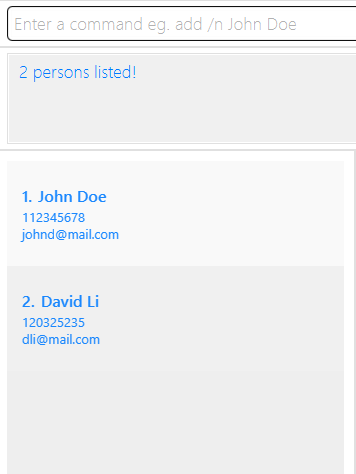

* Table of Contents
{:toc}

--------------------------------------------------------------------------------------------------------------------

EventfulNUS is a **single-user desktop app for managing contacts and events specifically for event organisers of the Inter-Faculty Games (IFG)**, hosted annually
by the National University of Singapore Students' Sport Club. Specifically, one may **add, edit, and delete details about people or events
involved in IFG events.** Learn more about IFG [here](https://www.instagram.com/official_ifg/?hl=en).

**While optimised for use via a Command Line Interface** (CLI), it also has the benefits of a Graphical User Interface (GUI). If you can type fast, you will certainly benefit from event organisation tasks being done faster than traditional GUI apps.

--------------------------------------------------------------------------------------------------------------------
## Quick start

1. Ensure you have Java `17` or above installed in your Computer. Learn more about checking and changing
   your system's version of Java [here](https://www.java.com/en/download/help/update_runtime_settings.html).

2. Download the latest `.jar` file that will execute the app from [here](https://github.com/AY2425S1-CS2103T-W14-4/tp/releases).

3. Copy the file to the folder you want to use as the _home folder_ for EventfulNUS, where both the app and your data will be stored.

4. Open the command terminal on your computer (Search `terminal` and open the first app in your search results).

5. See where your terminal's current working folder, or directory, is by typing `pwd` and pressing 'Enter'.
   
6. Locate the path you need to take to change the terminal's directory into the one you put the jar file in.

   For example, if your `eventfulnus.jar` file is in `Users/{your_computer_username/Downloads/eventfulnus`, and your
   terminal's current wokring directory is `Users/{your_computer_username}`, you must relocate your working directory by
   entering `cd Downloads/eventfulnus` into the terminal.

   If your terminal's working directory is `Users/{your_computer_username}/Desktop` and you need to relocate the terminal's working
   directory to `Users/{your_computer_username}/Downloads/eventfulnus`, you can first enter `cd ..` to escape out of the `Desktop` folder into
   the `Users/{your_computer_username}` folder, then enter `cd Downloads/eventfulnus` to relocate into the folder with the `.jar` file.

   As a general tip, `cd ..` relocates the terminal's working directory to the folder directly containing the current working directory.

   Once you have reached the folder containing the `.jar` file, when you type `ls` and press 'Enter', the `.jar` file should show up in the list
   of files in the terminal's current working directory.
   
7. Enter the `java -jar eventfulnus.jar` command to run the application. 
   A GUI similar to the below should appear in a few seconds. Note how the app contains some sample data from a sample database. 
   

   On the left is a view of all people saved, and on the right is a view of all events saved.

   A person has an index, or number, in the list of people in insertion order, a name, a phone number, an email, and optionally certain roles.

   An event has a sport, two teams competing against each other, a venue, a date and time, and optionally some participants that correspond to people in the app.

8. Type the command in the command box and press Enter to execute it. e.g. typing **`help`** and pressing Enter will open the help window. 
   Some example commands you can try:

   * `list` : Lists all contacts.
     
   * `add n/John Doe p/98765432 e/johnd@example.com r/volunteer-emcee` : Adds a person named `John Doe` to the local database, with these details:
      * 98765432 as a phone number
      * johnd@example.com as an email
      * A volunteer emcee role
        
   * `delete 3` : Deletes the 3rd person shown in the current list of people.
     
   * `listevent`: Lists all events.
     
   * `addevent sp/Chess t/COM t/BIZ d/2024 12 12 1800 v/USC pa/John` : Adds a chess event with these details:
     * Involves faculties COM and BIZ
     * Held on 12 December 2024, at 6pm
     * Held at USC
     * John is the only participant

   * `deleteevent 2`: Deletes the second event shown in the current list of events.

   * `clear` : Deletes all contacts and events.

   * `exit` : Exits the app.

Refer to the [Features](#features) below for details of each command.

--------------------------------------------------------------------------------------------------------------------

## Features

**:information_source: Notes about the command format:** 

* Words in `UPPER_CASE` are the parameters to be supplied by the user. 
  e.g. in `add n/NAME`, `NAME` is a parameter which can be used as `add n/John Doe`.

* Items in square brackets are optional. 
  e.g `n/NAME [r/ROLE]` can be used as `n/John Doe r/athlete` or as `n/John Doe`.

* Items with `…`​ after them can be used multiple times including zero times. 
  e.g. `[r/ROLE]…​` can be used as ` ` (i.e. 0 times), `r/athlete`, `r/athlete r/volunteer` etc.

* Parameters can be in any order. 
  e.g. if the command specifies `n/NAME p/PHONE_NUMBER`, `p/PHONE_NUMBER` is also acceptable.

* Extraneous parameters for commands that do not take in parameters (such as `help`, `list`, `exit` and `clear`) will be ignored. 
  e.g. if the command specifies `help 123`, it will be interpreted as `help`.

* If you are using a PDF version of this document, be careful when copying and pasting commands that span multiple lines as space characters surrounding line-breaks may be omitted when copied over to the application.

### Viewing help : `help`

Shows a message explaining how to use some of the commands. Also contains a link to this guide.

Format: `help`

## Persons

### Adding a person: `add`

Adds a person to the database.

Format: `add n/NAME p/PHONE_NUMBER e/EMAIL [r/ROLE]…​`

:bulb: **Tip:**
A person can have zero or more roles.

Examples:
* `add n/John Doe p/98765432 e/johnd@example.com`
* `add n/Betsy Crowe p/98213132 e/betsycrowe@example.com`

To add specific roles to a person, you can use the following commands: 
1. add ... r/athlete - <faculty> - <sport1>, {sport2}, {sport3}...
2. add ... r/referee - <faculty> - <sport1>, {sport2}, {sport3}...
3. add ... r/committee - <branch> - <position>
4. add ... r/committee - Sports - <position> - <faculty>
5. add ... r/sponsor - <company name>
6. add ... r/volunteer - <volunteerRole>
  
Example:
* `add n/John Doe p/98765432 e/john@mail.com r/athlete - COM - Soccer Men`

Before:

After:

You may check a summary of the list of roles, faculties, sports, positions, and more via [this link](#using-shortcuts).

### Listing all persons : `list`

Shows a list of all persons in the database.

Format: `list`

### Editing a person : `edit`

Edits an existing person in the database.

Format: `edit INDEX [n/NAME] [p/PHONE] [e/EMAIL] [r/ROLE]…​`

* Edits the person at the specified `INDEX`. The index refers to the index number shown in the displayed person list.
* The index **must be a positive integer** 1, 2, 3, …​
* At least one of the optional fields must be provided.
* Existing values will be updated to the input values.
* When editing roles, the existing roles of the person will be removed i.e adding of roles is not cumulative.
* You can remove all the person’s roles by typing `r/` without
    specifying any roles after it.
* When a person's details are edited, if they are participants of an Event, their changed details will be reflected in
  the participants section of an Event in the GUI.

Examples:
*  `edit 1 p/91234567 e/johndoe@example.com` Edits the phone number and email address of the 1st person to be `91234567` and `johndoe@example.com` respectively.
*  `edit 2 n/Betsy Crowe r/` Edits the name of the 2nd person to be `Betsy Crowe` and clears all existing roles.

Before:

After:

### Locating persons by name: `find`

Finds all persons whose names or attributes contain any of the specified keywords (case-insensitive) and displays them as a list with index numbers.

Format: `find KEYWORD [MORE_KEYWORDS]…​`

* The search is case-insensitive. e.g `hans` will match `Hans`
* The order of the keywords does not matter. e.g. `Hans Bo` will match `Bo Hans`
* The `name`, `phone`, `email`, and `roles` are searched for a match.
* Partial matches will also show in results e.g. `Han` will match `Hans`
* Persons matching at least one keyword will be returned (i.e. `OR` search).
  e.g. `Hans Bo` will return `Hans Gruber`, `Bo Yang`

Examples:
* `find john` returns `john` and `John Doe`
* `find John David` returns `John Doe`, `David Li` 
  

### Deleting a person : `delete`

Deletes the specified person from the database.

Format: `delete INDEX`

* Deletes the person at the specified `INDEX`.
* The index refers to the index number shown in the displayed person list.
* The index **must be a positive integer** 1, 2, 3, …​
* When the person deleted is part of an Event (see more below), the Event's participants will reflect
  this deletion and no longer show the person among its participants.

Examples:
* `list` followed by `delete 2` deletes the 2nd person in the database.
* `find Besty` followed by `delete 1` deletes the 1st person in the results of the `find` command.

Before `find`:

After `find`:

Before `delete`:

After `delete`:

## Events

### Adding an event : `addevent`

Adds an event to the database.

Format: `addevent sp/SPORT t/FACULTY 1 t/FACULTY 2 d/LOCALDATETIME v/VENUE [pa/PARTICIPANTS]…​`

:bulb: **Tip:**
An event can have zero or more participants.
Note that the participants must be valid persons in the database.

Examples:
* `addevent sp/Chess t/COM t/BIZ d/2024 12 12 1800 v/USC pa/John`

Before:

After:

Please take note that faculties and sports use ONLY shortcuts found in [this section](#using-shortcuts).

### Editing an event : `editevent`

Edits an existing event in the database.

Format: `editevent INDEX sp/SPORT t/FACULTY 1 t/FACULTY 2 d/LOCALDATETIME v/VENUE [pa/PARTICIPANTS]…​`

* Edits the event at the specified `INDEX`. The index refers to the index number shown in the displayed event list.
* The index **must be a positive integer** 1, 2, 3, …​
* At least one of the optional fields must be provided.
* Existing values will be updated to the input values.
* When editing participants, the existing participants of the events will be removed i.e adding of participants is not cumulative.
* You can remove all the event's participants by typing `pa/` without
  specifying any participants after it.

Examples:
*  `editevent 1 sp/Chess` Edits the sport of the first currently-displayed event to be `Chess`.
*  `editevent 2 sp/Basketball Women pa/` Edits the sport of the second currently-displayed event to be `Basketball Women` and clears all existing participants.

Before:

After:

### Listing all events : `listevent`

Shows a list of all events in the database.

Format: `listevent`

### Finding events by keywords : `findevent`

Finds all events whose names or attributes contain any of the specified keywords (case-insensitive) and displays them as a list with index numbers.

Format: `findevent KEYWORD [MORE_KEYWORDS]…​`

* The search is case-insensitive. e.g `usc` will match `Usc`, `USC`, etc.
* The order of the keywords does not matter. e.g. `USC Chess` will match `Chess USC`.
* The `name` (`sport` and `teams`), `venue`, `date`, and `participants` are searched for a match.
* Partial matches will also show in results e.g. `Che` will match `Chess`.
* Events matching at least one keyword will be returned (i.e. `OR` search).
  e.g. `Utown Usc` will return events containing `Utown Chess`, `Usc Table Tennis`, etc.

### Deleting an event : `deleteevent`

Deletes an existing event from the database.

Format: `deleteevent INDEX`

* Deletes the event at the specified `INDEX`.
* The index refers to the index number shown in the displayed event list.
* The index **must be a positive integer** 1, 2, 3, …​

Examples:
* `listevent` followed by `deleteevent 2` deletes the 2nd event in the database.
* `findevent dummy` followed by `deleteevent 1` deletes the 1st event in the results of the `find` command.

## Miscellaneous Features
### Clearing all entries : `clear`

Clears all entries from the database. But remember, they're gone forever.

Format: `clear`

### Exiting the program : `exit`

Exits the program.

Format: `exit`

### Saving the data

EventfulNUS data is saved in the hard disk automatically after any command that changes the data. There is no need to save manually.

### Editing the data file

EventfulNUS data is saved automatically as a JSON file `[JAR file location]/data/eventfulnus.json`. Advanced users are welcome to update data directly by editing that data file.

:exclamation: **Caution:**
If your changes to the data file makes its format invalid, EventfulNUS will discard all data and start with an empty data file at the next run. Hence, it is recommended to take a backup of the file before editing it. 
Furthermore, certain edits can cause the EventfulNUS to behave in unexpected ways (e.g., if a value entered is outside of the acceptable range). Therefore, edit the data file only if you are confident that you can update it correctly.

### Using Shortcuts

To use EventfulNUS faster, you may find these shortcuts useful.

WARNING: For parsing of faculties / teams, only the shortcuts are accepted, not the full faculty names.
Faculties (Code - Faculty Name):
1. BIZ - Business
2. CDE - Design and Engineering
3. COM - Computing
4. DEN - Dentistry
5. FASS - Arts and Social Sciences
6. LAW - Law
7. MED - Medicine
8. NUSC - NUS College
9. SCI - Science
10. YNC - Yale-NUS College

INFO: For parsing of sports, both the shortcuts and full sport names are accepted.
Sports (Code - Sport Name):
1. BMT - Badminton
2. BBM - Basketball Men
3. BBW - Basketball Women
4. BDM - Bouldering Men
5. BDW - Bouldering Women
6. CHE - Chess
7. COB - Contact Bridge
8. DGB - Dodgeball
9. FBM - Floorball Men
10. FBW - Floorball Women
11. HBM - Handball Men
12. HBW - Handball Women
13. LOL - League of Legends
14. NET - Netball
15. REV - Reversi
16. SCM - Soccer Men
17. SCW - Soccer Women
18. SQH - Squash
19. SWM - Swimming Men
20. SMW - Swimming Women
21. TBT - Table Tennis
22. TCB - Tchoukball
23. TEN - Tennis
24. RUG - Touch Rugby
25. TKM - Track Men
26. TKW - Track Women
27. ULT - Ultimate Frisbee
28. VAL - Valorant
29. VBM - Volleyball Men
30. VBW - Volleyball Women

Branches of Committee Members (Code - Branch Name):
1. SPO - Sports
2. MKT - Marketing
3. PUB - Publicity

Positions of Committee Members (Code - Branch Name)
1. PD - Project Director
2. VPD - Vice Project Director
3. SD - Sports Director
4. VSD - Vice Sports Director
5. MEM - Member

Volunteer Roles (Code - Role Name):
1. PHOTO - Photographer
2. MC - Emcee
3. USH - Usher
4. LOG - Logistics
5. FA - First Aid
6. BMA - Booth Manner

--------------------------------------------------------------------------------------------------------------------

## FAQ

**Q**: How do I transfer my data to another Computer? 
**A**: Install the app in the other computer and overwrite the empty data file it creates with the file that contains the data of your previous EventfulNUS home folder.

--------------------------------------------------------------------------------------------------------------------

## Known issues

1. **When using multiple screens**, if you move the application to a secondary screen, and later switch to using only the primary screen, the GUI will open off-screen. The remedy is to delete the `preferences.json` file created by the application before running the application again.
2. **If you minimize the Help Window** and then run the `help` command (or use the `Help` menu, or the keyboard shortcut `F1`) again, the original Help Window will remain minimized, and no new Help Window will appear. The remedy is to manually restore the minimized Help Window.
3. Currently, only **standard English** names for people and events are accepted. We are planning to add support for more languages in the future.

--------------------------------------------------------------------------------------------------------------------

## Command summary

| Action                | Format, Examples                                                                                         |
|-----------------------|----------------------------------------------------------------------------------------------------------|
| **Add Person**        | `add n/NAME p/PHONE_NUMBER m/EMAIL [r/ROLE]…​`                                                           |
| **Add Event**         | `addevent sp/SPORT t/FACULTY 1 t/FACULTY 2 d/LOCALDATETIME v/VENUE [pa/PARTICIPANTS]`                    |
| **Clear All Entries** | `clear`                                                                                                  |
| **Delete Person**     | `delete INDEX`                                                                                           |
| **Delete Event**      | `deleteevent INDEX`                                                                                      |
| **Edit Person**       | `edit INDEX [n/NAME] [p/PHONE] [e/EMAIL] [r/ROLE]…​`                                                     |
| **Edit Event**        | `editevent INDEX [sp/SPORT] [t/FACULTY 1] [t/FACULTY 2] [d/LOCALDATETIME] [v/VENUE] [pa/PARTICIPANTS]…​` |
| **Find Person**       | `find KEYWORD [MORE_KEYWORDS]…​`                                                                         |
| **Find Event**        | `findevent KEYWORD [MORE_KEYWORDS]…​`                                                                    |
| **List People**       | `list`                                                                                                   |
| **List Events**       | `listevent`                                                                                              |
| **Help**              | `help`                                                                                                   |

