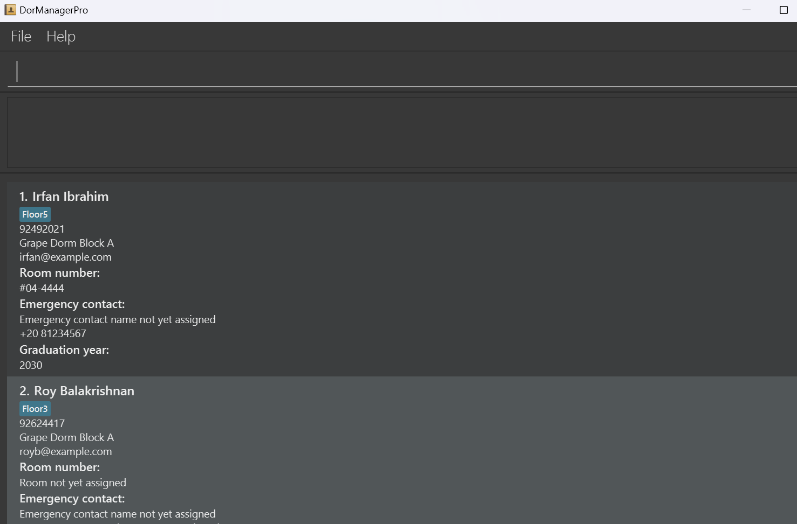
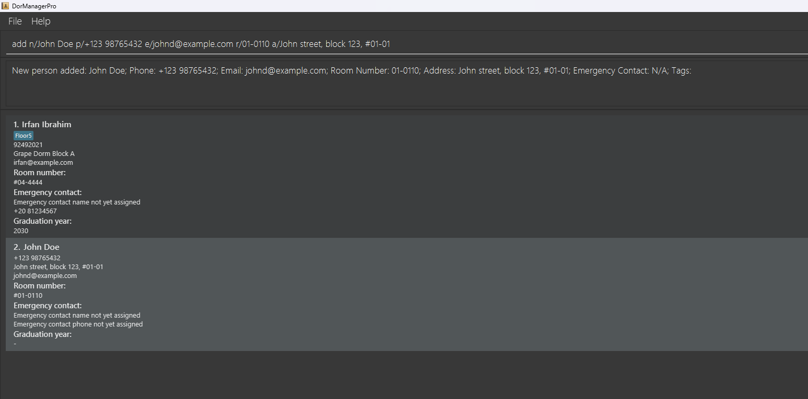
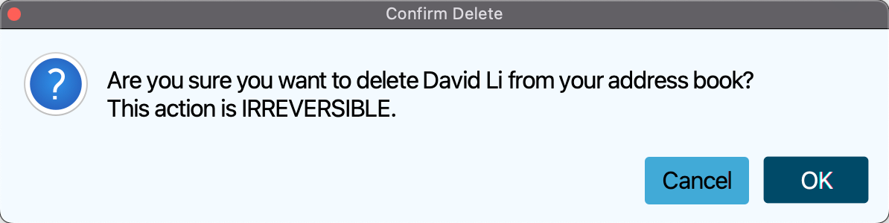
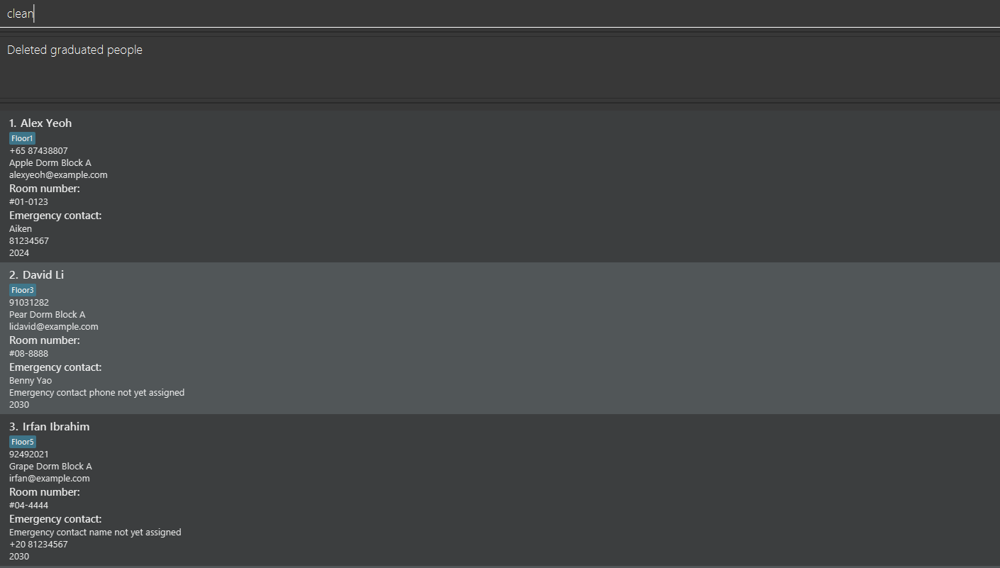
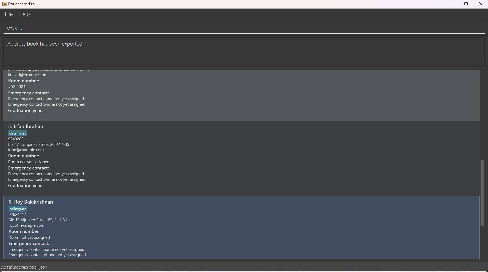
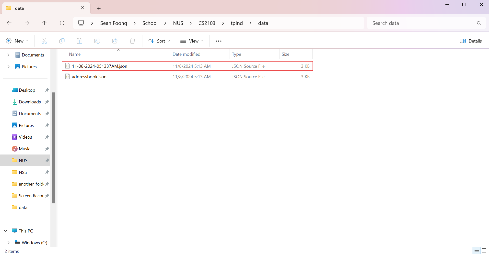

# DorManagerPro User Guide

DorManagerPro (DMP) is a desktop app tailored for **university dorm managers who prefer to work with a Command Line Interface (CLI)**,
designed to allow easy and efficient management of dormitory resident details within an address book.

Created for busy university dorm managers looking to increase their efficiency, DorManagerPro provides unique features to streamline
the process of accessing and updating resident student details. What's more, DorManagerPro is extremely simple to use; we only require our users to know how to type.

>  TIP!   
>
> If this is your first time accessing DorManagerPro, jump to [Quick start](#quick-start) for details on how to set up DorManagerPro!

<!-- * Table of Contents -->
<page-nav-print />

--------------------------------------------------------------------------------------------------------------------
## Table of Contents

- [Quick start](#quick-start)
- [Features](#features)
    - [Viewing help : `help`](#viewing-help-help)
    - [Adding a person : `add`](#adding-a-person-add)
    - [Listing all persons : `list`](#listing-all-persons-list)
    - [Editing a person : `edit`](#editing-a-person-edit)
    - [Finding a person : `find`](#finding-a-person-find)
    - [Deleting a person : `delete`](#deleting-a-person-delete)
    - [Clearing all entries: `clear`](#clearing-all-entries-clear)
    - [Cleaning graduated students : `clean`](#cleaning-graduated-students-clean)
    - [Undoing the previous command : `undo`](#undoing-the-previous-command-undo)
    - [Exiting the program : `exit`](#exiting-the-program-exit)
    - [Manual saving : `export`](#manual-saving-export)
    - [Manual data restoration : `import`](#manual-data-restoration-import)
- [FAQ](#faq)
- [Known issues](#known-issues)
- [Command summary](#command-summary)
- [Field constraints](#field-constraints)
  - [Name](#name)
  - [Phone number](#phone-number)
  - [Email](#email)
  - [Address](#address)
  - [Tags](#tags)
  - [Room number](#room-number)
  - [Emergency contact name](#emergency-contact-name)
  - [Emergency contact phone number](#emergency-contact-phone-number)
  - [Graduation year](#graduation-year)
--------------------------------------------------------------------------------------------------------------------

## Quick start

1. Ensure you have Java `17` or above installed in your Computer.

2. Download the latest `.jar` file from [here](https://github.com/AY2425S1-CS2103T-W09-4/tp/releases/).

3. Locate the `.jar` file in your computer. Typically, this will be in the `Downloads` folder.
>  TIP!   
>
> You may wish to copy the `.jar` file to the folder you want to use as the _home folder_ for DorManagerPro. All the files needed to run DorManagerPro will be created within the home folder.

4. Open up a command terminal, navigate to the home folder of DorManagerPro with the [`cd` command](https://www.ibm.com/docs/en/aix/7.2?topic=directories-changing-another-directory-cd-command)
   and type `java -jar DorManagerPro.jar` to run the application. After a few seconds, you should see the following UI. 
   

5. Type the command in the command box and press Enter to execute it. e.g. typing **`help`** and pressing Enter will open the help window. 
   Some example commands you can try:

    * `list` : Lists all contacts.

    * `add n/John Doe p/+65 98765432 e/johnd@example.com r/01-1008 a/John street, block 123, #01-01` : Adds a contact named `John Doe` to the DorManagerPro address book.

    * `delete 3` : Deletes the 3rd contact shown in the current list.

    * `clear` : Deletes all contacts.

    * `exit` : Exits the app.

6. Refer to the [Features](#features) below for details of each command.

--------------------------------------------------------------------------------------------------------------------

## Features

<box type="info" seamless>

**Notes about the command format:** 

* Words in `UPPER_CASE` are the parameters to be supplied by the user. 
  e.g. in `add n/NAME`, `NAME` is a parameter which can be used as `add n/John Doe`.

* Items in square brackets are optional. 
  e.g `n/NAME [t/TAG]` can be used as `n/John Doe t/friend` or as `n/John Doe`.

* Items with `…`​ after them can be used multiple times including zero times. 
  e.g. `[t/TAG]…​` can be used as ` ` (i.e. 0 times), `t/friend`, `t/friend t/family` etc.

* Parameters can be in any order. 
  e.g. if the command specifies `n/NAME p/PHONE_NUMBER`, `p/PHONE_NUMBER n/NAME` is also acceptable.

* Extraneous parameters for commands that do not take in parameters (such as `help`, `list`, `exit`, `undo`, `clean` and `clear`) will be ignored. 
  e.g. if the command specifies `help 123`, it will be interpreted as `help`.

* If you are using a PDF version of this document, be careful when copying and pasting commands that span multiple lines as space characters surrounding line-breaks may be omitted when copied over to the application.
  </box>

### Viewing help : `help`

Shows a message explaning how to access the help page.

Format: `help`

A help window will pop up containing basic introduction to the three core features `add`, `edit` and `delete`.

### Adding a person: `add`

Adds a person to the address book.

Format: `add n/NAME p/PHONE e/EMAIL [r/ROOM_NUMBER] [a/ADDRESS] [t/TAG]...`

>  NOTE!   
>
> * `ROOM_NUMBER`, `ADDRESS` AND `TAG` are optional.
> * A person can have up to 10 tags (including 0).
> * `NAME` consists of alphabets, numbers, dashes (-) and apostrophes (').
> * `PHONE` consists of an optional country code indicated with a plus (+), an optional area code and a compulsory number. 
> * `EMAIL` should be of the format local-part@domain
> * You cannot set emergency contact details when adding a person. Use the `edit` command to add emergency contact details.
> * You cannot set graduation year when adding a person. Use the `edit` command to add graduation year.
> * Refer to [Field constraints](#field-constraints) for more details on accepted values for each field.

>  WARNING!   
> 
> * If there are duplicate names, i.e if a person in the DorManagerPro address book already has the specified `NAME`, an error will be thrown. This is because it is very rare for two people to have the exact same name down to the surname. Instead, we allow numerals to denote different people with the same name.
> * If there are duplicate phone numbers, i.e if a person in the DorManagerPro address book already has the specified `PHONE_NUMBER`, an error will be thrown. This is because no two people have the same phone number.
> * If there are duplicate emails, i.e if a person in the DorManagerPro address book already has the specified `EMAIL`, an error will be thrown. This is because no two people have the same email address.

Examples:
* `add n/John Doe p/+123 98765432 e/johnd@example.com r/01-0110 a/John street, block 123, #01-01`
* `add n/Betsy Crowe t/Resident Assistant e/betsycrowe@example.com a/Newgate Street p/1234567 t/Floor 1`

The following screenshot shows the results of executing `add n/John Doe p/+123 98765432 e/johnd@example.com r/01-0110 a/John street, block 123, #01-01`

### Listing all persons : `list`

Shows a list of all persons in the address book.

Format: `list`

### Editing a person : `edit`

Edits an existing person in the address book.

Format: `edit INDEX [n/NAME] [p/PHONE] [e/EMAIL] [r/ROOM_NUMBER] [a/ADDRESS] [en/EMERGENCY_NAME] [ep/EMERGENCY_PHONE] [g/GRADUATION_YEAR] [t/TAG]…​`

* Edits the person at the specified `INDEX`. The index refers to the index number shown in the displayed person list. The index **must be a positive integer** 1, 2, 3, …​
* At least one of the optional fields must be provided.
* Existing values will be updated to the input values.
* When editing tags, the existing tags of the person will be removed i.e adding of tags is not cumulative.
* You can remove all the person’s tags by typing `t/` without
  specifying any tags after it.

Examples:
*  `edit 1 p/91234567 e/johndoe@example.com` Edits the phone number and email address of the 1st person to be `91234567` and `johndoe@example.com` respectively.
*  `edit 2 n/Betsy Crower t/` Edits the name of the 2nd person to be `Betsy Crower` and clears all existing tags.

### Finding a person: `find`

Format: `find n/NAME p/PHONE r/ROOM_NUMBER t/TAG`

* any possible orders and combinations of the 3 parameters name, phone number and room number are applicable

* The search is case-insensitive. e.g `hans` will match `Hans`
* The order of the keywords does not matter. e.g. `Hans Bo` will match `Bo Hans`
* Only full words will be matched e.g. `Han` will not match `Hans`
* Persons matching at least one keyword will be returned (i.e. `OR` search).
  e.g. `Hans Bo` will return `Hans Gruber`, `Bo Yang`
* Only full words will be matched for room_number and phone_number, the arguments
  should be exactly the same as the person's room number and phone number
* Order of the tags do not matter `t/friends colleagues` works the same
  as `t/colleagues friends`

Examples:
* `find p/94509592 n/Alex Jones r/08-1234 t/friends colleagues`  
  finds people whose both your friend and colleagues. 
  They have Alex Jones as their name, 94509592 as their contact number, and lives in room 08-1234.

### Deleting a person : `delete`

Deletes the specified person from the address book.

Format: `delete INDEX`

* Deletes the person at the specified `INDEX`.
* The index refers to the index number shown in the displayed person list.
* The index **must be a positive integer** 1, 2, 3, …​
* After user enters the command, the window will show a confirmation popout,
  click 'OK' to continue, 'cancel' to abort the deletion.

Examples:
* `list` followed by `delete 2` deletes the 2nd person in the address book.
* `find Betsy` followed by `delete 1` deletes the 1st person in the results of the `find` command.

### Clearing all entries : `clear`

Clears all entries from the address book.

Format: `clear`

### Cleaning graduated students : `clean`

Removes all graduated students from the address book based on the current year and their graduation year.

Format: `clean`

>  TIP!   
>
> If you mistakenly entered this command, you can undo it with the `undo` command. See [undo](#undoing-the-previous-command-undo) for details!

Example:

`clean`, executed in 2024.

This deletes all students who graduate in 2023 or earlier.  

### Undoing the previous command : `undo`

Undoes the previous command that changes the data in the address book.

Commands that can be undone are `add`, `delete`, `edit`, `clear`, `clean`, `import`.

Format: `undo`

### Exiting the program : `exit`

Exits the program.

Format: `exit`

### Saving the data

DorManagerPro data are saved in the hard disk automatically after any command that changes the data. There is no need to save manually although there is an option to do so in the `export` and `import` functions.

### Manual saving: `export`

The `export` command will directly and immediately save the contents of the data to a save file akin to the one created automatically when closing the application.

Format: `export`

>  NOTE!   
> This exports the data of DorManagerPro to a file `NOW.json` into the data folder of the home folder. 
> `NOW` is the time at the point of `export`, in the format MM-dd-yyyy-HHmmssPM.

Example:

`export`

The following screenshots shows the results of executing `export`

### Manual data restoration: `import`
The `import` command allows users to restore data from any one save file into the application.

Format: `import fp/FILE_PATH`

>  NOTE!   
>
> * `FILE_PATH` must correspond to an actual json file in the device.
> * Use as `.` a folder to refer to the home folder.  (e.g. `./data/SaveFile.json` refers to `SaveFile.json` in the data folder of the home folder)

Examples:

* `import fp/C:/SaveFile3.json` imports data from the file at `C:/SaveFile3.json` into the application.
* `import fp/./data/SaveFile4.json` imports data from the file `SaveFile4.json` from the `data` folder of the home folder (`.` in the file path refers to the home folder) into the application.

The following screenshot shows the results of executing `import fp/./data/11-08-2024-051337AM.json`

>  TIP!   
>
> Importing data will replace all currently existing data in the application with the data in the save file, so do make a backup before importing.
> However, if you mistakenly entered this command, you can undo it with the `undo` command. See [undo](#undoing-the-previous-command--undo) for details!

### Editing the data file

DorManagerPro data are saved automatically as a JSON file `[JAR file location]/data/DorManagerPro.json`. Advanced users are welcome to update data directly by editing that data file.

<box type="warning"
seamless>

**Caution:**
If your changes to the data file makes its format invalid, DorManagerPro will discard all data and start with an empty data file at the next run.  Hence, it is recommended to take a backup of the file before editing it. 
Furthermore, certain edits can cause the DorManagerPro to behave in unexpected ways (e.g., if a value entered is outside the acceptable range). Therefore, edit the data file only if you are confident that you can update it correctly.
</box>

--------------------------------------------------------------------------------------------------------------------

## FAQ

**Q**: How do I transfer my data to another Computer? 
**A**: Install the app in the other computer and overwrite the empty data file it creates with the file that contains the data of your previous AddressBook home folder.

--------------------------------------------------------------------------------------------------------------------

## Known issues

1. **When using multiple screens**, if you move the application to a secondary screen, and later switch to using only the primary screen, the GUI will open off-screen. The remedy is to delete the `preferences.json` file created by the application before running the application again.
2. **If you minimize the Help Window** and then run the `help` command (or use the `Help` menu, or the keyboard shortcut `F1`) again, the original Help Window will remain minimized, and no new Help Window will appear. The remedy is to manually restore the minimized Help Window.

--------------------------------------------------------------------------------------------------------------------

## Command summary

Action     | Format, Examples
-----------|----------------------------------------------------------------------------------------------------------------------------------------------------------------------
**Add**    | `add n/NAME p/PHONE e/EMAIL [r/ROOM_NUMBER] [a/ADDRESS] [t/TAG]…​`   e.g., `add n/James Ho p/22224444 e/jamesho@example.com a/123, Clementi Rd, 1234665 t/friend t/colleague`
**Clear**  | `clear`
**Delete** | `delete INDEX`  e.g., `delete 3`
**Edit**   | `edit INDEX [n/NAME] [p/PHONE] [e/EMAIL] [r/ROOM_NUMBER] [a/ADDRESS] [en/EMERGENCY_NAME] [ep/EMERGENCY_PHONE] [g/GRADUATION_YEAR] [t/TAG]…​`   e.g.,`edit 2 n/James Lee e/jameslee@example.com`
**Find**   | `find [n/NAME] [p/PHONE] [r/ROOM_NUMBER] [t/TAG]…​`   e.g., `find p/+123 12345 n/Alice Lee r/08-1234 t/friend`
**List**   | `list`
**Help**   | `help`
**Clean**  | `clean`
**Undo**   | `undo`
**Exit**   | `exit`
**Export** | `export`
**Import** | `import fp/FILE_PATH`   e.g., `import fp/./data/SaveFile4.json`

--------------------------------------------------------------------------------------------------------------------

## Field constraints

### Name

Format: A sequence of alphanumeric characters corresponding to a student's name

Constraints:
* `name` can contain any alphanumeric character or whitespace.
* `name` can contain hyphens, commas and apostrophes.
* `name` can be 1 to 300 characters long.
  
Duplicate handling:
* Two resident student contacts with the same name are not allowed
>  NOTE!   
>
> * Constraint rationale: Extremely long names would be difficult to process and display in the profile screen. It is rather common to use hyphens, commas and apostrophes to separate different sections of the name.
> * Duplicate handling rationale: It is very rare for two people to have the exact same name down to the surname. Instead, we allow numerals to denote different people with the same name.
> * Case-insensitive: `John Doe` is treated the same as `john doe`

### Phone number

Format: `+c a d`, where `c` is an optional country code, `a` is an optional area code, and `d` is a compulsory number.

Constraints:
* Start the phone number with `+` only if there is a country code.
* `c` is an optional country code 1 to 3 digits long.
* `a` is an optional area code 1 to 4 digits long. `a` can only be specified when `c` is specified.
* `d` is a compulsory number 3 to 15 digits long.
* Separate `c`, `a` and `d` with a single space.

Duplicate handling:
* Two resident student contacts with the same phone numbers are not allowed.
>  NOTE!   
>
> * Constraint rationale: Phone number constraints are based on the upper and lower limit of country codes, area codes, and number digit lengths.
> * Duplicate handling rationale: Phone numbers are unique to each individual

### Email

Format: `l@d`, where `l` is the local part of the email and `d` is the domain of the email.

Constraints:
* The local-part `l` should only contain alphanumeric characters and these special characters, excluding the parentheses, (+_.-). The local-part may not start or end with any special characters.
* The domain name `d` is made up of domain labels separated by periods. 
* The domain name `d` must end with a domain label at least 2 characters long.
* Each domain label must start and end with alphanumeric characters 
* Each domain label must  consist of alphanumeric characters, separated only by hyphens, if any.
* `l`, `@` and `d` are not supposed to be separated by whitespace.

Duplicate handling:
* Two resident student contacts with the same emails are not allowed.
>  NOTE!   
>
> * Constraint rationale: Email constraints are based on the Email Format of the International Organisation for Standardisation.
> * Duplicate handling rationale: Emails are unique to each individual

### Address

### Tags

### Room number

### Emergency contact name

Format: A sequence of alphanumeric characters corresponding to a student's emergency contact name

Constraints:
Same as [Name](#name)

Duplicate handling:
* Two residents can have the same emergency contact with the same name.
>  NOTE!   
>
> * Constraint rationale: Same as [Name](#name)
> * Duplicate handling rationale: It is possible for two residents to have the same emergency contact.
> * Case-insensitive: `John Doe` is treated the same as `john doe`

### Emergency contact phone number

Format: same as [Phone number](#phone-number)

Constraints:
Same as [Phone number](#phone-number)

Duplicate handling:
* Two residents can have the same emergency contact with the same phone number.
>  NOTE!   
>
> * Constraint rationale: Same as [Phone number](#phone-number)
> * Duplicate handling rationale: It is possible for two residents to have the same emergency contact.

### Graduation year
