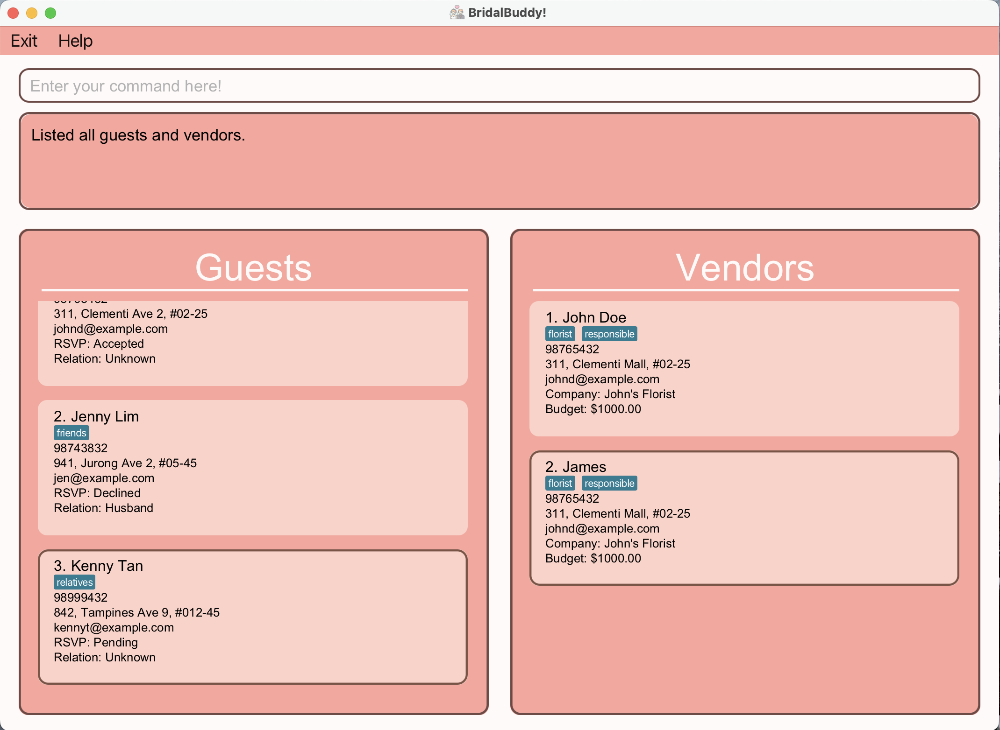
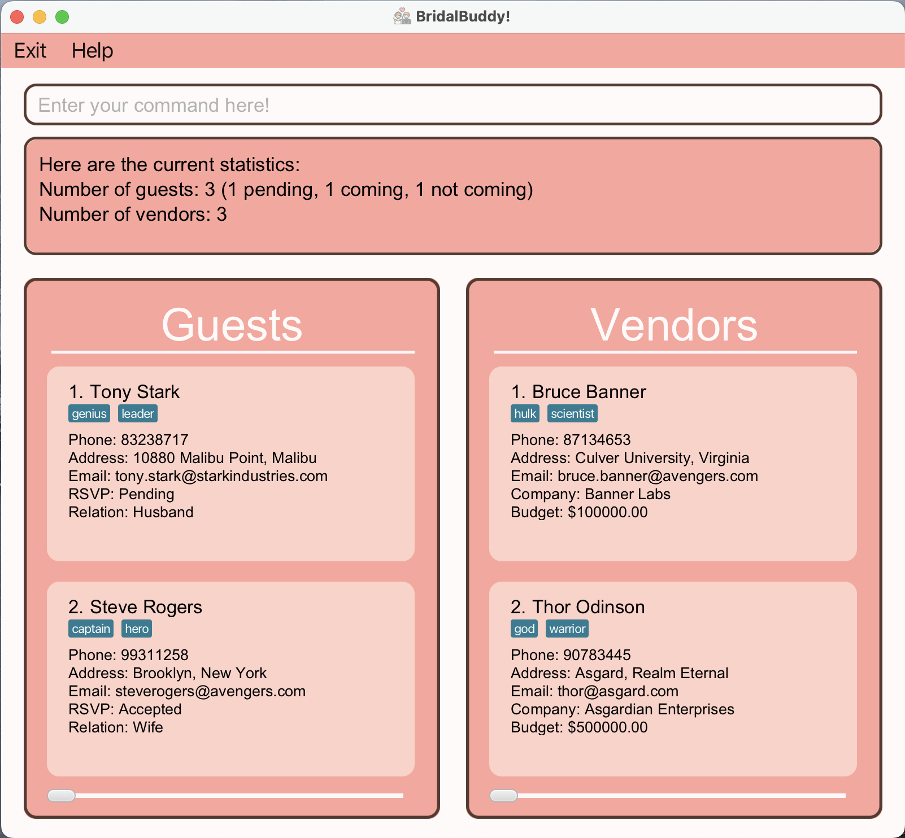
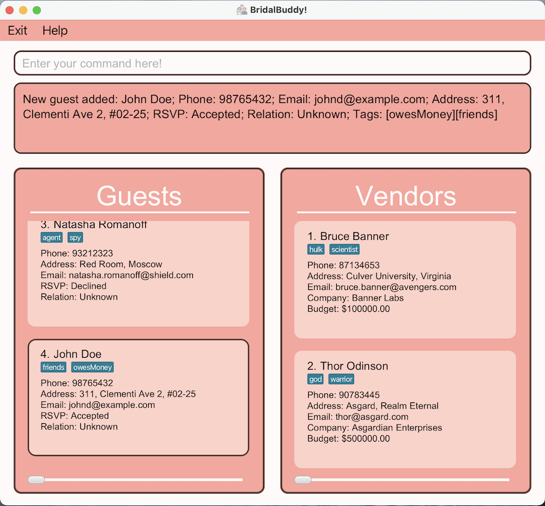
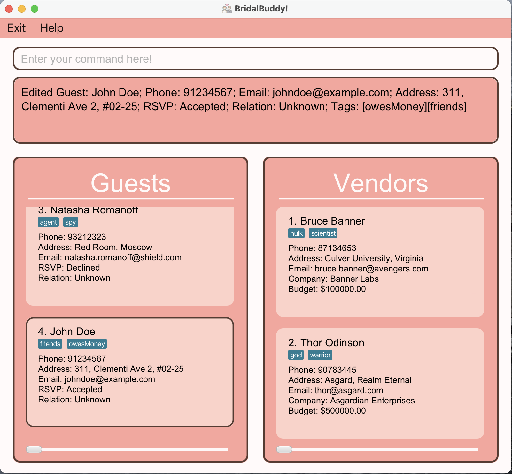
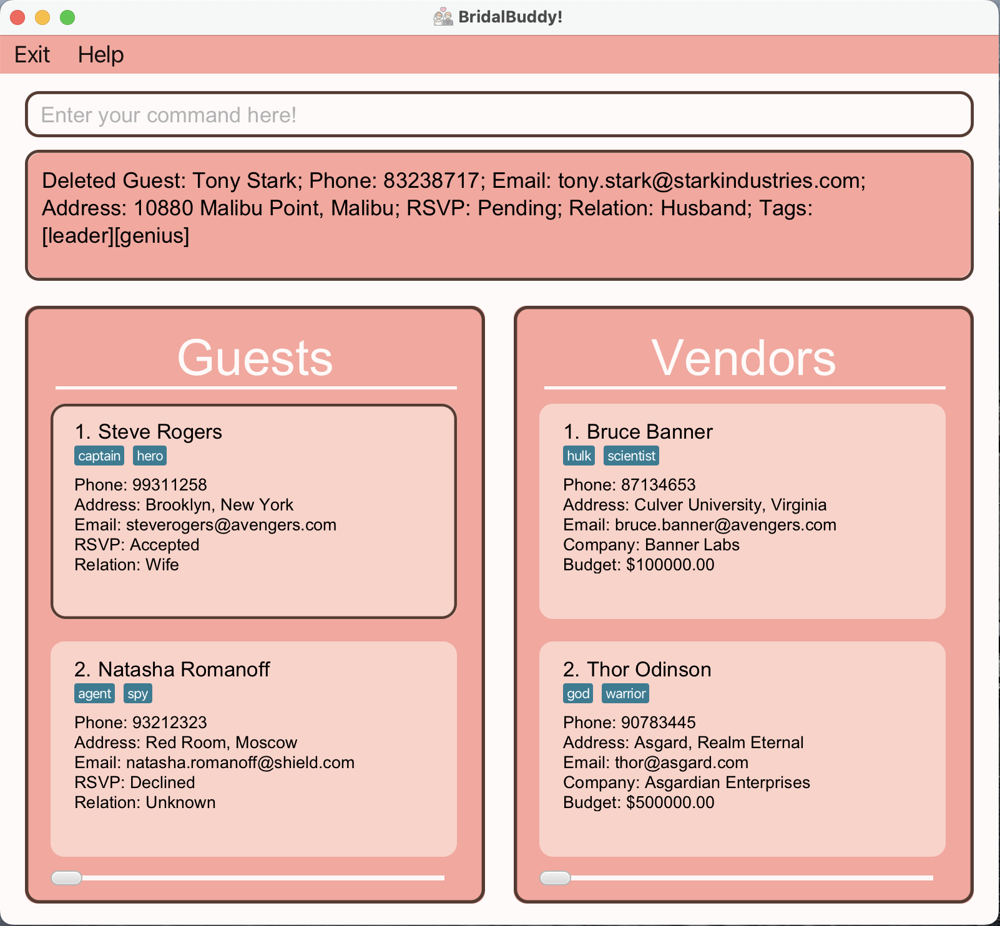
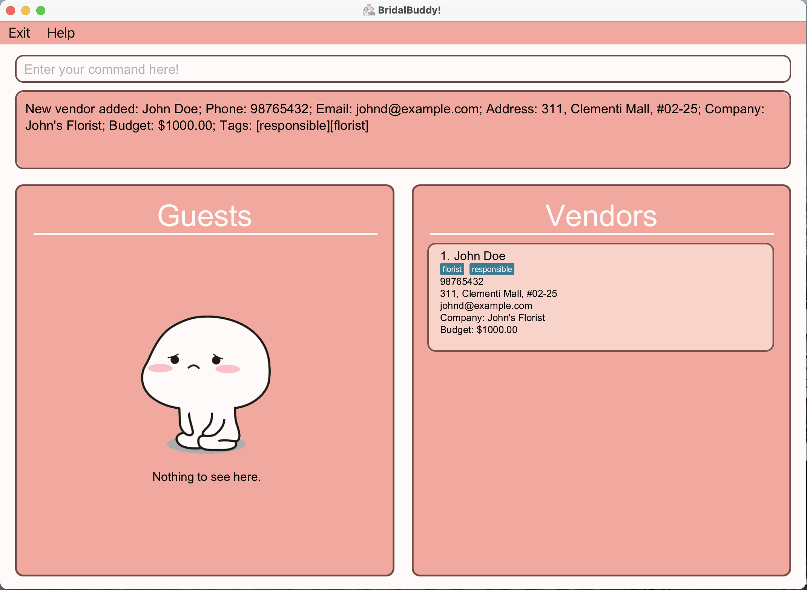
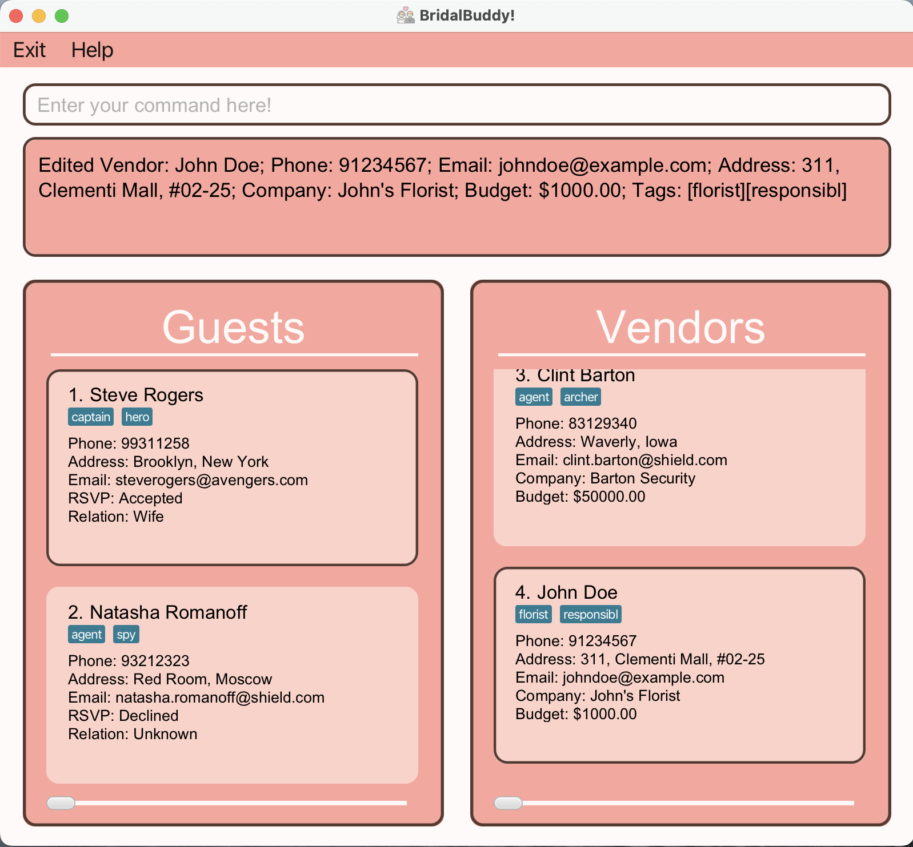
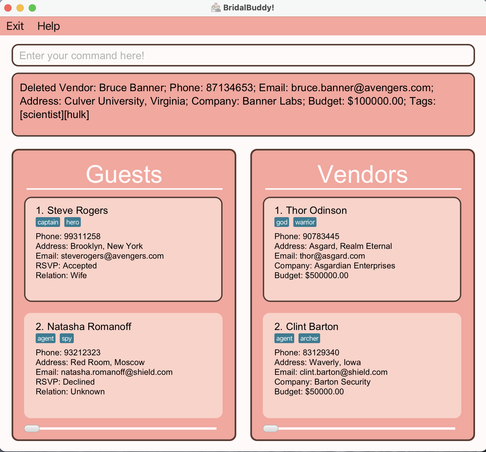

# BridalBuddy User Guide

BridalBuddy is a **desktop application for managing contacts, designed for optimal use through a Command Line Interface [(CLI)](#glossary)** while retaining the advantages of a Graphical User Interface [(GUI)](#glossary).
It is an app targeted at Wedding Planners to help them streamline guest and vendor management for their clients.

As wedding planners, you may frequently encounter challenges in managing the countless guests and vendors involved in the planning process.
That's why we've created BridalBuddy just for you. With BridalBuddy, you'll have an easy and effective solution for managing your guest lists and vendor information seamlessly, so that you can concentrate on delivering an unforgettable experience your clients will never forget.

With BridalBuddy, you can easily:
* Add a guest to the wedding that you are planning.
* Separately, add a vendor you are collaborating with for that wedding.

To discover more about what BridalBuddy has to offer, continue reading the rest of this comprehensive user guide.

## Table of Contents
1. [**Helpful Guidelines for the User Guide**](#helpful-guidelines-for-the-user-guide)
2. [**Quick Start**](#quick-start)
3. [**Tutorial for Beginners**](#tutorial-for-beginners)
4. [**Features**](#features)
    * [**General Commands**](#general-commands)
        * [`help` Viewing help](#viewing-help--help)
        * [`list` Listing all persons](#listing-all-persons--list)
        * [`find` Finding a guest/vendor](#finding-a-person--find)
        * [`clear` Clearing all entries from the guest list and the vendor list](#clearing-all-entries--clear)
        * [`stats` Viewing the wedding statistics](#viewing-statistics--stats)
        * [`exit` Exiting the program](#exiting-the-program--exit)
    * [**Guest Related Commands**](#guest-related-commands)
        * [`add_guest` Adding a new guest to the guest list](#adding-a-guest--add_guest)
        * [`edit_guest` Editing the details of a guest](#editing-a-guest--edit_guest)
        * [`delete_guest` Deleting a guest from the guest list](#deleting-a-guest--delete_guest)
    * [**Vendor Related Commands**](#vendor-related-commands)
        * [`add_vendor` Adding a vendor to the vendor list](#adding-a-vendor--add_vendor)
        * [`edit_vendor` Editing the details of a vendor](#editing-a-vendor--edit_vendor)
        * [`delete_vendor` Deleting a student](#deleting-a-vendor--delete_vendor)
    * [**Miscellaneous**](#miscellaneous)
        * [Saving the data](#saving-the-data)
        * [Editing the data file](#editing-the-data-file)
5. [**FAQ**](#faq)
6. [**Known Issues**](#known-issues)
7. [**Command summary**](#command-summary)
8. [**Glossary**](#glossary)

--------------------------------------------------------------------------------------------------------------------

## Helpful Guidelines for the User Guide

### Interpreting symbols

This section explains the symbols that you will find in the rest of the User Guide.

| Symbol               | Meaning                                            |
|----------------------|----------------------------------------------------|
| :warning:            | Important information! Please read them carefully. |
| :information_source: | Information that you should take note of.          |
| :bulb:               | Additional useful tips.                            |

### Searching for what you need

This section tells you what information you will find in each of the sections of this guide. Feel free to skip to the sections which you need most.

1. [Quick Start](#quick-start) teaches you how to set up BridalBuddy.
2. [Tutorial for Beginners](#tutorial-for-beginners) walks you through the basic features of BridalBuddy to get you started.
3. [Features](#features) helps you understand how all our features work.
4. [FAQ](#faq) clarifies the doubts that many of our users have.
5. [Command Summary](#command-summary) summarises all our features for easy reference.
6. [Glossary](#glossary) explains the more technical terms used in this guide.
7. [_Back to Top_](#table-of-contents) gives you a convenient shortcut to go back to the table of contents.

[_Back to Top_](#table-of-contents)

--------------------------------------------------------------------------------------------------------------------

## Quick Start

1. Ensure you have Java `17` or above installed in your Computer. Click [here](https://www.oracle.com/java/technologies/javase/jdk17-archive-downloads.html) to download Java `17` if you do not already have it installed.
    > :information_source: To check if you have Java `17` installed, simply run `java -version` on a command terminal to find out.

2. Download the latest `.jar` file from [here](https://github.com/AY2425S1-CS2103T-F09-3/tp/releases).

3. Copy the file to the folder you want to use as the _home folder_ for your BridalBuddy application.

4. Open a command terminal, `cd` into the folder you put the jar file in, and use the `java -jar bridalbuddy.jar` command to run the application. 
   A [(GUI)](#glossary) similar to the below should appear in a few seconds. Note how the app contains some sample data. 
   

5. Type the command in the command box and press Enter to execute it. e.g. typing **`help`** and pressing Enter will open the help window. 
   Some example commands you can try:

    * `list` : Lists down all guests invited to the wedding on the guest list and all vendors involved in the wedding on the vendor list.

    * `add_guest n/John Doe p/98765432 e/johnd@example.com a/311, Clementi Ave 2, #02-25 rsvp/accepted t/friends t/owesMoney` : Adds a guest named `John Doe` to the guest list.

    * `add_vendor n/Jack Tan p/98273782 e/jackt@example.com a/391, Clementi Mall, #03-32 company/Jack's Florist t/florist t/responsible` : Adds a guest named `Jack Tan` to the vendor list.

    * `delete_guest 3` : Deletes the 3rd guest shown in the current guest list.

    * `delete_vendor 3` : Deletes the 3rd vendor shown in the current vendor list.

    * `clear` : Deletes all persons from both the guest list and the vendor list.

    * `exit` : Exits the app.

For a comprehensive tutorial on using BridalBuddy to manage your guest and vendor lists as a wedding planner, check out the [Tutorial for Beginners](#tutorial-for-beginners). 
Alternatively, if you’d like to explore the application independently, refer to the [Features](#features) section below for detailed information on each command.

[_Back to Top_](#table-of-contents)

--------------------------------------------------------------------------------------------------------------------

## Tutorial for Beginners

This section will walk you through all the basic features of BridalBuddy and will make sure you know everything you need to get started.

[_Back to Top_](#table-of-contents)

--------------------------------------------------------------------------------------------------------------------

## Features

<box type="info" seamless>

**:bulb: Notes about the command format:** 

* Words in `UPPER_CASE` are the parameters to be supplied by the user. 
  e.g. in `add n/NAME`, `NAME` is a parameter which can be used as `add n/John Doe`.

* Items in square brackets are optional. 
  e.g `n/NAME [t/TAG]` can be used as `n/John Doe t/friend` or as `n/John Doe`.

* Items with `…`​ after them can be used multiple times including zero times. 
  e.g. `[t/TAG]…​` can be used as ` ` (i.e. 0 times), `t/friend`, `t/friend t/family` etc.

* Parameters can be in any order. 
  e.g. if the command specifies `n/NAME p/PHONE_NUMBER`, `p/PHONE_NUMBER n/NAME` is also acceptable.

* Extraneous parameters for commands that do not take in parameters (such as `help`, `list`, `exit` and `clear`) will be ignored. 
  e.g. if the command specifies `help 123`, it will be interpreted as `help`.

* If you are using a PDF version of this document, be careful when copying and pasting commands that span multiple lines as space characters surrounding line-breaks may be omitted when copied over to the application.
</box>

[_Back to Top_](#table-of-contents)

### **General Commands**

:information_source: Commands listed in this section are applicable to both guest management and vendor management.

[_Back to Top_](#table-of-contents)

### Viewing help : `help`

Shows a message explaining how to access the help page.

**Format:** `help`

Entering the `help` command returns the following result on your screen:

[_Back to Top_](#table-of-contents)

### Listing all persons : `list`

Shows a guest list consisting of all invited guests and a vendor list consisting of all vendors involved.
    
* The guest list will be on the left of your screen while the vendor list will be on the right of your screen.

**Format:** `list`

Entering the `list` command returns the following result on your screen:

[_Back to Top_](#table-of-contents)

### Finding a person : `find`

Finds guests and vendors from the guest list and vendor list respectively that match a given a keyword.

* :warning: You may only search for guests/vendors with up to one keyword at a time.

**Format:** `find n/Amy`

Entering the `find` command returns the following result on your screen:

[_Back to Top_](#table-of-contents)

### Clearing all entries : `clear`

Clears and empties out the entire guest list and vendor list. Could be good to start off your preparations for your next wedding.

**Format:** `clear`

Entering the `clear` command returns the following result on your screen:

[_Back to Top_](#table-of-contents)

### Viewing statistics : `stats`

Displays the total number of guests invited to the wedding and the total number of vendors involved in the wedding.

**Format:** `stats`

Entering the `stats` command returns the following result on your screen:

[_Back to Top_](#table-of-contents)

### Exiting the program : `exit`

Exits the program.

Format: `exit`

[_Back to Top_](#table-of-contents)

### **Guest Related Commands**

:information_source: Commands listed in this section are applicable to managing your guest list (guest management).

[_Back to Top_](#table-of-contents)

### Adding a guest : `add_guest`

Adds a guest to the bottom of the existing overall guest list.

**Format:** `add_guest n/NAME p/PHONE e/EMAIL a/ADDRESS [rsvp/RSVP_STATUS] [t/TAG]...`

Entering the `add_guest` command returns the following result on your screen:

[_Back to Top_](#table-of-contents)

### Editing a guest : `edit_guest`

Edits any details of a guest on your existing guest list.

**Format:** ``

Entering the `edit_guest` command returns the following result on your screen:

[_Back to Top_](#table-of-contents)

### Deleting a guest : `delete_guest`

Deletes a guest from your existing guest list.

**Format:** `delete_guest INDEX`

* :information_source: The `INDEX` you enter should be the `INDEX` of the guest you want to delete on the **exact guest list that you see on your screen**.

   * Even if a `guest` `John Doe` has an `INDEX` of 3 on the overall guest list, entering `find n/John` followed by `delete 1` would still delete the details of `John Doe`, assuming that there is only 1 guest with `John` in their name.

Entering the `delete_guest` command returns the following result on your screen:

[_Back to Top_](#table-of-contents)

### **Vendor Related Commands**

:information_source: Commands listed in this section are applicable to managing your vendor list.

### Adding a vendor : `add_vendor`

Adds a vendor to the bottom of the existing overall vendor list.

**Format:** `add_guest n/NAME p/PHONE e/EMAIL a/ADDRESS [rsvp/RSVP_STATUS] [t/TAG]...`

Entering the `add_vendor` command returns the following result on your screen:

[_Back to Top_](#table-of-contents)

### Editing a vendor : `edit_vendor`

Edits any details of a vendor on your existing vendor list.

**Format:** ``

Entering the `edit_vendor` command returns the following result on your screen:

[_Back to Top_](#table-of-contents)

### Deleting a vendor : `delete_vendor`

Deletes a vendor from your existing vendor list.

**Format:** `delete_vendor INDEX`

* :information_source: The `INDEX` you enter should be the `INDEX` of the vendor you want to delete on the **exact vendor list that you see on your screen**.

   * Even if a `vendor` `John Doe` has an `INDEX` of 3 on the overall vendor list, entering `find n/John` followed by `delete 1` would still delete the details of `John Doe`, assuming that there is only 1 vendor with `John` in their name.

Entering the `delete_vendor` command returns the following result on your screen:

[_Back to Top_](#table-of-contents)

### **Other Useful Features**

:information-source: Other additional features of BridalBuddy that are good to know.

[_Back to Top_](#table-of-contents)

### Saving the data

AddressBook data are saved in the hard disk automatically after any command that changes the data. There is no need to save manually.

[_Back to Top_](#table-of-contents)

### Editing the data file

AddressBook data are saved automatically as a JSON file `[JAR file location]/data/bridalbuddy.json`. Advanced users are welcome to update data directly by editing that data file.

**Caution:**
:warning: If your changes to the data file makes its format invalid, BridalBuddy will discard all data and start with an empty data file at the next run.  Hence, it is recommended to take a backup of the file before editing it. 
Furthermore, certain edits can cause BridalBuddy to behave in unexpected ways (e.g., if a value entered is outside the acceptable range). Therefore, edit the data file **only if** you are confident that you can update it correctly.
</box>

[_Back to Top_](#table-of-contents)

--------------------------------------------------------------------------------------------------------------------

## FAQ

**Q**: How do I transfer my data to another Computer? 
**A**: Install the app in the other computer and overwrite the empty data file it creates with the file that contains the data of your previous AddressBook home folder.

[_Back to Top_](#table-of-contents)

--------------------------------------------------------------------------------------------------------------------

## Known issues

1. **When using multiple screens**, if you move the application to a secondary screen, and later switch to using only the primary screen, the GUI will open off-screen. The remedy is to delete the `preferences.json` file created by the application before running the application again.
2. **If you minimize the Help Window** and then run the `help` command (or use the `Help` menu, or the keyboard shortcut `F1`) again, the original Help Window will remain minimized, and no new Help Window will appear. The remedy is to manually restore the minimized Help Window.

[_Back to Top_](#table-of-contents)

--------------------------------------------------------------------------------------------------------------------

## Command summary

| Action     | Format, Examples                                                                                                                                                      |
|------------|-----------------------------------------------------------------------------------------------------------------------------------------------------------------------|
| **Add**    | `add n/NAME p/PHONE_NUMBER e/EMAIL a/ADDRESS [t/TAG]…​`   e.g., `add n/James Ho p/22224444 e/jamesho@example.com a/123, Clementi Rd, 1234665 t/friend t/colleague` |
| **Clear**  | `clear`                                                                                                                                                               |
| **Delete** | `delete INDEX`  e.g., `delete 3`                                                                                                                                   |
| **Edit**   | `edit INDEX [n/NAME] [p/PHONE_NUMBER] [e/EMAIL] [a/ADDRESS] [t/TAG]…​`  e.g.,`edit 2 n/James Lee e/jameslee@example.com`                                           |
| **Find**   | `find KEYWORD [MORE_KEYWORDS]`  e.g., `find James Jake`                                                                                                            |
| **List**   | `list`                                                                                                                                                                |
| **Help**   | `help`                                                                                                                                                                |

[_Back to Top_](#table-of-contents)

## **Glossary**

| Term/Keyword                       | Definition                                                                                                 |
|------------------------------------|------------------------------------------------------------------------------------------------------------|
| **Command Line Interface (CLI)**   | An interface that allows you to interact with our program by inputting lines of text called command-lines. |
| **Graphical User Interface (GUI)** | An interface that displays information to you and allows you to interact with visual elements.             |
| **Prefix**                         | Characters preceding details you input on the command line. Eg. n/ for name and e/ for email.              |

[_Back to Top_](#table-of-contents)
