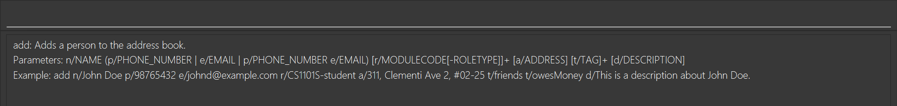

# ContactCS User Guide

**ContactCS** is a **desktop application designed for NUS Computer Science freshmen** to help them efficiently manage and locate essential contact details. The app is designed to store and organize contacts for key individuals relevant to their academic journey, including:
* Professors and teaching assistants for enrolled modules
* Classmates for collaborative projects and study groups
* School offices for administrative matters
* Emergency contacts for urgent situations
* and more!
<!-- * Table of Contents -->
<page-nav-print />

--------------------------------------------------------------------------------------------------------------------
## Callouts Convention

The callout boxes below are used in documentation to enhance readability and provide important contextual information.

<box type="info" seamless>

**Info Box:**
Provides additional information or context.
</box>

<box type="tip" seamless>

**Tip Box:**
Offers helpful tips or suggestions.
</box>

<box type="warning" seamless>

**Caution Box:**
Alerts you to potential issues or problems that may arise.
</box>

## Quick start

1. Ensure that Java 17 is installed on your computer. 
   * Open a command terminal. 
   * * For Windows users, follow instructions [here](https://www.howtogeek.com/235101/10-ways-to-open-the-command-prompt-in-windows-10/#open-command-prompt-from-the-file-explorer-address-bar).
     * For Mac users, follow instructions [here](https://support.apple.com/en-sg/guide/terminal/apd5265185d-f365-44cb-8b09-71a064a42125/mac).
   * Type the following command to check the Java version:<br>
     ```
     java -version
     ```
   * If Java 17 is installed, you should see an output similar to: `java version "17.0.1" `
   * If you do not have Java 17, you can download it from [Oracle's official website](https://www.oracle.com/java/technologies/downloads/#java17).

2. Download the application
   * Get the latest `.jar` file from [here](https://github.com/AY2425S1-CS2103T-F12-1/tp/releases).

3. Set up the home folder
   * Choose a folder where you want to store your AddressBook data.
   * Copy the downloaded `.jar` file to this folder.
   * This folder will serve as the "home folder" for your AddressBook.

4. Run the application
   * Open a command terminal.
   * Navigate (`cd`) to the folder where you placed the `.jar` file.
     * For Windows users, type:
       ```
       cd \path\to\your\folder
       ```
       <box type="warning" seamless>

       **Caution:**
       Replace path\to\your\folder with the actual path. e.g. `cd C:\Documents\AddressBook`
       </box>
       
     * For Mac users, type:
       ```
       cd /path/to/your/folder
       ```
       <box type="warning" seamless>

       **Caution:**
       Replace path/to/your/folder with the actual path. e.g. `cd ~/Documents/AddressBook`
       </box>
   * Run the application with the following command:
     ```
     java -jar contactcs.jar
     ```
   A GUI similar to the screenshot below should appear in a few seconds. Note how the app contains some sample data.<br>

5. Type the command in the command box and press Enter to execute it. e.g. typing **`help`** and pressing Enter will open the help window.<br>
   Some example commands you can try:

   * `list` : Lists all contacts.

   * `add n/John Doe p/98765432 e/johnd@example.com r/CS1101S` : Adds a contact named `John Doe` who takes CS1101S to the Address Book.

   * `delete 3` : Deletes the 3rd contact shown in the current list.

   * `clear` : Deletes all contacts.

   * `exit` : Exits the app.

1. Refer to the [Features](#features) below for details of each command.

--------------------------------------------------------------------------------------------------------------------

## Features

<box type="info" seamless>

**Info: Notes about the command format**<br>

* Words in `UPPER_CASE` are the parameters to be supplied by the user.<br>
  e.g. in `add n/NAME`, `NAME` is a parameter which can be used as `add n/John Doe`.

* Items in square brackets are optional.<br>
  e.g `n/NAME [t/TAG]` can be used as `n/John Doe t/friend` or as `n/John Doe`.

* Items in sqaure brackets and with `+` after them can be used zero or more times.<br>
  e.g. `[t/TAG]+` can be used as ` ` (i.e. 0 times), `t/friend`, `t/friend t/family` etc.

* Items in **round** brackets and with `+` after them can be used one or more times.<br>
  e.g. `(t/TAG)+` can be used as `t/friend`, `t/friend t/family` etc.

* `|` operator signifies `OR` relationship.<br>
  e.g. `n/NAME | r/MODULECODE` means `n/NAME` or `r/MODULECODE`

* Parameters can be in any order.<br>
  e.g. if the command specifies `n/NAME p/PHONE_NUMBER`, `p/PHONE_NUMBER n/NAME` is also acceptable.

* Extraneous parameters for commands that do not take in parameters (such as `list`, `exit` and `clear`) will be ignored.<br>
  e.g. if the command specifies `exit 123`, it will be interpreted as `exit`.

* If you are using a PDF version of this document, be careful when copying and pasting commands that span multiple lines as space characters surrounding line-breaks may be omitted when copied over to the application.
</box>

### Viewing help: `help`

Help command supports two input formats which allows for more flexibility when
you want to seek help:

**Shows a message explain the usage of the specified command keyword**

Format: `help [COMMAND_KEYWORD]`

Example: 
- `help add` shows the help message for `add` command in the following format


**Shows a message and a pop-up window showing the full list of help messages,
and an external link to the full user guide.**


Format: `help`


### Adding a person: `add`

Adds a person to the address book.

Format: `add n/NAME (p/PHONE_NUMBER | e/EMAIL | p/PHONE_NUMBER e/EMAIL) [r/MODULECODE[-ROLETYPE]]+ [a/ADDRESS] [t/TAG]+ [d/DESCRIPTION]`

<box type="information" seamless>
The command accepts either one phone number, one email, or both.
</box>

* `NAME` can take any values and can not be blank. Refer to the [input format section](#input-format) to find out more.
* `PHONE_NUMBER` is almost a free-form text field with minimal validation. Refer to the [input format section](#input-format) to find out more.
* `MODULECODE` refers to a module code of a NUS module (e.g. CS1101S, MA1521)
* `ROLETYPE` refers to one of the following: `student`, `ta`, `tutor`, `prof`, `professor`.
* The `r/MODULECODE[-ROLETYPE]` parameter means that the person has the role for this module (e.g. `r/CS1101S-student` means that the person is a student of CS1101S).
* In `r/MODULECODE[-ROLETYPE]`, `[-ROLETYPE]` is optional. In such cases, this means that the person is a student of that module (e.g `r/MA1521` means that the person is a student of MA1521).
* If the same module is added multiple times, then it is assumed to be an error in user input, because a person should not have multiple roles (student, tutor, professor) at the same time (e.g. `r/CS1101S-student r/CS1101S-prof` is not allowed).
* `ADDRESS` can take any values and can not be blank.
* `TAG` can take any alphanumeric values and can not be blank.
* `DESCRIPTION` can take any values but cannot exceed 500 characters.

<box type="info" seamless>

**Info: Duplicate Handling**
- A person is considered a duplicate if another person in the address book has the same email address or phone number. The app will prevent adding contacts with duplicate emails or phone numbers. 
- For the same reason, the app will prevent the user from changing the email address or phone number of a contact to one that is already in use by another contact.

</box>

Examples:
* `add n/John Doe p/98765432 e/johnd@example.com r/CS1101S`. John is a CS1101S student.
  
* `add n/Jane Doe p/81234567 e/janed@example.com r/CS1101S-TA r/CS2040S`. Jane is a CS1101S tutor and a CS2040S student.

### Listing all persons: `list`

Shows a list of all persons in the address book.

Format: `list`

### Editing a person: `edit`

Edits an existing person in the address book.

#### Module-role

The module-role pairs can be edited by adding and deleting.

##### Adding new module-role pairs

Format: `edit INDEX r/+(MODULECODE[-ROLETYPE])+`

* Adds new roles to the person at the specified `INDEX`. The index refers to the index number shown in the displayed 
person list. 
* The index **must be a positive integer** 1, 2, 3, …​
* At least one module-role pair must be provided.
* Multiple module-role pairs can be added at once, separated by `" "`.
* The role type can be omitted, in which case the role `STUDENT` will be the default.

Examples:
* `edit 1 r/+CS2103T-Prof` adds role "professor of CS2103T" to the first person.
* `edit 1 r/+CS1101S MA1521-TA` adds role "Student of CS1101S" and "TA of MA1521" to the first person.

<box type="warning" seamless>

**Caution: Common Mistakes**
- If you are adding multiple module-role pairs, only the first pair should have a `+` sign before the module-role pair. 
The subsequent pairs should not have a `+` sign before them. i.e. `r/+CS1101S +MA1521-TA` is unnecessary and will cause an error.
- You only need to specify one `r/`. i.e. `r/+CS1101S r/+MA1521-TA` is unnecessary and will cause an error.
</box>

##### Deleting existing module-role pairs

Format: `edit INDEX r/-(MODULECODE[-ROLETYPE])+`
* Deletes existing roles from the person at the specified `INDEX`. The index refers to the index number shown in the
displayed person list. 
* The index **must be a positive integer** 1, 2, 3, …​
* At least one module-role pair must be provided.
* Multiple module-role pairs can be deleted at once, separated by `" "`.
* The role type can be omitted, in which case **any associated role will be deleted.**
i.e. `edit 1 r/-MA1521` will delete `MA1521-Student`, `MA1521-TA` or `MA1521-Prof`, whichever is present.

Examples:
* `edit 1 r/-CS2103T` deletes any role related to module `CS2103T` from the first person.
* `edit 1 r/-CS1101S-Student MA1521-TA` deletes the role "Student of CS1101S" and "TA of MA1521" from the first person.

<box type="tip" seamless>

**Tip:**
- Omitting the role type intentionally leads to two different behaviors for adding and deleting roles:
  - For adding roles, the role type is assumed to be `Student`.
  - For deleting roles, **any role associated with the module code** will be deleted, regardless of the role type.

If you wish to delete a `Student` role specifically, you must specify `r/-MODULE_CODE-Student` explicitly.
</box>

#### Editing All other fields

Except for the module-role pairs, all other fields can only be edited by complete replacement.

Format: `edit INDEX [n/NAME] [p/PHONE] [e/EMAIL] [a/ADDRESS] [t/TAG]+ [d/DESCRIPTION]`

* Edits the person at the specified `INDEX`. The index refers to the index number shown in the displayed person list. The index **must be a positive integer** 1, 2, 3, …​
* At least one of the optional fields must be provided.
* Existing values will be updated to the input values.
* When editing tags, the existing tags of the person will be removed i.e adding of tags is not cumulative.
* You can remove all the person’s tags by typing `t/` without
  specifying any tags after it.
* Similarly, you can remove a person's description by typing `d/` without specifying any description after it.
* After editing, the app will go back to the main window and display the updated person list.

Examples:
*  `edit 1 p/91234567 e/johndoe@example.com` Edits the phone number and email address of the 1st person to be `91234567` and `johndoe@example.com` respectively.
*  `edit 2 n/Betsy Crower t/` Edits the name of the 2nd person to be `Betsy Crower` and clears all existing tags.

<box type="caution" seamless>

**Caution:**
If you input multiple indices separated by spaces, e.g.`edit 1 2 n/...`, the app will treat `1 2` as a single index which is invalid.
</box>

### Locating persons: `find`

The find command allows you to locate persons by their names, module-role pairs, or a combination of both.

#### By name

Finds persons whose names contain any of the given keywords.

Format: `find (n/KEYWORD)+`

* The search is case-insensitive. e.g `hans` will match `Hans`
* Each keyword can contain multiple words. e.g. `John Doe`
* The keyword must exist contiguously in the name. e.g. `John Doe` will not match `John David Doe`
* Only the name is searched.
* Partial words will be matched as well. e.g. `Han` will match `Hans`
* Persons matching at least one keyword will be returned (i.e. `OR` search).
  e.g. `find n/Hans n/Bo` will return `Hans Gruber`, `Bo Yang`

Examples:
* `find n/John` returns `john` and `John Doe`
* `find n/alex n/david li` returns `Alex Yeoh`, `David Li`<br>
  

#### By module-role

Finds persons whose module-role pairs contain any of the given keywords.

Format: `find (r/KEYWORD)+`

* Search by module code and optionally specify the role type (separated by a dash). For example, `CS2103T-Prof` will search for the module `CS2103T` with the role `Professor`.
* The search is case-insensitive. e.g. `cs2103t-student` will match `CS2103T-Student`.
* If the role type is not specified, role `STUDENT` will be assumed. For example, `find r/CS2103T` will return all students taking `CS2103T`.
* Persons matching at least one module-role keyword will be returned (i.e. OR search).

Examples:
* `find r/CS2103T` returns all students taking the module `CS2103T`
* `find r/CS2103T-Prof r/CS1101S` returns all persons with the role Prof in CS2103T or Student in CS1101S

  

#### By name and module-role

Finds persons whose names and module-role pairs contain any combination of the given keywords.

Format: `find (n/KEYWORD | r/KEYWORD)+`

* Person matching at least one name keyword (if provided) AND at least one module-role keyword (if provided) will be returned (i.e. AND search).

Example:
* `find n/John n/Ben r/cs1101s r/ma1522` return all persons whose name are either John or ben, taking either CS1101S or MA1522
  

<box type="info" seamless>

**Info: Chained Find**
The Chained Find feature allows you to narrow down previous search results by applying additional filters,
making it easier to locate specific entries that meet multiple criteria.<br>

**How to Use Chained Find**

* Start with an Initial Search:
  * Begin by using the find command with your first search criterion.

* Apply Additional Filters with find chained:
  * Use the find chained command immediately after the initial search to further filter the displayed results based on new criteria.
  
**Example**
* Step 1: type `find n/John` and hit enter. You will see all entries with "John" in their names;
* Step 2: type `find chained n/Doe` and hit enter. This time you will see only the entries that contain both "John" and "Doe" in their names.

</box>

#### By other fields
_coming in v2.0_

### Deleting persons: `delete`

Deletes the specified person from the address book.

Format: `delete (INDEX)+`

* Deletes the person(s) at the specified INDEX(es).
* The index refers to the index number shown in the displayed person list.
* The indices **must be a positive integer** 1, 2, 3, …​

Examples:
* `list` followed by `delete 1 2 3` deletes the 1st, 2nd and 3rd person in the address book.
* `find Betsy` followed by `delete 1` deletes the 1st person in the results of the `find` command.

### Clearing all entries: `clear`

Clears all contacts from the address book.

Format: `clear`

### Undoing latest change to contact data: `undo`
Undoes the effect done by the latest data-modifying command, if any.

Format: `undo`

* Data-modifying commands refers to those who has direct manipulation over the contact data,
such as add, edit, delete or clear.
* Commands that does not modify contact data in the address book(list, help, find etc.)
are not considered by the undo command.
* If you input `undo` when there's nothing to undo, GUI will remind you about this
and no effect would be applied to the address book.

Examples:
* If you accidentally delete a contact using the `delete` command,
you can revert this change by input `undo` command.
* Similarly, if you accidentally clear the whole address book using the `clear` command,
you can restore the whole address book using `undo` command as well.
* Wrong adding/editing of contact info can be reverted by inputting `undo` as well.

### Redoing latest undone change to contact data: `redo`
Redoes the latest undone modification on contact data, if any.

Format: `redo`

* Redo only helps to restore command results that can be handled by undo command,
such as add, edit, delete and clear.
* If you input `redo` when there's nothing to undo, GUI will remind you about this
and no effect would be applied to the address book.

Examples:
* If you undo a change to the contact data, but end up thinking that it may be
better to keep it, you can input `redo` after undo the change to restore it back.

### Exiting the program: `exit`

Exits the program.

Format: `exit`

### Saving the data

AddressBook data are saved in the hard disk automatically after any command that changes the data. There is no need to save manually.

### Editing the data file

AddressBook data are saved automatically as a JSON file `[JAR file location]/data/contactcs.json`. Advanced users are welcome to update data directly by editing that data file.

<box type="warning" seamless>

**Caution:**
If your changes to the data file makes its format invalid, AddressBook will discard all data and start with an empty data file at the next run.  Hence, it is recommended to take a backup of the file before editing it.<br>
Furthermore, certain edits can cause the AddressBook to behave in unexpected ways (e.g., if a value entered is outside the acceptable range). Therefore, edit the data file only if you are confident that you can update it correctly.
</box>

### Archiving data files `[coming in v2.0]`

_Details coming soon ..._

--------------------------------------------------------------------------------------------------------------------

## Input format

### `NAME` field

In our application, we understand that everyone's names can have various characters and symbols, thus we decided that as long as it is not a blank string, it is considered acceptable.

### Concept of a phone number

In our application, the concept of a phone number is defined as:

1. a string without any whitespace,
2. with at least 2 digits,
3. without any alphabet characters,
4. and may contain additional characters such as but not limited to "+", "-", "(", and ")".

Some valid phone numbers include `+6581234567`, `81234567`, or `+44-1234567`.

Some invalid phone numbers include `+6 5 8 1 2 3 4 5 6 7`, or `8123p4567`.

### `PHONE_NUMBER` field

The `PHONE_NUMBER` field (specified in the `add` or `edit` commands) is defined as a string where, if split by spaces, at least one of the resulting tokens is a valid phone number.

Some valid `PHONE_NUMBER` values include `81234567`, `81234567 (handphone)`, or `81234567 (office 1) 91234567 (office 2)`.

This allows you to add extra annotations if you wish to.

<box type="caution" seamless>

**Caution:**
To allow more flexibility in the input format, we have to sacrifice some validation checks. As such, it is important to ensure that the phone number you input is correct.
</box>

--------------------------------------------------------------------------------------------------------------------

## FAQ

**Q**: How do I transfer my data to another Computer?<br>
**A**: Install the app in the other computer and overwrite the empty data file it creates with the file that contains the data of your previous AddressBook home folder.

--------------------------------------------------------------------------------------------------------------------

## Known issues

1. **When using multiple screens**, if you move the application to a secondary screen, and later switch to using only the primary screen, the GUI will open off-screen. The remedy is to delete the `preferences.json` file created by the application before running the application again.
2. **If you minimize the Help Window** and then run the `help` command (or use the `Help` menu, or the keyboard shortcut `F1`) again, the original Help Window will remain minimized, and no new Help Window will appear. The remedy is to manually restore the minimized Help Window.

--------------------------------------------------------------------------------------------------------------------

## Command summary

 Action     | Format, Examples                                                                                                                                                                                                                                                        
------------|-------------------------------------------------------------------------------------------------------------------------------------------------------------------------------------------------------------------------------------------------------------------------
 **Add**    | `add n/NAME (p/PHONE_NUMBER \| e/EMAIL \| p/PHONE_NUMBER e/EMAIL) [r/MODULECODE[-ROLETYPE]]+ [a/ADDRESS] [t/TAG]+ [d/DESCRIPTION]` <br> e.g., `add n/James Ho p/22224444 e/jamesho@example.com r/CS1101S a/123, Clementi Rd, 1234665 t/friend t/colleague d/A good guy` 
 **Clear**  | `clear`                                                                                                                                                                                                                                                                 
 **Delete** | `delete (INDEX)+`<br> e.g., `delete 3` or `delete 1 3 5`                                                                                                                                                                                                                
 **Edit**   | `edit INDEX [n/NAME] [p/PHONE_NUMBER] [e/EMAIL] [a/ADDRESS] [t/TAG]+ [r/(+\|-)(MODULECODE[-ROLETYPE])+] [d/DESCRIPTION]`<br> e.g.,`edit 2 n/James Lee e/jameslee@example.com r/+CS2030S CS1101S-TA`                                                                     
 **Find**   | `find [chained] (n/KEYWORD \| r/KEYWORD)+`<br> e.g., `find chained n/James n/Jake r/CS1101S r/MA1521`                                                                                                                                                                   
 **Undo**   | `undo`                                                                                                                                                                                                                                                                  
 **Redo**   | `redo`                                                                                                                                                                                                                                                                  
 **List**   | `list`                                                                                                                                                                                                                                                                  
 **Help**   | `help [COMMAND_KEYWORD]`<br> e.g., `help add` or `help`                                                                                                                                                                                                                 
