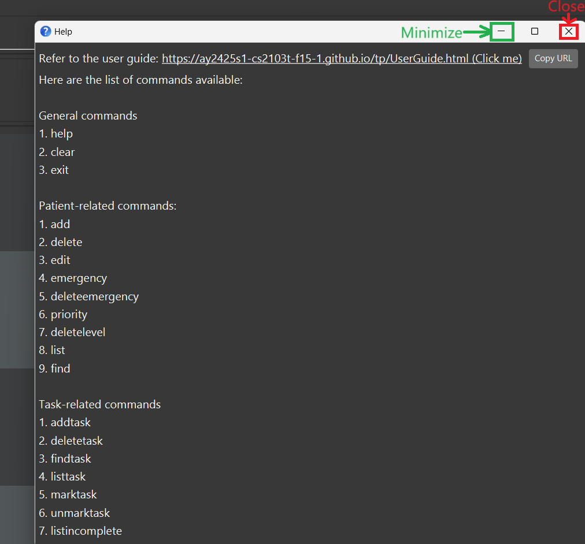

<link rel="stylesheet" href="https://fonts.googleapis.com/css2?family=Material+Symbols+Outlined:opsz,wght,FILL,GRAD@20..48,100..700,0..1,-50..200&icon_names=chevron_right" />

<h1 class="headers">StaffSync User Guide</h1>

  StaffSync is a <strong>desktop app for managing potential hires and employees, optimized for use via a  Line Interface</strong> (CLI) while still having the benefits of a Graphical User Interface (GUI). If you can type fast, StaffSync can get your contact management tasks done faster than traditional GUI apps.

 

<h1 class="toc headers">Table of Contents</h1>

  <a href="#installation-and-quick-start">
    <button class="toc-btns toc-btns-first">1. Installation and Quick Start</button>
  </a>
  <a href="#commands">
    <button class="toc-btns">2. Commands</button>
  </a>
  <a href="#command-summary">
    <button class="toc-btns">3. Commands Summary</button>
  </a>
  <a href="#features">
    <button class="toc-btns">4. Features</button>
  </a>
  <a href="#faq">
    <button class="toc-btns">5. FAQ</button>
  </a>
  <a href="#known-issues">
    <button class="toc-btns toc-btns-last">6. Known Issues</button>
  </a>

 

<h1 class="headers" id="installation-and-quick-start">Installation and Quick Start</h1>

<strong>1. </strong>Ensure you have [Java `17`](https://www.oracle.com/java/technologies/downloads/#java17) installed in your Computer. Higher versions may work but we do not officially support it.

 

<strong>2. </strong>Download the latest release `.jar` file from [our Github page](https://github.com/AY2425S1-CS2103T-T10-2/tp/releases).

 

<strong>3. </strong>Copy the file to the folder you want to use as the _home folder_ for your StaffSync.

 

<strong>4. </strong>Open a command terminal, `cd` into the folder you put the jar file in, and use the `java -jar staffSync.jar` command to run the application. 

   Alternatively, you can double-click the jar file to run the application (though we do not officially support it).

   A GUI similar to the below should appear in a few seconds. Note how the app contains some sample data. 
   

 

<strong>5. </strong>Type the command in the command div class="box" and press Enter to execute it. e.g. typing **`help`** and pressing Enter will open the help window. 
   Some example commands you can try:

   * `list ph` : Lists all potential hires.

   * `employee n/John Doe p/81234567 e/pohjunkang@gmail.com a/21 Lower Kent Ridge Rd d/Department of communications and informatics r/Head of communications and Informatics ced/2021-01-01` : Adds an employee named `John Doe` to StaffSync.

   * `delete ph 1` : Deletes the 1st person shown if they are a potential hire.

   * `clear` : Deletes all contacts.

   * `exit` : Exits the app.

 

<strong>6. </strong>Refer to the [Commands](#commands) below for details of each command.

 

<h1 class="headers" id="commands">Commands</h1>

**Notes about the command format:**

 

* Words in `UPPER_CASE` are the parameters to be supplied by the user. 
  e.g. in `employee n/NAME`, `NAME` is a parameter which can be used as `employee n/John Doe`.

* Items in square brackets are optional.
  e.g. `edit INDEX [n/NAME] [e/EMAIL]` can be used as `edit 1 n/John Doe e/johndoe@gmail.com` or `edit 1 n/John Doe`.

* Parameters can be in any order. 
  e.g. if the command specifies `n/NAME p/PHONE_NUMBER`, `p/PHONE_NUMBER n/NAME` is also acceptable.

* Parameters and commands are case-sensitive
  e.g. the command `Help` and `edit 1 N/John Doe` will return an error

* Extraneous parameters for commands that do not take in parameters (such as `help`, `exit` and `clear`) will be ignored. 
  e.g. if the command specifies `help 123`, it will be interpreted as `help`.

* If you are using a PDF version of this document, be careful when copying and pasting commands that span multiple lines as space characters >surrounding line-breaks may be omitted when copied over to the application.

  

    <strong>Clearing all entries <code>clear</code></strong>
    
      chevron_right
    
  

  

  Clears all entries from StaffSync.
  
   
   

  Format: `clear`
  

  
<strong>Deleting a person <code>delete</code></strong>
    
      chevron_right
    
  

  

  Deletes the specified person from StaffSync.

   
   

  Format: `delete ph INDEX` or `delete e INDEX` *(Note the `ph` or `e` parameter. `ph` refers to potential hires and `e` refers to employees)*

  * Deletes the potential hire/employee at the specified `INDEX`.
  * The index refers to the index number shown in the displayed person list.
  * The index **must be a positive integer** 1, 2, 3, …​
  * The index **must be within the size of the list** of potential hires/employees shown.

  Examples:
  * `list` followed by `delete e 2` deletes the 2nd person in the employee list.
  * `find e Betsy` followed by `delete e 1` deletes the 1st employee in the results of the `find` command.
  

  
<strong>Demoting a person <code>demote</code></strong>
    
      chevron_right
    
  

  

  Demotes the specified employee from StaffSync into a potential hire.

   
   

  Format: `demote INDEX`

  * Demote the employee at the specified `INDEX` to a potential hire.
  * The index refers to the index number shown in the displayed person list.
  * The index **must be a positive integer** 1, 2, 3, …​
  * The index **must be within the size of the list** shown.
  * The person at the index must be an employee

  Examples:
  * `list e` followed by `demote 2` demotes the 2nd person in the employee list.
  * `find e Betsy` followed by `demote 1` demotes the 1st employee in the results of the `find` command.

  

    
  **Common Mistakes:**
  * `list ph` followed by `demote 2` - cannot demote a potential hire
  * `demote 0` - invalid index number
  * `demote 3` but only have 2 entries - invalid index number, index out of list size 
  

  

  
<strong>[WIP] Editing a person <code>edit</code></strong>
    
      chevron_right
    
  

  

  Edits an existing person in the StaffSync.

   
   

  Format: `edit INDEX [n/NAME] [p/PHONE_NUMBER] [e/EMAIL] [a/ADDRESS] [d/DEPARTMENT] [r/ROLE] [ced/CONTRACT_END_DATE]`

  * Edits the person at the specified `INDEX`. The index refers to the index number shown in the displayed person list. The index **must be a positive integer** 1, 2, 3, …​
  * At least one of the optional fields must be provided.
  * Existing values will be updated to the input values.

  

  
  **Tip:** It is not possible to edit the contract end date of a potential hire
  

  Examples:
  *  `edit 1 p/91234567 e/johndoe@example.com` Edits the phone number and email address of the 1st person to be `91234567` and `johndoe@example.com` respectively.
  *  `edit 2 n/Betsy Crower t/` Edits the name of the 2nd person to be `Betsy Crower` and clears all existing tags.
  

  
<strong>Adding an employee <code>employee</code></strong>
    
      chevron_right
    
  

  

  Adds an employee to StaffSync.

   
   

  Format: `employee n/NAME p/PHONE_NUMBER a/ADDRESS e/EMAIL d/DEPARTMENT r/ROLE ced/CONTRACT_END_DATE`

  

    
  **Tip:** All fields are mandatory
  

  Examples:
  * `employee n/Jun Kang p/81234567 a/21 Lower Kent Ridge Rd e/pohjunkang@gmail.com d/Department of communications and informatics r/Head of communications and Informatics ced/2021-01-01`
  

  
<strong>Exiting the program <code>exit</code></strong>
    
      chevron_right
    
  

  

  Exits the program.

   
   

  Format: `exit`
  

  
<strong>Locating persons by name <code>find</code></strong>
    
      chevron_right
    
  

  

  Finds the employee/potential hire whose names contain any of the given keywords.

   
   

  Format: `find (all or e or ph) KEYWORD [MORE_KEYWORDS]`

  * The search is case-insensitive. e.g `hans` will match `Hans`
  * The order of the keywords does not matter. e.g. `Hans Bo` will match `Bo Hans`
  * Only the name is searched.
  * Only full words will be matched e.g. `Han` will not match `Hans`
  * Persons matching at least one keyword will be returned (i.e. `OR` search).
    e.g. `Hans Bo` will return `Hans Gruber`, `Bo Yang`

  Examples:
  * `find all John` returns people `john` and `John Doe`
  * `find e John` returns employees `john` and `John Doe`
  * `find ph alex david` returns potential hires `Alex Yeoh`, `David Li` 
    
  

  
<strong>Viewing help <code>help</code></strong>
    
      chevron_right
    
  

  

  Displays a help window containing the list of commands, its purpose and the format

   
   

  

  Format:`help`
  

  
<strong>Listing all persons <code>list</code></strong>
    
      chevron_right
    
  

  

  Shows a list of all persons in StaffSync.

   
   

  Format: `list all` or `list ph` or `list e` *(Note the `ph` or `e` parameter. `ph` refers to potential hires and `e` refers to employees)*
  * Lists type of persons based on the parameter given.
  

  
<strong>Adding a potential hire <code>potential</code></strong>
    
      chevron_right
    
  

  

  Adds a potential hire to StaffSync.

   
   

  Format: `potential n/NAME p/PHONE_NUMBER a/ADDRESS e/EMAIL d/DEPARTMENT r/ROLE`

  

    
  **Tip:** All fields are mandatory
  

  Examples:
  * `potential n/Jun Kang p/81234567 a/21 Lower Kent Ridge Rd e/pohjunkang@gmail.com d/Department of communications and informatics r/Head of communications and Informatics`
  

  
<strong>Promoting a person <code>promote</code></strong>
    
      chevron_right
    
  

  

  Promotes the specified potential hire from StaffSync into an employee.

   
   
  Format: `promote INDEX CONTRACT_END_DATE`

  * Promote the potential hire at the specified `INDEX` to an employee with the specified `CONTRACT_END_DATE`.
  * The index refers to the index number shown in the displayed person list.
  * The index **must be a positive integer** 1, 2, 3, …​
  * The index **must be within the size of the list** shown.
  * The person at the index must be a potential hire
  * The contract end date must be of **valid format** of yyyy-MM-dd

  Examples:
  * `list p` followed by `promote 2 2025-12-20` promotes the 2nd person in the potential hire list with a contract end date of 20 Dec 2025.
  * `find p n/Betsy` followed by `promote 1 2025-12-20` promotes the 1st potential hire in the results of the `find` command with a contract end date of 20 Dec 2025.

  

    
  **Common Mistakes:**
  * `promote 2 12-20-2025` - the contract end date is in the wrong date format
  * `promote 2 2025-20-12` - the day and the month of the contract end date is swapped
  * `list e` followed by `promote 2 2025-12-20` - cannot promote an employee
  * `promote 0 2025-12-20` - invalid index number
  * `promote 3 2025-12-20` but only have 2 entries - invalid index number, index out of list size
  

  

 

<h1 class="headers" id="command-summary">Commands Summary</h1>

Action     | Format                                                                                        | Examples
-----------|-----------------------------------------------------------------------------------------------|--------------------------------------------------------------------------------------------------
**Clear**  | `clear`                                                                                       |
**Delete** | `delete e INDEX`   `delete ph INDEX`                                                       | `delete e 3`  `delete ph 1`
**Demote** | `demote INDEX`                                                                                | `demote 2`
**Edit**   | `edit INDEX [n/NAME] [p/PHONE_NUMBER] [e/EMAIL] [a/ADDRESS] [d/DEPARTMENT] [r/ROLE] [ced/CONTRACT_END_DATE]` | `edit 2 n/James Lee e/jameslee@example.com`
**Employee**| `employee n/NAME p/PHONE_NUMBER a/ADDRESS e/EMAIL d/DEPARTMENT r/ROLE ced/CONTRACT_END_DATE​` | `employee n/Jun Kang p/81234567 a/21 Lower Kent Ridge Rd e/pohjunkang@gmail.com d/Department of communications and informatics r/Head of communications and Informatics ced/2021-01-01`
**Exit**   | `exit`                                                                                        |
**Find**   | `find all [KEYWORDS]`   `find e [KEYWORDS]`   `find ph [KEYWORDS]`                      | `find all Jake`   `find e Jake`   `find ph Jake`
**Help**   | `help`                                                                                        |
**List**   | `list all`   `list e`   `list ph`                                                       |
**Potential Hire**| `potential n/NAME p/PHONE_NUMBER a/ADDRESS e/EMAIL d/DEPARTMENT r/ROLE​`                | `potential n/Jun Kang p/81234567 a/21 Lower Kent Ridge Rd e/pohjunkang@gmail.com d/Department of communications and informatics r/Head of communications and Informatics`
**Promote** | `promote INDEX CONTRACT_END_DATE`                                                            | `promote 2 2025-12-20`

 

<h1 class="headers" id="features">Features</h1>

### **Saving the data**

StaffSync data are saved in the hard disk automatically after any command that changes the data. There is no need to save manually.

 

### **Editing the data file**

  
  StaffSync data are saved automatically as a JSON file `[JAR file location]/data/addressbook.json`. Advanced users are welcome to update data directly by editing that data file.
  

  
**Caution:**
If your changes to the data file makes its format invalid, StaffSync will discard all data and start with an empty data file at the next run.  Hence, it is recommended to take a backup of the file before editing it. 
Furthermore, certain edits can cause the StaffSync to behave in unexpected ways (e.g., if a value entered is outside the acceptable range). Therefore, edit the data file only if you are confident that you can update it correctly.

 
 

### **Archiving data files `[coming in v2.0]`**

  
_Details coming soon ..._
  

 

<h1 class="headers" id="faq">FAQ</h1>

  
<strong>Q: How do I transfer my data to another Computer?</strong>
    
      chevron_right
    
  

  

  <strong>A: </strong>Install the app in the other computer and overwrite the empty data file it creates with the file that contains the data of your previous StaffSync home folder.

  

 

<h1 class="headers" id="known-issues">Known Issues</h1>

1. **When using multiple screens**, if you move the application to a secondary screen, and later switch to using only the primary screen, the GUI will open off-screen. The remedy is to delete the `preferences.json` file created by the application before running the application again.
 
2. **If you minimize the Help Window** and then run the `help` command (or use the `Help` menu, or the keyboard shortcut `F1`) again, the original Help Window will remain minimized, and no new Help Window will appear. The remedy is to manually restore the minimized Help Window.

