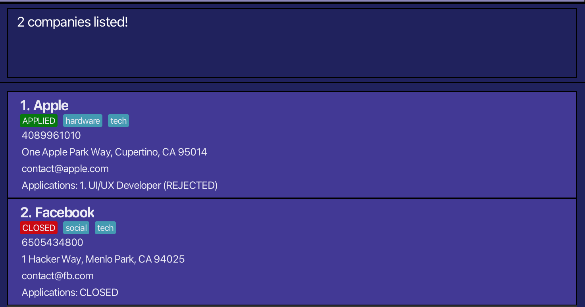

<h1 id="internbuddy-user-guide">
    
    InternBuddy User Guide
</h1>

InternBuddy is a **desktop app for managing contacts, optimized for use via a Command Line Interface** (CLI) while still having the benefits of a Graphical User Interface (GUI). If you can type fast, InternBuddy can get your contact management tasks done faster than traditional GUI apps.

<!-- * Table of Contents -->
<page-nav-print />

--------------------------------------------------------------------------------------------------------------------

## Command summary

| Action       | Format, Examples                                                                                                                                                                  |
|--------------|-----------------------------------------------------------------------------------------------------------------------------------------------------------------------------------|
| **Add**      | `add n/NAME e/EMAIL [p/PHONE_NUMBER] [a/ADDRESS] [t/TAG]…​`   e.g., `add n/Google LLC p/22224444 e/careers@google.com a/70 Pasir Panjang Rd, #03-71, 117371 t/tech t/software`  |
| **Apply**    | `apply INDEX n/NAME d/DESCRIPTION [as/APPLICATION_STATUS]`  e.g., `apply 1 n/Software Engineering Intern d/Uses React`                                                         |
| **Clear**    | `clear`                                                                                                                                                                           |
| **Delete**   | `delete INDEX`                                                                                                                                                                    |
| **Edit**     | `edit INDEX [n/NAME] [p/PHONE_NUMBER] [e/EMAIL] [a/ADDRESS] [t/TAG]…​`  e.g.,`edit 2 n/Meta Platforms e/jobs@meta.com`                                                          |
| **Exit**     | `exit`                                                                                                                                                                            |
| **Find**     | `find KEYWORD [MORE_KEYWORDS]`  e.g., `find Apple Inc`                                                                                                                         |
| **Help**     | `help`                                                                                                                                                                            |
| **List**     | `list`                                                                                                                                                                            |
| **Update**   | `update c/COMPANY_INDEX app/APPLICATION_INDEX as/APPLICATION_STATUS`  e.g.,`update c/1 app/1 as/OA`                                                                            |
| **Withdraw** | `withdraw c/COMPANY_INDEX app/APPLICATION_INDEX`  e.g., `withdraw c/3 app/1`                                                                                                   |

[back to top](#internbuddy-user-guide)

--------------------------------------------------------------------------------------------------------------------
## Quick start

1. Ensure you have Java `17` or above installed in your Computer by opening up your terminal (MacOS: Terminal, Windows: Command Prompt), followed by executing `java -version`.

1. Download the latest `.jar` file from [here](https://github.com/AY2425S1-CS2103T-T09-1/tp/releases).

1. Copy the file to the folder you want to use as the _home folder_ for your AddressBook.

1. Open a command terminal, `cd` into the folder you put the jar file in, and use the `java -jar internbuddy.jar` command to run the application. 
   A GUI similar to the below should appear in a few seconds. Note how the app contains some sample data. 
   

1. Type the command in the command box and press Enter to execute it. e.g. typing **`help`** and pressing Enter will open the help window. 
   Some example commands you can try:

   * `list` : Lists all contacts.

   * `add n/Jane Street p/91234567 e/careers@janestreet.com a/Jane Street, block 123, #01-01` : Adds a company named `Company` to the Address Book.

   * `delete 3` : Deletes the 3rd contact shown in the current list.

   * `clear` : Deletes all contacts.

   * `exit` : Exits the app.

1. Refer to the [Features](#features) below for details of each command.

[back to top](#internbuddy-user-guide)

--------------------------------------------------------------------------------------------------------------------

## Features

<box type="info" seamless>

**Notes about the command format:** 

* Words in `UPPER_CASE` are the parameters to be supplied by the user. 
  e.g. in `add n/NAME`, `NAME` is a parameter which can be used as `add n/John Doe`.

* Items in square brackets are optional. 
  e.g `n/NAME [t/TAG]` can be used as `n/John Doe t/friend` or as `n/John Doe`.

* Items with `…`​ after them can be used multiple times including zero times. 
  e.g. `[t/TAG]…​` can be used as ` ` (i.e. 0 times), `t/friend`, `t/friend t/family` etc.

* Parameters can be in any order. 
  e.g. if the command specifies `n/NAME p/PHONE_NUMBER`, `p/PHONE_NUMBER n/NAME` is also acceptable.

* Extraneous parameters for commands that do not take in parameters (such as `help`, `list`, `exit` and `clear`) will be ignored. 
  e.g. if the command specifies `help 123`, it will be interpreted as `help`.

* If you are using a PDF version of this document, be careful when copying and pasting commands that span multiple lines as space characters surrounding line-breaks may be omitted when copied over to the application.
</box>

### Adding a company: `add`

Adds a company to the address book.

Format: `add n/NAME e/EMAIL [p/PHONE_NUMBER] [a/ADDRESS] [t/TAG]…​`

<box type="tip" seamless>

**Tip:** A company can have any number of tags (including 0)
</box>

Examples:
* `add n/Apple e/contact@apple.com`
* `add n/Netflix e/contact@netflix.com p/4085403700 a/100 Winchester Circle, Los Gatos, CA`
* `add n/Google LLC t/FAANG e/contact@google.com p/1234567 t/tech`

### Adding application record for a company: `apply`

Adds an internship application record to an existing company in the address book.

Format: `apply INDEX n/NAME d/DESCRIPTION [as/APPLICATION_STATUS]`

* Adds an application record for the company at the specified `INDEX`. The index refers to the index number shown in the displayed company list. The index **must be a positive integer** 1, 2, 3, …​
* `APPLICATION_STATUS` can only take the values `APPLIED`, `OA`, `INTERVIEWED`, `OFFERED`, `ACCEPTED`, `REJECTED`
and will take be `APPLIED` if not specified.

<box type="tip" seamless>

**tip:** applying to a company automatically changes the company's status to `applied`.
</box>

Examples:
* `apply 1 n/Software Engineer Intern d/Requires knowledge of ReactJS and ExpressJS`
* `apply 2 n/Product Management Intern d/Requires Figma as/OA`
* `apply 3 n/Devops Engineer Intern d/Requires knowledge in networks as/OFFERED`

### Clearing all entries : `clear`

Clears all entries from the address book.

Format: `clear`

### Deleting a company : `delete`

Deletes the specified company from the address book.

Format: `delete INDEX`

* Deletes the company at the specified `INDEX`.
* The index refers to the index number shown in the displayed company list.
* The index **must be a positive integer** 1, 2, 3, …​

Examples:
* `list` followed by `delete 2` deletes the 2nd company in the address book.
* `find Apple` followed by `delete 1` deletes the 1st company in the results of the `find` command.

### Editing a company : `edit`

Edits an existing company in the address book.

Format: `edit INDEX [n/NAME] [p/PHONE] [e/EMAIL] [a/ADDRESS] [t/TAG]…​`

* Edits the company at the specified `INDEX`. The index refers to the index number shown in the displayed company list. The index **must be a positive integer** 1, 2, 3, …​
* At least one of the optional fields must be provided.
* Existing values will be updated to the input values.
* When editing tags, the existing tags of the company will be removed i.e adding of tags is not cumulative.
* You can remove all the company’s tags by typing `t/` without
    specifying any tags after it.

Examples:
*  `edit 1 p/91234567 e/company@example.com` Edits the phone number and email address of the 1st company to be `91234567` and `company@example.com` respectively.
*  `edit 2 n/Goggle t/` Edits the name of the 2nd company to be `Goggle` and clears all existing tags.

### Exiting the program : `exit`

Exits the program.

Format: `exit`

### Locating companies by name: `find`

Finds companies whose names contain any of the given keywords.

Format: `find KEYWORD [MORE_KEYWORDS]`

* The search is case-insensitive. e.g `inc` will match `Inc`
* The order of the keywords does not matter. e.g. `Ltd Pte` will match `Pte Ltd`
* Only the name is searched.
* Only full words will be matched e.g. `Inc` will not match `Incorporated`
* companies matching at least one keyword will be returned (i.e. `OR` search).
  e.g. `Tech Bro` will return `Good Tech`, `Bro Inc`

Examples:
* `find Inc` returns `inc` and `Apple Inc`
* `find apple facebook` returns `Apple`, `Facebook` 
  

### Viewing help : `help`

Shows a message explaning how to access the help page.

Format: `help`

### Listing all companies : `list`

Shows a list of all companies in the address book.

Format: `list`

### Updating an application for a company: `update`

Updates the application status of an application for an existing company in the address book.

Format: `update c/COMPANY_INDEX app/APPLICATION_INDEX as/APPLICATION_STATUS`

* Updates the application status of application record numbered `APPLICATION_INDEX` for the company at the specified `INDEX` to `APPLICATION_STATUS`.
The index refers to the index number shown in the displayed company list. The index **must be a positive integer** 1, 2, 3, …​

<box type="tip" seamless>

**tip:** `APPLICATION_STATUS` can only take the values `APPLIED`, `OA`, `INTERVIEWED`, `OFFERED`, `ACCEPTED`, `REJECTED`
</box>

### Withdrawing application for a company: `withdraw`

Removes an internship record for an existing company in the address book.

Format: `withdraw c/COMPANY_INDEX app/APPLICATION_INDEX`

* Removes the application record numbered `APPLICATION_INDEX` for the company at the specified `INDEX`.
The index refers to the index number shown in the displayed company list. The index **must be a positive integer** 1, 2, 3, …​

<box type="tip" seamless>

**tip:** withdrawing all applications from a company automatically changes the company's status to `CLOSED`.
</box>

### Saving the data

AddressBook data are saved in the hard disk automatically after any command that changes the data. There is no need to save manually.

### Editing the data file

AddressBook data are saved automatically as a JSON file `[JAR file location]/data/addressbook.json`. Advanced users are welcome to update data directly by editing that data file.

<box type="warning" seamless>

**Caution:**
If your changes to the data file makes its format invalid, AddressBook will discard all data and start with an empty data file at the next run.  Hence, it is recommended to take a backup of the file before editing it. 
Furthermore, certain edits can cause the AddressBook to behave in unexpected ways (e.g., if a value entered is outside the acceptable range). Therefore, edit the data file only if you are confident that you can update it correctly.
</box>

### Archiving data files `[coming in v2.0]`

_Details coming soon ..._

[back to top](#internbuddy-user-guide)

--------------------------------------------------------------------------------------------------------------------

## FAQ

**Q**: How do I transfer my data to another Computer? 
**A**: Install the app in the other computer and overwrite the empty data file it creates with the file that contains the data of your previous AddressBook home folder.

**Q**: Must I install java 17 or above to use InternBuddy?  
**A**: Yes, InternBuddy uses libraries implemented in java 17 or above, it will not work without it.

**Q**: How do I add a new company with multiple tags?  
**A**: To add a company with multiple tags, use the add command with multiple t/ tags. Example: `add n/Google LLC e/contact@google.com t/tech t/FAANG t/software`

**Q**: Can I edit a company’s details?  
**A**: Yes, you can edit any company's details using the edit command followed by the index of the company. Example: `edit 2 n/Apple Inc e/careers@apple.com p/12345678`

**Q**: Can I delete all contacts at once?  
**A**: Yes, use the clear command to delete all contacts in your address book. Be cautious, as this action is irreversible.

--------------------------------------------------------------------------------------------------------------------

## Known issues

1. **When using multiple screens**, if you move the application to a secondary screen, and later switch to using only the primary screen, the GUI will open off-screen. The remedy is to delete the `preferences.json` file created by the application before running the application again.
2. **If you minimize the Help Window** and then run the `help` command (or use the `Help` menu, or the keyboard shortcut `F1`) again, the original Help Window will remain minimized, and no new Help Window will appear. The remedy is to manually restore the minimized Help Window.
3. **If running `java -jar internbuddy.jar` gives error**, such as terminal displaying an error, ensure that Java 17 or higher is installed. Run `java -version` to check your version. For Mac users, check if you have followed the advisory given [here](https://nus-cs2103-ay2425s1.github.io/website/admin/programmingLanguages.html).

--------------------------------------------------------------------------------------------------------------------

## Glossary
- **CLI** (Command Line Interface): A text-based interface used to interact with the application by typing commands.
- **GUI** (Graphical User Interface): A visual interface that allows users to interact with the application through graphical elements such as buttons, icons, and windows.
- **Address Book**: A digital record or collection of companies or contacts managed by the InternBuddy app.
- **Application Record**: A record associated with a company indicating an internship or job application status, such as "APPLIED," "INTERVIEWED," or "REJECTED."
- **Command**: A specific instruction typed in the CLI to perform an action within the InternBuddy application.
- **Parameter**: Information or input that must be provided along with a command. In the guide, parameters are represented in UPPER_CASE (e.g., n/NAME).
- **Tag**: A label that can be added to a company to classify or organize it (e.g., t/tech, t/software).
- **JSON** (JavaScript Object Notation): A lightweight data-interchange format that is easy for humans to read and write and for machines to parse and generate. InternBuddy uses JSON to store its data files.
- **Index**: A number used to identify the position of a company or application in a list. InternBuddy commands often require an index to reference a specific company or application.
- **Home Folder**: The directory where InternBuddy stores its data and related files on your computer.
- **APPLIED / OA / INTERVIEWED / OFFERED / ACCEPTED / REJECTED**: The various statuses that can describe an application’s progress in the hiring process within InternBuddy.
- **Backup**: A copy of the data file created to prevent loss of information. The backup can be used to restore the AddressBook in case of accidental data loss.
- **JSON File Location**: The file path where InternBuddy stores its data, which can be manually edited or transferred to another computer.
- **Company**: Refers to an entity in the address book that represents a business or organization to which a user may apply for internships or jobs.

[back to top](#internbuddy-user-guide)
