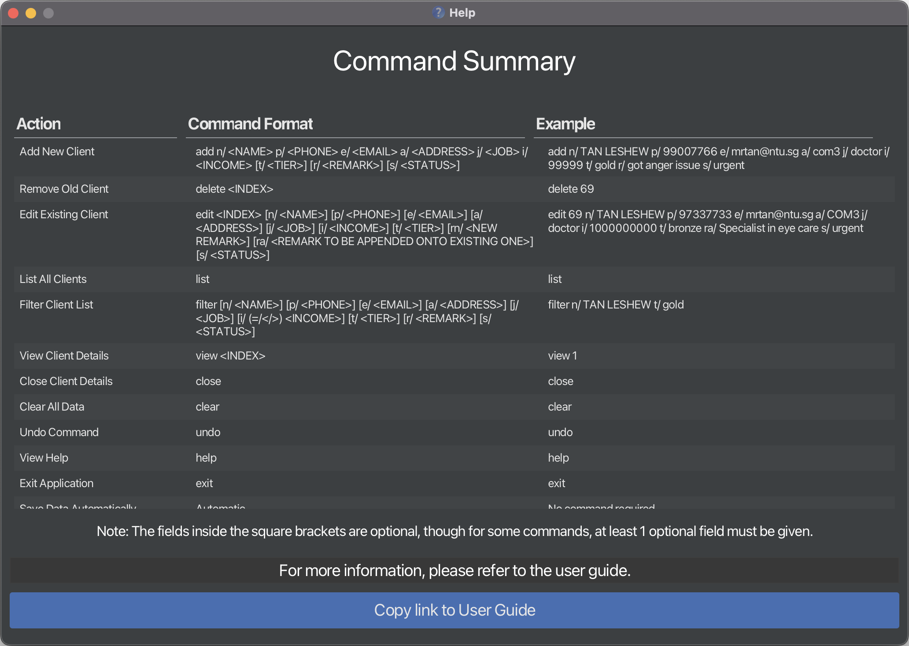

ContactMate is a **desktop app for managing clients (Singaporeans and Permanent Residents) of the Befriending Program at Active Ageing Centres (AACs), optimized for use via a Command Line Interface** (CLI) while still having the benefits of a Graphical User Interface (GUI). If you can type fast, ContactMate can get your contact management tasks done faster than traditional GUI apps.

* Table of Contents
{:toc}

--------------------------------------------------------------------------------------------------------------------

## Quick start

1. Ensure you have Java `17` or above installed in your Computer.
   1. Open a command terminal.
      1. For Windows Users:
         1. Hold down the `Windows` key and press `R`(<kbd>&#x229E; Win</kbd> + <kbd>R</kbd>).
         2. Type `cmd` and press `Enter`.
      2. For Mac Users:
         1. Hold down the `Command` key and press `Space` (<kbd>&#x2318; Cmd</kbd> + <kbd>Space</kbd>).
         2. Type `Terminal` and press `Enter`.
   1. In the terminal, type `java --version` and press `Enter`.
   2. If you have Java `17` or above installed, you should see a message containing something like this, (`openjdk XX.0.12 2024-07-16 LTS`), where `XX` should be `17` or above.
    3. If you do not have Java `17` or above installed, proceed to Step 2, otherwise, skip to Step 3.
2. Install Java `17` using the following steps.
   1. Go to [this link](https://www.oracle.com/java/technologies/javase-jdk17-downloads.html).
   2. Download the appropriate installer for your operating system.
   3. Run the installer and follow the instructions to install Java.
1. Download the latest `.jar` file from [here](https://github.com/AY2425S1-CS2103T-F14b-3/tp/releases).
   1. You can find the `.jar` file under the Assets section of the latest release.
   1. Click on the file `contactmate.jar` to download it.
   
1. Copy the file to the folder you want to use as the _home folder_ for ContactMate.

1. Open a command terminal for the folder you put the jar file in by following these steps (Folder is named `folder with contactmate jar` in the examples below) :
   1. For Windows Users:
      1. Right-click on the folder.
      1. Click on `Open in Terminal` as highlighted below.
        
   1. For Mac Users:
      1. Hold down the `Control` key and click on the folder (<kbd>Control</kbd> + <kbd>Click</kbd>).
      1. Click on `New Terminal at Folder` as highlighted below.
         
1. In the command terminal you just opened in Step 5, type `java -jar contactmate.jar` and press Enter to run the application. 
   1. When you first open the application, the list will contain the sample data. 
   2. The GUI will resemble the picture below. The next time you open ContactMate, the data will still be there for you to see. 
            

1. Type the command in the command box and press Enter to execute it. e.g. typing **`help`** and pressing Enter will open the help window. 
   Some example commands you can try:

   * `list` : Lists all elderly.

   * `add i/S5087089H n/John Doe p/98765432 e/johnd@example.com a/311, Clementi Ave 2, #02-25 c/7 t/wheelchairUser t/livingAlone` : Adds an elderly named `John Doe` to ContactMate.

   * `delete 3` : Deletes the 3rd elderly shown in the current list.

   * `clear` : Deletes all elderly.

   * `exit` : Exits the app.

1. Refer to the [Features](#features) below for details of each command.

--------------------------------------------------------------------------------------------------------------------

## Features

### Elderly Fields

Field | Description                                                                                                                                        | Constraints, Examples
--------|----------------------------------------------------------------------------------------------------------------------------------------------------|------------------
**NRIC** | National Registration Identity Card number of the elderly.                                                                                         | Must be valid (i.e. issued by the Singapore Government). e.g., `S1803269D`
**Name** | Name of the elderly.                                                                                                                               | Any word consisting only of alphabets, numbers or spaces. e.g., `John Doe`, `Alice`, `Bob`
**Phone Number** | Phone number of the elderly.                                                                                                                       | Any number, 3 digits or longer. e.g., `98765432`, `91234567`
**Email** | Email address of the elderly.                                                                                                                      | Any valid email address. e.g., `bob@gmail.com`
**Address** | Address of the elderly.                                                                                                                            | Any non-blank word. e.g., `311, Clementi Ave 2, #02-25`, `Blk 30 Geylang Street 28, #06-48`
**Call Frequency** | Frequency of calls to the elderly in days.                                                                                                         | A positive integer less than or equal to 7. e.g., `1` ... `7`
**Tags** | Tags associated with the elderly.                                                                                                                  | Any word consisting only of alphabets and numbers. e.g., `wheelchairUser`, `fallrisk`, `livingAlone`
**Call History** | List of dates the elderly was called and any notes associated with the call.                                                                      | Dates in the format `YYYY-MM-DD` and notes in any format.
**Next Contact Date** | **Calculated** based on the most recent call and the call frequency, with this formula: `Next Contact Date = Recent Contact Date + Call Frequency` | N.A.

**:information_source: Notes about the commands:** 

* Words in `UPPER_CASE` are the parameters to be supplied by the user. 
  e.g. in `add n/NAME`, `NAME` is a parameter which can be used as `add n/John Doe`.

* Items in square brackets `[]` are optional. 
  e.g `n/NAME [t/TAG]` can be used as `n/John Doe t/fallrisk` or as `n/John Doe`.

* Items with `…`​ after them can be used multiple times including zero times. 
  e.g. `[t/TAG]…​` can be used as ` ` (i.e. 0 times), `t/wheelchairUser`, `t/wheelchairUser` `t/livingAlone` etc.

* Parameters can be in any order. 
  e.g. if the command specifies `n/NAME p/PHONE_NUMBER`, `p/PHONE_NUMBER n/NAME` is also acceptable.

* Extraneous parameters for commands that do not take in parameters (such as `help`, `list`, `exit` and `clear`) will be ignored. 
  e.g. if the command specifies `help 123`, it will be interpreted as `help`.

* If you are using a PDF version of this document, be careful when copying and pasting commands that span multiple lines as space characters surrounding line-breaks may be omitted when copied over to the application.

* The `personList` view is the view where the list of elderly is shown. It is the default view when you start the application. Use the `list` command to return to this view if you are in another view.

* The fields in a command cannot have their prefix as part of the input. For example, `address` cannot be `a/Clementi Ave a/2` or `notes` cannot be `o/This is a note o/part of same note`.

### Viewing help : `help`

Shows a table of all the commands available in ContactMate. Also links to the User Guide.

Format: `help`

### Adding an elderly: `add`

Adds an elderly to ContactMate.

Format: `add i/NRIC n/NAME p/PHONE_NUMBER e/EMAIL a/ADDRESS c/CALL_FREQUENCY [t/TAG]…​`

* The parameters must adhere to the constraints specified in the [Elderly Fields](#elderly-fields) section.
* The elderly will be added with a default call history, consisting of one call on the current date with no notes.

:bulb: **Tip:**
An elderly can have any number of tags (including 0)

Examples:
* `add i/S5087089H n/John Doe p/98765432 e/johnd@example.com a/John street, block 123, #01-01 c/7`
* `add i/S6878830G n/Betsy Crowe t/wheelchairUser e/betsycrowe@example.com a/Blk 30 Geylang Street 28, #06-48 p/1234567 c/2`

### Listing all elderly : `list`

Shows a list of all elderly in ContactMate, sorted by priority of who to call next.

This is known as the `personList` view.

Format: `list`

### Editing an elderly : `edit`

Edits the details of an existing elderly in ContactMate.

Format: `edit INDEX/NRIC [i/NRIC] [n/NAME] [p/PHONE_NUMBER] [e/EMAIL] [a/ADDRESS] [c/CALL_FREQUENCY] [t/TAG]…​`

* Edits the elderly at the specified `INDEX` or `NRIC`. 
* The `INDEX` refers to the index number shown in the displayed person list. It must be a **positive integer** (e.g., 1, 2, 3, …​) and fall within the range of the list shown.
* The `NRIC` used to select the elderly must be a valid, government issued NRIC and must exist in the displayed person list.
* The parameters must adhere to the constraints specified in the [Elderly Fields](#elderly-fields) section.
* At least one of the optional fields must be provided.
* The existing values will be replaced with the new input values.
* When editing tags, all the existing tags of the elderly will be removed i.e adding tags is not cumulative.
* You can remove all tags of the elderly by typing `t/` without specifying any tags after it.
* This command is only allowed in `personList` view. You can first `list` all elderly to use this command.

Examples:
*  `edit 1 i/S8340008J p/91234567 e/johndoe@example.com` edits the NRIC, phone number and email address of the 1st elderly shown in the list to be `S8340008J`, `91234567` and `johndoe@example.com` respectively.
*  `edit S6878830G n/Betsy Crower t/` edits the name of the elderly with NRIC `S6878830G` to be `Betsy Crower` and clears all existing tags.

### Locating elderly by name and/or NRIC: `find`

Finds all elderly whose names or NRIC contain any of the given keywords.

Format: `find KEYWORD [MORE_KEYWORDS]`

* The search is case-insensitive. e.g `hans` will match `Hans`
* The order of the keywords does not matter. e.g. `Hans Bo` will match `Bo Hans`
* Only the name and NRIC are searched.
* Only full words will be matched. e.g. `Han` will not match `Hans` and `S1803` will not match `S1803269D`
* All elderly matching at least one keyword will be returned (i.e. `OR` search). e.g. `Hans Bo` will return `Hans Gruber`, `Bo Yang`

Examples:
* `find John` returns `john` and `John Doe`
* `find alex david` returns `Alex Yeoh`, `David Li`
* `find S7083906G` returns `Alex Yeoh`
* `find S7083906G david` returns `Alex Yeoh`, `David Li` 
  

### Deleting an elderly : `delete`

Deletes the specified elderly from ContactMate.

Format: `delete INDEX/NRIC`

* Deletes the elderly at the specified `INDEX` or `NRIC`.
* The `INDEX` refers to the index number shown in the displayed person list. It must be a **positive integer** (e.g., 1, 2, 3, …​) and fall within the range of the list shown.
* The `NRIC` used to select the elderly must be a valid, government issued NRIC and must exist in the displayed person list.
* This command is only allowed in `personList` view. You can first `list` all elderly to use this command.

Examples:
* `list` followed by `delete 2` deletes the 2nd elderly in ContactMate.
* `find Betsy` followed by `delete 1` deletes the 1st elderly in the results of the `find` command.

### Marking an elderly : `mark`

Marks the specified elderly from the current person list as called. 

ContactMate will update the list to show the new next contact date of the elderly and sort the list accordingly.
You can also mark the specified elderly as called on a specific date and add notes.

Format: `mark INDEX/NRIC [d/DATE] [o/NOTES]`

* Marks the elderly at the specified `INDEX` or `NRIC`.
* The `INDEX` refers to the index number shown in the displayed person list. It must be a **positive integer** (e.g., 1, 2, 3, …​) and fall within the range of the list shown.
* The `NRIC` used to select the elderly to mark must be a valid, government issued NRIC and must exist in the displayed person list.
* The date must be in the format `YYYY-MM-DD` and must not be a future date.
* If the parameter `d/DATE` is not provided, the current date will be used.
* This command is only allowed in `personList` view. You can first `list` all elderly to use this command.

Examples:
* `mark 1 d/2024-10-29 o/This person is sad`
* `mark S6878830G d/2024-10-31`
* `list` followed by `mark 2` marks the 2nd elderly in the list with the current date and no notes.
* `find Betsy` followed by `mark 1 d/2024-11-01 o/Feeling sick` marks the 1st elderly in the results of the `find` command with the specified date and note.

### Getting call history : `history`

Shows a list of call dates and corresponding notes for the specified elderly, sorted from the latest to the oldest date and the profile view of the elderly which includes their details.

Format: `history INDEX/NRIC`

* Shows the call history and profile view of the elderly at the specified `INDEX` or `NRIC`.
* The `INDEX` refers to the index number shown in the displayed person list. It must be a **positive integer** (e.g., 1, 2, 3, …​) and fall within the range of the list shown.
* The `NRIC` used to select the elderly must be a valid, government issued NRIC and must exist in the current person list.

Examples:
* `list` followed by `history 2` shows the call history and profile view of the 2nd elderly in ContactMate.
* `find Betsy` followed by `history 1` shows the call history and profile view of the 1st elderly in the results of the `find` command.
* `history S7495552E` shows the call history and profile view of the elderly with NRIC `S7495552E`.
  

### Clearing all entries : `clear`

Clears all entries from ContactMate.

:exclamation: **Warning:**
This command is irreversible. Use with caution.

Format: `clear`

### Exiting the program : `exit`

Exits the program.

Format: `exit`

### Navigating the Command History
You are able to navigate through your command history (both valid and invalid commands) by using the up <kbd>&#8593;</kbd> and down <kbd>&#8595;</kbd> arrow keys. Before using the arrow keys, ensure that the command box is in focus (i.e. you have just clicked on the command box).

### Duplicate detection
Duplicate entries (elderly) are entries with the same NRIC (case-insensitive). ContactMate will not allow duplicate entries, and will stop you from adding (`add`) or editing (`edit`) an elderly if it would result in a duplicate entry.

Examples:
* `edit 1 i/S2208201I` followed by `edit 2 i/s2208201i` will result in an error message, as the NRIC `S2208201I` already exists.

A weaker notion of duplication is that of entries with the same name, phone number or email (all case-insensitive). ContactMate will not prevent you from adding (`add`) or editing (`edit`) an elderly in this case, but will warn you that the entry is a potential duplicate.

Examples:
* `edit 1 n/John Doe` followed by `edit 2 n/John Doe` will result in a warning message, as the name `John Doe` already exists, but the edit will still be allowed.

### Saving the data

ContactMate data are saved in the hard disk automatically after any command that changes the data. There is no need to save manually.

### Editing the data file

ContactMate data are saved automatically as a JSON file `[JAR file location]/data/contactmate.json`. Advanced users are welcome to update data directly by editing that data file.

:exclamation: **Caution:**
If your changes to the data file makes its format invalid, ContactMate will discard all data and start with an empty data file at the next run. Hence, it is recommended to take a backup of the file before editing it. 
Furthermore, certain edits can cause ContactMate to behave in unexpected ways (e.g., if a value entered is outside of the acceptable range). Therefore, edit the data file only if you are confident that you can update it correctly.

--------------------------------------------------------------------------------------------------------------------

## FAQ

**Q**: How do I transfer my data to another Computer? 
**A**: Install the app in the other computer and overwrite the empty data file it creates with the file that contains the data of your previous ContactMate home folder.

**Q**: How do I save my data? 
**A**: ContactMate ensures your data is saved automatically after every command.

--------------------------------------------------------------------------------------------------------------------

## Glossary

* **CLI (Command Line Interface)**: A text-based user interface that allows users to interact with the system by typing commands.

* **GUI (Graphical User Interface)**: A visual interface that enables users to interact with the system through graphical elements like buttons, menus, and icons.

* **Command Box**: The text box in the GUI where you can type commands to interact with ContactMate.

* **Index**: A number to used to identify a specific record (elderly) in the list. For instance, "1" refers to the first record in the list.

* **Field**: A specific attribute or property of an elderly. For example, fields might include Name, Email, or Phone Number.

* **Parameter**: Specific data (e.g. `NAME`, `DATE`, `NOTES`) that you provide when using commands to modify its behaviour. Some parameters are mandatory, while others are optional, depending on the command.

* **Backup**: A copy of data stored separately to protect against loss or accidental deletion. Backups ensure data can be restored in case of unexpected issues.

* **JSON**: Known as JavaScript Object Notation, JSON is a lightweight, text-based data format that is easy for both humans and machines to read and write.

* **Profile View**: A display that shows all the details of a specific elderly.

* **Person List View**: Also referred to as "`personList` view", this is the display that shows the list of elderly in ContactMate. By default, it is displayed when you start the application and is also displayed after using the `list` or `find` commands.

--------------------------------------------------------------------------------------------------------------------

## Known issues

1. **When using multiple screens**, if you move the application to a secondary screen, and later switch to using only the primary screen, the GUI will open off-screen. The remedy is to delete the `preferences.json` file created by the application before running the application again.
2. **If you minimize the Help Window** and then run the `help` command (or use the `Help` menu, or the keyboard shortcut `F1`) again, the original Help Window will remain minimized, and no new Help Window will appear. The remedy is to manually restore the minimized Help Window.

--------------------------------------------------------------------------------------------------------------------

## Command summary

Action | Format, Examples
--------|------------------
**Add** | `add i/NRIC n/NAME p/PHONE_NUMBER e/EMAIL a/ADDRESS c/CALL_FREQUENCY [t/TAG]…​`   e.g., `add i/S2208201I n/James Ho p/22224444 e/jamesho@example.com a/123, Clementi Rd, 1234665 c/5 t/fallrisk`
**Clear** | `clear`
**Delete** | `delete INDEX/NRIC`  e.g., `delete 3`, `delete S2208201I`
**Edit** | `edit INDEX/NRIC [i/NRIC] [n/NAME] [p/PHONE_NUMBER] [e/EMAIL] [a/ADDRESS] [c/CALL_FREQUENCY] [t/TAG]…​`  e.g.,`edit 2 n/James Lee e/jameslee@example.com`
**Find** | `find KEYWORD [MORE_KEYWORDS]`  e.g., `find James Jake S1803269D`
**History** | `history INDEX/NRIC`  e.g., `history 1, history S2208201I`
**List** | `list`
**Mark** | `mark INDEX/NRIC [d/DATE] [o/NOTES]`  e.g., `mark 2 d/2021-10-01 o/This person is sad`
**Help** | `help`
**Exit** | `exit`
