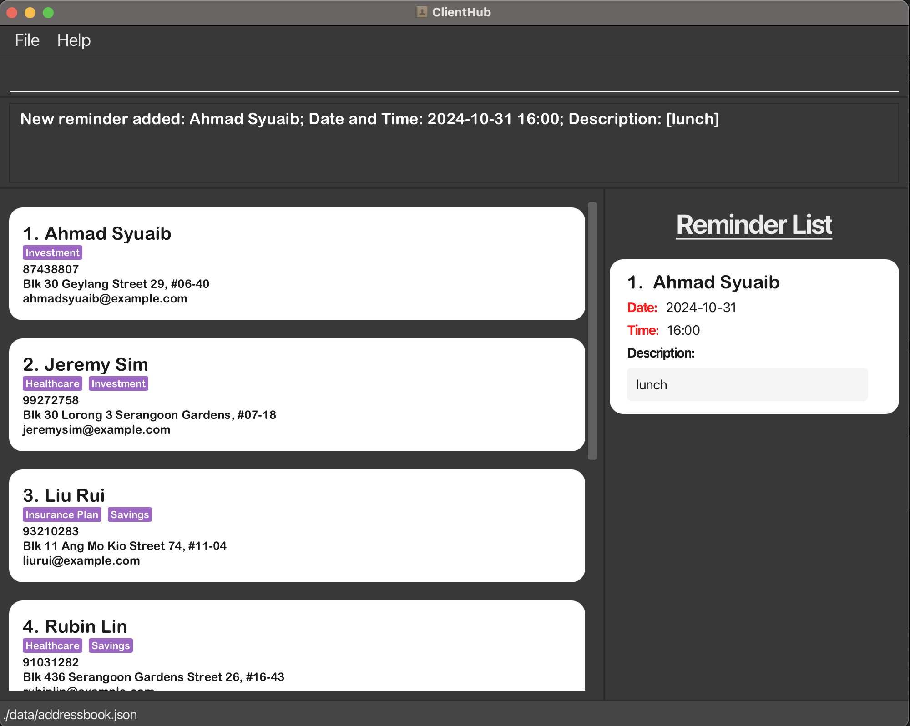

ClientHub is a desktop app for **Tech-savvy Independent Financial Advisors who have more than 50 clients that are mainly Singaporean** to better manage their clients. Our product provides financial advisors with a streamlined tool to manage client details, **optimised for use via a Command Line Interface** (CLI) while still **having the benefits of a Graphical User Interface (GUI)**. 

This product makes the lives of financial advisors easier by offering easier access to relevant information for their clients improving their efficiency. If you can type fast, ClientHub can get your client management tasks done faster than traditional GUI apps.

* Table of Contents
{:toc}

--------------------------------------------------------------------------------------------------------------------

## Quick start

1. Ensure you have Java `17` or above installed in your Computer.

1. Download the latest `.jar` file from [here](https://github.com/AY2425S1-CS2103T-F10-1/tp/releases).

1. Copy the file to the folder you want to use as the _home folder_ for your ClientHub.

Example:

**For Mac**
1. If you have downloaded the jar file into a folder in your `Downloads`
2. Open Terminal
3. Type `cd Downloads/[FolderName]` and press Enter
4. Type `java -jar clienthub.jar` and press Enter

**For Windows**
1. If you have downloaded the jar file into a folder in your `Downloads`
2. Open PowerShell
3. Type `cd Downloads/[FolderName]` and press Enter
4. Type `java -jar clienthub.jar` and press Enter

   A GUI similar to the one below should appear in a few seconds. Note how the app contains some sample data. 
   

1. Type the command in the command box and press Enter to execute it. e.g. typing **`help`** and pressing Enter will open the help window. 
   Some example commands you can try:

   * `list` : Lists all clients.

   * `add n/John Doe p/98765432 e/johnd@example.com a/John street, block 123, #01-01 d/likes ramen c/Investment` : Adds a client named `John Doe` to the Client Hub.

   * `delete John Doe` : Deletes John Doe from the Client Hub.

   * `clear` : Deletes all clients.

   * `exit` : Exits the app.

1. Refer to the [Features](#features) below for details of each command.

--------------------------------------------------------------------------------------------------------------------

## Features

**:information_source: Notes about the command format:** 

* Words in `UPPER_CASE` are the parameters to be supplied by the user. 
  e.g. in `add n/NAME`, `NAME` is a parameter which can be used as `add n/John Doe`.

* Items in square brackets are optional. 
  e.g `n/NAME [c/CLIENT_TYPE]` can be used as `n/John Doe c/Plan A` or as `n/John Doe`.

* Items that are **not** in square brackets are compulsory and must not be empty. 
  e.g. `n/NAME` must be used as `n/John Doe`.

* Items with `…`​ after them can be used multiple times. 
  e.g. `[c/CLIENT_TYPE]…​` can be used as ` `, `c/Plan A`, `c/Plan A c/Plan B` etc. (i.e. 0 or more times, since it is a optional field)  
  e.g. `c/CLIENT_TYPE…​`can be used as `c/Plan A`, `c/Plan A c/Plan B` etc. (i.e. 1 or more times, since it is compulsory)

* Parameters can be in any order. 
  e.g. if the command specifies `n/NAME p/PHONE_NUMBER`, `p/PHONE_NUMBER n/NAME` is also acceptable.

* Add `$` after the input name to indicate **exact** name. 
  * This is useful when a client's name is a prefix of another client's name.
  * Order of name inputs matter when using `$`
  * Name written before `$` must be **EXACT** name of the client.

  e.g. `delete John Doe$` will delete the client with the name `John Doe`. 
  e.g. If there are two client named `David Li` and `David Lim`, typing `delete David Li$` will delete the client with the name `David Li`.

* Extraneous parameters for commands that do not take in parameters (such as `help`, `list`, `exit`, `sort` and `clear`) will be ignored. 
  e.g. if the command specifies `help 123`, it will be interpreted as `help`.

* If you are using a PDF version of this document, be careful when copying and pasting commands that span multiple lines as space characters surrounding line-breaks may be omitted when copied over to the application.

### Parameter Specifications
* Specific constraints for each parameter are specified in the table below.
* Commands that use any of these parameters will have to adhere to the constraints specified in the table.

| Command                | Constraints                                                                                                                                                                                                                                      | Examples                                                                                                        |
|------------------------|--------------------------------------------------------------------------------------------------------------------------------------------------------------------------------------------------------------------------------------------------|-----------------------------------------------------------------------------------------------------------------|
| `NAME`                 |   - Must start with a letter   - Must contain more than 1 character   - **First** character: only letters   - **Last** character: only letters or parentheses   - **Middle** characters: letters, parentheses, or slashes   - Is **case-insensitive** | **Valid**: `John Doe`, `John (NUS)`, `John S/O Bob`   **Invalid**: `A`, `John 123`, `!John Doe`              |
| `PHONE_NUMBER`         |   - Only numbers   - Exactly 8 digits                                                                                                                                                                                                      | **Valid**: `12345678`   **Invalid**: `123456789`, `abc`                                                      |
| `EMAIL`                |   - Format: `local-part@domain`   - Local-part: alphanumeric and (+_.-) but cannot start/end with special characters   - Domain: ends with at least 2 characters; each label is alphanumeric, may contain hyphens but cannot start/end with them | **Valid**: `example@mail.com`, `my-example@mail.com`   **Invalid**: `@mail.com`, `example@c`, `example@.com` |
| `ADDRESS`              |   - Allowed characters: letters, numbers, `,#-():;`                                                                                                                                                                                           | **Valid**: `John street, block 123, #01-01`   **Invalid**: `$Block 69`                                       |
| `DESCRIPTION`          |   - Limited to 500 characters (including whitespace)                                                                                                                                                                                          | **Valid**: `likes bubble tea`                                                                                   |
| `CLIENT_TYPE`          |   - Alphanumeric only   - Max length: 30 characters   - No duplicates; duplicate entries are combined   - Is **case sensitive**                                                                                                      | **Valid**: `Plan A`   **Invalid**:  `Investment #1`                                                          |
| `DATETIME`             |   - Format: `yyyy-MM-dd HH:mm` in 24-hour format                                                                                                                                                                                              | **Valid**: `2022-10-10 12:00`   **Invalid**: `2022-10-10 12:00 pm`                                           |
| `REMINDER_DESCRIPTION` |   - Max length: 300 characters                                                                                                                                                                                                                | **Valid**: `Meeting with John at 12pm`                                                                          |
| `INDEX`                |   - Must be a positive integer                                                                                                                                                                                                                | **Valid**: `1`, `2`, `3`   **Invalid**: `0`, `-1`                                                            |

#### Note
* `NAME` is **case-insensitive**. The first letter of every word will be automatically converted to capital letter and the rest to small letters. This is
to ensure that 2 names with the same letters but different cases are not considered as different names. 

    e.g. `john doe` and `John Doe` are considered the same name and cannot be added as 2 different clients.

* `CLIENT_TYPE` is **case-sensitive**. This is to give greater flexibility to differentiate between different client types that are similar but have different cases.

    e.g. `Health` is different from `hEaLtH` while `Investment` and `Investment` are the same and are considered duplicates

* **"Do not exist"** inputs for `DATETIME`: 
  * If specified datetime is **valid** (i.e. dd = 01 to 31) but **does not exist** in that month, the reminder will be updated to the **NEAREST VALID** `DATETIME`
      * E.g. If `DateTime` is made to be `2024-02-30 16:00` which does not exist, the reminder will be added with dt:`2024-02-29 16:00`

### Viewing help : `help`

Shows a help window with a list of commands and their formats with a link to the User Guide.

Format: `help`

### Adding a client: `add`

Adds a client to Client Hub.

Format: `add n/NAME p/PHONE_NUMBER e/EMAIL a/ADDRESS d/DESCRIPTION c/CLIENT_TYPE…​`

Examples:
* `add n/John Doe p/98765432 e/johnd@example.com a/John street, block 123, #01-01  d/likes bubble tea c/Investment`
* `add n/Betsy Crowe p/12345678 e/betsycrowe@example.com a/Yishun Town d/Loves travelling c/Investment c/Healthcare `

* Clients cannot have the same name.
  * If a client with the same name already exists, an error will be thrown.
  * Example of an error: `add n/John Doe p/98765432...` if a John Doe already exists in ClientHub
  * To add a client with the same name, the name must be differentiated through means such as `(NUS)` or `(S/O Bob)`.
* Clients can have the same phone number, email, address, description, and client type.

Result for `add n/John Doe p/98765432 e/johnd@example.com a/John street, block 123, #01-01 d/likes bubble tea c/Investment`:

### Editing a client: `edit`

Edits an existing client in Client Hub.

Format: `edit INDEX [n/NAME] [p/PHONE_NUMBER] [e/EMAIL] [a/ADDRESS] [d/DESCRIPTION] [c/CLIENT_TYPE]…​`

* Edits the client at the specified `INDEX`. 
* At least one of the optional fields must be provided.
  * At most 1 of each field can be edited at a time. (excluding `CLIENT_TYPE`)
  * Multiple `CLIENT_TYPE` can be inputted at once.
* Existing values will be updated to the input values.
* When editing `CLIENT_TYPE`, the existing `CLIENT_TYPE` of the person will be removed i.e adding of `CLIENT_TYPE` is not cumulative.
* When editing `NAME`, the client with the associated `NAME` should have **no** reminders.
* Edited `Name` must be unique. (e.g. no 2 clients can have the same name).

Examples:
*  `edit 1 p/91234567 e/johndoe@example.com` Edits the phone number and email address of the 1st person to be `91234567` and `johndoe@example.com` respectively.
*  `edit 2 n/Betsy Crower c/investment c/healthcare` Edits the name of the 2nd person to be `Betsy Crower` and changes the `CLIENT_TYPE`s to `investment` and `healthcare`.

result for `edit 1 p/91234567`:

### Deleting a client: `delete`

Deletes the specified person from ClientHub.

Format: `delete NAME` or `d NAME` or `delete NAME$`

* Deletes the client with name that begins with specified `NAME` keyword.
* `$` is used to indicate specific name to delete.
* When the client with the specified `NAME` have **atleast 1** reminder it **cannot** be deleted.

Examples:
* `delete John Doe` deletes the person named `John Doe`.
* `delete John Doe$` deletes the person named `John Doe` and not `John Doey`.
* If there are 2 clients `David Li` and `David Lim`, typing `delete David Li` will throw an error, telling the user to specify the name further.

Result for `delete John Doe`:

### Locating clients by key information: `find`

Finds clients by `NAME`, `PHONE_NUMBER`, `ADDRESS` or `CLIENT_TYPE`.

#### Locating by `NAME`
Format: `find n/NAME` or `fn NAME` or `find NAME$`

* `$` is used to indicate exact name to find
* The search is case-insensitive. e.g `hans` will match `Hans`
* The order of the keywords does not matter. e.g. `Hans Bo` will match `Bo Hans`
* Prefix of words will be matched e.g. `Ha B` will match `Hans Bo`
* Clients matching all keyword prefix will be returned (i.e. `AND` search).
  e.g. `Hans Bo` will return `Hans Bo` but not `Hans Gruber`, `Bo Yang`

Examples:
* `find n/John` returns `John` and `John Doe`
* `find n/alex yeo` returns `Alex Yeoh`
* `fn John` returns `John`, `John Doe`, `Doe John`, `Doe John Eng`
* `fn Ale Yeo` returns `Alex Yeoh`
* `fn Yeoh Alex` returns `Alex Yeoh`
* `fn aLex yEOh` returns `Alex Yeoh`

Result for `find n/roy`:

#### Locating by `PHONE_NUMBER`
Format: `find p/PHONE_NUMBER` or `fp PHONE_NUMBER`
  *  Only numbers that begin with keyword will be matched e.g. `8765432` will not match `98765432`

Examples:
* `find p/9103` returns `91031282`
* `fp 8433` returns `84334567`

Result for `find p/9103`:

#### Locating by `ADDRESS`
Format: `find a/ADDRESS` or `fa ADDRESS`
  * The search is case-insensitive. e.g `tampines` will match `Tampines`
  * Clients with address with any matching substring to the keyword will be returned.

Examples:
* `find a/Blk 47` returns `Blk 47 Tampines Street 20`
* `fa Blk 47` returns `Blk 47 Tampines Street 20`

Result for `find a/tampines`:

#### Locating by `CLIENT_TYPE`
Format: `find c/CLIENT_TYPE…​` or `fc CLIENT_TYPE…​`
* The search is case-insensitive. e.g `investment` will match `Investment`

* **Single** `CLIENT_TYPE` search performs a *substring* search. 
  * The clients returned must have **at least 1** `CLIENT_TYPE` that contains the input.
  * e.g. `find c/Investment` will return clients with at least 1 `CLIENT_TYPE` that contains `Investment`.

* **Multiple** `CLIENT_TYPE` search performs a *prefix* search.
  * For every single input, the returned client must have **at least 1** `CLIENT_TYPE` that starts with the input. 
  * e.g. `find c/Invest Health` returns clients with both `Investment` and `Healthcare` which are `CLIENT_TYPE`s that start with `Invest` and `Health`.
  
* Duplicate `CLIENT_TYPE` will be combined into 1 (No way to have duplicate client types showing)

Examples:
* `find c/Investment` returns every client that has a `CLIENT_TYPE` beginning with `Investment`
* `find c/Invest` returns every client that has `CLIENT_TYPE` beginning with `Invest`
* `find c/Investment Healthcare` returns every client that has `CLIENT_TYPE` beginning with `Investment` and `Healthcare`
* `fc Investment` returns `Investment Plan`
* `fc Investment Healthcare` returns every client that has `CLIENT_TYPE` beginning with `Investment Plan` and `Healthcare Plan`

Result for `find c/Investment`:

### Reminder Features
ClientHub has a basic reminder list that keeps track of a users commitments to
specific clients. The reminder list is a list of reminders that can be added,
deleted, and edited.

#### Adding Reminder: `radd`

Adds a reminder for a client with the specified `NAME` to the reminder list.

Format:
`radd n/NAME dt/DATETIME r/REMINDER_DESCRIPTION` or
`ra n/NAME dt/DATETIME r/REMINDER_DESCRIPTION` or
`radd n/NAME$ dt/DATETIME r/REMINDER_DESCRIPTION`

* `$` is used to indicate exact name to add a reminder for

Result for `radd n/Ahmad Syuaib dt/2024-10-31 16:00 d/lunch`:

#### Editing a Reminder: `redit`

Edits an existing reminder in the reminder list.

Format:
`redit INDEX [dt/DATETIME] [d/REMINDER_DESCRIPTION]` or
`re INDEX [dt/DATETIME] [d/REMINDER_DESCRIPTION]`

* Edits the reminder at the specified `INDEX`.
* At least one of the optional fields must be provided.
  * At most 1 of each field can be edited at a time.
* Existing values will be updated to the input values.

Examples:
* `redit 1 dt/2022-10-10 12:00 d/Meeting for lunch` Edits the date and time and description of the 1st reminder to be `2022-10-10 12:00` and `Meeting for lunch` respectively.
* `re 2 dt/2022-10-10 12:00` Edits the date and time of the 2nd reminder to be `2022-10-10 12:00`

Result for `redit 1 dt/2025-10-10 13:00 d/lunch`:

#### Deleting a Reminder: `rdelete`

Deletes a reminder from the reminder list.

Format:
`rdelete INDEX` or
`rd INDEX`

* Deletes the reminder from the reminder list with the specified `INDEX`.

Examples:
* `rdelete 1` deletes the reminder at index 1 of the reminder list
* `rd 2` will delete the reminder at index 2 of the reminder list

Result for `rdelete 1`:

### Viewing a client: `view`

Creates a pop-up view of the specified client from ClientHub containing all the information about the specified client.
* The `NAME`, `PHONE_NUMBER`, `EMAIL`, `ADDRESS`, `DESCRIPTION`, and `CLIENT_TYPE`s of the client will be displayed.
* The `REMINDER` tagged to the client will **not** be displayed in the pop-up view

Format: `view NAME` or `v NAME` or `view NAME$`

* The command does a `find` and displays the pop-up view only if the no. of clients found is exactly 1.
    * If more than 1 name is found, `view` will throw an error telling user to specify the name further. 
* The command is case-insensitive. eg. `alice` will match `Alice`
* Any characters after the `view` keyword (and a whitespace) will be considered as the `NAME` of the client to be viewed.
* Executing another `view` command will create a **new** pop-up view of the specified client.
* Duplicate view pop-ups are **allowed**.
* `$` is used to indicate specific name to `view`

Examples:
* `view John Doe` shows the client named `John Doe`
* `view John` will throw an error if there is `John Doe` and `John Doey` in the list of clients
* `view n/John` will throw an error if there is no one named `n/John` in the list of clients

Result for `view jeremy`:

### Sorting by name : `sort`
Sort the current list of clients on Client Hub according to their `NAME`.

Format: `sort` or `s`

* The list of clients is sorted alphabetically by their full names in ascending order, where no duplicate names are allowed.

Examples:
* `sort` sorts the list

### Listing all persons : `list`
Shows a list of all persons in the Client Hub.

Format: `list` or `li`

### Clearing all entries : `clear`
Clears all entries from ClientHub.

Format: `clear`

### Exiting the program : `exit`
Exits the program.

Format: `exit`

--------------------------------------------------------------------------------------------------------------------

## Additional Features
### Command History Navigation
The command history feature allows users to easily navigate through previously entered commands using the **Up** and **Down** arrow keys. This is helpful for quickly accessing past commands without needing to retype them.

* **Up** Arrow: Moves to the previous command in the history.
* **Down** Arrow: Moves to the next command in the history.

This feature enables efficient command recall, streamlining the process of repeating or editing previous inputs.

### Saving the data

ClientHub data is saved in the hard disk automatically after any command that changes
the data. There is no need to save manually.

### Editing the data file

ClientHub data is saved automatically as a JSON file `[JAR file location]/data/clienthub.json`. Advanced users are welcome to update data directly by editing that data file.

:exclamation: **Caution:**
If your changes to the data file makes its format invalid, ClientHub will discard all data and start with an empty data file at the next run. Hence, it is recommended to take a backup of the file before editing it. 
Furthermore, certain edits can cause the ClientHub to behave in unexpected ways (e.g., if a value entered is outside of the acceptable range). Therefore, edit the data file only if you are confident that you can update it correctly.

### Archiving data files `[coming in v2.0]`

_Details coming soon ..._

--------------------------------------------------------------------------------------------------------------------

## FAQ

**Q**: How do I transfer my data to another Computer? 
**A**: Install the app in the other computer and overwrite the empty data file it creates with the file that contains the data of your previous ClientHub home folder.

--------------------------------------------------------------------------------------------------------------------

## Known issues

1. **When using multiple screens**, if you move the application to a secondary screen, and later switch to using only the primary screen, the GUI will open off-screen. The remedy is to delete the `preferences.json` file created by the application before running the application again.
2. **If you minimize the Help Window** and then run the `help` command (or use the `Help` menu, or the keyboard shortcut `F1`) again, the original Help Window will remain minimized, and no new Help Window will appear. The remedy is to manually restore the minimized Help Window.

--------------------------------------------------------------------------------------------------------------------

## Command summary

| Action                | Format, Examples                                                                                                                                                                                                                                                       |
|-----------------------|------------------------------------------------------------------------------------------------------------------------------------------------------------------------------------------------------------------------------------------------------------------------|
| **Help**              | `help`                                                                                                                                                                                                                                                                 |
| **Add**               | `add n/NAME p/PHONE_NUMBER e/EMAIL a/ADDRESS d/DESCRIPTION c/CLIENT_TYPE…​`  or    `a n/NAME p/PHONE_NUMBER e/EMAIL a/ADDRESS d/DESCRIPTION c/CLIENT_TYPE…​`   e.g `add n/James Ho p/22224444 e/jamesho@example.com a/123, Clementi Rd, 1234665 c/Plan A c/Plan A d/crimefighter` |
| **Delete**            | `delete NAME` or `d NAME` or `delete NAME$`   e.g `delete James` or `d James`                                                                                                                                                                                       |
| **Edit**              | `edit INDEX [n/NAME] [p/PHONE_NUMBER] [e/EMAIL] [a/ADDRESS] [d/DESCRIPTION] [c/CLIENT_TYPE]…​ `  e.g `edit 2 n/James Lee e/jameslee@example.com`                                                                                                                    |
| **Find Name**         | `find n/NAME` or `fn NAME` or `find n/NAME$`   e.g `find n/John` or `fn John`                                                                                                                                                                                       |
| **Find Phone Number** | `find p/PHONE_NUMBER` or `fp PHONE_NUMBER` or `find PHONE_NUMBER$`   e.g `find p/98765432` or `fp 98765432`                                                                                                                                                         |
| **Find Address**      | `find a/ADDRESS` or `fa ADDRESS`   e.g `find a/Blk 30` or `fa Blk 30`                                                                                                                                                                                               |
| **Find Client Type**  | `find c/CLIENT_TYPE…​` or `fc CLIENT_TYPE…​`  e.g `find c/Investment` or `fc Investment`                                                                                                                                                                               |
| **Add Reminder**      | `radd n/NAME dt/DATETIME d/DESCRIPTION` or `ra n/NAME dt/DATETIME d/DESCRIPTION` or `radd n/NAME$ dt/DATETIME d/DESCRIPTION`   e.g `radd n/John dt/2024-01-01 12:00 d/Appointment` or `ra n/John dt/2024-01-01 12:00 d/Appointment`                                 |
| **Delete Reminder**   | `rdelete INDEX` or `rd INDEX`   e.g `rdelete 1` or `rd 2`                                                                                                                                                                                                           |
| **Edit Reminder**     | `redit INDEX [dt/DATETIME] [d/DESCRIPTION]` or `re INDEX [dt/DATETIME] [d/DESCRIPTION]`   e.g `redit 1 dt/2024-02-02 13:00 d/Review` or `re 1 dt/2024-02-02 13:00`                                                                                                  |
| **View**              | `view NAME` or `v NAME` or `view NAME$`   e.g., `view James` or `v James`                                                                                                                                                                                           |
| **Sort**              | `sort` or `s`                                                                                                                                                                                                                                                          |
| **List**              | `list` or `li`                                                                                                                                                                                                                                                         |
| **CLear**             | `clear`                                                                                                                                                                                                                                                                |
| **Exit**              | `exit`                                                                                                                                                                                                                                                                 |
