# Real Connect
Real Connect is a **desktop app for managing contacts, optimized for use via a Command Line Interface** (CLI) while still having the benefits of a Graphical User Interface (GUI). If you can type fast, Real Connect can get your contact management tasks done faster than traditional GUI apps.

* Table of Contents
  {:toc}

--------------------------------------------------------------------------------------------------------------------

## Quick start

1. Ensure you have Java `17` or above installed in your Computer.

2. Download the latest `.jar` file from [here](https://github.com/se-edu/addressbook-level3/releases).

3. Copy the file to the folder you want to use as the _home folder_ for your AddressBook.

4. Open a command terminal, `cd` into the folder you put the jar file in, and use the `java -jar addressbook.jar` command to run the application. 
   A GUI similar to the below should appear in a few seconds. Note how the app contains some sample data. 
   

5. Type the command in the command box and press Enter to execute it. e.g. typing **`help`** and pressing Enter will open the help window. 
   Some example commands you can try:

    * `list` : Lists all contacts.

    * `add n/John Doe p/98765432 e/johnd@example.com a/John street, block 123, #01-01` : Adds a contact named `John Doe` to the Address Book.

    * `delete 3` : Deletes the 3rd contact shown in the current list.

    * `clear` : Deletes all contacts.

    * `exit` : Exits the app.

6. Refer to the [Features](#features) below for details of each command.

--------------------------------------------------------------------------------------------------------------------

## Command Structure
Real Connect uses the following intuitive structure for the most of its functions:
##### Commands on existing users
E.g. `add`: `<Command> <X/parameter...>`

##### Commands on Non-existing users
E.g. `addProperty`: `<Command> <Index> <X/parameter>`

##### Functional commands
E.g. `help`: `<Command>`

> X is a placeholder for prefixes

Insert example command picture

--------------------------------------------------------------------------------------------------------------------
## Features

**:information_source: Notes about the command format:** 
* Words in `UPPER_CASE` are the parameters to be supplied by the user. 
  e.g. in `add n/NAME`, `NAME` is a parameter which can be used as `add n/John Doe`.

* Items in square brackets are optional. 
  e.g `n/NAME [t/TAG]` can be used as `n/John Doe t/friend` or as `n/John Doe`.

* Items with `…`​ after them can be used multiple times including zero times. 
  e.g. `[t/TAG]…​` can be used as ` ` (i.e. 0 times), `t/friend`, `t/friend t/family` etc.

* Parameters to the functions may have specific requirements. More information can be found here. [See Parameter Requirements](#parameter-requirements)

* Parameters can be in any order. 
  e.g. if the command specifies `n/NAME p/PHONE_NUMBER`, `p/PHONE_NUMBER n/NAME` is also acceptable.

* Extraneous parameters for commands that do not take in parameters (such as `help`, `list`, `exit` and `clear`) will be ignored. 
  e.g. if the command specifies `help 123`, it will be interpreted as `help`.

* If you are using a PDF version of this document, be careful when copying and pasting commands that span multiple lines as space characters surrounding line-breaks may be omitted when copied over to the application.

### Viewing help : `help`

**Command Format:**  
`help`

- Provides help information.

---

### Adding a person: `add`

Adds a new contact with details such as name, phone number, physical address, birthday, email, and remarks.

**Command Format:**  
`add n/<Full Name> p/<Phone Number> a/<Address> [b/<Birthday>] e/<Email> [r/<Remark>]…​ [t/<Tag>]…​`

- `n/` Full name (mandatory) (exact duplicate not allowed, case-sensitive)
- `p/` Phone number (mandatory) (duplicate allowed)
- `a/` Address (mandatory) (duplicate allowed)
- `b/` Birthday (optional) (duplicate allowed)
- `e/` Email (optional) (duplicate allowed)
- `r/` Remark (optional) (multiple allowed but only the last one will be recorded) (duplicate allowed)
- `t/` Tag (optional) (multiple allowed and all will be added) (duplicate allowed)

💡 <strong>Tip:</strong> 
A person can have any number of tags (including 0)

**Examples:**
- `add n/John Doe p/98765432 e/johnd@example.com a/John street, block 123, #01-01`
- `add n/Betsy Crowe t/friend e/betsycrowe@example.com a/Newgate Prison p/1234567 t/criminal`
- `add n/Alice Tan p/91234567 a/123 Orchard Road, #10-01 b/1990-08-15 e/alice.tan@example.com r/Interested in modern properties t/prospect t/follow-up`
- `add n/Ben Johnson p/87654321 a/456 Clementi Avenue, #02-15 t/client r/Prefers suburban areas b/1985-05-23`
- `add n/Clara Lim p/99887766 a/789 Punggol Way, #07-05 e/clara.lim@example.com t/lead t/premium`

---

### Listing all persons : `list`

Displays all persons stored in the address book.

**Command Format:**  
`list`

- Shows a list of all saved contacts.

---

### Sorting contacts: `sort`

Sorts the contact list by name, either in ascending (A-Z) or descending (Z-A) order.

**Command Format:**  
`sort <asc/desc>`

- `ORDER` must be either `asc` for ascending (A-Z) or `desc` for descending (Z-A).
- If an invalid or no order is provided, an error message will be shown.

Examples:
* `sort asc` – Sorts contacts in alphabetical order (A-Z).
* `sort desc` – Sorts contacts in reverse alphabetical order (Z-A).

---

### Editing a person : `edit`

Edits an existing person in the address book.

**Command Format:**  
`edit INDEX [n/NAME] [p/PHONE] [e/EMAIL] [a/ADDRESS] [r/REMARK] [b/BIRTHDAY] [t/TAG]…​`

- Edits the person at the specified `INDEX`. The index refers to the index number shown in the displayed person list. The index **must be a positive integer** 1, 2, 3, …​, and cannot exceed the number of persons in the address book.
- At least one of the optional fields must be provided.
- Existing values will be updated to the input values.
- When editing tags, the existing tags of the person will be removed i.e adding of tags is not cumulative.
- You can remove all the person’s tags by typing `t/` without
  specifying any tags after it.
- Note that edit tag will overwrite exist list of tags to the new list of tags entered. Make sure to copy the existing tags you want to keep when editing.
- Note that history and property **cannot be edited**

**Examples:**
-  `edit 1 p/91234567 e/johndoe@example.com` Edits the phone number and email address of the 1st person to be `91234567` and `johndoe@example.com` respectively.
-  `edit 2 n/Betsy Crower t/` Edits the name of the 2nd person to be `Betsy Crower` and clears all existing tags.
-  `edit 3 a/456 Clementi Road #02-15 r/Looking for a new property` Edits the address of the 3rd person to `456 Clementi Road #02-15` and adds a remark indicating they are `Looking for a new property`.
-  `edit 4 n/James Lee b/1989-07-20 t/friend t/premium` Edits the name of the 4th person to `James Lee`, sets their birthday to `1989-07-20`, and updates their tags to `friend` and `premium`.
-  `edit 5 p/98765432 t/` Edits the phone number of the 5th person to `98765432` and removes all existing tags.

### Adding history to a person : `log`

Edits an existing person in the address book.

Format: `log INDEX [d/DATE] l/LOG`

* Adds a new history entry to the person at the specified `INDEX`. The index refers to the index number shown in the displayed person list. The index **must be a positive integer** 1, 2, 3, …​, and cannot exceed the number of persons in the address book.
* Date is optional, and must be no earlier than the date of creation of the person, and not in the future, if to be included.
* If date is not included the date of the history entry to be added will be today, system time, by default.
* Date format **must** be in `yyyy-mm-dd`.
* Log message **cannot be empty**.

Examples:
* `log 1 d/2024-08-08 l/meet up` add a log entry to the first person in the address book, `meet up` on 2024-08-08.
  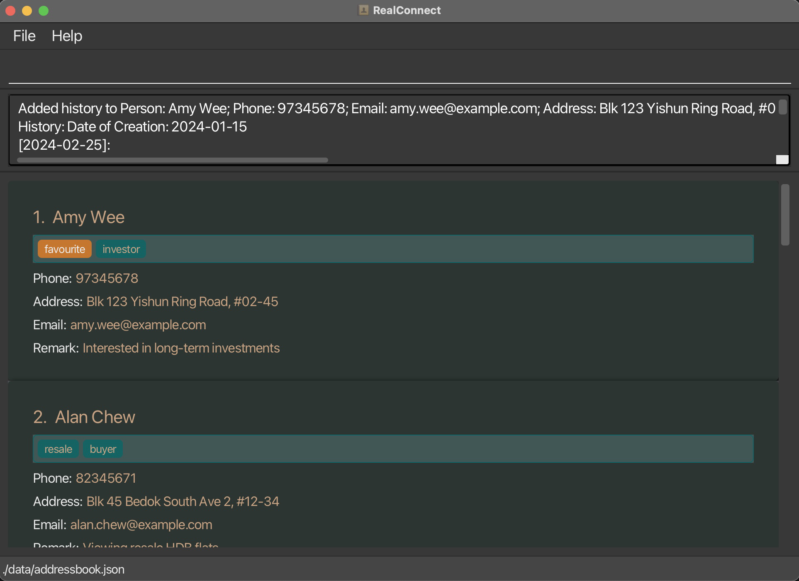
  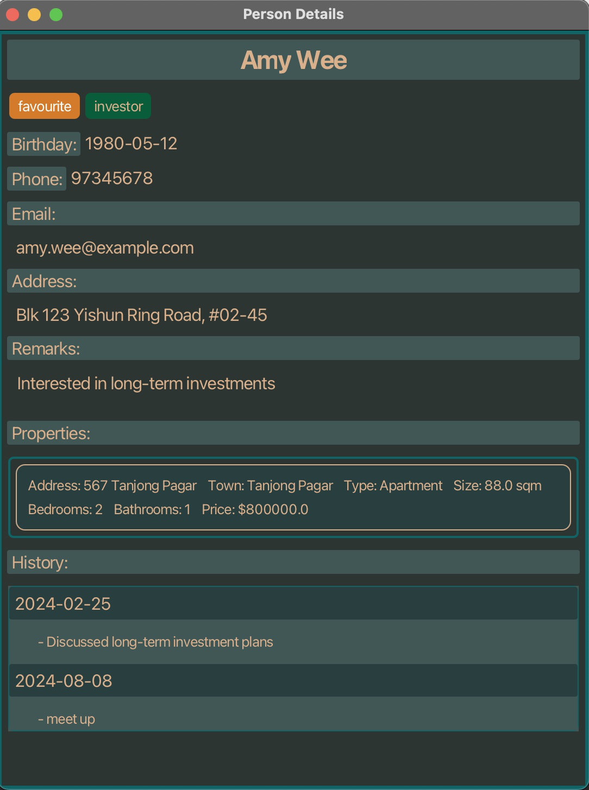

* `log 2 l/had lunch together` add a log entry to the 2nd person in the address book, `had lunch together` on today.
  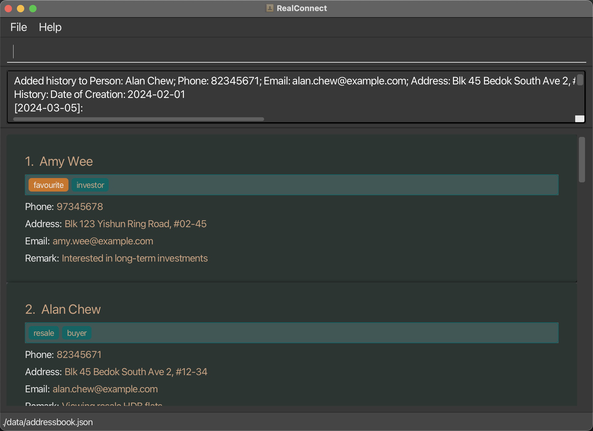
  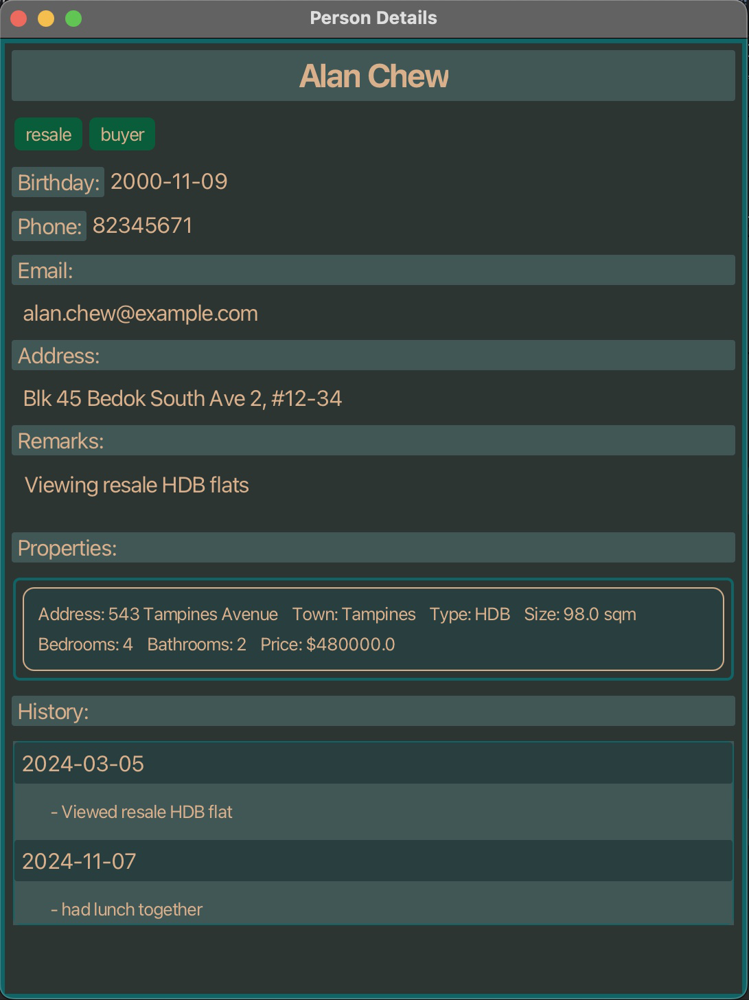

### Remarking a person : `remark`

Add or edit remark to an existing person in the address book. Note that although multiple remarks may be entered, 
only the last (most up to date one) will be recorded.

Format: `remark INDEX r/REMARK]…​`

* Add or edit remark to the person at the specified `INDEX`. The index refers to the index number shown in the displayed person list. The index **must be a positive integer** 1, 2, 3, …​, and cannot exceed the number of persons in the address book.

Examples:
* `remark 1 r/remark message` adds remark message `remark message` to the 1st person, existing remark will be overwritten.
  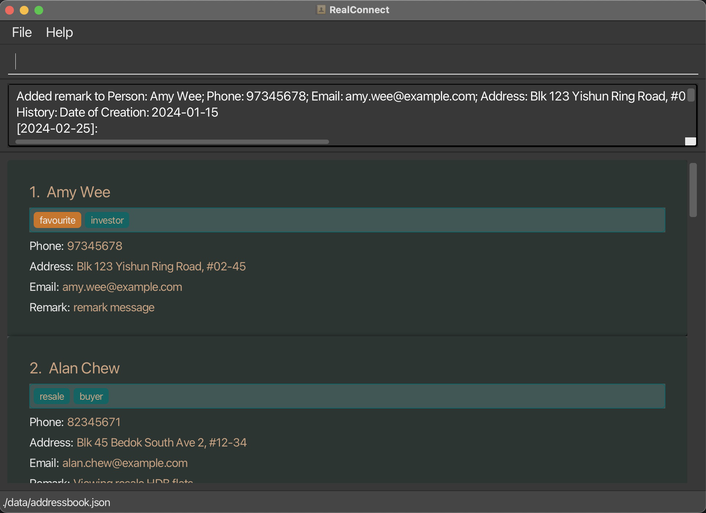
* `remark 1 r/first remark r/second remark` adds remark message `second remark` to the first person.
  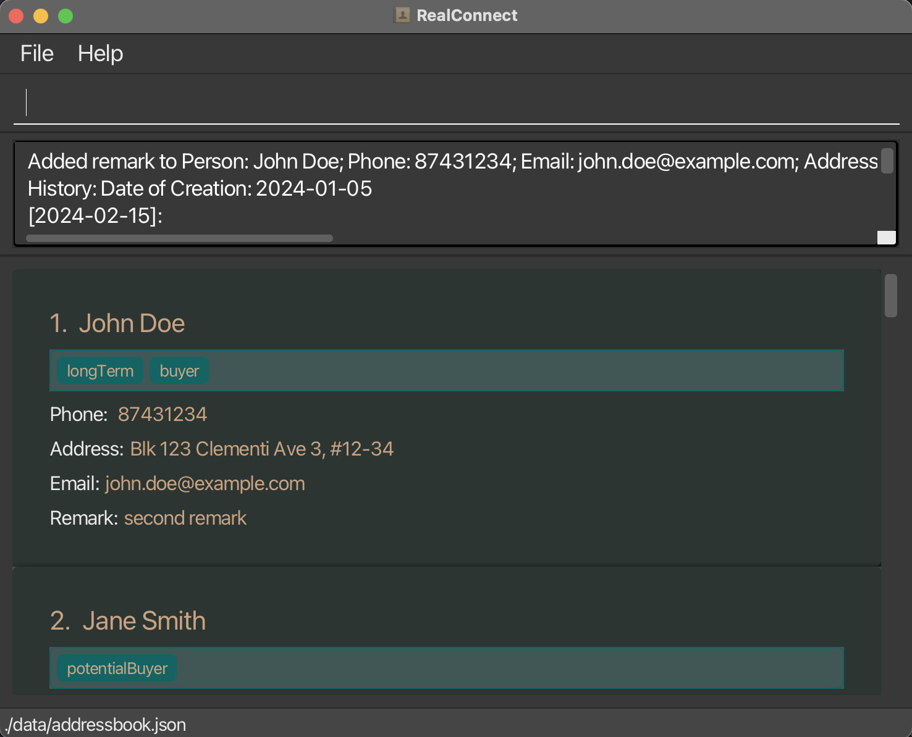

### Single page person view: `view`

Shows all the information related to a contact on a single page.

Format: `view INDEX`

* The search is based on the most updated contact list.
* Opening a new window will automatically close the previously opened window.
* Shows the person at the specified `INDEX`. The index refers to the index number shown in the displayed person list. The index **must be a positive integer** 1, 2, 3, …​

Examples:
*   `view 1` Shows the person located as index position 1 in the address book.
    

> ###### ⚠️ **Warning**
> The view window is optimized as a pop-up, hence while there is no limit to word entries, multiple long entries (i.e., above 50 characters) may be truncated.

### Adding a Property: `addProperty`

Add a property listing to an existing person in the address book.

Format: `addProperty INDEX address/ADDRESS town/TOWN type/TYPE size/SIZE bed/NUMBER_OF_BEDROOMS bath/NUMBER_OF_BATHROOMS price/PRICE`

* Add a property to the person at the specified `INDEX`. The index refers to the index number shown in the displayed person list. The index **must be a positive integer** 1, 2, 3, …​, and cannot exceed the number of persons in the address book.
* The property details include the address, town, property type, size, number of bedrooms, number of bathrooms, and price. All fields are required.
* Size is in square meters.

Examples:
* `addProperty 1 address/123 Main St town/Springfield type/Condo size/85 bed/2 bath/2 price/500000` adds a property with the specified details to the 1st person in the list.
* `addProperty 2 address/45 Elm St town/Anytown type/HDB size/70 bed/3 bath/1 price/350000` adds a property to the 2nd person in the list.

### Closing single page person view: `close`

Closes the UI page that shows the information of the person.

Format: `close`

* This will close the last opened window.

Examples:
*   `close` Will close the window that is currently open, and do nothing if there is no window open.

### Locating persons by name: `find`

Finds persons whose names contain any of the given keywords.

**Command Format:**
`find KEYWORD [ADDITIONAL_KEYWORDS]`

- The search is case-insensitive. e.g `hans` will match `Hans`
- The order of the keywords does not matter. For example, `Hans Bo` will match `Bo Hans`
- Only the name is searched.
- Only **full words** will be matched e.g. `Han` will not match `Hans`
- Persons matching at least one keyword will be returned (i.e., an `OR` search).
  For example, `Hans Bo` will return `Hans Gruber`, `Bo Yang`

**Examples:**
- `find John` returns `john` and `John Doe`
  
- `find Amy go` returns `Amy Wee`, `William Go` 
  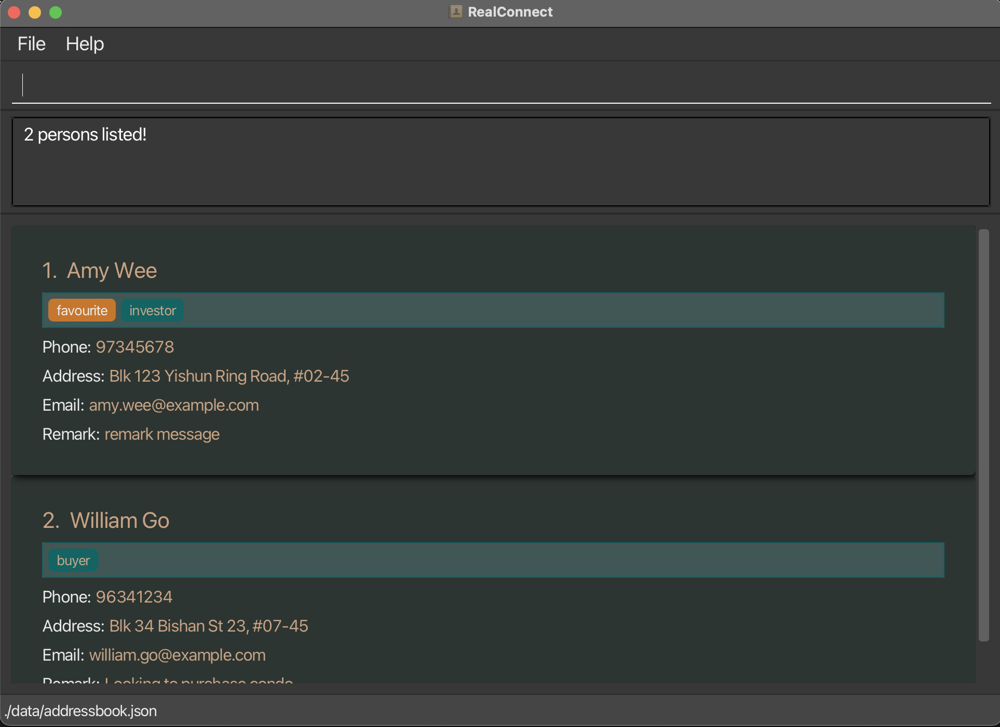

### Marking a person as favourite: `favourite`

Mark a specific person from the address book as favourite by assigning a special favourite tag.
Using this command on an already favourited person will remove the person from favourite 
by removing the special favourite tag.

Format: `favourite INDEX`

* Mark the person at the specified `INDEX` as favourite.
* If the person is already marked favourite, the person is removed from favourite.
* The index refers to the index number shown in the displayed person list.
* The index **must be a positive integer** 1, 2, 3, …​

Examples:
* `list` followed by `favourite 2` marks the 2nd person in the address book as favourite.
  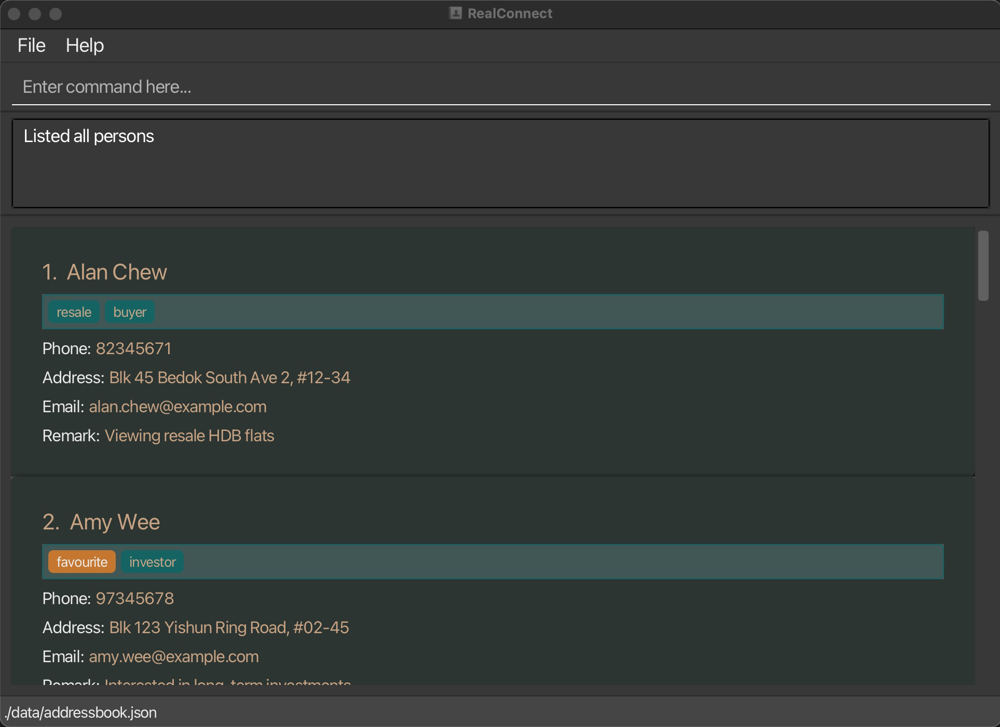

Format: `favourite`

* Bring all persons marked as favourite to the front.

Examples:
* `favourite` followed by `favourite 2` brings the previously 2nd person who has been marked to the front (1st).
  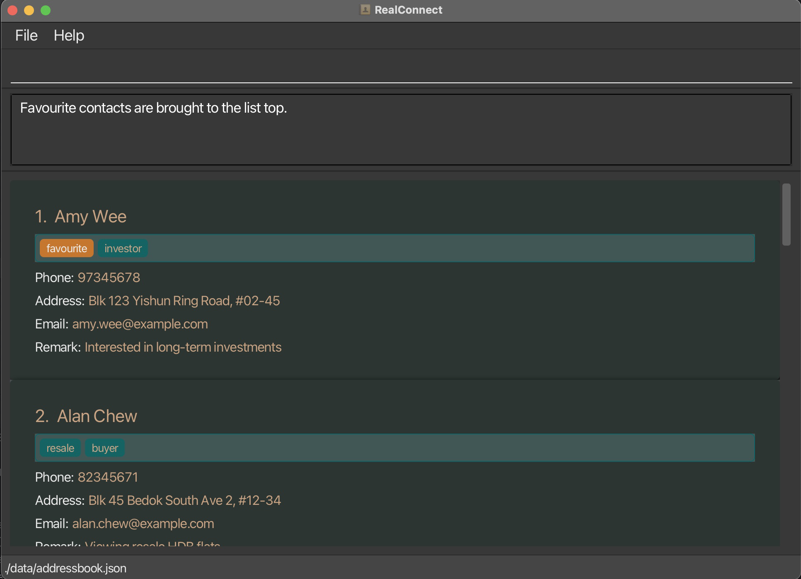

Examples:
* `favourite 1` when person at index 1 is already favourite.
  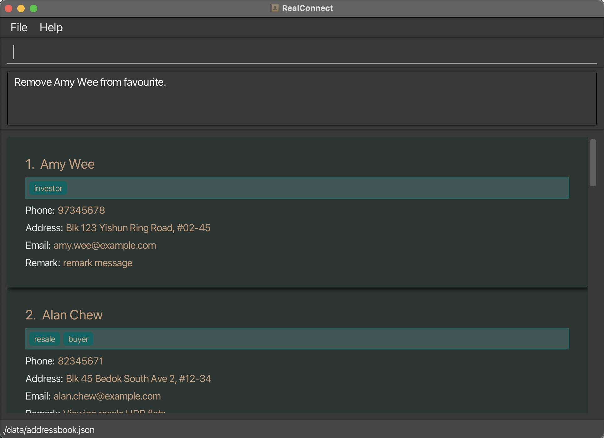

### Deleting a person : `delete`

Deletes the specified person from the address book.

**Command Format:**  
`delete INDEX`

- Deletes the person at the specified `INDEX`.
- The index refers to the index number shown in the displayed person list.
- The index **must be a positive integer** 1, 2, 3, …​

**Examples:**
- `list` followed by `delete 2` deletes the 2nd person in the address book.
- `find Betsy` followed by `delete 1` deletes the 1st person in the results of the `find` command.

### Clearing all entries : `clear`

Clears all entries from the address book.

**Command Format:**  
`clear`

### Exiting the program : `exit`

Exits the program.

**Command Format:**  
`exit`

### Saving the data

AddressBook data are saved in the hard disk automatically after any command that changes the data. There is no need to save manually.

### Editing the data file

AddressBook data are saved automatically as a JSON file `[JAR file location]/data/addressbook.json`. Advanced users are welcome to update data directly by editing that data file.

:exclamation: <strong>Caution:</strong>
If your changes to the data file makes its format invalid, AddressBook will discard all data and start with an empty data file at the next run. Hence, it is recommended to take a backup of the file before editing it. 
Furthermore, certain edits can cause the AddressBook to behave in unexpected ways (e.g., if a value entered is outside of the acceptable range). Therefore, edit the data file only if you are confident that you can update it correctly.

---

### Store Birthday of a Contact: `birthday`

Stores a contact’s birthday

**Command Format:**  
`birthday <ContactID> d/<Birthday Date>`

- `d/` The contact’s birthday `YYYY-MM-DD` format.

**Examples:**
- `birthday 123 d/1990-05-15`

---

### Birthday Reminder

Displays a contacts' birthday if they are happening within a week from the system's current date.
Note that the reminder is only shown when the application is launched,
any command feedback shown will clear the reminder. To view the reminder again restart the application.

**Command Format:**
None, as it is an automatic feature.

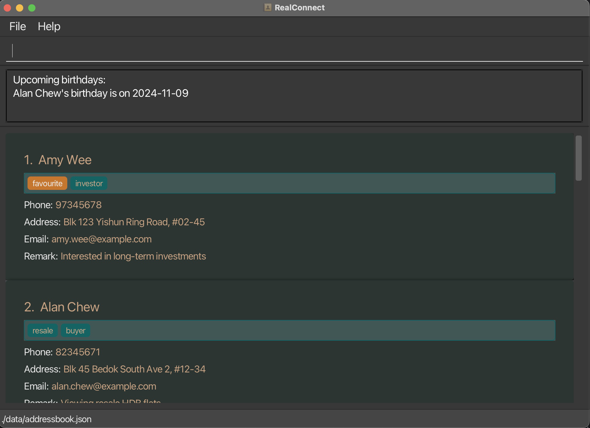

---

### Archiving data files `[coming in v2.0]`

_Details coming soon ..._

--------------------------------------------------------------------------------------------------------------------

## FAQ

**Q**: How do I transfer my data to another Computer? 
**A**: Install the app in the other computer and overwrite the empty data file it creates with the file that contains the data of your previous AddressBook home folder.

--------------------------------------------------------------------------------------------------------------------

## Known issues

1. **When using multiple screens**, if you move the application to a secondary screen, and later switch to using only the primary screen, the GUI will open off-screen. The remedy is to delete the `preferences.json` file created by the application before running the application again.
2. **If you minimize the Help Window** and then run the `help` command (or use the `Help` menu, or the keyboard shortcut `F1`) again, the original Help Window will remain minimized, and no new Help Window will appear. The remedy is to manually restore the minimized Help Window.

--------------------------------------------------------------------------------------------------------------------

## Parameter Requirements
| Paramter | Requirement                                                                                                                                                                                                                                                                                                                                                                                                                                                                                                                                                                           | Example                                                                              |
|----------|---------------------------------------------------------------------------------------------------------------------------------------------------------------------------------------------------------------------------------------------------------------------------------------------------------------------------------------------------------------------------------------------------------------------------------------------------------------------------------------------------------------------------------------------------------------------------------------|--------------------------------------------------------------------------------------|
| Name     | Only Alpha-numeric                                                                                                                                                                                                                                                                                                                                                                                                                                                                                                                                                                    | ❌ Shanmugam S/O Balakrishnan   ✅ Shanmugam Son of Balakrishnan ✅ Chris Paul 3 |
| Birthday | yyyy-mm-dd                                                                                                                                                                                                                                                                                                                                                                                                                                                                                                                                                                            | ❌ 2021/09/09  ❌ 09-09   ✅ 2021-09-09                                       |
| Log Date | yyyy-mm-dd                                                                                                                                                                                                                                                                                                                                                                                                                                                                                                                                                                            | ❌ 2021/09/09  ❌ 09-09   ✅ 2021-09-09                                       |
| Email    | local-part@domain The local-part should only contain alphanumeric characters and these special characters, excluding the parentheses, (+_.-). The local-part may not start or end with any special characters. This is followed by a '@' and then a domain name. The domain name is made up of domain labels separated by periods. The domain name must: end with a domain label at least 2 characters long; have each domain label start and end with alphanumeric characters; have each domain label consist of alphanumeric characters, separated only by hyphens, if any. | ❌ 1/@d10   ❌ hello@a.c ✅ 1@a.com ✅ ho@gmail.com                           |
| address  | No contraint (right-to-left scripts will be displayed left-to-right)                                                                                                                                                                                                                                                                                                                                                                                                                                                                                                                  | ✅ 123 Orchard  ✅ 乌节路 123 号  ✅ 123 بستان                                      |

--------------------------------------------------------------------------------------------------------------------
## Command summary

| Action                  | Format, Examples                                                                                                                                                         |
|-------------------------|--------------------------------------------------------------------------------------------------------------------------------------------------------------------------|
| **Add Contact**         | `add n/NAME p/PHONE_NUMBER e/EMAIL a/ADDRESS [b/BIRTHDAY] [r/REMARK] [t/TAG]`  e.g., `add n/John Doe p/98765432 e/johnd@example.com a/John street, block 123, #01-01` |
| **Clear All Contacts**  | `clear`                                                                                                                                                                  |
| **Delete Contact**      | `delete INDEX`  e.g., `delete 3`                                                                                                                                      |
| **Edit Contact**        | `edit INDEX [n/NAME] [p/PHONE] [e/EMAIL] [a/ADDRESS] [r/REMARK] [b/BIRTHDAY] [t/TAG]`  e.g., `edit 2 n/James Lee e/jameslee@example.com`                              |
| **Find Contacts**       | `find KEYWORD [MORE_KEYWORDS]`  e.g., `find John`                                                                                                                     |
| **List All Contacts**   | `list`                                                                                                                                                                   |
| **Help**                | `help`                                                                                                                                                                   |
| **Sort Contacts**       | `sort asc/desc`  e.g., `sort asc`                                                                                                                                     |
| **Log Interaction**     | `log INDEX [d/DATE] l/<InteractionDetails>`  e.g., `log 123 d/2024-09-16 l/Discussed property updates`                                                                |
| **Add/Edit Remark**     | `remark INDEX r/<remark message>`  e.g., `remark 1 r/Interested in waterfront property`                                                                               |
| **View Contact**        | `view INDEX`  e.g., `view 123`                                                                                                                                        |
| **Favourite Contact**   | `favourite INDEX`(on not favourited person)  e.g., `favourite 123`                                                                                                    |
| **Unfavourite Contact** | `favourite INDEX`(on already favourited person)   e.g., `favourite 123`                                                                                               |
| **Favourite Contact**   | `favourite`  e.g., `favourite`                                                                                                                                        |
| **Add/Edit Birthday**   | `birthday INDEX b/<yyyy-mm-dd>`  e.g., `birthday 1 r/2001-03-04`                                                                                                      |
