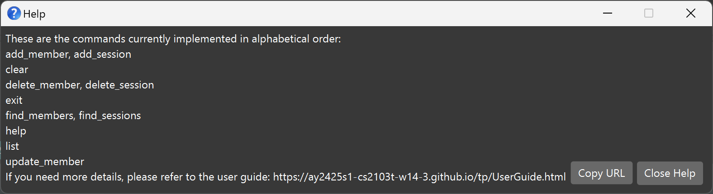

<!--
layout: default.md
title: "User Guide"
pageNav: 3

---

-->

# HallPointer User Guide

Welcome to HallPointer, your one-stop go-to tool as a leader for managing Co-Curricular Activity (CCA) members in a hall setting. This guide will help you get started with using HallPointer, so you can **easily keep track of member details, attendance, assigned points and more**—all without the hassle of traditional spreadsheets.

HallPointer is **crafted to prioritize simplicity and efficiency**. Whether you’re tracking member attendance, organizing contact details, or updating points, HallPointer’s mix of easy-to-use commands and real-time visual feedback makes usage simple and straightforward, even if you’re not a tech expert. Plus, built-in checks ensure accuracy, preventing you from wasting your precious time on hunting down data entry errors.

This guide will walk you through HallPointer’s main features and show you step-by-step how to use it effectively. By the end, you’ll know how to make the most of HallPointer’s tools, **saving time and allowing you to focus on what truly matters**—building a vibrant and engaged community.

---

## Table of Contents

- [Getting Started Quickly](#getting-started-quickly)
- [Command Summary](#command-summary)
- [Features](#features)
  - [Viewing Help](#viewing-help-help)
  - [Adding a Member](#adding-a-member)
  - [Listing All Members](#listing-all-members)
  - [Updating a Member](#updating-a-member)
  - [Locating Members by Name](#locating-members-by-name)
  - [Deleting a Member](#deleting-a-member)
  - [Adding a Session](#adding-a-session)
  - [Locating Members with Associated Sessions by Name](#locating-members-with-associated-sessions-by-name)
  - [Deleting a Session](#deleting-a-session)
  - [Clearing All Entries](#clearing-all-entries)
  - [Exiting the Program](#exiting-the-program)
  - [Saving the Data](#saving-the-data)
  - [Editing the Data File](#editing-the-data-file)
- [FAQ](#faq)
- [Known Issues](#known-issues)
- [Glossary](#glossary)

---

## Getting Started Quickly

1. **Make sure Java is installed:**\
Check that Java `17` or above is installed by opening a command terminal (Command Prompt for Windows, Terminal for macOS/Linux) and typing `java -version` before pressing Enter.\
If it is not installed, download and install the right one for your system by following the appropriate guide before continuing: [Windows](https://se-education.org/guides/tutorials/javaInstallationWindows.html), [macOS](https://se-education.org/guides/tutorials/javaInstallationMac.html), [Linux](https://se-education.org/guides/tutorials/javaInstallationLinux.html).

2. **Download the latest HallPointer application:**\
Download the most recent HallPointer `.jar` file from the release page [here](https://github.com/ay2425s1-cs2103t-w14-3/tp/releases/latest).

3. **Place the file in your desired folder:**\
Move the downloaded `.jar` file into the _home folder_ where you want to store your data. 

4. **Run HallPointer:**
- Open a command terminal, and use the `cd` command to navigate to the folder where you saved the `.jar` file.
- Type the following command and press Enter: `java -jar hallpointer.jar`
- A window should appear after a few seconds, showing the HallPointer app’s user interface (UI). Note that the app comes with some sample data to help you get started. 
   

5. **Explore the Sample Data:**
- Below the menu, you will see a **command box**. You can type commands in this box and press Enter to execute them.
- For example, typing `help` and pressing Enter will show a help window with instructions.\
Here are some example commands you can try:

   - `list` : Lists all members.
   - `add_member n/May Doe r/4-3-301 t/maydoe123 tag/logistics` : Adds a member named `May Doe` to HallPointer.
   - `delete_member 3` : Deletes the 3rd member shown in the current list.
   - `clear` : Deletes all members.
   - `exit` : Exits the app.

6. **Learn more about the commands:**\
Refer to the [Command Summary](#command-summary) section below for a quick overview of each command, and to the [Features](#features) section below for further details for each command.

<box type="tip" seamless>

**TIP:**
* If you’re unfamiliar with using the command terminal, fret not! [Here](https://www.git-tower.com/blog/command-line-cheat-sheet/) is a condensed cheat sheet for your reference.

</box>

---

## Command Summary

| Action             | Format / Examples                                                                                                                            |
| ------------------ |----------------------------------------------------------------------------------------------------------------------------------------------|
| **Add member**     | `add_member n/NAME r/ROOM_NUMBER t/TELEGRAM [tag/TAG]…​​`   e.g., `add_member n/James Ho r/4-3-301 t/jamesho123 tag/friend tag/colleague` |
| **Update member**  | `update_member INDEX [n/NAME] [r/ROOM_NUMBER] [t/TELEGRAM] [tag/TAG]…​`  e.g.,`update_member 2 n/James Lee r/5-2-203 t/jameslee99`        |
| **Delete member**  | `delete_member INDEX`  e.g., `delete_member 3`                                                                                            |
| **Add session**    | `add_session s/NAME d/DATE p/POINTS m/INDEX [m/INDEX]…​`   e.g., `add_session s/Rehearsal d/24 Oct 2024 p/2 m/1 m/3`                      |
| **Delete session** | `delete_session s/NAME m/INDEX [m/INDEX]…`  e.g., `delete_session s/Rehearsal m/1 m/3`                                                    |
| **Find members**   | `find_members KEYWORD [MORE_KEYWORDS]…`  e.g., `find_members James Jake`                                                                  |
| **Find sessions**  | `find_sessions KEYWORD [MORE_KEYWORDS]…`  e.g., `find_sessions Team meeting`                                                              |
| **List**           | `list`                                                                                                                                       |
| **Clear**          | `clear`                                                                                                                                      |
| **Help**           | `help`                                                                                                                                       |
| **Exit**           | `exit`                                                                                                                                       |

---

## Features

<box type="info" seamless>

**Understanding the Command Format:** 

- Words in `UPPER_CASE` are the placeholders you'll replace with your own input. 
  e.g., in `add_member n/NAME`, `NAME` can be replaced with `John Doe ` The full command will be `add_member n/John Doe`.
- Fields in `[square brackets]` are optional. You can choose to include them or leave them out. 
  e.g., `n/NAME [tag/TAG]` can be used as `n/John Doe tag/friend` or as `n/John Doe`.
- Fields with `…`​ after them can be used multiple times or not at all. 
  e.g., The field `[tag/TAG]…​` can be typed as ` ` (i.e., used 0 times and left out entirely), `tag/friend`, `tag/friend tag/family`, etc.
- Parameters can be in any order. 
  e.g., if the command specifies `n/NAME t/TELEGRAM`, `t/TELEGRAM n/NAME` is also acceptable.
- For commands that do not take in parameters (such as `help`, `list`, `exit`, and `clear`) , any extra information you typed after the command will be ignored. 
  e.g., if the command specifies `help 123`, it will be interpreted as `help`.
- If you are using a PDF version of this document, be careful when copying and pasting commands that span multiple lines, as space characters surrounding line-breaks may be omitted when copied over to the application.

</box>

---

### Viewing help : `help`

Displays  an alphabetical list of all available commands for quick and easy reference and a link to the user guide.

**Format:** `help`

**Example**
- `help` displays the help page 

### Adding a member:

Adds a member to HallPointer. A member must have a name, room assignment, and Telegram username. You can also add tags to help categorize members.

**Format:** `add_member n/NAME r/ROOM_NUMBER t/TELEGRAM_HANDLE [tag/TAG]…​​`

<box type="warning" seamless>

**Constraints:** 

- **Unique Name**: Each member must have a unique name. This is necessary to prevent confusion between members and to ensure accurate tracking. 
- **Unique Telegram Username**: Each member must have a unique Telegram username, as telegram account is personal and each username can only be used by one person at a time.
- **Room Number**: `ROOM_NUMBER` should be in the format `BLOCK-FLOOR-ROOM` and each field should be numeric.
- **Shared Rooms Allowed**: Multiple members can be assigned to the same room to accommodate shared living arrangements.

</box>
<box type="tip" seamless>

**Tips**
- A member can have any number of tags (including 0).
- If you have multiple members with the same name, consider adding a distinguishing initial or number (e.g. "Daniel L", "Daniel 2").

</box>

**Examples:**

- `add_member n/John Doe r/4-3-301 t/johndoe123` adds a member with name `John Doe` in room `4-3-301` and Telegram username `johndoe123`.
- `add_member n/Betsy Crowe d/o Alice Crowe r/2-5-120 t/betsy_crowe tag/logistics` adds a member with name `Betsy Crowe d/o Alice Crowe` in room `2-5-120`, Telegram username `betsy_crowe`, and tag `logistics`.
 

---

### Listing all members:

Shows a list of all members registered in HallPointer.

**Format:** `list`

**Example:**
- `list` shows all members in HallPointer.

---

### Updating a member: 

Updates an existing member in HallPointer.

**Format:** `update_member INDEX [n/NAME] [r/ROOM_NUMBER] [t/TELEGRAM_HANDLE] [tag/TAG]…​​`

**Constraints:**

- **Unique Name**: Each member must still have a unique name after updating.
- **Unique Telegram Username**: Each member must still have a unique Telegram username after updating.

<box type="tip" seamless>

**Tips:** 
- At least one of the optional fields must be provided. Existing values will be updated to the input values.
- Updates the member at the specified `INDEX`. The index refers to the index number shown in the displayed member list. The index **must be a positive integer** 1, 2, 3, …​.
- When updating tags, the existing tags of the member will be removed; i.e., adding of tags is not cumulative.
- You can remove all the member’s tags by typing `tag/` without specifying any tags after it.

</box>

**Examples:**

- `update_member 1 t/johndoe123_updated n/Johnson Doe` updates the Telegram username and name of the 1st member to be `johndoe123_updated` and `Johnson Doe`, respectively.
- `update_member 2 n/Betsy Crower tag/` updates the name of the 2nd member to be `Betsy Crower` and clears all existing tags.
- `update_member 2 tag/Friend tag/Leader` updates the tags of the 2nd member to `Friend` and `Leader`.

---

### Locating members by name:

Finds members whose names contain any of the given keywords.

**Format:** `find_members KEYWORD [MORE_KEYWORDS]…`

**Constraints**
- **Case-Insensitive Search**: The search is case-insensitive, so `hans` will match `Hans`.
- **Order of Keywords**: The order of the keywords does not matter, so `Hans Bo` will match both `Bo Hans` and `Hans Bo`.
- **Full Word Matching**: Only full words will be matched, so `Han` will not match `Hans`.
- **OR Search**: Members matching at least one keyword will be returned, using an OR search. For example, `Hans Bo` will return both `Hans Gruber` and `Bo Yang`.

<box type="info" seamless>

**Note:** The `find_members` command does not stack filters. Each use of `find_members` filters the **original full list** rather than further filtering any previously filtered list.

</box>

**Examples:**

- `find_members John` returns `john` and `John Doe`
- `find_members alex david` returns `Alex Yeoh` and `David Li` 

  

---

### Deleting a member:

Deletes the specified member from HallPointer.

**Format:** `delete_member INDEX`

<box type="warning" seamless>

**Note:** The index refers to the index number shown in the displayed member list and **must be a positive integer** (1, 2, 3, …​).

</box>

**Examples:**

- `list` followed by `delete_member 2` deletes the 2nd member in HallPointer.
- `find_members Betsy` followed by `delete_member 1` deletes the 1st member in the results of the `find` command.

---

### Adding a Session:

Adds a session to HallPointer and associates it with specified members. A session contains a name, date, and points awarded to each member attending the session. You can add multiple members to a session.

**Format:** `add_session s/NAME d/DATE p/POINTS m/INDEX [m/INDEX]…`

**Constraints:** 
- **Points** should be an integer between 0 and 100 inclusive. A maximum of 100 points can be awarded to any session.
- **Duplicate Session** You cannot add a session to a member if the member already attended a session with the same name
- **Unique Session Name**: Each session name must be unique within a member. This ensures that each session is distinct and prevents duplicate records.

<box type="tip" seamless>

**Tips:** 
- **Multiple members** If you have multiple members attending the session, you can add them sequentially by specifying their indexes.
- **Duplicate Session** If you wish to add multiple sessions with the same name to a member, consider adding a unique identifier to the session name (e.g., "Rehearsal 1", "Rehearsal 2").

</box>

**Examples:**

- `list` followed by `add_session s/Rehearsal d/24 Oct 2024 p/2 m/1 m/3` adds a session named "Rehearsal" on 24 Oct 2024 worth 2 points, associated with the members at indexes 1 and 3 in the displayed list.

---

### Locating Members with Associated Sessions by Name:

This command finds members who have attended sessions with names that contain any of the specified keywords.

**Format:** `find_sessions KEYWORD [MORE_KEYWORDS]…`

**Constraints:**
- **Case-Insensitive Search:** The search is case-insensitive. For example, `meeting` will match `Meeting`.
- **Order of Keywords:** The order of keywords does not affect the search results. For example, `AGM meeting` will match sessions with names containing either `AGM` or `meeting`.
- **Full Word Matching:** Only full words are matched; e.g., `team` will not match `tea`.
- **OR Search:** Members with sessions that match at least one keyword will be returned. For example, `find_sessions AGM meeting` will return members with sessions named `AGM meeting` or `team meeting`.
- **Independence from Displayed Members:** The search includes all members registered in HallPointer, not just those currently displayed.

**Examples:**

- `find_sessions Team` – Returns any member associated with sessions named "Team meeting," "Team bonding," etc.
- `find_sessions AGM meeting` – Returns members associated with sessions such as "AGM meeting" or "team meeting."

---

### Deleting a Session:

Deletes a session associated with one or more members in HallPointer.

**Format:** `delete_session s/NAME m/INDEX [m/INDEX]…`

**Constraints:**
- **Case-Insensitive Search:** The search is case-insensitive. For example, `meeting` will match `Meeting`.

**Examples:**

- `list` followed by `delete_session s/Rehearsal m/1 m/3` Deletes the session named "Rehearsal" for the members at indexes 1 and 3 in the displayed list.

---

### Clearing all entries:

Clears all entries from HallPointer.

**Format:** `clear`

---

### Exiting the program:

Exits the program.

**Format:** `exit`

---

### Saving the data

Data is saved in the hard disk automatically after any command that changes the data. There is no need to save manually.

---

### Editing the data file

HallPointer data is saved automatically as a JSON file at `[JAR file location]/data/hallpointer.json`. Advanced users are welcome to update data directly by editing that data file. 

<box type="warning" seamless>

**Caution:** If your changes to the data file make its format invalid, HallPointer will discard all data and start with an empty data file at the next run. It is recommended to back up the file before editing it.

</box>

---

## FAQ

**Q**: How do I transfer my data to another computer? 
**A**: Install the app on the other computer and overwrite the empty data file it creates with the file that contains the data from your previous HallPointer home folder.

---

## Known Issues

1. **Integer Overflow Limitation**: HallPointer does not handle integer overflow, which could lead to incorrect data behavior if extremely large numbers are used (e.g., points or room numbers that exceed typical ranges). Users are advised to avoid excessively high values as this may disrupt the app’s functionality. While unlikely in standard use, such inputs could be considered abnormal or potentially malicious.

2. **Multiple Screens Issue**: If you move the application to a secondary screen and later switch to using only the primary screen, the GUI may open off-screen. The remedy is to delete the `preferences.json` file created by the application before running the application again.

3. **Help Window Minimization**: If you minimize the Help Window and then run the `help` command again, the original Help Window will remain minimized, and no new Help Window will appear. The remedy is to manually restore the minimized Help Window.

---

## Glossary

**Graphical User Interface (GUI)**  
A visual interface that allows users to interact with the application using graphical elements like buttons and icons instead of text commands.

**Command Terminal**  
Where you enter commands to run the HallPointer application (e.g., Command Prompt on Windows, Terminal on macOS/Linux).

**Tag**  
A label to categorize members (e.g., "logistics," "captain").

**Session**  
An event or activity for members (e.g., "Rehearsal") with points awarded for attendance.

**JSON File**  
The file where HallPointer saves your data automatically (`hallpointer.json`).

**Points**  
Scores awarded to members for attending sessions.

**Telegram Handle**  
The unique Telegram username for each member.
