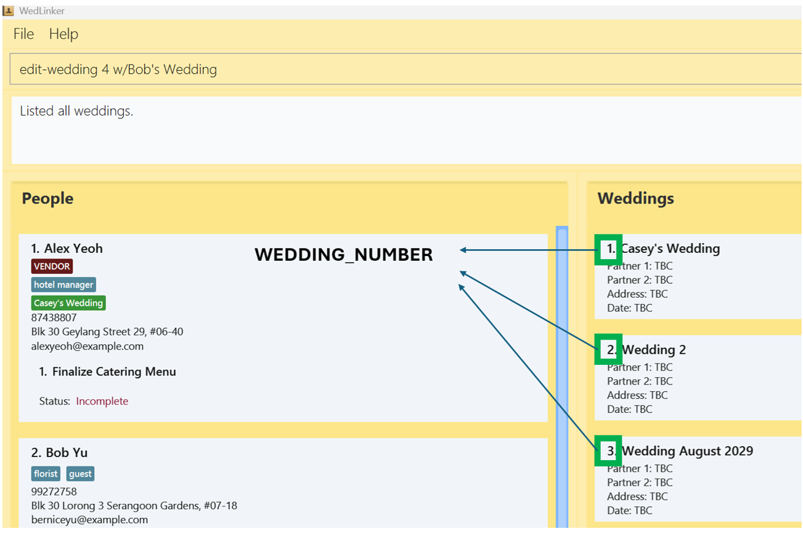

<button id="toggleButton" onclick="toggleAllDetails()">Expand All</button>


<div style="display: flex; justify-content: center; align-items: center;">
<span class="parisienne-regular" style="font-size: 3em; font-weight: bold;">
  WedLinker User Guide
</span>
</div>

**What is WedLinker?**<br>
WedLinker is an essential desktop app tailored to the needs of professional wedding planners who need to efficiently manage every aspect of a wedding. From organising wedding-related contacts to tracking tasks assigned to vendors, WedLinker consolidates all the tools you need into one streamlined platform. <br><br>

Designed with the unique demands of wedding planners in mind, WedLinker helps you:
* Organise and manage contacts, including vendors, clients and guests.
* Track wedding details, including the date, address and partners of each wedding.
* Consolidate and track vendor tasks, ensuring no task is left incomplete.

With WedLinker, you can stay on top of multiple weddings at once, reduce administrative workload, and ensure that no detail is overlooked.
Tailored to your needs, WedLinker simplifies complex workflows so you can focus on delivering flawless, stress-free wedding experiences for your clients.
<br>

**Why Choose WedLinker?**<br>
While WedLinker excels with its fast Command-Line Interface (CLI), it also offers a clear and intuitive Graphical User Interface (GUI). The GUI presents your contacts, weddings, and tasks in an organised layout, making it easy to view and manage them at a glance. <br><br>
This combination of speed and clarity allows you to manage your wedding planning tasks efficiently and with precision.
<br>


<!-- * Table of Contents -->
<page-nav-print />

--------------------------------------------------------------------------------------------------------------------
## Quick start

1. Before you can run this app, you need to have `Java 17` or above installed on your computer. Follow the simple steps below to check if you already have `Java 17` installed, or to install it if you do not:

   1.1. Open your operating system's terminal. If you are unsure how to open the terminal, follow the steps below:
      <details>
        <summary><strong>Windows:</strong></summary>
        <ol>
          <li>Hold down Windows button and R (⊞ Win + R)</li>
          <li>Type <code>cmd</code> and press enter</li>
        </ol>
      </details>
   <br>
      <details>
        <summary><strong>MacOS:</strong></summary>
        <ul>
          <li>Click the Launchpad icon in the Dock, type <code>Terminal</code> in the search field, then click Terminal, OR</li>
          <li>In the Finder, open the <code>/Applications/Utilities</code> folder, then double-click Terminal.</li>
        </ul>
      </details>
    <br>

   1.2. Type <code>java -version</code> and press enter.

   1.3. If you have `Java 17` installed, the terminal should look like:
      ```
        C:\Users\UserName>java -version
        java version "17.0.12" 2024-07-16 LTS
        Java(TM) SE Runtime Environment (build 17.0.12+8-LTS-286)
        Java HotSpot(TM) 64-Bit Server VM (build 17.0.12+8-LTS-286, mixed mode, sharing)
      ```

<br>

2. If you have `Java 17` installed, proceed to Step 3. If not, follow these instructions:

    2.1. Download `Java 17` from [here](https://www.oracle.com/java/technologies/javase/jdk17-archive-downloads.html).
   
    2.2. Select the installation package based on your Operating System.
   
    2.3. Follow the instruction guide to install Java on your device. For more information, click [here](https://docs.oracle.com/en/java/javase/23/install/overview-jdk-installation.html).

<br>

3. Download the latest version of WedLinker from [here](https://github.com/AY2425S1-CS2103T-F15-4/tp/releases/). Select `WedLinker.jar` to begin the download.
   

<br>

4. Copy the file to the folder you want to use as the _home folder_ for your WedLinker. Note: This will create extra folders required for WedLinker in your _home folder_.

<br>

5. Open WedLinker by double-clicking the program file, `WedLinker.jar`.<br>
   A GUI similar to the image below should appear in a few seconds. Note how the app contains some sample data.<br><br>
   

<br>

6. Type a command in the command box and press Enter to execute it. For example, typing **`help`** and pressing Enter will open the help window.<br>
   Some example commands you can try:

   * `list` : Lists all contacts.

   * `add n/John Doe p/98765432 e/johnd@example.com a/ABC Photography Studio` : Adds a contact named John Doe to WedLinker with the phone number 98765432, email address johnd@example.com, and address ABC Photography Studio.

   * `delete 3` : Deletes the 3rd contact shown in the current list.

   * `clear` : Deletes all contacts.

   * `exit` : Exits the app.

<br>

7. Refer to the [Features](#features) below for details of each command.

--------------------------------------------------------------------------------------------------------------------

## Features

<box type="info" seamless>
  <details>
    <summary><strong>Notes about the command format:</strong></summary>

* Words in `UPPER_CASE` are the parameters to be supplied by the user.<br>
  For example: `add n/NAME`, `NAME` is a parameter which can be used as `add n/John Doe`.

* Items in square brackets are optional.<br>
  For example: `n/NAME [t/TAG_NAME]` can be used as `n/John Doe t/guest` or as `n/John Doe`.

* Items with `…`​ after them can be used multiple times.<br>
  For example: `[t/TAG_NAME]…​` can be: `t/guest`, `t/guest t/photographer` etc.

* Commands in WedLinker uses labels to specify the parameters, the labels are stated as such:
  * n/ Name
  * a/ Address
  * p/ Phone Number
  * e/ Email
  * t/ Tag
  * w/ Wedding
  * tk/ Task
  * d/ Date

  </details>
</box>


<box type="warning" seamless>
  <details open>

<summary><strong>Caution:</strong></summary>

* Extra inputs for commands that do not require them (such as `help`, `list`, `exit` and `clear`) will be ignored.<br>
  * For example: If the command specifies `help 123`, it will be interpreted as `help`.<br>

* Similarly, extra labels (e.g. n/ or tk/) for commands that do not take in those labels will be processed as part of other inputs.<br>
  * For example: When [adding a person](#adding-a-person), you can specify the labels `n/`, `p/`, `e/`, `a/`, `t/`, and `w/`. If the command specifies
  `add n/Betsy Crowe d/2020-04-11 tk/Buy flowers`, it will be interpreted as adding a person with the name "Betsy Crowe d/2020-04-11 tk/Buy flowers". <br>

* If you are using a PDF version of this document, be careful when copying and pasting commands that span multiple lines as space characters surrounding line-breaks may be omitted when copied over to the application.
  </details>
</box>

* You can speed up using WedLinker by using the shortcuts for various commands. For example, instead of typing in `assign-vendor 1`, you can type in `asv 1`. You can find the shortcuts for each command in their respective sections.

---
<br>

<h3 class="features">General Features</h3>

#### Viewing help

You can find the help page by entering the command `help`.


Format: `help`

<br>

#### Listing all Persons

You can see a list of all saved [Persons](#adding-a-person) in the WedLinker by entering the command `list`.

Format: `list`

<br>

#### Listing all Weddings

You can see a list of all [Weddings](#adding-a-wedding) in the WedLinker by entering the command `list-weddings`.

Format: `list-weddings` or `lw`

<br>

#### Listing all Tasks

You can see a list of all [Tasks](#creating-one-or-more-tasks) in the WedLinker by entering the command `list-tasks`.

Format: `list-tasks` or `ltasks`

<br>

#### Listing all Tags

You can see a list of all [Tags](#creating-a-tag) in the WedLinker by entering the command `list-tags`.

<br>

#### Clearing all entries

You can delete all the data from WedLinker by entering `clear`.

Format: `clear`

<box type="warning" seamless>

<details open>
<summary><strong>Caution:</strong></summary>
This action is irreversible and cannot be undone. Please ensure you have backed up any important information before proceeding.
</details>
</box>

<br>

#### Exiting the program

Exits the program.

Format: `exit`

<br>

#### Saving the data

WedLinker data is saved in your computer automatically. There is no need to save manually.

<br>

#### Editing the data file

WedLinker data is saved automatically as a JSON file `[JAR file location]/data/addressbook.json`. Advanced users are welcome to update data directly by editing that data file.

<box type="warning" seamless>

<details open>
<summary><strong>Caution:</strong></summary>
If your changes to the data file makes its format invalid, WedLinker will discard all data and start with an empty data file at the next run.  Hence, it is recommended to take a backup of the file before editing it.<br>
<br>
Furthermore, certain edits can cause the WedLinker to behave in unexpected ways (e.g. if a value entered is outside the acceptable range). Therefore, edit the data file only if you are confident that you can update it correctly.
</details>
</box>

---

<br>

<h3 class="features">Person Features</h3>

#### Adding a person

You can add a new contact to WedLinker by using the `add`.

Format: `add n/NAME [p/PHONE_NUMBER] [e/EMAIL] [a/ADDRESS] [t/TAG_NAME]…​ [w/WEDDING_NAME]…​`

If you want to add contact to WedLinker, type `add` followed by details such as the name, phone number, and email.

* **People in WedLinker cannot have the same names. `NAME` is case-insensitive.**
  * So, if `John Doe` is already in WedLinker, adding another `john doe` with different details will not work.
* If the `Tags` or `Weddings` specified in the add command do not exist yet, they will be created.


Examples:
* To add a contact named John Doe with a phone number of 98765432, email johnd@example.com, and address XYZ Floral Services, enter the command:
  * `add n/John Doe p/98765432 e/johnd@example.com a/XYZ Floral Services`
* To add a contact named Betsy Crowe with a phone number of 1234567, with tags Photographer and Guest, enter the command:
  * `add n/Betsy Crowe p/1234567 t/Photographer t/Guest`

<box type="tip" seamless>

<details>
<summary><strong>Tip:</strong></summary>

- Adding a person with `Tags` or `Weddings` that do not exist in WedLinker will create all the `Tags` and `Weddings`.
Created weddings will have the person automatically assigned to their guest lists. <br><br>
- A person can have any number of tags or weddings (including 0). <br><br>
- A person's name must contain only letters, numbers and certain special characters, which can be used to represent different naming conventions:
    - **Hyphen (-)**: Used for double-barrelled names, such as "Mary Doe-Smith".
    - **Slash (/)**: Used to store nicknames or alternative names, like "John/Jonny Doe".
    - **Period (.)**: Used to shorten names, such as "John D. Doe" or "Jane S.".
    - **Apostrophe (')**: Used in names like "O'Hare" or "O'Conner".
- A person's phone number should be at least 3 digits long.
- Emails should follow the format local-part@domain where the local-part contains only letters, numbers, and the following characters: + _ . -.
  Local-part cannot start or end with a special character. The domain consists of labels separated by periods, each starting and ending with a letter or number.
  Labels may include letters, numbers, and hyphens but cannot start or end with a hyphen. The final domain label must be at least 2 characters long.
</details>
</box>


<box type="warning" seamless>

<details open>
<summary><strong>Caution:</strong></summary>
<br>

- People with single or multiple spaces in their names are considered distinct and treated as separate people. For example:
    - <span class="preserve-whitespace">John Doe vs. John  Doe</span>
    - <span class="preserve-whitespace">TK/Tyler Kennedy vs. TK / Tyler - Kennedy</span><br><br>
- Extra labels in the add command will be processed as part of other inputs.<br>
  - For example: When adding a person, you can specify the labels `n/, p/, e/, a/, t/, and w/`. If the command specifies
    `add n/Betsy Crowe d/2020-04-11 tk/Buy place settings`, it will be interpreted as adding a person with the name `Betsy Crowe d/2020-04-11 tk/Buy place settings`

</details>
</box>

<br>

#### Editing a person

You can edit details of an existing person in WedLinker by using the `edit` command.

Format: `edit PERSON_NUMBER [n/NAME] [p/PHONE] [e/EMAIL] [a/ADDRESS]`

To edit the details of an existing contact in WedLinker, type `edit` followed by the positional number of the person in the contact list, and details you wish to update, such as the name, phone number, and email.

* The `PERSON_NUMBER` **must be a positive integer** 1, 2, 3, …​
* At least one of the optional fields must be provided.
* Existing details will be erased and updated to the details provided.

<div align="center">
  
</div>
<p align="center">
The PERSON_NUMBER corresponds to each person's position in the currently visible `Person` list. <br>
</p>

* In this example, the `PERSON_NUMBER` 2 refers to the person named "Bernice Yu", and the command `edit 2 n/Bob Yu` will change the contact's name from "Bernice Yu" to "Bob Yu".

Examples:
* To change the phone number of the first contact enter the command:  
  * `edit 1 p/91234567`.
  * This updates the contact's phone number to 91234567.
* To change the name and address of the second contact, enter the command:
  * `edit 2 n/Betsy Crower a/XYZ Flower Shop`.
  * This updates the contact's name to Betsy Crower and address to XYZ Flower Shop.

<br>

#### Deleting a person

You can remove a person from WedLinker by using the `delete` command.

Format: `delete PERSON_NUMBER`

To remove a contact from WedLinker, type `delete` followed by the positional number of the person in the contact list.

* The `PERSON_NUMBER` **must be a positive whole number** 1, 2, 3, …​

Examples:
* To delete the second contact in WedLinker:
  * First, list all contacts by entering the command: `list`, 
  * Then, enter the command: `delete 2`
* To delete the first contact found when searching for the name `Betsy`:
  * First, search for contacts with the name `Betsy` by entering the command: `find n/Betsy`
  * Then, enter the command: `delete 1` 

<br>

#### Searching people by any field

You can find all persons based on a search term after the label and display them as a list using the `find` command.

Format: `find n/NAME...` or `find p/PHONE...` or `find e/EMAIL...` or `find a/ADDRESS...` or `find t/TAG_NAME...` or `find w/WEDDING_NAME...` or `find tk/TASK_NAME...`

To search for a contact in WedLinker, type `find` followed by the label and search terms.

* The search is case-insensitive. For example: `hans` will match `Hans`.
* The label that corresponds to the field you want to search should be specified. For example: `find n/Alex` searches by name, `find e/alex@gmail.com` searches by email.
* The search term after the label must be specified and cannot be empty. For example: `find a/` is not allowed as the search term should be specified.
* The search will return partial matches and full matches. 
* Multiple search terms can be searched for the same field by placing each keyword after the appropriate label. For example: Searching for people whose phone number contains either 98 or 64, you can enter the command `find p/98 p/64`. 
This will return all contacts that have either 98 or 64 in their phone number.
* You can only specify one label to search at a time. For example, `find n/Alex a/` is not allowed as it searches for keywords in more than one field.
* The order of the keywords does not matter. e.g. `n/Hans n/Bo` will return the same contacts as `n/Bo n/Hans`.

Examples:
* `find p/973` returns all Contacts whose phone number contains 973
* `find n/alex n/david` returns `Alex Yeoh`, `David Li`<br>
* `find t/guests` returns all Contacts tagged with 'guests' <br>
* `find w/Casey's Wedding` returns all Contacts assigned to Casey's Wedding <br>
<div align="center">
  
</div>

---

<br>

<h3 class="features">Tag Features</h3>

#### Creating a tag

You can create tags for contacts within WedLinker by using the `create-tag` command.

Format: `create-tag t/TAG_NAME` or`ctag t/TAG_NAME`

To create a tag, type `create-tag` followed by the name of the tag.

* The `TAG_NAME` should contain letters, numbers and whitespaces.
* Tags are unique in WedLinker, there would not be any duplicated Tags.
* Multiple contacts can share the same tag.
* Tags are case-insensitive, so you cannot have both a 'hotel manager' and 'Hotel Manager' tag

Examples:
* To create a tag named `Florist`, enter the command:
    * `create-tag t/Florist`

<box type="warning" seamless>
<details open>
<summary><strong>Caution:</strong></summary>

- Tags with single or multiple spaces in their names are considered distinct and treated as separate tags. For example:
    - <span class="preserve-whitespace">Venue IC vs. Venue  IC</span>
- If you want to create a Tag with a long name, it might not be shown clearly in the list.<br>
We recommend keeping names of Tags to a maximum of 50 characters long.<br>
You can use [list-tags](#listing-all-tags) instead for better visuals.

</details>
</box>

<br>

#### Assigning tag to contact

You can assign a tag to a specific person in WedLinker by using the `tag` command.

Format: `tag PERSON_NUMBER t/TAG_NAME... [f/]`

To assign a tag to a contact, type `tag` followed by the positional number of the person in the contact list and the name of the tag.

* The `PERSON_NUMBER` **must be a positive integer** 1, 2, 3, …​.
* The `Tag` must exist in WedLinker before it can be assigned.
* If the `Tag` does not exist, you can use the label `f/` to force the creation and assignment of the `Tag`.

Examples:
* To assign an existing tag named `Florist` to the first person in the list, enter the command:
    * `tag 1 t/Florist`
* To assign a new tag named `Musician` (that doesn't currently exist) to the second person in the list, enter the command:
    * `tag 2 t/Musician f/`


<box type="tip" seamless>

To see all current tags, use the [list-tags](#listing-all-tags) command
</box>

<box type="warning" seamless>
<details open>
<summary><strong>Caution:</strong></summary>
<br>

- Force-tagging a person with extra input will cause those extra inputs to be ignored. For example:
    - `tag 1 f/ RandomWord t/Tag1` will cause `RandomWord` to be ignored.
</details>
</box>

<br>

#### Unassigning tag from contacts

You can remove a tag from a specific person in WedLinker by using the `untag` command.

Format: `untag PERSON_NUMBER t/TAG_NAME...`

To remove a tag from a contact, type `untag` followed by the positional number of the person in the contact list and the name of the tag.

* The `PERSON_NUMBER` **must be a positive integer** 1, 2, 3, …​.
* `TAG_NAME` is case-sensitive unlike other tag commands so if person 2 is tagged with the tag Hotel Manager, only entering the command `untag 2 t/Hotel Manager`
  will remove the tag from person 2 and `untag 2 t/hotel manager` will not.

Examples:
* To remove the tag named `Florist` from the first person in the list, enter the command:
    * `untag 1 t/Florist`

<br>

#### Deleting a tag

You can delete a tag you no longer use in WedLinker by using the `delete-tag` command.

Format: `delete-tag t/TAG_NAME [f/]` or `dtag t/TAG_NAME [f/]`

To delete a tag from WedLinker, type `delete-tag` followed by the name of the tag

* `TAG_NAME` is case-insensitive.
* The `Tag` must exist in WedLinker.
* The `Tag` cannot be assigned to any contacts after it is deleted.
* If the `Tag` is currently in use, you can use `f/` to force its deletion and remove the tag from all contacts.

Examples:
* To delete the tag named `Florist` from WedLinker, enter the command:
    * `delete-tag t/Florist`

---
<br>

<h3 class="features">Wedding Features</h3>

#### Adding a Wedding

You can create a Wedding within WedLinker that can be linked to contacts by using the `create-wedding` command.

Format: `create-wedding w/WEDDING_NAME` or `cw w/WEDDING_NAME`

To create a `Wedding`, type `create-wedding` followed by the name of the wedding.

* The `WEDDING_NAME` should only contain letters, numbers, spaces or the following characters: / . , ' & : ( )
* `WEDDING_NAME` is case-insensitive.
* Weddings are unique in WedLinker, there would not be any duplicated Weddings.

Examples:
* To create a Wedding named `Wedding 1`, enter the command:
    * `create-wedding w/Wedding 1`

<box type="warning" seamless>
<details open>
<summary><strong>Caution:</strong></summary>
<br>

- Weddings with single or multiple spaces in their names are considered distinct and treated as separate weddings. For example:
    - <span class="preserve-whitespace">O'Hare's Wedding vs. O'Hare's  Wedding</span>
- If you want to create a Wedding with a long name, it might not be shown clearly in the list.</br>
We recommend keeping names of Weddings to a maximum of 50 characters long.</br>
You can use [list-weddings](#listing-all-weddings) instead for better visuals.
</details>
</box>

<br>

#### Assigning contact to one or more Weddings

You can assign a person to one or more Weddings by using the `assign-wedding` command.

Format: `assign-wedding PERSON_NUMBER w/WEDDING_NAME…​ [p1/] [p2/] [f/]` or `asw PERSON_NUMBER w/WEDDING_NAME…​ [p1/] [p2/] [f/]`

To assign a person to one or more `Weddings`, type `assign-wedding`, followed by the positional number of the person in the person list and the name(s) of the wedding(s).

* `WEDDING_NAME` is case-insensitive.
* The `PERSON_NUMBER` **must be a positive integer** 1, 2, 3, …​.
* The `Wedding` must exists in WedLinker before it can be assigned.
* If the `Wedding` does not exist, you can use `f/` to force its creation and assignment to the contact.
* Assigning with the optional `p1/` or `p2/` keywords will set that contact as Partner 1 or Partner 2 of the wedding respectively.
* When you use this function with both `p1/` and `p2/`, WedLinker will default to assigning the person as the first partner.

Examples:
* To assign the Wedding named `Wedding 1` to the third person in the contact list, enter the command:
    * `assign-wedding 3 w/Wedding 1`
* To assign the Weddings named Wedding 3 to the second person as the first partner in the wedding, and the wedding Amanda's Wedding to the second person as a guest, enter the command:
    * `assign-wedding 2 w/Wedding 3 p1/ w/Amanda's Wedding`

<br>

#### Editing Wedding details

You can edit details of a Wedding, such as the Wedding name and Address by using the `edit-wedding` command.

Format: `edit-wedding WEDDING_NUMBER [a/ADDRESS] [d/DATE]` or `ew WEDDING_NUMBER [a/ADDRESS] [d/DATE]`

To edit the details of a `Wedding`, enter the command [list-weddings](#listing-all-weddings) to identify the Wedding number in the `Wedding` list. <br>
Following that, type "edit-wedding" followed by the Wedding number and the details you wish to edit.

* The WEDDING_NUMBER **must be a positive integer** 1, 2, 3, …​.
* Existing values in the specified fields will be overwritten with the specified values.
* Date must be in "YYYY-MM-DD" format.

Examples:
<br>
<div align="center">
  
</div>
<p align="center">
The WEDDING_NUMBER corresponds to each Wedding's position in the `Wedding` list
</p>

* In this example, the `WEDDING_NUMBER` 2 refers to the Wedding named "Wedding 2", and the command `edit-wedding 2 w/Bob's Wedding` will change the Wedding name from "Wedding 2" to "Bob's Wedding".

* To edit the address of the Wedding named `Wedding!`, to XYZ street:
    * First, identify the Wedding number by entering the command: `list-weddings`
    * Should the Wedding number of `Wedding!` be 1, enter the command: `edit-wedding 1 a/XYZ street`. If the Wedding number is different, simply replace the 1 in the command with the corresponding Wedding positional number.

<br>

#### Unassigning contacts from a Wedding

You can remove a person from one or more Weddings using the `unassign-wedding` command.

Format: `unassign-wedding PERSON_NUMBER w/WEDDING_NAME...` or `uw PERSON_NUMBER w/WEDDING_NAME...`

To remove a contact from one or more `Weddings`, type "unassign-wedding", followed by the positional number of the person in the contact list and the name(s) of the wedding(s).

* `WEDDING_NAME` is case-sensitive unlike other Wedding commands.
* The `PERSON_NUMBER` **must be a positive integer** 1, 2, 3, …​.
* Unassign-wedding command is case-sensitive, so if person 2 is assigned to the wedding, Wedding 2, only entering the command `unassign-wedding 2 w/Wedding 2` or `uw 2 w/Wedding 2`
  will unassign the wedding from person 2 and `unassign-wedding 2 w/wedding 2` or `uw 2 w/wedding 2` will not.

Examples:
* To remove the second person in the list from the Wedding named `Wedding 1`, enter the command:
    * `unassign-wedding 2 w/Wedding 1`

<br>

#### Deleting a Wedding

You can delete a Wedding from WedLinker by using the `delete-wedding` command.

Format: `delete-wedding w/WEDDING_NAME [f/]` or `dw w/WEDDING_NAME [f/]`

To delete a `Wedding`, type "delete-wedding", followed by the name of the wedding.

* There should be no contacts assigned to the `Wedding` before it is deleted.
* If there are still contacts assigned to the `Wedding`, you can use `f/` to force the deletion of the `Wedding`. This will un-assign all contacts from that `Wedding`. The `Wedding` will also be removed from all contacts who were previously assigned to it."

Examples:
* To delete the wedding named `Wedding 1`, enter the command:
    * `delete-wedding w/Wedding 1`

**Known issue:** the `unassign-wedding` command is case-sensitive, so if person 2 is assigned to the wedding, Wedding 2, only entering the command `unassign-wedding 2 w/Wedding 2` or `uw 2 w/Wedding 2`
will unassign the wedding from person 2 and `unassign-wedding 2 w/wedding 2` or `uw 2 w/wedding 2` will not.

---
<br>

<h3 class="features">Task Features</h3>

#### Creating one or more Tasks

You can create one or more Tasks by using the `create-task` command.

Format: `create-task tk/TASK_DESCRIPTION [d/DATE] [d/DATE] ...` or `ctask tk/TASK_DESCRIPTION [d/DATE] [d/DATE] ...`

To create a `task`, type `create-task` followed by the description of the task. <br>
You can also include up to two dates if needed, with a single date indicating a deadline and two dates to define a start and end period.

* `TASK_DESCRIPTION` is case-sensitive.
* The dates must be specified with the format `d/YYYY-MM-DD`
* Tasks are unique in WedLinker, there would not be any duplicated tasks.
* You can assign tasks to a contact using the [assign-task](#assigning-a-task-to-a-contact) command.

Examples:
* To create two tasks with the descriptions `Buy cake` and `Book venue`, enter the command:
    * `create-task tk/Buy cake tk/Book venue`
* To create a task with the description of `Finalise itinerary` with a specified deadline of `2024-12-22`, enter the command:
    * `create-task tk/Finalise itinerary d/2024-12-22`

<box type="warning" seamless>

<details open>
<summary><strong>Caution:</strong></summary>
<br>

- Tasks with single or multiple spaces in their names are considered distinct and treated as separate tasks. For example:
    - <span class="preserve-whitespace">Send invitations vs. Send  invitations</span>
</details>
</box>

#### Assigning a Task to a contact

You can assign one or more Tasks to a Person using the `assign-task` command.

Format: `assign-task PERSON_NUMBER TASK_NUMBER...` or `atask PERSON_NUMBER TASK_NUMBER...`

To assign Task(s) to a contact, enter the command [list-tasks](#listing-all-tasks) to identify the Task number in the `Task` list. <br>
Following that, type "assign-task" followed by assigned person's positional number and the Task number(s) of Tasks you wish to assign to the person.

The `PERSON_NUMBER` and `TASK_NUMBER` **must be positive integers** 1, 2, 3, …​.
The `PERSON_NUMBER` and `TASK_NUMBER` refer to the number of the `Person` in the person list and the number of the `Task` in the task list, respectively.

<div align="center">
  
</div>
<p align="center">
The TASK_NUMBER corresponds to each Task's position in the `Task` list
</p>

* In this example, the `TASK_NUMBER` 2 refers to the Task with the description "Send invitations", and the command `assign-task 1 2` will assign the "Send invitations" task to the contact with `PERSON_NUMBER` 1, which is "Alex Yeoh".

* Examples:
  * To assign two Tasks with the descriptions `Buy cake` and `Finalise itinerary`:
    1. Enter the command `list` to see all Persons and `list-task` to see all Tasks.
    2. Secondly, identify the positional number of the Person you wish to assign Tasks to
    3. Thirdly, identify the Task numbers of the two Tasks you wish to assign.
    4. Lastly, should the Person number be 1, and the Task numbers are 2 and 3, enter the command: `assign-task 1 2 3`

<br>

#### Unassigning a Task from a contact

You can unassign one or more Task from a Person using the `unassign-task` command.

Format: `unassign-task PERSON_NUMBER PERSON_TASK_NUMBER...` or `unatask PERSON_NUMBER PERSON_TASK_NUMBER...`

To remove a Task from a contact, type `unassign-task` followed by the positional number of the Person and the Person's Task number(s).

* The `PERSON_TASK_NUMBER` here refers to the Task's position within a Person's assigned tasks, not the TASK_NUMBER in `list-task`.
* The `PERSON_NUMBER` and `PERSON_TASK_NUMBER` **must be positive integers** 1, 2, 3, …​.

<div align="center">
  
</div>
<p align="center">
The PERSON_TASK_NUMBER corresponds to each Task's position within a Person's assigned tasks.
</p>

* In this example, the PERSON_TASK_NUMBER 3 for the first Person refers to the Task with the description "Send invitations", and the command `unassign-task 1 3` will remove the "Send invitations" Task from the Person with `PERSON_NUMBER` 1, which is "Alex Yeoh".

Examples:
* To remove the tasks with the descriptions `Buy cake` and `Finalise itinerary` from the first person in the contact list:
    * First, identify the assigned Task numbers of the two tasks assigned to the person
    * Should the assigned Task numbers be 2 and 3, enter the command: `unassign-task 1 2 3`

<br>

#### Marking a task as completed

You can mark one or more Tasks as completed by using the `mark-task` command.

Format: `mark-task TASK_NUMBER...` or `mtask TASK_NUMBER...`

To mark a `task` to be completed, enter the command [list-tasks](#listing-all-tasks) to identify the Task number(s) of task(s) you wish to mark. <br>
Following that, type `mark-task` followed by the Task number(s).

* Marks a `Task` as completed.
* The TASK_NUMBER correspond to the index of the task when in the [list-tasks](#listing-all-tasks) view.
* The TASK_NUMBER **must be a positive integers** 1, 2, 3, …​.

Examples:
* To mark the task with the description `Finalise itinerary` as complete:
    * First, identify the Task number of the task by entering the command: `list-tasks`.
    * Should the Task number be 1, enter the command `mark-task 1`.

<br>

#### Unmarking a task

You can mark one or more `Tasks` as not completed by using the `unmark-task` command.

Format: `unmark-task TASK_NUMBER...` or `untask TASK_NUMBER...`

To mark a `task` as not completed, enter the command [list-tasks](#listing-all-tasks) to identify the Task number(s) of task(s) you wish to mark. <br>
Following that, type `unmark-task` followed by the Task number(s).

* The `TASK_NUMBER` **must be a positive integer** 1, 2, 3, …​.

Examples:
* To mark the completed task with the description `Finalise itinerary` as incomplete:
    * First, identify the Task number of the task by entering the command: `list-tasks`.
    * Should the Task number be 1, enter the command `unmark-task 1`.

<br>

#### Deleting a Task

You can delete a specific Task from WedLinker by using the `delete-task` command.

Format: `delete-task TASK_NUMBER` or `dtask TASK_NUMBER`

To delete a `task`, enter the command [list-tasks](#listing-all-tasks) to identify the Task number in the `task` list. <br>
Following that, type "delete-task" and the Task number of the task that you wish to delete.

* The `TASK_NUMBER` **must be a positive integer** 1, 2, 3, …​.

Examples:
* To delete a task with the description `Buy cake`:
    * First, identify the Task number by entering the command: `list-tasks`.
    * Should the Task number be 1, enter the command: `delete-task 1`.

---
<br>

<h3 class="features">Vendor Features</h3>

#### Assigning a Vendor

You can use the `assign-vendor` command to designate a contact to be a Vendor.

Format: `assign-vendor PERSON_NUMBER` or `asv PERSON_NUMBER`

To designate a contact as a Vendor, type `assign-vendor` followed by the positional number of the person in the contact list.

* Vendors can be managed with the same functionalities as a regular contact, e.g. Vendors can be assigned to Weddings, can be assigned with tags etc.
* The `PERSON_NUMBER` **must be a positive integer** 1, 2, 3, …​.
* The `Vendor` can now have `Tasks` assigned to them.

Examples:
* To designate the first contact in the person list as a vendor, enter the command:
    * `assign-vendor 1`.
<br>

#### Unassigning a Vendor

You can use the `unassign-vendor` command to remove a `Vendor` designation from a contact, making them a regular non-vendor contact in WedLinker.

Format: `unassign-vendor PERSON_NUMBER [f/]` or `uv PERSON_NUMBER [f/]`

To remove a `Vendor` designation from a contact, type `unassign-vendor` followed by the positional number of the person in the contact list.

* The `PERSON_NUMBER` **must be a positive integer** 1, 2, 3, …​.
* Unassigns a `Vendor` at the specified `PERSON_NUMBER` such that the `Person` is no longer a `Vendor`. `Tasks` can no longer be assigned to this `Person`. 
* No tasks should be assigned to the `Vendor` before they are unassigned.
* However, if the specified `Vendor` has tasks assigned to them, you can use the label `f/` to force the removal of the vendor designation and remove all tasks currently assigned to that `Vendor`.

Examples:
* To remove a vendor designation from the first contact, enter the command:
    * `unassign-vendor 1`.

--------------------------------------------------------------------------------------------------------------------

## Known issues

1. **When using multiple screens**, if you move the application to a secondary screen, and later switch to using only the primary screen, the GUI will open off-screen. The remedy is to delete the `preferences.json` file created by the application before running the application again.

2. **If you minimize the Help Window** and then run the `help` command (or use the `Help` menu, or the keyboard shortcut `F1`) again, the original Help Window will remain minimized, and no new Help Window will appear. The remedy is to manually restore the minimized Help Window.

3. The commands `untag` and `unassign-wedding` are case-sensitive. So, if a person, person 2, is assigned to a wedding, Wedding 2, entering the command `unassign-wedding 2 w/wedding 2` will not remove Wedding 2 from person 2.

4. When you use the `assign-wedding` function with both `p1/` and `p2/`, WedLinker will default to assigning the person as the first partner for the specified wedding.
--------------------------------------------------------------------------------------------------------------------

## Command summary
Action     | Format, Examples
-----------|----------------------------------------------------------------------------------------------------------------------------------------------------------------------
**Add**    | `add n/NAME [p/PHONE] [e/EMAIL] [a/ADDRESS] [t/TAG_NAME]…​ [w/WEDDING_NAME]…​` <br> e.g., `add n/James Ho p/22224444 e/jamesho@example.com a/123, Clementi Rd, 1234665 t/florist`
**Assign Task**    |  `assign-task PERSON_NUMBER TASK_NUMBER…​` or `atask PERSON_NUMBER TASK_NUMBER…​` <br> e.g., `assign-task 2 1 3`
**Assign Vendor**    | `assign-vendor PERSON_NUMBER` or `asv PERSON_NUMBER` <br> e.g., `asv 2`
**Assign Wedding**    | `assign-wedding PERSON_NUMBER w/WEDDING_NAME…​ [p1/] [p2/] [f/]` or `asw PERSON_NUMBER w/WEDDING_NAME…​ [p1/] [p2/] [f/]` <br> e.g., `asw 2 w/Casey's Wedding p1/ w/Wedding August 29th`
**Clear**  | `clear`
**Create Tag**  | `create-tag t/TAG_NAME` or `ctag t/TAG_NAME` <br> e.g., `create-tag t/photographer`
**Create Task** | `create-task tk/TASK_DESCRIPTION [d/DATE] [d/DATE]…​` or `ctask tk/TASK_DESCRIPTION [d/DATE] [d/DATE]…​` <br> e.g., `create-task tk/Order Wedding Cake` <br> `ctask tk/Book Venue d/2025-02-01` <br> `create-task tk/Meet Caterer d/2024-11-19 d/2024-11-20`
**Create Wedding**  | `create-wedding w/WEDDING_NAME` or `cw w/WEDDING_NAME` <br> e.g., `cw w/JJ's Wedding`
**Delete** | `delete PERSON_NUMBER`<br> e.g., `delete 3`
**Delete Tag** | `delete-tag t/TAG_NAME [f/]` or `dtag t/TAG_NAME [f/]` <br> e.g., `delete-tag t/photographer`
**Delete Task** | `delete-task TASK_NUMBER` or `dtask TASK_NUMBER` <br> e.g., `dtask 6`
**Delete Wedding** | `delete-wedding w/WEDDING_NAME [f/]` or `dw w/WEDDING_NAME [f/]` <br> e.g., `delete-wedding w/Lav's Wedding`
**Edit**   | `edit PERSON_NUMBER [n/NAME] [p/PHONE] [e/EMAIL] [a/ADDRESS]`<br> e.g.,`edit 2 n/James Lee e/jameslee@example.com`
**Edit Wedding**   | `edit-wedding WEDDING_NUMBER [a/ADDRESS] [d/DATE]`<br> or <br> `ew WEDDING_NUMBER [a/ADDRESS] [d/DATE]` <br> e.g.,`edit-wedding 2 a/Jurong Christian Church`
**Exit**   | `exit`
**Find**   | `find n/NAME…​` or `find p/PHONE…​` or `find e/EMAIL…​` or `find a/ADDRESS…​` or `find t/TAG_NAME…​` or `find w/WEDDING_NAME…​` or `find tk/TASK_NAME…​` <br> e.g., `find n/James Jake` <br> `find a/Serangoon a/Blk 13`
**Help**   | `help`
**List**   | `list` 
**List Weddings**   | `list-weddings` or `lw`
**List Tags**   | `list-tags` or `ltags`
**List Tasks**   | `list-tasks` or `ltasks`
**Mark Task** | `mark-task TASK_NUMBER…​` or `mtask TASK_NUMBER…​` <br> e.g., `mark-task 1 ` <br> `mtask 1 2 3`
**Tag**   | `tag PERSON_NUMBER t/TAG_NAME…​ [f/]` <br> e.g., `tag 2 t/florist t/photographer`
**Unassign Task**    |  `unassign-task PERSON_NUMBER PERSON_TASK_NUMBER…​` or `unatask PERSON_NUMBER PERSON_TASK_NUMBER…​` <br> e.g., `unatask 2 1 3`
**Unassign Vendor**    | `unassign-vendor PERSON_NUMBER [f/]` or `uw PERSON_NUMBER [f/]` <br> e.g., `unassign-vendor 3`
**Unassign Wedding**    | `unassign-wedding PERSON_NUMBER w/WEDDING_NAME…​` or `uw PERSON_NUMBER w/WEDDING_NAME…​` <br> e.g., `uw 2 w/John's Wedding`
**Unmark Task** | `unmark-task TASK_NUMBER…​` or `untask TASK_NUMBER…​` <br> e.g., `untask 1 ` <br> `unmark-task 1 2 3`
**Untag**   | `untag TASK_NUMBER t/TAG_NAME…​` <br> e.g., `untag 4 t/available t/chef`

--------------

<br>

<h2 style="text-align: center; color: #E83E8C; font-family: 'Parisienne', cursive;">Frequently Asked Questions</h2>

<details style="background-color: #f9f9f9; border-radius: 5px; padding: 10px; margin: 10px 0;">

  <summary style="font-size: 1.2em; font-weight: bold; color: #333; cursor: pointer;">How do I transfer my data to another computer?</summary>
  <p style="font-size: 1em; color: #555;">To transfer your data to another computer, follow these steps:</p>
  <ol style="color: #555;">
    <li>Install the WedLinker app on the new computer.</li>
    <li>Navigate to the new installation's home folder and locate the empty data file.</li>
    <li>Overwrite this file by replacing it with the data file from your previous computer's WedLinker home folder.</li>
  </ol>
  <p style="font-size: 1em; color: #555;">Once this is done, you should have all your data transferred successfully to the new computer.</p>

</details>
