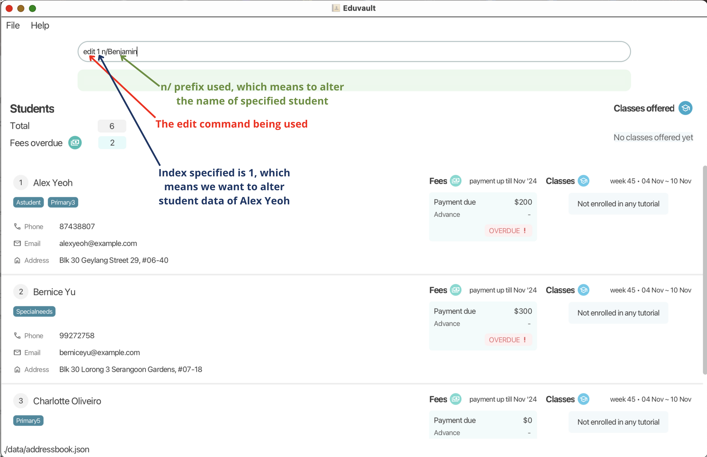

**EduVault** is a desktop application **designed for tuition centers to manage students and classes effectively**. Optimised for quick use through a Command Line Interface (CLI) and complemented by an intuitive graphical user interface (GUI), EduVault enables efficient tracking of student and class information, making it ideal for fast typists and busy administrators.

 

---

## **Table of Contents**

1. [Quick Start](#1-quick-start)

      1.1. [Installation Guide](#11-installation-guide)

      1.2. [Introduction to the interface](#12-introduction-to-the-interface)

      1.3. [Brief Walkthrough](#13-brief-walkthrough)

2. [General Command Format](#2-general-command-format)

3. [Adding data](#3-adding-data)

   3.1. [Adding a student](#31-adding-a-student)

   3.2. [Creating a new tutorial](#32-creating-a-new-tutorial)

   3.3. [Enrolling student in tutorial](#33-enrolling-student-into-a-tutorial)

4. [Viewing and Retrieving data](#4-viewing-and-retrieving-data)

   4.1. [Listing all students](#41-listing-all-students)

   4.2.[Searching Students](#42-searching-students)

5. [Editing and Updating data](#5-editing-and-updating-data)

   5.1. [Editing student’s details](#51-editing-a-student)

   5.2. [Logging fees](#52-logging-fees-for-tutorial)

   5.3. [Marking payment](#53-marking-a-students-payment)

   5.4. [Marking attendance of student](#54-marking-attendance-of-a-student)

   5.5. [Marking attendance of tutorial](#55-marking-attendance-of-a-tutorial)

   5.6. [Unmarking attendance of a student](#56-unmarking-attendance-of-a-student)

   5.7. [Unenroll a student from tutorial](#57-unenrolling-student-from-a-tutorial)

6. [Deleting data](#6-deleting-data)

   6.1. [Deleting a student](#61-deleting-a-student)

   6.2. [Closing a tutorial](#62-closing-a-tutorial)

   6.3. [Clearing all entries](#63-clearing-all-entries)

7. [Viewing help](#7-viewing-help)

8. [Exiting the program](#8-exiting-the-program)

9. [Saving the data](#9-saving-data)

10. [Editing the data file](#10-editing-the-data-file)

11. [Prefix Table](#11-prefix-table)

12. [Format Errors](#12-format-errors)

13. [FAQ](#13-faq)

14. [Known issues](#14-known-issues)

---

### **1. Quick Start**

#### **1.1 Installation Guide**

  1. Open the Terminal:
     * On Windows laptop, open Command Prompt.
     * On Mac or Linux laptop, open Terminal.
  2. Ensure you have `Java 17` or above installed in your Computer. You can type `java –version` in the Terminal to verify the version.
  3. To install `Java 17`, you can click [here](https://www.oracle.com/java/technologies/javase/jdk17-archive-downloads.html) and install the one for your operating system. Skip this step if you already have `Java 17` installed.
  4. Click on [this link](https://github.com/AY2425S1-CS2103T-W08-2/tp/releases) and download the latest `EduVault.jar` file.
  5. After downloading it, move the  `EduVault.jar` file to the folder you want to use for the EduVault application.
  6. Using the Terminal from Step 1, use `cd` command to go to the folder you put the jar file in.
  7. Refer [here](https://tutorials.codebar.io/command-line/introduction/tutorial.html) for the usage of `cd` command in Terminal if you are unsure.
  8. Type `java -jar EduVault.jar` in the Terminal to start the application.
  9. An EduVault interface similar to the [below](#12-introduction-to-the-interface) should appear in a few seconds. Note that the app will contain some sample data.

 

#### **1.2 Introduction to the interface**

When EduVault is first started, you will see an interface like the one below, made up of multiple components. Here’s a breakdown of each section and its functionality:

* **Options Box:**  Provides basic options like exiting the application or accessing the user guide
* **Command Box:** An input box where users can type in commands to execute specific actions within EduVault
* **Message Box:** Displays messages in response to the commands. (An example of the message is shown in the sample interface above
* **Student Summary Box:** Provides an overview of students
* **Student Information Box:** Includes the personal information of the student like name, phone number, email, etc
* **Payment Box:** Displays the payment details of each student
* **Tutorial Summary Box:** Provides a summary of tutorials or classes being offered
* **Tutorial Box:** Displays the tutorials or classes that each student is currently enrolled in, along with their attendance

 

#### **1.3 Brief Walkthrough**

This section provides a quick walkthrough of the basic functionalities of EduVault and how to use them. You'll learn how to add a student to EduVault
and mark their attendance for a tutorial.

As a start, type the command `list` in the command box and press Enter to execute it. This will display all students currently in EduVault.

If you need help at any time, typing **`help`** and pressing Enter will open the help window.

Next, try executing the following commands in the given order:

1. `add n/John Doe p/98765432 e/johnd@example.com a/John street, block 123, #01-01` : Adds a student named `John Doe` to EduVault.
2. `createtut tut/Math` : Creates a tutorial named `Math`.
3. `enroll INDEX tut/Math` : Enrolls `John Doe` into `Math` tutorial. Replace `INDEX` with the index number of `John Doe` shown in the list. 
4. `mas INDEX tut/Math attend/10/10/2024` : Marks the attendance for `John Doe` for `Math` tutorial for date 10/10/2024. Replace `INDEX` with the index number of `John Doe` shown in the list.

And that's it! You've learnt how to add students and mark attendance in EduVault.

:bulb: **Tip:**
Continue reading this guide to learn about the full functionalities of EduVault.

---

### **2. General Command Format**

The commands in EduVault follow a general format of `COMMAND INDEX PREFIX/...` .

* `COMMAND` refers to the command that you want to execute.
* `INDEX` refers to the student whose data you want to alter, specified by the number prepended to the name of the student on the application.
* `PREFIX` specifies the type of data we want to alter.
    * Refer to the [Prefix Table](#11-prefix-table) below for the usage of each prefix.

 

#### **Example**

For example,  `edit 1 n/Benjamin` edits the student name at index 1(Alex Yeoh, in this case) to Benjamin.

:pushpin: **Note:**
This is a general command format, not ALL commands follow this format! For the specific command formats, refer to the individual section of each command below.

---

### **3. Adding data**

The commands in this section are used to add new records to the system, such as students and tutorials.

- [Adding a student](#31-adding-a-student)
- [Creating a new tutorial](#32-creating-a-new-tutorial)
- [Enrolling student into a tutorial](#33-enrolling-student-into-a-tutorial)

#### **3.1 Adding a student**
Command: `add`

Usage: `add n/NAME p/PHONE e/EMAIL a/ADDRESS [t/TAG]…`

:pushpin: **Note:**

Fields wrapped in square brackets `[]` are optional, so the TAG field here is optional.

:bulb:
**Tip:**

This command is best used with reference to its usages in the [Prefix Table](#11-prefix-table)



Fields

* `NAME`: Name of the student to add
* `PHONE`: Phone number of the student to add
* `EMAIL`: Email of the student to add
* `ADDRESS`: Address of the student to add
* `TAG`: Tag(s) of the student to add



Example usages

* `add n/John Doe p/98765432 e/johnd@example.com a/John street, block 123, #01-01`



Invalid usages
* Student already exists in EduVault
  * *Error message: This student already exists in EduVault.*
* Format errors, check [here](#12-format-errors).



:pushpin: **Note:**

The student to be added cannot have the same name and phone number as an existing student.

If there is a student with name `John Doe` and phone number `87654321` in the list:

`add n/John Doe p/87654321...` is not allowed

`add n/John Doe p/98765432...` is allowed

`add n/Jane Doe p/87654321...` is allowed

#### **3.2 Creating a new tutorial**

Command: `createtut`

Usage: `createtut tut/TUTORIAL`



Fields

* `TUTORIAL`: Name of the tutorial to create
  * Must only contain alphanumeric characters



Example usages

* `createtut tut/physics`



Invalid usages

* Creating a tutorial that has been created already
  * *Error Message: This tutorial already exists in the system.*

* Format errors, check [here](#12-format-errors).



#### **3.3 Enrolling student into a tutorial**

Command:  `enroll`

Usage: `enroll INDEX tut/TUTORIAL`



Fields

* `INDEX:` Index number as shown in the displayed list of the students.
    * Must be a positive integer 1, 2, 3…
* `TUTORIAL:` Name of the tutorial



:pushpin: **Note:** 
Student can only be enrolled into existing tutorial. Use createtut to create new tutorials

Example usages

* `enroll 1 tut/physics`



Invalid usages

* Enrolling student in a tutorial that has not been created yet

    * *Error Message: Tutorial name provided is invalid*

* Enrolling student in a tutorial that they are already in

    * *Error Message: This student is already in the tutorial.*

* Format errors, check [here](#12-format-errors)



---

### **4. Viewing and retrieving data**

The commands in this section are used to view and retrieve records on the system, such as students, tutorials, and enrollment status.

- [Listing all students](#41-listing-all-students)  
- [Searching students](#42-searching-students)

#### **4.1 Listing all students**

Command: `list`

#### **4.2 Searching students**

Search for students that match the condition specified by the given prefix.

:bulb:
**Tip:**

This command is best used with reference to its usages in the [Prefix Table](#11-prefix-table)

Command:  `find`

Usage: `find [n/NAME] [e/EMAIL] [p/PHONE] [a/ADDRESS] [pay/PAYMENT] [attend/ATTENDANCE] [t/TAG] [tut/TUTORIAL]`

:pushpin: **Note:**

Fields wrapped in square brackets `[]` are optional, but at least one of the optional fields must be provided.

:bulb: **Tip:**
Search is by partial matching for keyword(s) of prefixes `n/`, `e/`, `p/`, `a/`, `t/`.



Fields

* `NAME:` Name of the student to search
    * Search for multiple keywords is allowed, and students matching at least one keyword will be displayed.
* `EMAIL:` Email of the student to search
* `PHONE:` Phone number of the student to search
* `ADDRESS`: Address of the student to search
    * Search for multiple keywords is allowed, and students matching at least one keyword will be displayed.
* `PAYMENT:` Search student based on the payment status (Paid/Unpaid)
    * If keyword is `true`, it displays all students who has paid.
    * If keyword is `false`, it displays all students who has not paid.
* `ATTENDANCE:` Search student based on whether they attended any tutorials within a given period
    * Keyword must be in the format of `dd/MM/yyyy:dd/MM/yyyy`, first date is the start date and the second date is the end date.
    * First date must be before the second date.
* `TAG:` Search based on the tag associated to the student
    * Allows multiple uses of this prefix together in the command.

* `TUTORIAL:` Name of the tutorial to search
    * Search with multiple keywords is allowed, and students matching all keywords will be displayed.
    * Allows multiple uses of this prefix together in the command.



:bulb:
**Tip:**

Prefixes can be chained to display more specific results. For instance, using `find n/Alex tut/Math t/ADHD` displays all students named “Alex”, in the “Math” tutorial class, and has a tag “ADHD”.

Example usages

* `find t/ADHD t/sessionA a/Jurong West Ave 5`

* `find p/9123 attend/07/01/2024:07/02/2024 pay/false`

* `find t/ADHD e/a@example.com`

* `find tut/physics tut/math n/Alex Goh`



Invalid usages

* Entering multiple keywords for a prefix that only allows a single keyword

    * *Error Message: At least one of the inputs…*

* Entering only the prefix without providing any keywords

    * *Error Message: Some inputs are missing\! Please…*

* For `a/ATTENDANCE` field, entering the start date after the end date

    * *Error Message: Start date must be before…*

* More format errors, check [here](#12-format-errors).



---

### **5. Editing and updating data**

The commands in this section are used to edit records on the system, such as student information, tutorial information, payment, and attendance status

- [Editing student’s details](#51-editing-a-student)  
- [Logging fees](#52-logging-fees-for-tutorial)  
- [Marking payment](#53-marking-a-students-payment)
- [Marking attendance of student](#54-marking-attendance-of-a-student)
- [Marking attendance of tutorial](#55-marking-attendance-of-a-tutorial)  
- [Unmarking attendance of student](#56-unmarking-attendance-of-student)
- [Unenroll a student from tutorial](#57-unenrolling-student-from-a-tutorial)

#### **5.1 Editing a student**

Edit the personal information of students within EduVault

Command: `edit`

Usage: `edit INDEX [n/NAME] [p/PHONE] [e/EMAIL] [a/ADDRESS] [t/TAG]…​`

:pushpin: **Note:**

Fields wrapped in square brackets `[]` are optional, but at least one of the optional fields must be provided.

:bulb:
**Tip:**

This command is best used with reference to its usages in the [Prefix Table](#11-prefix-table)



Fields:

* `INDEX`: Index number shown in the displayed student list
    * Must be a positive integer 1, 2, 3, …​
* `NAME`: Edited name of the student at specified index
* `PHONE`: Edited phone number of the student at specified index
* `EMAIL`: Edited email of the student at specified index
* `ADDRESS`: Edited address of the student at specified index
* `TAG:` Tags to replace for the student at specified index
  * Existing tag will be replaced by the new tag
  * Remove a student’s tag by typing  `t/` without specifying any tags
* `ATTENDANCE`: Field not editable within edit
* `TUTORIAL`: Field not editable within edit
* `PAYMENT`: Field not editable within edit



Example Usage:

* `edit 1 p/91234567 e/johndoe@example.com` Edits the phone number and email address of the 1st student to be `91234567` and `johndoe@example.com` respectively.
* `edit 2 n/Betsy Crower t/` Edits the name of the 2nd student to be `Betsy Crower` and clears all existing tags.



Invalid usage:

* None of the option fields are input
    * *Error message: At least one field to edit must be provided.*
* Values to edit result in a copy of a student already in EduVault
    * *Error message: This student already exists in EduVault.*
* `ATTENDANCE` & `TUTORIAL` & `PAYMENT` prefix used
    * Error message: PREFIX cannot be used in this command
* Format errors, check [here](#12-format-errors)



:pushpin: **Note:**

The student cannot be edited to have the same name and phone number as an existing student.

If there is a student with name `John Doe` and phone number `87654321` in the list:

`add n/John Doe p/87654321...` is not allowed

`add n/John Doe p/98765432...` is allowed

`add n/Jane Doe p/87654321...` is allowed

#### **5.2 Logging fees for tutorial**

*Logging each student's monthly tutorial fees or any other additional fees*

Command:  `addfees`

Usage: `addfees INDEX pay/PAYMENT`



Fields

* `INDEX:` Index number as shown in the displayed list of the students.
    * Must be a positive integer 1, 2, 3…
* `PAYMENT:` Amount in integer that a student has to pay



:pushpin: **Note:**

Fees can only be added if the student is enrolled in **at least one** tutorial. To enroll students into tutorial, check [here](#33-enrolling-student-into-a-tutorial).

:pushpin: **Note:**
Fees added will be shown as an increase in overdue amount. If a student has advance payment, logged fees will decrease the advance payment first.

Example usages

* `addfees 1 pay/400`



Invalid usages

* Format errors, check [here](#12-format-errors)



#### **5.3 Marking a student’s payment**

*Recording a student’s payment*

Command:  `markpaid`

Usage: `markpaid INDEX pay/PAYMENT`



Fields

* `INDEX:` Index number as shown in the displayed list of the students.
    * Must be a positive integer 1, 2, 3…
* `PAYMENT:` Amount in integer that a student has paid



:pushpin: **Note:**
Student’s payment will be shown as a decrease in overdue amount. If student pays extra, it will be shown as advanced payment

Example usages

* `markpaid 1 pay/400`



Invalid usages

* Format errors, check [here](#12-format-errors)



#### **5.4 Marking attendance of a student**

Command: `mas`

Usage: `mas INDEX tut/TUTORIAL attend/ATTENDANCE`



Fields

* `INDEX`: Index number of the student to mark, as shown in the displayed student list
    * Must be a positive integer 1, 2, 3…
* `TUTORIAL`: Name of the tutorial the student is taking
* `ATTENDANCE`: Date to mark the attendance for
    * Must be a valid date in the format dd/MM/yyyy and cannot be a future date
    * If the month specified has fewer than 31 days, entering a day up to and including 31 will result in the date being adjusted to the final day of that month.
    For e.g. 31/04/2024 will be adjusted to 30/04/2024, 30/02/2024 will be adjusted to 29/02/2024 and 31/02/2023 will be adjusted to 28/02/2023.



:pushpin: **Note:**
If the student has attendance marked for the corresponding week, the attendance of the student will not be marked.

:bulb: **Tip:**
If you want to mark the attendance of all students in a tutorial, 
use the command `mat` [here](#55-marking-attendance-of-a-tutorial).

Example usages

* `mas 1 tut/Math attend/30/10/2024`
* `mas 2 attend/10/10/2024 tut/Chemistry`



Invalid usages
* Marking attendance of student who does not take specified tutorial
    * *Error message: Student STUDENT_NAME is not enrolled in TUTORIAL tutorial, or TUTORIAL tutorial does not exist*
* Marking attendance of student who already has attendance marked for the corresponding week for the specified tutorial
    * *Error message: Student STUDENT_NAME has attendance marked for the corresponding week of date ATTENDANCE for TUTORIAL tutorial*
* Format errors, check [here](#12-format-errors)



:bulb: **Tip:**
You can click anywhere in the attendance box to show other weeks' attendance for that tutorial.

#### **5.5 Marking attendance of a tutorial**
*Marks the attendance of all students enrolled in the tutorial for the specified date*

Command: `mat`

Usage: `mat tut/TUTORIAL attend/ATTENDANCE`



Fields

* `TUTORIAL`: Name of the tutorial to mark the attendance for all students
* `ATTENDANCE`: Date to mark the attendance for
    * Must be a valid date in the format dd/MM/yyyy and cannot be a future date
    * If the month specified has fewer than 31 days, entering a day up to and including 31 will result in the date being adjusted to the final day of that month.
      For e.g. 31/04/2024 will be adjusted to 30/04/2024, 30/02/2024 will be adjusted to 29/02/2024 and 31/02/2023 will be adjusted to 28/02/2023.



:pushpin: **Note:**
If at least one student does not have their attendance marked for the corresponding week, those students will 
have their attendance marked while those students with corresponding weekly attendance will be skipped. 

Example usages

* `mat tut/Math attend/30/10/2024`
* `mat attend/10/10/2024 tut/Chemistry`



Invalid usages
* Marking attendance of a tutorial that does not exist
    * *Error message: No tutorial class with the name TUTORIAL is found*
* Marking attendance of a tutorial with no students enrolled
    * *Error message: No students are enrolled in TUTORIAL tutorial*
* Marking attendance of a tutorial where **all students** already have attendance marked for the corresponding week
    * *Error message: All students in TUTORIAL tutorial have attendance marked 
    for the corresponding week of date ATTENDANCE*
* Format errors, check [here](#12-format-errors)



#### **5.6 Unmarking attendance of a student**

Command: `umas`

Usage: `umas INDEX tut/TUTORIAL attend/ATTENDANCE`



Fields

* `INDEX`: Index number of the student to unmark, as shown in the displayed student list
  * Must be a positive integer 1, 2, 3…
* `TUTORIAL`: Name of the tutorial the student is taking.
* `ATTENDANCE`: Date to unmark the attendance for.
  * Must be a valid date in the format dd/MM/yyyy and cannot be a future date
  * If the month specified has fewer than 31 days, entering a day up to and including 31 will result in the date being adjusted to the final day of that month.
    For e.g. 31/04/2024 will be adjusted to 30/04/2024, 30/02/2024 will be adjusted to 29/02/2024 and 31/02/2023 will be adjusted to 28/02/2023.



Example usages

* `umas 1 tut/Math attend/30/10/2024`
* `umas 2 attend/10/10/2024 tut/Chemistry`



Invalid usages

* Unmarking attendance of student who does not take specified tutorial
    * *Error message: Student STUDENT_NAME is not enrolled in TUTORIAL tutorial, or TUTORIAL tutorial does not exist*
* Unmarking attendance of student who does not have attendance marked for the specified date and tutorial
    * *Error message: STUDENT_NAME's attendance for date ATTENDANCE for TUTORIAL tutorial has not been marked before*
* Format errors, check [here](#12-format-errors)



#### **5.7 Unenrolling student from a tutorial**

Command:  `unenroll`

Usage: `unenroll` `INDEX tut/TUTORIAL`



Fields

* `INDEX:` Index number as shown in the displayed list of the students.
    * Must be a positive integer 1, 2, 3…
* `TUTORIAL:` Name of the tutorial



:pushpin: **Note:**
Student can only be unenrolled from tutorials that they are currently in

Example usages

* `unenroll 1 tut/physics`



Invalid usages

* Unenrolling student from a tutorial that they are not in

    * *Error Message: Cannot unenroll STUDENT from TUTORIAL, as…*

* Format errors, check [here](#12-format-errors)



---

### **6. Deleting data**

The commands in this section are used to delete records on the system

- [Deleting a student](#61-deleting-a-student)  
- [Closing a tutorial](#62-closing-a-tutorial)
- [Clearing all entries](#63-clearing-all-entries)

#### **6.1 Deleting a student**

*Deleting student’s record*

Command:  `delete`

Usage: `delete` `INDEX`



Fields

* `INDEX:` Index number as shown in the displayed list of the students.
    * Must be a positive integer 1, 2, 3…



Example usages

* `delete 2`



Invalid usages

* Format errors, check [here](#12-format-errors)



#### **6.2 Closing a tutorial**

Command:  `closetut`

Usage: `closetut tut/TUTORIAL`



Fields

* `TUTORIAL`: Name of the tutorial to close
  * Must only contain alphanumeric characters



:pushpin: **Note:**

Only an existing tutorial can be closed. Use [createtut](#32-creating-a-new-tutorial) to create new tutorials, or check the spelling again.

:exclamation: **Warning:**
If there are students in the tutorial to be closed, closing the tutorial will REMOVE all students in that tutorial and their past attendances for that tutorial.

Example usages
* `closetut tut/physics`



Invalid usages

* Closing a tutorial that does not exist
    * *Error Message: No tutorial class with the name TUTORIAL is found.*
* Format errors, check [here](#12-format-errors)



#### **6.3 Clearing all entries**

Deletes all tutorial, student and participation records

Command:  `clear`

:exclamation: **Warning:**
EduVault immediately saves once the command resolves. Hence, it is recommended to create a backup of the file `[JAR file location]/data/eduvault.json` before executing.

---

### **7. Viewing help**
Shows a message explaining how to access the help page.

Command: `help`

:pushpin: **Note:**

Extraneous parameters for commands that do not take in parameters (such as help, list, exit and clear) will be ignored.

- e.g. if the command specifies help 123, it will be interpreted as help.

---

### **8. Exiting the program**

Exits the program.

Command: `exit`

---

### **9. Saving data** 
EduVault data is saved in the hard disk automatically after any command that changes the data.
There is no need to save manually.

---

### **10. Editing the data file**
EduVault data is saved automatically as a JSON file at `[JAR file location]/data/eduvault.json`.
Advanced users are welcome to update data directly by editing that data file.

:exclamation: **Warning:**
If your changes to the data file make its format invalid, EduVault will discard all data and start with an empty data file at the next run. Hence, it is recommended to create a backup of the file before editing it.
Furthermore, certain edits can cause EduVault to behave in unexpected ways (e.g., if a value entered is outside of the acceptable range). Therefore, edit the data file only if you are confident that you can update it correctly.

For reference, please refer to the [Developer Guide](https://ay2425s1-cs2103t-w08-2.github.io/tp/DeveloperGuide.html#storage-feature) for more details on editing the JSON file.

---

### **11. Prefix Table** 

Prefixes are used whenever we want to alter the data in EduVault, such as adding, updating or deleting data. They are also used when we want to search for data on the student. Each prefix specifies what type of data we want to alter or search for, and the word(s) following each prefix specifies what to alter the data to or what to search for. The table below is a list of all prefixes that are used in our commands.

<table style="width:100%">
  <tr>
    <th style="width:10%">Prefix</th>
    <th style="width:60%">Prefix description and usage</th>
    <th style="width:30%">Exception Cases</th>
  </tr>

  <!-- n/ prefix row -->

  <tr>
    <td rowspan="3">n/</td>
    <td><u>Description</u> Specifies the <b>name</b> of the student.</td>
    <td rowspan="3">For <code>find</code> command, keyword(s) for this prefix <b>need not</b> be alphanumeric, but it <b>must not</b> be blank.</td>
  </tr>
  <tr>
    <td><u>Format</u> The keyword(s) following this prefix must be alphanumeric and cannot be blank.   <i>Multiple keywords are allowed. Duplicate prefixes are not allowed.</i></td>
  </tr>
  <tr>
    <td><u>Invalid Usage</u>  Keyword(s) contain special characters or are blank.   <i>Error Message: Names should only contain alphanumeric characters...</i></td>
  </tr>

  <!-- p/ prefix row -->

  <tr>
    <td rowspan="3">p/</td>
    <td><u>Description</u> Specifies the <b>phone number</b> of the student.</td>
    <td rowspan="3">For <code>find</code> command, keyword(s) for this prefix <b>need not</b> be numbers, and can be less than 3 digits. However, it <b>must not</b> be blank.</td>
  </tr>
  <tr>
    <td><u>Format</u> The keyword following this prefix must be numbers, and at least 3 digits.  <i>Multiple keywords are not allowed. Duplicate prefixes are not allowed.</i></td>
  </tr>
  <tr>
    <td><u>Invalid Usage</u> Keyword(s) contain non-numeric characters or are less than 3 digits.  <i>Error Message: Phone numbers should only contain numbers...</i></td>
  </tr>

 <!-- e/ prefix row -->

  <tr>
    <td rowspan="3">e/</td>
    <td><u>Description</u> Specifies the <b>email</b> of the student.</td>
    <td rowspan="3">For <code>find</code> command, the format constraints to the keyword does not apply. However, it <b>must not</b> be blank.</td>
  </tr>
  <tr>
    <td><u>Format</u> The keyword following this prefix must be in the format of “...@domain.com”.  <i>Multiple keywords are not allowed. Duplicate prefixes are not allowed.</i></td>
  </tr>
  <tr>
    <td><u>Invalid Usage</u> Keyword does not have the valid email format described above.  <i>Error Message: Emails should be of the format...</i></td>
  </tr>

  <!-- a/ prefix row -->

  <tr>
    <td rowspan="3">a/</td>
    <td><u>Description</u> Specifies the <b>address</b> of the student.</td>
    <td rowspan="3">NIL</td>
  </tr>
  <tr>
    <td><u>Format</u> The keyword(s) can be any input but cannot be blank.  <i>Multiple keywords are allowed. Duplicate prefixes are not allowed.</i></td>
  </tr>
  <tr>
    <td><u>Invalid Usage</u> Keyword(s) is blank.  <i>Error Message: Addresses can take any values, and...</i></td>
  </tr>

 <!-- pay/ prefix row -->

<tr>
  <td rowspan="3">pay/</td>
  <td><u>Description</u> Specifies the <b>amount</b> that the student pays or owes.</td>
  <td rowspan="3">For <code>find</code> command, keyword(s) for this prefix <b>are restricted to only</b> <code>true</code> or <code>false</code>.</td>
</tr>
<tr>
  <td><u>Format</u> The keyword provided after this prefix should be a number.  <i>Multiple keywords are not allowed. Duplicate prefixes are not allowed.</i></td>
</tr>
<tr>
  <td><u>Invalid Usage</u> Keyword provided is not a number.  <i>Error Message: Payment should be an...</i></td>
</tr>

 <!-- attend/ prefix row -->

<tr>
  <td rowspan="3">attend/</td>
  <td><u>Description</u> Specifies the <b>attendance date</b> that the student went for class.</td>
  <td rowspan="3">For <code>find</code> command, keyword <b>must be</b> in the format of <code>dd/MM/yyyy:
dd/MM/yyyy</code>
  </td>
</tr>
<tr>
  <td><u>Format</u> The keyword provided should be a valid date of the format <code>dd/MM/yyyy</code>.  Note: If the month specified has fewer than 31 days, entering a day up to and including 31 will result in the date being adjusted to the final day of that month.
    For e.g. 31/04/2024 will be adjusted to 30/04/2024, 30/02/2024 will be adjusted to 29/02/2024 and 31/02/2023 will be adjusted to 28/02/2023.  <i>Multiple keywords are not allowed. Duplicate prefixes are not allowed.</i></td>
</tr>
<tr>
  <td><u>Invalid Usage</u> Keyword does not have the format specified above.  <i>Error Message: Attendance must be a valid date in the format...</i></td>
</tr>

 <!-- t/ prefix row -->

<tr>
  <td rowspan="3">t/</td>
  <td><u>Description</u> Specifies the <b>tag</b> associated to the student.</td>
  <td rowspan="3">
    For <code>edit</code> command, keyword for this prefix <b>can be blank</b>.  
    For <code>find</code> command, keyword for this prefix <b>need not</b> be alphanumeric, but it <b>must not</b> be blank.
  </td>
</tr>
<tr>
  <td><u>Format</u> The keyword provided should be alphanumeric with no spaces, and it cannot be blank.  <i>Multiple keywords are not allowed. Duplicate prefixes are allowed.</i></td>
</tr>
<tr>
  <td><u>Invalid Usage</u> Keyword does not have the format specified above.  <i>Error Message: Tag names should be...</i></td>
</tr>

 <!-- tut/ prefix row -->

<tr>
  <td rowspan="3">tut/</td>
  <td><u>Description</u> Specifies the <b>tutorial</b> of the student.</td>
  <td rowspan="3">
    For <code>enroll</code> and <code>unenroll</code> commands, the keyword <b>need not</b> be alphanumeric, but <b>must not</b> be blank.  
    For <code>find</code> command, <b>duplicate prefixes are allowed</b>.
  </td>
</tr>
<tr>
  <td><u>Format</u> The keyword provided should be alphanumeric and it cannot be blank. Spaces are allowed.  <i>Multiple keywords are allowed. Duplicate prefixes are not allowed.</i></td>
</tr>
<tr>
  <td><u>Invalid Usage</u> Keyword does not have the format specified above.  <i>Error Message: Tutorial name should only contain...</i></td>
</tr>

</table>

---

### **12. Format Errors**

<table>
    <thead>
        <tr>
            <th>Error Message</th>
            <th>Most Likely Cause</th>
        </tr>
    </thead>
    <tbody>
        <tr>
            <td><em>Unknown Command….</em></td>
            <td>
                <ul>
                    <li>Command misspelled</li>
                    <li>Command not available in the current release</li>
                </ul>
            </td>
        </tr>
        <tr>
            <td><em>Invalid Command format…</em></td>
            <td>
                <ul>
                    <li>Command word is correct but the format entered is wrong
                        <ul>
                            <li>Index is missing, or is a negative number</li>
                            <li>Prefix is missing or misspelled</li>
                            <li>Unidentified inputs after the command word and before the first prefix</li>
                            <li>Keywords of the prefix are incorrect</li>
                        </ul>
                    </li>
                </ul>
            </td>
        </tr>
        <tr>
            <td><em>The student’s index provided is invalid…</em></td>
            <td>
                <ul>
                    <li>Index provided is out of range for the current displayed list</li>
                </ul>
            </td>
        </tr>
        <tr>
            <td><em>Multiple values specified for the following single-valued field(s)...</em></td>
            <td>
                <ul>
                    <li>Duplicated prefix usage when it is not allowed</li>
                </ul>
            </td>
        </tr>
        <tr>
            <td><em>At least one of the dates is not in the right format…</em></td>
            <td>
                <ul>
                    <li>The date format used is incorrect</li>
                </ul>
            </td>
        </tr>
    </tbody>
</table>

---

### **13. FAQ**

**Q**: How do I transfer my data to another Computer?  
**A**: Install the app in the other computer and overwrite the empty data file it creates with the file that contains the data of your previous EduVault home folder.

---

### **14. Known issues**
1. **When using multiple screens**, if you move the application to a secondary screen, and later switch to using only the primary screen, the GUI will open off-screen. The remedy is to delete the preferences.json file created by the application before running the application again.

2. **If you minimize the Help Window** and then run the help command (or use the Help menu, or the keyboard shortcut F1) again, the original Help Window will remain minimized, and no new Help Window will appear. The remedy is to manually restore the minimized Help Window.

3. **If the UI does not update automatically** on modifying student's details such as attendance and enrolling in tutorial, manually click on the area containing the student's details or use command `list` to manually trigger an update. If the UI still does not update, try restarting the application.

