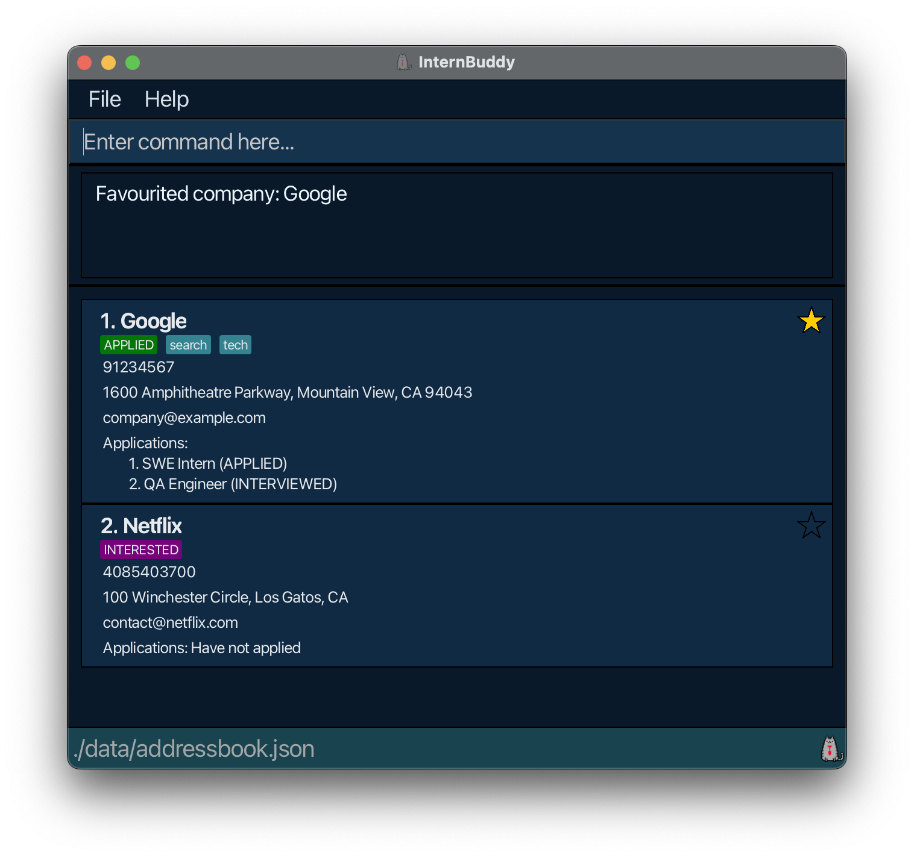
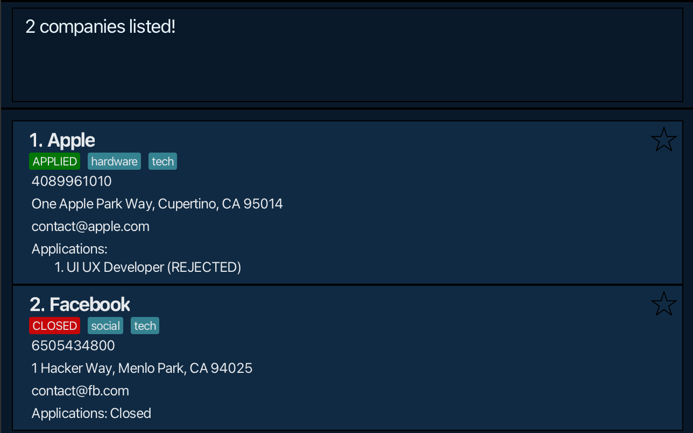
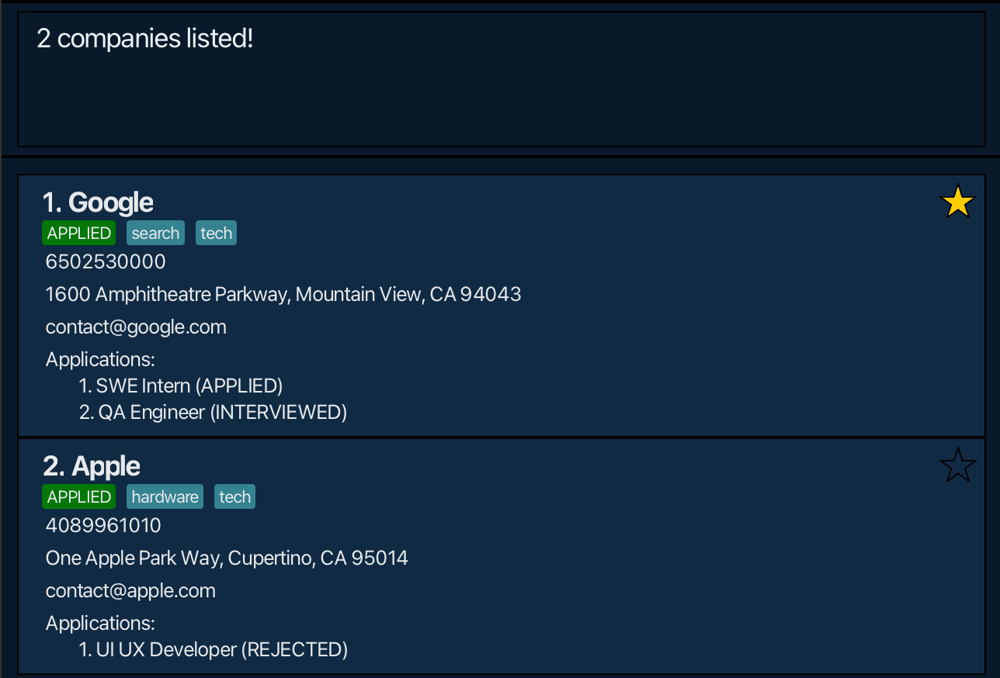

<h1 id="internbuddy-user-guide">
    
    InternBuddy User Guide
</h1>

## Welcome to InternBuddy!

Calling out to all [STEM](#stem) students!

We know that finding internships can be very tough and stressful! We know how hard it is to manage to process of applying for a single internship, 
let alone trying to manage applications for many different companies. This is not even considering the fact that many of you
are juggling this along with schoolwork and other commitments.

This is why we are excited to introduce **InternBuddy**! &ndash; the all-in-one application for all your internship
applications management needs. **InternBuddy** offers a convenient, intuitive and easy to use way to keep track of your interested
companies, internship applications, and critical information &mdash; all tailored for you to ace your internship journey effectively by
making internship application management easier and more efficient!

This user guide will be the key to [start your journey](#how-to-use-our-user-guide) with **InternBuddy**! We provide you with step-by-step instructions on installing
and using our application; giving you a head start on your internship journey!
Or if you are already an existing user, this guide will act as a [refresher](#command-summary) of the various features **InternBuddy** has to offer!
**InternBuddy** is designed to be intuitive, easy to use, and easy to master!

_From the InternBuddy Team!_

[go to overview & tutorial](#overview)  
[go to command summary & features](#command-summary)

--------------------------------------------------------------------------------------------------------------------
## Table of Contents

Refer to the sidebar if you are on the website.

<!-- * Table of Contents -->
<page-nav-print />

--------------------------------------------------------------------------------------------------------------------
## Overview

**InternBuddy** is an offline desktop application for university students studying a STEM major to manage 
the contacts of companies that they are potentially applying or have already applied for internships. 

**InternBuddy** allows users to:
* store and manage companies' contact information for various internship applications.
* easy add and remove companies and their various internship applications
* keep track of information of the applications for the various companies such as name of position, stage of application, and notes about the position.
* and much more!

**InternBuddy** is an [AddressBook](#address-book) optimized for use via a Command Line Interface ([CLI](#cli)) while still having the benefits of a Graphical User Interface ([GUI](#gui)). If you can type fast,
**InternBuddy** can get your company contacts and internship application management tasks done faster than traditional GUI apps.

[back to top](#internbuddy-user-guide)

--------------------------------------------------------------------------------------------------------------------
## How to use our User Guide

First time using **InternBuddy**? Don't worry! We've got you covered! This tutorial will help maximise your usage of **InternBuddy**.
* To get started, refer to the [Quick Start](#quick-start), which will walk you through getting **InternBuddy** all set up!
* Is there a specific section of the User Guide you want to view? Check out the [Table of Contents](#table-of-contents) &ndash; where all the sections are linked nicely!
* Need a quick refresher of the commands available for you? Check out our [Command Summary](#command-summary)!
* For any terms that you are unsure of, the [Glossary](#glossary) might have an explanation for it.
* Is there a burning question you want answers for? The [FAQ](#faq) might have the answer.

Before continuing, here are some important information you need to know about the User Guide:
1. There are 3 different kinds of boxes that provide extra information.
    * *Tip boxes* provide tips or helpful advise on how to use a certain feature found in **InternBuddy**.
   
      <box type="tip" seamless>
   
      **Tip:** This is a tip box.
      </box>
      
    * *Notice boxes* provide important information that you should take note of.
   
      <box type="info" seamless>
      
      **Notice:** This is a notice box.
      </box>
   
    * *Warning boxes* provide a warning about certain errors that might occur as a precaution for incorrect usage.
   
      <box type="warning" seamless>
      
      **Warning:** This is a warning box.
      </box>

2. Words that are in in blue are hyperlinks. They will redirect you to a different
   part of the User Guide or an external link when you click on them. For instance, [this hyperlink](#internbuddy-user-guide)
   brings you back to the top of the User Guide.

   <box type="tip" seamless>
   
   **Tip:** If you are viewing this guide on our website, you can hover over links to see where the hyperlink takes you!
   </box>

3. Refer to [Features](#features) for detailed explanations of each feature of **InternBuddy**!

[back to top](#internbuddy-user-guide)

--------------------------------------------------------------------------------------------------------------------
## Quick start

1. Ensure you have Java `17` or above installed in your Computer by opening up your terminal application (for macOS it's called `Terminal`, and for Windows: `Command Prompt`), followed by executing `java -version`.

1. Download the latest `.jar` file from [here](https://github.com/AY2425S1-CS2103T-T09-1/tp/releases) (scroll down to assets to find it!).

1. Copy/move the file to the folder you want to use as the _home folder_ for your AddressBook.

1. Open a command terminal, run the `cd` command to change your directory to the folder you put the jar file in
1. Use the `java -jar internbuddy.jar` command to run the application. 
   A GUI similar to the below should appear in a few seconds. Note how the app contains some sample data. 
   

1. Type the command in the command box and press Enter to execute it. e.g. typing **`help`** and pressing Enter will open the help window. 
   Some example commands you can try:

    * `list` : Lists all contacts.

    * `add n/Jane Street p/91234567 e/careers@janestreet.com a/Jane Street, block 123, #01-01` : Adds a company named `Company` to the Address Book.

    * `delete 3` : Deletes the 3rd contact shown in the current list.

    * `clear` : Deletes all contacts.

    * `exit` : Exits the app.

1. Refer to the [Features](#features) below for details of each command.
1. Make sure to check out the [Glossary](#glossary) for definitions of some vocabulary used in this guide. 

[back to top](#internbuddy-user-guide)

--------------------------------------------------------------------------------------------------------------------
## Command summary

| Action       | Format, Examples                                                                                                                                                              |
|--------------|-------------------------------------------------------------------------------------------------------------------------------------------------------------------------------|
| **Add**      | `add n/NAME e/EMAIL [p/PHONE_NUMBER] [a/ADDRESS] [t/TAG]…​`   e.g., `add n/Google LLC p/22224444 e/careers@google.com a/70 Pasir Panjang Rd, #03-71, 117371 t/tech t/software` |
| **Apply**    | `apply INDEX n/NAME d/DESCRIPTION [as/APPLICATION_STATUS]`  e.g., `apply 1 n/Software Engineering Intern d/Uses React`                                                     |
| **Clear**    | `clear`                                                                                                                                                                       |
| **Delete**   | `delete INDEX`                                                                                                                                                                |
| **Edit**     | `edit INDEX [n/NAME] [p/PHONE_NUMBER] [e/EMAIL] [a/ADDRESS] [t/TAG]…​`  e.g.,`edit 2 n/Meta Platforms e/jobs@meta.com`                                                     |
| **Exit**     | `exit`                                                                                                                                                                        |
| **Find**     | `find KEYWORD [MORE_KEYWORDS]`  e.g., `find Apple Inc`                                                                                                                     |
| **Help**     | `help`                                                                                                                                                                        |
| **List**     | `list`                                                                                                                                                                        |
| **Reopen**   | `reopen INDEX`                                                                                                                                                                    |
| **View**     | `view INDEX`                                                                                                                                                                  |
| **Update**   | `update c/COMPANY_INDEX app/APPLICATION_INDEX as/APPLICATION_STATUS`  e.g.,`update c/1 app/1 as/OA`                                                                        |
| **Withdraw** | `withdraw c/COMPANY_INDEX app/APPLICATION_INDEX`  e.g., `withdraw c/3 app/1`                                                                                               |

[back to top](#internbuddy-user-guide)

--------------------------------------------------------------------------------------------------------------------
## Features

Before diving into our features, do note that we set some specifications for naming and such. You might want to read this section if you keep getting an `Invalid command format!` message, or want to find out more intricate details about InternBuddy. Otherwise, skip to [add command](#adding-a-company-add) to begin.

<box type="info" seamless>

**Important notes about the command format:** 

* Words in `UPPER_CASE` are the parameters to be supplied by the user. 
  e.g. in `add n/NAME`, `NAME` is a parameter which can be used as `add n/Optiver`.

* Letters preceding the `/` before parameters (if present) are prefixes that the app uses to determine that parameter. It is case-sensitive and thus
  must be written as shown  
  e.g. `t/` and `T/` will be read as different prefixes and thus cannot be used in place of another. 

* Items in square brackets are optional. 
  e.g `n/NAME [t/TAG]` can be used as `n/Optiver t/financial` or as `n/Optiver`.

* Items with `…`​ after them can be used multiple times including zero times. 
  e.g. `[t/TAG]…​` can be used as ` ` (i.e. 0 times), `t/friend`, `t/friend t/family` etc.

* Parameters can be in any order. 
  e.g. if the command specifies `n/NAME p/PHONE_NUMBER`, `p/PHONE_NUMBER n/NAME` is also acceptable.

* `NAME` would be the company's name, InternBuddy only allows alphanumeric characters (letters and numbers) to represent it.  
  e.g. `7Eleven` is allowed but not `7-Eleven` because `-` is neither a letter nor a number.

* `PHONE_NUMBER` is the company's phone number. Company phone numbers should be at least 3 digits long, does not take into account the `+` prefix and must be all numbers.
  e.g. `85092323`, `0122345677`

* InternBuddy defines `EMAIL` as `local-part@domain`, where `local-part` and `domain` can only consist of alphanumeric characters again (letters and numbers). The following special characters `+ - _ .` are allowed in `local-part` but note that:
    1. `local-part` can't begin or end with any special characters.
    2. `local-part` can't have consecutive special characters in it.
    3. The only special characters allowed in `domain` are periods (`.`) are allowed in `domain` and follows the 2 rules for `local-part` above.

    e.g. `abc-123+spam@nus.edu.sg`

* Commands are **case-sensitive**, meaning they must be typed exactly as shown.  
  e.g. to use the `add` command to add a company, type `add n/Tencent e/tencent@gmail.com`. Variations like `ADD ...`, `Add ...`, or `adD ...` will not work.

* Extraneous parameters for commands that do not take in parameters (such as `help`, `list`, `exit` and `clear`) will be ignored. 
  e.g. if the command specifies `help 123`, it will be interpreted as `help`.

* A Company Status is the first coloured tag under the company's name. It will be set to `INTERESTED` initially, then to `APPLIED` when an Application to the company is made, and finally `CLOSED` when the all Applications are withdrawn from that company.

* To use the `reopen` command, the company at the `Index` provided mus have status `CLOSED`, which will subsequently become `Interested`.

* If you are using a PDF version of this document, be careful when copying and pasting commands that span multiple lines as space characters surrounding line-breaks may be omitted when copied over to the application.
</box>

### Adding a company: `add`

Adds a company to the address book.

Format: `add n/NAME e/EMAIL [p/PHONE_NUMBER] [a/ADDRESS] [t/TAG]…​`

<box type="tip" seamless>

**Tip 1:** A company can have any number of tags (including 0)  
**Tip 2:** A company requires a name and email at the minimum
</box>

<box type="info" seamless>

**Note:** You cannot add two companies with the same name. (even if the letter casing is different)
</box>

<box type="warning" seamless>

**Caution:** Due to the nature of prefix commands, company names are restricted to alphanumeric characters only
</box>

Examples:
* `add n/Apple e/contact@apple.com`
* `add n/Netflix e/contact@netflix.com p/4085403700 a/100 Winchester Circle, Los Gatos, CA`
* `add n/Google LLC t/FAANG e/contact@google.com p/1234567 t/tech`

--------------------------------------------------------------------------------------------------------------------

### Adding application record for a company: `apply`

Adds an internship application record to an existing company in the address book.

Format: `apply INDEX n/NAME d/DESCRIPTION [as/APPLICATION_STATUS]`

* Adds an application record for the company at the specified `INDEX`. The index refers to the index number shown in the displayed company list. The index **must be a positive integer** 1, 2, 3, …​
* `APPLICATION_STATUS` can only take the values `APPLIED`, `OA`, `INTERVIEWED`, `OFFERED`, `ACCEPTED`, `REJECTED`
and will be `APPLIED` if not specified.

<box type="tip" seamless>

**Tip:** applying to a company automatically changes the company's status to `applied`.
</box>

Examples:
* `apply 1 n/Software Engineer Intern d/Requires knowledge of ReactJS and ExpressJS`
* `apply 2 n/Product Management Intern d/Requires Figma as/OA`
* `apply 3 n/Devops Engineer Intern d/Requires knowledge in networks as/OFFERED`

--------------------------------------------------------------------------------------------------------------------

### Listing all companies : `list`

Shows a list of all companies in the address book.

Format: `list`

--------------------------------------------------------------------------------------------------------------------

### Clearing all entries : `clear`

<box type="warning" seamless>

**Caution:** Using clear will permanently remove all data saved in the AddressBook
</box>

**Deletes all entries** from the address book.

Format: `clear`

--------------------------------------------------------------------------------------------------------------------

### Deleting a company : `delete`

Deletes the specified company from the address book.

Format: `delete INDEX`

* Deletes the company at the specified `INDEX`.
* The index refers to the index number shown in the displayed company list.
* The index **must be a positive integer** 1, 2, 3, …​

Examples:
* `list` followed by `delete 2` deletes the 2nd company in the address book (provided that there are at least 2 companies in your list).
* `find Apple` followed by `delete 1` deletes the 1st company in the results of the `find` command.

--------------------------------------------------------------------------------------------------------------------

### Editing a company : `edit`

Edits an existing company in the address book.

Format: `edit INDEX [n/NAME] [p/PHONE] [e/EMAIL] [a/ADDRESS] [t/TAG]…​`

* Edits the company at the specified `INDEX`. The index refers to the index number shown in the displayed company list. The index **must be a positive integer** 1, 2, 3, …​
* At least one of the optional fields must be provided.
* Existing values will be updated to the input values.
* When editing tags, the existing tags of the company will be removed i.e adding of tags is not cumulative.
* You can remove all the company’s tags by typing `t/` without
    specifying any tags after it.

Examples:
*  `edit 1 p/91234567 e/company@example.com` Edits the phone number and email address of the 1st company to be `91234567` and `company@example.com` respectively.
*  `edit 2 n/Goggle t/` Edits the name of the 2nd company to be `Goggle` and clears all existing tags.

[back to features](#features)

--------------------------------------------------------------------------------------------------------------------

### Adding a company to favourites: 'fav'

Labels an existing company as a favourite.

Format: `fav INDEX`

* Sets the favourite field of company at the specified `INDEX` as `true`. The index refers to the index number shown in the displayed company list. The index **must be a positive integer** 1, 2, 3, …​

* When a company is marked as favourite, it will be displayed on top of the list, together with other favourite companies. This makes it easier to keep track of important companies.

<box type="tip" seamless>

**Tip:** 
* Favourite companies have a filled star icon to the right of their name while others have a hollow star instead.
* Favourite companies will always be visible at the top of the list (provided it is not hidden by other commands such as `find`).

</box>

--------------------------------------------------------------------------------------------------------------------

### Removing a company from favourites: `unfav`

Unlabels an existing company as a favourite.

Format: `unfav INDEX`

* Sets the favourite field of company at the specified `INDEX` as `false`. The index refers to the index number shown in the displayed company list. The index **must be a positive integer** 1, 2, 3, …​

--------------------------------------------------------------------------------------------------------------------

### Locating companies: `find`

Finds companies whose names, applications, or tags contain any of the given keywords.

Format: `find KEYWORD [MORE_KEYWORDS]`

* The search is case-insensitive. e.g `inc` will match `Inc`
* The order of the keywords does not matter. e.g. `Ltd Pte` will match `Pte Ltd`
* Only the name is searched.
* Only full words will be matched e.g. `Inc` will not match `Incorporated`
* companies matching at least one keyword will be returned (i.e. `OR` search).
  e.g. `Tech Bro` will return `Good Tech`, `Bro Inc`

Examples:
* `find Inc` returns `inc` and `Apple Inc`
* `find apple facebook` returns `Apple`, `Facebook` 
  

* `find hardware SWE` returns `Google`, `Apple`  
  

--------------------------------------------------------------------------------------------------------------------

### Viewing detailed applications of a company: `view`

Displays a specified company with all its application details.

Format: `view INDEX`

* Shows the application details of the company at the specified `INDEX`. The index refers to the index number shown in the displayed company list. The index **must be a positive integer** 1, 2, 3, …​

<box type="tip" seamless>

**Tip:**
* By default, only partial application details are shown to the user not shown to reduce clutter. Use `view` if you want to see full details about the applications of
a given company.

</box>

--------------------------------------------------------------------------------------------------------------------

### Viewing help : `help`

Shows a message explaining how to access the help page.

Format: `help`

[back to features](#features)

--------------------------------------------------------------------------------------------------------------------

### Updating an application for a company: `update`

Updates the application status of an application for an existing company in the address book.

Format: `update c/COMPANY_INDEX app/APPLICATION_INDEX as/APPLICATION_STATUS`

* Updates the application status of application record numbered `APPLICATION_INDEX` for the company at the specified `COMPANY_INDEX` to `APPLICATION_STATUS`.
The index refers to the index number shown in the displayed company list. The index **must be a positive integer** 1, 2, 3, …​

<box type="tip" seamless>

**tip:** `APPLICATION_STATUS` can only take the values `APPLIED`, `OA`, `INTERVIEWED`, `OFFERED`, `ACCEPTED`, `REJECTED`
</box>

--------------------------------------------------------------------------------------------------------------------

### Withdrawing application for a company: `withdraw`

Removes an internship record for an existing company in the address book.

Format: `withdraw c/COMPANY_INDEX app/APPLICATION_INDEX`

* Removes the application record numbered `APPLICATION_INDEX` for the company at the specified `INDEX`.
The index refers to the index number shown in the displayed company list. The index **must be a positive integer** 1, 2, 3, …​

<box type="tip" seamless>

**tip:** withdrawing all applications from a company automatically changes the company's status to `CLOSED`.
</box>

--------------------------------------------------------------------------------------------------------------------

### Reopening company: `reopen`

Changes the status of a company from `CLOSED` to `INTERESTED`

Format: `reopen INDEX`
* The index refers to the index number shown in the displayed company list. The index **must be a positive integer** 1, 2, 3, …​
* The company at the provided index **must have status** `CLOSED`.

### Exiting the program : `exit`

Exits the program.

Format: `exit`

[back to features](#features)

--------------------------------------------------------------------------------------------------------------------

### Saving the data

AddressBook data are saved in the hard disk automatically after any command that changes the data. There is no need to save manually.

### Editing the data file

AddressBook data are saved automatically as a JSON file `[JAR file location]/data/addressbook.json`. Advanced users are welcome to update data directly by editing that data file.

<box type="warning" seamless>

**Warning:**
If your changes to the data file makes its format invalid, AddressBook will discard all data and start with an empty data file at the next run.  Hence, it is recommended to take a backup of the file before editing it. 
Furthermore, certain edits can cause the AddressBook to behave in unexpected ways (e.g., if a value entered is outside the acceptable range). Therefore, edit the data file only if you are confident that you can update it correctly.
</box>

### Archiving data files `[coming in v2.0]`

_Details coming soon ..._

[back to top](#internbuddy-user-guide)

--------------------------------------------------------------------------------------------------------------------

## FAQ

**Q**: How do I transfer my data to another Computer? 
**A**: Install the app in the other computer and overwrite the empty data file it creates with the file that contains the data of your previous AddressBook home folder.

**Q**: Must I install java 17 or above to use InternBuddy?  
**A**: Yes, InternBuddy uses libraries implemented in java 17 or above, it will not work without it.

**Q**: How do I add a new company with multiple tags?  
**A**: To add a company with multiple tags, use the add command with multiple t/ tags. Example: `add n/Google LLC e/contact@google.com t/tech t/FAANG t/software`

**Q**: Can I edit a company’s details?  
**A**: Yes, you can edit any company's details using the edit command followed by the index of the company. Example: `edit 2 n/Apple Inc e/careers@apple.com p/12345678`

**Q**: Can I delete all contacts at once?  
**A**: Yes, use the `clear` command to delete all contacts in your address book. Be cautious, as this action is irreversible.

[back to top](#internbuddy-user-guide)

--------------------------------------------------------------------------------------------------------------------

## Known issues

1. **When using multiple screens**, if you move the application to a secondary screen, and later switch to using only the primary screen, the GUI will open off-screen. The remedy is to delete the `preferences.json` file created by the application before running the application again.
2. **If you minimize the Help Window** and then run the `help` command (or use the `Help` menu, or the keyboard shortcut `F1`) again, the original Help Window will remain minimized, and no new Help Window will appear. The remedy is to manually restore the minimized Help Window.
3. **If running `java -jar internbuddy.jar` gives error**, such as terminal displaying an error, ensure that Java 17 or higher is installed. Run `java -version` to check your version. For Mac users, check if you have followed the advisory given [here](https://nus-cs2103-ay2425s1.github.io/website/admin/programmingLanguages.html).

[back to top](#internbuddy-user-guide)

--------------------------------------------------------------------------------------------------------------------

## Glossary
- <a id="stem"/>**STEM**: An acronym for the four related fields of study; **S**cience, **T**echnology, **E**ngineering, and **M**athematics.
- <a id="cli"/>**CLI** (Command Line Interface): A text-based interface used to interact with the application by typing commands.
- <a id="gui"/>**GUI** (Graphical User Interface): A visual interface that allows users to interact with the application through graphical elements such as buttons, icons, and windows.
- <a id="address-book"/>**Address Book**: A digital record or collection of companies or contacts managed by the InternBuddy app.
- **Application Record**: A record associated with a company indicating an internship or job application status, such as "APPLIED," "INTERVIEWED," or "REJECTED."
- **Command**: A specific instruction typed in the CLI to perform an action within the InternBuddy application.
- **Parameter**: Information or input that must be provided along with a command. In the guide, parameters are represented in UPPER_CASE (e.g., `n/NAME`).
- **Tag**: A label that can be added to a company to classify or organize it (e.g., `t/tech`, `t/software`).
- **JSON** (JavaScript Object Notation): A lightweight data-interchange format that is easy for humans to read and write and for machines to parse and generate. InternBuddy uses JSON to store its data files.
- **Index**: A number used to identify the position of a company or application in a list. InternBuddy commands often require an index to reference a specific company or application.
- **Home Folder**: The directory where InternBuddy stores its data and related files on your computer.
- **APPLIED / OA / INTERVIEWED / OFFERED / ACCEPTED / REJECTED**: The various statuses that can describe an application’s progress in the hiring process within InternBuddy.
- **Backup**: A copy of the data file created to prevent loss of information. The backup can be used to restore the AddressBook in case of accidental data loss.
- **JSON File Location**: The file path where InternBuddy stores its data, which can be manually edited or transferred to another computer.
- **Company**: Refers to an entity in the AddressBook. We refer to any contact in our AddressBook as Company.

[back to top](#internbuddy-user-guide)
