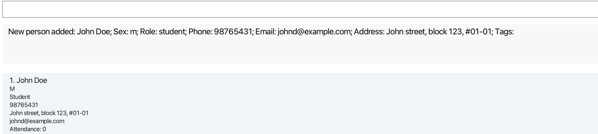
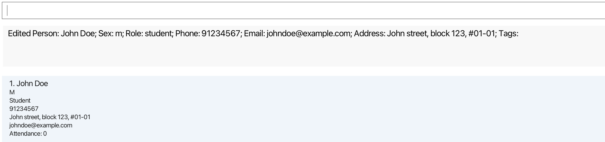
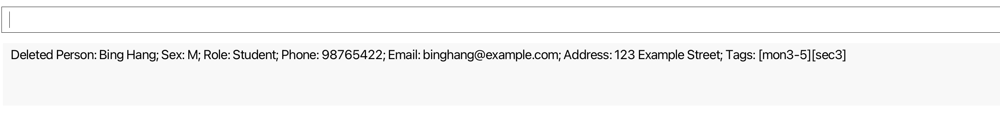

## What is Cher

Cher is a streamlined, user-friendly application designed specifically for private school teachers who manage attendance
and contact information manually. By digitizing these tasks, Cher helps educators save time, improve accuracy, and stay
organized without the complexity of a full learning management system. With a simple command-based interface, Cher enables quick attendance marking,
easy access to student and parent contacts, and efficient data entry that caters to fast typists.
This targeted tool empowers teachers to focus more on student engagement and less on administrative work,
making contact and attendance management easier and more effective.

* Table of Contents
{:toc}
--------------------------------------------------------------------------------------------------------------------

## Target Users of Cher

Cher is tailored specifically for **private secondary school teachers** who are still managing attendance and contact information manually. This app is designed for educators who handle multiple classes and need a reliable, efficient way to track attendance and manage student contact information. Typical users include:

- **Private school teachers** who wish to digitize their class management processes without the complexities of full-scale learning management systems.
- **Tutors and small-class instructors** who handle individual or small-group sessions and need a straightforward tool to record student attendance and contact details.
- **Homeroom or advisory teachers** responsible for regular communication with students and parents, needing quick and organized access to contacts.

Cher addresses the specific needs of these educators by reducing the time and effort spent on manual record-keeping and offering a user-friendly solution that can be easily incorporated into daily routines.

## Value Proposition of Cher

Cher provides a **dedicated digital solution for attendance and contact management**, transforming manual processes into an organized, accessible digital system. Key value points include:

- **Streamlined Attendance Tracking**: Cher enables teachers to mark attendance quickly and retrieve records effortlessly, saving time and improving accuracy over traditional manual tracking.
- **Centralized Contact Management**: Teachers can store, update, and access contact information in one place, making it easier to reach students or their guardians when necessary.
- **User-Focused Simplicity**: Designed with teachers in mind, Cher keeps the interface simple and intuitive, allowing educators to accomplish tasks with minimal effort.
- **Keyboard Efficiency for Fast Data Entry**: The app’s command-based functionality is perfect for teachers who value keyboard efficiency, allowing for quick entries without navigating complex menus.
- **Dependable Organization**: Cher offers features that help teachers categorize, sort, and filter contacts and attendance records, providing quick and organized access to information for better class management.

By catering to private school teachers who are still using manual processes, Cher provides a **faster, more organized way to manage class attendance and contact details**, helping teachers focus more on their students and less on administrative tasks.


## Quick start

1. Ensure you have Java `17` or above installed in your Computer.

1. Download the latest `.jar` file from [here](https://github.com/AY2425S1-CS2103T-W13-1/tp/releases).

1. Copy the file to the folder you want to use as the _home folder_ for Cher.

1. Open a command terminal, `cd` into the folder you put the jar file in, and use the `java -jar cher.jar` command to run the application.<br>
   A GUI similar to the below should appear in a few seconds. Note how the app contains some sample data.<br>
   

1. Type the command in the command box and press Enter to execute it. e.g. typing **`help`** and pressing Enter will open the help window.<br>
   Some example commands you can try:

   * `list` : Lists all contacts.

   * `add n/John Doe r/student p/98765432 e/johnd@example.com a/John street, block 123, #01-01` : Adds a contact named `John Doe` to Cher.

   * `delete 3` : Deletes the 3rd contact shown in the current list.

   * `clear` : Deletes all contacts.

   * `exit` : Exits the app.

1. Refer to the [Features](#features) below for details of each command.

--------------------------------------------------------------------------------------------------------------------

## Features

<div markdown="block" class="alert alert-info">

**information_source: Notes about the command format:**<br>

* Words in `UPPER_CASE` are the parameters to be supplied by the user.<br>
  e.g. in `add n/NAME`, `NAME` is a parameter which can be used as `add n/John Doe`.

* Items in square brackets are optional.<br>
  e.g. `n/NAME [t/TAG]` can be used as `n/John Doe t/friend` or as `n/John Doe`.

* Items with `…`​ after them can be used multiple times including zero times.<br>
  e.g. `[t/TAG]…​` can be used as ` ` (i.e. 0 times), `t/friend`, `t/friend t/family` etc.

* Parameters can be in any order.<br>
  e.g. if the command specifies `n/NAME p/PHONE_NUMBER`, `p/PHONE_NUMBER n/NAME` is also acceptable.

* Extraneous parameters for commands that do not take in parameters (such as `help`, `list`, `exit` and `clear`) will be ignored.<br>
  e.g. if the command specifies `help 123`, it will be interpreted as `help`.

* If you are using a PDF version of this document, be careful when copying and pasting commands that span multiple lines as space characters surrounding line-breaks may be omitted when copied over to the application.
</div>

### Viewing help : `help`

Shows the help window and displays a floating window allowing the user to copy the URL of the user guide page.


Format: `help`


### Adding a person: `add`

Adds a person to Cher.

Format: `add n/NAME s/SEX r/ROLE p/PHONE_NUMBER e/EMAIL a/ADDRESS [t/TAG]…​`

* Name can only contain alphabets and spaces. 
* Role can either be ```student``` or ```parent```, case-insensitive.
* Sex can either be ```f``` or ```m```, case-insensitive.
* Phone numbers can contain only numbers and should be exactly 8 digits long. 

<div markdown="span" class="alert alert-primary">:bulb: Tip:
   
* A person can have any number of tags (including 0)
* Cher considers people with the identical phone numbers as duplicates. You will not be able to add two entries with the same phone number.

</div>

Examples:
* `add n/John Doe s/m r/student p/98765432 e/johnd@example.com a/John street, block 123, #01-01`

   
* `add n/Betsy Crowe s/f r/parent e/betsycrowe@example.com a/Newgate Street p/12345678`

### Listing all persons : `list`

Shows a list of all persons in Cher.

Format: `list`

### Editing a person : `edit`

Edits an existing person in the Cher.

Format: `edit INDEX [n/NAME] [s/SEX] [p/PHONE] [e/EMAIL] [a/ADDRESS] [t/TAG]…​`

* Edits the person at the specified `INDEX`. The index refers to the index number shown in the displayed person list. The index **must be a positive integer** 1, 2, 3, …​
* At least one of the optional fields must be provided.
* Existing values will be updated to the input values.
* When editing tags, the existing tags of the person will be removed i.e. adding of tags is not cumulative.
* You can remove all the person’s tags by typing `t/` without
    specifying any tags after it.
* Note that role cannot be edited. 

Examples:
*  `edit 1 p/91234567 e/johndoe@example.com` Edits the phone number and email address of the 1st person to be `91234567` and `johndoe@example.com` respectively.
   
*  `edit 2 n/Betsy Crower t/` Edits the name of the 2nd person to be `Betsy Crower` and clears all existing tags.

### Locating persons by attributes : `find`

Finds persons whose names contain any of the given keywords.

Format: `find [INDEX] [n/KEYWORDS] [p/PHONE] [e/EMAIL] [a/ADDRESS] [t/TAG]…​`

#### General Rules
* At least one of the optional fields must be provided.
* If no matches to user input are found, an empty list is returned.
* Attribute-Specific Requirements: Each attribute has specific search behaviors (see details below).

#### Index (`INDEX`)
* Finds the person at the specified `INDEX` in the currently displayed list.
* Index **must be a positive integer** (e.g., `1`, `2`, `3`, …).

Examples:
* `list` followed by `find 2` shows the 2nd person in the displayed list.

#### Name (`n/KEYWORDS`)
* The order and case of keywords does not matter. For example, `find n/Hans Bo` will match both `Hans Gruber` and `Bo hans`.
* You can search using a part of any name (first or last) as long as it starts with the given keywords. For example, `find jo ap` would return both `John Appleseed` and `Appleseed Johnny`.

Examples:
* `find n/John` returns `John Doe`, `Johnny Appleseed`
* `find n/alex david` returns `Alex Yeoh`, `David Alex`
* `find n/jo ap` returns `John Appleseed`, `Appleseed Johnny`

#### Tags (`t/TAG`)
* Case-sensitive search
* Only persons with tags that match all the exact tag names provided will be returned.

Examples:
* `find t/friend t/colleague` returns persons tagged as both `friend` and `colleague`


#### Other attributes (`p/PHONE`, `e/EMAIL`, `a/ADDRESS`)
* Case-sensitive search for address and email
* Exact match is required for the attributes, there is no partial match functionality

Examples:
* `find p/12345678` returns only the person with the exact phone number `12345678`
* `find e/johndoe@example.com` returns only persons with the email `johndoe@example.com`
* `find a/123 Clementi Ave 3` returns only persons with the exact address `123 Clementi Ave 3`
   


### Sorting persons: `sort`

Sorts list of persons in a case-insensitive order based on ASCII values, 
meaning letters and numbers are organized as if in alphabetical and numerical order, 
with no distinction between uppercase and lowercase letters.

Format: `sort [name] [role] [phone] [email] [address]`

* Exactly one of the optional fields is required
* The field refers to attributes used to sort the list by.
* The field **must be a valid attribute** name, role, phone, email or address.
* The field is case-insensitive. <br>
e.g. Both `sort name` and `sort NAME` will be accepted.

Examples:
* `sort phone` returns list sorted by phone number.
* `sort name` returns list sorted by name.
  

:exclamation: **Caution:** using `list`, `edit`, `mark`, `unmark`, `batch-mark`, `batch-unmark`, `reset-att`, 
or `add` command after the `sort` command will revert the list to its original, unsorted order.

### Deleting a person : `delete`

Deletes the specified person from Cher.

Format: `delete [INDEX] [n/KEYWORDS] [p/PHONE] [a/ADDRESS] [t/TAG]…​`

#### General Rules
* One of the optional fields must be provided.
* Used to delete an individual contact
* For attributes where duplicates may exist (such as names, addresses, and tags), if multiple matches are found, a list of possible matches will be displayed, allowing the user to choose.
* If no contacts matching the user input are found, an empty list is returned.
* For unique attributes (like index and phone number), Cher will directly delete the matching person.

#### Index (`INDEX`)
* Deletes the person at the specified `INDEX` in the currently displayed list.
* Index **must be a positive integer** (e.g., `1`, `2`, `3`, …).
* The index is unique in the displayed list, so Cher directly deletes the person at that position.

Examples:
* `list` followed by `delete 2` deletes the 2nd person in the displayed list.
* `find n/Betsy` followed by `delete 1` deletes the 1st person in the results of the `find` command.

#### Name (`n/KEYWORDS`)
* The order and case of keywords does not matter. For example, `find n/Hans Bo` will match both `Hans Gruber` and `Bo hans`.
* You can search using a part of any name (first or last) as long as it starts with the given keywords. For example, `find jo ap` would return both `John Appleseed` and `Appleseed Johnny`.
* If there is only a single match, Cher will directly delete the person and an empty list is displayed. Use the list command again to return to the full contact list.
* If multiple persons match the partial name, Cher will display a list of matches for the user to choose from.
  
Examples:
* `list` followed by `delete n/John` deletes the person with the name `John`.
* If multiple persons have the name `John`, a list of these persons is displayed.

#### Phone Number (`p/PHONE`)
* Deletes the person with the specified full phone number.
* Exact match is required, partial phone numbers will not be matched.
* Since phone numbers are unique, Cher will directly delete the person with that phone number.

Examples:
* `list` followed by `delete p/98765432` deletes the person with the phone number `98765432` in the list.

#### Address (`a/ADDRESS`)
* Exact match is required, partial matches are not supported.
* If multiple persons share the same address, Cher will display a list of matching persons for you to choose from.

Examples:
* `delete a/123 Clementi Ave 3` deletes the person with the exact address `123 Clementi Ave 3`.
* If multiple persons have the address `123 Clementi Ave 3` are found , a list of these persons is displayed.

#### Tags (`delete t/TAG…`)

* Case-sensitive search
* Multiple tags can be used for filtering
* Only the persons with tags that match all the exact tag names provided will be deleted.
* If multiple persons match the provided tags, Cher will display a list of matches for selection.

Examples:
* `delete t/mon3-5 t/sec3` deletes the person tagged as both `mon3-5` and `sec3`
  
* If multiple persons have both the tags `mon3-5` and `sec3`, Cher will show a list of these persons for you to choose from.

### Deleting in a batch : `batch-delete`

Delete all contacts from Cher that contain **all** the specified tags.

Format: `batch-delete t/TAG [t/TAG]...`

Examples:


* `batch-delete t/friends` will delete both `Alex Yeoh` and `Bernice Yu`.
* `batch-delete t/friends t/colleagues` will delete only `Bernice Yu`.

### Selecting persons by index: `select`
The `select` command allows users to select one or more persons from the displayed list of persons in the address book. Once a person is selected, the application highlights the selected person(s) in the UI and displays their names in the feedback box.

Format: select INDEX [MORE_INDEXES]...

* INDEX refers to the position of the person in the currently displayed list of persons.
* INDEX **must be a positive integer** that refers to the position of a person in the list (starting from 1).
* You can specify multiple indexes separated by spaces to select more than one person at a time.

Examples:
* `select 3 5 7` will select the contacts at indexes `3`, `5`, and `7` in the displayed list, filtering to show
  only these selected contacts. The person at index 3, 5 and 7 will be selected.
  

Where INDEX refers to the position of the person in the currently displayed list of persons.
- INDEX is a positive integer that refers to the position of a person in the list (starting from 1).
- If multiple persons are selected, the application will filter to show only those selected contacts, and their names will be highlighted in the UI.
- You can specify multiple indexes separated by spaces to select more than one person at a time.

<div markdown="span" class="alert alert-warning">:exclamation: **Caution:**
If you enter duplicate indexes in the `select` command, only the unique persons corresponding to those indexes will be selected. For example, entering `select 1 2 2 2` will only select the persons at indexes `1` and `2`, and the feedback box will display:
"Selected Person(s): [Name of person at index 1], [Name of person at index 2]"
e.g., "Selected Person(s): John Doe, Alice Tan".
</div>


### Mark attendance for a single student: `mark`

Marks the attendance of a specified student.

Format: `mark INDEX`

* Marks the attendance for the student at the specified `INDEX`.
* The index refers to the index number shown in the displayed person list.
* The index **must be a positive integer** 1, 2, 3, …​
* You cannot mark attendance for a parent. 

Example:
* `list` followed by `mark 2` marks the attendance of the 2nd person in the Cher.
  

### Unmark attendance for a single student: `unmark`

Unmarks the attendance of a specified student.

Format: `unmark INDEX`

* Unmarks the attendance for the student at the specified `INDEX`.
* The index refers to the index number shown in the displayed person list.
* The index **must be a positive integer** 1, 2, 3, …​
* You cannot unmark attendance for a parent.
* If the student's attendance count is initially at 0, it will remain at 0 after an unmark. You will receive a corresponding error message. 

Example:
* `list` followed by `unmark 3` unmarks the attendance of the 3rd person in Cher.
  

### Reset attendance: `reset-att`

Resets the attendance count of all students in the displayed list to 0.

Format: `reset-att`

<div markdown="span" class="alert alert-primary">:bulb: Tip:
To reset the attendance count of all students to 0, enter `list` to get a list of all contacts, then enter `reset-att`!
</div>


### Mark attendance for a group of students: `batch-mark`

Marks attendance for all students in the displayed list.

Format: `batch-mark`

* Having parents in the list will not affect the batch marking of student attendance. Parents are ignored. 
* If the list has only parents and no students, you will receive an error message.
* You will return to the list of all contacts after executing the command. 

Example:
* Enter `select 1 2 3` and then `batch-mark` marks the attendance of students at index 1, 2 and 3. Parents are ignored. 
* Enter `find t/tue 4-6` and then `batch-mark` marks the attendance of all students with the tag `tue 4-6`.


### Unmark attendance for a group of students: `batch-unmark`

Unmarks attendance for all students in the displayed list.

Format: `batch-unmark`'

* Having parents in the list will not affect the batch unmarking of student attendance. Parents are ignored.
* If there are students whose attendance is already at 0 in the list, their attendance will remain at 0.
* If the list has only parents and no students, you will receive an error message.
* You will return to the list of all contacts after executing the command. 

Example:
* Enter `select 1 2 3` and then `batch-unmark` unmarks the attendance of students at index 1, 2 and 3. Parents are ignored.
* Enter `list` and then `batch-unmark` unmarks the attendance of all students in Cher.

<div markdown="span" class="alert alert-primary">:bulb: **Tip:**
Use a mix of `find`, `select` and attendance commands to take attendance efficiently. 
 * `find t/tue 4-6` then `batch-mark` will mark attendance for all students with the tag `tue 4-6`. 
 * `select` absentees by index and `batch-unmark` to unmark attendance of any absentees
</div>

Example:
* Enter `select 1 2 3` and then `batch-unmark` unmarks the attendance of entries 1, 2 and 3


### Editing tag in a batch: `batch-edit`
Changes all contacts from cher with containing the specified tags with a new tag. After successful execution,
Cher will show all the contacts containing the new tag.

Format: `batch-edit t/OLDTAG t/NEWTAG`

Examples:

* `batch-edit t/friends t/fren` will change the `friends` tag of both `Alex Yeoh` and `Bernice Yu` to `fren`.
* After successful execution, the contact list will show `Alex Yeoh`, `Bernice Yu` and `Charlotte Oliveiro`
  as they all have the `fren` tag.


### Clearing all entries : `clear`

Clears all entries from Cher.

Format: `clear`


### Exiting the program : `exit`

Exits the program.

Format: `exit`

### Saving the data

Data are saved in the hard disk automatically after any command that changes the data. There is no need to save manually.

### Editing the data file

Data are saved automatically as a JSON file `[JAR file location]/data/cher.json`. Advanced users are welcome to update data directly by editing that data file.

<div markdown="span" class="alert alert-warning">:exclamation: Caution:
If your changes to the data file makes its format invalid, Cher will discard all data and start with an empty data file at the next run. Hence, it is recommended to take a backup of the file before editing it.<br>
Furthermore, certain edits can cause the Cher to behave in unexpected ways (e.g., if a value entered is outside the acceptable range). Therefore, edit the data file only if you are confident that you can update it correctly.
</div>

--------------------------------------------------------------------------------------------------------------------

## FAQ

**Q**: How do I transfer my data to another Computer?<br>
**A**: Install the app in the other computer and overwrite the empty data file it creates with the file that contains the data of your previous Cher home folder.

--------------------------------------------------------------------------------------------------------------------

## Known issues

1. **When using multiple screens**, if you move the application to a secondary screen, and later switch to using only the primary screen, the GUI will open off-screen. The remedy is to delete the `preferences.json` file created by the application before running the application again.
2. **If you minimize the Help Window** and then run the `help` command (or use the `Help` menu, or the keyboard shortcut `F1`) again, the original Help Window will remain minimized, and no new Help Window will appear. The remedy is to manually restore the minimized Help Window.

--------------------------------------------------------------------------------------------------------------------

## Command summary

| Action               | Format, Examples                                                                                                                                                                          |
|----------------------|-------------------------------------------------------------------------------------------------------------------------------------------------------------------------------------------|
| **Add**              | `add n/NAME s/SEX r/ROLE p/PHONE_NUMBER e/EMAIL a/ADDRESS [t/TAG]…​` <br> e.g., `add n/James Ho s/M r/student p/22224444 e/jamesho@example.com a/123, Clementi Rd, 1234665 t/Secondary 1` |
| **Clear**            | `clear`                                                                                                                                                                                   |
| **Delete**           | `delete [INDEX] [n/KEYWORDS] [p/PHONE] [a/ADDRESS] [t/TAG]…​`<br> e.g., `delete 3`                                                                                                        |
| **Batch-Delete**     | `batch-delete t/TAG [t/TAG]...`<br> e.g. `batch-delete t/friends t/colleagues t/owesmoney t/...`                                                                                          |
| **Batch-Edit**       | `batch-edit t/OLDTAG t/NEWTAG`<br> e.g. `batch-delete t/friends t/frens`                                                                                                                  |
| **Edit**             | `edit INDEX [n/NAME] [s/SEX] [p/PHONE_NUMBER] [e/EMAIL] [a/ADDRESS] [t/TAG]…​`<br> e.g.,`edit 2 n/James Lee e/jameslee@example.com`                                                       |
| **Find**             | `find [INDEX] [n/KEYWORDS] [p/PHONE] [a/ADDRESS] [t/TAG]…​`<br> e.g., `find n/James Jake`                                                                                                 |
| **Sort**             | `sort [name] [role] [phone] [email] [address] `<br> Only one optional field should be given <br> e.g., `sort name`                                                                        |
| **Select**           | `select INDEX [MORE_INDEXES]...`<br> e.g., `select 1 2`                                                                                                                                   |
| **Mark**             | `mark INDEX` <br> e.g., `mark 2`                                                                                                                                                          |
| **Unmark**           | `unmark INDEX` <br> e.g., `unmark 3`                                                                                                                                                      |
| **Batch-Mark**       | `batch-mark`                                                                                                                                                                              |
| **Batch-Unmark**     | `batch-unmark`                                                                                                                                                                            |
| **Reset-Attendance** | `reset-att`                                                                                                                                                                               |
| **List**             | `list`                                                                                                                                                                                    |
| **Help**             | `help`                                                                                                                                                                                    |
