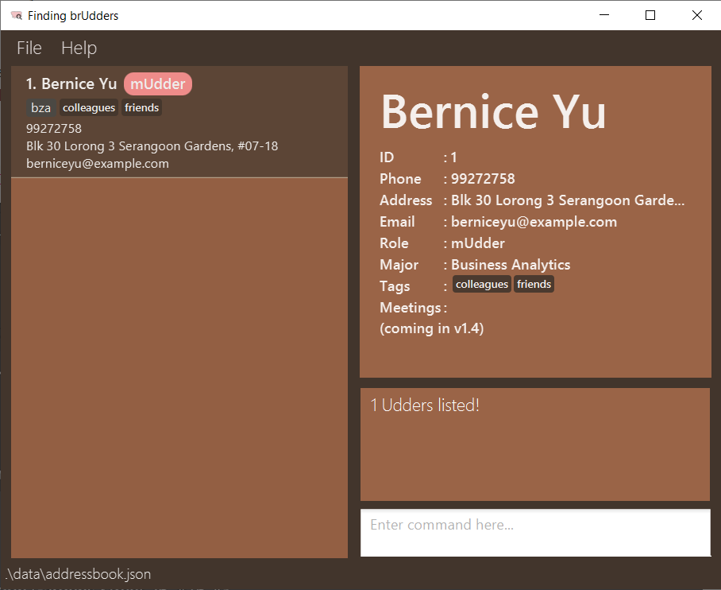

MediBase3 (MB3) is a **desktop app for doctors, offering an all-in-one solution to manage patient records with ease.** From tracking medical conditions, allergies, and priorities to even scheduling appointments, MediBase3 takes care of it so you can focus more on your patients.

Optimised via combining both Command Line Interface (CLI) and an intuitive Graphical User Interface (GUI), if you can type fast, MediBase3 can get your patient management tasks done faster than traditional GUI apps.

## Table of Contents

* Table of Contents
{:toc}

<div style="page-break-after: always;"></div>

## How to use this User Guide
Our user guide is tailored to ensure you can fully unlock the potential of MediBase3, whether you're new to MediBase3 or have been using the application for quite some time.
In this section, we aim to provide you with the necessary tools to effectively navigate and utilize the guide.

Each aspect of MediBase3 is split into different sections, which are accessible via the Table of Contents above.

**For new MediBase3 users:**
1. We **recommend** that you refer to the [Glossary](#glossary) section to understand the key terms used in the guide.
1. Once you are done, do head to the [Quick Start](#quick-start) section to get started with setting up MediBase3.

**For experienced MediBase3 users:**
1. If you need a quick refresher on how to use a specific feature in MediBase3, you can navigate to the [Features](#features) section.
1. You may also skip to the [Command Summary](#command-summary) section for a quick overview of all available commands in MediBase3 and their formats.

For any additional information or queries, you can refer to the [FAQ](#faq) section or the [Known Issues](#known-issues) section.

[Back to Table of Contents](#table-of-contents)

<div style="page-break-after: always;"></div>

## Quick Start

In this section, let's learn how to set up MediBase3 on your computer.

### Installing MediBase3

#### Step 1: Check if you have Java 17 installed on your system.

Before running MediBase3, ensure that **Java 17** is installed on your system.

Open **Command Prompt** (Windows) or **Terminal** (macOS/Ubuntu/Debian) and type:
> ```
> java -version
> ```  

If you are using Windows, you should see something like:

{: .alert .alert-secondary}
>
>  
>**Java Version in Windows**

This means that your machine is running Java version 17.0.12, which means that Java 17 is installed.

if you are using macOS, Ubuntu or Debian, you should see something like this:

{: .alert .alert-secondary}
>
>  
>**Java Version in Mac**

This means that your machine is running Java version 17.0.11, which means that Java 17 is installed.


If your machine is **not running Java 17**, you may refer to the [FAQ section](#faq) for instructions on installing Java 17. 


#### Step 2: Download the MediBase3 JAR File

1. Go to [this link](https://github.com/AY2425S1-CS2103T-F12-3/tp/releases/download/v1.5/medibase3.jar) and scroll down all the way to 'Assets'.  You should see something like this:

   {: .alert .alert-secondary}
   >
   >
   >**Asset Files in GitHub**

1. Click on `medibase3.jar` to download the latest MediBase3 JAR File.
2. Save the file to a location of your choice (e.g., `Downloads` folder).

### Launching MediBase3

1. Open **Command Prompt** (Windows) or **Terminal** (macOS/Ubuntu/Debian).
2. Navigate to the directory where the `.jar` file is located. For example:
> ```
> cd Downloads
> ```
3. Run the application by typing:
> ```
> java -jar medibase3.jar
> ```

You should be greeted by the GUI, which you will see in the next section.

### Overview of the GUI

{: .alert .alert-secondary}
>
>
>**Overview of the Graphics User Interface**

Once MediBase3 is running, you will see the main interface, as seen in the image above. It is segmented into different **panel**s. Here’s an overview of the key panels:

- **Command Box:** Where you can type and enter commands.
- **Result Display:** Shows the result of the command you entered.
- **Patient List:** Displays all the patients currently stored in the system.
- **Appointment List:** Displays the scheduled appointments for patients in chronological order.
- **Menu (File/Help):** Provides additional options for managing the app (e.g., exit, access help).
- **Data Storage Location Footer:** Displays the location where patient and appointment data are stored.

### Overview of CLI

MediBase3 can be controlled using commands in the **Command Line Interface (CLI)**.

#### CLI Command Structure

Each command in MediBase3 follows a structured format to ensure consistency and ease of use.

The example below demonstrates this structure:

{: .alert .alert-secondary}
>
>  
>**Anatomy of the Command Structure**

This example shows how a typical command might look in MediBase3, with three main components:

| **Component** | **Description**                                                              |
|---------------|------------------------------------------------------------------------------|
| **Command**   | The action you want to perform (e.g., `add`, `edit`)                         |
| **Prefix**    | Identifies the data being entered (e.g., `n/` for name)                      |
| **Parameter** | The value associated with the prefix (e.g., `John Doe`)                      |
| **Preamble**  | The value immediately after the command with no prefixes (e.g., `S1234567A`) |

{: .alert .alert-info}
> :information_source: **Note:**
>
> * This example is provided to give a general idea of the command structure. Actual commands may vary depending on the specific action and data required.

#### Example:
>```
> add n/John Doe i/S1234567A d/2000-01-01 g/M p/98765432 
> e/johnd@example.com a/311, Clementi Ave 2, #02-25
>```

- **Command:** `add`
- **Prefix:** `n/` (name), `i/` (NRIC), `d` (date of birth), `g` (gender), `p/` (phone), `e/` (email), `a/` (address)
- **Parameter:** `John Doe`, `S1234567A`, `2000-01-01`, `g`, `98765432`, `johndoe@example.com`, `311, Clementi Ave 2, #02-25`

<div style="page-break-after: always;"></div>

### A First Look at MediBase3

Here are some basic commands to get you started.

1. `help`: Opens the help window.

2. `add n/John Doe i/S1234567A d/2000-01-01 g/M p/98765432 e/johnd@example.com a/311, Clementi Ave 2, #02-25`:  
   Adds a patient named John Doe to the system.

3. `edit S1234567A p/91234567 e/johndoe@example.com`:  
   Edits the phone number and email of the patient with NRIC `S1234567A`.

4. `findNric T0123456A`:  
   Finds and displays the patient with NRIC `T0123456A`.

5. `delete T0123456A`:  
   Deletes the patient with NRIC `T0123456A`.

6. `clear`:  
   Clears all patient and appointment data from the system.

[Back to Table of Contents](#table-of-contents)


You’re now ready to start using MediBase3.  
For a detailed list of features and instructions, see the [Features](#features) section.  
For additional assistance or common questions, please refer to our [FAQ](#faq) section.

[Back to Table of Contents](#table-of-contents)

<div style="page-break-after: always;"></div>

## Features

### Parameter Details
The table below provides a brief explanation of each parameter associated with a patient in MediBase3. It also details
the constraints of each parameter when used in a command.

{: .alert .alert-warning}
> :exclamation: **Caution:** 
>
> Ensure that all parameters adhere to the constraints mentioned below. 
> Otherwise, the command will not be executed, and an error message will be displayed.


| Parameter          | Definition                                                                                                 | Constraints                                                                                                                                                                                                                                                                                                                                                                            | Examples                                                                                                                          |
|--------------------|------------------------------------------------------------------------------------------------------------|----------------------------------------------------------------------------------------------------------------------------------------------------------------------------------------------------------------------------------------------------------------------------------------------------------------------------------------------------------------------------------------|-----------------------------------------------------------------------------------------------------------------------------------|
| `NAME`             | Name of the patient                                                                                        | - Only alphanumeric characters and spaces are allowed.<br> - Should not be blank. <br> - In the case where `s/o` or `d/o` should be used in a name, you can use alternatives such as `s o` or `son of`                                                                                                                                                                                 | :white_check_mark: `John Doe`<br>:x: `$ally`                                                                                      |
| `NRIC`             | Singapore National Registration Identity Card (NRIC) number of the patient. It is unique for all patients. | - Case-insensitive. <br> - Should not be blank. <br> - Should start with a letter (S, T, G, F or M), followed by 7 digits, and end with a letter.                                                                                                                                                                                                                                      | :white_check_mark: `S1234567A` <br> :white_check_mark: `t1234567b` <br> :x: `1234567A`                                            |
| `DOB`              | Date of birth (DOB) of the patient.                                                                        | - Should be in the format `YYYY-MM-DD`. <br> - Should not be blank. <br> - Cannot be a date in the future.                                                                                                                                                                                                                                                                             | :white_check_mark: `2002-12-12` <br> :x: `2002/11/32`                                                                             |
| `GENDER`           | Gender of the patient.                                                                                     | - Case-insensitive. <br> - Should only be either `M` (Male) or `F` (Female). <br> - Should not be blank                                                                                                                                                                                                                                                                                | :white_check_mark: `m`<br> :white_check_mark: `F`<br> :x: `Male`                                                                  |
| `EMAIL`            | Email address of the patient.                                                                              | - Should be in the format `local-part@domain`. <br> - Should not be blank. <br> - The `local-part` should only contain alphanumeric characters and these special characters, excluding the parentheses, (+_.-). The `local-part` may not start or end with any special characters. <br> - The `domain` must be at least 2 characters long, start and end with alphanumeric characters. | :white_check_mark: `raj@gmail.com`<br>:x: `raj`                                                                                   |
| `ADDRESS`          | Address of the patient.                                                                                    | - Any value is allowed. <br> - Should not be blank.                                                                                                                                                                                                                                                                                                                                    | :white_check_mark: `Orchard Road, Block 124, #02-01`                                                                              |
| `PHONE`            | Phone number of the patient.                                                                               | - Should only contain numbers.<br> - Should be at least 3 digits long <br> - Should not be blank. <br> - There is no limit on the length of phone number accepted, in order to accommodate international phone numbers.                                                                                                                                                                | :white_check_mark: `98765432`<br>:x: `+65 9876 5432`                                                                              |
| `ALLERGY`          | Allergy of the patient.                                                                                    | - Only alphanumeric characters are allowed.<br> - Should not exceed 30 characters long <br> - Should not be blank.                                                                                                                                                                                                                                                                     | :white_check_mark: `Peanuts`<br>:x: `Pe@nuts`                                                                                     |
| `PRIORITY`         | Priority of the patient.                                                                                   | - Should only contain `NONE`, `LOW`, `MEDIUM` or `HIGH`. <br> - Case-insensitive. <br> - Should not be blank.                                                                                                                                                                                                                                                                          | :white_check_mark: `NONE` <br> :white_check_mark: `high` <br> :x: `Highpriority`                                                  |
| `CONDITION`        | Medical Condition of the patient.                                                                          | - Should contain only alphabets or alphanumerics. <br> - It must be no more than 30 characters. <br> - Should not be blank.                                                                                                                                                                                                                                                            | :white_check_mark: `High Blood Pressure` <br> :x: `@high-bp`                                                                      |
| `APPOINTMENT_DATE` | Appointment date of the patient.                                                                           | - Should be in the format `YYYY-MM-DD`. <br> - Should not be blank.                                                                                                                                                                                                                                                                                                                    | :white_check_mark: `2024-10-27` <br> :x: `2022/10/27` <br> :x: `2024-02-31`                                                       |
| `APPOINTMENT_TIME` | Appointment time of the patient.                                                                           | - Must be in the format `HHMM-HHMM` (24-hour clock interval). <br> - Time format should be (start time - end time) with start time earlier than end time. <br> - Start and end times should not equal. <br> - Should not be blank.                                                                                                                                                     | :white_check_mark: `0900-1100` <br> :white_check_mark: `2330-2359` <br> :x: `0900-0900` <br> :x: `1400-1300` <br> :x: `2200-0000` |
| `APPOINTMENT_NAME` | Description of the appointment with the patient.                                                           | - Must be less than 30 characters. <br> - Only alphanumeric characters are allowed. <br> - Should not be blank                                                                                                                                                                                                                                                                         | :white_check_mark: `Dental` <br> :white_check_mark: `FollowUp1` <br> :x: `Follow-up#1`                                            |


[Back to Table of Contents](#table-of-contents)

<div style="page-break-after: always;"></div>

{: .alert .alert-info}
> **:information_source: Notes about the command format:**
> 
> * Words in `UPPER_CASE` are the parameters to be supplied by the user.
> e.g. in `add n/NAME i/NRIC g/GENDER d/DOB p/PHONE e/EMAIL a/ADDRESS`, `NAME` is a parameter which can be used as `n/John Doe`.
>
> * Items in square brackets are optional.
>  e.g `edit NRIC [n/NAME] [i/NRIC] [g/GENDER] [d/DOB] [p/PHONE] [e/EMAIL] [a/ADDRESS]` can be used as `edit S1234567A n/John Lim g/M` or as `edit S1234567A g/M`.
>
> * Items with `…` after them can be used multiple times.
>  e.g. `c/CONDITION…` can be used as, `c/Knee Pain`, `c/Flu c/Fever` etc.
>
> * Parameters that have a prefix can be in any order.
> e.g. if the command specifies `n/NAME p/PHONE`, `p/PHONE n/NAME` is also acceptable.
>
> * Parameters that have no prefix must follow the specified order in the command format.
> e.g. if the command specifies `NRIC n/NAME p/PHONE`, `NRIC` must take precedence over `n/NAME` and `p/PHONE`.
> 
> * Extraneous parameters for commands that do not take in parameters (such as `help`, `list`, `exit` and `clear`) will be ignored.
> e.g. if the command specifies `help 123`, it will be interpreted as `help`.
>
> * The command name and prefixes are case-insensitive.
> e.g. `add` is the same as `ADD`, `c/` is the same as `C/`.
>
> * If you are using a PDF version of this document, be careful when copying and pasting commands that span multiple lines as space characters surrounding line-breaks may be omitted when copied over to the application.

{: .alert .alert-info}
> :information_source: **General Behavior:**
>
> All commands (except those in the **Finding Patients** section) will refresh the Patient List Panel to show all patients upon successful execution. This applies to commands for managing patients, appointments, medical conditions, allergies, and priority.


<div style="page-break-after: always;"></div>

### Managing Patient

#### Adding a patient: `add`

Adds a patient and his/her relevant details to MediBase3.

**Format**: `add n/NAME i/NRIC g/GENDER d/DOB p/PHONE e/EMAIL a/ADDRESS`

{: .alert .alert-info}
> :information_source: **Notes:**
> 
> * All fields are compulsory and must be non-empty.
> * If the `NRIC` provided already exists in MediBase3, an error message will be displayed, and the patient will not be added.
> * The new patient will be added to the end of the Patient List Panel.
> * Refer to the [Parameter Details](#parameter-details) section for more information on the purpose and constraints of each parameter.

**Examples**:
* `add n/John Doe i/S1234567A g/M d/2002-12-12 p/98765432 e/johnd@example.com a/Orchard Road, Block 124, #02-01` adds a patient named `John Doe` with the respective NRIC, gender, date of birth, phone number, email and address provided into MediBase3.

{: .alert .alert-success}
> :bulb: **Tips:**
> 
> * Remember that `NRIC` and `GENDER` are case-insensitive.
>   -  e.g. `i/s1234567a` and `i/S1234567A` are both equivalent.
> * Made a mistake or a typo? You can use the [`edit` command](#editing-a-patient--edit) to update the patient's details.

[Back to Table of Contents](#table-of-contents)

#### Deleting a patient : `delete`

Deletes a patient and his/her details from MediBase3.

**Format**: `delete NRIC`

{: .alert .alert-info}
> :information_source: **Notes:**
> 
> * Deletes the patient with the specified `NRIC` from MediBase3.
> * The `NRIC` provided must be the full NRIC of the patient to be deleted.
    >   - e.g. `S1234567A` (not partial, like `S123`).
> * Refer to [Parameter Details](#parameter-details) for NRIC constraints.

**Example**:
* `delete S1234567A` deletes the patient with the NRIC `S1234567A`.

{: .alert .alert-warning}
> :exclamation: **Caution:**
> 
> * Patient information **cannot be recovered** once deleted. Double-check the `NRIC` before deletion.
> * Deleting a patient also removes all associated appointments from the Appointment List Panel.

[Back to Table of Contents](#table-of-contents)

#### Editing a patient : `edit`

Edits an existing patient details in MediBase3.

**Format**: `edit NRIC [n/NAME] [i/NRIC] [g/GENDER] [d/DOB] [p/PHONE] [e/EMAIL] [a/ADDRESS]`

{: .alert .alert-info}
> :information_source: **Notes:**
> 
> * Edits the patient with the specified `NRIC` in MediBase3.
> * The NRIC provided must be the full NRIC of the patient to be edited. 
>   - e.g. `S1234567A` (not partial, like `S123`).
> * **At least one** of the optional fields must be provided. 
>   - e.g. `edit S1234567A` is invalid.
> * Existing values will be updated to the given input values.
> * Refer to [Parameter Details](#parameter-details) for constraints on each parameter.

**Example**:
*  `edit S1234567A p/91234567 e/johndoe@example.com` will edit the phone number and email address of the patient with the NRIC`S1234567A`
to `91234567` and `johndoe@example.com` respectively.

{: .alert .alert-success}
> :bulb: **Tip:**
> 
> Editing the patient's `NAME` or `NRIC` will also update his/her associated appointments in the Appointment List Panel to reflect the change.

[Back to Table of Contents](#table-of-contents)

<div style="page-break-after: always;"></div>

### Managing Appointments

#### Adding an Appointment : `addAppt`

Schedules an appointment for a patient in MediBase3.

**Format**: `addAppt APPOINTMENT_NAME i/NRIC @d/APPOINTMENT_DATE @t/APPOINTMENT_TIME`

{: .alert .alert-info}
> :information_source: **Notes:**
>
> * Adds an appointment with the specified `APPOINTMENT_NAME`, `APPOINTMENT_DATE`, and `APPOINTMENT_TIME` for the patient identified by `NRIC`.
> * Refer to [Parameter Details](#parameter-details) for constraints on each parameter.


{: .alert .alert-warning}
> :exclamation: **Caution:**
>
> * For each patient, appointment times cannot overlap.
> * Earliest valid appointment time is `0000`, and latest is `2359`.
> * Appointments cannot span across date boundaries

**Example**:
* `addAppt Dental i/S1234567A @d/2024-10-27 @t/1100-1200` schedules a `Dental` appointment for the patient with `NRIC` `S1234567A` on `2024-10-27`, from `1100` to `1200`.

{: .alert .alert-secondary}
> 
>   
> **Success message, with the "Dental" appointment in the details of patient "Alex Yeoh (S1234567A)" in the patient list panel, as well as in the appointment list panel as the second entry.**

{: .alert .alert-success}
> :bulb: **Tips:**
>
> * Adding a new appointment will update the Appointment List Panel on the right with the new appointment details.
> * Appointment names need not be unique.
> * Different patients may have overlapping appointment timings, as long as those appointments are not from the same patient.
> * For appointments that span across date boundaries, add two appointments:
>   * End the first appointment at `2359` (e.g., `addAppt Transfusion i/S1234567A @d/2024-10-23 @t/2200-2359`).
>   * Start the next appointment at `0000` on the following date (e.g., `addAppt Transfusion i/S1234567A @d/2024-10-24 @t/0000-0100`).
> * Appointment end times are **exclusive**. For example:
>   * If _Appointment A_ is scheduled from `1200` to `1300`, _Appointment B_ can start at `1300`.
>   * _Appointment B_ cannot start between `1200` and `1259`, nor end between `1201` and `1300`.

[Back to Table of Contents](#table-of-contents)

#### Deleting an Appointment : `delAppt`

Deletes a scheduled appointment from MediBase3.

**Format**: `delAppt i/NRIC @d/APPOINTMENT_DATE @t/APPOINTMENT_TIME`

{: .alert .alert-info}
> :information_source: **Notes:**
>
> * Only `NRIC`, `APPOINTMENT_DATE`, and `APPOINTMENT_TIME` are required; `APPOINTMENT_NAME` is not needed.
> * Refer to [Parameter Details](#parameter-details) for constraints on each parameter.

Example:
* `delAppt i/S1234567A @d/2024-10-27 @t/1100-1200` deletes an appointment on `2024-10-27` from `1100` to `1200` for the patient with `NRIC` `S1234567A`.

[Back to Table of Contents](#table-of-contents)

<div style="page-break-after: always;"></div>

### Managing Medical Conditions

#### Adding Medical Conditions : `addMedCon`

Adds one or more medical conditions to an existing patient in MediBase3.

**Format**: `addMedCon i/NRIC c/CONDITION...`

{: .alert .alert-info}
> :information_source: **Notes:**
>
> * Adds the specified `CONDITION` to the patient identified by `NRIC` in MediBase3.
> * **At least one** `CONDITION` must be provided. 
>   - e.g. `addMedCon i/S1234567A` is invalid.
> * Each medical condition can only be added once per patient.
> * Refer to [Parameter Details](#parameter-details) for constraints on each parameter.

**Example**:
* `addMedCon i/S1234567A c/High Blood Pressure` adds the condition `High Blood Pressure` to the patient with `NRIC` `S1234567A`.


{: .alert .alert-secondary}
>
>  
> **Success message, with the "HIGH BLOOD PRESSURE" condition in the details of patient "Alex Yeoh (S1234567A)" in the patient list panel**

{: .alert .alert-success}
> :bulb: **Tips:**
> 
> * `CONDITION` is case-insensitive.
>   - e.g. `addMedCon i/S1234567A c/Flu` will add the medical condition `FLU` to the patient with the NRIC `S1234567A`.
> * You can add multiple medical conditions to a patient by using multiple `c/CONDITION`parameters
>   - e.g. `addMedCon i/S1234567C c/High Blood Pressure c/Osteoporosis`

[Back to Table of Contents](#table-of-contents)

#### Deleting Medical Conditions : `delMedCon`

Deletes one or more medical conditions from an existing patient in MediBase3.

**Format**: `delMedCon i/NRIC c/CONDITION...`

{: .alert .alert-info}
> :information_source: **Notes:**
>
> * Deletes the specified `CONDITION` from the patient identified by `NRIC` in MediBase3.
> * **At least one** `CONDITION` must be provided. 
>   - e.g. `delMedCon i/S1234567A` is invalid.
> * The patient must have the specified condition for it to be removed; otherwise, an error message will display.
> * Refer to [Parameter Details](#parameter-details) for constraints on each parameter.

**Example**:
* `delMedCon i/S1234567A c/High Blood Pressure` deletes `High Blood Pressure` from the patient with `NRIC` `S1234567A`.

{: .alert .alert-success}
> :bulb: **Tips:**
> * `CONDITION` is case-insensitive.
>   - e.g. `delMedCon i/S1234567A c/Flu` will delete the medical condition `FLU` from the patient with the NRIC `S1234567A`.
> * You can delete multiple medical conditions from a patient by using multiple `c/CONDITION`parameters
>   - e.g. `delMedCon i/S1234567C c/High Blood Pressure c/Osteoporosis`

[Back to Table of Contents](#table-of-contents)

<div style="page-break-after: always;"></div>

### Managing Allergies

#### Adding an allergy: `addAllergy`

Adds one or more allergies to an existing patient in MediBase3.

**Format**: `addAllergy i/NRIC al/ALLERGY…`

{: .alert .alert-info}
> :information_source: **Notes:**
>
> * Adds the specified `ALLERGY` to the patient identified by `NRIC` in MediBase3.
> * **At least one** `ALLERGY` must be provided. 
>   - e.g. `addAllergy i/S1234567A` is invalid.
> * Each allergy can only be added once per patient.
> * Refer to [Parameter Details](#parameter-details) for constraints on each parameter.

**Example**:
* `addAllergy i/S1234567A al/Peanuts` adds the allergy `Peanuts` to the patient with `NRIC` `S1234567A`.

{: .alert .alert-secondary}
>
>  
> **Success message, with the "PEANUTS" in the details of patient "Alex Yeoh (S1234567A)" in the patient list panel**

{: .alert .alert-success}
> :bulb: **Tips:**
> 
> * `ALLERGY` is case-insensitive.
>   - e.g. `addAllergy i/S1234567A al/Peanuts` will add the allergy `PEANUTS` to the patient with the NRIC `S1234567A`.
> * You can add multiple allergies to a patient by using multiple `al/ALLERGY` parameters.
>   - e.g. `addAllergy i/S1234567A al/Peanuts al/Dust al/Pollen`


[Back to Table of Contents](#table-of-contents)

#### Deleting an allergy: `delAllergy`

Deletes one or more allergies from an existing patient in MediBase3.

**Format**: `delAllergy i/NRIC al/ALLERGY…`

{: .alert .alert-info}
> :information_source: **Notes:**
>
> * Deletes the specified `ALLERGY` for the patient identified by `NRIC` in MediBase3.
> * **At least one** `ALLERGY` must be provided. 
>   - e.g. `delAllergy i/S1234567A` is invalid.
> * The patient must have the specified `ALLERGY` for it to be removed; otherwise, an error message will be displayed.
> * Refer to [Parameter Details](#parameter-details) for constraints on each parameter.

**Example**:
* `delAllergy i/S1234567A al/Peanuts` deletes the allergy `Peanuts` from the patient with `NRIC` `S1234567A`.

{: .alert .alert-success}
> :bulb: **Tips:**
>
> * `ALLERGY` is case-insensitive.
>   - e.g. `delAllergy i/S1234567A al/Peanuts` will delete the allergy `PEANUTS` from the patient with the NRIC `S1234567A`.
> * You can delete multiple allergies from a patient by using multiple `al/ALLERGY` parameters.
>   - e.g. `delAllergy i/S1234567A al/Peanuts al/Dust al/Pollen`

[Back to Table of Contents](#table-of-contents)

<div style="page-break-after: always;"></div>

### Managing Priority

#### Setting Priority : `setPriority`

Sets Priority to an existing patient in MediBase3.

**Format**: `setPriority i/NRIC !/PRIORITY`

{: .alert .alert-info}
> :information_source: **Notes:**
>
> * Sets Priority to the patient with the specified `NRIC` in MediBase3.
> * On default Patient has been set to `NONE` Priority level.
> * Refer to [Parameter Details](#parameter-details) for constraints on each parameter.

**Example**:
* `setPriority i/S1234567A !/HIGH` will set the Priority of patient with NRIC `S1234567A` to `HIGH`.

{: .alert .alert-secondary}
>
>  
> **Success message, with the priority of the patient "Alex Yeoh (S1234567A)" tagged as "HIGH" in the patient list panel**

[Back to Table of Contents](#table-of-contents)

<div style="page-break-after: always;"></div>

### Finding Patients

{: .alert .alert-info}
> :information_source: **Notes:**
> 
> * The following commands in this section will alter the view of the Patient List Panel to display only patients that match the given criteria.
> * They will not alter the view of the Appointment List Panel.

#### Listing all patients : `list`

Shows a list of all patients in MediBase3.

**Format**: `list`

{: .alert .alert-success}
> :bulb: **Tip:**
>
> If you have used any other commands under the [Finding Patients](#finding-patients) section to alter the view of the Patient List Panel, 
> you can use this command to reset to the default view to view all patients.

[Back to Table of Contents](#table-of-contents)

#### Listing all patients by his/her priority: `listPrio`

Shows a list of all patients with a specific `PRIORITY` in MediBase3.

**Format**: `listPrio !/PRIORITY`

{: .alert .alert-info}
> :information_source: **Notes:**
> 
> * An empty Patient List Panel will be displayed if no patients with the given `PRIORITY` are found.
> * `PRIORITY` must adhere to the constraints mentioned in the [Parameter Details](#parameter-details) section. 

**Example**:
* `listPrio !/High` will display all patients with the priority `HIGH`.

[Back to Table of Contents](#table-of-contents)

#### Locating patients by name: `find`

Finds patients whose names contain any of the given keywords.

**Format**: `find KEYWORD [MORE_KEYWORDS]…`

{: .alert .alert-info} 
> :information_source: **Notes:**
> 
> * The search is case-insensitive. e.g. `hans` will match `Hans`
> * The order of the keywords does not matter. e.g. `Hans Bo` will match `Bo Hans`
> * Only the name is searched.
> * Only **full words** will be matched e.g. `Han` will not match `Hans`
> * Patients matching at least one keyword will be returned (i.e. `OR` search).
>   - e.g. `Hans Bo` will return `Hans Gruber`, `Bo Yang`
> * Returns an empty patient list panel if no matching patients with the given keywords are found.

**Example**:
* `find John` returns `john` and `John Doe`
* `find alex david` returns `Alex Yeoh`, `David Li`

{: .alert .alert-secondary}
>
>  
> **Success message of `find alex david` with patient names matching `alex` or `david` shown in the patient list panel**

[Back to Table of Contents](#table-of-contents)

#### Locating patients by medical condition: `findMedCon`

Finds patients whose medical condition(s) contain the given keywords.

**Format**: `findMedCon KEYWORD [MORE_KEYWORDS]…`

{: .alert .alert-info}
> :information_source: **Notes:**
>
> * The search is case-insensitive. e.g `diabetes` will match `Diabetes`
> * The order of the keywords does not matter. e.g. `diabetes arthritis` will match `arthritis` and `diabetes` 
> * Only the medical condition is searched.
> * Only **full words** will be matched e.g. `diabetes` will not match `diabete`
> * Patients with medical conditions matching at least one keyword will be returned (i.e. `OR` search).
> * Returns an empty Patient List Panel if no matching patients with the given keywords are found.

Example:
 * `findMedCon diabetes arthritis` returns `Alex Yeoh` and `David Li`

{: .alert .alert-secondary}
>
>  
> **Success message with patient tagged with `diabetes` or `arthritis` shown in the patient list panel**

[Back to Table of Contents](#table-of-contents)

#### Locating patient by NRIC: `findNric`

Finds patients based on his/her NRIC.

**Format**: `findNric NRIC`

{: .alert .alert-info}
> :information_source: **Notes:**
> 
> * The search is case-insensitive. e.g `S1234567a` will match `S1234567A`
> * Only the `NRIC` is searched.
> * The NRIC provided must be the full NRIC of the patient. e.g. `S1234567A` and not `S123`.
> * Returns an empty Patient List Panel if no matching patients with the given `NRIC` are found.
> * `NRIC` must adhere to the constraints mentioned in the [Parameter Details](#parameter-details) section.

Example:
* `findNric S1234567A` returns `Alex Yeoh`

{: .alert .alert-secondary}
>
>  
> **Success message with patient `Alex Yeoh (S1234567A)` shown in the patient list panel**

[Back to Table of Contents](#table-of-contents)

<div style="page-break-after: always;"></div>

### General Features

#### Command History

You can navigate between previous successful commands and your current command by pressing the `UP` and `DOWN` arrow keys.

#### Viewing help : `help`

Shows a message explaining how to access the help page.

Format: `help`

{: .alert .alert-secondary}
>
>  
>**Help message popup shown**

{: .alert .alert-success}
> :bulb: **Tip:**
> 
> You can also access this message by clicking on the `Help` button or by pressing `F1` on your keyboard.


#### Clearing all entries : `clear`

Clears all entries from the MediBase3 database. 

Format: `clear`

{: .alert .alert-warning}
> :exclamation: **Caution:**
>
> Using the clear command will **REMOVE** all your patient and appointment data from MediBase3. This action is irreversible.


#### Exiting the program : `exit`

Exits the program.

Format: `exit`


#### Saving the data

MediBase3 data are saved in the hard disk automatically after any command that changes the data. There is no need to save manually.


#### Editing the data file

MediBase3 data are saved automatically as a JSON file located at: `[JAR file location]/data/MediBase3.json`. Advanced users are welcome to update data directly by editing that data file.


{: .alert .alert-warning}
> :exclamation: **Caution:**
> 
> If your changes to the data file makes its format invalid, MediBase3 will discard all data and start with an empty data file at the next run. Hence, it is recommended to take a backup of the file before editing it.
>
> Furthermore, certain edits can cause the MediBase3 to behave in unexpected ways (e.g., if a value entered is outside of the acceptable range). Therefore, edit the data file only if you are confident that you can update it correctly.

[Back to Table of Contents](#table-of-contents)

<div style="page-break-after: always;"></div>

## Glossary

The table below provides the definitions for the key terms we will be using throughout the guide.

|-----------|------------------------------------------------------------------------------------------------------------------------------------------------------------------------------------|
| Term      | Definition                                                                                                                                                                         |
|-----------|------------------------------------------------------------------------------------------------------------------------------------------------------------------------------------|
| Command   | An input that is given to the application to perform a specific action. Commands are typically entered via the command box in the application.                                     |
| CLI       | Command Line Interface (CLI) is a type of text-based interface that is used to interact with software via commands.                                                                |
| GUI       | Graphical User Interface (GUI) is a type of interface that allows users to interact with electronic devices through graphical icons and visual indicators.                         |
| JAR       | Java ARchive (JAR) is a package file format typically used to aggregate many Java class files and associated metadata and resources into one file for distribution.                |
| JSON      | JavaScript Object Notation (JSON) is a lightweight data-interchange format that is easy for humans to read and write and easy for machines to parse and generate.                  |
| Panel     | Region in the GUI that displays a particular item.                                                                                                                                 |
| Parameter | A parameter refers to a field that requires input from the user. For example, in the command `delete i/S1234567A`, `i/S1234567A` is a parameter.                                   |
| Prefix    | A prefix is a keyword that is used to identify the type of parameter that follows it. For example, in the command `delete i/S1234567A`, `i/` is the prefix for the NRIC parameter. |
| Preamble  | A preamble refers to text before the first valid prefix.                                                                                                                           |

[Back to Table of Contents](#table-of-contents)

## FAQ

#### **Q**: How do I transfer my data to another computer?
 - **A**: Install the app in the other computer and overwrite the empty data file it creates with the file that contains the data of your previous MediBase3 home folder.

#### **Q**: How do we open the command terminal?
 - **A**: Windows - Press `Win + R`, type `cmd` and press `Enter`.
 - **A**: Mac - Press `Cmd + Space`, type `terminal` and press `Enter`.
 - **A**: Linux - Press `Ctrl + Alt + T` to open the command terminal.

#### **Q**: How to install Java 17
 - **A**: Download the Java 17 [here](https://www.oracle.com/java/technologies/javase/jdk17-archive-downloads.html). Then follow the [installation guide](https://docs.oracle.com/en/java/javase/17/install/overview-jdk-installation.html).

##### For Windows

1. Visit the [Oracle JDK 17 download page](https://www.oracle.com/java/technologies/javase-jdk17-downloads.html).
2. Download the appropriate installer for your system (e.g., `Windows x64 Installer`).
3. Run the installer and follow the setup instructions.
4. Verify the installation by opening **Command Prompt** and typing:
> ```
> java -version
> ```  

You should see something like:

{: .alert .alert-secondary}
>
>  
>**Java vision as seen in Windows Command Prompt / Powershell**

This means that your machine is running Java version 17.0.12, which means that Java 17 is installed.

##### For macOS

1. Install **Homebrew** if you haven’t already. Open **Terminal** and type:
> ```
> /bin/bash -c "$(curl -fsSL \
> https://raw.githubusercontent.com/Homebrew/install/HEAD/install.sh)"
> ```
2. Install Java 17 by typing:
> ```
> brew install openjdk@17
> ```
3. Link the installed JDK:
> ```
> sudo ln -sfn $(brew --prefix openjdk@17)/libexec/openjdk.jdk \
> /Library/Java/JavaVirtualMachines/openjdk-17.jdk
> ```
4. Verify the installation by typing:
> ```
> java -version
> ```

You should see something like this:

{: .alert .alert-secondary}
>
>  
>**Java version as seen in MacOS Terminal**

This means that your machine is running Java version 17.0.11, which means that Java 17 is installed.


##### For Ubuntu/Debian

1. Open **Terminal**.
2. Install Java 17 by typing:
> ```
> sudo apt install openjdk-17-jdk
> ```
3. Verify the installation by typing:
> ```
> java -version
> ```

You should see something like this:

{: .alert .alert-secondary}
>
>  
>**Java version as seen in a Linux shell**

This means that your machine is running Java version 17.0.11, which means that Java 17 is installed.

{: .alert .alert-info}
>:information_source: **Note**
>Depending on your system setup, you may need to install JavaFX separately. You can refer to the [OpenJFX installation guide](https://openjfx.io/openjfx-docs/#install-javafx) for detailed instructions.

{: .alert .alert-info}
> :information_source: **Note**
> For users of other operating systems, as long as you have the following installed, you can use MediBase3:
> - Java/OpenJDK 17
> - JavaFX/OpenJFX 17

{: .alert .alert-info}
>:information_source: **Note**
>Linux users with Wayland compositors should install OpenJFX 21 for compatibility.

[Return to Quick Start](#Quick-Start)

#### **Q**: Is there a limit to the number of patients/appointments we can add?
 - **A**: As of right now, We do not have a limit to the number of patients/appointments but is dependent on the hardware specification.

#### **Q**: Do you support non-English inputs?
 - **A**: We do not support non-English inputs, but we are working on it!

<div style="page-break-after: always;"></div>

## Known issues

1. **When using multiple screens**, if you move the application to a secondary screen, and later switch to using only the primary screen, the GUI will open off-screen. The remedy is to delete the `preferences.json` file created by the application before running the application again.
2. **If you minimize the Help Window** and then run the `help` command (or use the `Help` menu, or the keyboard shortcut `F1`) again, the original Help Window will remain minimized, and no new Help Window will appear. The remedy is to manually restore the minimized Help Window.


## Command summary

| Action           | Format                                                                              | Examples                                                                                                       |
|------------------|-------------------------------------------------------------------------------------|----------------------------------------------------------------------------------------------------------------|
| **Add**          | `add n/NAME i/NRIC g/GENDER d/DOB p/PHONE e/EMAIL a/ADDRESS`                        | `add n/John Doe i/S1234567A g/M d/2002-12-12 p/98765432 e/johnd@example.com a/Orchard Road, Block 124, #02-01` |
| **AddAllergy**   | `addAllergy i/NRIC al/ALLERGY…`                                                     | `addAllergy i/S1234567A al/Dust al/Pollen`                                                                     |
| **AddAppt**      | `addAppt APPOINTMENT_NAME i/NRIC @d/APPOINTMENT_DATE @t/APPOINTMENT_TIME`           | `addAppt Dental i/S1234567A @d/2024-10-27 @t/1100-1200`                                                        |
| **AddMedCon**    | `addMedCon i/NRIC c/CONDITION...`                                                   | `addMedCon i/S1234567A c/High Blood Pressure`                                                                  |
| **Clear**        | `clear`                                                                             | -                                                                                                              |
| **Delete**       | `delete NRIC`                                                                       | `delete S1234567A`                                                                                             |
| **DelAllergy**   | `delAllergy i/NRIC al/ALLERGY…`                                                     | `delAllergy i/S1234567A al/Dust al/Pollen`                                                                     |
| **DelAppt**      | `delAppt i/NRIC @d/APPOINTMENT_DATE @t/APPOINTMENT_TIME`                            | `delAppt i/S1234567A @d/2024-10-27 @t/1100-1200`                                                               |
| **DelMedCon**    | `delMedCon i/NRIC c/CONDITION...`                                                   | `delMedCon i/S1234567A c/High Blood Pressure`                                                                  |
| **Edit**         | `edit NRIC [n/NAME] [i/NRIC] [g/GENDER] [d/DOB] [p/PHONE] [e/EMAIL] [a/ADDRESS]`    | `edit S1234567A p/91234567 e/johndoe@example.com`                                                              |
| **Find**         | `find KEYWORD [MORE_KEYWORDS]`                                                      | `find James Jake`                                                                                              |
| **FindNric**     | `findNric NRIC`                                                                     | `findNric S1234567A`                                                                                           |
| **FindMedCon**   | `findMedCon KEYWORD [MORE_KEYWORDS]`                                                | `findMedCon diabetes arthritis`                                                                                |
| **List**         | `list`                                                                              | -                                                                                                              |
| **ListPrio**     | `listPrio !/PRIORITY`                                                               | `listPrio !/High`                                                                                              |
| **Help**         | `help`                                                                              | -                                                                                                              |


