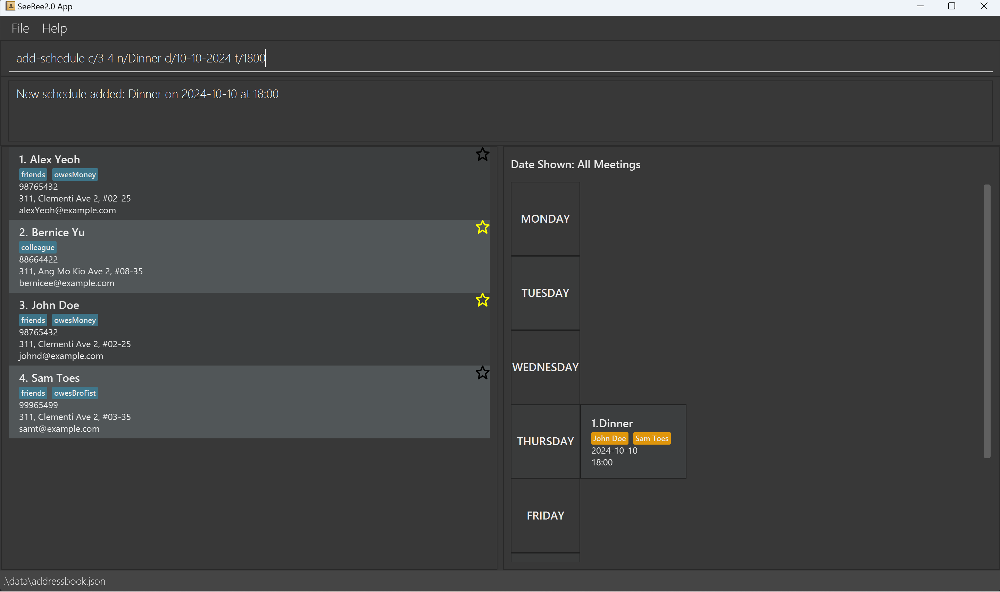
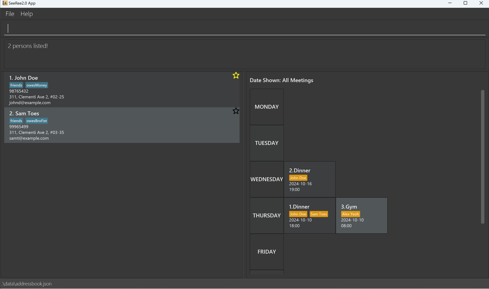

# SeeRee 2.0 User Guide

SeeRee 2.0 is a **desktop app for managing contacts and meetings, optimized for use via a Command Line Interface** (CLI) while still having the benefits of a Graphical User Interface (GUI). If you can type fast, SeeRee 2.0 can get your contact management tasks done faster than traditional GUI apps.

<!-- * Table of Contents -->
<page-nav-print />

--------------------------------------------------------------------------------------------------------------------

## Quick start

1. Ensure you have Java `17` or above installed in your Computer.

1. Download the latest `.jar` file from [here](https://github.com/AY2425S1-CS2103-F13-3/tp/releases).

1. Copy the file to the folder you want to use as the _home folder_ for your SeeRee2.0.

1. Open a command terminal, `cd` into the folder you put the jar file in, and use the `java -jar SeeRee2.0.jar` command to run the application. 
   A GUI similar to the below should appear in a few seconds. Note how the app contains some sample data. 
   

1. Type the command in the command box and press Enter to execute it. e.g. typing **`help`** and pressing Enter will open the help window. 
   Some example commands you can try:

   * `list` : Lists all contacts.

   * `add n/John Doe p/98765432 e/johnd@example.com a/John street, block 123, #01-01` : Adds a contact named `John Doe` to the Address Book.

   * `add-schedule c/1 2 n/Dinner d/10-10-2024 t/1800` : Adds a meeting named `Dinner` with the relevant details to the calendar.

   * `delete 3` : Deletes the 3rd contact shown in the current list.

   * `delete-schedule 1` : Deletes the 1st meeting shown in the current calendar.

   * `clear` : Deletes all contacts.

   * `exit` : Exits the app.

1. Refer to the [Features](#features) below for details of each command.

--------------------------------------------------------------------------------------------------------------------

## Features

<box type="info" seamless>

**Notes about the command format:** 

* Words in `UPPER_CASE` are the parameters to be supplied by the user. 
  e.g. in `add n/NAME`, `NAME` is a parameter which can be used as `add n/John Doe`.

* Items in square brackets are optional. 
  e.g `n/NAME [t/TAG]` can be used as `n/John Doe t/friend` or as `n/John Doe`.

* Items with `…`​ after them can be used multiple times including zero times. 
  e.g. `[t/TAG]…​` can be used as ` ` (i.e. 0 times), `t/friend`, `t/friend t/family` etc.

* Parameters can be in any order. 
  e.g. if the command specifies `n/NAME p/PHONE_NUMBER`, `p/PHONE_NUMBER n/NAME` is also acceptable.

* Extraneous parameters for commands that do not take in parameters (such as `help`, `list`, `exit` and `clear`) will be ignored. 
  e.g. if the command specifies `help 123`, it will be interpreted as `help`.

* If you are using a PDF version of this document, be careful when copying and pasting commands that span multiple lines as space characters surrounding line-breaks may be omitted when copied over to the application.
</box>

### Viewing help : `help`

Shows a message explaning how to access the help page.

Format: `help`

### Adding a contact: `add`

Adds a contact to the address book.

Format: `add n/NAME p/PHONE_NUMBER e/EMAIL a/ADDRESS [t/TAG]…​` 
_Some of these conditions mentioned below may apply to `edit` command also._
* Names should only contain alphanumeric characters and spaces, and it should not be blank.
* Phone numbers should only contain numbers, and it should be at least 3 digits long.
* Emails should be of the format local-part@domain and adhere to the following constraints:
    1. The local-part should only contain alphanumeric characters and these special characters, excluding the parentheses, (+_.-). The local-part may not start or end with any special characters.
    2. This is followed by a '@' and then a domain name. The domain name is made up of domain labels separated by periods.
The domain name must:
        - end with a domain label at least 2 characters long
        - have each domain label start and end with alphanumeric characters
        - have each domain label consist of alphanumeric characters, separated only by hyphens, if any.
* Addresses can take any values, and it should not be blank
    * Address will accept invalid prefixes e.g. `add n/John Doe p/98765432 e/johnd@example.com a/John street, block 123, #01-01 x/123` will display address as `John street, block 123, #01-01 x/123`
* Contacts with exactly the same prefixes as an existing contact will not be added

<box type="tip" seamless>

**Tip:** A contact can have any number of tags (including 0)
</box>

Examples:
* `add n/John Doe p/98765432 e/johnd@example.com a/John street, block 123, #01-01`
* `add n/Betsy Crowe t/friend e/betsycrowe@example.com a/Newgate Prison p/1234567 t/criminal`

Notes:
- We allow Users to create person of the same Name, Email Address and Phone Number, as long as not all details are the same.

### Listing all persons : `list`

Shows a list of all contacts in the address book.

Format: `list`

* Everything after the command `list` will be ignored.

### Editing a contact : `edit`

Edits an existing contact in the address book.

Format: `edit INDEX [n/NAME] [p/PHONE] [e/EMAIL] [a/ADDRESS] [t/TAG]…​`

* Edits the contact at the specified `INDEX`. The index refers to the index number shown in the displayed contact list. The index **must be a positive integer** 1, 2, 3, …​
* At least one of the optional fields must be provided.
* Existing values will be updated to the input values.
* When editing tags, the existing tags of the contact will be removed i.e adding of tags is not cumulative.
* You can remove all the contact’s tags by typing `t/` without
    specifying any tags after it.

Examples:
*  `edit 1 p/91234567 e/johndoe@example.com` Edits the phone number and email address of the 1st contact to be `91234567` and `johndoe@example.com` respectively.
*  `edit 2 n/Betsy Crower t/` Edits the name of the 2nd contact to be `Betsy Crower` and clears all existing tags.

### Locating contacts by name and tag: `find`

Finds contacts whose names or tags contain any of the given keywords.

Format: `find [n/NAME]... [t/TAG]...`

* At least one of the two search fields must be present: either `n/NAME`, `t/TAG`, or both.
* Contacts matching at least field will be returned (i.e. `OR` search). e.g. `n/Hans t/family` will return `Hans Gruber`, `Bo Yang`, and any other contacts with `family` tag.
* For `n/`:
    * The search is case-insensitive. e.g `n/hans` will match `Hans`
    * Partial words will be matched e.g. `n/Han` will match `Hans`
* For `t/`:
    * The search is case-insensitive. e.g `t/FAMILY` will match any contacts with `family` tag
    * Full words will be matched e.g. `t/Han` will not match any contacts with `Hans` tag

Examples:
* `find n/John` returns `john` and `John Doe`
* `find n/alex t/classmates` returns `Alex Yeoh`, `alex tan`, `Irfan` (who has the `classmates` tag) 
  

### Deleting a contact : `delete`

Deletes the specified contact from the address book.

Format: `delete INDEX`

* Deletes the contact at the specified `INDEX`.
* The index refers to the index number shown in the displayed contact list.
* The index **must be a positive integer** 1, 2, 3, …​
* If the contact exists in any meeting, the contact will not be deleted.
    * To delete the contact, remove them from any meetings first before deleting the contact.

Examples:
* `list` followed by `delete 2` deletes the 2nd contact in the address book.
* `find n/Betsy` followed by `delete 1` deletes the 1st contact in the results of the `find` command.

### Favouriting a contact : `favourite`

Favourites the specified contact from the address book.

Format: `favourite c/INDEX ...`

* Favourites the contact at the specified `INDEX`
* The index refers to the index number shown in the displayed contact list.
* The index **must be a positive integer** 1, 2, 3, …​

Examples:
Assuming there are multiple contacts on display,
* `favourite c/1`
* `favourite c/1 2 3`

### Clearing all entries : `clear`

Clears all entries from the address book.

Format: `clear`

### See all meetings : `list-schedule`

Views all the user's meetings.

Format: `list-schedule`

### See weekly schedule : `see`

View schedule for the week of user date input. Sunday is considered the start of the week.

Format: `see d/dd-MM-YYYY`

Examples:
- `see d/17-10-2024` shows all meetings within the week range of `13-10-2024` to `19-10-2024`

Notes:
- If the user inputs an invalid date like `29-02-2023`, our application corrects it to `28-02-2023`. This is to provide a smoother user experience.

### Add meetings to schedule : `add-schedule`

Add meetings to user's schedule.

Format: `add-schedule c/CONTACT n/NAME d/DATE t/TIME`
- all fields must be present
- duplicate prefixes would be replaced with latest prefix (e.g. t/1400 will be replaced by t/1600)
- `c/CONTACT` the contact indices with respect to the currently displayed list of contacts. Multiple contacts are allowed.
- `n/NAME` description of the meeting.
- `d/DATE` date must be in the format of dd-MM-YYYY.
- `t/TIME` time must be in the format of hhmm (24 hours notation) .

Example:

- `add-schedule c/1 2 n/Dinner d/10-10-2024 t/1800`
- **Before**: no Dinner event at 10-10-2024 1800.
- **After**: Dinner event at 10-10-2024 1800 is added.

Notes:
- The user is allowed to schedule a meeting for past dates. This feature is in place as we expect Users to use this application to record their past meetings as well.
- If the user inputs an invalid date like `29-02-2023`, our application corrects it to `28-02-2023`. This is to provide a smoother user experience.

### Delete meeting from schedule : `delete-schedule`

Delete events from user's schedule.

Format: `delete-schedule INDEX`
- `INDEX` is based on the current displayed schedule list.

Example:
- `delete-schedule 2` will delete the second meeting from the current schedule view.

### Edit Meeting in Schedule : `edit-schedule`

Edit the existing meeting within the schedule.

Format: `edit-schedule INDEX [n/NAME] [d/DATE] [t/TIME] [c/INDEX]...`
- `INDEX`: Refers to the schedule you want to edit. The index is based on the current schedule view and **must** be specified.
- `n/NAME` (optional): The new description or name of the meeting. If not provided, the name remains unchanged.
- `d/DATE` (optional): The new date of the meeting. Must be in the format `DD-MM-YYYY`. If not provided, the date remains unchanged.
- `t/TIME` (optional): The new time of the meeting. Must be in 24-hour format `hhmm`. If not provided, the time remains unchanged.
- `c/INDEX` (optional): Refers to the contact's index in the current address book view. You can specify multiple `c/INDEX` values:
    - If the contact is **already in** the meeting, specifying `c/INDEX` will **remove** the contact.
    - If the contact is **not in** the meeting, specifying `c/INDEX` will **add** the contact.
- At least one of `n/NAME`, `d/DATE`, `t/TIME`, or `c/INDEX` must be specified. If a field is not provided, the current value for that field remains unchanged.

Example:
- `edit-schedule 1 n/Dinner d/10-10-2024 t/1800 c/2 c/3 c/4`

- **Before**: Schedule 1 contains contacts `1, 2, 3`.
- **After**: Contacts `2` and `3` are removed (as they were already in the meeting), and contact `4` is added. The final list of contacts for the meeting is `1, 4`.

Notes:
- You must always specify the `INDEX` of the schedule to be edited.
- At least one other field (`n/NAME`, `d/DATE`, `t/TIME`, or `c/INDEX`) must be provided; otherwise, the command will not execute.
- If a field (name, date, time, or contacts) is not specified, the existing value for that field remains unchanged.
- If the user inputs an invalid date like `29-02-2023`, our application corrects it to `28-02-2023`. This is to provide a smoother user experience.

This ensures flexibility by allowing you to only modify the fields you need while keeping the others intact.

### Viewing Contacts in Meeting : `meeting-contacts`

Filter and view list of contacts that is in the specified meeting.

Format: `meeting-contacts INDEX`
- `INDEX`: Refers to the meeting you want to view the contacts in. The index is based on the current schedule view and **must** be specified.
* The index **must be a positive integer** 1, 2, 3, …​

Example:

- `meeting-contacts 1`
- **Before**: contact view shows all contacts.
- **After**: only John and Sam contacts are shown.

Notes:
- You must always specify the `INDEX` of the meeting you want to view the contacts in.

### Exiting the program : `exit`

Exits the program.

Format: `exit`

### Saving the data

SeeRee2.0 data are saved in the hard disk automatically after any command that changes the data. There is no need to save manually.

### Editing the data file

SeeRee2.0 data are saved automatically as a JSON file under two separate files in the following default locations:
* `[JAR file location]/data/addressbook.json` for contacts list, and
* `[JAR file location]/data/schedule.json` for schedule list

Advanced users are welcome to update data directly by editing that data file.

<box type="warning" seamless>

**Caution:**
If your changes to the data file makes its format invalid, SeeRee2.0 **may** discard all data and start with an empty data file at the next run.  Hence, it is recommended to take a backup of the file before editing it. 
Furthermore, certain edits can cause the SeeRee2.0 to behave in unexpected ways (e.g., if a value entered is outside the acceptable range). Therefore, edit the data file only if you are confident that you can update it correctly.
</box>

## FAQ

**Q**: How do I transfer my data to another Computer? 
**A**: Install the app in the other computer and overwrite the empty data file it creates with the file that contains the data of your previous SeeRee2.0 home folder.

--------------------------------------------------------------------------------------------------------------------

## Known issues

1. **When using multiple screens**, if you move the application to a secondary screen, and later switch to using only the primary screen, the GUI will open off-screen. The remedy is to delete the `preferences.json` file created by the application before running the application again.
2. **If you minimize the Help Window** and then run the `help` command (or use the `Help` menu, or the keyboard shortcut `F1`) again, the original Help Window will remain minimized, and no new Help Window will appear. The remedy is to manually restore the minimized Help Window.
3. **When resizing the application to a smaller size or having multiple meetings in the same day**, the scrollbars of the schedule panel will cause a white box to appear in the UI. The remedy is to increase the size of the application if applicable. Proposed solution for this is discussed in planned enhancement of the DeveloperGuide. 
4. **If you maximize the application** and then close and reopen the application, the application will not stay maximized. The remedy is to manually maximize the application again.

--------------------------------------------------------------------------------------------------------------------

## Command summary

Action                   | Format, Examples
-------------------------|----------------------------------------------------------------------------------------------------------------------------------------------------------------------
**Add**                  | `add n/NAME p/PHONE_NUMBER e/EMAIL a/ADDRESS [t/TAG]…​`   e.g., `add n/James Ho p/22224444 e/jamesho@example.com a/123, Clementi Rd, 1234665 t/friend t/colleague`
**Clear**                | `clear`
**Delete**               | `delete INDEX`  e.g., `delete 3`
**Edit**                 | `edit INDEX [n/NAME] [p/PHONE_NUMBER] [e/EMAIL] [a/ADDRESS] [t/TAG]…​`  e.g.,`edit 2 n/James Lee e/jameslee@example.com`
**Find**                 | `find n/NAME [n/ANOTHER_NAME] ... [t/TAG]...`  e.g. `find n/john t/family`
**List**                 | `list`
**Help**                 | `help`
**Add Meeting**          | `add-schedule c/CONTACT n/NAME d/DATE t/TIME`  e.g. `add-schedule n/meeting d/01-01-2001 t/1200 c/1 2`
**Delete Meeting**       | `delete-schedule INDEX`  e.g. `delete-schedule 2`
**Edit Meeting**         | `edit-schedule INDEX [n/NAME] [d/DATE] [t/TIME] [c/INDEX]`  e.g. `edit-schedule 1 c/2 3 4 n/Discussion t/1300 d/02-02-2001`
**Find meeting contacts**| `meeting-contacts INDEX`  e.g. `meeting-contacts 8`
**List all Meetings**    | `list-schedule`
**Find schedule**        | `see d/dd-MM-YYYY`  e.g. `see d/10-10-2024`
**Favourite contact**    | `favourite c/INDEX`  e.g. `favourite c/1`
