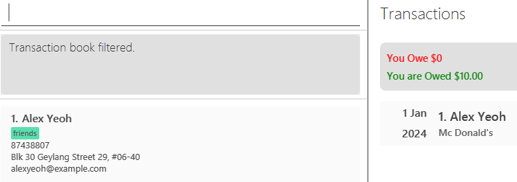

AddressBook Level 3 (AB3) is a **desktop app for managing contacts, optimized for use via a Command Line Interface** (
CLI) while still having the benefits of a Graphical User Interface (GUI). If you can type fast, AB3 can get your contact
management tasks done faster than traditional GUI apps.

* Table of Contents
{:toc}

--------------------------------------------------------------------------------------------------------------------

## Quick start

1. Ensure you have Java `17` or above installed in your Computer.

2. Download the latest `.jar` file from [here](https://github.com/se-edu/addressbook-level3/releases).

3. Copy the file to the folder you want to use as the _home folder_ for your AddressBook.

4. Open a command terminal, `cd` into the folder you put the jar file in, and use the `java -jar addressbook.jar`
   command to run the application. 
   A GUI similar to the below should appear in a few seconds. Note how the app contains some sample data. 
   

5. Type the command in the command box and press Enter to execute it. e.g. typing **`help`** and pressing Enter will
   open the help window. 
   Some example commands you can try:

    * `list` : Lists all contacts.

    * `add n/John Doe p/98765432 e/johnd@example.com a/John street, block 123, #01-01` : Adds a contact named `John Doe`
      to the Address Book.

    * `delete 3` : Deletes the 3rd contact shown in the current list.

    * `clear` : Deletes all contacts.

    * `exit` : Exits the app.

6. Refer to the [Features](#features) below for details of each command.

--------------------------------------------------------------------------------------------------------------------

## Features

**:information_source: Notes about the command format:** 

* Words in `UPPER_CASE` are the parameters to be supplied by the user. 
  e.g. in `add n/NAME`, `NAME` is a parameter which can be used as `add n/John Doe`.

* Items in square brackets are optional. 
  e.g `n/NAME [t/TAG]` can be used as `n/John Doe t/friend` or as `n/John Doe`.

* Items with `…`​ after them can be used multiple times including zero times. 
  e.g. `[t/TAG]…​` can be used as ` ` (i.e. 0 times), `t/friend`, `t/friend t/family` etc.

* Parameters can be in any order. 
  e.g. if the command specifies `n/NAME p/PHONE_NUMBER`, `p/PHONE_NUMBER n/NAME` is also acceptable.

* Extraneous parameters for commands that do not take in parameters (such as `help`, `list`, `exit` and `clear`) will be
  ignored. 
  e.g. if the command specifies `help 123`, it will be interpreted as `help`.

* If you are using a PDF version of this document, be careful when copying and pasting commands that span multiple lines
  as space characters surrounding line-breaks may be omitted when copied over to the application.

### Viewing help : `help`

Shows a message explaining how to access the help page.

Format: `help`

### Adding a person: `add`

Adds a person to the address book.

Format: `add n/NAME p/PHONE_NUMBER e/EMAIL a/ADDRESS [t/TAG]…​`

:bulb: **Tip:**
A person can have any number of tags (including 0)

Examples:

* `add n/John Doe p/98765432 e/johnd@example.com a/John street, block 123, #01-01`
* `add n/Betsy Crowe t/friend e/betsycrowe@example.com a/Newgate Prison p/1234567 t/criminal`

### Adding a transaction: `addTxn`

Adds a transaction to the transaction book.

Format: `addTxn p/PHONE_NUMBER amt/AMOUNT desc/TEST [date/DATE] [cat/CATEGORY]...`

* The `PHONE_NUMBER` refers to the phone number associated to the person had a transaction with.
* The `AMOUNT` accepts a decimal number with up to 2 decimal places. A `-` can be added as prefix to indicate negative
  amount.
* The `DATE` accepts date formatted in the form `DDMMYYYY` i.e.`10102024`.
* The `CATEGORY` accepts non-empty strings that are alphanumeric with spaces.

:bulb: **Tip:** If the transaction happened on the current day, the date parameter can be omitted.
:bulb: **Tip:** A person can have any number of categories (including 0)

Examples:

* `addTxn p/98765432 amt/12.3 desc/John paid me for dinner`
* `addTxn p/98765432 amt/-12.3 desc/John owed me date/10102024`

### Listing all persons : `list`

Shows a list of all persons in the address book.

Format: `list`

### Listing all transactions : `listTxn`

Shows a list of all transactions in the transaction book.

Format: `listTxn`

### Editing a person : `edit`

Edits an existing person in the address book.

Format: `edit INDEX [n/NAME] [p/PHONE] [e/EMAIL] [a/ADDRESS] [t/TAG]…​`

* Edits the person at the specified `INDEX`. The index refers to the index number shown in the displayed person list.
  The index **must be a positive integer** 1, 2, 3, …​
* At least one of the optional fields must be provided.
* Existing values will be updated to the input values.
* When editing tags, the existing tags of the person will be removed i.e adding of tags is not cumulative.
* You can remove all the person’s tags by typing `t/` without
  specifying any tags after it.

Examples:

* `edit 1 p/91234567 e/johndoe@example.com` Edits the phone number and email address of the 1st person to be `91234567`
  and `johndoe@example.com` respectively.
* `edit 2 n/Betsy Crower t/` Edits the name of the 2nd person to be `Betsy Crower` and clears all existing tags.

### Locating persons by name: `find`

Finds persons whose names contain any of the given keywords.

Format: `find KEYWORD [MORE_KEYWORDS]`

* The search is case-insensitive. e.g `hans` will match `Hans`
* The order of the keywords does not matter. e.g. `Hans Bo` will match `Bo Hans`
* Only the name is searched.
* Only full words will be matched e.g. `Han` will not match `Hans`
* Persons matching at least one keyword will be returned (i.e. `OR` search).
  e.g. `Hans Bo` will return `Hans Gruber`, `Bo Yang`

Examples:

* `find John` returns `john` and `John Doe`
* `find alex david` returns `Alex Yeoh`, `David Li` 
  

### Filtering transactions: `filterTxn`

Filter transactions with the specified person identified by their phone number, and/or amount and/or description
and/or date.

Format: `filterTxn [p/PHONE_NUMBER] [amt/AMOUNT] [desc/DESCRIPTION] [date/DATE]`

* The command requires at least one of the above optional prefixes to be provided.
* As more prefixes are provided, the filter becomes more specific.
* The `PHONE_NUMBER` refers to the phone number associated to the person had a transaction with.
* The `AMOUNT` accepts a decimal number with up to 2 decimal places. A `-` can be added as prefix to indicate negative
  amount.
* The `DATE` accepts date formatted in the form `DDMMYYYY` i.e.`10102024`.
* The `DESCRIPTION` accepts a string of words.
    * The description filter is case-insensitive. e.g `hans` will match `Hans`

Examples: 

* Given the example transaction book: 
  
* `filterTxn p/87438807` returns all transactions with the person `Alex Yeoh`. 
  
* `filterTxn p/99272758 amt/5.5` returns all transactions with the person `Bernice Yu` with amount `5.50`. 
  

### Adding Remarks for a person : `remark`

Add remarks for the specified person from the address book.

Format: `remark INDEX r/REMARK`

* Add remarks for the person at the specified `INDEX`.
* The index refers to the index number shown in the displayed person list.
* The index **must be a positive integer** 1, 2, 3, …​

Examples:

* `list` followed by `remark 2 r/remark for person 2` adds remarks for the 2nd person in the address book.
* `find Betsy` followed by `remark 1 r/remark for betsy` adds remarks for the 1st person in the results of the `find`
  command.

### Deleting a person : `delete`

Deletes the specified person from the address book.

Format: `delete INDEX`

* Deletes the person at the specified `INDEX`.
* The index refers to the index number shown in the displayed person list.
* The index **must be a positive integer** 1, 2, 3, …​

Examples:

* `list` followed by `delete 2` deletes the 2nd person in the address book.
* `find Betsy` followed by `delete 1` deletes the 1st person in the results of the `find` command.

### Clearing all entries of AddressBook: `clear`

Clears all entries from the address book.

Format: `clear`

### Clearing all entries of TransactionBook : `clearTxn`

Clears all entries from the transaction book.

Format: `clearTxn`

### Editing a transaction : `editTxn `

Edits an existing transaction in the transaction book.

Format: `editTxn [INDEX] [p/PHONE_NUMBER] [amt/AMOUNT] [desc/TEST] [date/DATE] [cat/CATEGORY]...`

* Edits the transaction at the specified `INDEX`. The index refers to the index number shown in the displayed person
  list.
  The index **must be a positive integer** 1, 2, 3, …​
* At least one of the optional fields must be provided.
* Existing values will be updated to the input values.
* When editing categories, the existing categories of the person will be removed i.e adding of categories is not
  cumulative.
* You can remove all the person’s categories by typing `cat/` without
  specifying any categories after it.

Examples:

* `editTxn 1 p/91234567 desc/Hello world` Edits the phone number and description of the 1st transaction to be `91234567`
  and `Hello world` respectively.
* `editTxn 2 cat/` Edits the 2nd transaction by removing all existing categories.

### Exiting the program : `exit`

Exits the program.

Format: `exit`

### Saving the data

AddressBook data are saved in the hard disk automatically after any command that changes the data. There is no need to
save manually.

### Editing the data file

AddressBook data are saved automatically as a JSON file `[JAR file location]/data/addressbook.json`. Advanced users are
welcome to update data directly by editing that data file.

:exclamation: **Caution:**
If your changes to the data file makes its format invalid, AddressBook will discard all data and start with an empty data file at the next run. Hence, it is recommended to take a backup of the file before editing it. 
Furthermore, certain edits can cause the AddressBook to behave in unexpected ways (e.g., if a value entered is outside of the acceptable range). Therefore, edit the data file only if you are confident that you can update it correctly.

### Archiving data files `[coming in v2.0]`

_Details coming soon ..._

--------------------------------------------------------------------------------------------------------------------

## FAQ

**Q**: How do I transfer my data to another Computer? 
**A**: Install the app in the other computer and overwrite the empty data file it creates with the file that contains
the data of your previous AddressBook home folder.

--------------------------------------------------------------------------------------------------------------------

## Known issues

1. **When using multiple screens**, if you move the application to a secondary screen, and later switch to using only
   the primary screen, the GUI will open off-screen. The remedy is to delete the `preferences.json` file created by the
   application before running the application again.
2. **If you minimize the Help Window** and then run the `help` command (or use the `Help` menu, or the keyboard shortcut
   `F1`) again, the original Help Window will remain minimized, and no new Help Window will appear. The remedy is to
   manually restore the minimized Help Window.

--------------------------------------------------------------------------------------------------------------------

## Command Summary for Address Book

| Action     | Format, Examples                                                                                                                                                                                                           |
|------------|----------------------------------------------------------------------------------------------------------------------------------------------------------------------------------------------------------------------------|
| **Add**    | `add n/NAME p/PHONE_NUMBER e/EMAIL a/ADDRESS [r/REMARK] [t/TAG]…​`   e.g., `add n/James Ho p/22224444 e/jamesho@example.com a/123, Clementi Rd, 1234665 r/James is poor af, do not loan him money t/friend t/colleague` |
| **Clear**  | `clear`                                                                                                                                                                                                                    |
| **Delete** | `delete INDEX`  e.g., `delete 3`                                                                                                                                                                                        |
| **Edit**   | `edit INDEX [n/NAME] [p/PHONE_NUMBER] [e/EMAIL] [a/ADDRESS] [r/REMARK] [t/TAG]…​`  e.g.,`edit 2 n/James Lee e/jameslee@example.com`                                                                                     |
| **Find**   | `find KEYWORD [MORE_KEYWORDS]`  e.g., `find James Jake`                                                                                                                                                                 |
| **List**   | `list`                                                                                                                                                                                                                     |
| **REMARK** | `remark INDEX r/REMARK`                                                                                                                                                                                                    |
| **Help**   | `help`                                                                                                                                                                                                                     |

--------------------------------------------------------------------------------------------------------------------

## Command Summary for Transactions

| Action     | Format, Examples                                                                                                                                                                                         |
|------------|----------------------------------------------------------------------------------------------------------------------------------------------------------------------------------------------------------|
| **Add**    | `addTxn p/PHONE_NUMBER amt/AMOUNT desc/DESCRIPTION [date/DATE]`   e.g., `addTxn p/99999999 amt/-9999999999.99 desc/Sean owes me a lot for a plot of land in sentosa date/10102024 cat/TEST`           |
| **Edit**   | `editTxn INDEX p/PHONE_NUMBER amt/AMOUNT desc/DESCRIPTION [date/DATE]`   e.g., `editTxn 1 p/99999999 amt/-9999999999.99 desc/Sean owes me a lot for a plot of land in sentosa date/10102024 cat/TEST` |
| **List**   | `listTxn`                                                                                                                                                                                                |
| **Filter** | `filterTxn [p/PHONE_NUMBER] [amt/AMOUNT] [desc/DESCRIPTION] [date/DATE]`   e.g. `filterTxn p/99999999`                                                                                                |
| **Clear**  | `clearTxn`                                                                                                                                                                                               |
