### Introduction


TalentSG is a desktop application designed for HR professionals and recruiters who need to efficiently manage candidates and job roles. Built with productivity in mind, TalentSG is optimised for those who prefer a Command Line Interface (CLI) experience while still benefiting from a Graphical User Interface (GUI). This combination allows users to perform tasks through concise, text-based commands and receive visual feedback for each command executed.

TalentSG streamlines the process of tracking candidates, organizing job roles, and filtering based on status or skillsets. With a flexible command structure, users can work intuitively without having to remember overly complex commands, making TalentSG both powerful and user-friendly.

If you’re a fast typist, TalentSG can significantly speed up your candidate management workflow compared to traditional GUI-only applications. It is especially useful for those who value precision and speed, as the CLI minimises the clicks and steps required to complete various HR tasks.

This document provides an in-depth guide to using TalentSG’s features and commands, ensuring that users can maximise their experience with the app. We currently support both Windows and Mac operating systems, so feel free to jump to [Quick Start](#quick-start) to begin.

We hope TalentSG becomes an indispensable tool in your recruitment and candidate management journey!

This app is a desktop app for managing candidates and job roles, **optimised for use via a Command Line Interface (CLI)** while still providing the benefits of a Graphical User Interface (GUI). If you can type fast, this app can help you manage your candidates and job roles faster than traditional GUI apps.

---
## Table of Contents
- [Command Summary](#command-summary)
- [Symbols and Tips](#key-symbols-and-tips-for-a-smooth-experience)
- [Quick Start](#quick-start)
- [Features](#features)
    - [Notes About the Command Format](#notes-about-the-command-format)
    - [Viewing Help: `help`](#viewing-help-help)
    - [Adding a Person: `add`](#adding-a-person-add)
    - [Listing All Persons: `list`](#listing-all-persons-list)
    - [Editing a Person: `edit`](#editing-a-person-edit)
    - [Finding Persons by Name: `find`](#finding-persons-by-name-find)
    - [Deleting a Person: `delete`](#deleting-a-person-delete)
    - [Filtering Applicants by Status: `filter`](#filtering-applicants-by-status-filter)
    - [Displaying Summary: `summary`](#summary-summary)
    - [Clearing All Entries: `clear`](#clearing-all-entries-clear)
    - [Exiting the Program: `exit`](#exiting-the-program-exit)
    - [Saving Data](#saving-data)
    - [Editing the Data File](#editing-the-data-file)
    - [Bug Report](#how-to-report-a-bug)
    - [Archiving Data Files](#archiving-data-files-coming-in-v20)
- [FAQ](#faq)
- [Glossary](#glossary)


---

## Command Summary


| Action      | Format, Examples                                                                                                                                                                                                            |
|-------------|-----------------------------------------------------------------------------------------------------------------------------------------------------------------------------------------------------------------------------|
| **Add**     | `add n/NAME p/PHONE_NUMBER e/EMAIL a/ADDRESS s/SKILLS st/STATUS note/NOTE ex/EXPERIENCE dr/DESIRED_ROLE [t/TAG]...` <br> e.g., `add n/James Ho p/22224444 e/jamesho@example.com a/123 Clementi Rd, 1234665 s/Java t/friend` |
| **Clear**   | `clear`                                                                                                                                                                                                                     |
| **Delete**  | `delete INDEX`<br> e.g., `delete 3`                                                                                                                                                                                         |
| **Edit**    | `edit INDEX [n/NAME] [p/PHONE] [e/EMAIL] [a/ADDRESS] [s/SKILLS] [st/STATUS] [note/NOTE] [ex/EXPERIENCE] [dr/DESIRED_ROLE] [t/TAG]...`<br> e.g., `edit 2 n/James Lee st/Active`                                              |
| **Find**    | `find KEYWORD [MORE_KEYWORDS]`<br> e.g., `find James`                                                                                                                                                                       |
| **List**    | `list`                                                                                                                                                                                                                      |
| **Help**    | `help`                                                                                                                                                                                                                      |
| **View**    | `view INDEX`<br> e.g., `view 2`                                                                                                                                                                                             |
| **Filter**  | `filter STATUS`<br> e.g., `filter Shortlisted`                                                                                                                                                                              |
| **Summary** | `summary`                                                                                                                                                                                                                   |

Detailed information can be found under [Features](#features).


---

## Key Symbols and Tips for a Smooth Experience

Throughout this guide, you'll encounter several symbols. Refer to these symbols as you explore the guide. Each provides quick insights or warnings that can make your experience smoother:

- <strong>[Tip]</strong>: Useful information to enhance your experience.
- <strong>[Note]</strong>: Important information you should be aware of.
- <strong>[Caution]</strong>: Critical information to prevent potential issues.


---
## Quick Start

1. **Check Java Installation**: Ensure you have **Java 17** or above installed on your computer.
    - [Check Java version on Windows](https://www.wikihow.com/Check-Your-Java-Version-in-the-Windows-Command-Line)
    - [Check Java version on Mac](https://www.wikihow.com/Check-Java-Version-on-a-Mac)
    - If your computer does not have Java or its version is below Java 17, you may refer to:
      - [Install Java on Windows](https://docs.oracle.com/en/java/javase/17/install/installation-jdk-microsoft-windows-platforms.html)
      - [Install Java on Mac](https://docs.oracle.com/en/java/javase/17/install/installation-jdk-macos.html)
    - <strong>[Note]</strong>: If you’re using an older version of Java, certain features might not work as expected. Updating to the latest version is recommended.
2. **Download TalentSG**: Get the latest `.jar` file from [here](https://github.com/AY2425S1-CS2103T-T09-2/tp/releases/tag/v1.5).
<strong>[Tip]</strong>: To avoid typing the full path every time, place the TalentSG.jar file in a frequently accessed folder or create an alias for it on your system.
   <br><br>
3. **Set Up Home Folder**: Copy the `TalentSG.jar` file to the Desktop to launch.
   <br><br>
4. **Run the Application**:
    - Open a command terminal.

    - Navigate (`cd`) to the folder containing the `.jar` file. <br> Example: `cd C:\Users\[username]\Downloads`

    - Run the application with the command:
      ```
      java -jar TalentSg.jar
      ```
      
<strong>[Caution]</strong>: Ensure you’re in the correct directory before running the `TalentSG.jar` command. Running it in an incorrect directory will result in a "file not found" error. <br><br>

5. 🎉 A GUI similar to the one below should appear in a few seconds! 🎉

    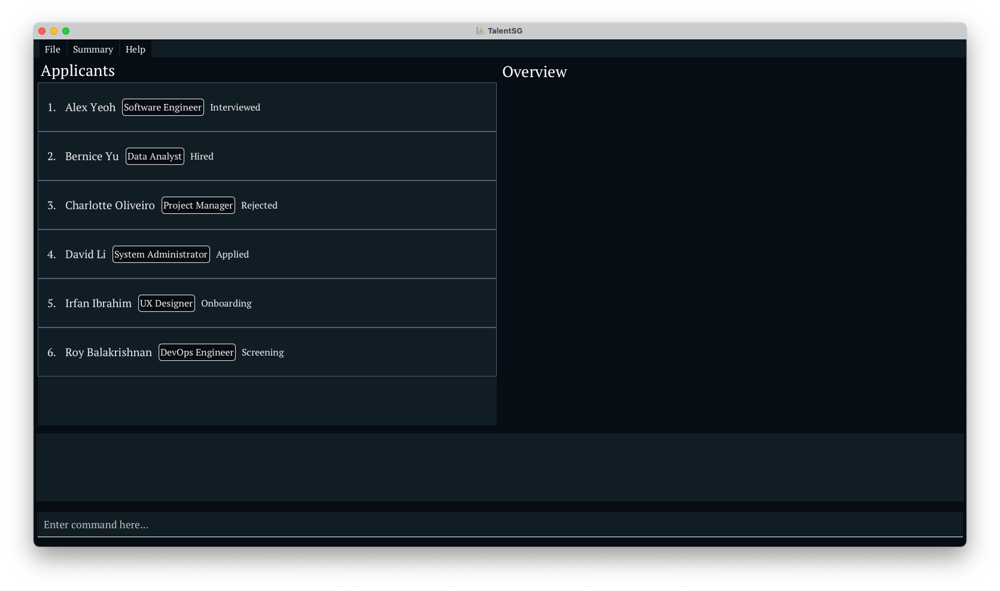

   - <strong>[Note]</strong>:Note how the app contains some sample data. <br><br>

6. **Interact with TalentSG**:
    - Type your command into the command box and press **Enter** to execute it.
    - For example, typing `help` and pressing Enter will display the help message. ✨

7. **Try Out Example Commands**:
    - `list` : Lists all Applicant.
    - `add n/John Doe p/98765432 e/johnd@example.com a/123 Main St s/Java,Python st/Active note/Great candidate ex/5 years in HR dr/Software Engineer` : Adds a Applicant named `John Doe` to TalentSG.
    - `delete 3` : Deletes the 3rd applicant shown in the current list.
    - `clear` : Deletes all applicant.
    - `exit` : Exits the app.

8. **Explore Features**: Refer to the [Features](#features) section for detailed information on each command.


---
## Features

TalentSG provides a variety of features to help you manage candidates and job roles effectively.

### Notes About the Command Format

- **UPPER_CASE**: Parameters to be supplied by the user.
    - E.g., in `add n/NAME`, `NAME` can be `John Doe`.
- **[Square Brackets]**: Optional items.
    - E.g., `n/NAME [t/TAG]` can be `n/John Doe t/friend` or `n/John Doe`.
- **Ellipsis (...)**: Items that can be used multiple times, including zero times.
    - E.g., `[t/TAG]...` can be `t/friend`, `t/friend t/family`, or omitted entirely.
- **Parameters Order**: Parameters can be in any order.
    - E.g., `n/NAME p/PHONE_NUMBER` is the same as `p/PHONE_NUMBER n/NAME`.
- **Extraneous Parameters**: Ignored for commands that do not take parameters.
    - E.g., `help 123` is interpreted as `help`.
- **Copying Commands**: Be cautious when copying multi-line commands from PDFs; line breaks may affect the command execution.
<br> <br>
#### Constraints of fields

| Field            | Constraints                                | Example                                                                                                 |
|------------------|--------------------------------------------|---------------------------------------------------------------------------------------------------------|
| **NAME**         | Up to 20 characters, no special characters | `Dominic`, `Stanley`, `Adi`, `83452124212`                                                               |
| **PHONE_NUMBER** | Numeric                                    | `98989899`, `81092819`                                                                                  |
| **EMAIL**        | Valid email format                         | `testing@gmail.com`,`example@gmail.com`                                                                 |
| **ADDRESS**      | Valid address, should not be blank         | `Bukit Panjang Ring Rd`, `Ringer 9 St`                                                                  |
| **SKILLS**       | Comma-separated values                     | `Java, Python`, `C++`                                                                                   |
| **STATUS**       | Predefined statuses                        | `Applied`, `Screening`, `Interview Scheduled`, `Interviewed`, `Offer`, `Onboarding`, `Hired`, `Rejected` |
| **EXPERIENCE**   | Valid experience, should not be blank      | `Student @ NUS`, `SWE of 5 years @ Google SG`                                                           |
| **DESIRED_ROLE** | Desired job position, should not be blank  | `Software Engineer`, `UI/UX Designer`                                                                   |
| **NOTE**         | Any characters are accepted                | `Very confident`, `Confident`                                                                           |
| **Tags**         | Optional and can be multiple               | `Must have`                                                                                             |


<strong>[Caution]</strong>: The required information except tags cannot be empty.

---

### Viewing Help: `help`
Format: `help`


Shows a message explaining how to access the help page.


---

### Adding a Person: `add`

Adds a new candidate to TalentSG.

Format: `add n/NAME p/PHONE_NUMBER e/EMAIL a/ADDRESS dr/DESIRED_ROLE s/SKILLS ex/EXPERIENCE st/STATUS note/NOTE  [t/TAG]...`


#### Example

`add n/John Doe p/98765432 e/johnd@example.com a/311, Clementi Ave 2, #02-25 dr/Software Engineer s/Java, Python, C++ ex/Project Manager at Google from 2010-2020 st/Interviewed note/Super confident t/friends t/owesMoney`

#### Image Example

Command: `add n/Jason Bill p/90065432 e/jason@example.com a/31, Clementi Ave 4, #02-20 dr/Software Engineer s/Java, Python, C++ ex/CTO at Google st/Applied note/Responsible t/friends`


**After the add command ran:**

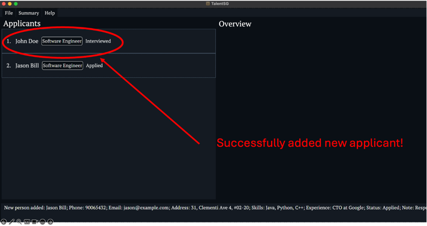

<strong>[NOTE]</strong>: TalentSG allows you to add numerical values as there are laws which allow people to have numerical values as names. You can read more about this from this [article](https://www.thebump.com/a/baby-name-rules). 

<strong>[Caution]</strong>: You cannot add the same candidate twice. (same name and phone)

---

### Listing All Persons: `list`

Shows a list of all applicants in TalentSG.

Format: `list`

#### Image Example

Command: ` list `

**Before the list command ran:**

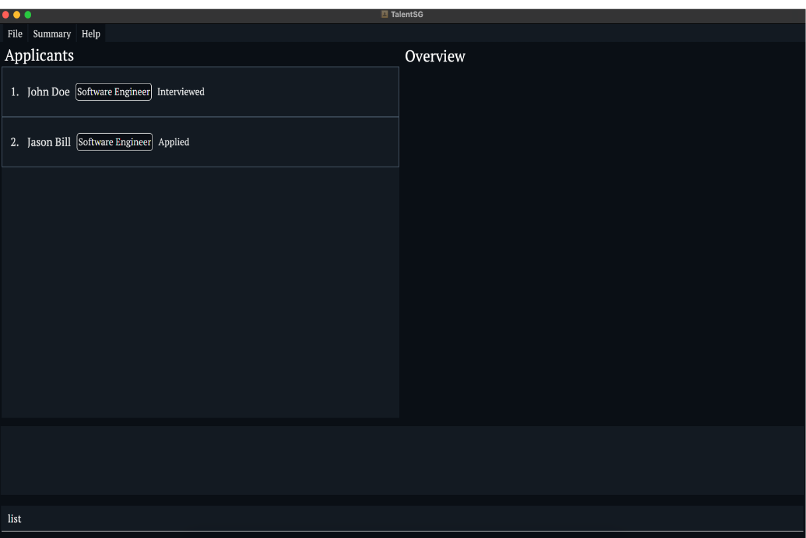


**After the list command ran:**

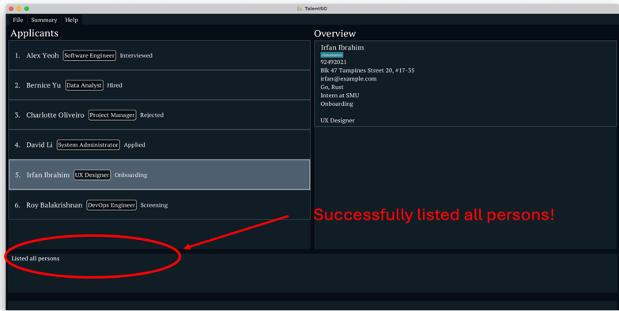


<strong>[Tip]</strong>: Regularly listing all Applicants helps you review the information stored and identify any duplicates or mistakes early.


  ---

### Editing a Person: `edit`

Edits an existing person in the address book.

Format: `edit INDEX [n/NAME] [p/PHONE] [e/EMAIL] [a/ADDRESS] [s/SKILLS] [st/STATUS] [note/NOTE] [ex/EXPERIENCE] [dr/DESIRED_ROLE] [t/TAG]...`

#### Constraints

- **INDEX**: Must be a positive integer corresponding to the candidate's position in the list.
- **At Least One Field**: Must be provided.
- **Existing Values**: Will be replaced with new inputs.

#### Example

- `edit 1 p/91234567 e/johndoe@example.com`: Updates phone and email of the first candidate.
- `edit 2 n/Betsy Crower t/`: Changes the name and clears all tags of the second candidate.

#### Image Example

Command: ` edit 1 st/Rejected note/arrogant `

**Before the edit command ran:**

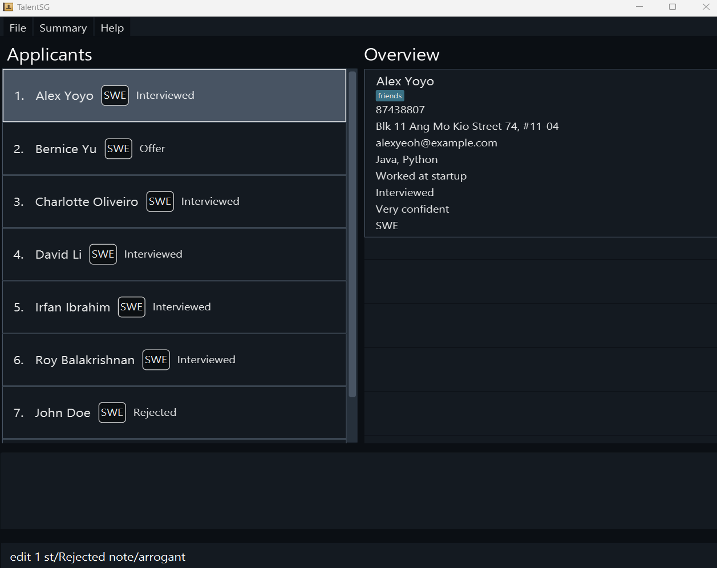


**After the edit command ran:**

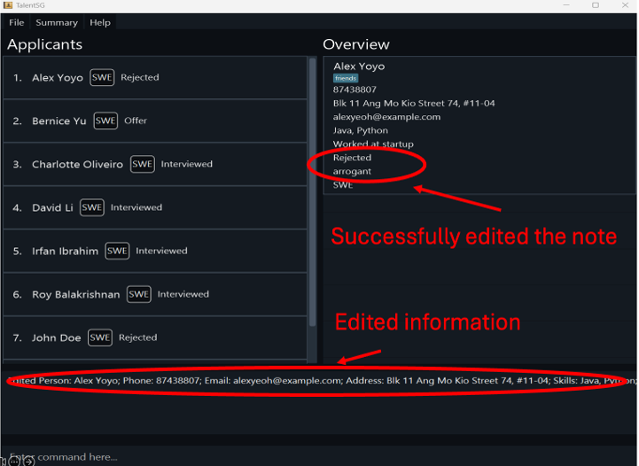


<strong>[Caution]</strong>: You cannot edit a candidate to be a duplicate of another existing candidate.

---

### Finding Persons by Name: `find`

Finds persons whose names contain any of the given keywords.

Format: `find KEYWORD [MORE_KEYWORDS]`

* The search is case-insensitive. e.g `hans` will match `Hans`
* The order of the keywords does not matter. e.g. `Hans Bo` will match `Bo Hans`
* Only the name is searched.
* Only full words will be matched e.g. `Han` will not match `Hans`
* Persons matching at least one keyword will be returned (i.e. `OR` search).
  e.g. `Hans Bo` will return `Hans Gruber`, `Bo Yang`

#### Example
* `find John` returns `john` and `John Doe`
* `find alex david` returns `Alex Yeoh`, `David Li`<br>


<strong>[Caution]</strong>:  If you search for "Han," Applicants named "Hans" will not appear in the results. Always search by full words.

#### Image Example

Command: ` find John Stanley `

**Before the find command ran:**

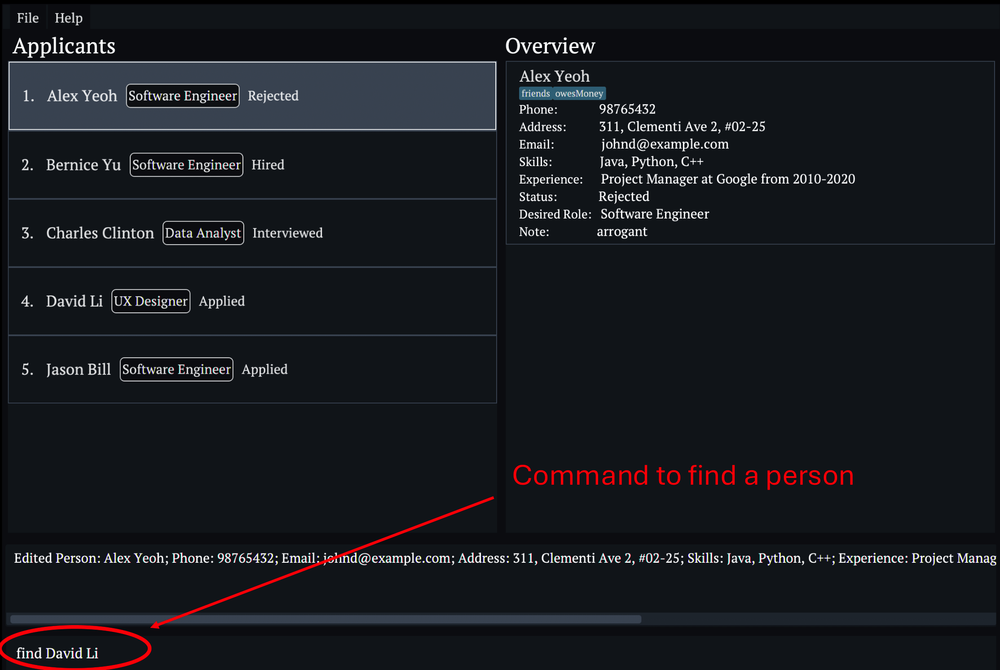

**After the find command ran:**

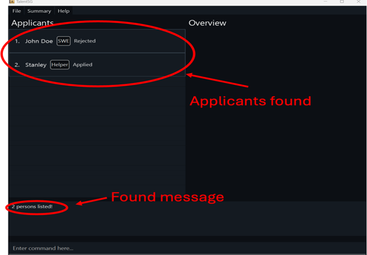

---

### Deleting a Person: `delete`

Removes a candidate from TalentSG.

**Format**: `delete INDEX`

#### Constraints

- **INDEX**: Refers to the candidate's number in the current list.
- **Positive Integer**: Must be 1, 2, 3, etc.

#### Example

- `list` followed by `delete 2`: Deletes the second candidate.
- `find Betsy` followed by `delete 1`: Deletes the first candidate in the search results.

#### Image Example

Command: ` delete 2 `

**Before the delete command ran:**

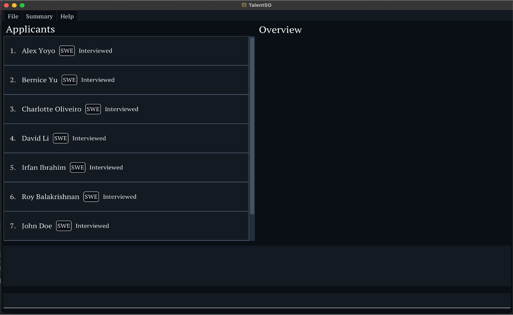


**After the delete command ran:**

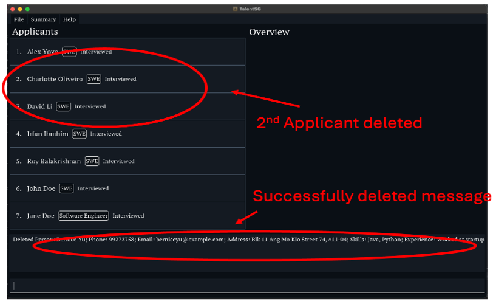


<strong>[Caution]</strong>: Deleted entries cannot be recovered.

---
### Viewing Applicant Details: `view`

Displays the details of a specific applicant in the list. This command allows you to quickly view all relevant information of an applicant by specifying their index in the list.

**Format**: `view INDEX`

#### Constraints

- **INDEX**: Must be a positive integer corresponding to the applicant's position in the current list.

#### Example

- `view 2`: Displays the details of the second applicant in the list.
- `list` followed by `view 1`: Lists all applicants, then shows details of the first applicant.

#### Image Example

Command: `view 2`

**Before the view command is run:**

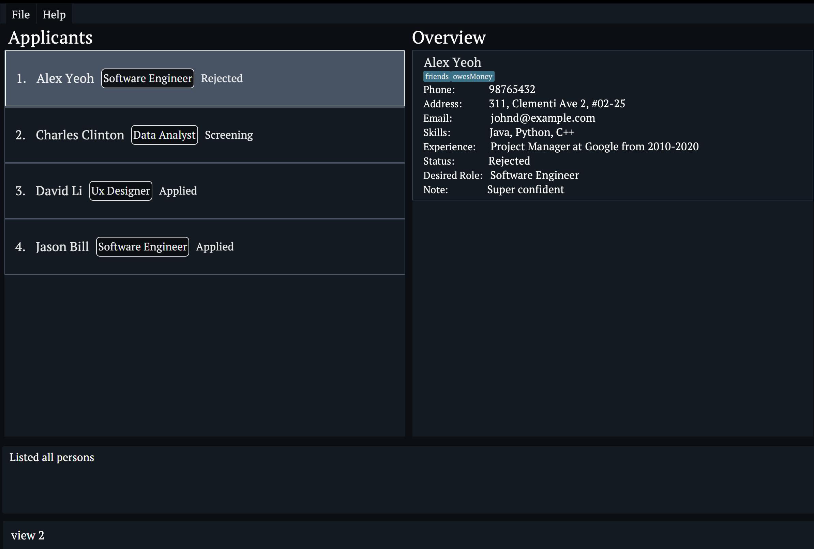

**After the view command is run:**

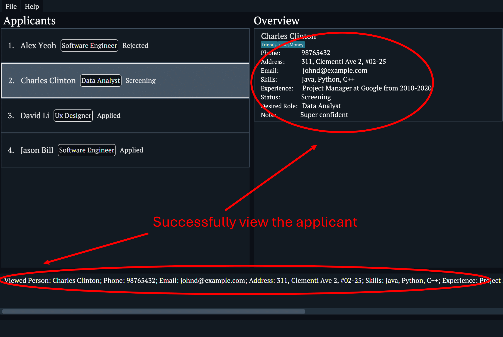

**View Output Example:**
When using the `view` command, the applicant's details will appear in the right panel, displaying information such as:
- Name
- Phone Number
- Address
- Email
- Skills
- Experience
- Status
- Desired Role
- Note
- Tags

This allows you to conveniently access all the specific details about an applicant in one view.

<strong>[Tip]</strong>: Use the `view` command frequently to ensure you have the most updated and detailed information about each applicant during your recruitment process.

---

### Filtering Applicants by Status: `filter`

Filters candidates based on their status.

**Format**: `filter STATUS`

#### Notes

- **Case-Insensitive**: The search is case-insensitive.
- **Available Statuses**:
    - Applied
    - Screening
    - Interview Scheduled
    - Interviewed
    - Offer
    - Onboarding
    - Hired
    - Rejected

#### Examples

- `filter Applied`: Displays all candidates marked as "Applied".
- `filter Interviewed`: Shows candidates marked as "Interviewed".

#### Image Example

Command: `filter screening`

**Before the filter command ran:**

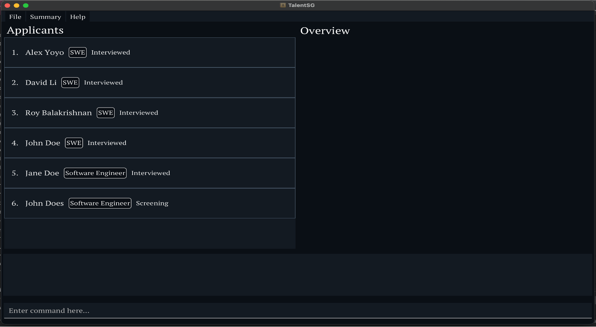

**After the filter command ran:**

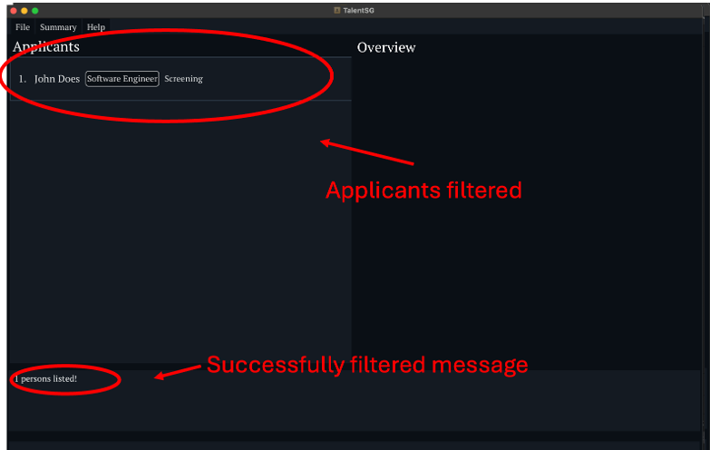

#### Invalid Status

If an invalid status is input (e.g., `filter applying`), an error message will appear:
> **Invalid status: applying. Valid statuses are: Applied, Screening, Interview Scheduled, Interviewed, Offer, Onboarding, Hired, Rejected**


---

### Summary: `summary`

Provides a quick overview of the current applicants' status, giving you a breakdown of the number of applicants in each stage of the recruitment process. This feature is useful for quickly assessing the progress of your recruitment pipeline.

**Format**: `summary`

- The summary command can be activated by typing `summary` in the command line or by clicking the **Summary** option in the **File** menu.

#### Example

1. **Using the Command Line**
    - Simply type `summary` and press Enter.
2. **Using the File Menu**
    - Go to the **File** menu and select **Summary**.

#### Image Example

<u>Before the summary command is run:</u>

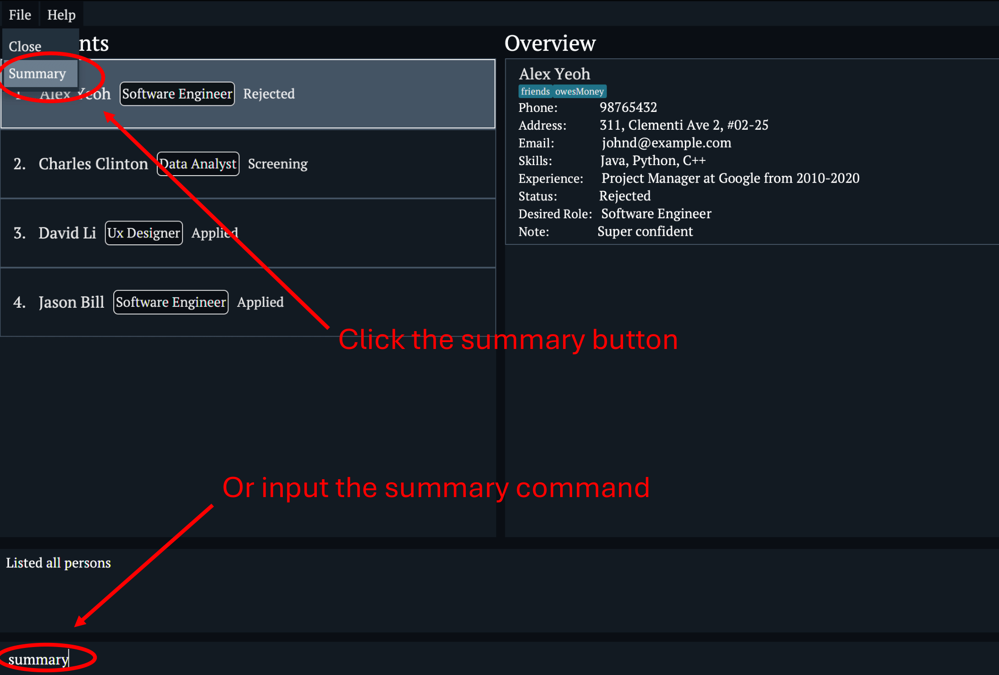

<u>After the summary command is run:</u>

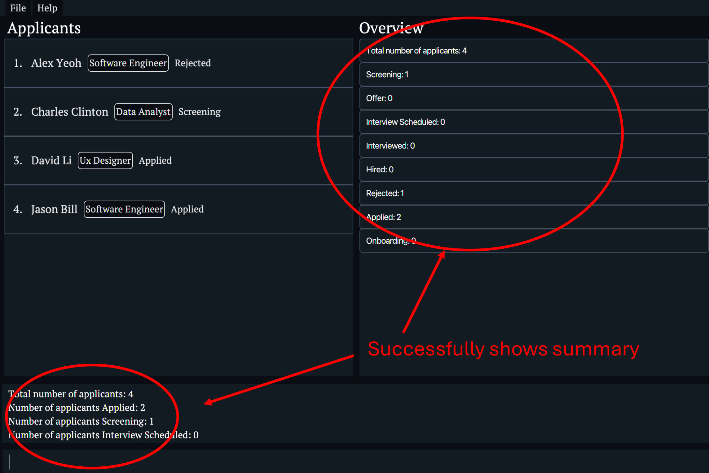

**Summary Output Example:**
The summary will display information such as:
- Total number of applicants
- Number of applicants in each status (e.g., Applied, Screening, Rejected, etc.)

This quick view allows you to monitor the distribution of candidates across different stages.

<strong>[Tip]</strong>: Use the summary command regularly to keep track of your recruitment pipeline's health and quickly identify any bottlenecks in the process.

<strong>[Caution]</strong>: Please call the summary command again after modifying data to refresh the changes.

---

### Clearing All Entries: `clear`

Removes all candidates from TalentSG.

**Format**: `clear`

<u>Image Example<u>

**Before the clear command ran:**

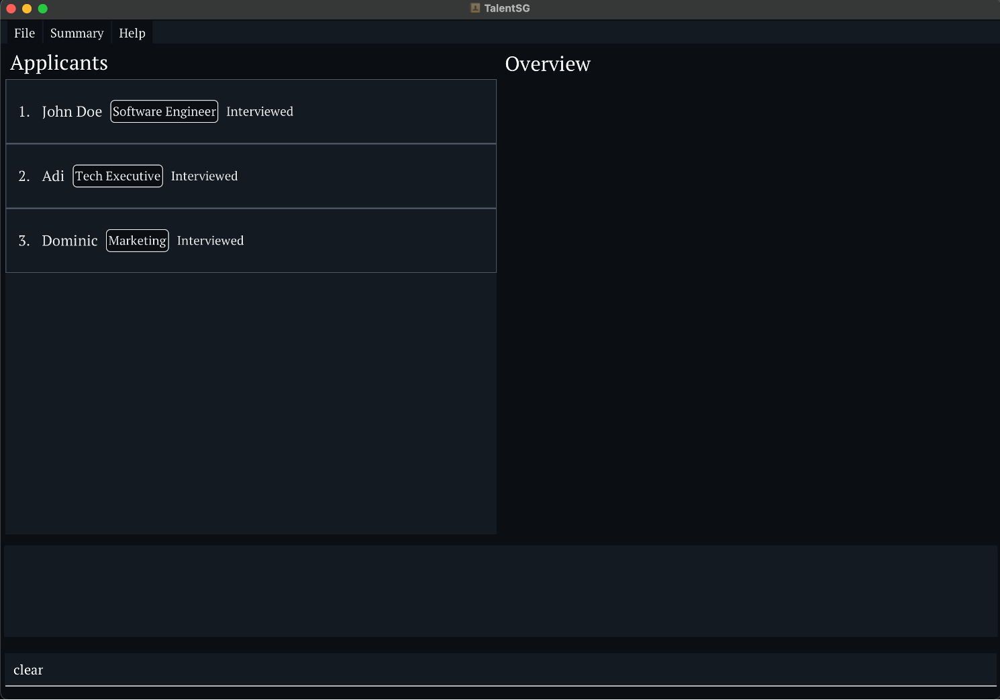


**After the clear command ran:**

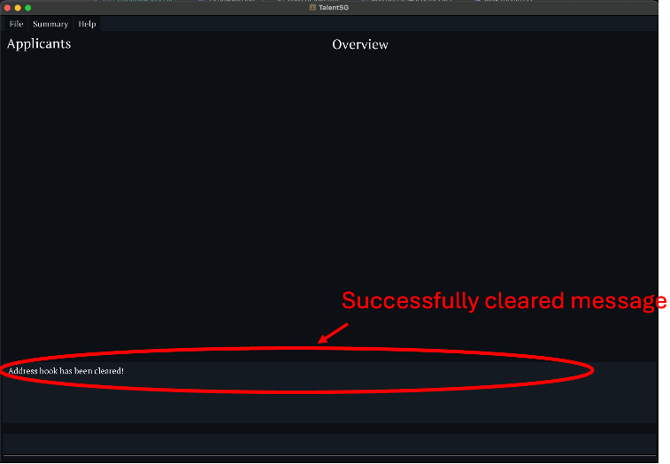

<strong>[Caution]</strong>: Clearing all entries is irreversible. Make sure you have a backup if you want to retain the data for future reference.

---

### Exiting the Program: `exit`

Closes the TalentSG application.

**Format**: `exit`

<u>Image Example<u>

**Running the exit command:**

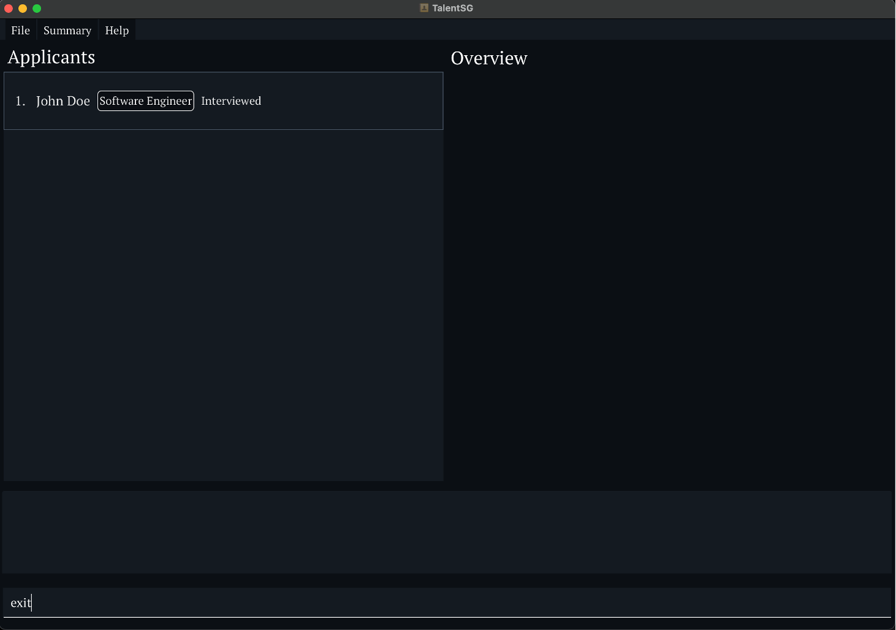

---

### Saving Data

Data is automatically saved in the hard disk after any command that changes the data. There is no need to save manually.

---

### Editing the Data File

Advanced users can edit the data file located at `[JAR file location]/data/addressbook.json`.

<strong>[Caution]</strong>:

- If your changes to the data file make its format invalid, TalentSG will discard all data and start with an empty data file at the next run.
- It is recommended to take a backup of the file before editing it.
- Certain edits can cause TalentSG to behave unexpectedly (e.g., if a value entered is outside of the acceptable range). Therefore, edit the data file only if you are confident that you can update it correctly.

---

### Reporting a Bug: `report bug`

If you encounter any issues or bugs while using TalentSG, you can easily report them through the Report Bug feature. This feature allows users to submit feedback directly through a designated Google Form.

#### How to Report a Bug

1. **Open the Report Bug Window**:
    - In the TalentSG application, go to the **Help** menu at the top and select **Report Bug**.
    - This will open a pop-up window containing a message and a link to the bug report form.

2. **Copy the URL**:
    - Click the **Copy URL** button in the Report Bug window to copy the Google Form link to your clipboard.
    - The message displayed will be:
      _"Let us know the bug through this Google Form: https://forms.gle/cGnn2jZ2fdfhWc3q7"_

3. **Access the Google Form**:
    - Open your browser, paste the URL from the clipboard, and complete the Google Form with details about the bug.
    - Be as descriptive as possible to help us identify and resolve the issue effectively.

#### Example Image

Below is an example of the Report Bug pop-up window that will appear when you access the feature:

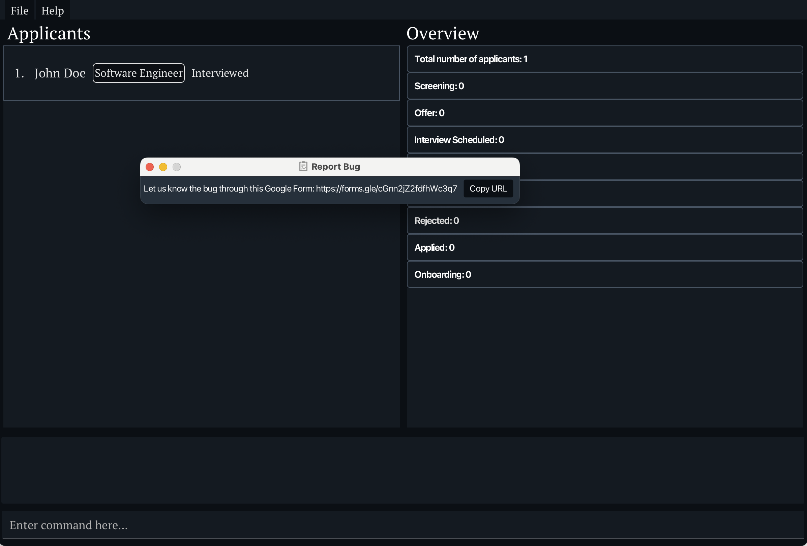

#### Notes
- **Internet Connection**: Ensure that your device has an active internet connection before accessing the Google Form.
- **Privacy**: Your feedback will be used solely for improving TalentSG. Any personal information provided will be handled according to our privacy policy.

<strong>[Tip]</strong>: Reporting bugs with detailed steps and screenshots (if applicable) can help speed up the troubleshooting process.

---

### Archiving Data Files `[coming in v2.0]`

_Details coming soon ..._

--------------------------------------------------------------------------------------------------------------------

## Known Issues and Bugs

1. Result/Feedback display uses a scroll bar. Few users reported feedback information shown is not wrapped but it can be easily tackled by using the scroll bar.
2. 
    

--------------------------------------------------------------------------------------------------------------------

## FAQ

**Q**: How do I transfer my data to another Computer?<br>
**A**: Install the app in the other computer and overwrite the empty data file it creates with the file that contains the data of your previous AddressBook home folder.

**Q**: Help! Double-clicking TalentSG.jar does not launch the application - what should I do?<br>
**A**: Try running the application from the command line using the following command: `java -jar TalentSg.jar`. Windows users can use the Command Prompt application to do this while Mac users can use the Terminal application.

**Q**: When I minimise the application, the entire application has shrunk and now it is gone! Help!<br>
**A**: Currently our application do not allow diagonal or vertical resizing of it. It is best not to resize the application at all and leave it as the maximised mode. For this problem, we suggest that you try to maximise the application from the task manager or try to split the screen with another application so that TalentSG will resize back to normal. If the mentioned solutions fail, please do download TalentSg again!

**Q**: How do I save my data?<br>
**A**: TalentSG saves your data automatically after every command.

**Q**: How do I update to the latest version of TalentSG?<br>
**A**: Simply download the latest `.jar` file released on our GitHub page.

--------------------------------------------------------------------------------------------------------------------

## Glossary

### Interfaces

- **CLI (Command Line Interface)**:
  A text-based interface where users type commands to interact with the application, providing faster and more precise control than a graphical interface.

- **GUI (Graphical User Interface)**:
  A visual interface that lets users interact with the app through graphical elements like buttons, icons, and windows, making it more user-friendly.

### Commands & Formats

- **Command Format**:
  The structure in which commands are entered in the CLI. It includes keywords, parameters, and optional elements that allow flexibility in entering information.

- **Command Parameters**:
  Specific data (e.g., `NAME`, `PHONE_NUMBER`, `EMAIL`) you supply when using commands to customise their actions. Parameters may be required or optional, depending on the command.

- **Placeholder Value**:
  A generic example value in command formats (e.g., `n/NAME`, `p/PHONE_NUMBER`) that shows where users should insert their own specific information.

### Data & Fields

- **Index**:
  A number indicating a specific item in a list, such as a candidate or job entry. For example, the index "2" refers to the second item displayed in the current list.

- **Status**:
  A label representing the current stage of a candidate in the hiring process (e.g., Applied, Interviewed, Hired). Useful for filtering and organizing candidates based on their progress.

- **Tag**:
  A custom label that can be added to candidates, like "friend" or "urgent," to help categorize or prioritize them. Multiple tags can be assigned to each candidate.

- **Field**:
  An attribute or property of a candidate, such as "Name," "Phone Number," or "Email," that can be edited or displayed.

### Functional Categories

- **Module**:
  A feature grouping within TalentSG that includes functions related to candidates and job roles, such as adding, listing, and filtering candidates.

- **Filter**:
  A command that narrows down displayed candidates based on specific criteria, such as "status" or "skills," simplifying searching and management.

### Resources & Links

- **Hyperlink**:
  Underlined and often blue text within the document that, when clicked, redirects to external resources, guides, or downloads. Requires an internet connection.

- **File Path**:
  The directory location on your computer where specific files are stored (e.g., `[JAR file location]/data/addressbook.json`), often used when accessing or editing files.

- **Backup**:
  A saved copy of the data file, recommended before making manual changes to avoid data loss.

This project is based on the AddressBook-Level3 project created by the [SE-EDU initiative](https://se-education.org).
