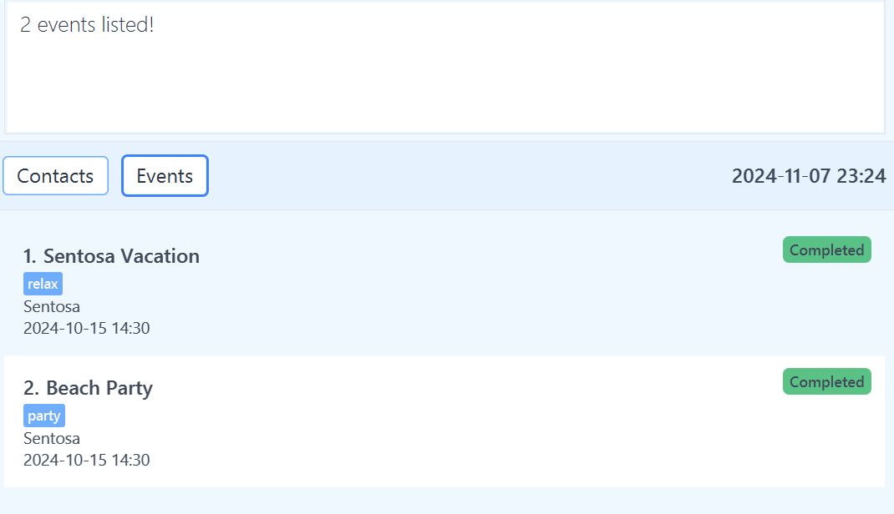

# Eventory User Guide

Eventory is a **desktop app for managing contacts and events, optimized for use via a Command Line Interface** (CLI) while still having the benefits of a Graphical User Interface (GUI).

Main Features:
* Enhanced Contact Management
    * Store All Your Contacts: Add phone numbers, emails, addresses, and tags
    * Contact Linking: Add contacts to events
    * Advanced Filters: Filter by name and tag
* Comprehensive Event Management
    * Track All Your Events: Add locations, start dates, and tags
    * Timeline View: Countdown for upcoming events
    * Advanced Filters: Filter by name, tag, or date


<!-- * Table of Contents -->
<page-nav-print />

--- {.border-primary .thick}

<!-- Quick start -->
## Quick start

1. Ensure you have Java `17` or above installed in your Computer. You can download it [here](https://www.oracle.com/java/technologies/javase/jdk17-archive-downloads.html).

2. Download the latest `.jar` file from [here](https://github.com/AY2425S1-CS2103T-T12-1/tp/releases).

3. Copy the file to the folder you want to use as the _home folder_ for your AddressBook.

4. Open a command terminal, `cd` into the folder you put the jar file in, and use the `java -jar eventory.jar` command to run the application.<br>
   A GUI similar to the below should appear in a few seconds. Note how the app contains some sample data.<br>
   

5. Type the command in the command box and press Enter to execute it. e.g. typing **`help`** and pressing Enter will open the help window.<br>
   Some example commands you can try:

   * `list` : Lists all contacts.

   * `add p n/John Doe p/98765432 e/johnd@example.com a/John street, block 123, #01-01` : Adds a contact named `John Doe` to the Address Book.

   * `delete p 3` : Deletes the 3rd contact shown in the current list.

   * `clear` : Deletes all contacts.

   * `exit` : Exits the app.

6. Refer to the [Features](#features) below for details of each command.

<box type="info">

Refer to [Troubleshooting](#troubleshooting) for help on setting up.
</box>

--- {.border-primary .thick}

<!-- Features -->
## Features

<box type="info" seamless>

**Notes about the command format:**<br>

* Words in `UPPER_CASE` are the parameters to be supplied by the user.<br>
  e.g. in `add p n/NAME`, `NAME` is a parameter which can be used as `add p n/John Doe`.

* Items in square brackets are optional.<br>
  e.g `n/NAME [t/TAG]` can be used as `n/John Doe t/friend` or as `n/John Doe`.

* Items with `…`​ after them can be used multiple times including zero times.<br>
  e.g. `[t/TAG]…​` can be used as ` ` (i.e. 0 times), `t/friend`, `t/friend t/family` etc.

* Parameters can be in any order.<br>
  e.g. if the command specifies `n/NAME p/PHONE_NUMBER`, `p/PHONE_NUMBER n/NAME` is also acceptable.

* Extraneous parameters for commands that do not take in parameters (such as `help`, `list`, `exit` and `clear`) will be ignored.<br>
  e.g. if the command specifies `help 123`, it will be interpreted as `help`.

* If you are using a PDF version of this document, be careful when copying and pasting commands that span multiple lines as space characters surrounding line-breaks may be omitted when copied over to the application.
</box>

--- {.border-secondary}

### Viewing help : `help`

Shows a message with a list of command words and explanation on how to access the help page.


Format: `help`

--- {.border-secondary}

### Listing all persons and events : `list`

Shows a list of all persons and events in the address book.

Format: `list`

--- {.border-secondary}

### Adding a person: `add p`

Adds a person to the address book.

Format: `add p n/NAME p/PHONE_NUMBER e/EMAIL a/ADDRESS [t/TAG]…​`

<box type="tip" seamless>

**Tip:** A person can have any number of tags (including 0)
</box>

<box type="info" seamless>

**Note:** Two persons cannot have the same name, use disambiguation if needed
eg: James (Office)
</box>

Examples:
* `add p n/John Doe p/98765432 e/johnd@example.com a/John street, block 123, #01-01`
* `add p n/Betsy Crowe t/friend e/betsycrowe@example.com a/Newgate Prison p/1234567 t/criminal`

### Adding an event: `add e`

Adds an event to the address book.

Format: `add e n/NAME a/ADDRESS s/START_TIME [t/TAG]…​`

<box type="tip" seamless>

**Tip:** An event can have any number of tags (including 0)
</box>

<box type="info" seamless>

**Note:** Two events cannot have the same name, use disambiguation if needed
eg: Book Fair (Orchard)
</box>

Examples:
* `add e n/Sentosa a/sentosa coast s/2024-10-15 14:30 t/Friends`
* `add e n/Pizza Party a/Clementi Ave 2, #02-25 s/2024-12-01 10:30 t/Work`

--- {.border-secondary}

### Editing a person : `edit p`

Edits an existing person in the address book.

Format: `edit p INDEX [n/NAME] [p/PHONE] [e/EMAIL] [a/ADDRESS] [t/TAG]…​`

* Edits the person at the specified `INDEX`. The index refers to the index number shown in the displayed person list.
* The index must be a positive integer 1, 2, 3, …​
* At least one of the optional fields must be provided.
* Existing values will be updated to the input values.
* When editing tags, the existing tags of the person will be removed i.e adding of tags is not cumulative.
* You can remove all the person’s tags by typing `t/` without
    specifying any tags after it.

Examples:
*  `edit p 1 p/91234567 e/johndoe@example.com` Edits the phone number and email address of the 1st person to be `91234567` and `johndoe@example.com` respectively.
*  `edit p 2 n/Betsy Crower t/` Edits the name of the 2nd person to be `Betsy Crower` and clears all existing tags.

### Editing an event : `edit e`

Edits an existing event in the address book.

Format: `edit e INDEX [n/NAME] [a/ADDRESS] [s/START TIME] [t/TAG]…​`

* Edits the event at the specified `INDEX`. The index refers to the index number shown in the displayed event list.
* The index must be a positive integer 1, 2, 3, …​
* At least one of the optional fields must be provided.
* Existing values will be updated to the input values.
* When editing tags, the existing tags of the event will be removed i.e adding of tags is not cumulative.
* You can remove all the event’s tags by typing `t/` without
  specifying any tags after it.

Examples:
*  `edit e 1 a/80 Blockhome Lane s/2024-12-15 08:30` Edits the address and starting time of the 1st event to be `80 Blockhome Lane` and `2024-12-15 08:30` respectively.
*  `edit e 2 n/Summer Time Convention t/` Edits the name of the 2nd event to be `Summer Time Convention` and clears all existing tags.

--- {.border-secondary}

### Deleting a person : `delete p`

Deletes the specified person from the address book.

Format: `delete p INDEX`

* Deletes the person at the specified `INDEX`.
* The index refers to the index number shown in the displayed person list.
* The index must be a positive integer 1, 2, 3, …​

Examples:
* `list` followed by `delete p 2` deletes the 2nd person in the address book.
* `find p Betsy` followed by `delete p 1` deletes the 1st person in the results of the `find` command.

Before and After:
<div style="display: flex;">

  
  
</div>

### Deleting an event : `delete e`

Deletes the specified event from the address book.

Format: `delete e INDEX`

* Deletes the event at the specified `INDEX`.
* The index refers to the index number shown in the displayed events list.
* The index must be a positive integer 1, 2, 3, …​

Examples:
* `list` followed by `delete e 2` deletes the 2nd event in the address book.
* `find e Party` followed by `delete e 1` deletes the 1st event in the results of the `find` command.

Before and After:
<div style="display: flex;">

  
  
</div>

--- {.border-secondary}

### Locating persons by name: `find p`

Finds persons whose names contain any of the given keywords.

Format: `find p KEYWORD [MORE_KEYWORDS]`

* The search is case-insensitive. e.g `hans` will match `Hans`
* The order of the keywords does not matter. e.g. `Hans Bo` will match `Bo Hans`
* Only the name is searched.
* Only full words will be matched e.g. `Han` will not match `Hans`
* Persons matching at least one keyword will be returned (i.e. `OR` search).
  e.g. `Hans Bo` will return `Hans Gruber`, `Bo Yang`

Examples:
* `find p John` returns `john` and `John Doe`
* `find p alex david` returns `Alex Yeoh`, `David Li`<br>
  

### Locating event by name: `find e`

Finds events whose names contain any of the given keywords.

Format: `find e KEYWORD [MORE_KEYWORDS]`

* The search is case-insensitive. e.g `sentosa` will match `Sentosa`
* The order of the keywords does not matter. e.g. `Sentosa Party` will match `Party Sentosa`
* Only the name is searched.
* Only full words will be matched e.g. `Sentos` will not match `Sentosa`
* Persons matching at least one keyword will be returned (i.e. `OR` search).
  e.g. `Sentosa Party` will return events with the words `Party`, `Sentosa`

Examples:
* `find e Sentosa` returns `sentosa` and `Sentosa Party`
* `find e Sentosa Party` returns `Sentosa Vacation`, `Beach Party`<br>
  

--- {.border-secondary}

### Locating persons by tag: `search p`

Finds persons whose tags contain any of the given keywords.

Format: `search p KEYWORD [MORE_KEYWORDS]`

* The search is case-insensitive. e.g `friends` will match `Friends`
* The order of the keywords does not matter. e.g. `Work Friends` will match `Friends Work`
* Only the tag name is searched.
* Only full words will be matched e.g. `Friend` will not match `Friends`
* Persons with tags matching at least one keyword will be returned (i.e. `OR` search).
  e.g. `Work Friends` will return persons with tags `Hobby Friends`, `Work Partners`

Examples:
* `search p Friends` returns persons with tags named `Friends`
* `search p Work Friends` returns persons with tags named `Friends` or `Work`<br>
  

### Locating events by tag: `search e`

Finds events whose tags contain any of the given keywords.

Format: `search e KEYWORD [MORE_KEYWORDS]`

* The search is case-insensitive. e.g `friends` will match `Friends`
* The order of the keywords does not matter. e.g. `Summer Fashion` will match `Fashion Summer`
* Only the tag name is searched.
* Only full words will be matched e.g. `Friend` will not match `Friends`
* Events with tags matching at least one keyword will be returned (i.e. `OR` search).
  e.g. `Work Friends` will return persons with tags `Hobby Friends`, `Work Partners`

Examples:
* `search e Friends` returns events with tags named `Friends`
* `search e Summer Fashion` returns events with tags named `Summer` or `Fashion`<br>
  

--- {.border-secondary}

### Linking a person to an event : `link`

Creates a link between a person and event which will appear in the person's details.

Format: `link INDEX ev/EVENT_NAME`

Examples:
* `list` followed by `link 2 ev/Winter Time Convention` links the 2nd person in the address book to the event.
  
* `find p John` followed by `link 1 ev/Summer Time Convention` links the 1st person in the results of the `find` command to the event.
  

### Unlinking a person from an event : `unlink`

Removes an existing link between a person and an event, so the event no longer appears in the person's details.

Format: `unlink INDEX ev/EVENT_NAME`

Examples:

* `list` followed by `unlink 2 ev/Winter Time Convention` removes the link between the 3rd person in the address book and the event.
  
* `find p John` followed by `unlink 1 ev/Summer Time Convention` removes the link between the 1st person in the results of the `find` command and the event.
  

--- {.border-secondary}

### Display events in schedule : `schedule`

If non-negative integer given, find all events happening in the next given number of days.
If negative integer given, find all events that happened in the past given number of days.
Lists all events happening on the given date.

Format: `schedule NUMBER_OF_DAYS` or `schedule YYYY-MM-DD`

Examples:

* `schedule 7` displays all events happening within 7 days from the current date.
* `schedule 0` displays all events happening on this day.
* `schedule -7` displays all events that happened in the past 7 days from the current date.
* `schedule 2024-01-01` displays all events occurring on 1 Jan 2024.

--- {.border-secondary}

### Clearing all entries : `clear`

Displays a confirmation, enter exactly "Y" or "Yes" to clear all entries from the address book.

Format: `clear` then `Y` or `Yes`


### Clearing all persons : `clear p`

Displays a confirmation, enter "Y" or "Yes" to clear all persons from the address book.

Format: `clear p` then `Y` or `Yes`


### Clearing all events : `clear e`

Displays a confirmation, enter "Y" or "Yes" to clear all events from the address book.

Format: `clear e` then `Y` or `Yes`

--- {.border-secondary}

### Exiting the program : `exit`

Exits the program.

Format: `exit`

--- {.border-secondary}

### Saving the data

AddressBook data are saved in the hard disk automatically after any command that changes the data. There is no need to save manually.

### Editing the data file

AddressBook data are saved automatically as a JSON file `[JAR file location]/data/addressbook.json`. Advanced users are welcome to update data directly by editing that data file.

<box type="warning" seamless>

**Caution:**
If your changes to the data file makes its format invalid, AddressBook will discard all data and start with an empty data file at the next run.  Hence, it is recommended to take a backup of the file before editing it.<br>
Furthermore, certain edits can cause the AddressBook to behave in unexpected ways (e.g., if a value entered is outside the acceptable range). Therefore, edit the data file only if you are confident that you can update it correctly.
</box>

--- {.border-primary .thick}

## FAQ

**Q**: How do I transfer my data to another Computer?<br>
**A**: Install the app in the other computer and overwrite the empty data file it creates with the file that contains the data of your previous AddressBook home folder.

--- {.border-primary .thick}

## Troubleshooting

<box type="important" seamless icon=":question:">

"I don’t know if I have Java installed or what version I have."

</box>

<box type="tip" seamless>

* Open a command prompt (on Windows) or terminal (on macOS/Linux).
* Type the command: ```java -version```
* If Java is installed, you should see a version number. Look for a line that says java version "17.0.1" or higher.
* If you don’t have Java installed or see a version lower than 17, download the latest Java Development Kit (JDK) from [here](https://www.oracle.com/java/technologies/javase/jdk17-archive-downloads.html).

</box>

--- {.border-secondary}

<box type="important" seamless icon=":question:">

"I’m not sure what the home folder is or where to copy the file."

</box>

<box type="tip" seamless>

The home folder can be any folder where you’d like to store your Eventory files. This folder will contain your Eventory data as you use the application.
Choose a location you can easily find later (e.g., Desktop or Documents).
Copy (or move) the downloaded .jar file into this folder.

</box>

--- {.border-secondary}

<box type="important" seamless icon=":question:">

"I’m not familiar with how to open a command terminal or navigate to a folder."

</box>

<box type="tip" seamless>

On Windows:

Press Win + R, type cmd, and press Enter to open the command prompt.
Use the cd command to navigate to your folder. For example, if your file is on the Desktop, type:
```
cd Desktop
```

On macOS:

Press Command + Space, type Terminal, and press Enter.
Use the cd command to navigate to your folder. For example, if your file is on the Desktop, type:
```
cd ~/Desktop
```
On Linux:

Open your terminal (often found in Applications > Utilities or by pressing Ctrl + Alt + T).
Use the cd command to navigate to your folder. For example, if your file is on your home directory, type:
```
cd ~
```

<box type="info" light>

If the folder path has spaces, enclose it in quotes. For example:
```
cd "C:\Users\YourName\Desktop\My Folder"
cd "~/My Folder"
```
</box>
</box>

<box type="important" seamless icon=":question:">

"I get an error when I try to run the command java -jar eventory.jar."

</box>

<box type="tip" seamless>

Check the file name: Ensure you’re using the exact name of the .jar file. If the file has a different name, or was renamed, use that exact name in the command instead:
```
java -jar "DifferentName.jar"
```
<box type="info" light>
If you receive a "Permission denied" error, ensure you have permissions to access the folder and file. Try running the terminal as an administrator (on Windows) or using sudo before the command on macOS/Linux.
Java not recognized: If you get an error like "java is not recognized as an internal or external command," Java may not be installed correctly, or it’s not in your system's PATH. Refer back to Step 1 to verify and reinstall if necessary.

</box>
</box>

--- {.border-primary .thick}

## Known issues

1. **When using multiple screens**, if you move the application to a secondary screen, and later switch to using only the primary screen, the GUI will open off-screen. The remedy is to delete the `preferences.json` file created by the application before running the application again.
2. **If you minimize the Help Window** and then run the `help` command (or use the `Help` menu, or the keyboard shortcut `F1`) again, the original Help Window will remain minimized, and no new Help Window will appear. The remedy is to manually restore the minimized Help Window.

--- {.border-primary .thick}

## Command summary

| Action                   | Format, Examples                                                                                                                                                          |
|--------------------------|---------------------------------------------------------------------------------------------------------------------------------------------------------------------------|
| **Add Person**           | `add p n/NAME p/PHONE_NUMBER e/EMAIL a/ADDRESS [t/TAG]…​` <br> e.g., `add p n/James Ho p/22224444 e/jamesho@example.com a/123, Clementi Rd, 1234665 t/friend t/colleague` |
| **Add Event**            | `add e n/NAME a/ADDRESS s/START_TIME [t/TAG]…​` <br> e.g., `add e n/Sentosa a/sentosa coast s/2024-10-15 14:30 t/Friends`                                                 |
| **Clear**                | `clear`                                                                                                                                                                   |
| **Clear Person**         | `clear p`                                                                                                                                                                 |
| **Clear Event**          | `clear e`                                                                                                                                                                 |
| **Delete Person**        | `delete p INDEX`<br> e.g., `delete p 3`                                                                                                                                   |
| **Delete Event**         | `delete e INDEX`<br> e.g., `delete e 3`                                                                                                                                   |
| **Edit Person**          | `edit p INDEX [n/NAME] [p/PHONE_NUMBER] [e/EMAIL] [a/ADDRESS] [t/TAG]…​`<br> e.g.,`edit p 2 n/James Lee e/jameslee@example.com`                                           |
| **Edit Event**           | `edit e INDEX [n/NAME] [a/ADDRESS] [s/START_TIME] [t/TAG]`<br> e.g.,`edit e 2 n/Summer t/fashion`                                                                         |
| **Find Person**          | `find KEYWORD [MORE_KEYWORDS]`<br> e.g., `find p James Jake`                                                                                                              |
| **Find Event**           | `find KEYWORD [MORE_KEYWORDS]`<br> e.g., `find e Sentosa`                                                                                                                 |
| **Schedule**             | `schedule NUMBER_OF_DAYS` or `schedule YYYY-MM-DD` <br> e.g.,`schedule 7`,`schedule -5`,`schedule 2024-10-15`                                                             |
| **Search Person by Tag** | `search p KEYWORD [MORE_KEYWORDS]`<br> e.g., `search p Friends`                                                                                                           |
| **Search Event by Tag**  | `search e KEYWORD [MORE_KEYWORDS]`<br> e.g., `search e Summer`                                                                                                            |
| **Link**                 | `link INDEX ev/` <br> e.g., `link 1 ev/Winter Convention`                                                                                                                 |
| **Unlink**               | `unlink INDEX ev/EVENT_NAME` <br> e.g., `unlink 1 ev/Winter Convention`                                                                                                   |
| **List**                 | `list`                                                                                                                                                                    |
| **Help**                 | `help`                                                                                                                                                                    |
