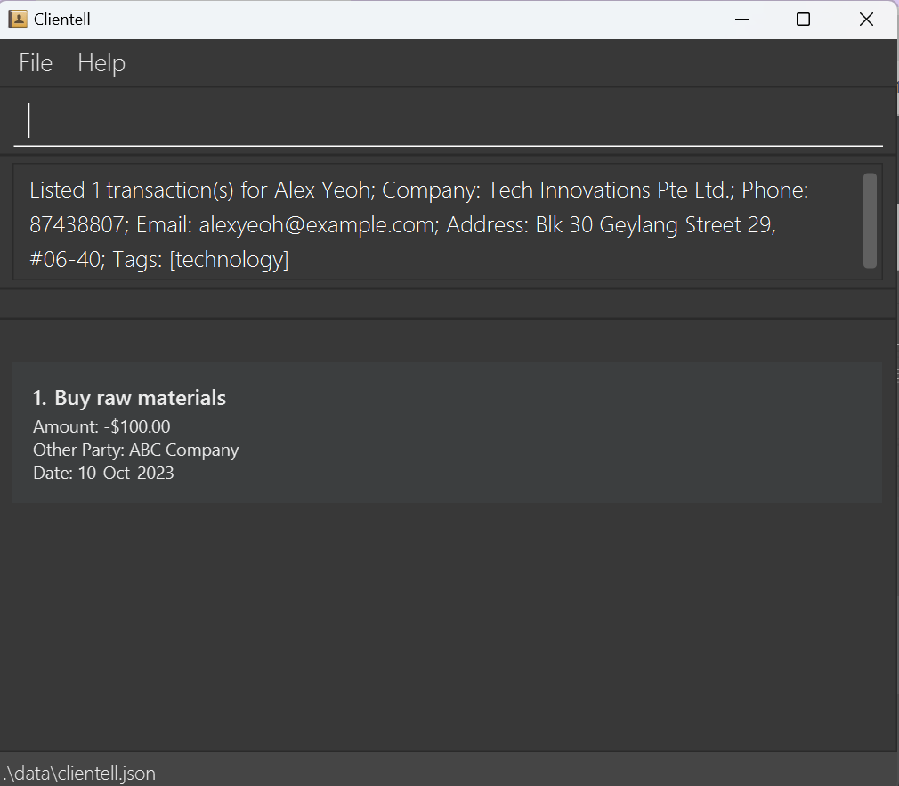

# Clientell User Guide

Clientell is a **desktop app for managing clients, optimized for use via a Command Line Interface** (CLI) while still having the benefits of a Graphical User Interface (GUI). If you can type fast, Clientell can get your client management tasks done faster than traditional GUI apps.

## Table of Contents
- [Quick Start](#quick-start)
- [Features](#features)
  - [General Commands](#general-commands)
  - [Client Management Commands](#client-management-commands)
  - [Transaction Management Commands](#transaction-management-commands)
  - [Data Management](#data-management)
- [FAQ](#faq)
- [Known Issues](#known-issues)
- [Command Summary](#command-summary)

<!-- * Table of Contents -->
<page-nav-print />

--------------------------------------------------------------------------------------------------------------------

## Quick start

1. Ensure you have Java `17` or above installed in your Computer.

2. Download the latest `.jar` file from [here](https://github.com/AY2425S1-CS2103T-F13-4/tp/releases).

3. Copy the file to the folder you want to use as the _home folder_ for the application.

4. Open a command terminal, `cd` into the folder you put the jar file in, and use the `java -jar clientell.jar` command to run the application. 
   A GUI similar to the below should appear in a few seconds. Note how the app contains some sample data. 
   

5. Type the command in the command box and press Enter to execute it. e.g. typing **`help`** and pressing Enter will open the help window. 
   Some example commands you can try:

   * `list` : Lists all clients.

   * `add n/John Doe c/ABC Inc. p/98765432 e/johnd@example.com a/John street, block 123, #01-01` : Adds a client named `John Doe` to the application.

   * `delete 3` : Deletes the 3rd client shown in the current list.

   * `clear` : Deletes all clients.

   * `exit` : Exits the app.

6. Refer to the [Features](#features) below for details of each command.

--------------------------------------------------------------------------------------------------------------------

## Features

<box type="info" seamless>

**Notes about the command format:** 

* Words in `UPPER_CASE` are the parameters to be supplied by the user. 
  e.g. in `add n/NAME`, `NAME` is a parameter which can be used as `add n/John Doe`.

* Parameters supplied by the user must never contain protected keywords, namely command words and delimeters (`x/`). 
  e.g. `add n/add`, `add n/n/` are not allowed.

* Items in square brackets are optional. 
  e.g. `n/NAME [t/TAG]` can be used as `n/John Doe t/friend` or as `n/John Doe`.

* Items with `…`​ after them can be used multiple times including zero times. 
  e.g. `[t/TAG]…​` can be used as ` ` (i.e. 0 times), `t/friend`, `t/friend t/family` etc.

* Parameters can be in any order. 
  e.g. if the command specifies `n/NAME p/PHONE_NUMBER`, `p/PHONE_NUMBER n/NAME` is also acceptable.

* Extraneous parameters for commands that do not take in parameters (such as `help`, `list`, `exit` and `clear`) will be ignored. 
  e.g. if the command specifies `help 123`, it will be interpreted as `help`.

* If you are using a PDF version of this document, be careful when copying and pasting commands that span multiple lines as space characters surrounding line-breaks may be omitted when copied over to the application.
</box>

<box type="warning" seamless>

**Handling Errors In User Input:**
* First checks for valid command. 
* Then checks for presence of fields for that command.
* Lastly checks if the command is run in the correct view (client VS transaction view).

</box>

### General Commands

#### Viewing help : `help`

Shows a message explaning how to access the help page.

Format: `help`

#### Clearing all entries : `clear`

Clears all clients and associated transactions from the application.

Format: `clear`

#### Exiting the program : `exit`

Exits the program.

Format: `exit`

### Client Management Commands

#### Adding a client: `add`

Adds a client to the application.

Format: `add n/NAME c/COMPANY p/PHONE_NUMBER e/EMAIL a/ADDRESS [t/TAG]…​`

<box type="tip" seamless>

**Tips:**  

* A client can have any number of tags (including 0). 

* Names are automatically formatted for you (i.e natural name casing, name ordinals below 10, excess spacing). 

* Phone numbers can also take in additional info (i.e `(+XXX)` in front for country codes, `[Note]` behind for any notes). 

* Phone numbers also allow up to 1 space between numbers to cater to your formatting style (e.g `123 45 678` and `1234 5678` allowed and recorded verbatim). 

* Phone numbers are also automatically formatted (i.e main number ignores non-numeric characters and excess spaces). 
</box>

Examples:
* `add n/John Doe c/ABC Inc. p/98765432 e/johnd@example.com a/John street, block 123, #01-01`
* `add n/Betsy Crowe t/friend e/betsycrowe@example.com a/Newgate Prison p/1234567 t/criminal c/XYZ Co.`
* `add n/jOhN   dOE vii c/ABC Inc. p/98765432 e/johnd@example.com a/John street, block 123, #01-01` (This name is recorded as `John Doe VII`)
* `add n/John Doe c/ABC Inc. p/(+65) 987 654 32 [HP] e/johnd@example.com a/John street, block 123, #01-01` (This phone number is recorded exactly as  `(+65) 987 654 32 [HP]`)

<box type="info" seamless>

**Notes on name and phone parsing:**  

* Name casing and spacing typos are tedious, hence our autocorrection and duplicate handling. 

* It should be impossible for you to meet 10 generations with the same name, hence our limit on the name ordinal. 

* Country codes range from +1 to +999, and [Notes] should be for very brief add-on info about the number. 

* Phone numbers are very generously autocorrected, but we can't correct the (+XXX) country code and [Notes].

</box>

#### Listing all clients : `list`

Shows a list of all clients in the application, together with their current financial balance.

Format: `list`
<box type="tip" seamless>

**Tips:** Negative balances are red. Positive and zero balances are green.
</box>

#### Editing a client : `edit`

Edits an existing client in the application.

Format: `edit INDEX [n/NAME] [c/COMPANY] [p/PHONE] [e/EMAIL] [a/ADDRESS] [t/TAG]…​`

* Edits the client at the specified `INDEX`. The index refers to the index number shown in the displayed client list. The index **must be a positive integer** 1, 2, 3, …​
* At least one of the optional fields must be provided.
* Existing values will be updated to the input values.
* When editing tags, the existing tags of the client will be removed i.e adding of tags is not cumulative.
* You can remove all the client's tags by typing `t/` without
    specifying any tags after it.

<box type="warning" seamless>

**Note:** `edit` can only be used in client list view.
</box>

Examples:
*  `edit 1 p/91234567 e/johndoe@example.com` Edits the phone number and email address of the 1st client to be `91234567` and `johndoe@example.com` respectively.
*  `edit 2 n/Betsy Crower t/` Edits the name of the 2nd client to be `Betsy Crower` and clears all existing tags.

#### Locating clients by name or company: `find`

Finds clients whose names or companies contain any of the given keywords.

Format: `find KEYWORD [MORE_KEYWORDS]`

* The search is case-insensitive. e.g `hans` will match `Hans`
* The order of the keywords does not matter. e.g. `Hans Bo` will match `Bo Hans`
* The name and company are searched.
* Only full words will be matched e.g. `Han` will not match `Hans`
* clients matching at least one keyword will be returned (i.e. `OR` search).
  e.g. `Hans Bo` will return `Hans Gruber`, `Bo Yang`

<box type="warning" seamless>

**Note:** `find` can only be used in client list view.
</box>

Examples:
* `find John` returns `john` and `John Doe`
* `find alex creative` returns `Alex Yeoh`, `Charlotte Oliveiro`, whose company matches `creative` 
  

#### Deleting a client : `delete`

Deletes the specified client from the application.

Format: `delete INDEX`

* Deletes the client at the specified `INDEX`.
* The index refers to the index number shown in the displayed client list.
* The index **must be a positive integer** 1, 2, 3, …​

<box type="warning" seamless>

**Note:** `delete` can only be used in client list view.
</box>

Examples:
* `list` followed by `delete 2` deletes the 2nd client in the application.
* `find Betsy` followed by `delete 1` deletes the 1st client in the results of the `find` command.

### Transaction Management Commands

#### Adding a Transaction to a specified client: `addt`

Format: `addt INDEX d/DESCRIPTION amt/AMOUNT o/OTHER_PARTY dt/DATE`

* Adds a transaction to the client at the specified `INDEX`
* The index refers to the index number shown in the displayed client list.
* The index **must be a positive integer** 1, 2, 3, …​
* The amount should be a number of up to two decimal places containing only digits (`0 - 9`), one decimal point (`.`) if needed and one minus sign (`-`) if needed.
e.g. `10, -100.5, 1000.55`
* If the amount includes a decimal point, there should be at least one digit before and one digit after the decimal point. 
e.g. `0.5`
* If the amount includes a minus sign, the minus sign should be the first character e.g. `-100`
* The date should be in the format `YYYY-MM-DD` e.g. `2024-12-20`

<box type="warning" seamless>

**Note:** `addt` can only be used in client list view.
</box>

Examples:
* `addt 1 d/buy raw materials amt/-100.55 o/Company ABC dt/2024-10-16`
* `list` followed by `addt 1 d/buy new equipment amt/-10000.5 o/ABC Motor Group dt/2024-11-17` 
adds the transaction to the 1st client in the application.
* `find David` followed by `addt 1 d/sell raw materials amt/200 o/Company XYZ dt/2024-09-01` 
adds the transaction to the 1st client in the results of the `find` command.

#### Listing Transactions for a specified client: `listt`

Format: `listt INDEX`

* Lists the transactions for the client at the specified `INDEX`.
* The index refers to the index number shown in the displayed client list when using `list` or `find` command.
* The index **must be a positive integer** 1, 2, 3, …​

<box type="warning" seamless>

**Note:** `listt` can only be used in client list view.
</box>

Examples:
* `list` followed by `listt 1` lists transactions for the 1st client in the application.
  
* `find Betsy` followed by `listt 1` lists the transactions for the 1st client in the results of the `find` command.

#### Deleting Transactions for a specified client: `deletet`

Format: `deletet INDEX`

* Deletes the transactions at the specified `INDEX`.
* The index refers to the index number of the transaction when using `listt` command.
* The index **must be a positive integer** 1, 2, 3, …​

<box type="warning" seamless>

**Note:** `deletet` can only be used in transaction list view.
</box>

Examples:
* `listt 1` followed by `deletet 1` loads the transaction list for the first client, then deletes the first transaction.

#### Finding Transactions by description: `findt`

In a transaction list, finds all transactions with descriptions matching any of the given keywords.

Format: `findt KEYWORD [MORE_KEYWORDS]`

* The search is case-insensitive. e.g. `invest` will match `Invest`
* The order of the keywords does not matter. e.g. `invest material` will match `Material Invest`
* Only the description is searched.
* Only full words will be matched e.g.  `invest` will not match `investing`
* clients matching at least one keyword will be returned (i.e. `OR` search).
  e.g. `investing material` will return `material purchase`, `future investing`

<box type="warning" seamless>

**Note:** `findt` can only be used in transaction list view.
</box>

Examples:
* `listt 1` followed by `findt materials invest` returns `Invest` and `Buy raw materials`, which are transactions of person 1.

#### Summarising transactions within month range: `summary`

In a transaction list, summarises the transactions' amount within the specified month range and displays them.

Format: `summary s/START_MONTH e/END_MONTH`
* `START_MONTH` and `END_MONTH` should be in the format `YYYY-MM` e.g. `2024-10`
* The `START_MONTH` should be before or equal to the `END_MONTH`
* The transactions whose date falls within the first day of `START_MONTH` and the last day of `END_MONTH` (inclusive) will be summarised.

<box type="warning" seamless>

**Note:** `summary` can only be used in transaction list view.
</box>

Examples:
* `listt 1` followed by `summary s/2024-09 e/2024-10` summarises the transactions of person 1 within the month of September and October 2024.

### Data Management

#### Saving the data

Clientell data are saved in the hard disk automatically after any command that changes the data. There is no need to save manually.

#### Editing the data file

Clientell data are saved automatically as a JSON file `[JAR file location]/data/clientell.json`. Advanced users are welcome to update data directly by editing that data file.

<box type="warning" seamless>

**Caution:**
If your changes to the data file makes its format invalid, Clientell will discard all data and start with an empty data file at the next run.  Hence, it is recommended to take a backup of the file before editing it. 
Furthermore, certain edits can cause the Clientell to behave in unexpected ways (e.g., if a value entered is outside the acceptable range). Therefore, edit the data file only if you are confident that you can update it correctly.
</box>

--------------------------------------------------------------------------------------------------------------------

## FAQ

**Q**: How do I transfer my data to another Computer? 
**A**: Install the app in the other computer and overwrite the empty data file it creates with the file that contains the data of your previous Clientell home folder.

**Q**: What should I do if the application won't start? 
**A**: First verify Java 17 or above is installed correctly. If the problem persists, check if the `clientell.json` file is corrupted. You can also try deleting the `preferences.json` file and restart.

**Q**: Can I customize the data file location? 
**A**: Currently, the data file location is fixed to the application directory. However, you can create a symbolic link if you need the data stored elsewhere.

**Q**: How do I backup my data? 
**A**: Simply copy the `clientell.json` file to a backup location. Consider setting up automated backups of this file.

**Q**: What should I do if I accidentally delete a client? 
**A**: Use your latest backup of the `clientell.json` file. There's currently no undo feature, so regular backups are recommended.

**Q**: Can I import data from other applications? 
**A**: Currently, direct import is not supported. However, you can manually format your data as JSON matching Clientell's format.

--------------------------------------------------------------------------------------------------------------------

## Known issues

1. **When using multiple screens**, if you move the application to a secondary screen, and later switch to using only the primary screen, the GUI will open off-screen. The remedy is to delete the `preferences.json` file created by the application before running the application again.
2. **If you minimize the Help Window** and then run the `help` command (or use the `Help` menu, or the keyboard shortcut `F1`) again, the original Help Window will remain minimized, and no new Help Window will appear. The remedy is to manually restore the minimized Help Window.

--------------------------------------------------------------------------------------------------------------------

## Command Summary

Client Commands | Format |
---------------|--------
Add | `add n/NAME c/COMPANY p/PHONE_NUMBER e/EMAIL a/ADDRESS [t/TAG]…`
List | `list`
Find | `find KEYWORD [MORE_KEYWORDS]`
Edit | `edit INDEX [n/NAME] [c/COMPANY] [p/PHONE_NUMBER] [e/EMAIL] [a/ADDRESS] [t/TAG]…`
Delete | `delete INDEX`

**Transaction Commands**

For Client List View | Format
--------------------|--------
Add Transaction | `addt INDEX d/DESCRIPTION amt/AMOUNT o/OTHER_PARTY dt/DATE`
List Transactions | `listt INDEX`

For Transaction List View | Format
--------------------|--------
Delete Transaction | `deletet INDEX`
Find Transactions | `findt KEYWORD [MORE_KEYWORDS]`
Summarise Transactions | `summary s/START_MONTH e/END_MONTH`

General Commands | Format
----------------|--------
Help | `help`
Clear | `clear`
Exit | `exit`
