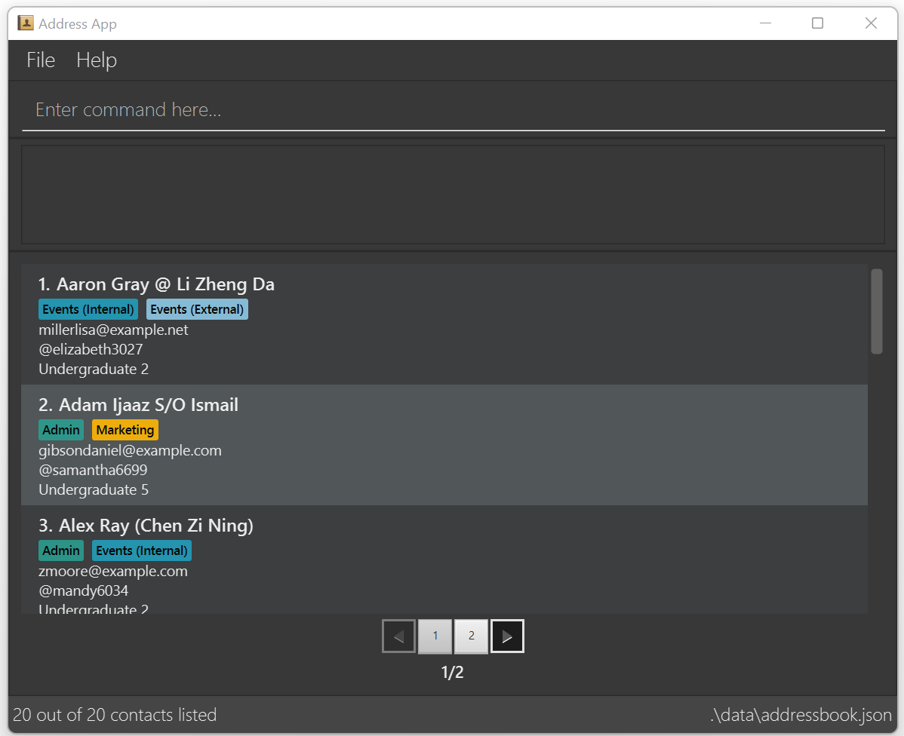

# data_coNdUctorS User Guide

data_coNdUctorS is a **desktop address book application for managing contact details of members in NUS Co-Curricular Activity (CCA) groups**. It is optimised for use via a Command Line Interface (CLI) while still having the benefits of a Graphical User Interface (GUI). If you can type fast, data_coNdUctorS can get your contact management tasks done faster than traditional GUI apps.

--------------------------------------------------------------------------------------------------------------------

## Table of Contents

- [Quick Start](#quick-start)
- [Command Summary](#command-summary)
- [Features](#feature-details)
  - [General Notes about Command Format](#general-notes-about-command-format)
  - [Adding a Contact: add](#adding-a-contact-add)
  - [Editing a Contact: edit](#editing-a-contact-edit)
    - [Edit by index](#edit-by-index)
    - [Edit by name](#edit-by-name)
  - [Deleting a Contact: delete](#deleting-a-contact-delete)
    - [Delete by index](#delete-by-index)
    - [Delete by name](#delete-by-name)
  - [Finding Contacts by Contact Details: find](#finding-contacts-by-contact-details-find)
  - [Listing all Contacts: list](#listing-all-contacts-list)
  - [Viewing Help: help](#viewing-help-help)
  - [Clearing all Entries: clear](#clearing-all-entries-clear)
  - [Exiting the Program: exit](#exiting-the-program-exit)
  - [Displaying Contacts in Pages: Pagination](#displaying-contacts-in-pages-pagination)
  - [Showing Total Number of Contacts: Footer Status Bar](#showing-total-number-of-contacts-status-bar-footer)
  - [Saving the Data](#saving-the-data)
  - [Editing the Data File](#editing-the-data-file)
- [What is Considered as Invalid Contacts](#what-is-considered-as-invalid-contacts)
- [Contact Fields Constraints](#contact-fields-constraints)
  - [Name](#name)
  - [Telegram Handle](#telegram-handle)
  - [Email](#email)
  - [Student Status](#student-status)
  - [Role](#role)
  - [Nickname](#nickname)
- [FAQ](#faq)
- [Known Issues](#known-issues)

--------------------------------------------------------------------------------------------------------------------

## Quick start

1. Ensure you have Java `17` or above installed in your Computer.

2. Download the latest `.jar` file from [here](https://github.com/AY2425S1-CS2103-F09-1/tp/releases/tag/v1.6).

3. Copy the file to the folder you want to use as the _home folder_ for the application.

4. Open a command terminal, `cd` into the folder you put the jar file in, and use the `java -jar data_coNdUctorS.jar` command to run the application. A GUI similar to the below should appear in a few seconds. 
   
   
   Note how the app:
   * Contains some sample data 
   * Displays contacts in alphabetical order
   * Utilises [Pagination](#displaying-contacts-in-pages-pagination) where 10 contacts are displayed per page at any one time 
   * Shows both the number of contacts listed in the displayed pages and the total number of contacts stored in the application in the status bar footer
    
    

5. Type the command in the command box and press Enter to execute it. e.g. typing **`help`** and pressing Enter will open the help window. 
   Some example commands you can try:

    * `list`: Lists all contacts.
    * `add n/John Doe th/johnny_9876_haha ss/undergraduate 3 e/johnd@example.com r/Admin`: Adds a contact named `John Doe` to the Address Book application.
    * `delete 3`: Deletes the 3rd contact shown in the current displayed list.
    * `clear`: Deletes all contacts.
    * `exit`: Exits the app.

     

6. Refer to [Command Summary](#command-summary) for a general overview of the commands available.

7. Refer to [Features](#feature-details) below for the details of each command feature and UI features.

## Command Summary

| Action                                                                                | Format, Examples                                                                                                                                                                                                                                                                                       |
|---------------------------------------------------------------------------------------|--------------------------------------------------------------------------------------------------------------------------------------------------------------------------------------------------------------------------------------------------------------------------------------------------------|
| **[Add](#adding-a-contact-add)** adds a contact                                | `add n/NAME th/TELEGRAM_HANDLE ss/STUDENT_STATUS e/EMAIL r/ROLE…​ [nn/NICKNAME]`   e.g., `add n/James Ho th/jamesho123 ss/undergraduate 3 e/jamesho@example.com r/Admin r/President`                                                                                                                |
| **[Edit](#editing-a-contact-edit)** edits a contact                            | `edit INDEX [n/NAME] [th/TELEGRAM_HANDLE] [e/EMAIL] [ss/STUDENT_STATUS] [r/ROLE]…​ [nn/NICKNAME]` `edit FULL_NAME [n/NAME] [th/TELEGRAM_HANDLE] [e/EMAIL] [ss/STUDENT_STATUS] [r/ROLE]…​ [nn/NICKNAME]`  e.g.,`edit 2 n/James Lee e/jameslee@example.com`   e.g.,`edit James Ho n/James Lee` |
| **[Delete](#deleting-a-contact-delete)** deletes a contact                     | `delete INDEX` e.g. `delete 3`    `delete FULL_NAME` e.g. `delete James Ho`   `delete n/FULL_NAME` e.g. `delete n/James Ho`                                                                                                                                                                      |
| **[Find ](#finding-contacts-by-contact-details-find)** shows specific contacts | `find [n/NAME] [th/TELEGRAM_HANDLE] [e/EMAIL] [ss/STUDENT_STATUS] [r/ROLE]…​ [nn/NICKNAME]`  e.g.,`find n/jam lee r/admin r/vice president nn/jl`                                                                                                                                                   |
| **[List](#listing-all-contacts-list)** shows all contacts                      | `list [all]... [contacts]... [allcontacts]...`                                                                                                                                                                                                                                                                                                 |
| **[Help](#viewing-help-help)** provides more details on commands' usage         | `help`                                                                                                                                                                                                                                                                                                 |
| **[Clear](#clearing-all-entries-clear)** clears all contacts                   | `clear`                                                                                                                                                                                                                                                                                                |
| **[Exit](#exiting-the-program-exit)** exits the app                            | `exit`                                                                                                                                                                                                                                                                                                 |

--------------------------------------------------------------------------------------------------------------------

## Feature Details

<box type="info" seamless>

### General Notes about Command Format

* Terminologies used to refer to a specific part of the command format are shown below:

* Words in `UPPER_CASE` are to be supplied by the user. 
  e.g. `add n/NAME` can be used as `add n/John Doe`.

* Items in square brackets are **optional**. 
  e.g `n/NAME [nn/NICKNAME]` can be used as `n/John Doe nn/johnnyboiiii` or as `n/John Doe`.

* Items with `…`​ after them can be used from one to multiple times. 
  e.g. `r/ROLE…​` can be used twice as `r/External r/Marketing` etc.

* Parameters can be in any order. 
  e.g. if the command specifies `n/NAME e/EMAIL`, `e/EMAIL n/NAME` is also acceptable.

* Extraneous parameters for commands that do not take in parameters (such as `exit` and `clear`) will be ignored. 
  e.g. if the command specifies `exit 123`, it will be interpreted as `exit`. 

* The COMMAND_WORD is **not case-sensitive**. (eg. add; ADD; aDd are all interpreted as `add`)

* User input is limited to 1000 characters.

* If you are using a PDF version of this document, be careful when copying and pasting commands that span multiple lines as space characters surrounding line-breaks may be omitted when copied over to the application.
  </box>

---

### Adding a Contact: `add`
Format:`add n/NAME th/TELEGRAM_HANDLE e/EMAIL s/STUDENT_STATUS r/ROLE…​ [nn/NICKNAME]`

<box type="definition" seamless>

**Action:** Adds a contact to the address book. 
Parameters do not need to be in order.  
`r/ROLE` can be used 1 to any non-zero number of times.  
`nn/NICKNAME` is optional.  
</box>
<box type="tip" seamless>

**Tip:** Refer to [Contact Fields](#contact-fields-constraints) for constraints on each of the contact fields. 

</box>

Examples:
* `add n/John Doe th/johndoe e/johnd@example.com ss/undergraduate 3 r/Admin r/President nn/altName`
* `add n/Betsy Crowe th/betsycrowe e/betsycrowe@example.com ss/masters r/President r/Admin`
* `add n/Alex Yeoh th/alexyeoh123 e/alexyeoh@example.com ss/masters r/President r/Admin`

<box type="tip" seamless>

Note:
* `add` command will fail if you try to add a person who is already in the address book. You may refer to [invalid contacts](#what-is-considered-as-invalid-contacts) to see what is considered as having the same identity.
* `add` command will fail if you attempt to add a person with a duplicate field as an existing contact, please refer to [invalid contacts](#what-is-considered-as-invalid-contacts) for more information.
</box>

### Editing a Contact: `edit`
<box type="definition" seamless>

**Action:** Edits an existing contact in the address book.   You may edit by specifying the index of 
the contact in the <u>displayed</u> address book, or by specifying the full name
of any currently <u>displayed</u> contact that you wish to edit.  
</box>
In both methods of editing:

* Only contacts shown in the displayed list can be edited.
* After the command is successfully executed, the full contact list will be displayed.
* At least one of the optional fields must be provided.
* Existing values will be updated to the input values.
* When editing roles, the existing roles of the contact will be removed.

#### Edit by index
Format: `edit INDEX [n/NAME] [th/TELEGRAM_HANDLE] [e/EMAIL] [ss/STUDENT_STATUS] [r/ROLE]…​ [nn/NICKNAME]`

* Edits the contact at the specified `INDEX`. 
* The index refers to the index number shown in the displayed contact list. 
* The index **must be a positive integer** 1, 2, 3, …​ (if the number given is larger than MAX_INT (2147483647), **it will be treated as a non-zero unsigned integer**)

Examples:
*  `edit 1 th/johndoe123 e/johndoe@example.com` Edits the telegram handle and email address of the 1st displayed contact to be `johndoe123` and `johndoe@example.com` respectively. 
*  `edit 2 r/Admin r/President`   Edits the roles of the 2nd displayed contact to be `Admin` and `President`, this replaces all existing roles of the contact.

#### Edit by name
Format: `edit FULL_NAME [n/NAME] [th/TELEGRAM_HANDLE] [e/EMAIL] [ss/STUDENT_STATUS] [r/ROLE]…​ [nn/NICKNAME]`
* Edits the contact specified by `FULL_NAME`.
* The `FULL_NAME` has to be an exact match to an existing contact which is displayed.
* The `FULL_NAME` is not case-sensitive.

Examples:
*  `edit alex yeoh th/johndoe123 e/johndoe@example.com`   Edits the telegram handle and email address of the contact `Alex Yeoh` to be `johndoe123` and `johndoe@example.com` respectively.

<box type="tip" seamless>

Note:
* `FULL_NAME` refers to the full name of contact displayed (to edit) while `n/NAME` is an input to change the contact's name to.
* `edit` command will fail if the changes would result in the edited contact having the same identity as another existing contact, as described in section [invalid contacts](#what-is-considered-as-invalid-contacts).
* `edit` command will fail if you enter a duplicate field as an existing contact as seen in section [invalid contacts](#what-is-considered-as-invalid-contacts).
* In the event of `FULL_NAME` matching to multiple contacts that exist, you will have to `find n/FULL_NAME` followed by `edit INDEX PARAMETER...` to choose which contact of the specified `FULL_NAME` you wish to edit.
</box>

### Deleting a Contact: `delete`
<box type="definition" seamless>

**Action:**
Deletes the specified contact from the address book.  You may delete by specifying the index of
the contact in the displayed address book, or by specifying the full name
of any currently displayed contact that you wish to delete.  
</box>

#### Delete by index
Format: `delete INDEX`

* Deletes the contact at the specified `INDEX`.
* The index refers to the index number shown in the displayed contact list.
* The index **must be a positive integer** 1, 2, 3, …​ (if the number given is larger than MAX_INT (2147483647), **it will be treated as a non-zero unsigned integer**)

Examples:
* `list` followed by `delete 2` deletes the 2nd contact in the address book.
* `find n/alex` followed by `delete 1` deletes the 1st contact in the results of the `find` command.

#### Delete by name
Format: `delete FULL_NAME` or `delete n/FULL_NAME`

* Delete the contact whose name matches the specified `FULL_NAME`.
* Only contacts shown in the displayed contact list will be deleted. 
* `find n/alex` followed by `delete Amy Gould` would not work, since Amy Gould would not be displayed.
* The `FULL_NAME` has to be an exact match to an existing contact in the displayed list.
* The `FULL_NAME` is not case-sensitive.

Examples:
* Both `delete Amy Gould` and `delete n/Amy Gould` delete the user whose name is `Amy Gould` (not case-sensitive) in the address book.
  

<box type="tip" seamless>

**Note**: 
* You may not delete by multiple ways concurrently. (eg. `delete FULL_NAME n/FULL_NAME_2` or `delete INDEX n/FULL_NAME`)
* In the event of `FULL_NAME` matching to multiple contacts that exist, you will have to `find n/FULL_NAME` followed by `edit INDEX PARAMETER...` to choose which contact of the specified `FULL_NAME` you wish to edit.
</box>

<box type="tip" seamless>

**Tip:** How to edit / delete contacts by full names when more than 1 contact has the same name? 

* If you input `edit` or `delete` followed by a `REPEATED_FULL_NAME` in the address book, an error will arise, prompting you to delete by index instead.
* Hence, you should:
  1. Use the command `find n/REPEATED_FULL_NAME` which can be found [below](finding-contacts-by-contact-details-find)
  2. This displays the contacts with the `REPEATED_FULL_NAME`
  3. Search for the one you want to edit / delete and note down its `INDEX`
  4. Edit / Delete accordingly by the `INDEX`

</box>

### Finding Contacts by Contact Details: `find`

Format: `find [n/NAME] [th/TELEGRAM_HANDLE] [e/EMAIL] [ss/STUDENT_STATUS] [r/ROLE]…​ [nn/NICKNAME]`
<box type="definition" seamless>

**Action:** Finds contacts whose details matches all given fields.
* Each PREFIX can only be used once (except Role)
* All fields are not case-sensitive. e.g. `find r/pResiDent` &rarr; valid
* At least one PREFIX must come immediately after `find`
  * `find n/abc` &rarr; valid
  * `find abc n/rawr` &rarr; invalid
</box>

* Role field `[r/ROLE]`:
    * Can be repeated any number of times e.g. `find r/Vice President r/Admin` &rarr; valid
    * Have to take a valid role value (Refer to [role constraints](#role))  
      e.g. `find r/pres` &rarr; invalid 
      e.g. `find r/President` &rarr; valid
    * Not case-sensitive e.g. `find r/pResiDent` &rarr; valid
    * Specifying multiple roles returns contacts holding all specified roles.
      e.g. `find r/Vice President r/Admin` will only return contacts holding **both** roles.
* All other fields `[n/NAME] [th/TELEGRAM_HANDLE] [e/EMAIL] [ss/STUDENT_STATUS] [nn/NICKNAME]`:
    * The order of the keywords does not matter. e.g. query `Hans Bo` will match `Bo Hans`.
    * Substring matching e.g. query `Han` will match `Hans`, but query `Hans` will not match `Han`.
    * Each keyword is treated as a separate substring e.g. both keywords in query `Hans Ansbo` will match `Hansbo`.
    * Contacts matching only one keyword will not be returned (i.e. `AND` search).
      e.g. query `Hans Bo` will match `Hans Boey` and `Hans Jobo` but not `Hans Gruber`.

Examples:
* `find n/john` returns `Johnny Tan` and `John Doe`.  
* `find n/harlot olive ss/masters` returns `Charlotte Oliveiro`, who holds the student status `masters`.  
* `find r/Admin r/President` returns `Joanna Carroll` who holds both roles, but not `Alex Yeoh` who only holds the role `Admin`.  

<box type="tip" seamless>

**Note:** Searching by Name does not include Nicknames (and vice versa). `find n/Alex` does not include Contacts with the field `nn/alex`
* If you do not find the contact via searching by Name, you may want to search via Nickname instead.
</box>
<box type="tip" seamless>

**Tip:** How to revert back to the full contact list after `find`?  
* Execute command `list` to display the full contact list. Refer to [List](#listing-all-contacts-list) for more details.
* The displayed list will automatically revert to the full list after the successful execution of `add` or `edit`.
</box>

### Listing all Contacts: `list`

Format: `list [all]... [contacts]... [allcontacts]...`

<box type="definition" seamless>

**Action:** Shows a list of all contacts in the address book.
* Optional parameters of `all` or `contacts` or `allcontacts` or any combinations of these three words separated by spaces are accepted
</box>

### Viewing Help: `help`

Format: `help`

<box type="definition" seamless>

**Action:** Shows a message explaining how to access the help page.
</box>

This also prompts the user to do `help COMMAND_WORD` where COMMAND_WORD refers to:
* `add`
* `edit`
* `delete`
* `find`
* `list`
* `clear`
* `exit`

From this, the user can get a quick reminder on how to use the various commands without having to refer to the User Guide.

### Clearing all Entries: `clear`

Format: `clear`

<box type="definition" seamless>

**Action:** Clears all entries from the address book.
</box>

### Exiting the Program: `exit`

Format: `exit`
<box type="definition" seamless>

**Action:**
Exits the program.
</box>

---

### Displaying Contacts in Pages: Pagination

The app comes with a pagination at the bottom of the list. It supports navigation to a specific page or navigation to
the next or previous page. Each page contains a maximum of **10** items. The pagination supports a maximum of **10** pages
being displayed at one time, to access more pages, one can go to the last page shown at the bottom and click on `NEXT` page button to access other pages.

Alternatively, users can make use of left and right arrow keys on the keyboard to navigate to the previous and next page. To do this, users need to make sure
that they have at least one click on the pagination before using keyboard to make sure that the app is focusing on the pagination component.

Pagination UI:

### Showing Total Number of Contacts: Status Bar Footer

A status bar that contains information about the number of contacts in the list and the address book data file path is attached as a footer
at the bottom of the app. It shows the total number of contacts being listed in the app.

<box type="definition" seamless>

The footer will display `x out of y contacts listed`, where `x` is the number of contacts in filtered list while `y` is the number of contacts in the entire list
</box>

Examples:
* `find n/Adam` may show only 1 contact out of 19. 1 refers to the number of found contacts, 19 refers to the total number of contacts in the address book.
  

### Saving the Data

AddressBook data are saved in the hard disk automatically after any command that changes the data. There is no need to save manually.

### Editing the Data File

AddressBook data are saved automatically as a JSON file `[JAR file location]/data/addressbook.json`. Advanced users are welcome to update data directly by editing that data file.

<box type="warning" seamless> 

**Caution:**  If your changes to the data file makes its format invalid, AddressBook will discard all data and start with an empty data file at the next run.  Hence, it is recommended to take a backup of the file before editing it.
Furthermore, certain edits can cause the AddressBook to behave in unexpected ways (e.g., if a value entered is outside the acceptable range). Therefore, edit the data file only if you are confident that you can update it correctly.
</box>

--------------------------------------------------------------------------------------------------------------------

## What is Considered as Invalid Contacts

**Identity conflict:**  
- No two contacts are allowed to share the *same identity* in the address book.  
- Two contacts are considered to have the same identity if they share the same `Name` and `Nickname`.  
- Note that `Nickname` is case-sensitive, e.g. `nn/alice` and `nn/Alice` are considered different nicknames.

**Duplicate fields**  
- No two contacts are allowed to share the *same fields* for `Telegram Handle`, `Email`, and `Nickname`.
- Note that `Telegram Handle`, `Email`, and `Nickname` are all case-sensitive, and will only be considered duplicate entries if the case matches exactly.
- In the entire address book, there can only be 1 President.

For example, if there are contacts with the following data:  
- `n/Alice Tan th/alicetan123 e/alicetan123@example.com ss/phd r/Marketing`
- `n/John Doe th/johndoe e/johnd@example.com ss/undergraduate 3 r/Admin r/President nn/Johnny`  
<box type="definition" seamless>

**Note:** Alice Tan's lack of nickname is considered a unique nickname to Alice Tan. Also, John has the role of President.
</box>

 

Assuming the above entry in the address book, the following parameters passed into edit / add are considered valid / invalid:

| Case      | Valid                                                                                                                                             | Invalid                                                                                                                                                                                                                                                                                                                                   |
|-----------|---------------------------------------------------------------------------------------------------------------------------------------------------|-------------------------------------------------------------------------------------------------------------------------------------------------------------------------------------------------------------------------------------------------------------------------------------------------------------------------------------------|
| 1         | `n/John Doe nn/notJohnny ...` &rarr; same Name but different Nickname   `n/Alice Tan nn/anyNickname ...` &rarr; same Name but unique Nickname | `n/John Doe nn/Johnny ...` &rarr; John Doe with nickname Johnny already exists `n/John Depp nn/Johnny ...` &rarr; nickname Johnny already belongs to an existing contact `n/Alice Tan ...` &rarr; Alice Tan without a nickname already exists (only applicable to add command as editing to the same original contact is allowed) |
| 2         | `th/notalicetan123 ...`  `th/notjohndoe ...`                                                                                                  | `th/johndoe ...`       &rarr; telegram handle already belongs to an existing contact                                                                                                                                                                                                                                                      |
| 3         | `e/notjohnd@example.com ...`                                                                                                                      | `e/johnd@example.com ...`     &rarr; email already belongs to an existing contact                                                                                                                                                                                                                                                         |
| 4         | `r/Admin r/Marketing ...` (and `r/President` not inside)                                                                                          | `r/Admin r/President ...` &rarr; John is already President                                                                                                                                                                                                                                                                                |

## Contact Fields Constraints

| Field                                   | Prefix* | Valid examples                                                                                                                              | Invalid examples                                                                                                       |
|-----------------------------------------|---------|---------------------------------------------------------------------------------------------------------------------------------------------|------------------------------------------------------------------------------------------------------------------------|
| [**NAME**](#name)                       | `n/`    | `Gina Tan`  `Jane Smith @ Jones`  `Jane Smith@Jones`  `Ravi S/O Ramasamy`  `Devi D/O Rajaratnam`  `Janelle Wong (Jane)` | `James&`  spaces must come before and after `D/O` or `S/O` &rarr;   `RaviS/ORamasamy` `DeviD/ORajaratnam`  |
| [**TELEGRAM HANDLE**](#telegram-handle) | `th/`   | `ginatan123`  `jane_smith28`                                                                                                            | `@ginatan123`                                                                                                          |
| [**EMAIL**](#email)                     | `e/`    | `gina_tan@example-web.com`                                                                                                                  | `gina_tan@`                                                                                                            |
| [**STUDENT STATUS**](#student-status)   | `ss/`   | `Undergraduate 3`  `Masters`  `PhD`                                                                                             | `u 1`  `undergraduate 7`                                                                                           |
| [**ROLE**](#role)                       | `r/`    | `President`  `Events (External)`                                                                                                        | `Events(Internal)`                                                                                                     |
| [**NICKNAME**](#nickname)               | `nn/`   | `genie34 ;)`                                                                                                                                |                                                                                                                        |

* By default, all fields inputted after the prefix must be non-empty when prefix is specified (except `nn/`).

<box type="tip" seamless>

**Tip:** Case sensitivity
- `Telegram Handle`, `Email`, and `Nickname` are case-sensitive, and will retain the exact format as provided by the user.
- `Name`, `Student Status`, and `Role` are not case-sensitive, and will be automatically converted into their official format.

</box>

### Name
- Must contain English alphabets and spaces only, with the following exceptions:
    - `@`, `S/O`, `D/O` in the middle of the name is allowed. e.g.`Ravi S/O Ramasamy`
    - A blank space must come before and after `S/O` or `D/O`
    - `(INSERT_NAME)` at the end of the name is allowed. e.g. `Gianna (Gian)`
- Must not be blank.
- Will be automatically converted to Start Case (i.e. Only the first letter of every word is in upper-case) except for D/O and S/O which will automatically converted to upper case. 

### Telegram Handle
- Must contain alphabets, numbers and underscores only.
- Must have a length between 5 and 32 characters inclusive.
- Must not include `@`.

### Email
- Emails must be of the format `LOCAL_PART@DOMAIN`.
- LOCAL_PART 
  - Must only contain alphabets, numbers, and special characters `+_.-`.
  - Must not start or end with any special characters.
- DOMAIN 
  - Domains must end with a domain label at least 2 characters long.
  - Each domain label must only contain alphabets, numbers, and `-`, if any.
  - Each domain label must not start or end with `-`.
  - Domain does not have to include a period `.`, e.g. `.com`, `.edu` etc

### Student Status
- Must take one of the following values:
  1. `Undergraduate x` (where x is an integer between 1 and 6 inclusive).
  2. `Masters`
  3. `PhD`

### Role
- Each contact may take on multiple roles.
- Each role must take one of the following values:
  1. `President`
  2. `Vice President`
  3. `Admin`
  4. `Marketing`
  5. `Events (Internal)`
  6. `Events (External)`
  7. `External Relations`

<box type="info" seamless>

**Information:**
Roles for each contact are displayed in the order listed above.
</box>

### Nickname
- Is an optional field.

--------------------------------------------------------------------------------------------------------------------

## FAQ

**Q**: How do I transfer my data to another Computer? 
**A**: Install the app in the other computer and overwrite the empty data file it creates with the file that contains the data of your previous AddressBook home folder.

**Q**: How do I update a contact's information? 
**A**:Use the `edit` command followed by the contact's index or name and the new details. For example, `edit 1 n/Updated Name th/new_handle`.

**Q**: Why is my newly added contact not showing on the first page? 
**A**: Contacts are sorted alphabetically by default. If the contact’s name falls further down the list, it may appear on a later page. Use pagination controls to locate it.

**Q**: What happens if I add a contact with the same name but a different nickname? 
**A**: As long as the nickname differs, the contact will be added without conflict. However, identical `Nickname` and `Name` entries are flagged as duplicate identities and will not be allowed.

**Q**: Why are undergraduate 1 to 6 being allowed? Isn't it typical for undergraduates to only have 4 years of study? 
**A**: Some undergraduate students such as those with a double degree programme has a maximum candidature period of 6 years.

**Q**: Why is my command returning an "Invalid Role" error? 
**A**: Ensure roles are entered in the exact format expected by the app. An "Invalid Role" error may indicate that a role was mistyped or included with extra symbols, such as `[ ]`.

**Q**: Can I undo a deletion? 
**A**: Currently, deletions are final and cannot be undone. Always double-check before using the `delete` command to avoid accidental deletions.

**Q**: Can I add or edit or delete multiple contacts within a single command? 
**A**: This functionality is not supported.

**Q**: How can I search for contacts without case sensitivity? 
**A**: Searches are case-insensitive, so you can enter names, nicknames, or other fields without worrying about uppercase or lowercase letters.

**Q**: After executing the find command, why can't the display continue to show the filtered list if I add or edit or delete a contact immediately after? 
**A**: This functionality is not supported. Adding, editing, or deleting a contact will show the full list of contacts with the updated change made as the display (i.e., as if `list` command has been executed after `add`, `edit` or `delete`) .

--------------------------------------------------------------------------------------------------------------------

## Known Issues

1. **When using multiple screens**, if the user moves the application to a secondary screen, and later switches to using only the primary screen, the GUI will open off-screen. The remedy is to delete the `preferences.json` file created by the application before running the application again.

1. **When inputting duplicate contact**, if the user edits a contact with the same `NAME` and `NICKNAME` as an existing contact currently produces an unclear message ("This contact already exists in the address book"), but could instead display the conflicting contact details and clarify the duplicated fields.
  
1. **When a wrong field is inputted**, running `add n/John Doe th/johnny_9876_haha e/johnd@example.com ss/undergraduate 3 r/Admin r/President [nn/altName]` outputs a vague error message ("Invalid Role"), which should specify the unrecognised role "President [". 

1. **Case Sensitivity for Some Contact Fields**: Some contact fields, such as `Nickname`, `Telegram Handle`, and `Email`, are currently case-sensitive, which may lead to duplicate entries when similar contacts with different cases are loaded into the address book.

1. **Delayed Display of Newly Added Contact**: If a contact is added but does not appear immediately on the first page, it may be due to the alphabetical sorting. Users may need to navigate through pages to locate newly added contacts if their names fall further down alphabetically.

