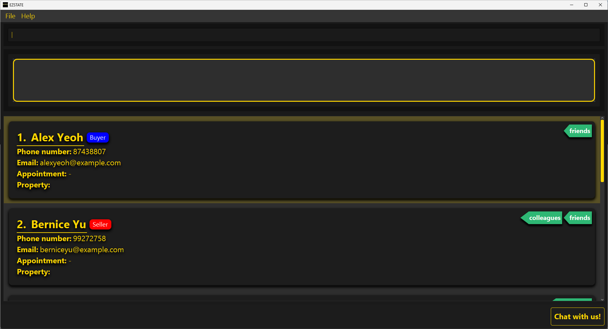

<link rel="stylesheet" type="text/css" href="assets/css/UserGuide.css">

EZStates is a **desktop app for managing contacts, optimized for use via a Command Line Interface** (CLI) while still having the benefits of a Graphical User Interface (GUI). If you can type fast, AB3 can get your contact management tasks done faster than traditional GUI apps.

* Table of Contents
{:toc}

--------------------------------------------------------------------------------------------------------------------

## Quick Start: Get started in 10 minutes!

In this quick start guide, you'll learn how to install EZSTATES. **_(3 min)_** 
 
You'll also learn how our commands work to kickstart the application. **_(7 min)_**

### Installation

1. Ensure you have Java `17` or above installed in your Computer.

2. Download the latest `.jar` file from [EZSTATES Releases](https://github.com/AY2425S1-CS2103T-F11-4/tp/releases).

3. Copy the file to the folder you want to use as the _home folder_ for your AddressBook.

4. Open a command terminal, `cd` into the folder you put the jar file in, and use the `java -jar ezstates.jar` command to run the application. 
   A GUI similar to the below should appear in a few seconds. Note how the app contains some sample data. 
   

5. Type the command in the command box and press Enter to execute it. e.g. typing **`help`** and pressing Enter will open the help window. 
   Some example commands you can try:

   * `list` : Lists all contacts.

   * `add n/John Doe p/98765432 e/johnd@example.com` : Adds a contact named `John Doe` to the Address Book.

   * `delete John Doe` : Deletes the contact with name John Doe from the list.

   * `clear` : Deletes all contacts.

   * `exit` : Exits the app.

6. Refer to the [Features](#features) for command details.

### Command Structure

--------------------------------------------------------------------------------------------------------------------

## Feature Categories

You are strongly recommended to read through [Command Structure](#CommandStructure) before proceeding with this section!

 
This user guide is divided into four main feature categories:

1. **Client Management Commands**
2. **Appointment Management Commands**
3. **Listing Management Commands**
4. **Utility Commands**

---

### 1. Client Management Commands

Commands for creating, updating, and deleting buyers and sellers.

- #### **Add Buyer Command**
    - **Format:** `buyer n/<NAME> p/<PHONE> e/<EMAIL> [t/<TAG>...]`
    - **Description:** Creates a new buyer profile with specified details.
    - **Successful Execution:**
      > ---
      >
      > **Use Case #1**: Adding a buyer named `Bobby` with phone number `91124444` and email `john123@gmail.com`
      >
      > **Input**: `buyer n/Bobby p/91124444 e/bobby123@gmail.com`
      >
      > **Output**: New buyer added: Bobby; Phone: 91124444; Email: bobby123@gmail.com; Appointment: -; Tags:
      >
      > ---
      >
      > **Use Case #2**: Adding a buyer named `Bobby` with phone number `91124444`, email `john123@gmail.com`, tags `friend`, `owner`
      >
      > **Input**: `buyer n/Bobby p/91124444 e/bobby123@gmail.com t/friend t/owner`
      >
      > **Output**: New buyer added: Bobby; Phone: 91124444; Email: bobby123@gmail.com; Appointment: -; Tags: [owner][friend]
      >
      > ---

    - **Failed Execution:**
      > ---
      >
      > **User Error #1**: Missing `NAME` field
      >
      > **Input**: `buyer p/91124444 e/bobby123@gmail.com`
      >
      > **Output**:  
      Invalid command format!  
      buyer: Adds a buyer to the address book.  
      Parameters: n/NAME p/PHONE e/EMAIL [t/TAG]... 
      Example: buyer n/John Doe p/98765432 t/friends t/owesMoney e/johnd@example.com
      >
      > ---
      >
      > **User Error #2**: Missing `PHONE` field
      >
      > **Input**: `buyer n/Bobby e/bobby123@gmail.com`
      >
      > **Output**:  
      Invalid command format!  
      buyer: Adds a buyer to the address book.  
      Parameters: n/NAME p/PHONE e/EMAIL [t/TAG]... 
      Example: buyer n/John Doe p/98765432 t/friends t/owesMoney e/johnd@example.com>
      >
      > ---
      >
      > **User Error #3**: Missing `EMAIL` field
      >
      > **Input**: `buyer n/Bobby p/91124444`
      >
      > **Output**:  
      Invalid command format!  
      buyer: Adds a buyer to the address book.  
      Parameters: n/NAME p/PHONE e/EMAIL [t/TAG]... 
      Example: buyer n/John Doe p/98765432 t/friends t/owesMoney e/johnd@example.com
      >
      > ---
- #### **Add Seller Command**
    - **Format:** `seller n/<NAME> p/<PHONE> e/<EMAIL> [t/<TAG>...]`
    - **Description:** Creates a new seller profile with specified details.
    - **Successful Execution:**
      > ---
      > **Use Case #1**: Adding a seller named `Bobby` with phone number `91124444` and email `john123@gmail.com`
      >
      > **Input**: `seller n/Bobby p/91124444 e/bobby123@gmail.com`
      >
      > **Output**: New seller added: Bobby; Phone: 91124444; Email: bobby123@gmail.com; Appointment: -; Tags:
      >
      > ---
      >
      > **Use Case #2**: Adding a seller named `Bobby` with phone number `91124444`, email `john123@gmail.com`, tags `friend`, `owner`
      >
      > **Input**: `seller n/Bobby p/91124444 e/bobby123@gmail.com t/friend t/owner`
      >
      > **Output**: New seller added: Bobby; Phone: 91124444; Email: bobby123@gmail.com; Appointment: -; Tags: [owner][friend]
      >
      > ---

    - **Failed Execution**
      > ---
      > **User Error #1**: Missing `NAME` field
      >
      > **Input**: `seller p/91124444 e/bobby123@gmail.com`
      >
      > **Output**:  
        Invalid command format!  
        seller: Adds a seller to the address book.  
        Parameters: n/NAME p/PHONE e/EMAIL [t/TAG]... 
        Example: seller n/John Doe p/98765432 t/friends t/owesMoney e/johnd@example.com
      >
      > ---
      >
      > **User Error #2**: Missing `PHONE` field
      >
      > **Input**: `seller n/Bobby e/bobby123@gmail.com`
      >
      > **Output**:  
        Invalid command format!  
        seller: Adds a seller to the address book.  
        Parameters: n/NAME p/PHONE e/EMAIL [t/TAG]... 
        Example: seller n/John Doe p/98765432 t/friends t/owesMoney e/johnd@example.com>
      >
      > ---
      > **User Error #3**: Missing `EMAIL` field
      >
      > **Input**: `seller n/Bobby p/91124444`
      >
      > **Output**:  
        Invalid command format!  
        seller: Adds a seller to the address book.  
        Parameters: n/NAME p/PHONE e/EMAIL [t/TAG]... 
        Example: seller n/John Doe p/98765432 t/friends t/owesMoney e/johnd@example.com

- #### **Find Command**
    - **Format:** `find KEYWORD [KEYWORD...]`
    - **Description:** Finds the specified client(s) based on the provided keywords.
    - **Successful Execution:**
      > ---
      > **Use Case #1**: Finding `Bob`
      >
      > **Input**: `find Bob`
      >
      > **Output**: 1 persons listed!
      >
      > 
      >
      > ---
      >
      > **Use Case #2**: Finding `Bob` OR `Winter`
      >
      > **Input**: `find Bob Winter`
      >
      > **Output**: 2 persons listed!
      >
      > 
      >
      > ---

    - **Failed Execution:** NIL

- #### **Edit Command**
    - **Format:** `edit INDEX [n/<NAME>] [p/<PHONE>] [e/<EMAIL>] [t/<TAG>...] [r/<REMARK>]`
    - **Description:** Edits the details of the specified client.
    - **Successful Execution:**
      > ---
      > **Use Case #1**: Changing name of `Bob` to `Bobby`
      >
      > **Input**: `edit 1 n/Bobby`
      >
      > **Output**: Successfully edited Bobby; Phone: 91124444; Email: bobby123@gmail.com; Appointment: -; Tags: [owner][friend]!
      >
      > ---
      >
      > **Use Case #2**: Changing phone of `Bobby` to `97774444`
      >
      > **Input**: `edit 1 p/97774444`
      >
      > **Output**: Successfully edited Bobby; Phone: 97774444; Email: bobby123@gmail.com; Appointment: -; Tags: [owner][friend]!
      >
      > ---
      >
      > **Use Case #3**: Removing tags of `Bobby`
      >
      > **Input**: `edit 1 t/`
      >
      > **Output**: Successfully edited Bobby; Phone: 97774444; Email: bobby123@gmail.com; Appointment: -; Tags: !
      >
      > ---

    - **Failed Execution:**
      > ---
      > **User Error #1**: Entering non-existent index
      >
      > **Input**: `edit -1 n/Bobby`
      >
      > **Output**:
        Invalid command format!
       edit: Edits the details of the person identified by the index number used in the displayed person list. Existing values will be overwritten by the input values.
       Parameters: INDEX (must be a positive integer) [n/NAME] [p/PHONE] [e/EMAIL] [t/TAG]...
       Example: edit 1 e/johndoe@example.comp/91234567
      >
      > **Input**: `edit 500 n/Bobby`
      >
      > **Output**:
        Invalid command format!
       edit: Edits the details of the person identified by the index number used in the displayed person list. Existing values will be overwritten by the input values.
       Parameters: INDEX (must be a positive integer) [n/NAME] [p/PHONE] [e/EMAIL] [t/TAG]...
       Example: edit 1 e/johndoe@example.comp/91234567
      >
      > ---
      >
      > **User Error #2**: Entering non-numerical index
      >
      > **Input**: `edit a#2 n/Bobby`
      >
      > **Output**:
        Invalid command format!
       edit: Edits the details of the person identified by the index number used in the displayed person list. Existing values will be overwritten by the input values.
       Parameters: INDEX (must be a positive integer) [n/NAME] [p/PHONE] [e/EMAIL] [t/TAG]...
       Example: edit 1 e/johndoe@example.comp/91234567
      >
      > ---

- #### **Delete Client Command**
    - **Format:** `delete n/<NAME>`
    - **Description:** Deletes the specified client profile.
    - **Successful Execution:**
      > ---
      > **Use Case #1**:
      >
      > **Input**:
      >
      > **Output**:
      >
      > ---
      >
      > **Use Case #2**:
      >
      > **Input**:
      >
      > **Output**:
      >
      > ---
      >
      > **Use Case #3**:
      >
      > **Input**:
      >
      > **Output**:
      >
      > ---

    - **Failed Execution:**
      > ---
      > **Use Case #1**:
      >
      > **Input**:
      >
      > **Output**:
      >
      > ---

---

### 2. Appointment Management

Commands for managing appointments between user and clients.

- #### **Schedule Appointment**
    - **Format:** `apt INDEX d/<DD-MM-YYYY> fr/<HHmm> to/<HHmm>`
    - **Description:** Schedules a new appointment to be held with the specified client that includes the specified details (date, time). 
    - **Successful Execution:**
      > ---
      > **Use Case #1**:
      >
      > **Input**:
      >
      > **Output**:
      >
      > ---
      >
      > **Use Case #2**:
      >
      > **Input**:
      >
      > **Output**:
      >
      > ---
      >
      > **Use Case #3**:
      >
      > **Input**:
      >
      > **Output**:
      >
      > ---

    - **Failed Execution:**
      > ---
      > **Use Case #1**:
      >
      > **Input**:
      >
      > **Output**:
      >
      > ---

- #### **Delete Appointment**
    - **Format:** `delapt n/<NAME>`
    - **Description:** Deletes an appointment with the specified client.
    - **Successful Execution:**
      > ---
      > **Use Case #1**:
      >
      > **Input**:
      >
      > **Output**:
      >
      > ---
      >
      > **Use Case #2**:
      >
      > **Input**:
      >
      > **Output**:
      >
      > ---
      >
      > **Use Case #3**:
      >
      > **Input**:
      >
      > **Output**:
      >
      > ---

    - **Failed Execution:**
      > ---
      > **Use Case #1**:
      >
      > **Input**:
      >
      > **Output**:
      >
      > ---

---

### 3. Listing Management

Commands for managing property listings and associating clients with listings.

- #### **Add Listing**
    - **Format:** `AddListingCommand`
    - **Description:** Adds a new property listing with specified details.
    - **Successful Execution:**
      > ---
      > **Use Case #1**:
      >
      > **Input**:
      >
      > **Output**:
      >
      > ---
      >
      > **Use Case #2**:
      >
      > **Input**:
      >
      > **Output**:
      >
      > ---
      >
      > **Use Case #3**:
      >
      > **Input**:
      >
      > **Output**:
      >
      > ---

    - **Failed Execution:**
      > ---
      > **Use Case #1**:
      >
      > **Input**:
      >
      > **Output**:
      >
      > ---

- #### **Show Listings**
    - **Format:** `ShowListingsCommand`
    - **Description:** Displays all current listings.
    - **Successful Execution:**
      > ---
      > **Use Case #1**:
      >
      > **Input**:
      >
      > **Output**:
      >
      > ---
      >
      > **Use Case #2**:
      >
      > **Input**:
      >
      > **Output**:
      >
      > ---
      >
      > **Use Case #3**:
      >
      > **Input**:
      >
      > **Output**:
      >
      > ---

    - **Failed Execution:**
      > ---
      > **Use Case #1**:
      >
      > **Input**:
      >
      > **Output**:
      >
      > ---

- #### **Add Buyers to Listing**
    - **Format:** `AddBuyersToListingCommand`
    - **Description:** Associates buyers with a specified listing.
    - **Successful Execution:**
      > ---
      > **Use Case #1**:
      >
      > **Input**:
      >
      > **Output**:
      >
      > ---
      >
      > **Use Case #2**:
      >
      > **Input**:
      >
      > **Output**:
      >
      > ---
      >
      > **Use Case #3**:
      >
      > **Input**:
      >
      > **Output**:
      >
      > ---

    - **Failed Execution:**
      > ---
      > **Use Case #1**:
      >
      > **Input**:
      >
      > **Output**:
      >
      > ---

- #### **Remove Buyers from Listing**
    - **Format:** `RemoveBuyersFromListingCommand`
    - **Description:** Removes buyers associated with a specified listing.
    - **Successful Execution:**
      > ---
      > **Use Case #1**:
      >
      > **Input**:
      >
      > **Output**:
      >
      > ---
      >
      > **Use Case #2**:
      >
      > **Input**:
      >
      > **Output**:
      >
      > ---
      >
      > **Use Case #3**:
      >
      > **Input**:
      >
      > **Output**:
      >
      > ---

    - **Failed Execution:**
      > ---
      > **Use Case #1**:
      >
      > **Input**:
      >
      > **Output**:
      >
      > ---

- #### **Delete Listing**
    - **Format:** `DeleteListingCommand`
    - **Description:** Deletes a specified listing.
    - **Successful Execution:**
      > ---
      > **Use Case #1**:
      >
      > **Input**:
      >
      > **Output**:
      >
      > ---
      >
      > **Use Case #2**:
      >
      > **Input**:
      >
      > **Output**:
      >
      > ---
      >
      > **Use Case #3**:
      >
      > **Input**:
      >
      > **Output**:
      >
      > ---

    - **Failed Execution:**
      > ---
      > **Use Case #1**:
      >
      > **Input**:
      >
      > **Output**:
      >
      > ---

- #### **Clear Listing**
    - **Format:** `ClearListingCommand`
    - **Description:** Deletes ALL listings.
    - **Successful Execution:**
      > ---
      > **Use Case #1**:
      >
      > **Input**:
      >
      > **Output**:
      >
      > ---
      >
      > **Use Case #2**:
      >
      > **Input**:
      >
      > **Output**:
      >
      > ---
      >
      > **Use Case #3**:
      >
      > **Input**:
      >
      > **Output**:
      >
      > ---

    - **Failed Execution:**
      > ---
      > **Use Case #1**:
      >
      > **Input**:
      >
      > **Output**:
      >
      > ---

### 4. Utility Commands

Miscellaneous commands for application utility, such as clearing, exiting, and displaying help.

- #### **Clear**
    - **Format:** `ClearCommand`
    - **Description:** Clears the console or application state.
    - **Successful Execution:**
      > ---
      > **Use Case #1**:
      >
      > **Input**:
      >
      > **Output**:
      >
      > ---
      >
      > **Use Case #2**:
      >
      > **Input**:
      >
      > **Output**:
      >
      > ---
      >
      > **Use Case #3**:
      >
      > **Input**:
      >
      > **Output**:
      >
      > ---

    - **Failed Execution:**
      > ---
      > **Use Case #1**:
      >
      > **Input**:
      >
      > **Output**:
      >
      > ---

- #### **Exit**
    - **Format:** `ExitCommand`
    - **Description:** Exits the application.
    - **Successful Execution:**
      > ---
      > **Use Case #1**:
      >
      > **Input**:
      >
      > **Output**:
      >
      > ---
      >
      > **Use Case #2**:
      >
      > **Input**:
      >
      > **Output**:
      >
      > ---
      >
      > **Use Case #3**:
      >
      > **Input**:
      >
      > **Output**:
      >
      > ---

    - **Failed Execution:**
      > ---
      > **Use Case #1**:
      >
      > **Input**:
      >
      > **Output**:
      >
      > ---

- #### **Help**
    - **Format:** `help`
    - **Description:** Displays a list of available commands and their descriptions.
    - **Successful Execution:**
      > ---
      > **Use Case #1**: Accessing help
      >
      > **Input**: `help`
      >
      > **Output**:
      >
      > ---

- #### **More Info**
    - **Format:** `MoreInfoCommand`
    - **Description:** Provides additional information about a specific command or feature.
    - **Successful Execution:**
      > ---
      > **Use Case #1**:
      >
      > **Input**:
      >
      > **Output**:
      >
      > ---
      >
      > **Use Case #2**:
      >
      > **Input**:
      >
      > **Output**:
      >
      > ---
      >
      > **Use Case #3**:
      >
      > **Input**:
      >
      > **Output**:
      >
      > ---

    - **Failed Execution:**
      > ---
      > **Use Case #1**:
      >
      > **Input**:
      >
      > **Output**:
      >
      > ---

- #### **Chat Window**
    - **Format:** `ChatWindowCommand`
    - **Description:** Opens a chat window for client-agent communication.
    - **Successful Execution:**
      > ---
      > **Use Case #1**:
      >
      > **Input**:
      >
      > **Output**:
      >
      > ---
      >
      > **Use Case #2**:
      >
      > **Input**:
      >
      > **Output**:
      >
      > ---
      >
      > **Use Case #3**:
      >
      > **Input**:
      >
      > **Output**:
      >
      > ---

    - **Failed Execution:**
      > ---
      > **Use Case #1**:
      >
      > **Input**:
      >
      > **Output**:
      >
      > ---

### Saving the data

AddressBook data are saved in the hard disk automatically after any command that changes the data. There is no need to save manually.

### Editing the data file

AddressBook data are saved automatically as a JSON file `[JAR file location]/data/addressbook.json`. Advanced users are welcome to update data directly by editing that data file.

:exclamation: **Caution:**
If your changes to the data file makes its format invalid, AddressBook will discard all data and start with an empty data file at the next run. Hence, it is recommended to take a backup of the file before editing it. 
Furthermore, certain edits can cause the AddressBook to behave in unexpected ways (e.g., if a value entered is outside of the acceptable range). Therefore, edit the data file only if you are confident that you can update it correctly.

### Archiving data files `[coming in v2.0]`

_Details coming soon ..._

--------------------------------------------------------------------------------------------------------------------

## FAQ

**Q**: How do I transfer my data to another Computer? 
**A**: Install the app in the other computer and overwrite the empty data file it creates with the file that contains the data of your previous AddressBook home folder.

--------------------------------------------------------------------------------------------------------------------

## Known issues

1. **When using multiple screens**, if you move the application to a secondary screen, and later switch to using only the primary screen, the GUI will open off-screen. The remedy is to delete the `preferences.json` file created by the application before running the application again.
2. **If you minimize the Help Window** and then run the `help` command (or use the `Help` menu, or the keyboard shortcut `F1`) again, the original Help Window will remain minimized, and no new Help Window will appear. The remedy is to manually restore the minimized Help Window.

--------------------------------------------------------------------------------------------------------------------

## Command summary

Action | Format, Examples
--------|------------------
**Add** | `add n/NAME p/PHONE_NUMBER e/EMAIL​`   e.g. `add n/James Ho p/22224444 e/jamesho@example.com`
**Clear** | `clear`
**Delete** | `delete NAME`  e.g. `delete James Ho`
**Edit** | `edit INDEX [n/NAME] [p/PHONE_NUMBER] [e/EMAIL]​`  e.g.`edit 2 n/James Lee e/jameslee@example.com`   e.g.`edit 2 n/James Voo`
**Find** | `find KEYWORD [MORE_KEYWORDS]`  e.g., `find James Jake`
**List** | `list`
**Help** | `help`
