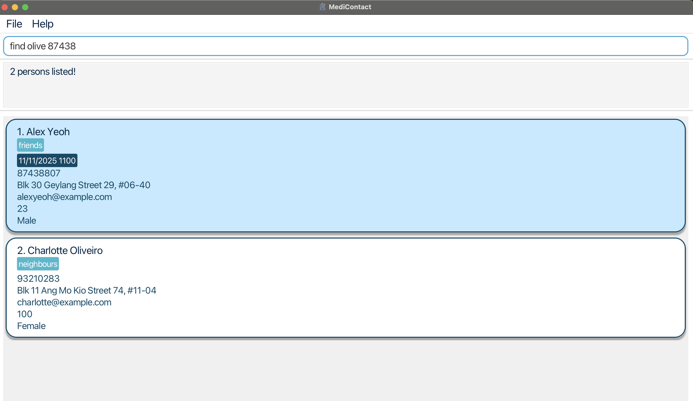

# Medicontact

Medicontact is a **desktop app for managing contacts, optimized for use via a  Line Interface** (CLI) while still having the benefits of a Graphical User Interface (GUI). If you can type fast, AB3 can get your contact management tasks done faster than traditional GUI apps.

<!-- * Table of Contents -->
<page-nav-print />

--------------------------------------------------------------------------------------------------------------------

## Quick start

1. Ensure you have Java `17` or above installed in your Computer.

1. Download the latest `.jar` file from [here](https://github.com/se-edu/addressbook-level3/releases).

1. Copy the file to the folder you want to use as the _home folder_ for your AddressBook.

1. Open a command terminal, `cd` into the folder you put the jar file in, and use the `java -jar addressbook.jar` command to run the application. 
   A GUI similar to the below should appear in a few seconds. Note how the app contains some sample data. 
   

1. Type the command in the command box and press Enter to execute it. e.g. typing **`help`** and pressing Enter will open the help window. 
   Some example commands you can try:

   * `list` : Lists all contacts.

   * `add n/John Doe p/98765432 e/johnd@example.com a/John street, block 123, #01-01` : Adds a contact named `John Doe` to the Address Book.

   * `delete 3` : Deletes the 3rd contact shown in the current list.

   * `clear` : Deletes all contacts.

   * `exit` : Exits the app.

1. Refer to the [Features](#features) below for details of each command.

--------------------------------------------------------------------------------------------------------------------

## Features

<box type="info" seamless>

**Notes about the command format:** 

* Words in `UPPER_CASE` are the parameters to be supplied by the user. 
  e.g. in `add n/NAME`, `NAME` is a parameter which can be used as `add n/John Doe`.

* Items in square brackets are optional. 
  e.g `n/NAME [t/TAG]` can be used as `n/John Doe t/friend` or as `n/John Doe`.

* Items with `…`​ after them can be used multiple times including zero times. 
  e.g. `[t/TAG]…​` can be used as ` ` (i.e. 0 times), `t/friend`, `t/friend t/family` etc.

* Parameters can be in any order. 
  e.g. if the command specifies `n/NAME p/PHONE_NUMBER`, `p/PHONE_NUMBER n/NAME` is also acceptable.

* Extraneous parameters for commands that do not take in parameters (such as `help`, `list`, `exit` and `clear`) will be ignored. 
  e.g. if the command specifies `help 123`, it will be interpreted as `help`.

* Command keywords are case insensitive
  e.g. if the command `add n/John Doe`, is equal to `Add n/John Doe`.

* If you are using a PDF version of this document, be careful when copying and pasting commands that span multiple lines as space characters surrounding line-breaks may be omitted when copied over to the application.
</box>

### Viewing help : `help`

Shows you a help window with useful resources which includes:
- A URL to the User Guide displayed at the top. You can copy the URL directly to your clipboard by clicking the “Copy URL” button.
- A command summary table below the URL, displaying available commands, their formats, and examples.
- You can copy the command format or example from the table and paste it into the command box.
- You can click on the table headers to sort commands in ascending or descending order.

Format: `help`

### Adding a person: `add`

Adds a person to the address book.

Format: `add n/NAME p/PHONE_NUMBER e/EMAIL a/ADDRESS b/AGE s/SEX [ap/APPOINTMENT] [t/TAG]…​`

- `PHONE_NUMBER` must only contain characters 0-9 and must be exactly 8 digits long. 
- `EMAIL` should be in the format **local-part@domain** whereby the local-part contains only alphanumeric characters and some special characters like +_.- but may not start with the special characters. The domain name must end with a domain label at least 2 characters long and start and end with alphanumeric characters. The domain label should consist of alphanumeric characters separated only be hyphens, if any. 
- `AGE` must only contain characters 0-9 and must be 1-3 digits long.
- `SEX` must only contain alphanumeric characters.
- `APPOINTMENT` should be in the format **dd/MM/yyyy HHmm**.

<box type="tip" seamless>

**Tip:** A person can have any number of tags (including 0)
</box>

Examples:
* `add n/John Doe p/98765432 e/johnd@example.com a/John street, block 123, #01-01 b/40 s/Male`
* `add n/Betsy Crowe t/friend e/betsycrowe@example.com a/Newgate Hospital p/12345678 t/patient b/20 s/Female`
* `add n/Evie Sage p/88888888 e/eviesage@example.com a/Hickory Forest b/23 s/Female ap/11/11/2024 1100`

### Listing all persons : `list`

Shows a list of all persons in the address book.

Format: `list`

* You will be informed when the list is empty: `The list is currently empty.` or when it is not empty: `Listed all persons`.

### Listing starred persons : `list *`

Shows a list of all starred persons in the address book.

Format: `list *`

* No other parameters should be supplied aside from `*`.
* You will be informed when the list is empty: `No contacts starred` or when it is not empty: `Starred contacts listed`.

### Editing a person : `edit`

Edits an existing person in the address book.

Format: `edit NAME [n/NAME] [p/PHONE] [e/EMAIL] [a/ADDRESS] [b/AGE] [s/SEX] [ap/APPOINTMENT] [t/TAG]…​`

* Edits the person with the specified `NAME`. The name refers to the full name shown in the displayed person list.
* At least one of the optional fields must be provided.
* Existing values will be updated to the input values.
* When editing tags/appointments, the existing tags/appointments of the person will be added i.e adding of tags is cumulative.
* You can remove all the person’s tags by typing `t/` without
    specifying any tags after it.
* You can remove all the person’s appointments by typing `ap/` without
  specifying any tags after it.

Examples:
*  `edit John Doe p/91234567 e/johndoe@example.com` Edits the phone number and email address of John Doe to be `91234567` and `johndoe@example.com` respectively.
*  `edit John Doe n/Betsy Crower t/ ap/` Edits the name of John Doe to be `Betsy Crower` and clears all existing tags and appointments.

### Locating persons by name or phone number: `find`

Finds persons whose names or phone numbers contain any of the given keywords.

Format: `find KEYWORD [MORE_KEYWORDS]`

* The search is case-insensitive. e.g `hans` will match `Hans`
* The order of the keywords does not matter. e.g. `Hans Bo` will match `Bo Hans`
* Only the name and phone number is searched.
* Partial words will be matched e.g. `Han` will match `Hans`
* Persons matching at least one keyword will be returned (i.e. `OR` search).
  e.g. `Hay Bo` will return `Hayley Gruber`, `Bo Yang`,
        `Hay 874` will return contacts `Hayley /p99999999`, `Bons /p87444444`

Examples:
* `find John` returns `john` and `Johnny Doe`
* `find alex david` returns `Alex Yeoh`, `David Li` 
* `find olive 87438` returns `87438807`, `Charlotte Oliveiro` 
  

### Editing a person's notes : `note`

Edits an existing person's note in the address book, which contains `PREVIOUS APPOINTMENTS`, `MEDICATIONS`, `REMARKS`.

Format: `note NAME [ap/APPOINTMENT] [m/MEDICATION] [r/REMARK]…​`

* Edits the person's note with the specified `NAME`. The name refers to the full name shown in the displayed person list.
* At least one of the fields must be provided.
* When editing fields, the existing fields of the person will be added i.e adding of medications is cumulative.
* You can remove all the person’s appointments by typing `ap/` without
  specifying any appointments after it.
* You can remove all the person’s medications by typing `m/` without
    specifying any medications after it.
* You can remove all the person’s remarks by typing `r/` without
    specifying any remarks after it.

Examples:
*  `note John Doe ap/01/01/2025 1200 r/Allergic to XXX` Adds `01/01/2025 1200` and `Allergic to XXX` to John Doe's past appointments and remarks respectively.
*  `note John Doe ap/ m/` Clears all existing  appointments and medications from John Doe's notes.

### Deleting a person : `delete`

Deletes the specified person from the address book.

Format: `delete INDEX` / `delete NAME`

* Deletes the person at the specified `INDEX` or with the specified `NAME`.
* The name refers to the full name as shown in the displayed person list.
* The index refers to the index number shown in the displayed person list.
* The index **must be a positive integer** 1, 2, 3, …​

Examples:
* `list` followed by `delete Alex Yeoh` deletes the person with name `Alex Yeoh` in the address book.
* `list` followed by `delete 2` deletes the 2nd person in the address book.
* `find Betsy` followed by `delete 1` deletes the 1st person in the results of the `find` command.

**Confirmation Requirement:**

A confirmation window will appear before deleting a person, asking you to confirm the deletion. 
You must select “OK” to proceed with the deletion. If you select “Cancel,” the action will be aborted, 
and the person will not be deleted.

### Sorting list based on Appointment Dates : `sort`

Sorts the persons in the address book on the basis of their appointment dates.

Format: `sort`

* No other parameters should be supplied.

### Starring a person : `star`

Stars the specified person from the address book into favourites.

Format: `star INDEX` / `star NAME`

* Stars the person at the specified `INDEX` or with the specified `NAME`.
* The name refers to the full name as shown in the displayed person list.
* The index refers to the index number shown in the displayed person list.
* The index **must be a positive integer** 1, 2, 3, …​

Examples:

* `star Alex Yeoh` stars the person with name `Alex Yeoh` in the address book.
* `list` followed by `star 2` stars the 2nd person in the address book.
* `find Betsy` followed by `star 1` stars the 1st person in the results of the `find` command.

### Unstarring a person : `unstar`

Unstars the specified person from the address book removing them from favourites.

Format: `unstar INDEX` / `unstar NAME`

* Unstars the person at the specified `INDEX` or with the specified `NAME`.
* The name refers to the full name as shown in the displayed person list.
* The index refers to the index number shown in the displayed person list.
* The index **must be a positive integer** 1, 2, 3, …​

Examples:

* `unstar Alex Yeoh` unstars the person with name `Alex Yeoh` in the address book.
* `list` followed by `unstar 2` unstars the 2nd person in the address book.
* `find Betsy` followed by `unstar 1` unstars the 1st person in the results of the `find` command.

### Clearing all entries : `clear`

Clears all entries from the address book.

Format: `clear`

**Confirmation Requirement:**

A confirmation window will appear before clearing all contacts in MediContact, 
asking you to confirm if you are sure you want to proceed. 
You must select “OK” to clear the address book. If you select “Cancel,” 
the action will be aborted, and the address book will remain unchanged.

### Exporting the contacts : `export`

Exports contact info in file path `data/addressbook.json`.

Format: `export`

- Locate file `addressbook.json` under the folder `data` that will be added to the current folder of `addressbook.jar` upon executing `export`.

### Exiting the program : `exit`

Exits the program.

Format: `exit`

### Saving the data

AddressBook data are saved in the hard disk automatically after any command that changes the data. There is no need to save manually.

### Editing the data file

AddressBook data are saved automatically as a JSON file `[JAR file location]/data/addressbook.json`. Advanced users are welcome to update data directly by editing that data file.

<box type="warning" seamless>

**Caution:**
If your changes to the data file makes its format invalid, AddressBook will discard all data and start with an empty data file at the next run.  Hence, it is recommended to take a backup of the file before editing it. 
Furthermore, certain edits can cause the AddressBook to behave in unexpected ways (e.g., if a value entered is outside the acceptable range). Therefore, edit the data file only if you are confident that you can update it correctly.
</box>

### Archiving data files `[coming in v2.0]`

_Details coming soon ..._

--------------------------------------------------------------------------------------------------------------------

## FAQ

**Q**: How do I transfer my data to another Computer? 
**A**: Install the app in the other computer and overwrite the empty data file it creates with the file that contains the data of your previous AddressBook home folder.

--------------------------------------------------------------------------------------------------------------------

## Known issues

1. **When using multiple screens**, if you move the application to a secondary screen, and later switch to using only the primary screen, the GUI will open off-screen. The remedy is to delete the `preferences.json` file created by the application before running the application again.
2. **If you minimize the Help Window** and then run the `help` command (or use the `Help` menu, or the keyboard shortcut `F1`) again, the original Help Window will remain minimized, and no new Help Window will appear. The remedy is to manually restore the minimized Help Window.

--------------------------------------------------------------------------------------------------------------------

## Command summary

Action     | Format, Examples
-----------|----------------------------------------------------------------------------------------------------------------------------------------------------------------------
**Add**    | `add n/NAME p/PHONE_NUMBER e/EMAIL a/ADDRESS b/AGE s/SEX [ap/APPOINTMENTS]… [t/TAG]…​`   e.g., `add n/James Ho p/22224444 e/jamesho@example.com a/123, Clementi Rd, 1234665 b/24 s/Male ap/01/01/2025 1200 t/friend t/colleague` 
**Clear**  | `clear`
**Delete** | `delete INDEX` or `delete NAME`   e.g., `delete 3`, `delete Alex Yeoh`
**Edit**   | `edit NAME [n/NAME] [p/PHONE] [e/EMAIL] [a/ADDRESS] [b/AGE] [s/SEX] [ap/APPOINTMENT] [t/TAG]…`  e.g.,`edit John Doe n/James Lee e/jameslee@example.com` 
**Export** | `export` 
**Find**   | `find KEYWORD [MORE_KEYWORDS]`  e.g., `find James 89127777`
**Note**   | `note NAME [ap/APPOINTMENT] [m/MEDICATION] [r/REMARK]…`  e.g.,`note John Doe r/Allergic to XXX m/10mg Ibuprofen`
**Help**   | `help`
**List**   | `list`  `list *` (to list starred contacts) 
**Sort**   | `sort` (to sort contacts based on appointment dates) 
**Star**   | `star INDEX` or `star NAME`   e.g., `star 3`, `star Alex Yeoh` 
**Unstar** | `unstar INDEX` or `unstar NAME`   e.g., `unstar 3`, `unstar Alex Yeoh` 
