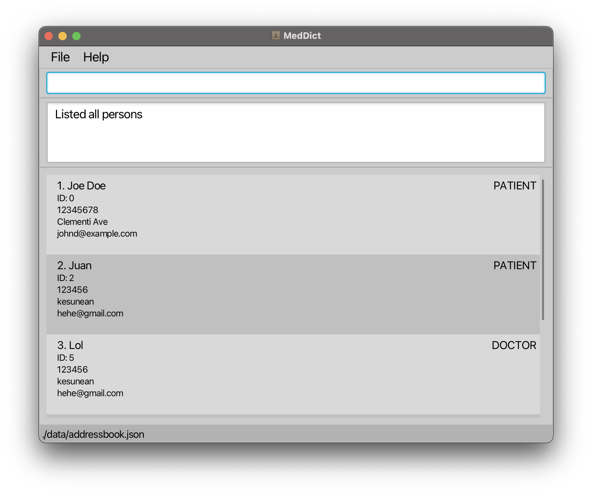

# Client Grid User guide

ClientGrid is an **address book** designed for real estate agents to efficiently manage client contacts, including buyers and sellers. It provides a streamlined way to organize client data and monitor the buying or selling process while maintaining core address book functionality.

<!-- * Table of Contents -->
<page-nav-print />

--------------------------------------------------------------------------------------------------------------------

## Quick start

1. Ensure you have Java `17` or above installed in your Computer.

1. Download the latest `.jar` file from [here](https://github.com/se-edu/addressbook-level3/releases).

1. Copy the file to the folder you want to use as the _home folder_ for your AddressBook.

1. Open a command terminal, `cd` into the folder you put the jar file in, and use the `java -jar clientGrid.jar` command to run the application. 
   A GUI similar to the below should appear in a few seconds. Note how the app contains some sample data. 
   

1. Type the command in the command box and press Enter to execute it. e.g. typing **`help`** and pressing Enter will open the help window. 
   Some example commands you can try:

   * `list k/clients` : Lists all clients.

   * `addbuyer n/John p/12345678 e/john@gmail.com` : Adds a buyer whose name is `John`, phone number is `12345678` and email is `john@gmail.com`.

   * `deletebuyer p/81234567` : Deletes the buyer with contact number `81234567`.
   
   * `addproperty c/124894 u/15-20` : Adds a property with postal code 124894 and unit number #15-20.
   
   * `deleteproperty c/124894 u/15-20` : Deletes the property with postal code 124894 and unit number #15-20.

   * `exit` : Exits the app.

1. Refer to the [Features](#features) below for details of each command.

--------------------------------------------------------------------------------------------------------------------

## Features

<box type="info" seamless>

**Notes about the command format:** 

* Words in `UPPER_CASE` are the parameters to be supplied by the user. 
  e.g. in `addbuyer n/NAME`, `NAME` is a parameter which can be used as `add n/John Doe`.

* Items in square brackets are optional. 
  e.g `n/NAME [t/TAG]` can be used as `n/John Doe e/bob@gmail.com` or as `n/John Doe`.

* Parameters can be in any order. 
  e.g. if the command specifies `n/NAME p/PHONE_NUMBER`, `p/PHONE_NUMBER n/NAME` is also acceptable.

* If you are using a PDF version of this document, be careful when copying and pasting commands that span multiple lines as space characters surrounding line-breaks may be omitted when copied over to the application.
</box>

### Viewing help : `help`

Shows a message explaning how to access the help page.

Format: `help`

### Listing address book records: `list`

Shows a list of all existing clients (i.e. buyers and sellers), properties, and meetings in the address book.

Format: `list k/KEY`

* The `list` command displays records based on the specified `KEY`.
* The `KEY` must be one of the following: `buyers`, `sellers`, `clients`, `meetings` or `properties`.
  * `buyers`: Lists all buyers in the database.
  * `sellers`: Lists all sellers in the database.
  * `clients`: Lists all buyers and sellers (i.e. clients) combined.
  * `properties`: Lists all properties in the database.
  * `meetings`: Lists all meetings in th e database.

* If an invalid `KEY` is provided, an error message will be displayed.

Key Considerations:
* Only accepts "buyers", "sellers", "clients", "properties" and "meetings" (case-insensitive) as valid inputs for k/KEY.
* The `KEY` ignores extra/leading/trailing spaces. Extra/leading/trailing spaces will be trimmed and the name will be converted into an array of words. The `KEY` also ignores UPPER/lower case. All names will be converted to lower case and checked against the list of valid keys.
* If the user provides an invalid key, the system will respond with an error message indicating that only the valid keys are accepted.

Examples:
* `list k/buyers` displays a list of all existing buyers in the address book.

  

### Adding a buyer : `addbuyer`

Add a specified buyer into the client book of ClientGrid.

Format: `addbuyer n/BUYER_NAME p/BUYER_PHONE_NUMBER e/BUYER_EMAIL`

* Adds a buyer with the specified `BUYER_NAME`, `BUYER_PHONE_NUMBER`, and `BUYER_EMAIL`.
* The `BUYER_NAME` ignores extra/leading/trailing spaces. Extra/leading/trailing spaces will be trimmed and the name will be converted into an array of words. The `BUYER_NAME` also ignores UPPER/lower case. All names will be converted to lower case and checked against the in-memory database.
* The `BUYER_PHONE_NUMBER` must be 8 numbers in the range [0-9] and can only start with ‘8’ or ‘9’.
* The `BUYER_EMAIL` should follow the format local-part@domain and adhere to the following constraints: The local-part must consist only of alphanumeric characters and allowed special characters, with no special characters at the beginning or end. After the local-part, there must be an '@' followed by the domain name. The domain name consists of domain labels separated by periods. Each domain label must start and end with an alphanumeric character and may contain hyphens in between. Additionally, the domain must end with a domain label that is at least two characters long.

Examples:
* `addbuyer n/John p/83456789 e/john@gmail.com` adds a buyer whose name is `John`, phone number is `83456789` and email is `john@gmail.com`.

  

### Adding a seller : `addseller`

Add a specified seller into the client book of ClientGrid.

Format: `addseller n/SELLER_NAME p/SELLER_PHONE_NUMBER e/SELLER_EMAIL`

* Adds a seller with the specified `SELLER_NAME`, `SELLER_PHONE_NUMBER`, and `SELLER_EMAIL`.
* The `SELLER_NAME` ignores extra/leading/trailing spaces. Extra/leading/trailing spaces will be trimmed and the name will be converted into an array of words. The `SELLER_NAME` also ignores UPPER/lower case. All names will be converted to lower case and checked against the in-memory database.
* The `SELLER_PHONE_NUMBER` must be 8 numbers in the range [0-9] and can only start with ‘8’ or ‘9’.
* The `SELLER_EMAIL` should follow the format local-part@domain and adhere to the following constraints: The local-part must consist only of alphanumeric characters and allowed special characters, with no special characters at the beginning or end. After the local-part, there must be an '@' followed by the domain name. The domain name consists of domain labels separated by periods. Each domain label must start and end with an alphanumeric character and may contain hyphens in between. Additionally, the domain must end with a domain label that is at least two characters long.

Examples:
* `addseller n/Mary p/83456789 e/mary@gmail.com` adds a seller whose name is `Mary`, phone number is `83456789` and email is `mary@gmail.com`.

  

### Deleting a buyer : `deletebuyer`

Deletes the specified buyer from the client book of ClientGrid.

Format: `deletebuyer p/PHONE_NUMBER`

* Deletes the buyer with the specified `PHONE_NUMBER`.
* The `PHONE_NUMBER` must be 8 numbers in the range [0-9] and can only start with ‘8’ or ‘9’.

Examples:
* `deletebuyer p/83456789` deletes the buyer with phone number `83456789` from the client book.
  

### Deleting a seller : `deleteseller`

Deletes the specified seller from the client book of ClientGrid.

Format: `deleteseller p/PHONE_NUMBER`

* Deletes the seller with the specified `PHONE_NUMBER`.
* The `PHONE_NUMBER` must be 8 numbers in the range [0-9] and can only start with ‘8’ or ‘9’.

Examples:
* `deleteseller p/83456789` deletes the seller with phone number `83456789` from the client book.

    

### Adding a property : `addproperty`

Add a specified property into the property book of ClientGrid.

Format: `addproperty c/POSTAL_CODE u/UNIT_NUMBER`

* Adds a property with the specified `POSTAL_CODE` and `UNIT_NUMBER`.
* The `POSTAL_CODE` must be exactly 6 digits with each digit in the range [0-9]. It does not accept any non-integer characters or spaces.
* The `UNIT_NUMBER` comprises of two numbers delimited by exactly one dash(-). On either side of the dash are numbers comprising of two or more digits. The range of numbers of the left hand side of the dash is [00-148] and the right hand side is [00-111110]. Other than the dash, other non-integer characters or spaces are not accepted.

Examples:
* `addproperty c/124894 u/15-20` adds a property with postal code `124894` and unit number `15-20`.

  

### Deleting a property : `deleteproperty`

Deletes a specified property from the property book of ClientGrid.

Format: `deleteproperty c/POSTAL_CODE u/UNIT_NUMBER`

* Deletes a property with the specified `POSTAL_CODE` and `UNIT_NUMBER`.
* The `POSTAL_CODE` must be exactly 6 digits with each digit in the range [0-9]. It does not accept any non-integer characters or spaces.
* The `UNIT_NUMBER` comprises of two numbers delimited by exactly one dash(-). On either side of the dash are numbers comprising of two or more digits. The range of numbers of the left hand side of the dash is [00-148] and the right hand side is [00-111110]. Other than the dash, other non-integer characters or spaces are not accepted.

Examples:
* `deleteproperty c/124894 u/15-20` deletes a property with postal code `124894` and unit number `15-20`.

  

### Filtering clients : `filterclient`

Filters the clients that starts with the prefix provided.

Format: `filterclient n/NAME`

* Filters the client with the specified prefix `NAME`.
* The `NAME` ignores extra/leading/trailing spaces. Extra/leading/trailing spaces will be trimmed and the name will be converted into an array of words. The `BUYER_NAME` also ignores UPPER/lower case. All names will be converted to lower case and checked against the in-memory database.

Examples:
* `filterclient n/A` filters the clients that starts with the prefix `A`.

  

### Adding a meeting : `addmeeting`

Adds a specified meeting to the meeting book of ClientGrid.

Format: `addmeeting mt/TITLE d/DATE b/BUYER s/SELLER t/TYPE c/POSTALCODE`

* Adds a meeting with the specified `MEETING_TITLE` and `MEETING_DATE`.
* The `MEETING_TITLE` should only contain alphanumeric characters and spaces, and it should not be blank.
* The `MEETING_DATE` should be in the format dd-MM-yyyy and must be a valid date.
* `BUYER` refers to a buyer name. There must be an existing buyer in the client book that has a name that contains `BUYER`. `BUYER` is not case-sensitive. For example, `b/alice` is valid if there is a buyer of name `Alice Pauline` in the client book.
* `SELLER` refers to a seller name. There must be an existing seller in the client book that has a name that contains `SELLER`. `SELLER` is not case-sensitive.
* `SELLER` refers to a seller name. There must be an existing seller in the client book that has a name that contains `SELLER`. `SELLER` is not case-sensitive.
* `TYPE` refers to a property type. It must be either `CONDO`, `HDB`, or `LANDED`. `TYPE` is case-insensitive.
* `POSTALCODE` refers to a postal code. The postal code must belong to some property to the property book.

Examples:
* `addmeeting mt/Meeting 1 d/01-01-2024 b/Alice Pauline s/Daniel Meier t/HDB c/123456` adds a meeting with meeting title `Meeting 1` and meeting date `01-01-2024`.

  

### Deleting a meeting : `deletemeeting`

Deletes a specified meeting from the meeting book of ClientGrid.

Format: `deletemeeting mt/MEETING_TITLE d/MEETING_DATE`

* Deletes a meeting with the specified `MEETING_TITLE` and `MEETING_DATE`.
* The `MEETING_TITLE` should only contain alphanumeric characters and spaces, and it should not be blank.
* The `MEETING_DATE` should be in the format dd-MM-yyyy and must be a valid date.

Examples:
* `deletemeeting mt/Meeting 1 d/01-01-2024` deletes a meeting with meeting title `Meeting 1` and meeting date `01-01-2024`.

  

### Clearing all entries : `clear`

Clears all entries from the address book.

Format: `clear`

### Exiting the program : `exit`

Exits the program.

Format: `exit`

### Saving the data

AddressBook data are saved in the hard disk automatically after any command that changes the data. There is no need to save manually.

### Editing the data file

AddressBook data are saved automatically as a JSON file `[JAR file location]/data/addressbook.json`. Advanced users are welcome to update data directly by editing that data file.

<box type="warning" seamless>

**Caution:**
If your changes to the data file makes its format invalid, AddressBook will discard all data and start with an empty data file at the next run.  Hence, it is recommended to take a backup of the file before editing it. 
Furthermore, certain edits can cause the AddressBook to behave in unexpected ways (e.g., if a value entered is outside the acceptable range). Therefore, edit the data file only if you are confident that you can update it correctly.
</box>

### Archiving data files `[coming in v2.0]`

_Details coming soon ..._

--------------------------------------------------------------------------------------------------------------------

## FAQ

**Q**: How do I transfer my data to another Computer? 
**A**: Install the app in the other computer and overwrite the empty data file it creates with the file that contains the data of your previous AddressBook home folder.

--------------------------------------------------------------------------------------------------------------------

## Known issues

1. **When using multiple screens**, if you move the application to a secondary screen, and later switch to using only the primary screen, the GUI will open off-screen. The remedy is to delete the `preferences.json` file created by the application before running the application again.
2. **If you minimize the Help Window** and then run the `help` command (or use the `Help` menu, or the keyboard shortcut `F1`) again, the original Help Window will remain minimized, and no new Help Window will appear. The remedy is to manually restore the minimized Help Window.

--------------------------------------------------------------------------------------------------------------------

## Command summary

Action     | Format, Examples
-----------|----------------------------------------------------------------------------------------------------------------------------------------------------------------------
**List**   | `list k/KEY`
**Help**   | `help`
**Add Buyer** | `addbuyer n/BUYER_NAME p/BUYER_PHONE_NUMBER e/BUYER_EMAIL`
**Add Seller** | `addseller n/SELLER_NAME p/SELLER_PHONE_NUMBER e/SELLER_EMAIL`
**Delete Buyer** | `deletebuyer p/PHONE_NUMBER`
**Delete Seller** | `deleteseller p/PHONE_NUMBER`
**Add Property** | `addproperty c/POSTAL_CODE u/UNIT_NUMBER`
**Delete Property** | `deleteproperty c/POSTAL_CODE u/UNIT_NUMBER`
**Filtering Clients** | `filterclient n/NAME`
**Delete Meeting** | `deletemeeting mt/MEETING_TITLE d/MEETING_DATE`
