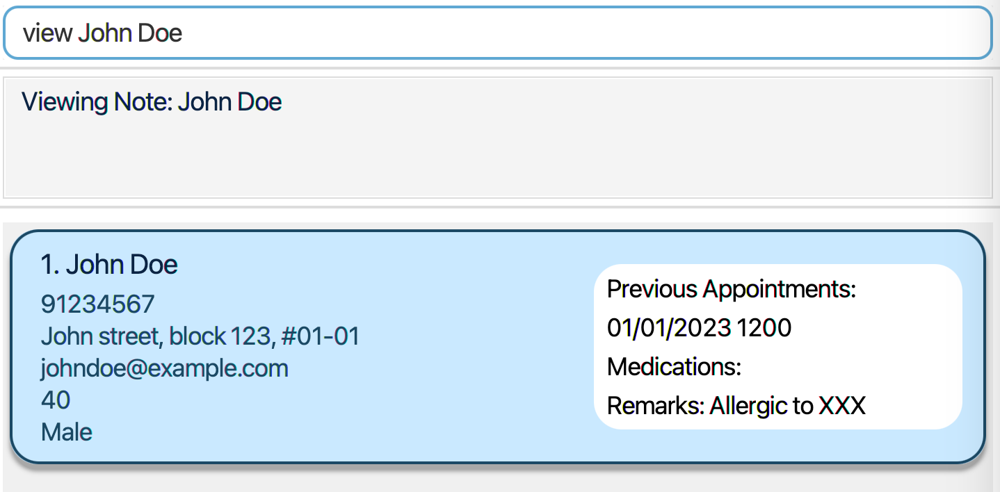

# WardWatch User Guide

WardWatch (WW) is a **desktop app for managing patients information in hospitals, optimized for use via a  Line Interface** (CLI) while still having the benefits of a Graphical User Interface (GUI). If you can type fast, WW can get your patient management tasks done faster than traditional GUI apps.

<!-- * Table of Contents -->
# Table of Contents
1. [Quick Start](#quick-start)
2. [Features](#features)
    - [Viewing help](#viewing-help--help)
    - [Adding a person](#adding-a-person--add)
    - [Listing all patients](#listing-all-patients--list)
    - [Editing a patient](#editing-a-patient--edit)
    - [Searching patients by field](#searching-patients-by-field--find)
    - [Deleting a person](#deleting-a-person--delete)
    - [Adding an appointment to a person](#adding-an-appointment-to-a-person--make_appt)
    - [List all person appointment](#list-all-person-appointment--schedule_all)
    - [Clearing all entries](#clearing-all-entries--clear)
    - [Exiting the program](#exiting-the-program--exit)
    - [Saving the data](#saving-the-data)
    - [Editing the data file](#editing-the-data-file)
    - [Archiving data files](#archiving-data-files-coming-in-v20)
3. [FAQ](#faq)
4. [Glossary](#glossary)
4. [Known Issues](#known-issues)
5. [Command Summary](#command-summary)

--------------------------------------------------------------------------------------------------------------------

## Quick start

1. Ensure you have Java `17` or above installed in your Computer.

1. Download the latest `.jar` file from [here](https://github.com/AY2425S1-CS2103T-T15-3/tp/releases/).

1. Copy the file to the folder you want to use as the _home folder_ for your AddressBook.

1. Open a command terminal, `cd` into the folder you put the jar file in, and use the `java -jar wardwatch.jar` command to run the application. 
   A GUI similar to the below should appear in a few seconds. Note how the app contains some sample data. 
   

1. Type the command in the command box and press Enter to execute it. e.g. typing **`help`** and pressing Enter will open the help window. 
   Some example commands you can try:

    * `list` : Lists all patients.

    * `add i/P23456 n/Donald Duck w/B5 d/Diabetes m/Insulin` : Adds a contact named `Donald Duck` to the patient list.

    * `delete 3` : Deletes the 3rd patient shown in the current list.

    * `find w/ B1` : Finds all patients with ward B1.

    * `clear` : Deletes all patients.

    * `exit` : Exits the app.

1. Refer to the [Features](#features) below for details of each command.

[Back to Table of Contents](#table-of-contents)

--------------------------------------------------------------------------------------------------------------------

## Features

<box type="info" seamless>

**Notes about the command format:** 

There are 5 CLI command formats as shown below:

1) `COMMAND_WORD`
2) `COMMAND_WORD INDEX`
3) `COMMAND_WORD PARAMETER`
3) `COMMAND_WORD PARAMETERS`
4) `COMMAND_WORD INDEX PARAMETERS`

Parameters often take up the form of `p/[PARAMETER]` where p is the parameter symbol. For example:`add n/John Doe` 
- `n/` -> parameter symbol 
- `John Doe` -> parameter.

**Other things to note in this User Guide:**
1) Items in square brackets are optional. 
  e.g `n/NAME [d/DIAGNOSIS]` can be used as `n/John Doe d/diabetes` or as `n/John Doe`.
2) Parameters can be in any order: 
  `n/NAME p/PHONE_NUMBER` is equivalent to `p/PHONE_NUMBER n/NAME`

3) Extra parameters for commands without parameters (such as `help`, `list`, `exit` and `clear`) will be ignored: 
  `help 123` is interpreted as `help`.

4) If you are using a PDF version of this document, be careful when copying and pasting commands that span multiple lines as space characters surrounding line-breaks may be omitted when copied over to the application.
</box>

[Back to Table of Contents](#table-of-contents)

### Viewing help : `help`

Shows a pop-up message explaining how to access the help page.

Format: `help`

[Back to Table of Contents](#table-of-contents)

### Adding a person: `add`

Adds a person to the address book.

Format: `add n/NAME i/ID w/WARD d/DIAGNOSIS m/MEDICATION`

* `ID` must be in the form of `PXXXXX` where `XXXXX` is a 5 digit integer.
* `ID` of patients must be unique.
* `Ward` must take the form of `WX` where `X` is an integer.

[//]: # (<box type="tip" seamless>)

[//]: # ()
[//]: # (</box>)

Examples:
* `add n/John Doe i/P12345 w/A1 d/TYPE 1 DIABETES m/METFORMIN `
* `add n/Nicky Lam i/P17777 w/A5 d/Gastritis m/Proton pump inhibitors `

[Back to Table of Contents](#table-of-contents)

### Listing all patients : `list`

Shows a list of all patients in WardWatch.

Format: `list`

[Back to Table of Contents](#table-of-contents)

### Editing a patient : `edit`

Edits an existing person in the address book.

Format: `edit INDEX i/ID w/WARD d/DIAGNOSIS m/MEDICATION`

* Edits the person at the specified `INDEX`. The index refers to the index number shown in the displayed person list. The index **must be a positive integer** 1, 2, 3, …​
* At least one of the optional fields must be provided.
* Existing values will be updated to the input values.

Examples:
*  `edit 1 i/P12345 w/A2` Edits the patient ID and ward of the 1st person to be `P12345` and `A2` respectively.
*  `edit 2 n/Betsy Crower m/Paracetamol` Edits the name and medication of the 2nd person to be `Betsy Crower` and `Panadol`

[Back to Table of Contents](#table-of-contents)

### Viewing a patient's details: `view`

Displays more details about a specific patient listed.

Format: `view INDEX`

* Shows the person at the specified `INDEX`. The index refers to the index number shown in the displayed person list. The index **must be a positive integer** 1, 2, 3, …​
* Displays additional information such as a patient's `diagnosis`, `medication`, `notes` and `appointments`.

Examples:
* `view 2` to view the 2nd patient's details.

### Searching patients by field: `find`

Finds patients whose specified field contain any of the given keywords.

Format: `find FIELD/ KEYWORD [MORE_KEYWORDS]`

* The search is case-insensitive. e.g `hans` will match `Hans`
* The order of the keywords does not matter. e.g. `Hans Bo` will match `Bo Hans`
* Able to search any field, but only one field at a time.
* Only full words will be matched e.g. `Han` will not match `Hans`
* Persons matching at least one keyword will be returned (i.e. `OR` search).
  e.g. `Hans Bo` will return `Hans Gruber`, `Bo Yang`

Valid fields for `find` Command:

* Name: Use `n/` to search by patient name.
* ID: Use `i/` to search by patient ID.
* Ward: Use `w/` to search by ward.
* Diagnosis: Use `d/` to search by diagnosis.
* Medication: Use `m/` to search by medication.

Examples:
* `find n/ John` returns `john` and `John Doe`
* `find w/ B1` returns all patients in ward B1
* `find i/ Dave` returns an empty list
* `find n/ alice benson` returns `Alice Pauline`, `Benson Meier` 

[Back to Table of Contents](#table-of-contents)

### Deleting a person : `delete`

Deletes the specified person from the address book.

Format: `delete INDEX`

* Deletes the person at the specified `INDEX`.
* The index refers to the index number shown in the displayed person list.
* The index **must be a positive integer** 1, 2, 3, …​

Examples:
* `list` followed by `delete 2` deletes the 2nd person in the address book.
* `find Betsy` followed by `delete 1` deletes the 1st person in the results of the `find` command.

[Back to Table of Contents](#table-of-contents)

### Adding an Appointment to a person: `make_appt`

Makes an appointment for a person

Format: `make_appt INDEX a/APPOINTMENT_DESCRIPTION s/START_DATE_TIME e/END_DATE_TIME`

* Adds appointment to the person at the specified `INDEX`.
* The index refers to the index number shown in the displayed person list.
* The index **must be a positive integer** 1, 2, 3, …​
* The `APPOINTMENT_DESCRIPTION` refers to the type of appointment.
* `START_DATE_TIME` and `END_DATE_TIME` **must be in the form of `DD-MM-YYYY-HH-MM`.**
* `START_DATE_TIME` and `END_DATE_TIME` refers to the date and time the appointment starts and ends respectively.
* The start **must be before** the end date and time.

Examples:
* `list` followed by `make_appt 1 a/Surgery s/23-10-2024-12-00 e/23-10-2024-15-00` adds a `Surgery` appointment to the
  1st person in the address book that is on the 23rd of October 2024 from 12pm to 3pm.

[Back to Table of Contents](#table-of-contents)

### Show appointments on a specific date: `schedule_date`

Lists all the appointments on a specific date.

Format: `schedule_date DATE`

* `DATE` **must be in the form of `DD-MM-YYYY`.**
* Appointments that overlap with the specified date will be displayed.

Examples:
* `schedule_date 01-01-2020` returns all the appointments that takes place on 1 January 2020.

### List all patient appointment: `schedule_all`

Lists all the appointments assigned to every patient.

Format: `schedule_all`

[Back to Table of Contents](#table-of-contents)

### Clearing all entries : `clear`

Clears all patients and appointments information from WardWatch.

Format: `clear`

[Back to Table of Contents](#table-of-contents)

### Exiting the program : `exit`

Exits the program.

Format: `exit`

[Back to Table of Contents](#table-of-contents)

### Saving the data

AddressBook data are saved in the hard disk automatically after any command that changes the data. There is no need to save manually.

[Back to Table of Contents](#table-of-contents)

### Editing the data file

AddressBook data are saved automatically as a JSON file `[JAR file location]/data/addressbook.json`. Advanced users are welcome to update data directly by editing that data file.

<box type="warning" seamless>

**Caution:**
If your changes to the data file makes its format invalid, AddressBook will discard all data and start with an empty data file at the next run.  Hence, it is recommended to take a backup of the file before editing it. 
Furthermore, certain edits can cause the AddressBook to behave in unexpected ways (e.g., if a value entered is outside the acceptable range). Therefore, edit the data file only if you are confident that you can update it correctly.
</box>

[Back to Table of Contents](#table-of-contents)

--------------------------------------------------------------------------------------------------------------------

## FAQ

**Q**: How do I transfer my data to another Computer? 
**A**: Install the app in the other computer and overwrite the empty data file it creates with the file that contains the data of your previous AddressBook home folder.

[Back to Table of Contents](#table-of-contents)

--------------------------------------------------------------------------------------------------------------------

## Glossary

1. **GUI (Graphical User Interface):** A user interface that allows users to interact with electronic devices through graphical elements such as icons, buttons, and windows, rather than text-based commands. GUIs make it easier for users to navigate and use software applications visually.

[Back to Table of Contents](#table-of-contents)

--------------------------------------------------------------------------------------------------------------------

## Known issues

1. **When using multiple screens**, if you move the application to a secondary screen, and later switch to using only the primary screen, the GUI will open off-screen. The remedy is to delete the `preferences.json` file created by the application before running the application again.
2. **If you minimize the Help Window** and then run the `help` command (or use the `Help` menu, or the keyboard shortcut `F1`) again, the original Help Window will remain minimized, and no new Help Window will appear. The remedy is to manually restore the minimized Help Window.

[Back to Table of Contents](#table-of-contents)

--------------------------------------------------------------------------------------------------------------------

## Command summary

Action     | Format, Examples
-----------|----------------------------------------------------------------------------------------------------------------------------------------------------------------------
**Add**    | `add n/NAME i/ID w/WARD d/DIAGNOSIS m/MEDICATION`  e.g., `add i/P23456 n/Donald Duck w/B5 d/Diabetes m/Insulin`
**Clear**  | `clear`
**Delete** | `delete INDEX`  e.g., `delete 3`
**Edit**   | `edit INDEX [n/NAME] [w/WARD] [d/DIAGNOSIS] [m/MEDICATION]`  e.g.,`edit 2 n/Betsy Crower m/Paracetamol`
**Find**   | `find FIELD/ KEYWORD [MORE_KEYWORDS]`  e.g., `find n/ James Jake`
**List**   | `list`
**Make_appt** | `make_appt INDEX a/APPOINTMENT_DESCRIPTION s/START_DATE_TIME e/END_DATE_TIME`  e.g.,`make_appt 1 a/Surgery s/23-10-2024-12-00 e/23-10-2024-15-00`
**Schedule_all**| `schedule_all` 
**Schedule_date**| `schedule_date DATE`  e.g.,`schedule_date 01-01-2020`
**Help**   | `help`

[Back to Table of Contents](#table-of-contents)
