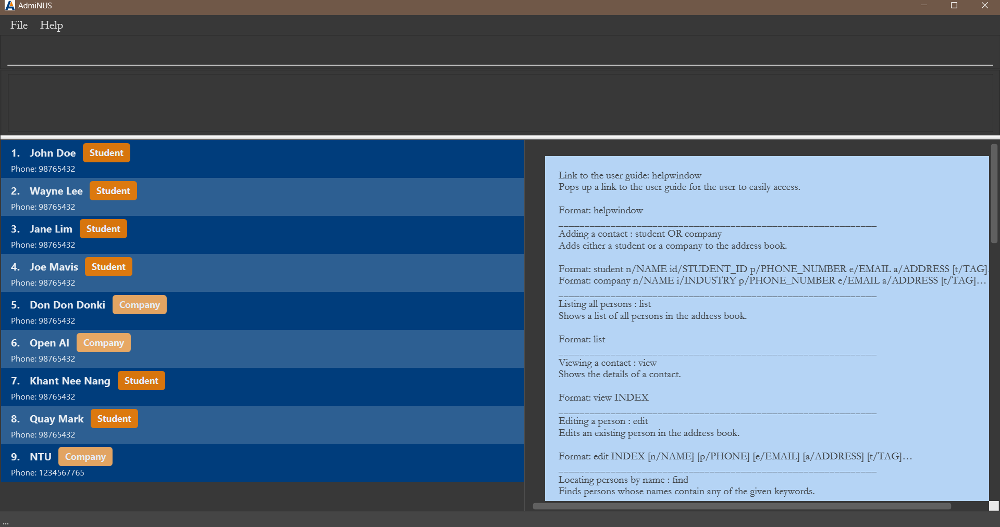
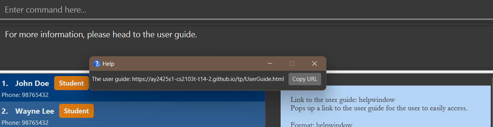
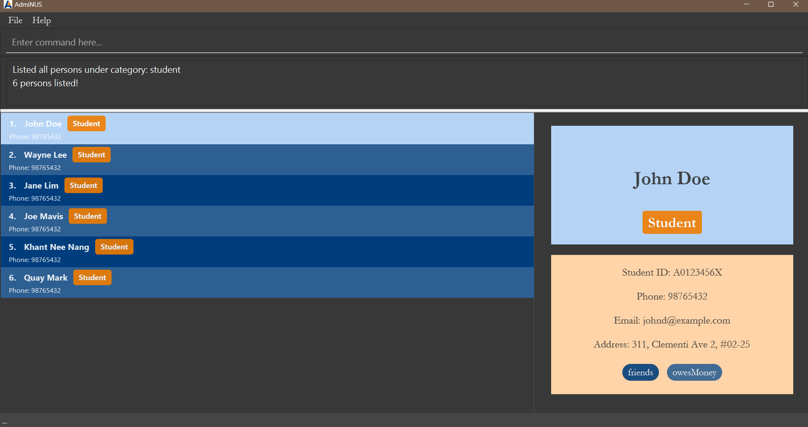
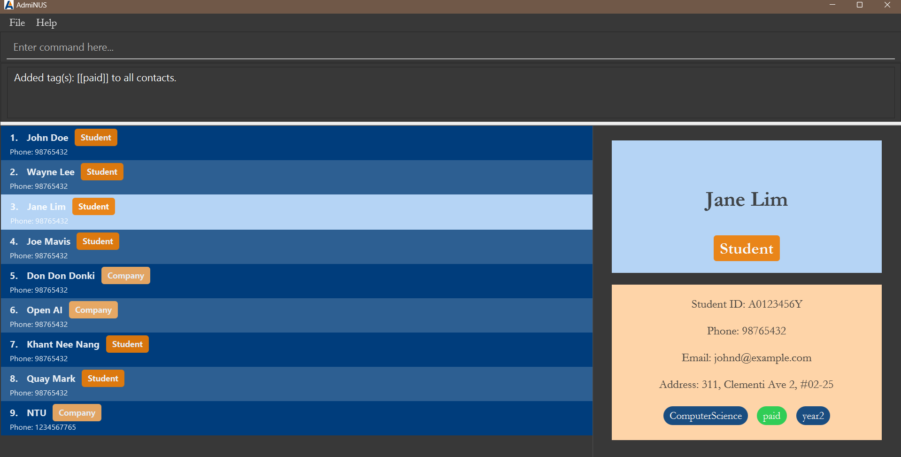

**Welcome to AdmiNUS!** <br>
Thank you for choosing AdmiNUS as your go-to contact management tool. Designed specifically for [NUS Club Administrators](#nus-club-admin). AdmiNUS aims to make your contact management experience easy and efficient. Whether you prefer the speed of typing commands or the clarity of a user-friendly GUI, AdmiNUS has you covered.

---

## Why Choose AdmiNUS?

AdmiNUS streamlines contact management by combining the speed of CLI commands with an intuitive GUI. It is especially useful for [NUS Club Administrator](#nus-club-admin) who need to manage contacts efficiently for events, vendors, and participants.

### What AdmiNUS Offers:

- Add, edit, delete, and search student and company contacts easily.

- Track contacts by categories (e.g., students, companies) and tags.

- Seamlessly switch between CLI and GUI for versatile interaction.

- Import and export contact data via CSV files to facilitate data sharing.

The application is designed to optimize workflows for users managing events, coordinating groups, and ensuring smooth communication.

## Example Use Case

Suppose you are organising an NUS event with over 200 participants, including student volunteers and vendors. With AdmiNUS, adding, editing, and filtering contacts is quick and straightforward. For example, to add a student:

```shell
student n/John Doe id/A0123456X p/98765432 e/johnd@example.com a/123 Clementi Rd, #02-01 t/volunteer
```

This command adds John Doe instantly, tagged as a volunteer. You can then use `filtertag volunteer` to find all volunteers, saving time compared to traditional methods.

AdmiNUS helps you stay organised and efficient, allowing you to focus on running successful events.

## Who Benefits from AdmiNUS?

AdmiNUS is designed primarily for [NUS Club Administrators](#nus-club-admin) who need an efficient way to manage member and participant lists. The tool helps streamline contact organisation, track participants effectively, and ensures smooth event coordination, making it an essential resource for those responsible for handling large contact databases.

---

## Table of Contents

- [Quick Start](#quick-start)
- [Features](#features)
  - [Basic Commands](#basic-commands)
    - [Viewing help: `help`](#viewing-help-help)
    - [Link to the user guide: `helpwindow`](#link-to-the-user-guide-helpwindow)
    - [Listing all contacts: `list`](#listing-all-contacts-list)
    - [Viewing a contact: `view`](#viewing-a-contact-view)
    - [Clearing all entries: `clear`](#clearing-all-entries-clear)
    - [Exiting the program: `exit`](#exiting-the-program-exit)
  - [Contact Management](#contact-management)
    - [Adding a student: `student`](#adding-a-student-student)
    - [Adding a company: `company`](#adding-a-company-company)
    - [Editing a contact: `edit`](#editing-a-contact-edit)
    - [Deleting contact(s): `delete`](#deleting-contacts-delete)
  - [Advanced Commands](#advanced-commands)
    - [Locating persons by name: `find`](#locating-persons-by-name-find)
    - [Filtering contacts by tag: `filtertag`](#filtering-contacts-by-tags-filtertag)
    - [Tracking contacts by category: `track`](#tracking-contacts-by-category-track)
    - [Adding tag(s) to contact: `tag`](#adding-tags-to-contact-tag)
    - [Deleting tag(s) from contact: `deletetag`](#deleting-tags-from-contact-deletetag)
  - [File Operations](#file-operations)
    - [Importing CSV files: `import`](#importing-csv-files-import)
    - [Exporting CSV files: `export`](#exporting-csv-files-export)
- [Glossary](#glossary)
- [FAQ](#faq)
- [Known issues](#known-issues)
- [Command summary](#command-summary)

---

## Quick start

1. Ensure you have Java `17` or above installed in your Computer. Download it [here](https://www.oracle.com/java/technologies/javase/jdk17-archive-downloads.html).

2. Download the latest `.jar` file from [here](https://github.com/AY2425S1-CS2103T-T14-2/tp/releases).

3. Copy the file to the folder you want to use as the _home folder_ for your AdmiNUS.

4. Open a [command terminal](https://www.freecodecamp.org/news/command-line-for-beginners/#heading-terminal), and run the following commands:

   - `cd your_file_path_to_folder` which takes you to the folder you put the jar file in.
   - `java -jar AdmiNUS.jar` command to run the application.<br>

   A GUI similar to the below should appear in a few seconds. Note how the app contains some sample data.<br>
   

5. Type the command into the command box, which is indicated by `Enter command here...`, and press `Enter` to execute it. e.g. typing **`help`** and pressing `Enter` will open the help window.<br>
   Some example commands you can try:

   - `list`: Lists all contacts.

   - `student n/John Doe id/A0123456Z p/98765432 e/johnd@example.com a/John street, block 123, #01-01`: Adds a student named `John Doe` to the AdmiNUS.

   - `delete 3`: Deletes the 3rd contact shown in the current list.

   - `clear`: Deletes all contacts.

   - `exit`: Exits the app.

6. Refer to the [Features](#features) below for details of each command.

---

## Features

<div markdown="block" class="alert alert-info">

🔔 **Notes about the command format**: <br>

- Words in `UPPER_CASE` are the parameters to be supplied by the user.<br>
  e.g. in `add n/NAME`, `NAME` is a parameter which can be used as `add n/John Doe`.

- Items in square brackets are optional.<br>
  e.g `n/NAME [t/TAG]` can be used as `n/John Doe t/friend` or as `n/John Doe`.

- Items with `…`​ after them can be used from zero times to multiple times.<br>
  e.g. `[t/TAG]…​` can be used as:

  - ` ` (i.e. 0 times),
  - `t/paid` (i.e. 1 times),
  - `t/paid t/Computing` (i.e. 2 times), or
  - `t/paid t/Computing t/year2 t/CS2103T t/SWE` (i.e. 5 times) etc. <br>

- Parameters can be in any order.<br>
  e.g. if the command specifies `n/NAME p/PHONE_NUMBER`, `p/PHONE_NUMBER n/NAME` is also acceptable.

- Extraneous parameters for commands that do not take in parameters (such as `help`, `list`, `exit` and `clear`) will be ignored.<br>
  e.g. if the command specifies `help 123`, it will be interpreted as `help`.

- If you are using a PDF version of this document, be careful when copying and pasting commands that span multiple lines as space characters surrounding line-breaks may be omitted when copied over to the application.

</div>

### Basic Commands

#### Viewing help: `help`

Shows a message explaining the various commands available.

**Format**: `help`

**Expected message**:

```
Showing list of possible commands on the right.
```


#### Link to the user guide: `helpwindow`

Pops up a window, where there is a link to the user guide for the user to easily access.

**Format**: `helpwindow`

**Expected message**:

```
For more information, please head to the user guide.
```



#### Listing all contacts: `list`

Shows a list of all persons in AdmiNUS.

**Format**: `list`

**Expected message**:

```
Listed all persons
```

#### Viewing a contact: `view`

Shows the details of a contact.

**Format**: `view INDEX`

**Expected message**:

```
Displayed person: (Details of person)
```

**Example**:

- `view 1` shows the details of the first contact in the list.


#### Clearing all entries: `clear`

Clears all entries from AdmiNUS.

**Format**: `clear`

**Expected message**:

```
Contact list has been cleared!
```

#### Exiting the program: `exit`

Exits the program.

**Format**: `exit`

---

### Contact Management

#### Adding a student: `student`

Adds a student to AdmiNUS.

**Format**:

```shell
student n/NAME id/STUDENT_ID p/PHONE_NUMBER e/EMAIL a/ADDRESS [t/TAG]…​
```

**Expected Message**:

```
New student added: (details of the student added)
```

| Parameter Name   | Description                       | Constraint                                                                                                                                                                                                                                                                                                                                                                                           | Required   |
| ---------------- | --------------------------------- | ---------------------------------------------------------------------------------------------------------------------------------------------------------------------------------------------------------------------------------------------------------------------------------------------------------------------------------------------------------------------------------------------------- | ---------- |
| `n/NAME`         | Name of the student               | Can include alphanumeric characters, spaces, and the `/` character for common name formats like s/o or d/o, but must not include [parameter-like sequences](#parameter-like-sequence) (e.g., `n/`)                                                                                                                                                                                                   | Compulsory |
| `id/STUDENT_ID`  | Student ID issued by NUS          | Must be 9 characters long, beginning with the letter `A`, followed by 7 digits, and ending with any uppercase letter (e.g., `A1234567Z`)                                                                                                                                                                                                                                                             | Compulsory |
| `p/PHONE_NUMBER` | Contact number                    | Must be only numbers and at least 3 digits long                                                                                                                                                                                                                                                                                                                                                      | Compulsory |
| `e/EMAIL`        | Email address                     | In the format local-part@domain and must adhere to the following constraints: <br> 1) The local part should only contain alphanumeric characters and select special characters, but cannot start or end with them. <br> 2) The domain must consist of labels separated by periods, each ending with at least two letters and containing only alphanumeric characters or hyphens. (e.g., example.com) | Compulsory |
| `a/ADDRESS`      | Physical address                  | Can take any value, but must not include [parameter-like sequences](#parameter-like-sequence) (e.g., `n/`))                                                                                                                                                                                                                                                                                          | Compulsory |
| `t/TAG`          | [Tag](#tag) to categorize contact | Must be alphanumeric characters and no spaces ([case sensitive](#case-sensitive))                                                                                                                                                                                                                                                                                                                    | Optional   |

<div markdown="block" class="alert alert-info"> 🔔 **Notes**: 
Each student is uniquely identified by their Student ID, meaning you cannot add multiple students with the same Student ID. 
</div>

<div markdown="span" class="alert alert-warning"> ⚠️ **Important**: 
While names and address can include `/` for valid formats, using parameter-like sequences (e.g., `n/`, `p/`) within the name and address fields will result in an error.
</div>

**Examples**:

- `student n/John Doe id/A0123456X p/98765432 e/johnd@example.com a/John street, block 123, #01-01` adds a student named John Doe to AdmiNUS.

<div markdown="span" class="alert alert-primary">💡 **Tip:**
A student can have any number of tags (including 0).
</div>

#### Adding a company: `company`

Adds a company to AdmiNUS.

**Format**:

```
company n/NAME i/INDUSTRY p/PHONE_NUMBER e/EMAIL a/ADDRESS [t/TAG]…​
```

**Expected Message**:

```
New company added: (details of the company added)
```

| Parameter Name   | Description                               | Constraint                                                                                                                                                                                                                                                                                                                                                                                           | Required   |
| ---------------- | ----------------------------------------- | ---------------------------------------------------------------------------------------------------------------------------------------------------------------------------------------------------------------------------------------------------------------------------------------------------------------------------------------------------------------------------------------------------- | ---------- |
| `n/NAME`         | Name of the company                       | Can include alphanumeric characters, spaces, and the `/` character but must not include [parameter-like sequences](#parameter-like-sequence) (e.g., `n/`)                                                                                                                                                                                                                                            | Compulsory |
| `i/INDUSTRY`     | Industry type (e.g., Security, Education) | Include only alphanumerical characters and spaces ([case-sensitive](#case-sensitive))                                                                                                                                                                                                                                                                                                                | Compulsory |
| `p/PHONE_NUMBER` | Contact number                            | Must be only numbers and at least 3 digits long                                                                                                                                                                                                                                                                                                                                                      | Compulsory |
| `e/EMAIL`        | Email address                             | In the format local-part@domain and must adhere to the following constraints: <br> 1) The local part should only contain alphanumeric characters and select special characters, but cannot start or end with them. <br> 2) The domain must consist of labels separated by periods, each ending with at least two letters and containing only alphanumeric characters or hyphens. (e.g., example.com) | Compulsory |
| `a/ADDRESS`      | Physical address                          | Can take any value, but must not include [parameter-like sequences](#parameter-like-sequence) (e.g., `n/`))                                                                                                                                                                                                                                                                                          | Compulsory |
| `t/TAG`          | [Tag](#tag) to categorise contact         | Must be alphanumeric characters and no spaces ([case-sensitive](#case-sensitive))                                                                                                                                                                                                                                                                                                                    | Optional   |

<div markdown="block" class="alert alert-info">

🔔 **Notes**: Each company is uniquely identified by a combination of its name and industry, meaning you cannot add multiple companies with the same name and the same industry. However, companies with the same name but different industries are allowed.

**Examples**:

- Company name: `Tesla`, Industry:`Automotives` and Company name: `Tesla`, Industry: `Education` is acceptable.

- Company name: `Tesla`, Industry:`Automotives` and Company name: `Tesla`, Industry:`Automotives` is NOT acceptable.

</div>

**Examples**:

- `company n/Newgate Prison i/Security e/newgateprison@example.com a/Newgate Prison p/1234567 t/prison t/facility` adds a company name Newgate Prison to AdmiNUS.

<div markdown="span" class="alert alert-primary">💡 **Tip:**
A company can have any number of tags (including 0).
</div>

#### Editing a contact: `edit`

Edits an existing contact in AdmiNUS.

**Format**:

```
edit INDEX [n/NAME] [id/STUDENT_ID] [i/INDUSTRY] [p/PHONE] [e/EMAIL] [a/ADDRESS] [t/TAG]…​
```

**Expected Message**:

```
Edited Person: (details of the updated contact)
```

| Parameter Name   | Description                                  | Constraint                                                                                                                                                                                                                                                                                                                                                                                           | Required   |
| ---------------- | -------------------------------------------- | ---------------------------------------------------------------------------------------------------------------------------------------------------------------------------------------------------------------------------------------------------------------------------------------------------------------------------------------------------------------------------------------------------- | ---------- |
| `INDEX`          | Index number of the contact to edit          | Positive integer only (e.g., 1, 2, 3)                                                                                                                                                                                                                                                                                                                                                                | Compulsory |
| `n/NAME`         | Updated name of the contact                  | Can include alphanumeric characters, spaces, and the `/` character but must not include [parameter-like sequences](#parameter-like-sequence) (e.g., `n/`)                                                                                                                                                                                                                                            | Optional   |
| `id/STUDENT_ID`  | Updated student ID (for students only)       | Must be 9 characters long, beginning with the letter `A`, followed by 7 digits, and ending with any uppercase letter (e.g., `A1234567Z`)                                                                                                                                                                                                                                                             | Optional   |
| `i/INDUSTRY`     | Updated industry type (for companies only)   | Include only alphanumerical characters and spaces ([case-sensitive](#case-sensitive))                                                                                                                                                                                                                                                                                                                | Optional   |
| `p/PHONE_NUMBER` | Updated phone number                         | Must be only numbers and at least 3 digits long                                                                                                                                                                                                                                                                                                                                                      | Optional   |
| `e/EMAIL`        | Updated email address                        | In the format local-part@domain and must adhere to the following constraints: <br> 1) The local part should only contain alphanumeric characters and select special characters, but cannot start or end with them. <br> 2) The domain must consist of labels separated by periods, each ending with at least two letters and containing only alphanumeric characters or hyphens. (e.g., example.com) | Optional   |
| `a/ADDRESS`      | Updated physical address                     | Can take any value, but must not include [parameter-like sequences](#parameter-like-sequence) (e.g., `n/`)                                                                                                                                                                                                                                                                                           | Optional   |
| `t/TAG`          | Updated [tag](#tag) (replaces existing tags) | Must be alphanumeric characters and no spaces ([case-sensitive](#case-sensitive))                                                                                                                                                                                                                                                                                                                    | Optional   |

<div markdown="block" class="alert alert-info">

🔔 **Notes**: <br>

- The index refers to the index number shown in the displayed person list.

- At least one of the optional fields must be provided.

- For student contact, editing industry field is **prohibited**.

- For company contact, editing student id field is **prohibited**.

- Existing values will be updated to the input values.

- When editing tags, the existing tags of the person will be removed i.e adding of tags is not cumulative.

</div>

**Examples**:

- `edit 1 p/91234567 e/johndoe@example.com` edits the phone number and email address of the 1st contact to be `91234567` and `johndoe@example.com` respectively.
- `edit 2 n/Betsy Crower t/` edits the name of the 2nd person to be `Betsy Crower` and clears all existing tags.

<div markdown="span" class="alert alert-primary">💡 **Tip**:

You can remove all the person’s tags by typing `t/` without
specifying any tags after it. </div>

#### Deleting contact(s): `delete`

Deletes the contact(s) at the specified indices or all contacts currently shown in the list from AdmiNUS.

**Format 1**: `delete INDEX [MORE_INDEX]…​`

**Expected Message**:

```
Deleted Contacts:
(list of contact(s) specified at INDEX and MORE_INDEX if present)
```

| Parameter Name | Description                                                         | Constraint                            | Required   |
| -------------- | ------------------------------------------------------------------- | ------------------------------------- | ---------- |
| `INDEX`        | Index number of the contact to delete                               | Positive integer only (e.g., 1, 2, 3) | Compulsory |
| `MORE_INDEX`   | Additional index numbers of contacts to delete (separate by spaces) | Positive integer only (e.g., 1, 2, 3) | Optional   |

**Format 2**: `delete all`

**Expected Message**:

```
Deleted Contacts:
(list of all contacts shown in the list)
```

<div markdown="block" class="alert alert-info">

🔔 **Notes**: <br>

- Split the indices by spaces.

- The index refers to the index number shown in the displayed contact list.

- `delete all` deletes all contacts currently shown in the list, not all contacts in the database.

</div>

**Examples**:

- `list` followed by `delete 2 3` deletes the 2nd and 3rd contacts in AdmiNUS given that there are more than 3 contacts in the list.
- `find Betsy` followed by `delete all` deletes all contacts in the results of the `find` command.

<div markdown="span" class="alert alert-primary">💡 **Tip**:

To delete all students with the `oneYearMembership` tag, simply use `filtertag oneYearMembership` followed by `delete all`

 </div>

<div markdown="block" class="alert alert-warning">

⚠️ **Important: Behaviour of delete Command with Repeated Indices** <br>
When using the delete command with the same index repeated multiple times (e.g., `delete 2 2`), the command processes each deletion sequentially:

1. The first instance deletes the contact at the specified index (e.g., index 2).
2. The second instance attempts to delete the contact now at index 2 after the first deletion, which may have shifted from its original position (e.g., originally at index 3).

**Example Scenario**:

- If the command `delete 2 2` is entered and the contact at index 2 is deleted successfully:
  - The app will then delete the new contact at index 2 after the first deletion.
- If there are not enough contacts remaining to fulfill the repeated deletion (e.g., only two contacts were present initially), the app will display a message indicating that the index is invalid for the second attempt.

**Note**: When an index becomes invalid after the initial deletion, the app will display an invalid index message instead of the expected success message for the contact that was deleted in the earlier step.

</div>

---

### Advanced Commands

#### Locating persons by name: `find`

Finds persons whose names contain any of the given keywords.

**Format**: `find KEYWORD [MORE_KEYWORDS]…​`

| Parameter Name | Description                                       | Constraint          | Required   |
| -------------- | ------------------------------------------------- | ------------------- | ---------- |
| `KEYWORD`      | Keyword of the contact's name to search           | Can take any values | Compulsory |
| `MORE_KEYWORD` | Additional keyword to search (separate by spaces) | Can take any values | Optional   |

**Expected Message**:

```
(Number of) persons listed!
```

<div markdown="block" class="alert alert-info">

🔔 **Notes**: <br>

- The search is [case-insensitive](#case-insensitive). For example, `hans` will match `Hans`.

- The order of the keywords does not matter. e.g. `Hans Bo` will match `Bo Hans`.

- Only the name is searched.

- Only full words will be matched e.g. `Han` will not match `Hans`.

- Persons matching at least one keyword will be returned (i.e. `OR` search). <br>
  e.g. `Hans Bo` will return `Hans Gruber`, `Bo Yang`.

</div>

**Examples**:

- `find John` returns `john` and `John Doe`
- `find alex david` returns `Alex Yeoh`, `David Allen`<br>

  

#### Filtering contacts by tags: `filtertag`

Finds contacts whose [tags](#tag) are the same as the specified keyword.

**Format**: `filtertag KEYWORD [MORE_KEYWORD]…​`

| Parameter Name | Description                                                       | Required   |
| -------------- | ----------------------------------------------------------------- | ---------- |
| `KEYWORD`      | Keyword of the tag's name to filter through the list of contacts. | Compulsory |
| `MORE_KEYWORD` | More keywords to filter                                           | Optional   |

**Expected Message**:

```
(Number of) persons listed!
```

<div markdown="block" class="alert alert-info">

🔔 **Notes**: <br>

- The filter is **[case-insensitive](#case-insensitive)**. For example, `partner` will match `PartnEr`.

- Only full words will be matched e.g. `partner` will not match `partners`.

- Contacts matching at least one tag will be returned (i.e. `OR` search). <br>
  e.g. `filtertag paid year2` finds all contacts who have tags saved as `paid` or `year2`.

</div>

**Examples**:

- `filtertag paid` finds contacts who have tags saved as `paid`.

#### Tracking contacts by category: `track`

Tracks and lists all contacts who are in the [category](#category) of the specified keyword.

**Format**: `track CATEGORY​`

**Expected message**:

```
Listed all persons under category: CATEGORY
(tracked list size number) persons listed!
```

| Parameter Name | Description                         | Constraint                                                          | Required   |
| -------------- | ----------------------------------- | ------------------------------------------------------------------- | ---------- |
| `CATEGORY`     | Either student or company to filter | Must be from the predefined list of categories (student or company) | Compulsory |

<div markdown="block" class="alert alert-info">

🔔 **Notes**: <br>

- `CATEGORY` is **[case-insensitive](#case-insensitive)**. For example, `student` will match `Student`.

- Only full words will be matched e.g. `student` will not match `students`.

</div>

**Examples**:

- `track student` finds contacts with category `student`.
- `track company` finds contacts with category `company`.


#### Adding tag(s) to contact: `tag`

Adds additional specified tag(s) to the specified contact or all contacts in the list provided no duplicate tags(s) are found in all contacts without overwriting existing tags.

**Format 1**: `tag INDEX t/TAG [t/MORE_TAG]…​`<br>

Tagging operation applies to specified contact in the list.

**Expected message**:

```
Added tag(s): [TAG], [MORE_TAG(if present)]
to Person: (details of the person)
```

| Parameter Name | Description                                                       | Constraint                                                            | Required   |
| -------------- | ----------------------------------------------------------------- | --------------------------------------------------------------------- | ---------- |
| `INDEX`        | Index number of the contact to tag from the displayed person list | Positive integer only (e.g. 1, 2, 3)                                  | Compulsory |
| `t/TAG`        | [Tag](#tag) to add to the specified contact                       | Must be alphanumeric characters, non-empty, and cannot contain spaces | Compulsory |
| `t/MORE_TAG`   | More tags to add                                                  | Must be alphanumeric characters, non-empty, and cannot contain spaces | Optional   |

**Format 2**: `tag all t/TAG [t/MORE_TAG]…​`<br>

**Expected message**:

```
Added tag(s): [TAG], [MORE_TAG(if present)] to all contacts.
```

| Parameter Name | Description                                 | Constraint                                                            | Required   |
| -------------- | ------------------------------------------- | --------------------------------------------------------------------- | ---------- |
| `t/TAG`        | [Tag](#tag) to add to the specified contact | Must be alphanumeric characters, non-empty, and cannot contain spaces | Compulsory |
| `t/MORE_TAG`   | More tags to add                            | Must be alphanumeric characters, non-empty, and cannot contain spaces | Optional   |

<div markdown="block" class="alert alert-info">

🔔 **Notes**: <br>

- The index refers to the index number shown in the displayed contact list.

* For both formats 1 and 2,

  - The tag is **[case-insensitive](#case-insensitive)**. For example, `partner` will match `PartnEr`.
  - Only full words will be matched e.g. `partner` will not match `partners`.
  - The added tags are displayed on the contact in alphabetical order. <br>
    e.g. `t/partner t/education` will display `education` before `partner`.

* For format 2, tagging operation applies to all contacts currently shown in the list, not all contacts in the database.

</div>

<div markdown="block" class="alert alert-warning">

⚠️ **Important: Impact of tag duplicate detection when adding tags** <br>

Specified `TAG` (and `MORE_TAG` if present) are only added to all contacts currently shown in the list, if
no duplicate tag(s) are found in all contacts.

</div>

**Examples**:

- `tag 1 t/computerScience t/Y2` adds the tags `computerScience` and `Y2` to the first contact in the list.

<div markdown="block" class="alert alert-primary">💡 **Tips:** <br>
  
* To tag all students with the `paid` tag, simply use `track student` followed by `tag all t/paid`.

- `paid` tags are easily distinguishable! They will have a green background:
  - to indicate that a student has paid their membership fee, or
  - to indicate that a company has paid the club sponsorship.

</div>

**Expected outcome for the above tip on `tag all`:** <br>

- `track student` <br>

  

- `tag all t/paid` <br>

  

  _Note: in this case, only all students are tagged with the paid tag._

#### Deleting tag(s) from contact: `deletetag`

Deletes the specified tag(s) from the specified contact or from all the contacts in the list provided they all have the specified tag(s).

**Format 1**: `deletetag INDEX t/TAG [t/MORE_TAG]…​`

**Expected message**:

```
Deleted Tags (TAG [MORE_TAG]) from Contact: (details of the updated contact)
```

| Parameter Name | Description                                                                    | Constraint                                                                        | Required   |
| -------------- | ------------------------------------------------------------------------------ | --------------------------------------------------------------------------------- | ---------- |
| `INDEX`        | Index number of the contact in the currently displayed list to delete tag from | Positive integer only (e.g. 1, 2, 3)                                              | Compulsory |
| `t/TAG`        | Tag to be deleted from the specified contact                                   | Must be alphanumeric characters and no spaces ([case-sensitive](#case-sensitive)) | Compulsory |
| `t/MORE_TAG`   | More tags to be deleted                                                        | Must be alphanumeric characters and no spaces ([case-sensitive](#case-sensitive)) | Optional   |

**Format 2**: `deletetag all t/TAG [t/MORE_TAG]…​`

**Expected message**:

```
Deleted the tag(s) (TAG [MORE_TAG]) from all contacts in the list.
```

| Parameter Name | Description                                  | Constraint                                                                        | Required   |
| -------------- | -------------------------------------------- | --------------------------------------------------------------------------------- | ---------- |
| `t/TAG`        | Tag to be deleted from the specified contact | Must be alphanumeric characters and no spaces ([case-sensitive](#case-sensitive)) | Compulsory |
| `t/MORE_TAG`   | More tags to be deleted                      | Must be alphanumeric characters and no spaces ([case-sensitive](#case-sensitive)) | Optional   |

<div markdown="block" class="alert alert-info">

🔔 **Notes**: <br>

- The index refers to the index number shown in the displayed contact list.

* `deletetag all t/TAG` deletes the tag `TAG` from all contacts currently shown in the list, not all contacts in the database.

* `deletetag all t/TAG` only works when all contacts currently shown in the list have the tag `TAG`, otherwise an error message is shown.

* For both formats 1 and 2,
  - The tag is [case-sensitive](#case-sensitive). For example, `partner` will not match `PartnEr`.
  - Only full words will be matched e.g. `partner` will not match `partners`.

</div>

**Examples**:

- `deletetag 1 t/senior t/Y2` deletes the `senior` and `Y2` tags from the first contact in the list.
- `deletetag all t/senior t/Y2` deletes the `senior` and `Y2` tags from all contacts in the list.

<div markdown="span" class="alert alert-primary">💡
 **Tip**:

To delete all `Y3` tags from contacts, simply use `filtertag Y3` followed by `deletetag all t/Y3`.

 </div>

---

### File Operations

#### Importing [CSV](#csv) Files: `import`

The `import` command allows you to bring data from a CSV file into the application, enabling seamless population of your contacts database from external sources.

**Format**: `import FILE_PATH`

**[Absolute Path](#absolute-path)**:

- Specifies the full path from the root [directory](#directory).
- **Unix/Linux/Mac**: `/home/user/data/hackers_2022.csv`
- **Windows**: `C:\\Users\\user\\data\\hackers_2022.csv`

**[Relative Path](#relative-path)**:

- Starts from the current working directory of the application.
- Example: `data/File.csv` or `./data/hackers_2022.csv`
- If the application runs in `/home/user/project`, `import data/File.csv` points to `/home/user/project/data/File.csv`.

<div markdown="block" class="alert alert-info"> 📂 **Important Notes**:

- Windows paths use backslashes (e.g., `C:\\Users\\username\\data\\File.csv`).

- Verify the file format is `.csv` and that you have read permissions.

</div>

**Examples**:

- Absolute: `import /home/user/data/hackers_2022.csv`
- Relative: `import ./data/hackers_2022.csv`


- The contents of an example CSV file.


- After executing the import command, the contents of the CSV file are being imported to AdmiNUS.

**Troubleshooting**:

- For errors such as "file not found," confirm the path type (absolute vs. relative) and the file’s existence.
- Ensure the application has access rights to the specified directory.
- If you receive an error message indicating that the file is "corrupted or missing compulsory fields," check the following:
  - Ensure all required fields are present in each row of your CSV file (e.g., name, category, studentID or industry, phone, email, address).
  - Confirm that each row follows the correct format, with entries for every compulsory field. Empty fields can trigger this error.
  - Verify that the file is saved with a `.csv` extension and is structured as a valid CSV (comma-separated values), with columns corresponding to the required fields.

---

#### Exporting [CSV](#csv) Files: `export`

The `export` command is used to save your current contacts database into a CSV file, enabling data sharing and backup.

**Format**: `export FILE_PATH`

**[Absolute Path](#absolute-path)**:

- Specifies the full path, starting from the root [directory](#directory).
- **Unix/Linux/Mac**: `/home/user/data/output_data.csv`
- **Windows**: `C:\\Users\\user\\data\\output_data.csv`

**[Relative Path](#relative-path)**:

- Refers to paths relative to the current directory.
- Example: `./data/Output.csv` saves to `data` in the current directory.

<div markdown="block" class="alert alert-info"> 📂 **Important Notes**:

- Ensure that the directories exist before exporting. For Windows paths, use double backslashes (e.g., `C:\\Users\\user\\data\\File.csv`).

- Files may be overwritten without warning.

</div>

**Examples**:

- Absolute: `export /home/user/data/output_data.csv`
- Relative: `export ./data/Output.csv`

**Troubleshooting**:

- If an error occurs during export (e.g., "access denied"), check your write permissions for the specified directory.
- Confirm the path ends with `.csv` to avoid format issues.

### Saving the data

AdmiNUS data are saved in the hard disk automatically after any command that changes the data. There is no need to save manually.

### Editing the data file

AdmiNUS data are saved automatically as a [JSON](#json) file

```
[JAR file location]/data/addressbook.json
```

Advanced users are welcome to update data directly by editing that data file.

<div markdown="span" class="alert alert-warning">:exclamation: **Caution:**
If your changes to the data file make its format invalid, AdmiNUS will discard all data and start with an empty data file at the next run. It is recommended to make a backup of the file before editing it.
Furthermore, certain edits can cause AdmiNUS to behave in unexpected ways (e.g., if a value entered is outside of the acceptable range). Therefore, edit the data file only if you are confident that you can update it correctly.
</div>

---

## Glossary

<a name="absolute-path"></a>

- **_Absolute Path_**: A full path that specifies the exact location of a file or directory from the root of the file system.
  <a name="case-insensitive"></a>
- **_Case-Insensitive_**: A term used to describe a system where uppercase and lowercase letters are treated as the same. For example, Apple, apple, and APPLE would be considered equivalent values.
  <a name="case-sensitive"></a>
- **_Case-Sensitive_**: A term used to describe a system where uppercase and lowercase letters are treated as distinct. For example, Apple, apple, and APPLE would be considered different values.
  <a name="category"></a>
- **_Category_**: A label that represents the type of contact (e.g., student, company) used for filtering and sorting contacts.
- **_CLI (Command Line Interface)_**: A text-based user interface through which users interact with the application by typing commands.
  <a name="csv"></a>
- **_CSV (Comma-separated values)_**: A text file format that uses commas to separate values, and newlines to separate records.
  <a name="directory"></a>
- **_Directory_**: A file system structure that contains references to other files and directories. It is commonly referred to as a folder and is used to organise files hierarchically within a file system.
- **_GUI (Graphical User Interface)_**: The part of the application that users interact with, which includes graphical components like command boxes and task lists.
  <a name="json"></a>
- **_JSON (JavaScript Object Notation)_**: A lightweight data interchange format that is easy for humans to read and write and easy for machines to parse and generate. JSON represents data using key-value pairs and supports data types such as strings, numbers, arrays, objects, and booleans. It is widely used for transmitting structured data over network connections, particularly in web applications.
  <a name="nus-club-admin"></a>
- **_NUS Club Administrator_**: An NUS club admin user responsible for managing contacts of students, companies, etc.
  <a name="parameter-like-sequence"></a>
- **_Parameter-like Sequence_**: A combination of a forward slash (`/`) and a single character that resembles the prefixes used in commands (e.g., `n/`, `p/`, `e/`). These are used to specify input fields in commands and should not appear in any text fields.
- **_Path_**: A sequence of symbols and names that identifies the location of a file or folder within a computer's file system. Paths can be absolute, starting from the root of the file system (e.g., /home/user/documents/file.txt), or relative, which are based on the current directory (e.g., documents/file.txt).
  <a name="relative-path"></a>
- **_Relative Path_**: A file path that is relative to the current working directory of the user or application.
- **_Student ID_**: The student ID associated with each student in NUS. It has the format AxxxxxxxX (e.g. A0123456Z).
  <a name="tag"></a>
- **_Tag_**: A keyword or label associated with a contact that allows for easy grouping and filtering.

<div markdown="block" class="alert alert-info">

**Navigation Box** <br>
[Back to Top](#why-choose-adminus) <br>
[Back to Table of Contents](#table-of-contents) <br>
[Back to Basic commands](#basic-commands)<br>
[Back to Contact management](#contact-management)<br>
[Back to Advanced commands](#advanced-commands)<br>
[Back to File operations](#file-operations)

</div>

---

## FAQ

**Q: How do I transfer my data to another computer?**  
A: Install the app on the new computer, then replace its default data file with the data file from your previous AdmiNUS home folder. Alternatively, export your data to a CSV file from the original computer using the [export command](#exporting-csv-files-export) and import it on the new computer using the [import command](#importing-csv-files-import).

**Q: How do I back up my AdmiNUS data?**  
A: The data is saved automatically in a JSON file located in the

```
[JAR file location]/data/addressbook.json
```

You can make a backup by copying this file to a safe location. Alternatively, you can export your data to a CSV file using the [export command](#exporting-csv-files-export).

**Q: Can I use AdmiNUS without Java installed on my computer?**  
A: No, AdmiNUS requires Java 17 or above to run. You need to ensure that the correct version of Java is installed before using the application.

**Q: Is there a way to undo a deletion?**  
A: Currently, there is no built-in undo function. Once a contact is deleted using the `delete` command, it cannot be recovered unless you have a backup of your data file.

**Q: Why can't I add a student with the same Student ID?**  
A: Each student in AdmiNUS must have a unique Student ID. If you try to add a student with an existing Student ID, the system will reject the new entry. Make sure to verify the ID before adding a new student.

**Q: I get an error message saying "Invalid path" when importing a CSV. What should I do?**  
A: This error can occur if the file path you specified is incorrect or if the file doesn’t exist. Ensure you are using a valid absolute or relative path and that the file is present in the directory. If you are on Windows, remember to use double backslashes (`\\`) in the file path.

**Q: Can I edit the data file manually?**  
A: Yes, advanced users can manually edit the `addressbook.json` file where data is saved. However, any incorrect modification may cause data loss or unexpected behavior in the application. Always make a backup before editing.

**Q: Why are my tags disappearing when I edit a contact?**  
A: When editing a contact, if you use the `t/` parameter without specifying new tags, all existing tags will be removed. To retain the tags, include all desired tags in the `edit` command.

**Q: What should I do if AdmiNUS opens off-screen after using multiple monitors?**  
A: This can happen if you move the application to a secondary screen and then disconnect that monitor. To resolve this, delete the `preferences.json` file generated by AdmiNUS, and the app will reset its position to the primary screen.

**Q: How do I efficiently delete multiple contacts?**  
A: You can use the `delete INDEX [MORE_INDEX]…​` command to delete multiple contacts by specifying their indices. If you want to delete all contacts displayed after a filter operation, use `delete all`. Be careful with this command as it cannot be undone.

---

## Known issues

1. **When using multiple screens**, if you move the application to a secondary screen, and later switch to using only the primary screen, the GUI will open off-screen. The remedy is to delete the `preferences.json` file created by the application before running the application again.
2. **If you minimize the Help Window** and then run the `help` command (or use the `Help` menu, or the keyboard shortcut `F1`) again, the original Help Window will remain minimised, and no new Help Window will appear. The remedy is to manually restore the minimized Help Window.
3. **Entering [parameter-like sequences](#parameter-like-sequence) in input fields**: If a user enters text that resembles a parameter prefix (e.g., `n/`, `p/`, `e/`) within an input field like `Name` or `Address`, it may cause unexpected parsing errors or rejections. Ensure that parameter-like sequences are avoided within fields that do not expect them.
4. **Case Sensitivity of the Industry Field**: The industry field is currently [case-sensitive](#case-sensitive). This means that entries with different capitalisation (e.g., `University` and `UNiversity`) will be treated as separate and distinct values, even though they appear visually identical in the interface. This behavior can lead to unintended duplicates if users do not input industry names with consistent capitalisation.

---

## Command summary

| **Action**                        | **Format**                                                                                          | **Example**                                                                                                         |
| --------------------------------- | --------------------------------------------------------------------------------------------------- | ------------------------------------------------------------------------------------------------------------------- |
| **Viewing help**                  | `help`                                                                                              | `help`                                                                                                              |
| **Link to the user guide**        | `helpwindow`                                                                                        | `helpwindow`                                                                                                        |
| **Listing all contacts**          | `list`                                                                                              | `list`                                                                                                              |
| **Viewing a contact**             | `view INDEX`                                                                                        | `view 1`                                                                                                            |
| **Clearing all entries**          | `clear`                                                                                             | `clear`                                                                                                             |
| **Exiting the program**           | `exit`                                                                                              | `exit`                                                                                                              |
| **Adding a student**              | `student n/NAME id/STUDENT_ID p/PHONE_NUMBER e/EMAIL a/ADDRESS [t/TAG]…​`                           | `student n/James Ho id/A0123456X p/22224444 e/jamesho@example.com a/123, Clementi Rd, 1234665 t/friend t/colleague` |
| **Adding a company**              | `company n/NAME i/INDUSTRY p/PHONE_NUMBER e/EMAIL a/ADDRESS [t/TAG]…​`                              | `company n/Newgate Prison i/Security e/newgateprison@example.com a/Newgate Prison p/1234567 t/prison t/facility`    |
| **Editing a contact**             | `edit INDEX [n/NAME] [id/STUDENT_ID] [i/INDUSTRY] [p/PHONE_NUMBER] [e/EMAIL] [a/ADDRESS] [t/TAG]…​` | `edit 2 n/James Lee e/jameslee@example.com`                                                                         |
| **Deleting contact(s)**           | -`delete INDEX [MORE_INDEX]…​` <br> -`delete all`                                                   | `delete 3` or `delete 2 4` or `delete all`                                                                          |
| **Locating persons by name**      | `find KEYWORD [MORE_KEYWORDS]…​`                                                                    | `find James Jake`                                                                                                   |
| **Filtering contacts by tag**     | `filtertag KEYWORD [MORE_KEYWORDS]…​`                                                               | `filtertag bestie` or `filtertag bestie slay`                                                                       |
| **Tracking contacts by category** | `track CATEGORY`                                                                                    | `track student`                                                                                                     |
| **Adding tag(s) to contact**      | -`tag INDEX t/TAG [t/MORE_TAG]…​` <br> -`tag all t/TAG [t/MORE_TAG]…​`                              | `tag 1 t/year2 t/computerScience` or `tag all t/year2 t/computerScience`                                            |
| **Deleting tag(s) from contact**  | -`deletetag INDEX t/TAG [t/MORE_TAG]…​` <br> -`deletetag all t/TAG [t/MORE_TAG]…​`                  | `deletetag 1 t/senior t/Y2` or `deletetag all t/senior t/Y2`                                                        |
| **Importing CSV files**           | `import FILE_PATH`                                                                                  | `import C:\Users\user\data\File.csv` or `import data/File.csv`                                                      |
| **Exporting CSV files**           | `export FILE_PATH`                                                                                  | `export C:\Users\user\data\File.csv` or `export data/File.csv`                                                      |

[Back to Table of Contents](#table-of-contents)
