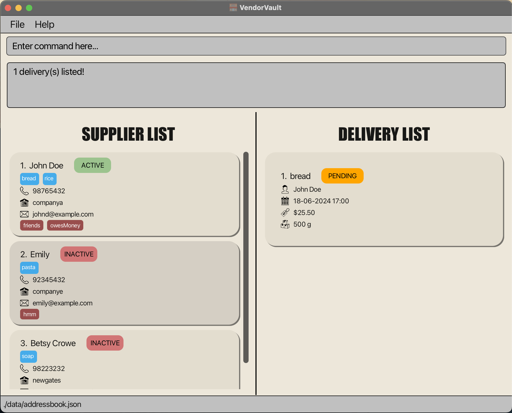

# Vendor Vault User Guide

Vendor Vault is a **desktop app for managing supplier contact information and deliveries, optimized for use via a  Line Interface** (CLI). If you can type fast, VendorVault can get your contact management tasks done faster than traditional GUI apps.

<!-- * Table of Contents -->
<page-nav-print />

--------------------------------------------------------------------------------------------------------------------

## Quick start

1. Ensure you have Java `17` or above installed in your Computer. If you are unsure, you can check by opening the command terminal and typing `java -version`. If you do not have Java installed, you can download it from [here](https://www.oracle.com/java/technologies/downloads/#java17?er=221886).

1. Download the latest `.jar` file from [here](https://github.com/AY2425S1-CS2103T-W14-1/tp/releases).

1. Copy the file to the folder you want to use as the _home folder_ for your VendorVault Application.

1. Open a command terminal, type `cd [path-to-your-folder]` (path to the folder you put the jar file in) and use the `java -jar vendorvault.jar` command to run the application. 
   A GUI similar to the below should appear in a few seconds. Note how the app contains some sample data. 
   

1. Type the command in the command box and press Enter to execute it. e.g. typing **`help`** and pressing Enter will open the help window. 
   Some example commands you can try:

   * `list` : Lists all contacts.

   * `add -s n/John Doe p/98765432 e/johnd@example.com com/John street, block 123, #01-01 pro/ iPhone` : Adds a supplier named `John Doe` to the VendorVault.

   * `delete -d 3` : Deletes the 3rd contact shown in the current delivery list.

   * `exit` : Exits the app.

1. Refer to the [Features](#features) below for details of each command.

--------------------------------------------------------------------------------------------------------------------

# Features
<box type="info" seamless>

**Notes about the command format:** 

* Words in `UPPER_CASE` are the parameters to be supplied by the user. 
  e.g. in `add n/NAME`, `NAME` is a parameter which can be used as `add n/John Doe`.

* Items in square brackets are optional. 
  e.g `n/NAME [t/TAG]` can be used as `n/John Doe t/friend` or as `n/John Doe`.

* Items with `…`​ after them can be used multiple times including zero times. 
  e.g. `[t/TAG]…​` can be used as ` ` (i.e. 0 times), `t/friend`, `t/friend t/family` etc.

* Parameters can be in any order. 
  e.g. if the command specifies `n/NAME p/PHONE_NUMBER`, `p/PHONE_NUMBER n/NAME` is also acceptable.

* Extraneous parameters for commands that do not take in parameters (such as `list` and `exit`) will be ignored. 
  e.g. if the command specifies `exit 123 `, it will be interpreted as `exit`.

* If you are using a PDF version of this document, be careful when copying and pasting commands that span multiple lines as space characters surrounding line-breaks may be omitted when copied over to the application.
</box>
---

## Command table of content

### Supplier Commands

Action     | Format, Examples
-----------|----------------------------------------------------------------------------------------------------------------------------------------------------------------------
**[Add](#adding-a-supplier-add-s)**    | `add -s n/NAME p/PHONE e/EMAIL com/COMPANY [t/TAG]…​ [pro/PRODUCT]…​`   e.g., `add -s n/John Doe p/98765432 e/johnd@example.com com/companyA t/friends t/owesMoney pro/rice pro/bread`
**[Delete](#deleting-a-supplier-delete-s)** | `delete -s INDEX`  e.g., `delete -s 3`
**[List](#listing-all-suppliers-list-s)**   | `list -s`
**[Mark](#mark-a-supplier-with-a-status-mark-s)**   | `mark -s INDEX STATUS`  e.g.,`mark -s 2 active`
**[Find](#find-a-supplier-find-s)**   | `find -s n/<KEYWORD FOR SUPPLIER NAME> com/<KEYWORD FOR SUPPLIER COMPANY> pro/<KEYWORD FOR SUPPLIER PRODUCT>`
**[Sort](#sort-suppliers-sort-s)**   | `sort -s so/SORT_ORDER sb/SORT_BY_FIELD`  e.g., `sort -s so/a sb/n`

### Delivery Commands

Action     | Format, Examples
-----------|----------------------------------------------------------------------------------------------------------------------------------------------------------------------
**[Add](#adding-a-delivery-add-d)**    | `add -d on/DELIVERY_DATE_TIME s/SUPPLIER_INDEX pro/PRODUCT q/QUANTITY kg/g/L/mL/units c/COST`   e.g., `add -d on/18-06-2024 17:00 s/1 pro/bread q/500 g c/5.50`
**[Delete](#deleting-a-delivery-delete-d)** | `delete -d INDEX`  e.g., `delete -d 3`
**[List](#listing-all-deliveries-list-d)**   | `list -d`
**[Mark](#marking-a-delivery-mark-d)**   | `mark -d INDEX STATUS`  e.g.,`mark -d 2 PENDING`
**[Find](#find-a-delivery-find-d)**   | `find -s n/<KEYWORD FOR SUPPLIER NAME> com/<KEYWORD FOR SUPPLIER COMPANY> pro/<KEYWORD FOR SUPPLIER PRODUCT>`
**[Sort](#sort-deliveries-sort-d)**   | `sort -s so/SORT_ORDER sb/SORT_BY_FIELD`  e.g., `sort -s so/a sb/n`
**[Upcoming](#upcoming-deliveries-upcoming)** | `upcoming aft/START_DATE bef/END_DATE`  e.g., `upcoming aft/19-12-2022 08:00 bef/18-06-2023 17:00`

### General Commands
Action     | Format, Examples
-----------|----------------------------------------------------------------------------------------------------------------------------------------------------------------------
**[List](#viewing-all-deliveries-and-suppliers-list)**   | `list -a`
**[Help](#viewing-help-help)**   | `help`
**[Exit](#exiting-the-program-exit)**   | `exit`

---
### Viewing help : `help`

Shows a message explaining how to access the help page.

Format: `help`

##### Here's how it would look like in the app:

### Viewing all deliveries and suppliers : `list -a`

Lists all suppliers and deliveries in the VendorVault

Format: `list -a`

<box type="warning" seamless>

**Warnings**:
- No other parameters should be given for this command.
- At least one space between list and -a
</box>

---

## <ins> Supplier Commands </ins>

### Adding a supplier: `add -s`

Adds a supplier to the address book.

Format: `add -s n/NAME p/PHONE e/EMAIL com/COMPANY [t/TAG]…​ [pro/PRODUCT]…​`
<box type="tip" seamless>

**Tip:** A supplier can have any number of tags and products (including 0)
</box>

<box type="warning" seamless>

**Warnings**:
- At least on space between `add` and `-s` is compulsory
- Duplicate supplier will not be added again
- A supplier is considered duplicate if they have the same NAME and COMPANY
</box>

Examples:
* `add -s n/John Doe p/98765432 e/johnd@example.com com/companyA t/friends t/owesMoney pro/rice pro/bread`
* `add -s n/Betsy Crowe p/98223232 e/betsycrowe@example.com com/Newgates t/urgent pro/soap`

Expected output:
* `New supplier added: John Doe; Phone: 98765432; Email: johnd@example.com; Company: companya; Tags: [owesMoney][friends]; Products breadrice`
* `New supplier added: Betsy Crowe; Phone: 98223232; Email: betsycrowe@example.com; Company: newgates; Tags: [urgent]; Products soap`

#### Here's how it would look like in the app:

### Listing all suppliers: `list -s`

Shows a list of all suppliers in the VendorVault. (The delivery list will not be affected)

Format: `list -s`

<box type="warning" seamless>

**Warnings**:
- No other parameters should be given for this command.
- At least one space between list and -s
  </box>

### Deleting a supplier : `delete -s`

The `delete -s` command is used to delete a supplier from the list of suppliers in VendorVault.

Format: `delete -s INDEX`
- `INDEX`: The index of the supplier in the list.

#### Example
To delete the supplier at index 3:

    delete -s 3

A success message will be displayed if the supplier is successfully deleted.

#### Here's how it would look like in the app:

### Mark a supplier with a status : `mark -s`

The `mark` command is used to mark a supplier as either **active** or **inactive**
in VendorVault. This helps you keep track of which suppliers are currently active for deliveries and which are not.

Format: `mark -s <supplier_index> <status>`
- `<supplier_index>`: The index of the supplier in the list.
- `<status>`: Either `active` or `inactive` to indicate the supplier's status.

#### Example
To mark the supplier at index 3 as active:

    mark -s 3 active

A success message will be displayed if the supplier is successfully marked as active.

#### Here's how it would look like in the app:

### Find a supplier: `find -s`

The `find -s` command is used to find a supplier in VendorVault. 
This helps you find suppliers based on keyword search.

Format: `find -s n/KEYWORD_SUPPLIER_NAME com/KEYWORD_SUPPLIER_COMPANY pro/<KEYWORD_SUPPLIER_PRODUCT>`

Parameters:

- `n/KEYWORD_SUPPLIER_NAME`: This will check if the Supplier's name contains the given keyword
- `on/KEYWORD_SUPPLIER_COMPANYE`: This will check if the Supplier's company contains the given keyword
- `pro/KEYWORD_SUPPLIER_PRODUCT`: This will check if the Supplier's product(s) contains in the given keyword

<box type="warning" seamless>

**Warnings**:
- At least one non-empty parameter must be given
- No duplicate parameter can be used
- Find result(s) will contain/satisfy all the given parameters
- Find feature is case-insensitive
</box>

#### Example
To find the supplier whose name contains "link" and company contains "NU":

    find -s n/link com/NU

#### Here's how it would look like in the app:

### Sort suppliers: `sort -s`

The `sort -s` command is used to sort suppliers in VendorVault.
This helps you to view the suppliers in a different order (ascending or descending), based on the supplier name.

Format: `sort -s so/SORT_ORDER sb/SORT_BY_FIELD`
- `SORT_ORDER`: Must be either 'a' for ascending or 'd' for descending.
- `SORT_BY_FIELD`: Must be 'n' for name. (current version of VendorVault only supports sorting by name)

**Warnings**:
- A spacing between `add` and `-s` is compulsory
- All prefixes and parameters must be given
- No duplicate prefix can be used
- Parameters used are **case-sensitive**

#### Example
To sort suppliers by name in descending order:

    sort -s so/d sb/n

A success message will be displayed if the suppliers are successfully sorted.
#### Here's how it would look like in the app:

---

## <ins> Delivery Commands </ins>

### Adding a delivery: `add -d`

Adds a delivery to the address book.

Format: `add -d on/DELIVERY_DATE_TIME s/SUPPLIER_INDEX pro/PRODUCT q/QUANTITY kg/g/L/mL/units c/COST`

Parameters:

- `on/DELIVERY_DATE_TIME`: Must be in dd-MM-yyyy hh:mm format and must not be blank.
- `s/SUPPLIER_INDEX`: Must be a number greater than 0 and must not be blank.
- `pro/PRODUCT`: Must only consist of alphanumeric characters and must not be blank.
- `q/QUANTITY`: Must be a number greater than 0 followed by a space and unit and must not be blank.
- `c/COST`: Must be a number greater than 0 with up to 2 decimal places allowed. Must not be blank.
<box type="tip" seamless>

**Tip:** Day and month of date must be in double digits!
</box>

<box type="warning" seamless>

**Warnings**:
- A spacing between `add` and `-d` is compulsory
- A delivery is considered duplicate if they have the same DATE, TIME, SUPPLIER, PRODUCT and COST
- Duplicate delivery will not be added again
- No duplicate prefix can be used
- Units for QUANTITY is case-sensitive
</box>

#### Example

    add -d on/18-06-2024 17:00 s/1 pro/bread q/500 g c/5.50

#### Here's how it would look like in the app:

### Listing all deliveries: `list -d`

Shows a list of all supplier in the VendorVault. (The supplier list will not be affected)

Format: `list -d`

<box type="warning" seamless>
**Warnings**:
- No other parameters should be given for this command.
- At least one space between list and -a
</box>

### Marking a delivery : `mark -d`

Marks the specified delivery from the address book with the specified `STATUS`.

Format: `mark -d INDEX STATUS`

Parameters:

- `INDEX`: Must be a number greater than 0 and must not be blank.
- `STATUS`: Must be one of the following: PENDING, DELIVERED, CANCELLED and must not be blank.
<box type="tip" seamless>

**Warnings**:
- A spacing between `mark` and `-d` is compulsory
- Both parameters must be given
- Parameters used are case-insensitive
</box>

Examples:
* `list` followed by `mark -d 2 pending` marks the 2nd delivery in the address book with a pending status.
* `find -d /pro bread` followed by `mark -d 1 cancelled` marks the 1st delivery in the results of the `find` command with a cancelled status.

#### Here's how it would look like in the app:

### Deleting a delivery : `delete -d`

Deletes the specified delivery from the address book.

Format: `delete -d INDEX`

Parameters:

- `INDEX`: Must be a number greater than 0 and must not be blank.
<box type="tip" seamless>

**Warnings**:
- A spacing between `delete` and `-d` is compulsory
- No duplicate prefix can be used
</box>

Examples:
* `list` followed by `delete -d 2` deletes the 2nd delivery in the address book.
* `find -d /pro bread` followed by `delete -d 1` deletes the 1st delivery in the results of the `find` command.

#### Here's how it would look like in the app:

### Find a delivery: `find -d`

Find deliveries based on attributes of the delivery, like the delivery date and time, delivery status, supplier and product.

Format: `find -d on/DELIVERY_DATE_TIME stat/STATUS s/SUPPLIER_INDEX pro/PRODUCT`

Parameters:

- `on/DELIVERY_DATE_TIME`: Must be in dd-mm-yyyy hh:mm format and must not be blank.
- `stat/STATUS`: Must be one of the following: PENDING, DELIVERED, CANCELLED and must not be blank.
- `s/SUPPLIER_INDEX`: Must be a number greater than 0 and must not be blank.
- `pro/PRODUCT`: Must only consist of alphanumeric characters and must not be blank.
<box type="tip" seamless>

**Warnings**:
- A spacing between `find` and `-d` is compulsory
- At least one prefix and parameter must be given
- No duplicate prefix can be used
- Find result(s) will contain/satisfy all the given parameters
- Parameters used are case-insensitive
</box>

#### Example
To find deliveries of product "milk" on "28-06-2025 17:00" :

    find -d on/ 28-06-2025 17:00 pro/ milk

#### Here's how it would look like in the app:

### Sort deliveries: `sort -d`

The `sort -d` command is used to sort deliveries in VendorVault.
This helps you to view the deliveries in a different order, based on the delivery cost, date or status.

Format: `sort -d so/SORT_ORDER sb/SORT_BY_FIELD`

Parameters:

- SORT_ORDER: Must be either 'a' for ascending or 'd' for descending, and must not be blank.
- SORT_BY_FIELD: Must be either 'c' for cost, 'd' for date or 's' for status, and must not be blank.
<box type="tip" seamless>

**Warnings**:
- A spacing between `add` and `-d` is compulsory
- All prefixes and parameters must be given
- No duplicate prefix can be used
- Parameters used are **case-sensitive**
</box>

#### Example

To sort deliveries by cost in ascending order:

    sort -d so/a sb/c

#### Here's how it would look like in the app:

### Upcoming deliveries: `upcoming`

The `upcoming` command is used to view pending deliveries in VendorVault.
You can choose to view all pending deliveries within a specified date range or
before or after a given date.

Format: `upcoming aft/START_DATE bef/END_DATE`

Parameters:

- `aft/START_DATE`: Must be in dd-mm-yyyy hh:mm format.
- `bef/END_DATE`: Must be in dd-mm-yyyy hh:mm format.
<box type="tip" seamless>
**Tip:** You can provide both START_DATE and END_DATE!

**Warnings**:
- A spacing between `upcoming` and the first parameter is compulsory
- At least one parameter must be provided
- No duplicate prefix can be used
- The prefixes `aft/` and `bef/` are **case-sensitive**
</box>

#### Example

To view pending deliveries between two dates:

    upcoming aft/19-12-2022 08:00 bef/18-06-2023 17:00

#### Here's how it would look like in the app:

---
### Exiting the program : `exit`

Exits the program.

Format: `exit`

### Saving the data

AddressBook data are saved in the hard disk automatically after any command that changes the data. There is no need to save manually.

### Editing the data file

AddressBook automatically saves your data as a JSON file `[JAR file location]/data/vendorvault.json`. Advanced users are welcome to update data directly by editing that data file.
<box type="warning" seamless>

**Caution:**
- **Backup before editing!** If the file is not edited correctly, VendorVault may not be able to read it which will cause all your data to be erased, and the app will start with an empty data file the next time you open it.  
- Furthermore, certain edits can cause VendorVault to behave in unexpected ways (e.g., if a value entered is outside the acceptable range). Therefore, edit the data file only if you are confident that you can update it correctly.
</box>

---

### Archiving data files `[coming in v2.0]`

_Details coming soon ..._

--------------------------------------------------------------------------------------------------------------------

## FAQ

**Q**: How do I transfer my data to another Computer? 
**A**: Install the app in the other computer and overwrite the empty data file it creates with the file that contains the data of your previous AddressBook home folder.

--------------------------------------------------------------------------------------------------------------------

## Known issues

1. **When using multiple screens**, if you move the application to a secondary screen, and later switch to using only the primary screen, the GUI will open off-screen. The remedy is to delete the `preferences.json` file created by the application before running the application again.
2. **If you minimize the Help Window** and then run the `help` command (or use the `Help` menu, or the keyboard shortcut `F1`) again, the original Help Window will remain minimized, and no new Help Window will appear. The remedy is to manually restore the minimized Help Window.

--------------------------------------------------------------------------------------------------------------------

[Back to Top](#vendor-vault-user-guide)
