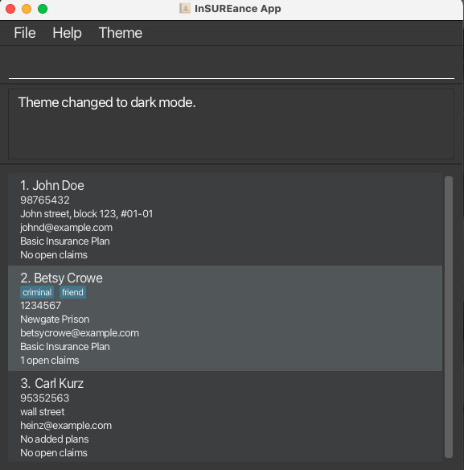
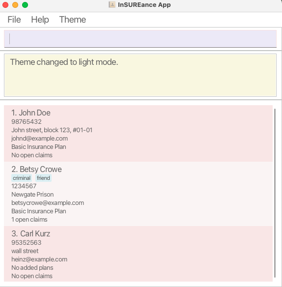

# InSUREance APP User Guide

InSUREance is a **desktop app for managing contacts, optimized for use via a  Line Interface** (CLI) while still having the benefits of a Graphical User Interface (GUI). If you can type fast, InSUREance can get your contact management tasks done faster than traditional GUI apps.

<!-- * Table of Contents -->
<page-nav-print />

--------------------------------------------------------------------------------------------------------------------

## Quick start

1. Ensure you have Java `17` or above installed in your Computer.

1. Download the latest `.jar` file from [here](https://github.com/AY2425S1-CS2103-F12-1/tp).

1. Copy the file to the folder you want to use as the _home folder_ for your app.

1. Open a command terminal, `cd` into the folder you put the jar file in, and use the `java -jar inSUREance.jar` command to run the application. 
   A GUI similar to the below should appear in a few seconds. Note how the app contains some sample data. 
   

1. Type the command in the command box and press Enter to execute it. e.g. typing **`help`** and pressing Enter will open the help window. 
   Some example commands you can try:

   * `list` : Lists all contacts.

   * `add n/John Doe p/98765432 e/johnd@example.com a/John street, block 123, #01-01` : Adds a contact named `John Doe` to the Address Book.

   * `delete 3` : Deletes the 3rd contact shown in the current list.

   * `clear` : Deletes all contacts.

   * `exit` : Exits the app.

1. Refer to the [Features](#features) below for details of each command.

--------------------------------------------------------------------------------------------------------------------

## Features

<box type="info" seamless>

**Notes about the command format:** 

* Words in `UPPER_CASE` are the parameters to be supplied by the user. 
  e.g. in `add n/NAME`, `NAME` is a parameter which can be used as `add n/John Doe`.

* Items in square brackets are optional. 
  e.g `n/NAME [t/TAG]` can be used as `n/John Doe t/friend` or as `n/John Doe`.

* Items with `…`​ after them can be used multiple times including zero times. 
  e.g. `[t/TAG]…​` can be used as ` ` (i.e. 0 times), `t/friend`, `t/friend t/family` etc.

* Extraneous parameters for commands that do not take in parameters (such as `help`, `list`, `exit` and `clear`) will be ignored. 
  e.g. if the command specifies `help 123`, it will be interpreted as `help`.

* If you are using a PDF version of this document, be careful when copying and pasting commands that span multiple lines as space characters surrounding line-breaks may be omitted when copied over to the application.
</box>

### Viewing help : `help`

Shows a message explaning how to access the help page.

Format: `help`

### Adding a client: `add`

Adds a client to the address book.

Format: `add n/NAME p/PHONE_NUMBER e/EMAIL a/ADDRESS [t/TAG]…​`

<box type="tip" seamless>

**Tip:** A client can have any number of tags (including 0)
</box>

Examples:
* `add n/John Doe p/98765432 e/johnd@example.com a/John street, block 123, #01-01`
* `add n/Betsy Crowe t/friend e/betsycrowe@example.com a/Newgate Prison p/1234567 t/criminal`

### Listing all clients : `list`

Shows a list of all clients in the address book.

Format: `list`

### Editing a client : `edit`

Edits an existing client in the address book.

Format: `edit INDEX [n/NAME] [p/PHONE] [e/EMAIL] [a/ADDRESS] [t/TAG]…​`

* Edits the client at the specified `INDEX`. The index refers to the index number shown in the displayed client list. The index **must be a positive integer** 1, 2, 3, …​
* At least one of the optional fields must be provided.
* Existing values will be updated to the input values.
* When editing tags, the existing tags of the client will be removed i.e adding of tags is not cumulative.
* You can remove all the client’s tags by typing `t/` without
    specifying any tags after it.
* Insurance plans and claims cannot be modified directly using this command. You may use other features such as `addInsurance`, `deleteInsurance`, `addClaim`, `deleteClaim` and `closeClaim` to make any necessary updates.

Examples:
*  `edit 1 p/91234567 e/johndoe@example.com` Edits the phone number and email address of the 1st client to be `91234567` and `johndoe@example.com` respectively.
*  `edit 2 n/Betsy Crower t/` Edits the name of the 2nd client to be `Betsy Crower` and clears all existing tags.

### Locating clients by name: `find`

Finds clients whose names contain any of the given keywords.

Format: `find KEYWORD [MORE_KEYWORDS]`

* The search is case-insensitive. e.g `hans` will match `Hans`
* The order of the keywords does not matter. e.g. `Hans Bo` will match `Bo Hans`
* Only the name is searched.
* Only full words will be matched e.g. `Han` will not match `Hans`
* clients matching at least one keyword will be returned (i.e. `OR` search).
  e.g. `Hans Bo` will return `Hans Gruber`, `Bo Yang`

Examples:
* `find John` returns `john` and `John Doe`
* `find alex david` returns `Alex Yeoh`, `David Li` 
  

### Deleting a client : `delete`

Deletes the specified client from the address book.

Format: `delete INDEX`

* Deletes the client at the specified `INDEX`.
* The index refers to the index number shown in the displayed client list.
* The index **must be a positive integer** 1, 2, 3, …​

Examples:
* `list` followed by `delete 2` deletes the 2nd client in the address book.
* `find Betsy` followed by `delete 1` deletes the 1st client in the results of the `find` command.

### Adding an insurance plan to a client : `addInsurance`

Adds the insurance plan (given by the `INSURANCE_ID`) to the client at the specified `INDEX`. Insurance plan types are preloaded and new types cannot be added by the user. This is to ensure that the plans are consistent with market type plans. In the future, there are some plans to allow users to add their own new types of insurance plans.

Format: `addInsurance INDEX iid/INSURANCE_ID`

* If the `INDEX` or `INSURANCE_ID` is invalid, the user will be informed with an error message.

Examples:
* `addInsurance 1 iid/1` adds the insurance plan with `INSURANCE_ID` 1 to the client at `INDEX` 1

### Deleting an insurance plan from a client : `deleteInsurance`

Deletes the insurance plan (given by the `INSURANCE_ID`) from the client at the specified `INDEX`.

Format: `deleteInsurance INDEX iid/INSURANCE_ID`

* If the `INDEX` is invalid or the client does not have the insurance plan of id `INSURANCE_ID`, 
the user will be informed with an error message.

Examples:
* `deleteInsurance 1 iid/1` deletes the insurance plan of `INSURANCE_ID` 1 from the client at `INDEX` 1.

### Adding a claim to the client : `addClaim`

Adds a claim to the insurance plan of a client.

Format: `addClaim INDEX iid/INSURANCE_ID cid/CLAIM_ID ca/CLAIM_AMOUNT_IN_DOLLARS_AND_CENTS`

<box type="tip" seamless>
    Parameters
</box>

1. `INDEX` : Must be a valid client index in the filtered list that is currently shown.
 
2. `INSURANCE_ID` : Must be an existing valid ID that is currently supported.
  Currently supported IDs for insurance plans: `Basic Insurance Plan` : `0` & `Travel Insurance Plan`: `1`.  
3. `CLAIM_ID` : a unique id for each claim generated by the company and should be created externally by another
organisation before the claim is added to this app.
4. `CLAIM_AMOUNT_IN_DOLLARS_AND_CENTS` is the claim amount written in `DD.CC` format eg. `151.10`. So, it can contain
any number of digits for dollars but must be exactly 2 digits for cents. The claim amount can be up till 1 million.

<box type="warning" seamless>
    <md>:bulb:</md>
    Note the following:
</box>

* If the `CLIENT_ID` is invalid, or the client does not have the insurance plan `INSURANCE_ID`, the
user will be informed with an error message.
* Claim Amount can be 0, in case the claim details have not been finalised and the user wishes to use the claim as
as a placeholder claim for now.
* Claims are opened with a default status of "open".
* To simulate real world conditions, we have fixed the claim ID to always follow a specific format which
  is alphabet + 4-digit number. All other format of claims will be considered invalid.

<box type="warning" seamless>
    <md>:warning:</md>
    Warnings:
</box>

- Same claim ID cannot be added to different plans of the same person.
- A claim is considered a duplicate if there exists another claim of same claim ID for the same person.
- Claim ID is always capitalised in the system so b1234 is the considered the same as B1234.
- Do not add a "-" or "+" sign or any other special characters including but not limited to "$", "£" and "€" infront of
the claim amount.

<box type="info">
    <md>:book:</md>
    Examples:
</box>

Input 1: `addClaim 1 iid/1 cid/B1234 ca/151.10`
 
Output 1: `New claim added to Client: Alex Yeoh, under Insurance plan: Travel Insurance Plan, with Claim ID: B1234, Claim Amount: $151.10`

### Deleting a claim from a client : `deleteClaim`

Deletes a claim from an insurance plan of a client.

Format: `deleteClaim INDEX iid/INSURANCE_ID cid/CLAIM_ID`

IDs for insurance plans:
`Basic Insurance Plan` : `0`,
`Travel Insurance Plan`: `1`

* Deletes a claim from the client at the specified `INDEX`.
* `INSURANCE_ID` are found in the address book matching the associated insurance plan.
* `CLAIM_ID` is generated by your insurance company and used when adding this claim to the user. Use the
same ID here to delete the claim.

* If the `CLIENT_ID` is invalid, or the client does not have the insurance plan `INSURANCE_ID`, the
  user will be informed with an appropriate error message.

Examples:
* `deleteClaim 1 iid/1 cid/B1234` deletes the claim of CLAIM_ID B1234 from a client at INDEX 1 which is tagged
to his Travel Insurance plan that has a INSURANCE_ID of 1.

### Closing a claim of a client : `closeClaim`

Closes a claim from an insurance plan of a client. The claim will still be tagged to the client
in the system but marked as closed.

Format: `closeClaim INDEX iid/INSURANCE_ID cid/CLAIM_ID`

IDs for insurance plans:
`Basic Insurance Plan` : `0`,
`Travel Insurance Plan`: `1`

* Closes a claim from the client at the specified `INDEX`.
* `INSURANCE_ID` are found in the address book matching the associated insurance plan.
* `CLAIM_ID` is generated by your insurance company and used when adding this claim to the user. Use the
  same ID here to delete the claim.

* If the `CLIENT_ID` is invalid, or the client does not have the insurance plan `INSURANCE_ID`, the
  user will be informed with an error message.

Examples:
* `closeClaim 1 iid/1 cid/B1234` closes the claim of CLAIM_ID B1234 from a client at INDEX 1 which is tagged
  to his Travel Insurance plan that has a INSURANCE_ID of 1.

### Listing all claims associated with a client : `listClaims`

Lists all claims that the client has associated with them.

Format: `listClaims INDEX`

* Lists the claims for the client at the specified index
* The index refers to the index number shown in the displayed client list.
* The index **must be a positive integer** 1, 2, 3, …​.

Examples:
* `listClaims 1` lists all claims for the client at index 1.

### Clearing all entries : `clear`

Clears all entries from the address book.

Format: `clear`

### Exiting the program : `exit`

Exits the program.

Format: `exit`

### Changing the theme of the app

Click Theme to toggle between Dark Theme and Light Theme.
#### Dark Theme (default) 
 
#### Light Theme

### Saving the data

App data are saved in the hard disk automatically after any command that changes the data. There is no need to save manually.

### Editing the data file

App data are saved automatically as a JSON file `[JAR file location]/data/inSUREance.json`. Advanced users are welcome to update data directly by editing that data file.

<box type="warning" seamless>

**Caution:**
If your changes to the data file makes its format invalid, app will discard all data and start with an empty data file at the next run.  Hence, it is recommended to take a backup of the file before editing it. 
Furthermore, certain edits can cause the app to behave in unexpected ways (e.g., if a value entered is outside the acceptable range). Therefore, edit the data file only if you are confident that you can update it correctly.
</box>

--------------------------------------------------------------------------------------------------------------------

## FAQ

**Q**: How do I transfer my data to another Computer? 
**A**: Install the app in the other computer and overwrite the empty data file it creates with the file that contains the data of your previous app home folder.

--------------------------------------------------------------------------------------------------------------------

## Known issues

1. **When using multiple screens**, if you move the application to a secondary screen, and later switch to using only the primary screen, the GUI will open off-screen. The remedy is to delete the `preferences.json` file created by the application before running the application again.
2. **If you minimize the Help Window** and then run the `help` command (or use the `Help` menu, or the keyboard shortcut `F1`) again, the original Help Window will remain minimized, and no new Help Window will appear. The remedy is to manually restore the minimized Help Window.

--------------------------------------------------------------------------------------------------------------------

## Command summary

Action     | Format, Examples
-----------|----------------------------------------------------------------------------------------------------------------------------------------------------------------------
**Add**    | `add n/NAME p/PHONE_NUMBER e/EMAIL a/ADDRESS [t/TAG]…​`   e.g., `add n/James Ho p/22224444 e/jamesho@example.com a/123, Clementi Rd, 1234665 t/friend t/colleague`
**Clear**  | `clear`
**Delete** | `delete INDEX`  e.g., `delete 3`
**Edit**   | `edit INDEX [n/NAME] [p/PHONE_NUMBER] [e/EMAIL] [a/ADDRESS] [t/TAG]…​`  e.g.,`edit 2 n/James Lee e/jameslee@example.com`
**Find**   | `find KEYWORD [MORE_KEYWORDS]`  e.g., `find James Jake`
**AddInsurance**   | `addInsurance INDEX iid/INSURANCE_ID`  eg., `addInsurance 1 iid/ 1`
**DeleteInsurance**   | `deleteInsurance INDEX iid/INSURANCE_ID`  eg., `deleteInsurance 1 iid/ 1`
**AddClaim**   | `addClaim INDEX iid/INSURANCE_ID cid/CLAIM_ID ca/CLAIM_AMOUNT_IN_DOLLARS_AND_CENTS`  eg., `addClaim 1 iid/1 cid/B1234 ca/151.20`
**DeleteClaim**   | `deleteClaim INDEX iid/INSURANCE_ID cid/CLAIM_ID`  eg., `deleteClaim 1 iid/1 cid/B1234`
**CloseClaim**   | `closeClaim INDEX iid/INSURANCE_ID cid/CLAIM_ID`  eg., `closeClaim 1 iid/1 cid/B1234`
**ListClaims**   | `listClaims INDEX`   eg., `listClaims 1`
**List**   | `list`
**Help**   | `help`
