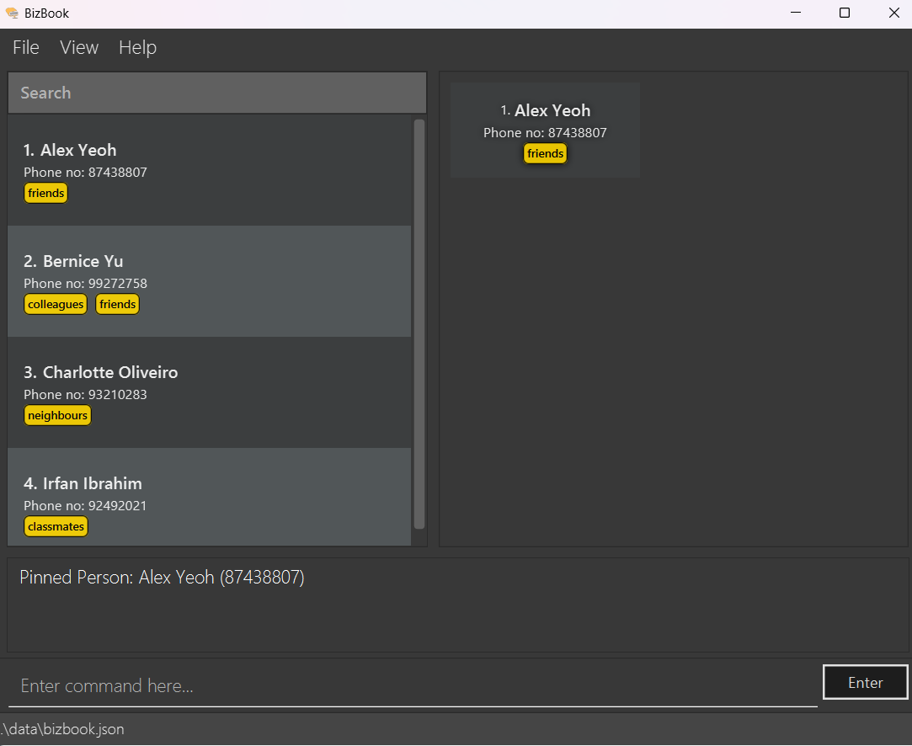

BizBook (BB) is a **desktop app for managing contacts, optimized for use via a Command Line Interface** (CLI) while still having the benefits of a Graphical User Interface (GUI). If you can type fast, BB can get your contact management tasks done faster than traditional GUI apps.

## Table of Contents

1. [Quick start](#quick-start)
2. [Features](#features) 
   2.1 [Viewing help : `help`](#viewing-help--help) 
   2.2 [Adding a person: `add`](#adding-a-person-add) 
   2.3 [Listing all persons : `list`](#listing-all-persons--list) 
   2.4 [Editing a person : `edit`](#editing-a-person--edit) 
   2.5 [Locating persons by name: `find`](#locating-persons-by-name-find) 
   2.6 [Deleting a person : `delete`](#deleting-a-person--delete) 
   2.7 [Delete a tag of an existing contact: `deletetag`](#delete-a-tag-of-an-existing-contact-deletetag) 
   2.8 [Add a note to an existing contact: `addnote`](#add-a-note-to-an-existing-contact-addnote) 
   2.9 [Edit a note of an existing contact: `editnote`](#edit-a-note-of-an-existing-contact-editnote) 
   2.10 [Deleting a note from an existing contact: `deletenote`](#deleting-a-note-from-an-existing-contact-deletenote) 
   2.11 [View an existing contact’s details : `view`](#view-an-existing-contacts-details--view) 
   2.12 [Pin a contact: `pin`](#pin-a-contact-pin) 
   2.13 [Unpin a contact: `unpin`](#unpin-a-contact-unpin) 
   2.14 [Undo a previously executed command: `undo`](#undo-a-previously-executed-command-undo) 
   2.15 [Redo a previously executed undo command: `redo`](#redo-a-previously-executed-undo-command-redo) 
   2.16 [Import a contact list : `import`](#import-a-contact-list--import) 
   2.17 [Export the contact list : `export`](#export-the-contact-list--export) 
   2.19 [Change the application’s theme : `toggle`](#change-the-applications-theme--toggle) 
   2.20 [Clear all entries : `clear`](#clear-all-entries--clear) 
   2.21 [Exit the program : `exit`](#exit-the-program--exit) 
   2.22 [Saving the data](#saving-the-data) 
   2.23 [Editing the data file](#editing-the-data-file) 
3. [FAQ](#faq)
4. [Known issues](#known-issues)
5. [Command summary](#command-summary)

---

## Quick start

1. Ensure you have Java `17` or above installed in your Computer.

2. Download the latest `.jar` file from [here](https://github.com/AY2425S1-CS2103-F10-3/tp/releases).

3. Copy the file to the folder you want to use as the _home folder_ for your BizBook.

4. Open a command terminal, `cd` into the folder you put the jar file in, and use the `java -jar bizbook.jar` command to run the application. 
   A GUI similar to the below should appear in a few seconds. Note how the app contains some sample data. 
   

5. Type the command in the command box and press Enter to execute it. e.g. typing **`help`** and pressing Enter will open the help window. 
   Some example commands you can try:

   - `list` : Lists all contacts.

   - `add n/John Doe p/98765432 e/johnd@example.com a/John street, block 123, #01-01` : Adds a contact named `John Doe` to the Address Book.

   - `delete 3` : Deletes the 3rd contact shown in the current list.

   - `clear` : Deletes all contacts.

   - `exit` : Exits the app.

6. Refer to the [Features](#features) below for more commands and the details of each command.

---

## Features

**:information_source: Notes about the command format:** 

- Words in `UPPER_CASE` are the parameters to be supplied by the user. 
  e.g. in `add n/NAME`, `NAME` is a parameter which can be used as `add n/John Doe`.

- Parameters are composed only of letters. 
  e.g. `n` for the name parameter or `p` for the phone number parameter. Numbers are not valid parameter names.

- Parameters in square brackets are optional. 
  e.g `n/NAME [t/TAG]` can be used as `n/John Doe t/friend` or as `n/John Doe`.

- Parameters with `…`​ after them can be used multiple times including zero times. 
  e.g. `[t/TAG]…​` can be used as ` ` (i.e. 0 times), `t/friend`, `t/friend t/family` etc.

- Parameters can be in any order. 
  e.g. if the command specifies `n/NAME p/PHONE_NUMBER`, `p/PHONE_NUMBER n/NAME` is also acceptable.

- Command keywords are case-insensitive. 
  e.g. `add` and `ADD` are both acceptable.

- Extraneous parameters for commands that do not take in parameters (such as `help`, `list`, `exit` and `clear`) will be ignored. 
  e.g. if the command specifies `help 123`, it will be interpreted as `help`.

- If you are using a PDF version of this document, be careful when copying and pasting commands that span multiple lines as space characters surrounding line-breaks may be omitted when copied over to the application.

### Viewing help : `help`

Shows a table of basic commands and their usage syntax.

At the bottom, a link is provided to the user guide (where you are now!) which explains each command in greater detail.

If the application is unable to open the URL in the system's browser due to OS/browser restrictions, the URL will be
copied to clipboard instead.

Format: `help`

### Adding a person: `add`

Adds a person to the address book.

Format: `add n/NAME p/PHONE_NUMBER e/EMAIL a/ADDRESS [t/TAG]…​`

**Names:**
Names must be alphanumeric and all contacts must have unique names.
Names with symbols like "s/o" and "d/o" will not be allowed. Please write names without these symbols.
Names with additional white spaces in between words will be taken as it is.

The application will throw an error if you attempt to create two users with the same names

**Phone Numbers:**
Only Singapore phone numbers are allowed by the application. Meaning, that only phone numbers starting with the number 6, 8 or 9 and are exactly 8 digits in total is allowed.

:bulb: **Tip:**
A person can have any number of tags (including 0)

- Note that Name, Phone Number, Email and Address are compulsory fields.
- We believe it is reasonable that a customer or business contacts will need to provide these fields as they are not
  particularly sensitive as compared to Identification Number etc.
- The email validation does not check for the presence of a period (.) after the "@" symbol, and it does not verify any specific domain extension. It only ensures that the domain name after the "@" is at least two characters long. E.g. `@u.nus.edu`

Examples:

- `add n/John Doe p/98765432 e/johnd@example.com a/John street, block 123, #01-01`
- `add n/Betsy Crowe t/friend e/betsycrowe@example.com a/Newgate Prison p/1234567 t/criminal`

### Listing all persons : `list`

Shows a list of everyone in the address book.

This is used particularly to undo the effects of a `find` command. A `find` command filters the person list . Running
`list` will result in everyone to be displayed again in the person list.

Format: `list`

### Editing a person : `edit`

Edits an existing person in the address book.

**Caution:**
Keep in mind that names must be alphanumeric and unique.
All constraints from `add` command are the same in the `edit` command.

Format: `edit INDEX [n/NAME] [p/PHONE] [e/EMAIL] [a/ADDRESS] [t/TAG]…​`

- Edits the person at the specified `INDEX`. The index refers to the index number shown in the displayed person list. The index **must be a positive integer** 1, 2, 3, …​
- At least one of the optional fields must be provided.
- Existing values will be updated to the input values.
- When editing tags, the existing tags of the person will be removed i.e adding of tags is not cumulative.
- You can remove all the person’s tags by typing `t/` without
  specifying any tags after it.

Examples:

- `edit 1 p/91234567 e/johndoe@example.com` Edits the phone number and email address of the 1st person to be `91234567` and `johndoe@example.com` respectively.
- `edit 2 n/Betsy Crower t/` Edits the name of the 2nd person to be `Betsy Crower` and clears all existing tags.

### Locating persons by name: `find`

Finds persons whose names contain any of the given keywords.

Format: `find KEYWORD [MORE_KEYWORDS]`

- The search is case-insensitive. e.g `hans` will match `Hans`
- The order of the keywords does not matter. e.g. `Hans Bo` will match `Bo Hans`
- Only the name is searched.
- Partial words will be matched e.g. `Han` will match `Hans`
- Persons matching at least one keyword will be returned (i.e. `OR` search).
  e.g. `Hans Bo` will return `Hans Gruber`, `Bo Yang`

Examples:

- `find John` returns `john`, `John Doe` and `Johnny`
- `find alex david` returns `Alex Yeoh`, `David Li` 

**Result from `find alex david`:**

### Deleting a person : `delete`

Deletes the specified person from the address book.

Format: `delete INDEX`

- Deletes the person at the specified `INDEX`.
- The index refers to the index number shown in the displayed person list.
- The index **must be a positive integer** 1, 2, 3, …​

Examples:

- `list` followed by `delete 2` deletes the 2nd person in the address book.
- `find Betsy` followed by `delete 1` deletes the 1st person in the results of the `find` command.

### Delete a tag of an existing contact: `deletetag`

Deletes a tag from a person in the address book.

Format: `deletetag INDEX t/TAG`

- Deletes the `TAG` for the person at the specified `INDEX`.
- The index refers to the index number shown in the displayed person list.
- The index **must be a positive integer** 1, 2, 3, …​
- The tag **must be a existing tag** on the person.

Examples:

- `deletetag 1 t/friends` will delete the tag `friends` from the first person in the person list.
- `deletetag 2 t/Client` will delete the tag `Client` from the second person shown in the person list.

### Add a note to an existing contact: `addnote`

Adds a note to a person in the address book.

A contact's notes can be viewed by clicking on the contact in the person list.

Format: `addnote INDEX n/NOTE`

:bulb: **Note:**
A person can have any number of notes (including 0)

- Add note to the person at the specified `INDEX`.
- The index refers to the index number shown in the displayed person list.
- The index **must be a positive integer** 1, 2, 3, …​
- The note must be comprised of alphanumeric characters or spaces.
- Duplicate notes are not allowed. E.g. `High profile client` is treated the same as `high profile client`
- Notes are stored as case-sensitive but are case-insensitive when duplicate check is done.
- Only one note may be added at a time. E.g. `addnote 1 n/High profile client`. If `addnote 1 n/Supplier 1 n/Supplier 2`
  is input, only the far right note will be added. If one wishes to add notes quicker, he/she may simply use the up-arrow
  feature to quickly re-enter the command as it requires fewer keystrokes than typing an additional `n/`.

Examples:

- `addnote 1 n/Supplier 1`
- `addnote 2 n/Supplier 2`

### Edit a note of an existing contact: `editnote`

Edits a note of a person in the address book.

Format: `editnote INDEX i/NOTE_INDEX n/NOTE`

- Edits the note at the specified `NOTE_INDEX` of the person at the specified `INDEX`.
- The index (i.e. `INDEX`) refers to the index number shown in the displayed person list.
- The note index (i.e. `NOTE_INDEX`) refers to the index number shown in the notes list of the contact details of the
  displayed person.
- The index and note index **must be positive integers** 1, 2, 3, …​
- The note must be comprised of alphanumeric characters or spaces.
- Duplicate notes are not allowed. E.g. `High profile client` is treated the same as `high profile client`
- Notes are stored as case-sensitive but are case-insensitive when duplicate check is done.
- Only one note may be edited in each command. The behaviour is similar to that of `addnote`.

Examples:

- `editnote 1 i/1 n/Customer 1`
- `editnote 2 i/1 n/Customer 2`

### Deleting a note from an existing contact: `deletenote`

Deletes a note from a person in the address book.

Format: `deletenote INDEX i/NOTE_INDEX`

- Delete a note from the person at the specified `INDEX` and specified `NOTE_INDEX`.
- The index (i.e. `INDEX`) refers to the index number shown in the displayed person list.
- The note index (i.e. `NOTE_INDEX`) refers to the index number shown in the notes list of the contact details of the
  displayed person.
- The index and note index **must be positive integers** 1, 2, 3, …​
- Only one note may be deleted in each command. The behaviour is similar to that of `addnote`.

Examples:

- `deletenote 1 i/1`
- `deletenote 2 i/2`

### View an existing contact's details : `view`

Views the details of a person in the address book.

Format: `view INDEX`

- Views the details of the person at the specified `INDEX`.
- The index refers to the index number shown in the displayed person list.
- The index **must be a positive integer** 1, 2, 3, ...
- The index **must be within the range** shown on the displayed person list.

Examples:

- `view 1` shows the contact details of the first person shown on the displayed person list.
- `view 3`

**Result from `view 3`:**

### Pin a contact: `pin`

Pins the contact of a person into a dedicated panel.

Format: `pin INDEX`

- Pin the contact of the person at the specified `INDEX`.
- The index refers to the index number shown in the displayed person list, not the pinned list.
- The index **must be a positive integer** 1, 2, 3, ...
- The index **must be within the range** shown on the displayed person list.

Examples:

- `pin 1` pins the contact of the first person shown on the displayed person list into the pinned person list.

**Result from `pin 1`:**

### Unpin a contact: `unpin`

Unpins the contact of a person from the pinned list.

Format: `unpin INDEX`

- Unpin the contact of the person at the specified `INDEX`.
- The index refers to the index number shown in the pinned list, not the displayed person list.
- The index **must be a positive integer** 1, 2, 3, ...
- The index **must be within the range** shown on the pinned list.

Examples:

- `unpin 1` unpins the contact of the first person shown on the pinned person list.

**State before`unpin 1`:**

**State after `unpin 1`:**

### Undo a previously executed command: `undo`

Undoes the previous command that was executed.

Format: `undo`

- The undo feature saves the **5 most recent executed commands**.
- The undo feature only tracks commands that **modifies the address book**.
- The undo feature will clear the focus person panel upon execution.

Examples of commands tracked by undo:

- `add`
- `delete`
- `clear`
- `edit`
- `pin`

### Redo a previously executed undo command: `redo`

Redoes the previous undo command that was executed.

Format: `redo`

- The redo feature saves the **5 most recent executed undo commands**.
- The redo feature only tracks changed made by the undo command
- The redo feature will clear the focus person panel upon execution.

### Import a contact list : `import`

Imports a file containing contacts from a specified file type and overwrites all
existing contacts with the imported data.

Format: `import f/FILETYPE p/PATH`

- Imports the contact list from the specified `FILETYPE`.
- The only supported file type currently is **`vcf`**.
- Support for paths that contain spaces are limited. In particular, if your path contains a space and an f ` f`, this
  may affect how the application parses the path. Instead, rename your folder and remove the spaces.

Examples:

- `import f/vcf p/bizbook.vcf` imports the contacts from the file `bizbook.vcf` that is located in the same folder as
  this application.
- `import f/vcf p//Users/Name/myAddress.vcf` imports the contacts from the file located at `/Users/Name/myAddress.vcf`

### Export the contact list : `export`

Exports the contacts in the contact list into the specified file type. The file will be named bizbook.&lt;file
extension&gt; and will be located in the folder `exports`.

Format: `export f/FILETYPE`

- Exports the contact list into the specified `FILETYPE`.
- The file type must be **either `csv` or `vcf`**.

Examples:

- `export f/csv` exports the contact list into a csv file.
- `export f/vcf` exports the contact list into a vcf file.

### Change the application's theme : `toggle`

Changes the application theme from light to dark or from dark to light.

Format: `toggle`

- If application is currently in light mode, toggle command will set it to dark mode.
- If application is currently in dark mode, toggle command will set it to light mode.
- Please note that our application does not save your theme preference, so it will always open in dark mode by default.

Examples:

- `toggle` changes the application theme.

**GUI in light mode:**

**GUI in dark mode:**

### Navigating Command History :

Easily cycle through your previous **successfully executed** commands by using the Up and Down arrow keys on your keyboard.

Format: the Up and down arrow key on your **keyboard**

- Up Arrow: Pressing the Up arrow key allows you to scroll backward through your command history, one command at a time.
- Down Arrow: Pressing the Down arrow key moves forward through your command history, allowing you to revisit more recent commands.

### Clear all entries : `clear`

Clears all entries from the address book.

Format: `clear`

### Exit the program : `exit`

Exits the program.

Format: `exit`

### Saving the data

BizBook data are saved in the hard disk automatically after any command that changes the data. There is no need to save manually.

### Editing the data file

BizBook data are saved automatically as a JSON file `[JAR file location]/data/bizbook.json`. Advanced users are welcome to update data directly by editing that data file.

:exclamation: **Caution:**
If your changes to the data file makes its format invalid, BizBook will discard all data and start with an empty data file at the next run. Hence, it is recommended to take a backup of the file before editing it. 
Furthermore, certain edits can cause BizBook to behave in unexpected ways (e.g., if a value entered is outside the acceptable range). Therefore, edit the data file only if you are confident that you can update it correctly.

---

## FAQ

**Q**: How do I transfer my data to another Computer? 
**A**: There are 2 ways to transfer data.

1. If you want to use the `.json` file generated by BizBook, install the app in another computer and overwrite the data folder located at `[JAR file location]/data` with the file that contains the data from your previous BizBook home folder.
2. If you want to import using a `.vcf` file, export the data using the `export` command in BizBook, i.e. `export f/vcf`. The `.vcf` file will be located in a folder at `[JAR file location]/export/bizbook.vcf`. You can rename and transfer this file to other devices using BizBook and to import the data use the `import` command, i.e. `import f/vcf p/[Path to the VCF file]/<file name>.vcf`. Also do note that **user preferences will not be transferred over**.

---

## Known issues

1. **When using multiple screens**, if you move the application to a secondary screen, and later switch to using only the primary screen, the GUI will open off-screen. The remedy is to delete the `preferences.json` file created by the application before running the application again.
2. **If you minimize the Help Window** and then run the `help` command (or use the `Help` menu, or the keyboard shortcut `F1`) again, the original Help Window will remain minimized, and no new Help Window will appear. The remedy is to manually restore the minimized Help Window.
3. **When you have extremely long tags**, the UI will not be able to display your tags properly. Text may not wrap, it may cause some parts to have scroll bars. Please avoid using excessive or really long tag names.
4. **Only one note may be added at a time**. E.g. `addnote 1 n/High profile client`. If `addnote 1 n/Supplier 1 n/Supplier 2`
   is input, only the far right note will be added. If one wishes to add notes quicker, he/she may simply use the up-arrow
   feature to quickly re-enter the command as it requires fewer keystrokes than typing an additional `n/`.
5. **Maximum number of items**, the maximum number of items (contacts, notes, tags, etc.) in this application is 2147483647. If you enter a number larger than this, the program may behave unexpectedly. However, it is unlikely that you will ever have so many contacts or tags of one contact.
6. **Contact name is a unique identifier**, this application uses the name of a contact as the unique identifier. This means that it cannot accept two of the same names in the application. Instead, consider adding the surname, use full names or, if really needed, adding numbers at the back of the name to distinguish different people.
7. **Contact names are alphanumeric**, this application only allows users to enter alphanumeric names. This means that names that include "s/o" or "d/o" are not allowed. Alternatively, consider using "so", "do" or "son of" as a replacement.
8. **Notes are alphanumeric**, similar to contact name, the notes does not allow special characters.
9. **Once selected, a person can't be unselected**, from either the contact list or pinned panel.
10. **Notes with very long content will trail off with `...`**, instead of wrapping the text and displaying the hidden content on the next line.

---

## Command summary

| Action              | Format, Examples                                                                                                                                                      |
| ------------------- | --------------------------------------------------------------------------------------------------------------------------------------------------------------------- |
| **Add**             | `add n/NAME p/PHONE_NUMBER e/EMAIL a/ADDRESS [t/TAG]…​`   e.g., `add n/James Ho p/22224444 e/jamesho@example.com a/123, Clementi Rd, 1234665 t/friend t/colleague` |
| **List**            | `list`                                                                                                                                                                |
| **Edit**            | `edit INDEX [n/NAME] [p/PHONE_NUMBER] [e/EMAIL] [a/ADDRESS] [t/TAG]…​`  e.g.,`edit 2 n/James Lee e/jameslee@example.com`                                           |
| **Find**            | `find KEYWORD [MORE_KEYWORDS]`  e.g., `find James Jake`                                                                                                            |
| **Delete**          | `delete INDEX`  e.g., `delete 3`                                                                                                                                   |
| **Deletetag**       | `deletetag INDEX t/TAG`   e.g. `deletetag 1 t/Client`                                                                                                              |
| **Addnote**         | `addnote INDEX n/NOTE`   e.g. `addnote 1 n/Customer 1`                                                                                                             |
| **Editnote**        | `editnote INDEX i/NOTE_INDEX n/NOTE`   e.g. `editnote 1 i/1 n/Customer 1`                                                                                          |
| **Deletenote**      | `deletenote INDEX i/NOTE_INDEX`   e.g. `deletenote 1 i/1`                                                                                                          |
| **View**            | `view INDEX`   e.g. `view 1`                                                                                                                                       |
| **Pin**             | `pin INDEX`   e.g. `pin 1`                                                                                                                                         |
| **Unpin**           | `unpin INDEX`   e.g. `unpin 1`                                                                                                                                     |
| **Undo**            | `undo`                                                                                                                                                                |
| **Redo**            | `redo`                                                                                                                                                                |
| **Toggle**          | `toggle`                                                                                                                                                              |
| **Export**          | `export f/FILETYPE`   e.g. `export f/csv`                                                                                                                          |
| **Import**          | `import f/FILETYPE p/PATH`   e.g. `import f/vcf p/myVcf.vcf`                                                                                                       |
| **Command History** | `up & down arrow keys` (only for successfully executed commands)                                                                                                      |
| **Clear**           | `clear`                                                                                                                                                               |
| **Help**            | `help`                                                                                                                                                                |
