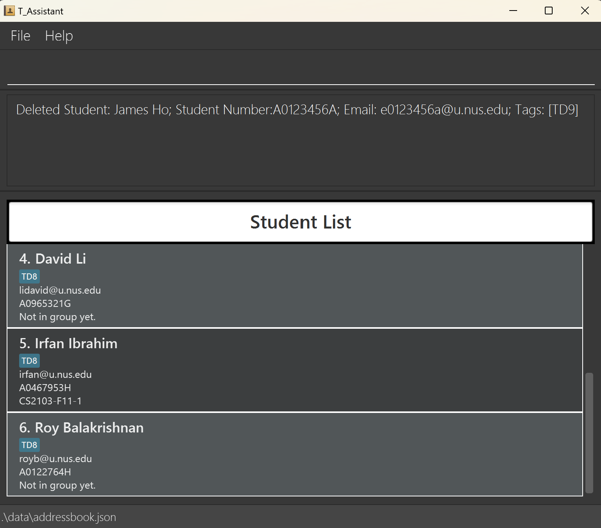
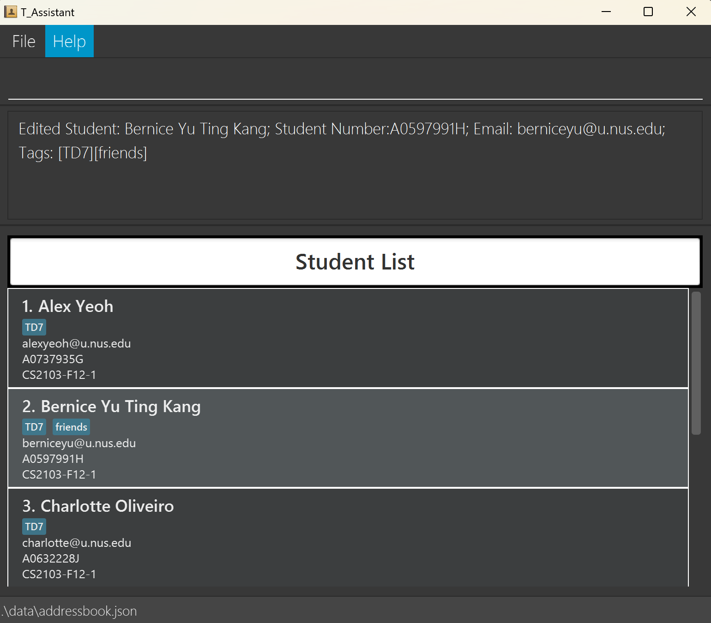
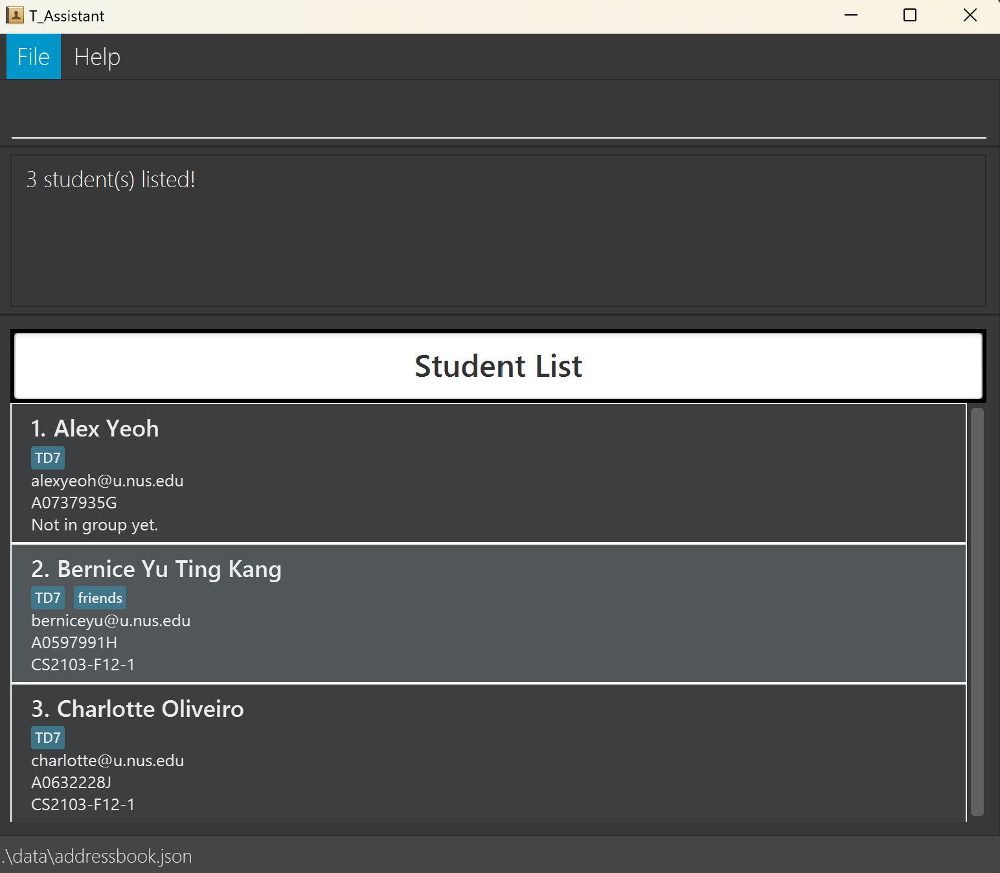
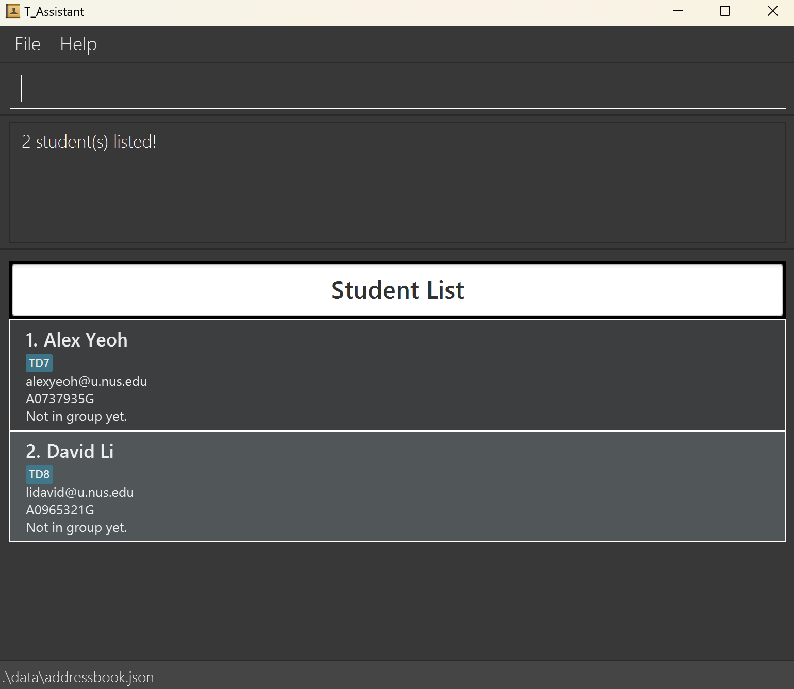
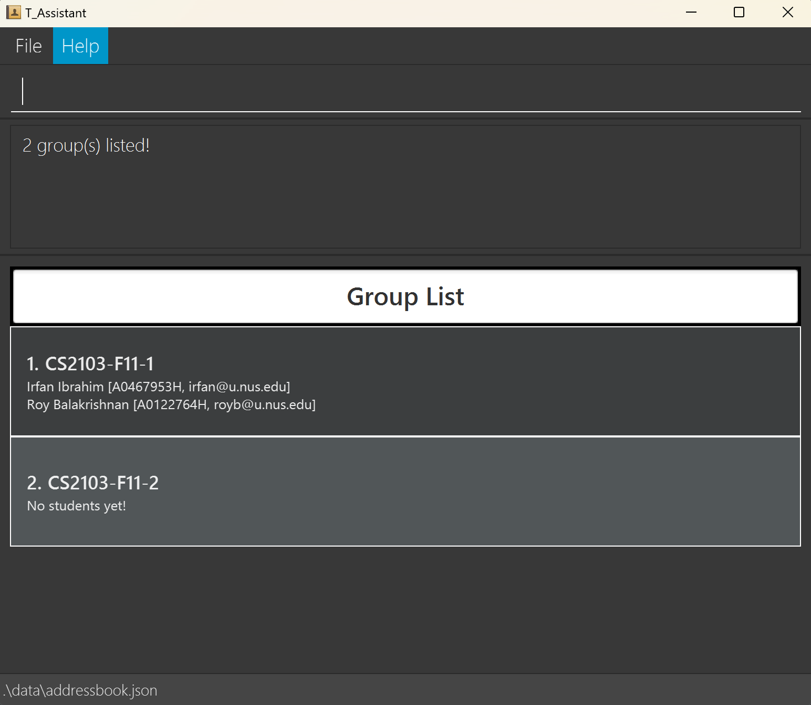

# T_Assistant User Guide

T_Assistant is a **desktop app for CS2103 tutors managing their students, groups and tasks** optimized for use via a
Line Interface (CLI) while still having the benefits of a Graphical User Interface (GUI).

If you can type fast, T_Assistant can get your contact management tasks done faster than traditional GUI apps.

## Navigation

For easy navigation, you can use the navigation breadcrumb on the right side of the website.

If you are on the PDF, use the table of contents below to navigate the site.

<!-- * Table of Contents -->
<page-nav-print />

--------------------------------------------------------------------------------------------------------------------

## Quick start

1. Ensure you have Java `17` or above installed in your Computer.

1. Download the latest `.jar` file from [here](https://github.com/AY2425S1-CS2103-F12-2/tp/releases).

1. Copy the file to the folder you want to use as the _home folder_ for your T_Assistant.

1. Open a command terminal, `cd` into the folder you put the jar file in, and use the `java -jar t_assistant.jar`
   command to run the application. 
   *A GUI similar to the below should appear in a few seconds. Note how the app contains some sample data.* 
   

1. Type the command in the command box and press Enter to execute it. e.g. typing **`help`** and pressing Enter will
   open the help window. 
   Some example commands you can try:

    * `list_s` : Lists all students.

    * `as sno/A0123456A sn/James Ho e/e0123456A@u.nus.edu t/TD9` : Adds a student named `James Ho`
      to T_Assistant.

    * `undo` : Undo the last command ran.

    * `clear` : Deletes all contacts.

    * `exit` : Exits the app.

1. Refer to the [Features](#features) below for details of each command.

--------------------------------------------------------------------------------------------------------------------

## Features

<box type="info" seamless>

**Notes about the command format:** 

* Command words are **case-insensitive**! 
  `add_s ...` and `ADD_S ...` will both be recognised as commands to add a new student.

* Command words come with **shorthands**  
  e.g. `add_s...` and `as...` will both be recognised as commands to add a new student.
* Prefixes are **case-sensitive**! 
  e.g. `i/INDEX` will be recognised but `I/INDEX` will not be recognised.

* Words in `UPPER_CASE` are the parameters to be supplied by the user. 
  e.g. in `as sn/STUDENT_NAME`, `STUDENT_NAME` is a parameter which can be used as `as sn/John Doe`.

* Items in square brackets are **optional**. 
  e.g `sn/STUDENT_NAME [t/TAG]` can be used as `sn/John Doe t/TD9` or as `sn/John Doe`.

* Items with `…`​ after them can **be used multiple times including zero times**. 
  e.g. `[t/TAG]…​` can be used as ` ` (i.e. 0 times), `t/TD9`, `t/GoodatUI t/TeamLead` etc.

* Parameters can be in **any order**. 
  e.g. if the command specifies `sno/STUDENT_NUMBER sn/STUDENT_NAME`, `sn/STUDENT_NAME sno/STUDENT_NUMBER` is also
  acceptable.

* Extraneous parameters for commands that **do not take in parameters** (such as `help`, `list`, `exit` and `clear`)
  will be **ignored**. 
  e.g. if the command specifies `help 123`, it will be interpreted as `help`.

* Extraneous parameters for commands that **do take in parameters** (such as `add_s`, `del_s`) will be recognised as
  *invalid* input parameters. 
  e.g. if the command specifies `del_t i/1 gn/CS2103-1-1`, it will be interpreted as a invalid command structure.

**Important**

* If you are using a PDF version of this document, be careful when copying and pasting commands that span multiple lines
  as space characters surrounding line-breaks may be omitted when copied over to the application.
  </box>

--------------------------------------------------------------------------------------------------------------------

### Student Commands

--------------------------------------------------------------------------------------------------------------------

#### Listing Students: `list_s`, `ls`

Shows a list of all students in the T_Assistant.

**Format**: `list_s`

This screenshot shows the result of executing `list_s`.

--------------------------------------------------------------------------------------------------------------------

#### Adding a Student: `add_s`, `as`

Adds a student to T_Assistant.

**Format**: `add_s/as sno/STUDENT_NUMBER sn/STUDENT_NAME e/EMAIL [t/TAG]...`

##### Notes

1. `Student Number` is the unique identifier for each student, so no 2 students can have the same student number.
2. `Tags` are case-insensitive, so `T1` and `t1` will be recognised as the same tags. T_Assistant will add the first
   instance of the repeated tag.
3. For information on the constraints for each parameter used in this command, go
   to [Command Parameters](#command-parameters).

##### Usage Scenario

###### Scenario #1: Adding `James Ho` to T_Assistant

1. You can begin this command on any panel.
2. Type and execute: `add_s sno/A0123456A sn/James Ho e/e0123456A@u.nus.edu t/TD9`

This screenshot shows the result of executing `add_s sno/A0123456A sn/James Ho e/e0123456A@u.nus.edu t/TD9`.

--------------------------------------------------------------------------------------------------------------------

#### Deleting a Student: `del_s`, `ds`

Deletes a student from T_Assistant.

**Format**: `del_s sno/STUDENT_NUMBER`

##### Notes

1. A student with the `Student Number` must exist in T_Assistant.
2. For information on the constraints for each parameter used in this command, go
   to [Command Parameters](#command-parameters).

##### Usage Scenario

###### Scenario #1: Deleting `James Ho` from T_Assistant

1. You can begin this command on any panel.
2. Type and execute: `del_s sno/A0123456A`

This screenshot shows the result of executing `del_s sno/A0123456A`.

--------------------------------------------------------------------------------------------------------------------

#### Editing a Student: `edit_s`, `es`

Edits the details of a student.

**Format**: `edit_s i/INDEX [sn/NAME] [e/EMAIL] [t/TAG]...`

##### Notes

1. `edit_s` edits the student identified by the index. It only accepts a valid index
   based on the list when `list_s` is called.
2. Tags are replaced if included in the argument, not appended.
3. Tags are removed by entering `t/` without specifying any tags after it.
4. For information on the constraints for each parameter used in this command, go
   to [Command Parameters](#command-parameters).

##### Usage Scenario

###### Scenario #1: Editing `Bernice Yu`'s Name

1. You can begin this command on any panel.
2. Type and execute: `edit_s i/2 sn/Bernice Yu Ting Kang`

This screenshot shows the result of executing `edit_s i/2 sn/Bernice Yu Ting Kang`.

--------------------------------------------------------------------------------------------------------------------

#### Adding a Student to a Group: `add_s_g`, `asg`

Adds student(s) to a group.

**Format**: `add_s_g sno/STUDENT_NUMBER [sno/STUDENT_NUMBER]... gn/GROUP_NAME`

##### Notes

1. The group with the `Group Name` and student(s) with the `Student Number`(s) must both exist in T_Assistant.
2. For information on the constraints for each parameter used in this command, go
   to [Command Parameters](#command-parameters).

##### Usage Scenario

###### Scenario #1: Adding `James Ho` to `CS2103-F11-1`

1. You can begin this command on any panel.
2. Type and execute: `add_s_g sno/A0123456A gn/CS2103-F11-1`

This screenshot shows the result of executing `add_s_g sno/A0123456A gn/CS2103-F11-1`.

--------------------------------------------------------------------------------------------------------------------

#### Deleting a Student from a Group: `del_s_g`, `dsg`

Deletes a student from its assigned group.

**Format**: `del_s_g sno/STUDENT_NUMBER`

##### Notes

1. This feature only removes a student from a group, not from T_Assistant.
2. The student must exist in T_Assistant and be in a group.
3. For information on the constraints for each parameter used in this command, go
   to [Command Parameters](#command-parameters).

##### Usage Scenario

###### Scenario #1: Deleting `James Ho` from `CS2103-F11-1`

1. You can begin this command on any panel.
2. Type and execute: `del_s_g sno/A0123456A`

This screenshot shows the result of executing `del_s_g sno/A0123456A`.

--------------------------------------------------------------------------------------------------------------------

#### Finding Students: `find_s`, `fs`

Searches T_Assistant for students with fields that match the search query.

**Format**: `find_s q/QUERY [q/QUERY]...`

##### Notes

1. The command will only match full words. You may search for part of a person's name such as `Doe` to find `John Doe`.
   > i.e. `Do` will not match `Doe` and `berniceyu` will not match `berniceyu@u.nus.edu`

2. Searches the following fields that a student has that matches the query:

    * Student name
    * Student number
    * Email
    * Group name
        * **Bonus:** If you wish to filter for students with no groups, use the following command: `find_s q/!nogroup`
      > `!nogroup` is a special query that searches for students with no groups, it is also case-insensitive.

<box type="info" seamless>
Take note that if any other student with a group happens to have a field that matches the special keyword, they will also appear in the results.
</box>

2. For information on the constraints for each parameter used in this command, go
   to [Command Parameters](#command-parameters).

##### Usage Scenario

###### Scenario #1: Find students with the following queries - `TD7` and `Oliveiro`

1. You can begin this command on any panel.
2. Type and execute: `find_s q/TD7 q/Olveiro`

This screenshot shows the result of executing `find_s q/TD7 q/Olveiro`.

###### Scenario #2: Find students with no groups

1. You can begin this command on any panel.
2. Type and execute: `find_s q/!nogroup`

This screenshot shows the result of executing `find_s q/!nogroup`.

--------------------------------------------------------------------------------------------------------------------

#### Sorting Students: `sort_s`, `ss`

Sorts the list of students in alphabetical order.

**Format**: `sort_s`

This screenshot shows the result of executing `sort_s`.

--------------------------------------------------------------------------------------------------------------------

### Group Commands

--------------------------------------------------------------------------------------------------------------------

#### Listing Groups: `list_g`, `lg`

Shows a list of all groups in the T_Assistant.

**Format**: `list_g`

This screenshot shows the result of executing `list_g`.

--------------------------------------------------------------------------------------------------------------------

#### Adding a Group: `add_g`, `ag`

Adds a group to the T_Assistant。

**Format**: `add_g/ag gn/GROUP_NAME [gn/GROUP_NAME]...`

##### Notes

1. `Group Name` is the unique identifier for each group, so no 2 groups can have the same group name.
2. Group names must follow a three-part format: course type: either `CS2103` or `CS2103T`;
tutorial group: a letter followed by a number;
group number: any number
2. For information on the constraints for each parameter used in this command, go
   to [Command Parameters](#command-parameters).

<box type="warning" seamless>

**Caution:**
The command will stop running the moment it hits an error.

For example `add_g gn/CS2103-F11-3`

</box>

##### Usage Scenario

###### Scenario #1
1. You can begin this command on any panel.
2. Type and execute: `add_g gn/CS2103-F11-3`

This screenshot shows the result of executing `add_g gn/CS2103-F11-3`.

--------------------------------------------------------------------------------------------------------------------

#### Deleting a Group: `del_g`, `dg`

Deletes the specified group from T_Assistant.

**Format**: `del_g gn/GROUP_NAME`

##### Notes

1. This command is case-insensitive.
   > `del_g gn/CS2103-F12-2` and `del_g gn/cs2103-f12-2` will delete the same group.
2. This command will also remove students from the deleted group.
3. For information on the constraints for each parameter used in this command, go
   to [Command Parameters](#command-parameters).

##### Usage Scenario

###### Scenario #1: Deleting a group `CS2103-F12-2`

1. Type and execute: `list_g` to see the list of groups.
2. After finding `CS2103-F12-2`, type and execute: `del_g gn/CS2103-F12-2`

This screenshot shows the result of executing `del_g gn/CS2103-F12-2`.

--------------------------------------------------------------------------------------------------------------------

#### Editing a Group: `edit_g`, `eg`

Explanation of what command does.

**Format**: `edit_g i/INDEX gn/GROUP_NAME`

##### Notes

1. Are there anything that the command cannot do (e.g. cannot change Student Number) or what does it impact (e.g. will
   remove all students from this deleted group)
2. For information on the constraints for each parameter used in this command, go
   to [Command Parameters](#command-parameters).

##### Usage Scenario (for commands that can be overloaded)

Add more scenarios if necessary

###### Scenario #1

This screenshot shows the result of executing `edit_g i/1 gn/CS2103-F12-3`.

--------------------------------------------------------------------------------------------------------------------

#### Finding Groups: `find_g`, `fg`

Searches T_Assistant for groups with fields that match the search query.

**Format**: `find_g q/QUERY [q/QUERY]...`

##### Notes

1. This command is case-insensitive.
2. The command will match substrings. You may search for part of a group's name such as `F12` to find `CS2103T-F12-10`.
3. Searches the following field that a group has that matches the query:
    * Group name
4. For information on the constraints for each parameter used in this command, go
   to [Command Parameters](#command-parameters).

##### Usage Scenario

###### Scenario #1: Find groups with the following query - `F12`

1. You can begin this command on any panel.
2. Type and execute: `find_g q/F12`

This screenshot shows the result of executing `find_g q/F12`.

--------------------------------------------------------------------------------------------------------------------

#### Sorting Groups: `sort_g`, `sg`

Sorts the list of groups in alphabetical order.

**Format**: `sort_g`

This screenshot shows the result of executing `sort_s`.

--------------------------------------------------------------------------------------------------------------------

### Task Commands

--------------------------------------------------------------------------------------------------------------------

#### Listing Tasks: `list_t`, `lt`

Shows a list of all tasks in the T_Assistant.

**Format**: `list_t [gn/GROUP_NAME]`

This screenshot shows the result of executing `list_t`.

--------------------------------------------------------------------------------------------------------------------

#### Adding a Task to a Group: `add_t_g`, `atg`

Adds a task to a group or multiple groups.

**Format**: `add_t_g tn/TASK_NAME td/TASK_DEADLINE (YYYY-MM-DD HHmm) gn/GROUP_NAME [gn/GROUP_NAME]...`

##### Notes

1. This command allows only the addition of a single task to one or multiple groups at the same time.
2. The group name inputs are case-insensitive. `cs2103-f11-1` will yield the same result as `CS2103-F11-1`.
3. This command is relatively flexible in terms of the input parameters. You can input duplicate group names. 
   The application simply ignores the duplicates and adds the task to the desired group.
4. The command checks for the existence of the task, hence you cannot input a task which already exists. A task is 
   equal to another task when it has the same task name and deadline as it.
5. For information on the constraints for each parameter used in this command, go
   to [Command Parameters](#command-parameters).

##### Usage Scenario

###### Scenario #1: Adding a task with the name of `Do Homework` and deadline of `2024-12-10 1900` to groups
`CS2103-F12-2` and `CS2103-F11-1`. This is the default scenario where the task does not already exist and both 
groups exist. 

1. You can begin this command on any panel.
2. Type `add_t_g tn/Do Homework td/2024-12-10 1900 gn/CS2103-F12-2 gn/CS2103-F11-1`.

This screenshot shows the result of executing `add_t_g tn/Do Homework td/2024-12-10 1900 gn/CS2103-F12-2 gn/CS2103-F11-1`.

###### Scenario #2: Adding a task with the name of `Do Homework` and deadline of `2024-12-10 1900` to groups
`CS2103-F12-2` and `CS2103-F11-1` when `Do Homework` already exists.

1. You can begin this command on any panel.
2. Type `add_t_g tn/Do Homework td/2024-12-10 1900 gn/CS2103-F12-2 gn/CS2103-F11-1`.
3. This will yield an error message.

This screenshot shows the result of executing `add_t_g tn/Do Homework td/2024-12-10 1900 gn/CS2103-F12-2 gn/CS2103-F11-1`.

###### Scenario #3: Adding a task with the name of `Do Homework` and deadline of `2024-12-10 1900` to groups
`CS2103-F13-2` and `CS2103-F11-1` when `CS2103-F13-1` does not exist.

1. You can begin this command on any panel.
2. Type `add_t_g tn/Do Homework td/2024-12-10 1900 gn/CS2103-F13-2 gn/CS2103-F11-1`.
3. Since `CS2103-F11-1` exists, the command will still allow you to add the task into the group. However, it will display
   an additional warning message regarding the input `CS2103-F13-1` which does not exist.

This screenshot shows the result of executing `add_t_g tn/Do Homework td/2024-12-10 1900 gn/CS2103-F13-2 gn/CS2103-F11-1`.

###### Scenario #4: Adding a task with the name of `Do Homework` and deadline of `2024-12-10 1900` to groups
`CS2103-F13-2` and `CS2103-F14-1` when both groups do not exist.

1. You can begin this command on any panel.
2. Type `add_t_g tn/Do Homework td/2024-12-10 1900 gn/CS2103-F13-2 gn/CS2103-F14-1`.
3. Now, the command should throw an error message because both groups are non-existent.

This screenshot shows the result of executing `add_t_g tn/Do Homework td/2024-12-10 1900 gn/CS2103-F13-2 gn/CS2103-F14-1`.

##### Scenario #5: Adding a task with the name of `Do Homework` and deadline of `2024-12-10 1900` to groups
`CS2103-F12-1` and `CS2103-F12-1` when the group exists.

1. You can begin this command on any panel.
2. Type `add_t_g tn/Do Homework td/2024-12-10 1900 gn/CS2103-F12-1 gn/CS2103-F12-1`.
3. The command functionally ignores the duplicates and add the task into the group specified. It will also display a 
   warning message to you.

This screenshot shows the result of executing `add_t_g tn/Do Homework td/2024-12-10 1900 gn/CS2103-F12-1 gn/CS2103-F12-1`.

##### Scenario #6: Adding a task with the name of `Do Homework` and deadline of `2024-12-10 1900` to groups
`CS2103-F14-1` and `CS2103-F14-1` when the group does not exist.

1. You can begin this command on any panel.
2. Type `add_t_g tn/Do Homework td/2024-12-10 1900 gn/CS2103-F12-1 gn/CS2103-F12-1`.
3. The command should yield an error message.

This screenshot shows the result of executing `add_t_g tn/Do Homework td/2024-12-10 1900 gn/CS2103-F14-1 gn/CS2103-F14-1`.

--------------------------------------------------------------------------------------------------------------------

#### Adding a Task to ALL Groups: `add_t`, `at`

Adds a task to all groups.

**Format**: `add_t tn/TASK_NAME td/TASK_DEADLINE (YYYY-MM-DD HHmm)`

##### Notes

1. If the task specified already exists in some groups, it will be added to all other groups.
2. For information on the constraints for each parameter used in this command, go
   to [Command Parameters](#command-parameters).

##### Usage Scenario

###### Scenario #1: Executing `add_t tn/Submit Postmortem td/2024-10-20 1800`
1. The task will be added to all groups.

###### Scenario #2: Executing `add_t tn/Submit Postmortem td/2024-10-20`
1. An error message will be shown because the task deadline has an incorrect format.

This screenshot shows the result of executing `add_t tn/Submit Postmortem td/2024-10-20 1800`.

--------------------------------------------------------------------------------------------------------------------

#### Adding an Existing Task to a Group: `add_et_g`, `aetg`

Adds an existing task to the groups specified.

**Format**: `add_et_g i/INDEX gn/GROUP_NAME [gn/GROUP_NAME]...`

##### Notes

1. This command is case-insensitive.
   > `gn/CS2103-F12-2` and `gn/cs2103-f12-2` will be recognised as the same group.
2. You can add an existing task to multiple groups.
3. For information on the constraints for each parameter used in this command, go
   to [Command Parameters](#command-parameters).

<box type="warning" seamless>

**Caution:**
The command will stop running the moment it hits an error.

For example `add_et_g i/1 gn/CS2103-F11-2 gn/CS2103-F12-2 gn/CS2103-F13-1`

If the group `CS2103-F12-2` already has the task. The command will only add the task to `CS2103-F11-2` and not
`CS2103-F13-1`.

</box>

##### Usage Scenario

###### Scenario #1: Add task with index `1` to `CS2103-S1-21`

1. Type and execute: `list_t` to see the list of tasks.
2. After finding the task you wish to add, remember its index number (task with index 1 in this example).
3. You may wish to execute `list_g` to check on the names of groups you wish to add the task to.
4. Type and execute: `add_et_g i/1 gn/CS2103-S1-21`

This screenshot shows the result of executing `add_et_g i/1 gn/CS2103-S1-21`.

###### Scenario #2: Add task that is already in a group

1. Type and execute: `list_t` to see the list of tasks.
2. After finding the task you wish to add, remember its index number (task with index 1 in this example).
3. You may wish to execute `list_g` to check on the names of groups you wish to add the task to.
4. Type and execute: `add_et_g i/1 gn/CS2103-S1-21`
5. You will get an error message.

This screenshot shows the result of executing `add_et_g i/1 gn/CS2103-S1-21`.

--------------------------------------------------------------------------------------------------------------------

#### Deleting a Task from a Group: `del_t_g`, `dtg`

Deletes a task from a group.

**Format**: `del_t_g i/INDEX gn/GROUP_NAME`

##### Notes

1. The index must be valid and should be the index of target task in the group's task list.
2. This command is case-insensitive.
   > `gn/CS2103-F12-2` and `gn/cs2103-f12-2` will be recognised as the same group.
3. For information on the constraints for each parameter used in this command, go
   to [Command Parameters](#command-parameters).

##### Usage Scenario
1. Type and execute: `list_t gn/CS2103-F11-1` to see the list of tasks in `CS2103-F11-1`.
2. After finding the task you wish to delete from this group, remember its index number (task with index 1 in this example).
3. Type and execute: `del_t_g i/1 gn/CS2103-S1-21`
###### Scenario #1 Delete task with index 1 from `CS2103-F11-1`

This screenshot shows the result of executing `del_t_g i/1 gn/CS2103-F11-1`.

--------------------------------------------------------------------------------------------------------------------

#### Deleting a Task from ALL Groups: `del_t`, `dt`

Delete a task from all groups that contain it.

**Format**: `del_t i/INDEX`

##### Notes

1. The index must be valid and should be the index of task list.
2. For information on the constraints for each parameter used in this command, go
   to [Command Parameters](#command-parameters).

##### Usage Scenario

###### Scenario #1 Delete task with index 2
1. Type and execute: `list_t` to see the list of tasks.
2. After finding the task you wish to add, remember its index number (task with index 2 in this example).
3. Type and execute: `edit_t i/2 gn/CS2103-F`
This screenshot shows the result of executing `del_t i/2`.

--------------------------------------------------------------------------------------------------------------------

#### Editing a Task for a Group: `edit_t_g`, `etg`

Edits a task from a group.

**Format**: `edit_t_g i/INDEX gn/GROUP_NAME [tn/TASK_NAME] [td/TASK_DEADLINE (YYYY-MM-DD HHmm)`

##### Notes

1. `Index` must be valid
2. `Group Name` must exist in the T_Assistant.
3. This command is case-insensitive.
   > `gn/CS2103-F12-2` and `gn/cs2103-f12-2` will be recognised as the same group.
4. For information on the constraints for each parameter used in this command, go
   to [Command Parameters](#command-parameters).

##### Usage Scenario

###### Scenario #1 Edit a task with index 1 in `CS2103-F12-1`
1. Type and execute: `list_t gn/CS2103-F12-1` to see the list of tasks in `CS2103-F12-1`.
2. After finding the task you wish to delete from this group, remember its index number (task with index 1 in this example).
3. Type and execute: `edit_t_g i/1 gn/CS2103-F12-1 tn/v1.4 Release`

This screenshot shows the result of executing `edit_t_g i/1 gn/CS2103-F12-3 tn/v1.4 Release`.

--------------------------------------------------------------------------------------------------------------------

#### Editing a Task for ALL Groups: `edit_t`, `et`

Edits a task from all groups that contain it.

**Format**: `edit_t i/INDEX [tn/TASK_NAME] [td/TASK_DEADLINE (YYYY-MM-DD HHmm)]`

##### Notes

1. `Index` must be valid.
2. This command is case-insensitive.
   > `gn/CS2103-F12-2` and `gn/cs2103-f12-2` will be recognised as the same group.
3. For information on the constraints for each parameter used in this command, go
   to [Command Parameters](#command-parameters).

##### Usage Scenario

###### Scenario #1 Edit a task with index 2
1. Type and execute: `list_t` to see the task list.
2. After finding the task you wish to delete from this group, remember its index number (task with index 2 in this example).
3. Type and execute: `edit_t i/2 tn/PE`

This screenshot shows the result of executing `edit_t i/2 tn/PE`.

--------------------------------------------------------------------------------------------------------------------

#### Mark a Task for a Group: `mark_t`, `mt`

Marks a task as done or undone.

**Format**: `mark_t gn/GROUP_NAME i/INDEX`

##### Notes

1. You are unable to specify whether to mark a task as done or undone.
2. If a task is done it will be marked as undone, and vice versa.
2. For information on the constraints for each parameter used in this command, go
   to [Command Parameters](#command-parameters).

##### Usage Scenario 

###### Scenario #1: Marking an undone task
1. Executing `mark_t` will mark the task as done.

###### Scenario #2: Marking a done task
1. Executing `mark_t` will mark the task as undone.

###### Scenario #3: Executing the command `mark_t gn/CS2103-F15-2 i/2` when the group does not exist.
1. The system will display an error message.

###### Scenario #4: Executing the command `mark_t gn/CS2103-F15-2 i/10` when there are only 5 tasks.
1. The system will display an error message because the task index does not exist.

This screenshot shows the result of executing `mark_t gn/CS2103-F12-2 i/2`.

--------------------------------------------------------------------------------------------------------------------

#### Finding Tasks: `find_t`, `ft`

Searches T_Assistant for tasks with fields that match the search query.

**Format**: `find_t q/QUERY [q/QUERY]...`

##### Notes

1. This command is case-insensitive.
2. The command will match substrings. You may search for part of a group's name such as `tp` to find `tP v1.6 Release`.
3. Searches the following field that a group has that matches the query:
    * Task name
4. For information on the constraints for each parameter used in this command, go
   to [Command Parameters](#command-parameters).

##### Usage Scenario

###### Scenario #1: Find task with the following query: `consultation`

This screenshot shows the result of executing `find_t q/consulation`.

--------------------------------------------------------------------------------------------------------------------

#### Sorting Tasks: `sort_t`, `st`

Sorts the task list by deadline in ascending order.

**Format**: `sort_t`

##### Notes

1. For information on the constraints for each parameter used in this command, go
   to [Command Parameters](#command-parameters).

##### Usage Scenario 

###### Scenario #1: Executing command `sort_t`
1. The task list will be sorted by deadline.

--------------------------------------------------------------------------------------------------------------------

### Miscellaneous Commands

--------------------------------------------------------------------------------------------------------------------

#### Undoing change: `undo`

Undoes the previous command ran.

**Format**: `undo`

##### Notes

1. If you first open the application, you will be unable to undo because there is no data to undo. You can only undo 
   after you have made changes to the application.
2. You can only undo the commands which make changes to the application (add, delete, sort, mark, clear, edit commands), and 
   not the commands which do not make any changes (find, list, help, exit commands).
3. For every change you make to the application, it will be added to the version history of the application.
4. The application stores up to 100 version histories. Hence you will only be able to undo up to 100 of your most recent
   versions.
5. For information on the constraints for each parameter used in this command, go
   to [Command Parameters](#command-parameters).

#### Redoing change: `redo`

Redoes the previously undone command.

Format: `redo`

##### Notes

1. If you first open the application, you will be unable to redo because there is no data to redo. You can only 
   redo the application after at least one undo has been executed.
2. You can only redo the commands which make changes to the application (add, delete, sort, mark, clear, edit commands), and
   not the commands which do not make any changes (find, list, help, exit commands).
5. For information on the constraints for each parameter used in this command, go
   to [Command Parameters](#command-parameters).

#### Viewing help : `help`

Shows a message explaining how to access the help page.

Format: `help`

#### Clearing all entries : `clear`

Clears all entries from the assistant.

Format: `clear`

#### Exiting the program : `exit`

Exits the program.

Format: `exit`

--------------------------------------------------------------------------------------------------------------------

## Data Handling

--------------------------------------------------------------------------------------------------------------------

### Saving the data

T_Assistant data are saved in the hard disk automatically after any command that changes the data. There is no need to
save manually.

### Editing the data file

T_Assistant data are saved automatically as a JSON file `[JAR file location]/data/addressbook.json`. Advanced users are
welcome to update data directly by editing that data file.

<box type="warning" seamless>

**Caution:**
If your changes to the data file makes its format invalid, T_Assistant will discard all data and start with an empty
data file at the next run. Hence, it is recommended to take a backup of the file before editing it.  
Furthermore, certain edits can cause the T_Assistant to behave in unexpected ways (e.g., if a value entered is outside
the acceptable range). Therefore, edit the data file only if you are confident that you can update it correctly.
</box>

### Archiving data files `[coming in v2.0]`

_Details coming soon ..._

--------------------------------------------------------------------------------------------------------------------

## FAQ

**Q**: How do I transfer my data to another Computer? 
**A**: Install the app in the other computer and overwrite the empty data file it creates with the file that contains
the data of your previous T_Assistant home folder and also copy over `versionHistory.json`.

--------------------------------------------------------------------------------------------------------------------

## Known issues

1. **When using multiple screens**, if you move the application to a secondary screen, and later switch to using only
   the primary screen, the GUI will open off-screen. The remedy is to delete the `preferences.json` file created by the
   application before running the application again.
2. **If you minimize the Help Window** and then run the `help` command (or use the `Help` menu, or the keyboard shortcut
   `F1`) again, the original Help Window will remain minimized, and no new Help Window will appear. The remedy is to
   manually restore the minimized Help Window.
3. The application will sometimes open to a blank screen with no information displayed, simply run any commands and
   the application should function as per normal.

--------------------------------------------------------------------------------------------------------------------

## Glossary

| Key Terms      | Definition                                                   |
|----------------|--------------------------------------------------------------|
| Mainstream OS  | Operating Systems (i.e. Windows, Linux, MacOS                |
| JAR            | Executable file containing Java classes and other resources. |
| Prefix         | Keyword used in commands to specify the parameter type       |
| Student Number | Unique identifier for a student                              |

### Command Parameters

This section will inform you about what parameters are used in T_Assistant and their restrictions :)

<box type="info">
All parameters are case-insensitive when used for comparison unless stated otherwise.
</box>

| Parameter                | Constraints                                                                                                                                                                                                                                                                                        | Correct      | Incorrect         |
|--------------------------|----------------------------------------------------------------------------------------------------------------------------------------------------------------------------------------------------------------------------------------------------------------------------------------------------|-----------------------------------------------|--------------------------------------------------|
| `sno/` Student Number | Start with `A0`   Followed by 6 numerical digits   End with any letter                                                                                                                                                                                                                       | `A0123456B`                                   | `A1234567`  `A1234567A`                       |
| `sn/` Student Name    | Only contain alphanumeric characters, a variety of latin characters and spaces, and it should not be blank                                                                                                                                                                                         | `John Doe`                                    | `J0hn Doe$$`                                     |
| `e/` Email            | Format: `local-part@domain-part`  `local-part` follows NUS email constraints `local-part` should contain only alphanumeric characters and the following special characters `_`, `.`  `local-part` cannot start and end with special characters `domain-part` must end with `u.nus.edu` | `johndoe@u.nus.edu` , `john_doe@u.nus.edu` | `$johndoe@u.nus.edu`  `johndoe@gmail.com`     |
| `t/` Tag              | Only contain alphanumeric characters                                                                                                                                                                                                                                                               | `TD8`                                         | `TD 8`  `Great at UI`                         |
| `gn/` Group Name      | Format: `[Module]-[Tutorial Group]-[Group Number]` `Module` can be either `CS2103` or `CS2103T` `Tutorial Group` should be one letter followed by a number `Group Number` should be a number                                                                                              | `CS2103-F12-2` `CS2103T-W1-5`              | `CS2103A-1-A1` `CS2040S-A1-1`                 |
| `tn/` Task Name       | Cannot be blank                                                                                                                                                                                                                                                                                    | `Release tP v1.6`                             |                                                  |
| `td/` Task Deadline   | Must be in the following format: `YYYY-MM-DD HHmm` Relative to Singapore's timezone                                                                                                                                                                                                             | `2024-11-09 1800`                             | `today`  `2024-1-9 1900`  `2024-01-09 800` |
| `q/` Query            | Must contain only 1 word                                                                                                                                                                                                                                                                           | `iP` `tP`                                  | `Complete iP`                                    |
| `i/` Index            | Must be positive integer                                                                                                                                                                                                                                                                           | `1` `10`                                   | `-1` `test`                                   |

--------------------------------------------------------------------------------------------------------------------

## Command Summary

### Student

| Action                        | Format, Examples                                                                                                                     |
|-------------------------------|--------------------------------------------------------------------------------------------------------------------------------------|
| **List Students**             | `list_s/ls`                                                                                                                          |
| **Add Student**               | `add_s/as sno/STUDENT_NUMBER sn/STUDENT_NAME e/EMAIL [t/TAG]...` e.g., `as sno/A0123456A sn/James Ho e/e0123456A@u.nus.edu t/TD9` |
| **Delete Student**            | `del_s/ds sno/STUDENT_NUMBER` e.g., `ds sno/A0123456A`                                                                            |
| **Edit Student**              | `edit_s/es sno/STUDENT_NUMBER [sn/STUDENT_NAME] [e/EMAIL] [t/TAG]` e.g., `es sno/A0123456A sn/James Ho Ting Kang`                 |
| **Add Student to Group**      | `add_s_g/asg sno/STUDENT_NUMBER gn/GROUP_NAME` e.g., `asg sno/A0123456A gn/CS2103-F12-2`                                          |
| **Delete Student From Group** | `del_s_g/dsg sno/STUDENT_NUMBER` e.g., `dsg sno/A0123456A`                                                                        |
| **Find Student**              | `find_s/fs q/QUERY [q/QUERY]...` e.g., `fs q/James`                                                                               |
| **Sort Students**             | `sort_s/ss`                                                                                                                          |

### Group

| Action           | Format, Examples                                                                          |
|------------------|-------------------------------------------------------------------------------------------|
| **List Groups**  | `list_g/lg`                                                                               |
| **Add Group**    | `add_g/ag gn/GROUP_NAME [gn/GROUP_NAME]...` e.g., `ag gn/CS2103-F12-2 gn/CS2103-F12-1` |
| **Delete Group** | `del_g/dg gn/GROUP_NAME` e.g., `dg gn/CS2103-F12-2`                                    |
| **Edit Group**   | `edit_g/eg i/INDEX gn/GROUP_NAME` e.g., `eg i/1 gn/CS2103-F12-3`                       |
| **Find Group**   | `find_g/fg q/QUERY [q/QUERY]...` e.g., `fg q/CS2103-F12-2`                             |
| **Sort Groups**  | `sort_g/sg`                                                                               |

### Task

| Action                          | Format, Examples                                                                                                                                                 |
|---------------------------------|------------------------------------------------------------------------------------------------------------------------------------------------------------------|
| **List Task**                   | `list_t/lt [gn/GROUP_NAME]` e.g., `lt`, `lt gn/CS2103-F12-2`                                                                                                  |
| **Add Task to Group**           | `add_t_g/atg tn/TASK_NAME td/TASK_DEADLINE (YYYY-MM-DD HHmm) gn/GROUP_NAME [gn/GROUP_NAME]...` e.g., `atg tn/v1.5 Release td/2024-11-07 2359 gn/CS2103-F12-2` |
| **Add Task to All Groups**      | `add_t/at tn/TASK_NAME td/TASK_DEADLINE (YYYY-MM-DD HHmm)` e.g., `at tn/Submit Postmortem td/2024-10-20 1800`                                                 |
| **Add Existing Task to Group**  | `add_et_g/aetg i/INDEX gn/GROUP_NAME [gn/GROUP_NAME]...` e.g., `aetg i/1 gn/CS2103-F12-3`                                                                     |
| **Delete Task from All Groups** | `del_t/dt i/INDEX` e.g., `dt i/1`                                                                                                                             |
| **Delete Task from Group**      | `del_t_g/dtg i/INDEX gn/GROUP_NAME` e.g., `dtg i/1 gn/CS2103-F12-2`                                                                                           |
| **Edit Task for Group**         | `edit_t_g/etg i/INDEX gn/GROUP_NAME [tn/TASK_NAME] [td/TASK_DEADLINE (YYYY-MM-DD HHmm)`  e.g., `etg i/1 gn/CS2103-F12-3 tn/v1.4 Release`                      |
| **Edit Task for All Groups**    | `edit_t/et i/INDEX [tn/TASK_NAME] [td/TASK_DEADLINE (YYYY-MM-DD HHmm)` e.g., `et i/1 td/2024-11-20 1200`                                                      |
| **Mark Task**                   | `mark_t/mt gn/GROUP_NAME i/INDEX` e.g., `mt gn/CS2103-F12-2 i/2`                                                                                              |
| **Find Task**                   | `find_t/ft q/QUERY [q/QUERY]...` e.g., `ft q/v1.3 Release`                                                                                                    |
| **Sort Tasks**                  | `sort_t/st`                                                                                                                                                      |

### Misc.

| Action    | Format, Examples |
|-----------|------------------|
| **Help**  | `help`           |
| **Clear** | `clear`          |
| **Undo**  | `undo`           |
| **Redo**  | `redo`           |
| **Exit**  | `exit`           |
