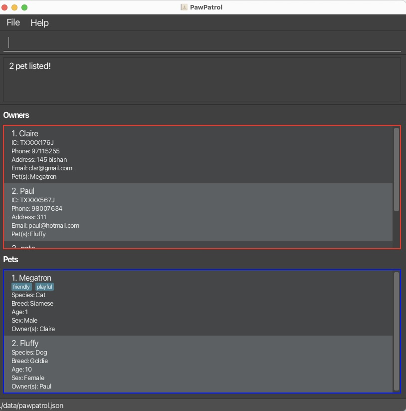
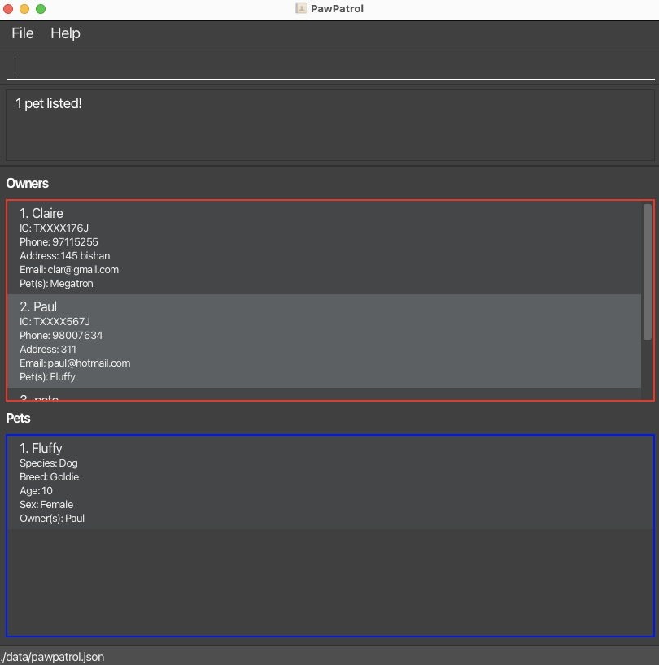
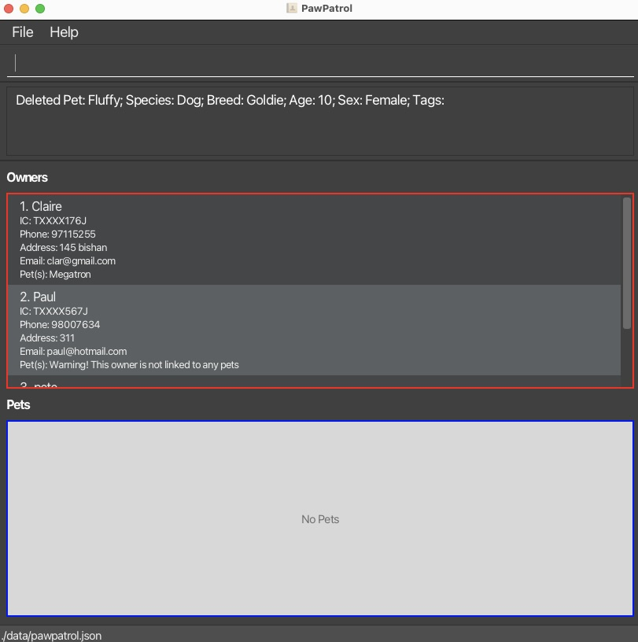

PawPatrol is a **desktop app to help veterinary clinics in Singapore to manage their patient data**. It allows the clinic to add and edit two types of
entities, owners and pets. PawPatrol also allows the user to link owners to pets, allowing the user
to easily see at a glance which pets belong to which owner. It is optimised
for use via a **Command Line Interface (CLI)** which improves speed of usage while still having the user-friendliness of a **Graphical User Interface (GUI)**.
If you can type fast, PawPatrol can manage pet owner and pet data faster than traditional organisation apps.

* Table of Contents
  {:toc}

--------------------------------------------------------------------------------------------------------------------

## Quick start

1. Ensure you have Java `17` or above installed in your Computer.

1. Download the latest `.jar` file from [here](https://github.com/se-edu/pawpatrol/releases).

1. Copy the file to the folder you want to use as the _home folder_ for PawPatrol.

1. Open a command terminal, `cd` into the folder you put the jar file in, and use the `java -jar pawpatrol.jar` command to run the application. 
   A GUI similar to the image below should appear in a few seconds. Note how the app contains some sample data. 
   

1. Type the command in the command box and press Enter to execute it. e.g. typing **`help`** and pressing Enter will open the help window. 
   Some example commands you can try:

    * `list` : Lists all owners and pets.

    * `owner i/S0000001I n/John Doe p/98765432 e/johnd@example.com a/311, Clementi Ave 2, #02-25` : Adds a contact named `John Doe` to PawPatrol.

    * `delete o3` : Deletes the 3rd owner shown in the current list.

    * `link o1 t/p1` : Links 1st owner shown to 1st pet shown.

    * `clear` : Deletes all owners and pets in PawPatrol.

    * `exit` : Exits the app.

1. Refer to the [Features](#features) below for details of each command.

--------------------------------------------------------------------------------------------------------------------

## Features

**:information_source: Notes about the command format:** 

* Words in `UPPER_CASE` are the parameters to be supplied by the user. 
  e.g. in `owner n/NAME`, `NAME` is a parameter which can be used as `owner n/John Doe`, and in `delete oOWNER_INDEX`, `OWNER_INDEX` is a parameter which can be used as `delete o1`.

* Items in square brackets are optional. 
  e.g. `n/NAME [t/TAG]` can be used as `n/Fluffy t/friendly` or as `n/Fluffy`.

* Items with `…`​ after them can be used multiple times including zero times. 
  e.g. `[t/TAG]…​` can be used as ` ` (i.e. none specified), `t/friendly`, `t/friendly t/skiddish` etc.

* Parameters can be in any order. 
  e.g. if the command specifies `n/NAME p/PHONE_NUMBER`, `p/PHONE_NUMBER n/NAME` is also acceptable.

* Extraneous parameters for commands that do not take in parameters (such as `help`, `list owners`, `list pets` and `exit`) will be ignored. 
  e.g. if the command specifies `help 123`, it will be interpreted as `help`.

* If you are using a PDF version of this document, be careful when copying and pasting commands that span multiple lines as space characters surrounding line-breaks may be omitted when copied over to the application.

### Viewing help : `help`

Shows a message explaining how to access the help page as shown below.

Format: `help`

### Adding an entity: `owner` / `pet`

#### <u>Adding an owner</u>

Adds a pet owner to PawPatrol.

**:information_source: Important notes about owner fields:** 
<ul>
<li>IC number: Must contain only uppercase alphanumeric characters and follow the format of a 9-character Singapore IC number.</li>
<li>Owner name: Must contain only alphanumeric characters and spaces, and cannot be empty.</li>
<li>Phone number: Must contain exactly 8 digits as according to Singapore phone standards.</li>
<li>Email: Should follow a standard email format of local-part@domain and adhere to the following constraints:
<ul>
<li>The local-part should only contain alphanumeric characters and the following special characters (excluding the apostrophes) '+', '_', '.', '-'.</li>
<li>The local-part may not start or end with any special characters.</li>
<li>The domain name is made up of domain labels separated by periods. There must be at least 2 domain labels.</li>
<li>Each domain label must be between 1 and 63 characters long, begin and end with an alphanumeric character and may contain hyphens (-) in the middle but not at the start or end</li>
<li>The last domain label (Top-Level Domain (TLD)) must only contain letters (e.g. <code>.com</code>) or be a valid TLD combination like <code>.co.uk</code>.</li>
</ul>
</li>
<li>Address: Can contain any characters, but must be at least 3 characters long.</li>
</ul>

Format: `owner i/IC_NUMBER n/NAME p/PHONE e/EMAIL a/ADDRESS`

Examples:
* `owner i/S1234567D n/John Doe p/98765432 e/johnd@example.com a/311, Clementi Ave 2, #02-25`

:exclamation: **About Owner's NRIC in list** 

Due to PDPA regulations, only the last 3 digits and last letter of the NRIC will be shown in the list view. 
The first 4 numbers of the NRIC will be replaced with a `X` to protect the privacy of the owner.

#### <u>Adding a pet</u>

Adds a pet to PawPatrol.

**:information_source: Important notes about pet fields:** 
<ul>
<li>Pet name: Must only contain alphanumeric characters, spaces, or hyphens, and it should not be blank.</li>
<li>Pet species: Must only contain alphabetic characters, should be a single word, and it should not be blank.</li>
<li>Pet breed: Must only contain alphabetic characters, spaces, or hyphens, and it should not be blank.</li>
<li>Pet age: Must only contain numbers, and it should be 1 or 2 digits long.</li>
<li>Pet sex: Must be either 'M' or 'F' (case-insensitive, each letter representing Male and Female respectively).</li>
<li>Pet tags: Must be alphanumeric and should only contain a single word each. Avoid having long tags.</li>
</ul>

:bulb: **Tip:**
A pet can have any number of tags (including 0)

Format: `pet n/NAME s/SPECIES b/BREED a/AGE x/SEX [t/TAG]…​`

Examples:
* `pet n/Fluffy s/Dog b/Golden Retriever a/7 x/F`
* `pet n/Megatron s/Cat b/Siamese a/3 x/M t/playful`

### Linking owners and pets: `link`

Links an owner to one or more pets.

**:information_source: Extra information:** 
<ul>
<li>Links owner at specified <code>OWNER_INDEX</code> to pet(s) at specified <code>PET_INDEX</code>s.</li>
<li>An owner can be linked to 0 or more pets.</li>
<li>A pet can be linked to 0 or more owners.</li>
</ul>

Format: `link oOWNER_INDEX t/pPET_INDEX…​`

Examples:
* `link o1 t/p1`
* `link o2 t/p2 t/p3`

<em>Link between Claire (owner) and Fluffy (pet)</em>

:bulb: **Tip:**
It is recommended to link the pets to the owners are the first action after adding a pet but this is not enforced.

:exclamation: **Important information:**
Ensure that for multiple pets that all the pets are unlinked. 
If any of the pets has already been linked to an owner, then the command will _fail_.

### Unlinking entities: `unlink`

Unlinks an owner to one or more pets.

Format: `unlink oOWNER_INDEX t/pPET_INDEX…​`

Examples:
* `unlink o1 t/p1`
* `unlink o2 t/p2 t/p3`

### Listing entities: `list`

Shows a list of desired entities in PawPatrol.

Format:
* `list owners`: Shows a list of all owners.
* `list pets`: Shows a list of all pets.
* `list`: Shows both owners and pets in a consolidated view.

### Editing entities: `edit`

Edits an existing owner or pet in PawPatrol. Refer to information on owner and pet fields in the [Add section](#adding-an-entity-owner--pet).

**:information_source: Extra information:** 
<ul>
<li>Edits the owner or pet at the specified <code>OWNER_INDEX</code> or <code>PET_INDEX</code> respectively. The index refers to the index number shown in the displayed owner or pet list. The index <strong>must be a positive integer</strong> 1, 2, 3, …​</li>
<li>At least one of the optional fields must be provided.</li>
<li>IC number cannot be changed.</li>
<li>Existing values will be updated to the input values.</li>
<li>When editing tags, the existing tags of the pet will be removed i.e. adding of tags is not cumulative.</li>
<li>You can remove all the pet’s tags by typing <code>t/</code> without specifying any tags after it.</li>
</ul>

#### <u>Editing an owner</u>

Format:
* `edit oOWNER_INDEX [n/NAME] [p/PHONE] [e/EMAIL] [a/ADDRESS]`: Edits an existing owner in PawPatrol.

Example:
*  `edit o1 p/91234567 e/johndoe@example.com` Edits the phone number and email address of the 1st owner to be `91234567` and `johndoe@example.com` respectively.

#### <u>Editing a pet</u>

Format:
* `edit pPET_INDEX [n/NAME] [s/SPECIES] [b/BREED] [a/AGE] [x/SEX] [t/TAG]…​`: Edits an existing pet in PawPatrol.

Example:
*  `edit p2 n/Fluffy t/` Edits the name of the 2nd pet to be `Fluffy` and clears all existing tags.

### Finding entities by name: `find`

Finds owners or pets whose names contain any of the given keywords.

**:information_source: Extra information:** 
<ul>
<li>The search is case-insensitive. e.g. <code>hans</code> will match <code>Hans</code></li>
<li>The order of the keywords does not matter. e.g. <code>Hans Bo</code> will match <code>Bo Hans</code></li>
<li>Only the name is searched.</li>
<li>Words can be partially searched. e.g. Searching <code>Han</code> will give <code>Hans Bo</code>.</li>
<li>Owners or pets matching at least one keyword will be returned (i.e. <code>OR</code> search). 
  e.g. <code>Hans Bo</code> will return <code>Hans Gruber</code>, <code>Bo Yang</code></li>
</ul>

Format:
* `find owner KEYWORD [MORE_KEYWORDS]`: Finds owners whose names contain any of the given keywords.
* `find pet KEYWORD [MORE_KEYWORDS]`: Finds pets whose names contain any of the given keywords.

Examples:
* `find owner John` returns `john` and `John Doe` in the owners list panel.
* `find pet fluffy megatron` returns `Fluffy`, `Megatron` as shown in the image below. 
  

**:information_source: About find and UI:** 
<ul>
<li>Only the list that is selected by the <code>find</code> will be updated. The other list will remain the same.</li>
<li>This allows for the possibility to find <code>owners</code> then find <code>pets</code> without disrupting the other list.</li>
</ul>

### Deleting an entity : `delete`

Deletes the specified owner or pet from PawPatrol.

**:information_source: Extra information:** 
<ul>
<li>Deletes the owner or pet at the specified <code>OWNER_INDEX</code> or <code>PET_INDEX</code> respectively.</li>
<li>The index refers to the index number shown in the displayed owner or pet list.</li>
<li>The index <strong>must be a positive integer</strong> 1, 2, 3, …​</li>
</ul>

Format:
* `delete oOWNER_INDEX`: Deletes the specified owner from PawPatrol.
* `delete pPET_INDEX`: Deletes the specified pet from PawPatrol.

Examples:
* `list owners` followed by `delete o2` deletes the 2nd person in PawPatrol.
* `find owner Betsy` followed by `delete o1` deletes the 1st owner in the results of the `find` command.
* `list pets` followed by `delete p2` deletes the 2nd pet in PawPatrol.
* `find pet Fluffy` followed by `delete p1` deletes the 1st pet in the results of the `find` command, as shown below.
  
  

    <em>Result for 'find pet Fluffy'</em>
  

  
  
<em>Result for 'delete p1' after 'find pet Fluffy'</em>

### Sorting : `sort`

View owners or pets in PawPatrol sorted by their names in alphabetical order.

Format:
* `sort owners`: Sorts owners by name in alphabetical order.
* `sort pets`: Sorts pets by name in alphabetical order.

### Clearing all entries : `clear`

Clears all owners and pets in PawPatrol.

Format: `clear`

:exclamation: **Warning:**
This action is irreversible! Please make a backup of the <a href="#for-advanced-users-updating-pawpatrol-data-directly">data file</a> should you wish to retain past data.

### Exiting the program : `exit`

Exits PawPatrol. This is equivalent to clicking the "X" icon to close the app.

Format: `exit`

### Finding unlinked pets and owners  `[coming in v2.0]`

_Details coming soon ..._

## For Advanced Users: Updating PawPatrol Data Directly

### Saving the data

PawPatrol data is saved on your computer automatically after any command that changes the data. There is no need to save manually.

It is saved automatically as a JSON file located in `[JAR file location]/data/pawpatrol.json`.

### Saving a backup data file

PawPatrol does not automatically back up your data. To do so, copy the JSON file (as mentioned above) into another location on your computer or to another device.

### Editing the data file

Advanced users are welcome to update data directly by editing that data file.

:exclamation: **Caution:**
If your changes to the data file makes its format invalid, PawPatrol will <b>discard all data</b> and start with an empty data file at the next run. Hence, it is recommended to take a <a href="#saving-a-backup-data-file">backup</a> of the file before editing it. 
Furthermore, certain edits can cause PawPatrol to behave in unexpected ways (e.g., if a value entered is outside of the acceptable range). Therefore, edit the data file only if you are confident that you can update it correctly.

### Automatic backup data files `[coming in v2.0]`

_Details coming soon ..._

--------------------------------------------------------------------------------------------------------------------

## FAQ

**Q**: How do I transfer my data to another computer? 
**A**: Install the app in the other computer and overwrite the empty data file it creates with the file that contains the data of your previous PawPatrol home folder.

--------------------------------------------------------------------------------------------------------------------

## Known issues

1. **If you minimize the Help Window** and then run the `help` command (or use the `Help` menu, or the keyboard shortcut `F1`) again, the original Help Window will remain minimized, and no new Help Window will appear. The remedy is to manually restore the minimized Help Window.
2. **Accidental clearing of data** using the `clear` command may lead to data being lost. [Backups of the data file](#saving-a-backup-data-file) should be made frequently by copying out the JSON file to another location on your computer.
3. **When using multiple screens**, if you move the application to a secondary screen, and later switch to using only the primary screen, the GUI will open off-screen. The remedy is to delete the `preferences.json` file created by the application before running the application again. This file can be found in `[JAR file location]/data/preferences.json` similar to [other data files](#saving-the-data).

--------------------------------------------------------------------------------------------------------------------

## Command summary

Action | Format, Examples
--------|------------------
**Add Owner** | `owner i/IC_NUMBER n/NAME p/PHONE e/EMAIL a/ADDRESS`   e.g., `owner i/S1234567D n/John Doe p/98765432 e/johnd@example.com a/311, Clementi Ave 2, #02-25`
**Add Pet** | `pet n/NAME s/SPECIES b/BREED a/AGE sex/SEX [t/TAG]…​`   e.g., `pet n/Megatron s/Cat b/Siamese a/3 x/M t/playful`
**Clear** | `clear`
**Delete Owner** | `delete oOWNER_INDEX`  e.g., `delete o3`
**Delete Pet** | `delete pPET_INDEX`  e.g., `delete p2`
**Edit Owner** | `edit oOWNER_INDEX [n/NAME] [p/PHONE_NUMBER] [e/EMAIL] [a/ADDRESS]`  e.g.,`edit o2 n/James Lee e/jameslee@example.com`
**Edit Pet** | `edit pPET_INDEX [n/NAME] [s/SPECIES] [b/BREED] [a/AGE] [x/SEX] [t/TAG]…​`  e.g.,`edit p2 n/George a/2`
**Find Owner** | `find owner KEYWORD [MORE_KEYWORDS]`  e.g., `find James Jake`
**Find Pet** | `find pet KEYWORD [MORE_KEYWORDS]`  e.g., `find Fluffy`
**Link** | `link oOWNER_INDEX t/pPET_INDEX…​`   e.g., `link o1 t/p1 t/p2`
**Unlink** | `unlink oOWNER_INDEX t/pPET_INDEX…​`   e.g., `unlink o1 t/p1 t/p2`
**List Owners** | `list owners`
**List Pets** | `list pets`
**List Owners and Pets** | `list`
**Sort Owners** | `sort owners`
**Sort Pets** | `sort pets`
**Help** | `help`
