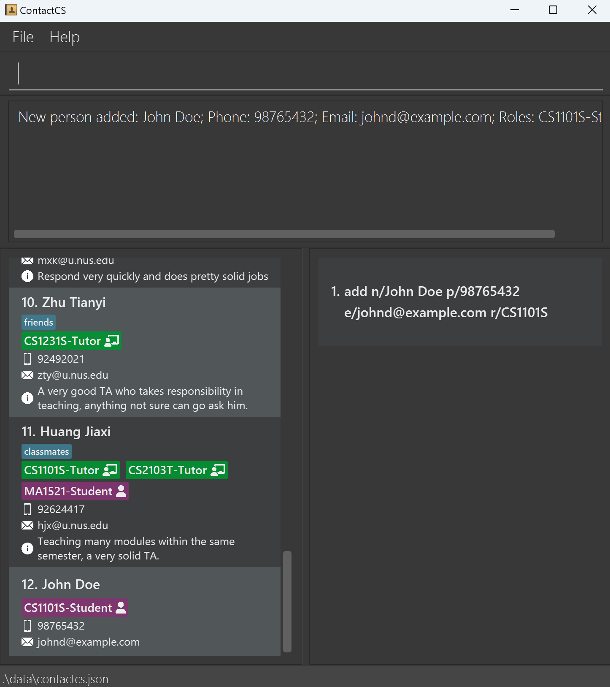

# ContactCS User Guide

**ContactCS** is a **desktop app designed for NUS Computer Science freshmen** to efficiently manage and locate important contact details, including those of professors, teaching assistants, classmates, school offices, and more.

<!-- * Table of Contents -->
<page-nav-print />

--------------------------------------------------------------------------------------------------------------------

## Quick start

1. Ensure you have Java `17` or above installed in your Computer.

1. Download the latest `.jar` file from [here](https://github.com/AY2425S1-CS2103T-F12-1/tp/releases).

1. Copy the file to the folder you want to use as the _home folder_ for your AddressBook.

1. Open a command terminal, `cd` into the folder you put the jar file in, and use the `java -jar addressbook.jar` command to run the application. 
   A GUI similar to the below should appear in a few seconds. Note how the app contains some sample data. 
   

1. Type the command in the command box and press Enter to execute it. e.g. typing **`help`** and pressing Enter will open the help window. 
   Some example commands you can try:

   * `list` : Lists all contacts.

   * `add n/John Doe p/98765432 e/johnd@example.com r/CS1101S` : Adds a contact named `John Doe` who takes CS1101S to the Address Book.

   * `delete 3` : Deletes the 3rd contact shown in the current list.

   * `clear` : Deletes all contacts.

   * `exit` : Exits the app.

1. Refer to the [Features](#features) below for details of each command.

--------------------------------------------------------------------------------------------------------------------

## Features

<box type="info" seamless>

**Notes about the command format:** 

* Words in `UPPER_CASE` are the parameters to be supplied by the user. 
  e.g. in `add n/NAME`, `NAME` is a parameter which can be used as `add n/John Doe`.

* Items in square brackets are optional. 
  e.g `n/NAME [t/TAG]` can be used as `n/John Doe t/friend` or as `n/John Doe`.

* Items in sqaure brackets and with `+` after them can be used zero or more times. 
  e.g. `[t/TAG]+` can be used as ` ` (i.e. 0 times), `t/friend`, `t/friend t/family` etc.

* Items in **round** brackets and with `+` after them can be used one or more times. 
  e.g. `(t/TAG)+` can be used as `t/friend`, `t/friend t/family` etc.

* `|` operator signifies `OR` relationship. 
  e.g. `n/NAME | r/MODULECODE` means `n/NAME` or `r/MODULECODE`

* Parameters can be in any order. 
  e.g. if the command specifies `n/NAME p/PHONE_NUMBER`, `p/PHONE_NUMBER n/NAME` is also acceptable.

* Extraneous parameters for commands that do not take in parameters (such as `help`, `list`, `exit` and `clear`) will be ignored. 
  e.g. if the command specifies `help 123`, it will be interpreted as `help`.

* If you are using a PDF version of this document, be careful when copying and pasting commands that span multiple lines as space characters surrounding line-breaks may be omitted when copied over to the application.
</box>

### Viewing help : `help`

Shows a message explaning how to access the help page.

Format: `help`

### Adding a person: `add`

Adds a person to the address book.

Format: `add n/NAME (p/PHONE_NUMBER | e/EMAIL) (r/MODULECODE[-ROLETYPE])+ [a/ADDRESS] [t/TAG]+`
* `MODULECODE` refers to a module code of a NUS module (e.g. CS1101S, MA1521)
* `ROLETYPE` refers to one of the following: `student`, `ta`, `tutor`, `prof`, `professor`.
* The `r/MODULECODE[-ROLETYPE]` parameter means that the person has the role for this module (e.g. `r/CS1101S-student` means that the person is a student of CS1101S).
* In `r/MODULECODE[-ROLETYPE]`, `[-ROLETYPE]` is optional. In such cases, this means that the person is a student of that module (e.g `r/MA1521` means that the person is a student of MA1521).
* If the same module is added multiple times, then it is assumed to be an error in user input, because a person should not have multiple roles (student, tutor, professor) at the same time (e.g. `r/CS1101S-student r/CS1101S-prof` is not allowed).

<box type="tip" seamless>

**Tip:** A person must have at least one pair of module code and role type.
</box>

<box type="warning" seamless>

**Duplicate Handling:**
A person is considered a duplicate if another person in the address book has the same email address. The app will prevent adding contacts with duplicate emails. 
</box>

Examples:
* `add n/John Doe p/98765432 e/johnd@example.com r/CS1101S`. John is a CS1101S student.
  
* `add n/Jane Doe p/81234567 e/janed@example.com r/CS1101S-TA r/CS2040S`. Jane is a CS1101S tutor and a CS2040S student.

### Listing all persons : `list`

Shows a list of all persons in the address book.

Format: `list`

### Editing a person : `edit`

Edits an existing person in the address book. The module role pairs are edited with a slightly different syntax which
is explained below.

#### Module-role

The module-role pairs can be edited by adding, deleting, or replacing.

##### Add new module-role pairs

Format: `edit INDEX r/+(MODULECODE[-ROLETYPE])+`

* Edits the person at the specified `INDEX`. The index refers to the index number shown in the displayed person list. 
The index **must be a positive integer** 1, 2, 3, …​
* At least one module-role pair must be provided.
* Multiple module-role pairs can be added at once, separated by `" "`.

Examples:
* `edit 1 r/+CS2103T-Prof` add role "professor of CS2103T" to the first person.
* `edit 1 r/+CS1101S MA1521-TA` add role "Student of CS1101S" and "TA of MA1521" to the first person.

<box type="warning" seamless>

**Common Mistakes:**
- If you are adding multiple module-role pairs, only the first pair should have a `+` sign before the module-role pair. 
The subsequent pairs should not have a `+` sign before them. i.e. `r/+CS1101S +MA1521-TA` is unnecessary and will cause an error.
- You only need to specify one `r/`. i.e. `r/+CS1101S r/+MA1521-TA` is unnecessary and will cause an error.
</box>

##### Delete existing module-role pairs

TODO

##### Replace existing module-role pairs

TODO

#### All other fields

Except for the module-role pairs, all other fields can only be edited by complete replacement.

Format: `edit INDEX [n/NAME] [p/PHONE] [e/EMAIL] [a/ADDRESS] [t/TAG]+​`

* Edits the person at the specified `INDEX`. The index refers to the index number shown in the displayed person list. The index **must be a positive integer** 1, 2, 3, …​
* At least one of the optional fields must be provided.
* Existing values will be updated to the input values.
* When editing tags, the existing tags of the person will be removed i.e adding of tags is not cumulative.
* You can remove all the person’s tags by typing `t/` without
  specifying any tags after it.

Examples:
*  `edit 1 p/91234567 e/johndoe@example.com` Edits the phone number and email address of the 1st person to be `91234567` and `johndoe@example.com` respectively.
*  `edit 2 n/Betsy Crower t/` Edits the name of the 2nd person to be `Betsy Crower` and clears all existing tags.

### Locating persons: `find`

The find command allows you to locate persons by their names, module-role pairs, or a combination of both.

#### By name

Finds persons whose names contain any of the given keywords.

Format: `find (n/KEYWORD)+`

* The search is case-insensitive. e.g `hans` will match `Hans`
* Each keyword can contain multiple words. e.g. `John Doe`
* The keyword must exist contiguously in the name. e.g. `John Doe` will not match `John David Doe`
* Only the name is searched.
* Partial words will be matched as well. e.g. `Han` will match `Hans`
* Persons matching at least one keyword will be returned (i.e. `OR` search).
  e.g. `find n/Hans n/Bo` will return `Hans Gruber`, `Bo Yang`

Examples:
* `find n/John` returns `john` and `John Doe`
* `find n/alex n/david li` returns `Alex Yeoh`, `David Li` 
  

#### By module-role

Finds persons whose module-role pairs contain any of the given keywords.

Format: `find (r/KEYWORD)+`

* Search by module code and optionally specify the role type (separated by a dash). For example, `CS2103T-Prof` will search for the module `CS2103T` with the role `Professor`.
* The search is case-insensitive. e.g. `cs2103t-student` will match `CS2103T-Student`.
* If the role type is not specified, role `STUDENT` will be assumed. For example, `find r/CS2103T` will return all students taking `CS2103T`.
* Persons matching at least one module-role keyword will be returned (i.e. OR search).

Examples:
* `find r/CS2103T` returns all students taking the module `CS2103T`
* `find r/CS2103T-Prof r/CS1101S` returns all persons with the role Prof in CS2103T or Student in CS1101S 
  

#### By name and module-role

Finds persons whose names and module-role pairs contain any combination of the given keywords.

Format: `find (n/KEYWORD)+ (r/KEYWORD)+`

* Person matching at least one name keyword AND one module-role keyword will be returned (i.e. AND search).

Examples:
* `find n/John n/Ben r/cs1101s r/ma1522` return all persons whose name are either John or ben, taking either CS1101S or MA1522
  

### Deleting a person or multiple persons: `delete`

Deletes the specified person from the address book.

Format: `delete (INDEX)+`

* Deletes the person(s) at the specified INDEX(es).
* The index refers to the index number shown in the displayed person list.
* The indices **must be a positive integer** 1, 2, 3, …​

Examples:
* `list` followed by `delete 1 2 3` deletes the 1st, 2nd and 3rd person in the address book.
* `find Betsy` followed by `delete 1` deletes the 1st person in the results of the `find` command.

### Clearing all entries : `clear`

Clears all entries from the address book.

Format: `clear`

### Exiting the program : `exit`

Exits the program.

Format: `exit`

### Saving the data

AddressBook data are saved in the hard disk automatically after any command that changes the data. There is no need to save manually.

### Editing the data file

AddressBook data are saved automatically as a JSON file `[JAR file location]/data/addressbook.json`. Advanced users are welcome to update data directly by editing that data file.

<box type="warning" seamless>

**Caution:**
If your changes to the data file makes its format invalid, AddressBook will discard all data and start with an empty data file at the next run.  Hence, it is recommended to take a backup of the file before editing it. 
Furthermore, certain edits can cause the AddressBook to behave in unexpected ways (e.g., if a value entered is outside the acceptable range). Therefore, edit the data file only if you are confident that you can update it correctly.
</box>

### Archiving data files `[coming in v2.0]`

_Details coming soon ..._

--------------------------------------------------------------------------------------------------------------------

## FAQ

**Q**: How do I transfer my data to another Computer? 
**A**: Install the app in the other computer and overwrite the empty data file it creates with the file that contains the data of your previous AddressBook home folder.

--------------------------------------------------------------------------------------------------------------------

## Known issues

1. **When using multiple screens**, if you move the application to a secondary screen, and later switch to using only the primary screen, the GUI will open off-screen. The remedy is to delete the `preferences.json` file created by the application before running the application again.
2. **If you minimize the Help Window** and then run the `help` command (or use the `Help` menu, or the keyboard shortcut `F1`) again, the original Help Window will remain minimized, and no new Help Window will appear. The remedy is to manually restore the minimized Help Window.

--------------------------------------------------------------------------------------------------------------------

## Command summary

Action     | Format, Examples                                                                                                                                                                                            
-----------|-------------------------------------------------------------------------------------------------------------------------------------------------------------------------------------------------------------
**Add**    | `add n/NAME p/PHONE_NUMBER e/EMAIL (r/MODULECODE[-ROLETYPE])+ [a/ADDRESS] [t/TAG]+`   e.g., `add n/James Ho p/22224444 e/jamesho@example.com r/CS1101S a/123, Clementi Rd, 1234665 t/friend t/colleague` 
**Clear**  | `clear`                                                                                                                                                                                                     
**Delete** | `delete (INDEX)+`  e.g., `delete 3` or `delete 1 3 5`                                                                                                                                                    
**Edit**   | `edit INDEX [n/NAME] [p/PHONE_NUMBER] [e/EMAIL] [a/ADDRESS] [t/TAG]+ [r/+(MODULECODE[-ROLETYPE])+]`  e.g.,`edit 2 n/James Lee e/jameslee@example.com`                                                                                  
**Find**   | `find (n/KEYWORD \| r/KEYWORD)+`  e.g., `find n/James n/Jake r/CS1101S r/MA1521`                                                                                                                         
**List**   | `list`                                                                                                                                                                                                      
**Help**   | `help`                                                                                                                                                                                                      
