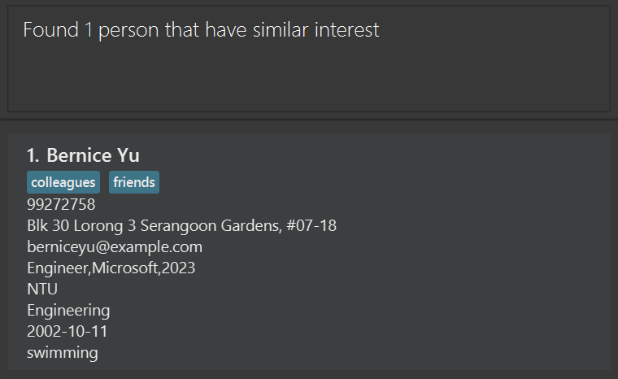
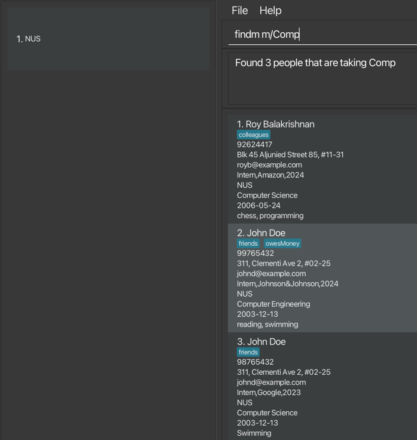

# UniVerse User Guide


UniVerse is more than just a **desktop app for managing contacts**—it is a platform designed to foster meaningful connections and support the holistic growth of **university students**. Tailored specifically for students balancing academic, social, and career aspirations, UniVerse allows users to organize and manage their networks effectively. By leveraging a **Command Line Interface (CLI)** for quick, efficient input and command execution, along with an intuitive **Graphical User Interface (GUI)** for easy navigation, UniVerse empowers students to maintain detailed contact information and build relationships that go beyond academic and professional circles. Whether it’s connecting with peers, professors, or industry mentors, UniVerse encourages students to form lasting bonds rooted in shared interests and experiences, making it an essential tool for thriving both socially and academically on campus.

<!-- * Table of Contents -->

<page-nav-print />

---

<div style="page-break-after: always;"></div>

## Quick start

1. Ensure you have Java `17` or above installed in your Computer.

2. Download the latest `.jar` file from [here](https://github.com/AY2425S1-CS2103T-T17-1/tp/releases).

3. Copy the file to the folder you want to use as the _home folder_ for your UniVerse application.

4. Open a command terminal, `cd` into the folder you put the jar file in, and use the `java -jar UniVerse.jar` command
   to run the application.<br>
   A GUI similar to the below should appear in a few seconds. Note how the app contains some sample data.<br>
   

5. Type the command in the command box and press **Enter** to execute it. e.g. typing **`help`** and pressing **Enter** will
   open the help window.<br>
   Some example commands you can try:

    - `list`: Lists all contacts.
    - `add n/John Doe p/98765432 e/johnd@example.com a/311, Clementi Ave 2, #02-25 u/NUS m/Computer Science b/13-12-2003`:
      Adds a contact named **John Doe** to UniVerse.

      <box type="info" seamless>
      
      **Note**: The `add` command supports **optional fields** such as:
        - `w/WORK_EXPERIENCE`: Specifies past work or internships (e.g., `w/Intern,Google,2023`).
        - `i/INTEREST`: Adds interests to a contact (e.g., `i/Photography`).
        - `t/TAG`: Tags to label the contact (e.g., `t/friends`).
      
      </box>

      These fields can be added to make contact information more detailed. Here’s an example with optional fields included:
      ```markdown
       add n/Alice Tan p/91234567 e/alice@example.com a/Blk 123 Clementi Ave 3, #05-10 u/NTU m/Engineering b/15-04-2000 w/Intern,Google,2023 i/Photography t/friend
      ```

    - `addi in/1 i/Reading`:
      Adds an interest called **Reading** to the contact at index 1.
    - `findu u/NUS`: Finds all contacts studying at **NUS**.
    - `findi i/Swimming`: Finds all contacts whose interests include **Swimming**.
    - `exit`: Exits the app.
   

6. Refer to the [Features](#features) below for details of each command.

---

<div style="page-break-after: always;"></div>

## Features

<box type="info" seamless>

**Notes about the command format:**<br>

- Words in `UPPER_CASE` are the parameters to be supplied by the user.<br>
  e.g. in `add n/NAME`, `NAME` is a parameter which can be used as `add n/John Doe`.

- Note that name cannot include prefixes that are already part of our commands.

- Items in square brackets are optional.<br>
  e.g `n/NAME [t/TAG]` can be used as `n/John Doe t/friend` or as `n/John Doe`.

- Items with `…`​ after them can be used multiple times including zero times.<br>
  e.g. `[t/TAG]…​` can be used as ` ` (i.e. 0 times), `t/friend`, `t/friend t/family` etc.

- Work experience parameter `[w/WORK_EXPERIENCE]` can only be used one time. <br>

- Parameters can be in any order.<br>
  e.g. if the command specifies `n/NAME p/PHONE_NUMBER`, `p/PHONE_NUMBER n/NAME` is also acceptable.

- Extraneous parameters for commands that do not take in parameters (such as `help`, `list`, `exit` and `clear`) will be ignored.<br>
  e.g. if the command specifies `help 123`, it will be interpreted as `help`.

- If you are using a PDF version of this document, be careful when copying and pasting commands that span multiple lines as space characters surrounding line-breaks may be omitted when copied over to the application.
  </box>

### Viewing help : `help`

_Shows a message explaning how to access the help page._


**Format**: `help`

<br>

### Adding a person: `add`

_Adds a new person to UniVerse with their contact information._

**Format**:
```plaintext
add n/NAME p/PHONE_NUMBER e/EMAIL a/ADDRESS u/UNIVERSITY m/MAJOR b/BIRTHDATE [w/WORK_EXPERIENCE] [i/INTEREST]... [t/TAG]...
```

**Parameters**:

- `n/NAME`: Full name of the contact.
- `p/PHONE_NUMBER`: Numeric input of any length.
- `e/EMAIL`: Email address in `local-part@domain` format.
- `a/ADDRESS`: Contact's address.
- `u/UNIVERSITY`: University name (case-sensitive).
- `m/MAJOR`: Major or field of study (case-sensitive).
- `b/BIRTHDATE`: Date of birth in `dd-mm-yyyy` format.
- `[w/WORK_EXPERIENCE]`: Work experience in the format `ROLE,COMPANY,YEAR`, where role, company, and year are capitalised.
- `[i/INTEREST]...`: Interests of the contact (case-sensitive).
- `[t/TAG]...`: Tags for categorisation (case-sensitive).

<box type="info" seamless>

**Notes**:
- Contacts can have the same names but different phone numbers.

</box>

**Examples**:

1. Adding a person with work experience and interests:
   ```plaintext
   add n/John Doe p/98765432 e/johnd@example.com a/311, Clementi Ave 2, #02-25 u/NUS m/Computer Science b/13-12-2003 w/Intern,Google,2023 i/Swimming t/friends
   ```
   **Expected output**:
   ```plaintext
   New person added: John Doe; Phone: 98765432; Email: johnd@example.com; Address: 311, Clementi Ave 2, #02-25; Work Experience: Intern,Google,2023; Tags: [[friends]]; University: NUS; Major: Computer Science; Interests: [Swimming]; Birthday: 13-12-2003
   ```

2. Adding a person with minimal fields:
   ```plaintext
   add n/Betsy Crowe p/98765431 e/betsycrowe@example.com a/Bishan Street 22, #02-12 u/NTU m/Engineering b/01-01-2001
   ```
   **Expected output**:
   ```plaintext
   New person added: Betsy Crowe; Phone: 98765431; Email: betsycrowe@example.com; Address: Bishan Street 22, #02-12; Work Experience: ; Tags: []; University: NTU; Major: Engineering; Interests: []; Birthday: 01-01-2001
   ```

<box type="warning" seamless>

**Caution**:
- Ensure the email follows the `local-part@domain` format.
- The command accepts only one work experience entry per contact.

</box>

<br>

### Adding fields to an existing contact

#### Adding Interests: `addi`

_Adds interest(s) to an existing contact._

**Format**:
```plaintext
addi in/INDEX i/INTEREST...
```

**Parameters**:

- `in/INDEX`: Index of the contact to which you wish to add interests. It must be a number from 1 to the total number of existing contacts.
- `i/INTEREST...`: Interests to add. You can add multiple interests in a single command, with each interest limited to 20 characters.

<box type="info" seamless>

**Note**:
- Only newly added interests (i.e., interests not already part of the contact's list) will appear in the confirmation message and be added.
- The first letter fo each newly added interest will automatically be capitalised.

</box>

<div style="page-break-after: always;"></div>

<box type="warning" seamless>

**Caution**:
- Interests should not exceed **20 characters** per interest. Adding interests longer than this limit may cause them to be cut off in the UI display. For example, using `addi in/1 i/VeryLongInterestNameExceedingLimit` will save the interest but may not display fully.

</box>

**Examples**:

1. Adding a single interest:
   ```plaintext
   addi in/1 i/Swimming
   ```
   **Expected output**:
   ```plaintext
   New interests added to Alex Yeoh: [Swimming]
   ```

2. Adding multiple interests:
   ```plaintext
   addi in/2 i/Swimming i/Cycling
   ```
   **Expected output**:
   ```plaintext
   New interests added to Betsy Crower: [Cycling, Swimming]
   ```

<br>

#### Adding Work Experience: `addw`


_Adds work experience to an existing contact._

**Format**:
```plaintext
addw in/INDEX w/ROLE,COMPANY,YEAR
```

**Parameters**:

- `in/INDEX`: Index of the contact to which you wish to add work experience. It must be a number from 1 to the total number of existing contacts.
- `w/ROLE,COMPANY,YEAR`: Work experience details.
    - `ROLE`: One word, capitalised, alphabetic.
    - `COMPANY`: One word, capitalised, may include `&` and `-`, but not as the first character.
    - `YEAR`: A four-digit year.
  
<box type="warning" seamless>

**Caution**:
There should be no spacings between role, company, and year.

</box>
<box type="info" seamless>

**Note**:
Adding work experience to a contact with an existing entry will overwrite the old data.

</box>

**Examples**:

1. Adding a work experience entry:
   ```plaintext
   addw in/1 w/Engineer,Google,2023
   ```
   <div style="page-break-after: always;"></div>

   **Expected output**:
   ```plaintext
   Alex Yeoh work experience replaced to: Engineer,Google,2023
   ```

2. Overwriting work experience:
   ```plaintext
   addw in/2 w/Intern,Johnson&Johnson,2024
   ```
   **Expected output**:
   ```plaintext
   Betsy Crower work experience replaced to: Intern,Johnson&Johnson,2024
   ```

<br>

### Listing all persons: `list`

_Displays a list of all contacts in UniVerse._

**Format**:
```plaintext
list
```

<br>

### Editing a person: `edit`

_Edits an existing person’s information in UniVerse._

**Format**:
```plaintext
edit INDEX [n/NAME] [p/PHONE] [e/EMAIL] [a/ADDRESS] [t/TAG] [b/BIRTHDATE] [i/INTEREST] [w/WORK_EXPERIENCE] [m/MAJOR] [u/UNIVERSITY]...
```

**Parameters**:

- `INDEX`: Index of the contact to edit, as shown in the displayed list. It must be a number from 1 to the total number of existing contacts.
- `[n/NAME]`: Updated name for the contact.
- `[p/PHONE]`: Updated phone number.
- `[e/EMAIL]`: Updated email address.
- `[a/ADDRESS]`: Updated address.
- `[t/TAG]`: New tags to replace existing ones (case-sensitive).
- `[b/BIRTHDATE]`: Updated birthdate in `dd-mm-yyyy` format.
- `[i/INTEREST]`: New interests to replace existing ones (case-sensitive).
- `[w/WORK_EXPERIENCE]`: Updated work experience in `ROLE,COMPANY,YEAR` format.
- `[m/MAJOR]`: Updated major or field of study (case-sensitive).
- `[u/UNIVERSITY]`: Updated university (case-sensitive).

<box type="info" seamless>

**Notes**:
- At least one of the optional fields must be provided.
- Existing values are replaced by the new input values.
- **Removing Fields**: Use an empty parameter to remove values.
    - `i/`: Removes all interests.
    - `w/`: Removes work experience.
    - `t/`: Removes all tags.

</box>

**Examples**:

1. Edit phone number and email:
   ```plaintext
   edit 1 p/91234547 e/johndoe@example.com
   ```
   **Expected output**:
   ```plaintext
   Edited Person: Alex Yeoh; Phone: 91234547; Email: johndoe@example.com; Address: Blk 30 Geylang Street 29, #06-40; Work Experience: Engineer,Google,2023; Tags: [[friends]]; University: nus; Major: Business; Interests: [reading, cycling, Swimming]; Birthday: 08-07-2002
   ```

2. Edit name and remove all tags:
   ```plaintext
   edit 2 n/Betsy Crower t/
   ```
   **Expected output**:
   ```plaintext
   Edited Person: Betsy Crower; Phone: 99272758; Email: berniceyu@example.com; Address: Blk 30 Lorong 3 Serangoon Gardens, #07-18; Work Experience: Engineer,Microsoft,2023; Tags: []; University: NTU; Major: engineering; Interests: [swimming]; Birthday: 08-07-2002
   ```

3. Remove all interests from a contact:
   ```plaintext
   edit 3 i/
   ```
   **Expected output**:
   ```plaintext
   Edited Person: Bob Chen; Phone: 98765432; Email: bobchen@example.com; Address: Blk 45 Ang Mo Kio Ave 6, #02-01; Work Experience: Engineer,Siemens,2022; Tags: []; University: NTU; Major: Mechanical Engineering; Interests: []; Birthday: 08-06-1999
   ```

4. Remove work experience:
   ```plaintext
   edit 4 w/
   ```
   **Expected output**:
   ```plaintext
   Edited Person: David Li; Phone: 91031282; Email: lidavid@example.com; Address: Blk 436 Serangoon Gardens Street 26, #16-43; Work Experience: ; Tags: [[family]]; University: NUS; Major: Law; Interests: [Reading, Traveling, Photography]; Birthday: 08-06-2003
   ```
   
<br>

### Finding contacts 
#### Finding Contacts by Name: `find`

_Finds persons whose names contain any of the given keywords._

**Format**:
```plaintext
find KEYWORD [MORE_KEYWORDS]
```

**Parameters**:

- `KEYWORD`: One or more keywords to search for within names. The search is case-insensitive.

<box type="tip" seamless>

**Tip**: Type `list` to view the full list of contacts again.
</box>

**Notes**:

- The search is case-insensitive. E.g., `hans` matches `Hans`.
- The order of keywords does not matter. E.g., `Hans Bo` matches `Bo Hans`.
- Only full words are matched; e.g., `Han` does not match `Hans`.
- At least one keyword must match (OR search).

**Examples**:

1. Search for a contact by name:
   ```plaintext
   find John
   ```
   **Expected output**:
   ```plaintext
   2 persons listed!
   ```

2. Search using multiple keywords:
   ```plaintext
   find bob lee
   ```
   **Expected output**:
   ```plaintext
   2 persons listed!
   ```
   Displays `Bob Chen` and `Catherine Lee`

  

<br>
<br>

#### Finding Contacts by Interest: `findi`

_Finds contacts with specific interests._

**Format**:
```plaintext
findi i/INTEREST
```

**Parameters**:

- `i/INTEREST`: Interest to search for. **Partial matches** are allowed.

<box type="info" seamless>

**Note**: The search matches any contact with an interest that partially matches the provided keyword.
</box>

**Examples**:

1. Exact match search for "Swimming":
   ```plaintext
   findi i/swimming
   ```
   **Expected output**:
   ```plaintext
   Found 1 person that have similar interest
   ```
    

<br>

2. Partial match search for "swim":
   ```plaintext
   findi i/swim
   ```
   **Expected output**:
   ```plaintext
   Found 3 people that have a similar interest
   ```

<box type="warning" seamless>

**Error Message for Incorrect Format**:
If an incorrect format is used, the application will show:
```plaintext
Invalid command format! 
findi: Finds all persons whose interests contain the specified keyword (case-insensitive) and displays them as a list with index numbers. 
Parameters: i/INTEREST 
Example: findi i/reading
```
</box>

<box type="warning" seamless>

**Caution**:
- **Searching by multiple interests is not supported** and will trigger an error message.

Invalid formats:
```plaintext
findi i/reading i/swimming
findi i/reading,i/swimming
findi i/reading, i/swimming
findi i/reading swimming
findi i/reading,swimming
findi i/reading, swimming
```
</box>


<br>
<div style="page-break-after: always;"></div>


#### Finding Contacts by Work Experience: `findw`

_Finds contacts with specific work experiences based on **company** and optionally **role** and **year**._

**Format**:
```plaintext
findw w/ROLE,COMPANY,YEAR
```

**Parameters**:

- `COMPANY`: Required. Name of the company.
- `ROLE`: Optional. Position held at the company.
- `YEAR`: Optional. Year of employment at the company.

<box type="info" seamless>

**Note**: `ROLE` and `YEAR` are optional, but `COMPANY` must always be specified.
</box>

**Examples**:

1. Find all contacts who worked at Google:
   ```plaintext
   findw w/Google
   ```
   **Expected output**:
   ```plaintext
   Found 6 people who have worked or are working at Google
   ```

2. Find contacts who interned at Google:
   ```plaintext
   findw w/Intern,Google
   ```
   **Expected output**:
   ```plaintext
   Found 4 people who have worked or are working as Intern at Google
   ```

3. Find contacts who interned at Google in 2024:
   ```plaintext
   findw w/Intern,Google,2024
   ```
   **Expected output**:
   ```plaintext
   Found 1 person who has worked or is working as Intern at Google in 2024
   ```
   


<br>

#### Finding Contacts by University: `findu`

_Finds contacts associated with a specific university from the currently displayed list._

**Format**:
```plaintext
findu u/UNIVERSITY
```

**Parameters**:

- `u/UNIVERSITY`: The university to search for. This field is **case-sensitive**, and **partial matches** are supported.

<box type="tip" seamless>

**Tip**: University name is case-insensitive.
</box>

<box type="info" seamless>

**Note**:
The `findu` command searches within the **current list of displayed contacts**. To search the full contact list, type `list` before using `findu`.

**Example Workflow**:
1. Type `list` to display all contacts.
2. Use `findu u/NUS` to filter and show only contacts from NUS.
   </box>

**Examples**:

1. **Exact Match**:
   ```plaintext
   findu u/SUTD
   ```
   **Expected output**:
   ```plaintext
   Found 1 person in SUTD
   ```

2. **Partial Match**:
   ```plaintext
   findu u/SUT
   ```
   **Expected output**:
   ```plaintext
   Found 1 person in SUT
   ```

<box type="warning" seamless>

**Error Message for Incorrect Format**:

If an incorrect format is used, the application will show:

```plaintext
Invalid command format! 
findu: Finds all persons whose universities contain the specified keyword (case-insensitive) and displays them as a list. 
Parameters: u/KEYWORD 
Example: findu u/NUS
```

</box>


<div style="page-break-after: always;"></div>

<br>

#### Finding Contacts by Major: `findm`

_Finds contacts with a specific major from the currently displayed list._

**Format**:
```plaintext
findm m/MAJOR
```

**Parameters**:

- `m/MAJOR`: Major or field of study to search for. **Partial matches** are supported.

**Examples**:

1. **Exact Match**:
   ```plaintext
   findm m/Computer Science
   ```
   **Expected output**:
   ```plaintext
   Found 2 people that are taking Computer Science
   ```

2. **Partial Match**:
   ```plaintext
   findm m/Comp
   ```
   **Expected output**:
   ```plaintext
   Found 3 people that are taking Comp
   ```
   Displays people taking `Computer Engineering` and `Computer Science`.

   

<br>

<box type="warning" seamless>

**Error Message for Incorrect Format**:
If an incorrect format is used, the application will show:
```plaintext
Invalid command format! 
findm: Finds all persons whose major or course contains the specified keyword (case-insensitive) and displays them as a list with index numbers. 
Parameters: KEYWORD 
Example: findm m/Computer Science
```
</box>


<br>


### Deleting a person: `delete`

_Deletes a specified person from UniVerse._

**Format**:
```plaintext
delete INDEX
```

**Parameters**:

- `INDEX`: The index number of the person to delete, as shown in the displayed list. It must be a number from 1 to the total number of existing contacts.

**Examples**:

1. Delete the second person in the full contact list:
   ```plaintext
   list
   delete 2
   ```
   **Expected output**:
   ```plaintext
   Deleted Person: Betsy Crower; Phone: 99272758; Email: berniceyu@example.com; Address: Blk 30 Lorong 3 Serangoon Gardens, #07-18; Work Experience: Intern,Johnson&Johnson,2024; Tags: []; University: NTU; Major: engineering; Interests: [Cycling, Swimming]; Birthday: 08-03-2004
   ```

2. Delete the first person in search results for "Betsy":
   ```plaintext
   find Betsy
   delete 1
   ```
   **Expected output**:
   ```plaintext
   Deleted Person: Betsy Crowe; Phone: 98765431; Email: betsycrowe@example.com; Address: Bishan Street 22, #02-12; Work Experience: ; Tags: []; University: NTU; Major: Engineering; Interests: []; Birthday: 08-03-2004
   ```

<br>

### Clearing all entries: `clear`

_Removes all entries from UniVerse._

**Format**:
```plaintext
clear
```

**Expected output**:
```plaintext
All contacts cleared from UniVerse.
```

<box type="warning" seamless>

**Caution**: This command permanently deletes all contacts. Ensure you want to clear all data before executing.
</box>

<br>

### Exiting the program: `exit`

_Closes the UniVerse application._

**Format**:
```plaintext
exit
```

**Expected output**:
Exit from application.


<div style="page-break-after: always;"></div>

## Data Management

### Saving the data

UniVerse data is saved in the hard disk automatically after any command that changes the data. There is no need to save manually.

### Editing the data file

UniVerse data are saved automatically as a JSON file `[JAR file location]/data/UniVerse.json`. Advanced users are welcome to update data directly by editing that data file.

<box type="warning" seamless>

**Caution:**
If your changes to the data file makes its format invalid, UniVerse will discard all data and start with an empty data file at the next run. Hence, it is recommended to take a backup of the file before editing it.<br>
Furthermore, certain edits can cause the UniVerse to behave in unexpected ways (e.g., if a value entered is outside the acceptable range). Therefore, edit the data file only if you are confident that you can update it correctly.
</box>

### Archiving data files `[coming in v2.0]`

_Details coming soon ..._

---


## FAQ

**Q**: How do I transfer my data to another Computer?<br>
**A**: Install the app in the other computer and overwrite the empty data file it creates with the file that contains the data of your previous UniVerse home folder.

---

<div style="page-break-after: always;"></div>

## Known Issues

1. **Using multiple screens**:  
If you move the application to a secondary screen, then switch back to using only the primary screen, the GUI may open off-screen. To resolve this, delete the `preferences.json` file created by the application before running it again.
2. **Help Window minimization issue**:  
If you minimize the Help Window and then run the `help` command (or use the `Help` menu, or the `F1` shortcut) again, the original Help Window will stay minimized, and no new Help Window will appear. To resolve this, manually restore the minimized Help Window.
3. **Major and University field validation**:
   - **Current Behaviour**: The application allows numbers-only input for the **major** and **university** fields (e.g., `m/12345` or `u/9876`).
   - **Limitation**: There is no restriction to prevent users from entering purely numerical values or module codes as majors and universities, which can cause inaccurate data.
   - **Planned Solution**: Stricter input validation to prevent numbers-only entries for these fields in future versions.
4. **Empty address book after deleting fields in JSON data file**:
   - **Current Behaviour**: If certain fields are deleted directly in the JSON data file, the UniVerse app may start with an empty address book without displaying an error message.
   - **Limitation**: There is no error handling to detect missing fields in the JSON data file, leading to data loss.
   - **Planned Solution**: Future versions may include validation to check for required fields in the JSON file and notify users of any missing fields upon loading.
5. **Future dates allowed in the `birthday` field**:
   - **Current Behaviour**: The application allows dates in the future to be entered as a birthday when adding a new contact.
   - **Limitation**: Accepting future dates for birthdays may lead to unrealistic data entries.
   - **Planned Solution**: Implement input validation to restrict the `birthday` field to past dates only.
6. **Adding interests with multiple `in/` prefixes**:
   - **Current Behaviour**: When using the `addi` command with multiple `in/` prefixes (e.g., `addi in/1 in/2 i/interest`), only the contact specified by the last `in/` index will receive the newly added interest.
   - **Limitation**: The command does not support adding interests to multiple contacts simultaneously, which could be confusing if users attempt to use multiple `in/` prefixes.
   - **Planned Solution**: Enforce validation to allow only one `in/` prefix in the `addi` command, or consider expanding functionality to support multiple contacts.
7. **Limitations with the `Work experience` field**:
   - **Current Behaviour**:
     - The `role` field cannot contain numbers or special characters, and can only accept one word.
     - The `company` field cannot contain numbers, and can only accept one word.
     - The `year` field accepts dates in the future.
   - **Limitation**:
     - The `role` and `company` fields for the `addw` command cannot contain spaces and are limited to single words.
     - There is limited flexibility in formatting for `Work experience`, which can cause inconsistencies.
   - **Planned Solution**: Relax the input validation for the `Work experience` field to allow:
     - Spaces after commas.
     - Optional capitalization of the first word.
     - Multi-word entries for both role and company (e.g., `software engineer, Jane Street, 2024`).
8. **Interest field length limit in `addi` command**:
   - **Current Behaviour**: Users can add interests that exceed 20 characters using the `addi` command, but the UI may truncate or cut off interests that are longer, potentially causing some interests to be partially displayed or hidden.
   - **Limitation**: The application does not enforce a character limit for interests in the `addi` command, resulting in display issues for longer entries.
   - **Planned Solution**: Introduce validation to limit interests to 20 characters in the `addi` command, or  ensure that all displayed interests fit within the UI without truncation.
9. **Error Messages for `findi`, `findu`, and `findm` Commands**
   - **Current Behaviour**: The error messages for `findi`, `findu`, and `findm` display the parameter label as `KEYWORD`, which is too generic.
      - **findi**: `"Invalid command format! findi: Finds all persons whose interests contain the specified keyword (case-insensitive) and displays them as a list with index numbers. Parameters: i/KEYWORD Example: findi i/reading"`
      - **findu**: `"Invalid command format! findu: Finds all persons whose universities contain the specified keyword (case-insensitive) and displays them as a list. Parameters: u/KEYWORD Example: findu u/NUS"`
      - **findm**: `"Invalid command format! findm: Finds all persons whose major or course contains the specified keyword (case-insensitive) and displays them as a list with index numbers. Parameters: KEYWORD Example: findm m/Computer Science"`
   - **Limitation**: The use of `KEYWORD` in parameter descriptions can be unclear, as it doesn’t specify the expected input type (e.g., `INTEREST` for `findi`, `UNIVERSITY` for `findu`, etc.).
   - **Planned Solution**: Update error messages to display specific parameter names, as in the `add` command:
      - **findi**: `"Invalid command format! findi: Finds all persons whose interests contain the specified keyword (case-insensitive) and displays them as a list with index numbers. Parameters: i/INTEREST Example: findi i/reading"`
      - **findu**: `"Invalid command format! findu: Finds all persons whose universities contain the specified keyword (case-insensitive) and displays them as a list. Parameters: u/UNIVERSITY Example: findu u/NUS"`
      - **findm**: `"Invalid command format! findm: Finds all persons whose major or course contains the specified keyword (case-insensitive) and displays them as a list with index numbers. Parameters: m/MAJOR Example: findm m/Computer Science"`

   This change will ensure that error messages are more precise, helping users understand the expected input for each command.
10. **Stricter Input Validation for `find` Commands**

   - **Current Behaviour**:
     - The `findu`, `findm`, and `findw` commands currently allow multiple inputs for the same parameter (e.g., `findu u/NUS u/SMU`, `findm m/Computer m/Accounting`, `findw w/Google w/Facebook`). While these commands are accepted without any error, they yield "0 persons listed!" because the application does not currently support searches across multiple values for these fields.
  - **Limitation**:
     - Users may expect the commands to return contacts matching any of the specified values. For instance:
        - `findu u/NUS u/SMU` may be expected to return contacts from either "NUS" or "SMU".
        - `findm m/Computer Science m/Accounting` may be expected to return contacts taking double majors in "Computer Science" and "Accounting".
        - `findw w/Google w/Facebook` may be expected to return contacts who have worked at either "Google" or "Facebook".
     - This lack of functionality limits the flexibility of the search and may lead to user confusion if they try to search across multiple values without understanding the limitation.
  - **Planned Solution**:
     - **Enhance Input Validation**: Implement stricter validation to ensure that only one instance of each parameter (`u/`, `m/`, `w/`) is accepted per command. If multiple instances are provided, the application should return an error message indicating that only one value per parameter is allowed.
     - **Extend Search Functionality**:
        - **Find by Multiple Universities**: Update the `findu` command to support multiple universities as input, allowing users to retrieve contacts from any specified universities. For example, `findu u/NUS u/SMU` would return contacts from both "NUS" and "SMU". This could be useful for students looking to expand their network across different universities.
        - **Find by Multiple Majors**: Update the `findm` command to support multiple majors, enabling users to find contacts from a range of academic fields. This enhancement would be particularly valuable in cases where students pursue double majors or dual degrees, which are increasingly common in real-world university programs. For example, `findm m/Computer Science m/Accounting` would return contacts majoring in both "Computer Science" and "Accounting".
        - **Find by Multiple Work Experiences**: Update the `findw` command to support searches by multiple companies, allowing users to find contacts with experience at more than one organisation. This feature could be useful for users trying to connect with contacts who have experience in similar industries or have worked for companies of interest. For example, `findw w/Google w/Facebook` would return contacts who have worked at either "Google" or "Facebook".

   <box type="info" seamless>

   **Real-Life Use Cases**:
   - A student interested in networking with peers from both "NUS" and "SMU" could use `findu u/NUS u/SMU` to find contacts from either university. 
   - A student considering a double major in "Computer Science" and "Accounting" might use `findm m/Computer Science m/Accounting` to connect with others in both majors. 
   - A recent graduate interested in working for tech giants might use `findw w/Google w/Facebook` to reach out to contacts who have interned or worked at these companies.
  </box>

<div style="page-break-after: always;"></div>

## Glossary

- **CLI (Command Line Interface)**: A user interface that allows interaction with the application through text-based commands, enabling quick and efficient data entry and command execution.

- **GUI (Graphical User Interface)**: The visual component of the application that users interact with. It includes buttons, panels, and other visual elements to make navigation easier.

- **Keyword**: A word or phrase used to search for or filter contacts within the app (e.g., an interest or university name in search commands).

- **Index**: The numerical identifier assigned to each contact in the list, used in commands such as `delete 1` or `edit 2` to specify which contact is being referenced.

- **Tag**: A label attached to a contact for categorization and easy filtering. Tags help organize contacts based on shared attributes or groups.

- **University**: The name of the institution where a contact is studying or has studied. This field helps users find and connect with peers from specific universities.

- **Major**: The field of study that a contact is pursuing or has completed. It helps users find contacts within the same academic field.

- **Work Experience**: Information detailing a contact’s professional experience, formatted as `role,company,year` (e.g., `Intern,Google,2023`).

- **Interest**: A hobby or activity that a contact is interested in, used to connect with others who share similar interests.

- **Find Command**: A command used to filter and display contacts based on specific criteria (e.g., `findu`, `findm`, `findi`, `findw`).

- **Alphanumeric**: Refers to characters that are either letters (A-Z, a-z) or numbers (0-9). It may include symbols such as underscores (_) and hyphens (-) in certain contexts, but generally excludes special characters unless specified.

- **Case-Insensitive**: A search term or keyword that matches regardless of whether it is in uppercase or lowercase (e.g., `findu u/nus` matches both "NUS" and "nus").

- **Partial Match**: A feature in some commands where the search does not require an exact match of the keyword, but can find results that contain the keyword as part of a longer string (e.g., `findm m/Comp` could match "Computer Science" and "Computer Engineering").

---
<div style="page-break-after: always;"></div>

## Command Summary
| Action                                      | Format, Examples                                                                                                                                                                                                                                                                                       |
|---------------------------------------------|--------------------------------------------------------------------------------------------------------------------------------------------------------------------------------------------------------------------------------------------------------------------------------------------------------|
| **Add new contact**                         | `add n/NAME p/PHONE_NUMBER e/EMAIL a/ADDRESS u/UNIVERSITY m/MAJOR b/BIRTHDATE [w/WORK_EXPERIENCE] [i/INTEREST]... [t/TAG]...`<br> e.g., `add n/Alice Tan p/91234567 e/alice@example.com a/Blk 123 Clementi Ave 3, #05-10 u/NTU m/Engineering b/15-04-2000 w/Intern,Google,2023 i/Photography t/friend` |
| **Add Interests to existing contact**       | `addi in/INDEX i/INTEREST...` <br> e.g., `addi in/1 i/Swimming`                                                                                                                                                                                                                                        |
| **Add Work Experience to existing contact** | `addw in/INDEX w/ROLE,COMPANY,YEAR` <br> e.g., `addw in/1 w/Intern,Google,2023`                                                                                                                                                                                                                        |
| **Delete a contact**                        | `delete INDEX` <br> e.g., `delete 3`                                                                                                                                                                                                                                                                   |
| **Edit an existing contact**                | `edit INDEX [n/NAME] [p/PHONE_NUMBER] [e/EMAIL] [a/ADDRESS] [u/UNIVERSITY] [m/MAJOR] [b/BIRTHDATE] [w/WORK_EXPERIENCE] [i/INTEREST]... [t/TAG]...` <br> e.g., `edit 2 n/James Lee e/jameslee@example.com`                                                                                              |
| **Delete all contacts**                     | `clear`                                                                                                                                                                                                                                                                                                |
| **Find by Name**                            | `find KEYWORD [MORE_KEYWORDS]`<br> e.g., `find James Jake`                                                                                                                                                                                                                                             |
| **Find by Interest**                        | `findi i/INTEREST` <br> e.g., `findi i/Swimming`                                                                                                                                                                                                                                                       |
| **Find by Work Experience**                 | `findw w/[ROLE],COMPANY,[YEAR]` <br> e.g., `findw w/Engineer,Google`, `findw w/Google`, `findw w/Google,2024`                                                                                                                                                                                          |
| **Find by University**                      | `findu u/UNIVERSITY` <br> e.g., `findu u/NUS`                                                                                                                                                                                                                                                          |
| **Find by Major**                           | `findm m/MAJOR` <br> e.g., `findm m/Computer Science`                                                                                                                                                                                                                                                  |
| **List all contacts**                       | `list`                                                                                                                                                                                                                                                                                                 |
| **Help**                                    | `help`                                                                                                                                                                                                                                                                                                 |
| **Exit the application**                    | `exit`                                                                                                                                                                                                                                                                                                 |

