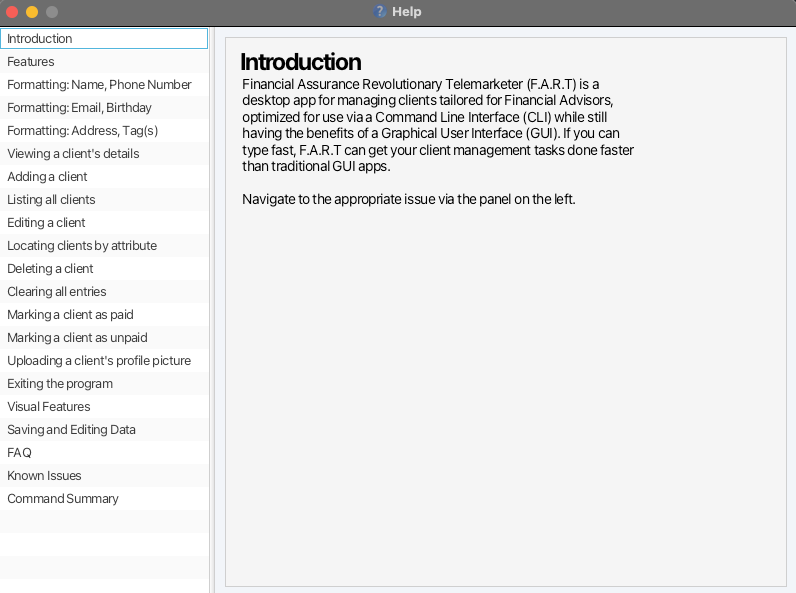
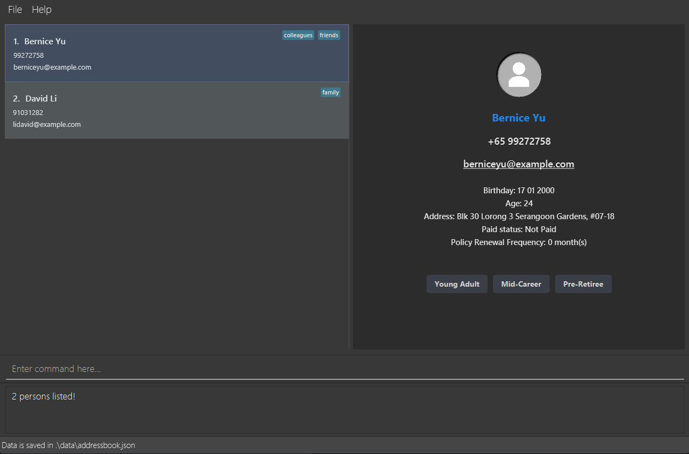

Financial Assurance Revolutionary Telemarketer (FART) is a **desktop app for managing contacts just for you Financial Advisors, optimized for use via a Command Line Interface** (CLI) while still having the benefits of a Graphical User Interface (GUI). If you can type fast, FART can get your contact management tasks done faster than traditional GUI apps.

* Table of Contents
{:toc}

--------------------------------------------------------------------------------------------------------------------

## Quick start

1. Ensure you have Java `17` or above installed in your Computer.
   1. You can check which version of Java you are currently running by entering `java -version` into a command terminal.
   2. Should you require help, [here](https://www.oracle.com/java/technologies/downloads/#java17) is the download link to Java '17'
   3. After accessing the website, please choose the right download link for your operating system (Linux, macOS or Windows)

2. Download the latest `.jar` file from [here](https://github.com/AY2425S1-CS2103T-F14b-4/tp/releases/tag/v1.4).

3. Copy the file to the folder you want to use as the _home folder_ for your FART.
   1. A good home folder would be the Downloads folder as it makes the next step easier.

4. Open a command terminal, `cd` into the folder you put the jar file in, and use the `java -jar fart_in_a.jar` command to run the application. 
   1. To open the command terminal, open the terminal app for Linux/macOS users, and Windows Powershell for Windows Users.
   2. For most users, type `cd Downloads` in the terminal window to navigate to the Downloads folder.
   3. Alternatively, you may navigate to the folder using File Explorer, then right click it and select `Open in Terminal`
5. A GUI similar to the below should appear in a few seconds. Note how the app contains some sample data. 
   

6. Type the command in the command box and press Enter to execute it. e.g. typing **`help`** and pressing Enter will open the help window. 
   Some example commands you can try:

   * `list` : Lists all contacts.

   * `add n/John Doe p/98765432 e/johnd@example.com a/John street, block 123, #01-01 b/11 09 2001` : Adds a contact named `John Doe` to the FART book and automatically marks them as unpaid.

   * `delete 3` : Deletes the 3rd contact shown in the current list.

   * `paid 3 f/6` : Marks the 3rd contact shown in the current list as paid and sets the policy renewal frequency to 6 months.

   * `unpaid 3` : Marks the 3rd contact shown in the current list as unpaid and changes the policy renewal frequency to 0.

   * `clear` : Deletes all contacts.

   * `find n/john`  : Displays all contacts with name(s) matching "john"

   * `exit` : Exits the app.

6. Refer to the [Features](#features) below for details of each command.

--------------------------------------------------------------------------------------------------------------------

## Features

**:information_source: Notes about the command format:** 

* Words in `UPPER_CASE` are the parameters to be supplied by the user. 
  e.g. in `add n/NAME`, `NAME` is a parameter which can be used as `add n/John Doe`.

* Items in square brackets are optional. 
  e.g. `n/NAME [t/TAG]` can be used as `n/John Doe t/friend` or as `n/John Doe`.

* Items with `…`​ after them can be used multiple times including zero times. 
  e.g. `[t/TAG]…​` can be used as ` ` (i.e. 0 times), `t/friend`, `t/friend t/family` etc.

* Parameters can be in any order. 
  e.g. if the command specifies `n/NAME p/PHONE_NUMBER`, `p/PHONE_NUMBER n/NAME` is also acceptable.

* Extraneous parameters for commands that do not take in parameters (such as `help`, `list`, `exit` and `clear`) will be ignored. 
  e.g. if the command specifies `help 123`, it will be interpreted as `help`.

* If you are using a PDF version of this document, be careful when copying and pasting commands that span multiple lines as space characters surrounding line-breaks may be omitted when copied over to the application.

### Viewing help : `help`

Shows a message explaining how to access the help page.

Format: `help`

### Adding a person: `add`

Adds a person to the FART book.

Format: `add n/NAME p/PHONE_NUMBER e/EMAIL [a/ADDRESS] b/BIRTHDAY [t/TAG]…​`

:bulb: **Tip:**
A person can have any number of tags (including 0)

Examples:
* `add n/John Doe p/98765432 e/johnd@example.com a/John street, block 123, #01-01 b/11 09 2001`
* `add n/Betsy Crowe t/friend e/betsycrowe@example.com a/Newgate Prison p/1234567 b/11 09 2001 t/criminal`

**Note:**
1. As of version 1.4, only valid email address (in the form local-part@domain.com) and Singapore phone numbers are accepted.
Birthdays should be added in DD MM YYYY format.
2. You may add duplicate contacts (i.e., contacts with the same name, case insensitive) but the AddressBook will prompt you
to confirm that you are adding a duplicate contact.

### Listing all persons : `list`

Shows a list of all persons in the FART book.

Format: `list`

### Editing a person : `edit`

Edits an existing person in the FART book.

Format: `edit INDEX [n/NAME] [p/PHONE] [e/EMAIL] [a/ADDRESS] [b/BIRTHDAY] [t/TAG]…​`

* Edits the person at the specified `INDEX`. The index refers to the index number shown in the displayed person list. The index **must be a positive integer** 1, 2, 3, …​
* At least one of the optional fields must be provided.
* Existing values will be updated to the input values.
* When editing tags, the existing tags of the person will be removed i.e. adding of tags is not cumulative.
* You can remove all the person’s tags by typing `t/` without
    specifying any tags after it.

Examples:
*  `edit 1 p/91234567 e/johndoe@example.com` Edits the phone number and email address of the 1st person to be `91234567` and `johndoe@example.com` respectively.
*  `edit 2 n/Betsy Crower t/` Edits the name of the 2nd person to be `Betsy Crower` and clears all existing tags.

### Locating persons by attribute: `find`

Need to quickly find a client by their address or something other than their name? Use this command to find clients whose attributes contain any of the given keywords.

Format: `find [n/NAME] [p/PHONE] [e/EMAIL] [a/ADDRESS] [b/BIRTHDAY] [t/TAG]…​`

* The search is case-insensitive. e.g. `hans` will match `Hans`.
* At least one of the optional fields must be provided.
* Keywords are matched against the attribute that is inputted (i.e. searching for names will match against all names).
* Partial matches of a keyword will also be returned. e.g. ``9123`` will return clients
with the phone number ``91234567``.

Examples:
* `find n/John` returns clients with names `john` and `John Doe`.
* `find a/serangoon` returns ``Bernice Yu``, ``David Li``.

### Deleting a person : `delete`

Deletes the specified person from the FART book.

Format: `delete INDEX`

* Deletes the person at the specified `INDEX`.
* The index refers to the index number shown in the displayed person list.
* The index **must be a positive integer** 1, 2, 3, …​

Examples:
* `list` followed by `delete 2` deletes the 2nd person in the FART book.
* `find Betsy` followed by `delete 1` deletes the 1st person in the results of the `find` command.

**Note:**
1. As a `delete` command cannot be undone, the FART Book will first prompt you to confirm that the
 contact that you want to delete is correct. If you select `No`, the deletion will be aborted.
### Clearing all entries : `clear`

Clears all entries from the FART book.

Format: `clear`

**Note:**
1. A `clear` command cannot be undone, the FART Book will first prompt you to confirm that the
   you wish to clear the book. If you select `No`, the clear action will be aborted.
2. If you do change your mind after clearing the FART book, you may retrieve the sample data again
by deleting the `addressbook.json` file in the `data` folder, then launching FART again.

### Marking a person as paid: `paid`

Marks the specified person from the FART book as paid.

Format: `paid INDEX f/FREQUENCY`

* Marks the person at the specified `INDEX` as paid.
* The index refers to the index number shown in the displayed person list.
* The index **must be a positive integer** 1, 2, 3, …​
* The frequency is the number of months between policy renewals and it can only be 1, 3, 6, or 12.
* The frequency will indicate which month the person will be automatically updated to unpaid.
Examples:
* `list` followed by `paid 2 f/ 6` marks the 2nd person in the FART book as paid and the policy renewal frequency to 6 months.
* `find Betsy` followed by `paid 1 f/ 6` marks the 1st person in the results of the `find` command as paid.

### Marking a person as unpaid: `unpaid`

Marks the specified person from the FART book as unpaid.

Format: `unpaid INDEX`

* Marks the person at the specified `INDEX` as unpaid.
* The index refers to the index number shown in the displayed person list.
* The index **must be a positive integer** 1, 2, 3, …​
* Changes the policy renewal frequency to 0

Examples:
* `list` followed by `unpaid 2` marks the 2nd person in the FART book as unpaid.
* `find Betsy` followed by `unpaid 1` marks the 1st person in the results of the `find` command as unpaid.

### Exiting the program : `exit`

Exits the program.

Format: `exit`

### Viewing a Client's Details
* When the app starts, a placeholder on the right panel will prompt you to select a contact on the list.
* **Double-click** on a contact in the contact list to bring up a more detailed view of the person, including information like address and birthday

  **:information_source: Note!** 
The displayed contact will persist and edits will not be reflected until you select another contact or close the FART book.
If you made any changes to the current contact on display, kindly double click to refresh the detailed view.

### Visual Features
FART has some handy visual cues that highlight certain clients.

| Feature                   | Details                                                                                                                                                                                                                                                                                                                         | Examples |
|---------------------------|---------------------------------------------------------------------------------------------------------------------------------------------------------------------------------------------------------------------------------------------------------------------------------------------------------------------------------|----------|
| **Net Worth Tagging**     | You can add tags to clients that say `"highnetworth"`, `"midnetworth"`, `"lownetworth"`  that will be highlighted.    Each client can only have one net worth tag at a time.  (e.g. if you add a `"highnetworth"` tag to a client who already has a "midnetworth" tag,  then the existing tag will be removed) |          |
| **Birthday Highlighting** | When a client's birthday is approaching or has recently passed (**7 days** before and after   the current date), his name will turn orange. Take this chance to wish him a happy birthday!                                                                                                                                   |          |

### Saving the data

FART data are saved in the hard disk automatically after any command that changes the data. There is no need to save manually.
The location of where the data is stored is specified at the bottom status bar of the app.

### Editing the data file

FART data are saved automatically as a JSON file `[JAR file location]/data/addressbook.json`. Advanced users are welcome to update data directly by editing that data file.

:exclamation: **Caution:**
If your changes to the data file makes its format invalid, FART will discard all data and start with an empty data file at the next run. Hence, it is recommended to take a backup of the file before editing it. 
Furthermore, certain edits can cause FART to behave in unexpected ways (e.g., if a value entered is outside of the acceptable range). Therefore, edit the data file only if you are confident that you can update it correctly.

--------------------------------------------------------------------------------------------------------------------

## Glossary

* 

--------------------------------------------------------------------------------------------------------------------

## FAQ

**Q**: How do I transfer my data to another Computer? 
**A**: Install the app in the other computer and overwrite the empty data file it creates with the file that contains the data of your previous FART home folder.

--------------------------------------------------------------------------------------------------------------------

## Known issues

1. **When using multiple screens**, if you move the application to a secondary screen, and later switch to using only the primary screen, the GUI will open off-screen. The remedy is to delete the `preferences.json` file created by the application before running the application again.
2. **If you minimize the Help Window** and then run the `help` command (or use the `Help` menu, or the keyboard shortcut `F1`) again, the original Help Window will remain minimized, and no new Help Window will appear. The remedy is to manually restore the minimized Help Window.

--------------------------------------------------------------------------------------------------------------------

## Command summary

| Action     | Format, Examples                                                                                                                                                                                |
|------------|-------------------------------------------------------------------------------------------------------------------------------------------------------------------------------------------------|
| **Add**    | `add n/NAME p/PHONE_NUMBER e/EMAIL [a/ADDRESS] b/BIRTHDAY [t/TAG]…​`   e.g., `add n/James Ho p/91234567 e/jamesho@example.com a/123, Clementi Rd, 1234665 b/11 09 2001 t/friend t/colleague` |
| **Clear**  | `clear`                                                                                                                                                                                         |
| **Delete** | `delete INDEX`  e.g., `delete 3`                                                                                                                                                             |
| **Edit**   | `edit INDEX [n/NAME] [p/PHONE_NUMBER] [e/EMAIL] [a/ADDRESS] [t/TAG]…​`  e.g.,`edit 2 n/James Lee e/jameslee@example.com`                                                                     |
| **Find**   | `find [n/NAME] [p/PHONE_NUMBER] [e/EMAIL] [a/ADDRESS] [t/TAG]…​`  e.g.,`find e/jameslee@example.com`                                                                                         |
| **List**   | `list`                                                                                                                                                                                          |
| **Help**   | `help`                                                                                                                                                                                          |
| **Paid**   | `paid INDEX f/FREQUENCY`  e.g., `paid 3 f/ 3`                                                                                                                                                |
| **Unpaid** | `unpaid INDEX`  e.g., `unpaid 3`                                                                                                                                                             |
