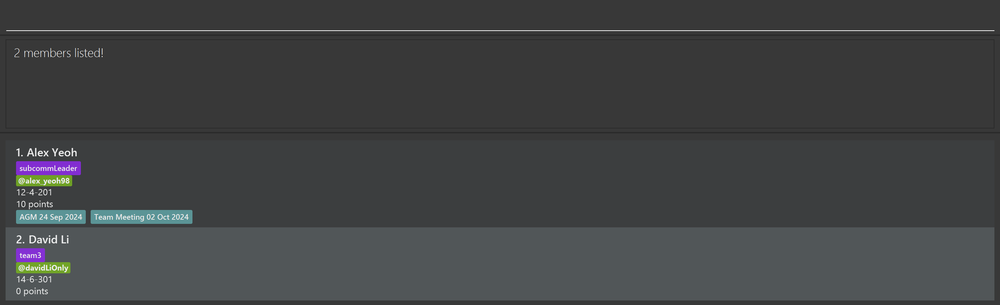

# CFG User Guide

ContactsForGood (CFG) is a **desktop app for managing contacts, optimized for use via a Command Line Interface** (CLI) while still having the benefits of a Graphical User Interface (GUI). If you can type fast, CFG can get your contact management tasks done faster than traditional GUI apps.

<!-- * Table of Contents -->
<page-nav-print />

--------------------------------------------------------------------------------------------------------------------

## Quick start

1. Ensure you have Java `17` or above installed in your Computer.

2. Download the latest `.jar` file from [here](https://github.com/se-edu/addressbook-level3/releases).

3. Copy the file to the folder you want to use as the _home folder_ for your AddressBook.

4. Open a command terminal, `cd` into the folder you put the jar file in, and use the `java -jar addressbook.jar` command to run the application. 
   A GUI similar to the below should appear in a few seconds. Note how the app contains some sample data. 
   

5. Type the command in the command box and press Enter to execute it. e.g. typing **`help`** and pressing Enter will open the help window. 
   Some example commands you can try:

   * `list` : Lists all contacts.

   * `add r/volunteer h/30 n/John Doe p/98765432 e/johnd@example.com a/John street, block 123, #01-01` : Adds a 
     contact named `John Doe` with a `volunteer` role to the Address Book.

   * `delete 3` : Deletes the 3rd contact shown in the current list.

   * `clear` : Deletes all contacts.

   * `exit` : Exits the app.

6. Refer to the [Features](#features) below for details of each command.

--------------------------------------------------------------------------------------------------------------------

## Features

<box type="info" seamless>

**Notes about the command format:** 

* Words in `UPPER_CASE` are the parameters to be supplied by the user. 
  e.g. in `add n/NAME`, `NAME` is a parameter which can be used as `add n/John Doe`.

* Items in square brackets are optional. 
  e.g `n/NAME [t/TAG]` can be used as `n/John Doe t/friend` or as `n/John Doe`.

* Items with `…`​ after them can be used multiple times including zero times. 
  e.g. `[t/TAG]…​` can be used as ` ` (i.e. 0 times), `t/friend`, `t/friend t/family` etc.

* Parameters can be in any order. 
  e.g. if the command specifies `n/NAME p/PHONE_NUMBER`, `p/PHONE_NUMBER n/NAME` is also acceptable.

* Extraneous parameters for commands that do not take in parameters (such as `help`, `exit` and `clear`) will be ignored. 
  e.g. if the command specifies `help 123`, it will be interpreted as `help`.

* If you are using a PDF version of this document, be careful when copying and pasting commands that span multiple lines as space characters surrounding line-breaks may be omitted when copied over to the application.
</box>

### Viewing help : `help`

Shows a message explaning how to access the help page.

Format: `help`

### Adding a contact: `add`

This command adds a contact to the address book. 
There are 4 types of contacts: Volunteer, Donor, Partner, Person(default) 

Format: `add [r/ROLE] n/NAME p/PHONE_NUMBER e/EMAIL a/ADDRESS [t/TAG]…​ 
        [h/HOURS] [d/DONATED_AMOUNT] [ped/PARTNERSHIP_END_DATE]`

- `ROLE` (Optional): Specifies the type of contact. If not provided, the contact will be added as a general `Person`.
- `NAME`: The contact's full name.
- `PHONE_NUMBER`: The contact's phone number.
- `EMAIL`: The contact's email address.
- `ADDRESS`: The contact's physical address.
- `TAG` (Optional): Additional tags associated with the contact.
- Role-specific fields(not required for `Person`)
  - **Volunteer**: `h/HOURS` :required for volunteers, representing contributed hours.
  - **Donor**: `d/DONATED_AMOUNT` :required for donors, representing total donation amount in thousands of USD.
  - **Partner**: `ped/PARTNERSHIP_END_DATE` :required for partners, representing the partnership's end date.

Note:
Role-specific fields must correspond to the type of the role. For example, if you add a contact with role of 
`Volunteer`, you must also provide `h/HOURS`. Similarly, if the role of the contact is `Donor`, `d/DONATED_AMOUNT` 
is required, and for `Partner`, `ped/PARTNERSHIP_END_DATE` must be provided.  
If the specified role does not match with the specified field, the add command will be deemed invalid.

<box type="tip" seamless>

**Tip:** A person can have any number of tags (including 0)
</box>

Examples:
* `add r/volunteer h/10 n/John Doe p/98765432 e/johnd@example.com a/John street, block 123, #01-01`
* `add r/donor d/100 n/Betsy Crowe t/friend e/betsycrowe@example.com a/Newgate Prison p/1234567 t/rich`

### Listing all persons : `list`

Shows a list of all persons in the address book.

Format: `list`

### Sorting the displayed list: `sort`

Sorts the currently visible list of persons by a specified field. 

Format: `sort [s/SORT_OPTION]`

* You can use `sort` to arrange the contacts in the list you're currently viewing, whether it's the full list or a subset from commands like `search`.
* If no sort option is provided, `sort` will restore the list to its original order (i.e. the order in which contacts were added).
* The sort order remains active until you apply a new sort option.
* For *role-specific* sort options (e.g. `hours`):
  * Role contacts are sorted by the relevant criterion. 
  * Non-role contacts are placed at the back.

<box type="tip" seamless>

**Tip:** Supported sort options include:
* `name`: Sorts contacts alphabetically by name.
* `hours`: Sorts volunteers by hours contributed.
* `donations`: Sorts donors by donation amount
* `end_date`: Sorts partners by partnership end date.
</box>

Examples:
* `sort`
* `sort s/name`
* `sort s/hours`

### Editing a person : `edit`

Edits an existing person in the address book.

Format: `edit INDEX [r/ROLE] [n/NAME] [p/PHONE] [e/EMAIL] [a/ADDRESS] [t/TAG]…​
         [h/HOURS] [d/DONATED_AMOUNT] [ped/PARTNERSHIP_END_DATE]`

* Edits the person at the specified `INDEX`. The index refers to the index number shown in the displayed person list. The index **must be a positive integer** 1, 2, 3, …​
* At least one of the optional fields must be provided.
* Existing values will be updated to the input values.
* When editing tags, the existing tags of the person will be removed i.e adding of tags is not cumulative.
* You can remove all the person’s tags by typing `t/` without
    specifying any tags after it.
* Role-specific fields must correspond to the resulting role after editing.
  For example, if you change the role to `Volunteer`, you must also provide `h/HOURS`.  
  Similarly, if the role is changed to `Donor`, `d/DONATED_AMOUNT` is required,  
  and for `Partner`, `ped/PARTNERSHIP_END_DATE` must be provided.  
  If the resulting role does not have the specified field, the edit will be invalid.

Examples:
*  `edit 1 p/91234567 e/johndoe@example.com` Edits the phone number and email address of the 1st person to be `91234567` and `johndoe@example.com` respectively.
*  `edit 2 n/Betsy Crower t/` Edits the name of the 2nd person to be `Betsy Crower` and clears all existing tags.

### Searching persons by field: `search`

Search persons whose fields match the keywords given.

Format: `search PREFIX/ KEYWORD [MORE_PREFIX/ KEYWORD ...]`

* The search is case-insensitive. e.g `hans` will match `Hans`
* Search is restricted to the fields indicated by the provided prefixes.
* For name searches, the order of keywords does not matter (e.g., Hans Bo will match Bo Hans).
* The order of the prefixes provided does not affect search results. e.g. `search n/ alex t/ friends` will return the same result as `search t/ friends n/ alex`
* Tag inputs must be alphanumeric
* Only full words will be matched e.g. `friend` will not match `friends`
* For searches with multiple prefixes, only persons matching all keywords corresponding to the prefixes will be returned

Examples:  
1. **Person A:** `name`: John Doe `tag`: colleague `group`: blood drive  
2. **Person B:** `name`: Alex Yeoh `tag`: friends  
3. **Person C:** `name`: David Li `tag`: friends `group`: blood drive
* `search n/ john` returns persons with the name `john` like `John Doe`
* `search t/ friends` returns all persons tagged as friends like `Alex Yeoh` and `David Li`
* `search n/ david t/ friends g/ blood drive` returns all persons with name matching `david`, tag matching `friends` and in group `blood drive` like `David Li`.  
    

### Deleting a person : `delete`

Deletes the specified person from the address book.

Format: `delete INDEX`

* Deletes the person at the specified `INDEX`.
* The index refers to the index number shown in the displayed person list.
* The index **must be a positive integer** 1, 2, 3, …​

Examples:
* `list` followed by `delete 2` deletes the 2nd person in the address book.
* `search n/Betsy` followed by `delete 1` deletes the 1st person in the results of the `search` command.

### Clearing all entries : `clear`

Clears all entries from the address book.

Format: `clear`

### Creating a group : `createGroup`

Creates a new group with people as members.

Format: `createGroup g/GROUP_NAME m/[INDICES]`

* Creates a new group with name `GROUP_NAME`.
* Adds the persons at the specified `INDICES` to the group. 
  Indices refer to the index numbers shown in the displayed person list.
  There must be at least one index provided, and indices should be separated by a space.
* There cannot be two groups with the same name. If a group
  with the given `GROUP_NAME` currently exists, the command will fail.

### Deleting a group: `deleteGroup`

Deletes a group.

Format: `deleteGroup g/GROUP_NAME`

* Deletes group named `GROUP_NAME`
* Group named `GROUP_NAME` must exist.

### Exiting the program : `exit`

Exits the program.

Format: `exit`

### Saving the data

AddressBook data are saved in the hard disk automatically after any command that changes the data. There is no need to save manually.

### Editing the data file

AddressBook data are saved automatically as a JSON file `[JAR file location]/data/addressbook.json`. Advanced users are welcome to update data directly by editing that data file.

<box type="warning" seamless>

**Caution:**
If your changes to the data file makes its format invalid, AddressBook will discard all data and start with an empty data file at the next run.  Hence, it is recommended to take a backup of the file before editing it. 
Furthermore, certain edits can cause the AddressBook to behave in unexpected ways (e.g., if a value entered is outside the acceptable range). Therefore, edit the data file only if you are confident that you can update it correctly.
</box>

### Archiving data files `[coming in v2.0]`

_Details coming soon ..._

--------------------------------------------------------------------------------------------------------------------

## FAQ

**Q**: How do I transfer my data to another Computer? 
**A**: Install the app in the other computer and overwrite the empty data file it creates with the file that contains the data of your previous AddressBook home folder.

--------------------------------------------------------------------------------------------------------------------

## Known issues

1. **When using multiple screens**, if you move the application to a secondary screen, and later switch to using only the primary screen, the GUI will open off-screen. The remedy is to delete the `preferences.json` file created by the application before running the application again.
2. **If you minimize the Help Window** and then run the `help` command (or use the `Help` menu, or the keyboard shortcut `F1`) again, the original Help Window will remain minimized, and no new Help Window will appear. The remedy is to manually restore the minimized Help Window.

--------------------------------------------------------------------------------------------------------------------

## Command summary

Action     | Format, Examples
-----------|----------------------------------------------------------------------------------------------------------------------------------------------------------------------
**Add**    | `add [r/ROLE] n/NAME p/PHONE_NUMBER e/EMAIL a/ADDRESS [t/TAG]…​ [h/HOURS] [d/DONATED_AMOUNT] [ped/PARTNERSHIP_END_DATE]`   e.g., `add r/volunteer h/19 n/James Ho p/22224444 e/jamesho@example.com a/123, Clementi Rd, 1234665 t/friend t/colleague`
**Clear**  | `clear`
**Delete** | `delete INDEX`  e.g., `delete 3`
**Edit**   | `edit INDEX [n/NAME] [p/PHONE_NUMBER] [e/EMAIL] [a/ADDRESS] [t/TAG]…​ [h/HOURS] [d/DONATED_AMOUNT] [ped/PARTNERSHIP_END_DATE]`  e.g.,`edit 2 n/James Lee e/jameslee@example.com`
**Search**   | `search PREFIX/ KEYWORD [MORE_PREFIX/ KEYWORD ...]`  e.g., `search n/ john`
**List**   | `list`
**Help**   | `help`
**Create Group** | `createGroup g/GROUP_NAME m/[INDICES]`
**View Group**   | `viewGroup g/GROUP_NAME`
**Delete Group** | `deleteGroup g/GROUP_NAME`
