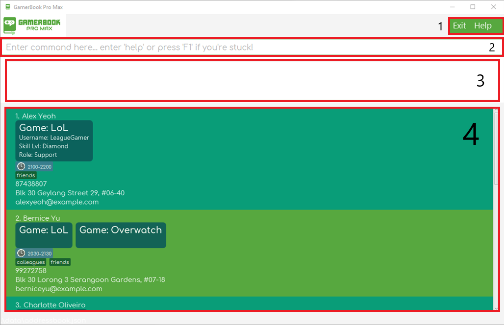

# GamerBook Pro Max User Guide

GamerBook Pro Max is a **desktop app designed to make managing your gaming contacts a breeze**.
This app is useful for gamers who have many friends online across different games.

GamerBook Pro Max lets you type quick commands using a Command Line Interface (CLI) while still enjoying the ease and
visuals of a Graphical User Interface (GUI).

You get the best of both worlds: speedy command-based interactions with an intuitive, user-friendly display!
If you can type fast, GamerBook Pro Max can get your contact management tasks done faster than traditional GUI apps.

<!-- * Table of Contents -->

  <page-nav-print />

 

--------------------------------------------------------------------------------------------------------------------

## Installation and Quick Start

1. **Check your Java version**: Ensure you have [Java `17`](https://www.oracle.com/sg/java/technologies/downloads/) or
   above installed in your Computer. To check, open a command terminal (like Command Prompt) and type: `java -version`. 
   Ensure that the version returned is 17 or above, or install it if you have not done so.

2. **Download GamerBook Pro Max**: Download the latest `gamerbook.jar` file
   from [here](https://github.com/AY2425S1-CS2103T-T12-4/tp/releases).  
   

3. **Set Up Your GamerBook Folder**: Copy the file to the folder you want to use as the _home folder_ for your
   GamerBook.

4. **Run the App**: Open a command terminal, use [`cd`](https://owlcation.com/stem/how-to-open-files-in-terminal) to navigate into the folder you put the jar file in, and use
   the `java -jar gamerbook.jar` command to run the application. 
   **Alternative**: Click on the gamerbook.jar application icon as you would any normal app. 
   A GUI similar to the below should appear in a few seconds. Note how the app contains some sample data. 

5. **Try Out Some Commands** : Type the command in the command box and press Enter to see it in action!
   Here are a few examples:
    * `help` : Opens the help window.

    * `list` : Lists all contacts, this is useful after you filter the GamerBook using commands such as `find`.

    * `add n/John Doe p/98765432 e/johnd@example.com a/John street, block 123, #01-01` : Adds a contact named `John Doe`
      to the GamerBook.

    * `delete 3` : Deletes the 3rd contact shown in the current list.

    * `clear` : Deletes all contacts.

    * `undo`  : If you just used `clear`, this will bring back all your contacts!

    * `exit` : Exits the app.

Refer to the [Commands](#commands) below for more details.
 

-------------------------------------------------

## Exploring the GUI

Our interface has a few key parts (check the image below for a visual guide):

1. **Menu Options**: Click the buttons in the top right to exit the app or open the help window.

2. **Command Input Box**: Type your commands here!

3. **Result Display Panel**: See the results of your commands or any error messages here.

4. **Person Cards Panel**: A list of all your contacts will appear here, each on their own card.

### Command Suggestion PopUp

Our Command Suggestion PopUp will assist you in quickly finding the right command as you type!

Each suggestion includes the command name, command format and any required details to use it effectively.

<box type="tip" seamless>

**To scroll through the suggestions**:

* Press `shift + up` or `shift + down` and the **current selection** will be highlighted in **blue**.  
  _In the image above, the **current selection** would be `editgame`._

**To quickly complete your commands**:

* If your **current selection** is correct press `tab` to autocomplete it within the command box.

**To look for a quick reference**:

* The PopUp stays open as you finish typing your command, so you can check it for syntax or details of the command you want to use.

</box>

<box type="info" seamless>

**Note:**

* Autocompleting will overwrite **ALL** text in the **Command Input Box**. Be careful when using it!

* The PopUp will adjust its position to stay fully visible, even if your app window is partially off-screen.

</box>

--------------------------------------------------------------------------------------------------------------------

## Important Notes about Command Formats

<box type="info" seamless>

* **Commands Are Case-Sensitive and All Lowercase**  
  Make sure to type commands exactly as shown.  
  e.g. `clear` is recognised as a command but not `Clear` or `cLEar`

* **Copying Commands from PDF**  
  If you are using a PDF version of this document, be careful when copying and pasting commands that span multiple lines
  as space characters surrounding line-breaks may be omitted when copied over to the application.
  </box>

### Understanding Commands Format
<box type="info" seamless>

* **Words in `UPPER_CASE`** are placeholders for you to replace with your own input.  
  e.g. `add n/NAME` means you would type something like `add n/John Doe`.

* **Items in square brackets are optional**.  
  e.g. `n/NAME [t/TAG]` can be used as `n/John Doe t/friend` or simply `n/John Doe`.

* **Items with `…`​ after them can be used multiple times.**  
  e.g. `[t/TAG]…​` can be used as `t/friend`, `t/friend t/family` etc.

* **Flexible Parameter Order**  
  e.g. if the command specifies `n/NAME p/PHONE_NUMBER`, `p/PHONE_NUMBER n/NAME` is also acceptable.

* **Ignored Extra Parameters** for commands that do not take in parameters (such as `help`, `list`, `exit`
  and `clear`)  
  e.g. if the command specifies `help 123`, it will be interpreted as `help`.
   
  </box>

### Understanding Parameters Format
<box type="info" seamless>

* `NAME` **only accepts alphanumeric characters and spaces**.  
  Names with special characters like `Flora-Ann` should be adapted by using spaces instead.

* `INDEX` **must be a must be a positive integer**  
  If it’s not, you’ll see an invalid command format error.

* `NAME` **is case-sensitive**.  
  Although duplicate contact names are not allowed, adding two separate contacts `Bobby Ang` and `bobby ang` would be
  allowed.

* `TIME-TIME` **must be within the same day**.  
  Use the format `HHmm-HHmm` for time ranges within the same day.  
  e.g. `1700-2200` is a valid time range whereas `2300-0100` is not a valid time range.

  Currently users can work around with this issue by breaking the overnight range down into 2 separate ranges.     
  e.g. `2300-0100` can be broken down into `2300-2359` and `0000-0100` and be accepted.

* `TIME-TIME`**cannot refer to a single point in time**
  The start and end times must be different (e.g. `1200-1200` is invalid).

</box>

--------------------------------------------------------------------------------------------------------------------

## Command Summary

| Action                                                   | Format, Examples                                                                                                                                                                                                               |
|----------------------------------------------------------|--------------------------------------------------------------------------------------------------------------------------------------------------------------------------------------------------------------------------------|
| [**Help**](#viewing-help-help)                           | `help`                                                                                                                                                                                                                         |
| [**List**](#listing-all-persons-list)                    | `list`                                                                                                                                                                                                                         |
| [**Add**](#adding-a-person-add)                          | `add n/NAME [p/PHONE_NUMBER] [e/EMAIL] [a/ADDRESS] [g/GAME]… [t/TAG]… [pt/TIME-TIME]…​`   e.g., `add n/James Ho p/22224444 e/jamesho@example.com a/123, Clementi Rd, 1234665 g/Overwatch t/friend t/colleague pt/2130-2359` |
| [**Edit**](#editing-a-person-edit)                       | `edit INDEX [n/NAME] [p/PHONE_NUMBER] [e/EMAIL] [a/ADDRESS] [g/GAME]… [t/TAG]… [pt/TIME-TIME]…​`  e.g.,`edit 2 n/James Lee e/jameslee@example.com`                                                                          |
| [**Delete**](#deleting-a-person-delete)                  | `delete INDEX`  e.g., `delete 3`                                                                                                                                                                                            |
| [**Clear**](#clearing-all-entries-clear)                 | `clear`                                                                                                                                                                                                                        |
| [**Exit**](#exiting-the-program-exit)                    | `exit`                                                                                                                                                                                                                         |
| [**AddGame**](#adding-a-game-addgame)                    | `addgame INDEX g/GAME [u/USERNAME] [s/SKILLLEVEL] [r/ROLE]​`  e.g.,`addgame 1 g/Overwatch u/Potato`                                                                                                                         |
| [**EditGame**](#editing-a-game-editgame)                 | `editgame INDEX g/GAME [u/USERNAME] [s/SKILLLEVEL] [r/ROLE]​`  e.g.,`editgame 1 g/Overwatch u/Potato`                                                                                                                       |
| [**DeleteGame**](#deleting-a-game-deletegame)            | `deletegame INDEX g/GAME`  e.g.,`deletegame 1 g/Overwatch`                                                                                                                                                                  |
| [**FavGame**](#favouriting-a-game-favgame)               | `favgame INDEX g/GAME`  e.g.,`favgame 2 g/Overwatch`                                                                                                                                                                        |
| [**UnFavGame**](#un-favouriting-a-game-unfavgame)        | `unfavgame INDEX g/GAME`  e.g.,`unfavgame 2 g/Overwatch`                                                                                                                                                                    |
| [**Find**](#locating-persons-by-name-find)               | `find KEYWORD [MORE_KEYWORDS]…`  e.g., `find James Jake`                                                                                                                                                                    |
| [**FindGame**](#locating-persons-by-game-name-findgame)  | `findgame KEYWORD [MORE_KEYWORDS]…`  e.g., `findgame Overwatch League`                                                                                                                                                  |
| [**FindTime**](#locating-persons-by-time-range-findtime) | `findtime TIME-TIME [TIME-TIME]…`  e.g., `findtime 1800-1900 2000-2200 `                                                                                                                                                    |
| [**Undo**](#undoing-previous-command-undo)               | `undo`                                                                                                                                                                                                                         |
| [**Save**](#saving-the-data-file-save)                   | `save`                                                                                                                                                                                                                         |
| [**Load**](#loading-the-data-file-load)                  | `load`                                                                                                                                                                                                                         |

--------------------------------------------------------------------------------------------------------------------

## Commands

This section provides details on the usage of each command.

 

### Basic Commands

 

#### **Viewing help :** `help`

Displays the help window. Also accessible by pressing the `F1` key.

The help window can be closed by `F1` and `Esc` keys

Format: `help`

Output:

 

#### **Listing all persons :** `list`

Lists all persons in GamerBook. Use this after you are done searching for someone!

Format: `list`  
Output: `Listed all persons`

 

#### **Adding a person :** `add`

Adds a person with optional details like phone, email, address, games, tags, and preferred time.

Format: `add n/NAME [p/PHONE_NUMBER] [e/EMAIL] [a/ADDRESS] [g/GAME]… [t/TAG]… [pt/TIME-TIME]…​`  
Output: `New person added: DETAILS…`

**Notes**:
* A person can have any number of tags, games and preferred times (including 0).
* `TIME-TIME` should be in the format `HHmm-HHmm` and **must be a valid time range within the same day.**  
  e.g. `1700-2200` is a valid time range whereas `2300-0100` is not a valid time range.
* `TIME-TIME` **time ranges cannot be a single point in time.**
  e.g. `1200-1200` is not a valid time range.

Examples:

* `add n/John Doe p/98765432 e/johnd@example.com a/John street, block 123, #01-01`
* `add n/Betsy Crowe t/friend e/betsycrowe@example.com a/Newgate Prison p/1234567 t/criminal pt/2100-2300`

 

#### **Editing a person :** `edit`

Edits an existing person in the GamerBook.

Format: `edit INDEX [n/NAME] [p/PHONE_NUMBER] [e/EMAIL] [a/ADDRESS] [g/GAME]… [t/TAG]… [pt/TIME-TIME]…​`  
Output: `Edited Person: DETAILS…`

**Notes**:
* Edits the person at the specified `INDEX`. The index refers to the index number shown in the displayed person list.
  The index **must be a positive integer** 1, 2, 3, …​
* At least one of the optional fields must be provided.
* Existing values will be updated to the input values.
* When editing tags, games or preferred times, the existing tags/games/preferred times of the person will be removed i.e
  adding of tags/games is not cumulative.
* You can remove all the person’s tags/games/preferred times by typing `t/`, `g/` or `pt/` without
  specifying any tags after it.

Examples:

* `edit 1 p/91234567 e/johndoe@example.com` Edits the phone number and email address of the 1st person to be `91234567`
  and `johndoe@example.com` respectively.
* `edit 2 n/Matthew g/Overwatch g/Valorant` Edits the name of the 2nd person to be `Matthew` with games `Overwatch`
  and `Valorant`.
* `edit 2 n/Betsy Crower t/ pt/` Edits the name of the 2nd person to be `Betsy Crower` and clears all existing tags and
  preferred times.

 

#### **Deleting a person :** `delete`

Deletes the specified person from the GamerBook.

Format: `delete INDEX`  
Output: `Deleted Person: DETAILS…`   

**Notes**:
* Deletes the person at the specified `INDEX`.
* The index refers to the index number shown in the displayed person list.
* The index **must be a positive integer** 1, 2, 3, …​

Examples:

* `list` followed by `delete 2` deletes the 2nd person in the GamerBook.
* `find Betsy` followed by `delete 1` deletes the 1st person in the results of the `find` command.

 

#### **Clearing all entries :** `clear`

Clears all entries from the GamerBook.

Format: `clear`  
Output: `Address book has been cleared!`

 

#### **Exiting the program :** `exit`

Exits the program.

Format: `exit`  
Output: The GamerBook application window will be closed.

### Game Management Commands

 

#### **Adding a game :** `addgame`

Adds a game to an existing person in the GamerBook.

Format: `addgame INDEX g/GAME [u/USERNAME] [s/SKILLLEVEL] [r/ROLE]​`  
Output: `Added Game to Person: DETAILS…`

**Notes**:
* Adds a game `GAME` to the person at the specified `INDEX`. The index refers to the index number shown in the displayed
  person list. The index **must be a positive integer** 1, 2, 3, …​
* If the game `GAME` already exists for that person, it will not be added. It may be edited using the `editgame` command
  instead.

Examples:

* `addgame 1 g/Overwatch` Adds the game `Overwatch` to the 1st person.
* `addgame 2 g/League of Legends u/Potato s/Pro r/Support` Adds the game `League of Legends` to the 2nd person with the
  following information: Username: `Potato` Skill level: `Pro` Role: `Support`

 

#### **Editing a game :** `editgame`

Edits the game of an existing person in the GamerBook.

Format: `editgame INDEX g/GAME [u/USERNAME] [s/SKILLLEVEL] [r/ROLE]​`  
Output: `Edited Game: DETAILS…`  

**Notes**:
* Edits the game `GAME` of the person at the specified `INDEX`. The index refers to the index number shown in the
  displayed person list. The index **must be a positive integer** 1, 2, 3, …​
* At least one of the optional fields must be provided.
* Existing values will be updated to the input values.

Examples:

* `editgame 1 g/Overwatch u/Potato` Edits the username of game `Overwatch` of the 1st person to be `Potato`.
* `editgame 2 g/League of Legends u/Potato s/Pro r/Support` Edits the game `League of Legends` of the 2nd person to have
  the following information: Username: `Potato` Skill level: `Pro` Role: `Support`

 

#### **Deleting a game :** `deletegame`

Deletes the specified game from an existing person in the GamerBook.

Format: `deletegame INDEX g/GAME`  
Output: `Deleted Game from Person: DETAILS…`  

**Notes**:
* Deletes the game `GAME` of the person at the specified `INDEX`.
* The index refers to the index number shown in the displayed person list.
* The index **must be a positive integer** 1, 2, 3, …​

Examples:

* `deletegame 1 g/Overwatch` Deletes the game `Overwatch` of the 1st person in the list(if there is a game `Overwatch` associated to the person). 

 

#### **Favouriting a game :** `favgame`

Gives a **singular** game under an existing person in the GamerBook the "favourite" status.

Format: `favgame INDEX g/GAME`
Output: `Favourited Game: GAME`  

**Notes**:
* Favourites the game `GAME` of the person at the specified `INDEX`. The index refers to the index number shown in the
  displayed person list. The index **must be a positive integer** 1, 2, 3, …​
* Favourited games are denoted by a star icon.
* There will be no observable change if this command is used on a game that is already given the "favourite" status.

Examples:

* `favgame 2 g/Overwatch` Sets the game "Overwatch" of the 2nd person to "favourite".

 

#### **Un-favouriting a game :** `unfavgame`

Removes the "favourite" status from a **singular** game under an existing person in the GamerBook.

Format: `unfavgame INDEX g/GAME`  
Output: `Unfavourited Game: GAME`  

**Notes**:
* Un-favourites the game `GAME` of the person at the specified `INDEX`. The index refers to the index number shown in
  the displayed person list. The index **must be a positive integer** 1, 2, 3, …​
* Once un-favourited, the star icon for that particular game should disappear.
* There will be no observable change if this command is used on a game that is not set to "favourite" status.

Examples:

* `unfavgame 3 g/LoL` Removes the "favourite" status from the game "LoL" of the 3rd person.

### Search Commands

 

#### **Locating persons by name :** `find`

Finds persons whose names contain any of the given keywords.

Format: `find KEYWORD [MORE_KEYWORDS]…`  
Output: `NUMBER persons listed!` where `NUMBER` is the number of matches.  

**Notes**:
* The search is **case-insensitive**. e.g `hans` will match `Hans`
* The order of the keywords does not matter. e.g. `Hans Bo` will match `Bo Hans`
* Only the name is searched.
* Only full words will be matched e.g. `Han` will not match `Hans`
* Persons matching at least one keyword will be returned (i.e. `OR` search).
  e.g. `Hans Bo` will return `Hans Gruber`, `Bo Yang`

Examples:

* `find John` returns `john` and `John Doe`
* `find alex david` returns `Alex Yeoh`, `David Li` 
  

   

#### **Locating persons by game name :** `findgame`

Finds persons whose games' names contain any of the given keywords.

Format: `findgame KEYWORD [MORE_KEYWORDS]…`   
Output: `NUMBER persons listed!` where `NUMBER` is the number of matches.  

**Notes**:
* The search is **case-insensitive**. e.g `lol` will match `LoL`
* The order of the keywords does not matter. e.g. `Impact Genshin` will match `Genshin Impact`
* Only the name of games is searched.
* Only full words will be matched e.g. `Legends` will not match `Legend`
* Persons matching at least one keyword will be returned (i.e. `OR` search).
  e.g. `Honkai Impact` will return `Genshin Impact`, `Honkai Star Rail`

Examples:

* `findgame lol` returns contacts with game name `LoL`
* `findgame honkai impact` returns contacts with game names `Genshin Impact`, `Honkai Star Rail` 
  

   

#### **Locating persons by time range :** `findtime`

Finds persons whose preferred time ranges overlap with any of given time ranges.

Format: `findtime TIME-TIME [TIME-TIME]…`  
Output: `NUMBER persons listed!` where `NUMBER` is the number of matches.  

**Notes**:
* `TIME-TIME` should be in the format `HHmm-HHmm` and must be a valid time range within the same day.  
  e.g. `1700-2200` is a valid time range whereas `2300-0100` is not a valid time range.
* `TIME-TIME` time ranges cannot be a single point in time.
  e.g. `1200-1200` is not a valid time range.
* You can enter more than one time range to search for.
* You can enter the same time twice e.g. `2300-2300` to only search that time.
* The search is border-sensitive. e.g. `1200-1300` will match `1300-1400`
* The order of ranges does not matter.
* Persons matching at least one range will be returned(i.e. `OR` search).

Examples:

* `findtime 2030-2100` returns persons who have at least one preferred time range overlaps with the specified range.
* `findtime 2030-2100 2230-2330` returns persons with any preferred time range overlapping with any
  one of the specified ranges.

### Utility Commands

 

#### **Undoing previous command :** `undo`

<box type="important" seamless>

Worried about losing your data? You can `undo` most commands!
</box>

Undoes the previous command.
Only undoes commands that change the content of GamerBook or the displayed list of contacts.

Supported commands: `list`, `add`, `edit`, `addgame`, `editgame`, `deletegame`, `favgame`, `unfavgame`,
`find`, `findtime`, `delete`, `clear`

Format: `undo`  
Output: `Undid previous command: PREVIOUS COMMAND`

### Data storage

GamerBook data is saved automatically after any command that changes the data!  

Find the `addressbook` JSON file at the location `[JAR file location]/data/addressbook.json`.  

GamerBook data is loaded from `[JAR file location]/data/addressbook.json` automatically when you open the app.

 

#### **Saving the data file :** `save`

Manually saves the data in another JSON file `[JAR file location]/data/save.json`.  

Format: `save`  
Output: `Address book has been saved!`  

 

#### **Loading the data file :** `load`

Manually loads the data from JSON file `[JAR file location]/data/save.json`.  

Format: `load`  
Output: `The saved address book has been loaded!`

<box type="warning" seamless>

**Caution:**
`load` is irreversible and cannot be undone by `undo` 
All the data you have in `[JAR file location]/data/addressbook.json` prior to using `load` will be lost!
</box>

 

#### **Editing the data file**

GamerBook data is saved automatically as a JSON file `[JAR file location]/data/addressbook.json` after every command. Advanced users are
welcome to update data directly by editing that data file.

<box type="warning" seamless>

**Caution:**
If your changes to the data file makes its format invalid, GamerBook will discard all data and start with an empty data
file at the next run. Hence, it is recommended to take a backup of the file before editing it. 
Furthermore, certain edits can cause the GamerBook to behave in unexpected ways (e.g., if a value entered is outside the
acceptable range). Therefore, edit the data file only if you are confident that you can update it correctly.
</box>
 

--------------------------------------------------------------------------------------------------------------------

## FAQ

**Q**: How do I transfer my data to another Computer? 
**A**: Install GamerBook on the new computer, and then copy the data file `addressbook.json` from your previous 
GamerBook home folder to the new installation’s data folder, typically located at `[JAR file location]/data/addressbook.json`. Replace the empty data file on the new computer with your copied file.

**Q**: What should I do if I accidentally delete someone from GamerBook? 
**A**: You can use the `undo` command right after the delete command to restore the deleted person’s data, or use `load` if you have been saving frequently.

**Q**: Should I ever use the `clear` command? 
**A**: The `clear` command deletes all entries in GamerBook. You should use it mainly to clear the sample data that GamerBook starts with.

**Q**: Why do my searches sometimes return unexpected results? 
**A**: GamerBook's search functions like `find` are case-insensitive, but they only match full words. If your search is not returning results, try again with full keywords like `John` instead of `J`.

**Q**: Can I undo more than one command? 
**A**: Yes! The `undo` command remembers your command history from when GamerBook was opened, and you can `undo` consecutive times.

**Q**: Why did my GamerBook open blank when I had data saved previously? 
**A**: You may have moved the data file `addressbook.json` or modified it incorrectly. We suggest saving frequently and avoid editing the `json` directly!
  

--------------------------------------------------------------------------------------------------------------------

## Known issues

1. **When using multiple screens**, if you move the application to a secondary screen, and later switch to using only
   the primary screen, the GUI will open off-screen. The remedy is to delete the `preferences.json` file created by the
   application before running the application again.
2. **If you minimize the Help Window** and then run the `help` command (or use the `Help` menu, or the keyboard
   shortcut `F1`) again, the original Help Window will remain minimized, and no new Help Window will appear. The remedy
   is to manually restore the minimized Help Window.

--------------------------------------------------------------------------------------------------------------------
