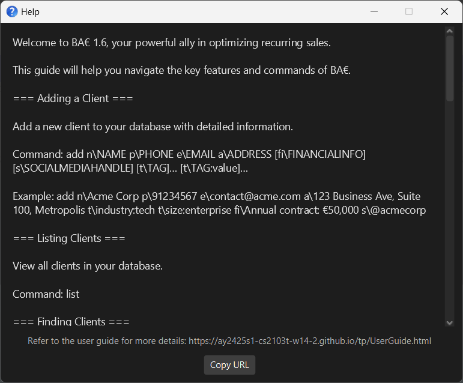

# BA€ User Guide

Thank you for choosing BA€! We know how important it is for salespeople to stay organized and efficient, especially when managing a large client network and making recurring sales. BA€ is designed to be your trusted assistant, streamlining your sales process by swiftly storing and retrieving client information. This allows you to focus on building lasting relationships and closing deals. Combining the speed of a Command Line Interface (CLI) with the ease of a Graphical User Interface (GUI), BA€ ensures your contact management is smoother and faster than ever before!

<!-- * Table of Contents -->
<page-nav-print />

--------------------------------------------------------------------------------------------------------------------

## Quick start

### Installation

1. Ensure Java `17` or above installed on your computer. If not you can download it from [here](https://www.oracle.com/java/technologies/downloads/#java17-windows).

1. Download the latest `.jar` file from [here](https://github.com/AY2425S1-CS2103T-W14-2/tp/releases).

1. Copy the file to the folder you want to use as the _home folder_ for BA€.

### Launching BA€

1. **Open Your Command Terminal**
   - Navigate to the folder where you saved the `.jar` file using the `cd` command.
   - For more info on how to use the `cd` command, visit the following links:
     - For [Windows users](https://www.wikihow.com/Change-Directories-in-Command-Prompt)
     - For [Mac/Linux users](https://iboysoft.com/wiki/cd-mac-terminal.html)
1. **Start the App**
   - Enter the following command: `java -jar tp.jar`
   - Within a few seconds, the BA€ Address Book interface should display and should look something like this:  
     

### Using BA€

1. To get started, try entering some of these commands in the command box at the top of the app:

   * `help` : Opens the help menu detailing each command with an example format.

   * `add n\John Doe p\98765432 e\johnd@example.com a\3, 6th Ave fi\millionaire s\@jdoe` : Adds a contact named `John Doe` to the Address Book.

   * `list` : Lists all contacts.

   * `delete 3` : Deletes the 3rd contact shown in the current list.

   * `export format\csv` : Exports contact data in the CSV format.

   * `clear` : Deletes all contacts.

   * `exit` : Exits the app.

2. For more details on each command, refer to the [Features](#features) section below.

--------------------------------------------------------------------------------------------------------------------

## Features

<box type="info" seamless>

**Notes about the command format:** 

* Words in `UPPER_CASE` are the parameters to be supplied by the user. 
  e.g. in `add n\NAME`, `NAME` is a parameter which can be used as `add n\John Doe`.

* Items in square brackets are optional. 
  e.g `n\NAME [t\TAG]` can be used as `n\John Doe t\friend` or as `n\John Doe`.

* Items with `…`​ after them can be used multiple times including zero times. 
  e.g. `[t\TAG]…​` can be used as ` ` (i.e. 0 times), `t\friend`, `t\friend t\family` etc.

* Parameters can be in any order. 
  e.g. if the command specifies `n\NAME p\PHONE_NUMBER`, `p\PHONE_NUMBER n\NAME` is also acceptable.

* Extraneous parameters for commands that do not take in parameters (such as `help`, `list`, `exit` and `clear`) will be ignored. 
  e.g. if the command specifies `help 123`, it will be interpreted as `help`.

* If you are using a PDF version of this document, be careful when copying and pasting commands that span multiple lines as space characters surrounding line-breaks may be omitted when copied over to the application.
</box>

### Viewing help : `help`

Shows a window showing all commands and usage examples.

Format: `help`

### Adding a person: `add`

Adds a person to the address book.

Format: `add n\NAME p\PHONE_NUMBER e\EMAIL a\ADDRESS [fi\FINANCIALINFO] [s\SOCIALMEDIAHANDLE] [t\TAG]…​ [t\TAG:value]…​`

<box type="warning" seamless>

Name Constraints:  
* Names have to be unique, duplicates are not allowed, regardless of case. For example, `John Doe` and `john doe` would be considered duplicates and if one is already in the address book, the other will not be allowed to be added. We suggest adding some additional information to differentiate your contacts from one another, such as `John Tan NUS` instead of just `John Tan`
* Names must consist only of alphanumerics, spaces, forward slashes and apostrophes
* Names must not be longer than 200 characters

Phone Number Constraints:  
* Phone numbers must consist of digits `0` to `9`, with the option of a `+` sign at the beginning for the country code
* Phone numbers must not be more than 30 digits long

Email Address Constraints:  
* Email should be of the format `local@domain`
* `local` must only contain alphanumeric characters and these special characters, excluding the parentheses, (`+_.-`)
* `local` must not start or end with any special characters
* `domain` must only consist of alphanumeric characters, with no more than one hyphen (`-`) or period (`.`) in between any 2 alphanumeric characters.
* `domain` must end with at least 2 characters that are not a period (`.`)
* Duplication is not prevented/checked for, as it might be possible for some of our users' clients to be contacted through the same person, such as a secretary.

Address Constraints:  
* Address can take any characters except for `\`, but cannot begin with a space and cannot be blank

Financial Info Constraints:  
* Financial Info can take any valid characters except for `\`
* If multiple Financial Info entries are provided, only the last one will be recorded. For example, in `fi\high income fi\millionaire` only `millionaire` will be stored

Social Media Handle Constraints:  
* Social Media Handle can take any valid characters except for `\`
* If multiple Social Media Handle entries are provided, only the last one will be recorded. For example, in `s\@john123 s\@john456` only `@john456` will be stored

Tag Constraints:  
* A person can have any number of tags (including 0).
* A tag can be added with or without a value. For example, `t\client` and `t\insurance:No` are both valid tags.
* Only alphanumeric characters (alphabets and numbers) are supported in tag names.
* For tag values, only alphanumeric characters and periods in between numbers (eg `2.4`) are supported.
* Multiple of the same tags are not supported for a single contact. For example, `t\policy` and `t\policy: 223302B` would not be supported for a single contact.
* Negative numbers are not supported in tag values
* Operations such as `+, -, *, /` are also not supported in tag values

</box>

Command examples:
* `add n\John Doe p\98765432 e\johnd@example.com a\123 John street fi\millionaire s\@jon3 t\client t\priority:high`
* `add n\Betsy Crowe t\friend e\betsycrowe@example.com a\Newgate Prison p\1234567 t\criminal fi\noIncome s\@bestyC`

### Listing all persons : `list`

Shows a list of all persons in the address book.

Format: `list`

### Editing a person : `edit`

Edits an existing person in the address book.

Format: `edit INDEX [n\NAME] [p\PHONE] [e\EMAIL] [a\ADDRESS] [fi\FINANCIALINFO] [s\SOCIALMEDIAHANDLE\ [t\TAG]…​ [t\TAG:value]…​`

* Edits the person at the specified `INDEX`. The index refers to the index number shown in the displayed person list. The index **must be a positive integer** 1, 2, 3, …​
* At least one of the optional fields must be provided.
* Existing values will be updated to the input values.
* When editing tags, the existing tags of the person will be removed i.e adding of tags is not cumulative.
* You can remove all the person’s tags by typing `t\` without
    specifying any tags after it.
* The same restrictions of input values seen in the `add` command apply here.

Examples:
*  `edit 1 p\91234567 e\johndoe@example.com` Edits the phone number and email address of the 1st person to be `91234567` and `johndoe@example.com` respectively.
*  `edit 2 n\Betsy Crower t\ ` Edits the name of the 2nd person to be `Betsy Crower` and clears all existing tags.

### Locating persons by name: `find`

Finds persons whose names contain any of the given keywords.

Format: `find KEYWORD [MORE_KEYWORDS]`

* The search is case-insensitive. e.g `hans` will match `Hans`
* The order of the keywords does not matter. e.g. `Hans Bo` will match `Bo Hans`
* Only the name is searched.
* Only full words will be matched e.g. `Han` will not match `Hans`
* Persons matching at least one keyword will be returned (i.e. `OR` search).
  e.g. `Hans Bo` will return `Hans Gruber`, `Bo Yang`

Examples:
* `find John` returns `john` and `John Doe`
* `find alex david` returns `Alex Yeoh`, `David Li` 
  

### Deleting a person : `delete`

Deletes the specified person from the address book.

Format: `delete INDEX`

* Deletes the person at the specified `INDEX`.
* The index refers to the index number shown in the displayed person list.
* The index **must be a positive integer** 1, 2, 3, …​

Examples:
* `list` followed by `delete 2` deletes the 2nd person in the address book.
* `find Betsy` followed by `delete 1` deletes the 1st person in the results of the `find` command.

### Filtering contacts: `filter`

Filters the contact list by name and/or tags.

Format: `filter [n\NAME] [t\TAG]…​`

* At least one of the optional fields must be provided.
* Filters the contact list by name and/or tags.
* `n\NAME` specifies a name (or partial name) to filter by.
* `t\TAG` specifies a tag to filter by. You can provide multiple tags.
* Filter is not case-sensitive.
* If both `n\NAME` and `t\TAG` are provided, the command will display contacts matching both the name and tags.
* Filter only temporarily modifies the list of contacts displayed, so if you use `filter` and then `edit`, your original unfiltered list of contacts will be displayed after.

Examples:
* `filter n\John` filters and displays all contacts whose names contain "John".
* `filter t\client` filters and displays all contacts tagged as "client".
* `filter n\John t\friend t\coworker` filters and displays contacts whose name contains "John" and who are tagged as both "friend" and "coworker".
* `filter n\Jo n\Al t\worth` filters and displays contacts whose name contains "Jo" or "Al" and tagged as "worth"  
  

<box type="tip" seamless>

**Tip:** Use the command buttons provided to get command template

    

</box>

### Advanced filtering of your contacts: `advfilter`

Filters contacts by tag values, with an operator.

Format: `advfilter t\TAG OPERATOR VALUE`

* Filters the contact list by tags values, comparing with the operator.
* Advfilter is not case-sensitive.
* Available operators include: `=, !=, <, <=, >, >=`
* Advfilter only temporarily modifies the list of contacts displayed, so if you use `advfilter` and then `edit`, your original unfiltered list of contacts will be displayed after.

Examples:
* `advfilter t\premium > 1000` would show all contacts that have the tag of premium, and a value of more than 1000 for that tag
* `advfilter t\client != VIP` would show all contacts that have the tag of client, other than those with the value of VIP
* `advfilter t\highPriority = Yes` would show all contacts that have the tag of highPriority and the value of Yes.
* `advfilter t\neighbours >= 5` would show all contacts that have the tag of neighbours and a value of 5 or greater.  
  = 5'" width="600"/>

<box type="tip" seamless>

**Tip:** Use the command button for Advanced Filter provided to get command template

    

</box>

### Sorting contacts: `sort`

Sort contacts by tag values, in ascending or descending order.

Format: `sort t\TAG DIRECTION`

* Sorts the contact list by tags values according to specified sort order.
* Available directions include `asc` (ascending) and `desc` (descending).
* Numeric-only tag values are of lower sort value than alphanumeric tag values.
* Empty tag values will always appear at the end of the list regardless of sort order.
* Sort only temporarily modifies the list of contacts displayed, so if you use `sort` and then `edit`, your original unsorted list of contacts will be displayed after.

Examples:
* `sort t\premium asc` would show all contacts that have the tag of premium, beginning with the contact that has the smallest
numeric-only tag value for premium, then the contact with the largest alphanumeric tag value for premium, and lastly the contact
that has empty tag value for premium.
* `sort t\premium desc` would show all contacts that have the tag of premium, beginning with the contact that has the largest
alphanumeric tag value for premium, then the contact with the smallest numeric-only tag value for premium, and lastly contact
that has empty tag value for premium.  
  

<box type="tip" seamless>

**Tip:** Use the command button for Sort provided to get command template

    

</box>

### Exporting your contacts: `export`

Exports a copy of your contact data to a specified file format.

BA€ supports file exports in the CSV and TXT file formats.

Format: `export format\EXPORT_FORMAT`
* `format\EXPORT_FORMAT` specifies a file format for the contact data export.

Examples:
* `export format\csv` exports a copy of your contact data to `data/bae_addressbook.csv`.
* `export format\txt` exports a copy of your contact data to `data/bae_addressbook.txt`.

<box type="tip" seamless>

**Tip:** Use the command button for Export to export your contact data to your preferred file format in the click of a button.

    

</box>

### Clearing all entries : `clear`

Clears all entries from the address book.

Format: `clear`

### Exiting the program : `exit`

Exits the program.

Format: `exit`

### Saving the data

AddressBook data are saved in the hard disk automatically after any command that changes the data. There is no need to save manually.

### Editing the data file

AddressBook data are saved automatically as a JSON file `[JAR file location]/data/bae_addressbook.json`. Advanced users are welcome to update data directly by editing that data file.

<box type="warning" seamless>

**Caution:**
If your changes to the data file makes its format invalid, AddressBook will discard all data and start with an empty data file at the next run.  Hence, it is recommended to take a backup of the file before editing it. 
Furthermore, certain edits can cause the AddressBook to behave in unexpected ways (e.g., if a value entered is outside the acceptable range). Therefore, edit the data file only if you are confident that you can update it correctly.

</box>

--------------------------------------------------------------------------------------------------------------------

## FAQ

**Q**: How can I open my contact data in another application, such as Microsoft Excel?

1. Create a data export in your preferred file format.
    * For CSV exports: type the command `export format\csv` or click `Export` > `Export to CSV`.
    * For TXT exports: type the command `export format\txt` or click `Export` > `Export to TXT`.
    * A confirmation message will appear onscreen after the export is complete.
2. Navigate to the folder where BA€ was installed.
3. Open the `/data/` folder.
4. Open your data export file (`bae_addressbook.csv`/`bae_addressbook.txt`) in your application of choice.

**Q**: How can I open my data in BA€ on a different computer?

1. Install BA€ on your secondary computer.
2. Copy your data file (`bae_addressbook.json`) from BA€'s `/data/` folder on your primary computer.
3. Paste the copied data file in BA€'s `/data/` folder on your secondary computer.

--------------------------------------------------------------------------------------------------------------------

## Known issues

1. **When using multiple screens**, if you move the application to a secondary screen, and later switch to using only the primary screen, the GUI will open off-screen. The remedy is to delete the `preferences.json` file created by the application before running the application again.
2. **If you minimize the Help Window** and then run the `help` command (or use the `Help` menu, or the keyboard shortcut `F1`) again, the original Help Window will remain minimized, and no new Help Window will appear. The remedy is to manually restore the minimized Help Window.
3. **If you accidentally press the alt key (Windows, Linux) or option key (MacOS)** on your keyboard while typing a command, the arrow keys will no longer navigate the command box. To rectify this, press the alt/option key again.
4. **If you add very long names, tags, or other information** (> 80 characters) to contacts, and the application window is not wide enough to display the entire line of text, the text will be truncated with `...` at the end.
5. **If you want to add tags to an existing contact**, you need to type in all existing tags to retain them.
6. **Advfilter does not accept mathematical expressions as values**. Mathematical expressions encompass any non-alphanumeric strings that include operators such as `+`, `-`, `/`, and `*`. Hence, commands such as `advfilter t\neighbours >= 10/3` will be considered invalid.

--------------------------------------------------------------------------------------------------------------------

## Command summary

Action     | Format, Examples
-----------|----------------------------------------------------------------------------------------------------------------------------------------------------------------------
**Add**    | `add n\NAME p\PHONE_NUMBER e\EMAIL a\ADDRESS [fi\FINANCIALINFO] [s\SOCIALMEDIAHANDLE] [t\TAG]…​ [t\TAG:value]…​``   e.g., `add n\James Ho p\22224444 e\jamesho@example.com a\123, Clementi Rd, 1234665 t\friend t\colleague`
**Clear**  | `clear`
**Delete** | `delete INDEX`  e.g., `delete 3`
**Edit**   | `edit INDEX [n\NAME] [p\PHONE] [e\EMAIL] [a\ADDRESS] [fi\FINANCIALINFO] [s\SOCIALMEDIAHANDLE\ [t\TAG]…​ [t\TAG:value]…​`   e.g.,`edit 2 n\James Lee e\jameslee@example.com`
**Find**   | `find KEYWORD [MORE_KEYWORDS]`  e.g., `find James Jake`
**List**   | `list`
**Help**   | `help`
**Filter** | `filter [n\NAME] [t\TAG]…​`  e.g., `filter n\John t\client t\friend`
**Advanced Filter** | `advfilter t\TAG OPERATOR VALUE…​`  e.g., `advfilter t\premium > 1000`
**Sort** | `sort t\TAG DIRECTION`  e.g., `sort t\premium asc`
**Export** | `export format\EXPORT_FORMAT`  e.g., `export format\csv`
**Exit** | `exit`

--------------------------------------------------------------------------------------------------------------------

### Glossary

* **Above-average Typing Speed**: A typing speed that is higher than the average user (40 words per minute), allowing the user to input commands and data more efficiently.
* **Case-sensitive**: The application differentiates between capital and small letters. For instance, `John Doe`, `jOhN dOe` and `john doe` would be regarded as different.
* **Command-line Interface (CLI)**: A text-based user interface where the user interacts with the application by typing commands.
* **CSV**: Type of format of file that stores data in an ordered fashion using rows and columns. Often used in third-party spreadsheet software such as Microsoft Excel.
* **Filter**: A way to quickly find the contacts you need by narrowing down the list based on specific details, like tags or names.
* **Financial Info**: Any details related to a contact’s finances, like income level or whether they are a high-value customer.
* **Index**: The number next to each contact in the list that helps you refer to them when you want to make changes.
* **Social Media Handle**: A person's username on social platforms like Twitter or Instagram, for example, @john_doe.
* **Tag**: Form of text-based labelling to categorise persons or data for organisation.

