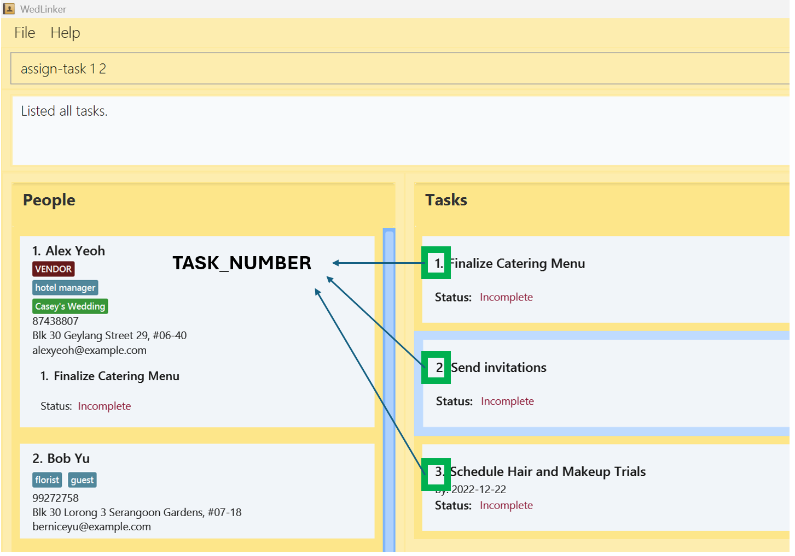

<button id="toggleButton" onclick="toggleAllDetails()">Expand All</button>


<div style="display: flex; justify-content: center; align-items: center;">
<span class="parisienne-regular" style="font-size: 3em; font-weight: bold;">
  WedLinker User Guide
</span>
</div>

**What is WedLinker?**<br>
WedLinker is your essential desktop app for managing wedding-related contacts, designed specifically for professional wedding planners. <br>
With a powerful Command Line Interface (CLI), WedLinker streamlines contact management through quick, intuitive commands. This means you can accomplish your tasks faster than with traditional GUI apps, giving you more time to focus on what matters most—creating memorable experiences for your clients.
<br>

**Why Choose WedLinker?**<br>
While WedLinker excels with its fast Command-Line Interface (CLI), it also offers a clear and intuitive Graphical User Interface (GUI). The GUI presents your contacts, weddings, and tasks in an organised layout, making it easy to view and manage them at a glance. <br>
This combination of speed and clarity allows you to manage your wedding planning tasks efficiently and with precision.
<br>


<!-- * Table of Contents -->
<page-nav-print />

--------------------------------------------------------------------------------------------------------------------
## Quick start

1. Before you can run this app, you need to have `Java 17` or above installed on your computer. Follow the simple steps below to check if you already have `Java 17` installed, or to install it if you do not:

   1.1. Open your operating system's terminal. <br>Follow the instructions for your operating system if you are unsure how to:
      <details>
        <summary><strong>Windows:</strong></summary>
        <ol>
          <li>Hold down Windows button and R (⊞ Win + R)</li>
          <li>Type <code>cmd</code> and press enter</li>
        </ol>
      </details>
      <details>
        <summary><strong>MacOS:</strong></summary>
        <ul>
          <li>Click the Launchpad icon in the Dock, type <code>Terminal</code> in the search field, then click Terminal, OR</li>
          <li>In the Finder, open the <code>/Applications/Utilities</code> folder, then double-click Terminal.</li>
        </ul>
      </details>
    <br>

   1.2. Type <code>java -version</code> and press enter.

   1.3. If you have `Java 17` installed, the terminal should look like:
      ```
        C:\Users\UserName>java -version
        java version "17.0.12" 2024-07-16 LTS
        Java(TM) SE Runtime Environment (build 17.0.12+8-LTS-286)
        Java HotSpot(TM) 64-Bit Server VM (build 17.0.12+8-LTS-286, mixed mode, sharing)
      ```

<br>

2. If you have `Java 17` installed, proceed to Step 3. If not, follow these instructions:

   2.1. Download `Java 17` from [here](https://www.oracle.com/java/technologies/javase/jdk17-archive-downloads.html)
   
    2.2. Select the installation package based on your Operating System.
   
    2.3. Follow the instruction guide to install Java on your device. For more information, click [here](https://docs.oracle.com/en/java/javase/23/install/overview-jdk-installation.html)

<br>

3. Download the latest version of WedLinker from [here](https://github.com/AY2425S1-CS2103T-F15-4/tp/releases/). Select `WedLinker.jar` to begin the download.
   

<br>

4. Copy the file to the folder you want to use as the _home folder_ for your WedLinker.

<br>

5. Open WedLinker by double-clicking the program file, `WedLinker.jar`.<br>
   A GUI similar to the image below should appear in a few seconds. Note how the app contains some sample data.<br>
   

<br>

6. Type a command in the command box and press Enter to execute it. e.g. typing **`help`** and pressing Enter will open the help window.<br>
   Some example commands you can try:

   * `list` : Lists all contacts.

   * `add n/John Doe p/98765432 e/johnd@example.com a/ABC Photography Studio` : Adds a contact names John Doe to WedLinker with the phone number 98765432, email address johnd@example.com, and address ABC Photography Studio.

   * `delete 3` : Deletes the 3rd contact shown in the current list.

   * `clear` : Deletes all contacts.

   * `exit` : Exits the app.

<br>

7. Refer to the [Features](#features) below for details of each command.

--------------------------------------------------------------------------------------------------------------------

## Features

<box type="info" seamless>
  <details>
    <summary><strong>Notes about the command format:</strong></summary>

* Words in `UPPER_CASE` are the parameters to be supplied by the user.<br>
  e.g. in `add n/NAME`, `NAME` is a parameter which can be used as `add n/John Doe`.

* Items in square brackets are optional.<br>
  e.g `n/NAME [t/TAG_NAME]` can be used as `n/John Doe t/guest` or as `n/John Doe`.

* Items with `…`​ after them can be used multiple times including zero times.<br>
  e.g. `[t/TAG_NAME]…​` can be used as ` ` (i.e. 0 times), `t/guest`, `t/guest t/photographer` etc.

* Commands in WedLinker uses labels to specify the parameters, the labels are stated as such:
  * n/ Name
  * a/ Address
  * p/ Phone Number
  * e/ Email
  * t/ Tag
  * w/ Wedding
  * tk/ Task
  * d/ Date

* Parameters can be in any order.<br>
  * e.g. if the command specifies `n/NAME p/PHONE_NUMBER`, `p/PHONE_NUMBER n/NAME` is also acceptable.

  </details>
</box>


<box type="warning" seamless>
  <details open>

<summary><strong>Caution:</strong></summary>

* Extraneous parameters for commands that do not take in parameters (such as `help`, `list`, `exit` and `clear`) will be ignored.<br>
  * e.g. if the command specifies `help 123`, it will be interpreted as `help`.

* Similarly, extraneous prefixes (e.g. n/ or tk/) for commands that do not take in those prefixes will be processed as part of other inputs.<br>
  * e.g. when [adding a person](#adding-a-person-add), you can specify the labels `n/`, `p/`, `e/`, `a/`, `t/`, and `w/`. If the command specifies
  `add n/Betsy Crowe d/2020-04-11 tk/Buy place settings`, it will be interpreted as adding a person with the name `Betsy Crowe d/2020-04-11 tk/Buy place settings`

* If you are using a PDF version of this document, be careful when copying and pasting commands that span multiple lines as space characters surrounding line-breaks may be omitted when copied over to the application.
  </details>
</box>

* Some commands have shorter keywords that speed up entering commands - these keywords are specified in the format of each command.

* For example, instead of typing in `assign-vendor 1`, you can type in `asv 1`

## General Features
<h3 class="features">General Features</h3>

#### Viewing help : `help`

Shows a message explaining how to access the help page.


Format: `help`

<br>

#### Listing all Persons : `list`

Shows a list of all saved [Persons](#adding-a-person-add) in the WedLinker.

Format: `list`

#### Listing all Weddings : `list-weddings` or `lw`

Shows a list of all [Weddings](#adding-a-wedding--create-wedding-or-cw) in the WedLinker.

Format: `list-weddings` or `lw`

#### Listing all Tasks : `list-tasks` or `ltasks`

Shows a list of all [Tasks](#creating-one-or-more-tasks--create-task-or-ctask) in the WedLinker

Format: `list-tasks` or `ltasks`

#### Listing all Tags : `list-tags` or `ltags`

Shows a list of all [Tags](#creating-a-tag--create-tag-or-ctag) in the WedLinker

<br>

#### Clearing all entries : `clear`

Clears all entries from WedLinker.

Format: `clear`

<box type="warning" seamless>

<details open>
<summary><strong>Caution:</strong></summary>
This action is irreversible and cannot be undone. Please ensure you have backed up any important information before proceeding.
</details>
</box>

<br>

#### Exiting the program : `exit`

Exits the program.

Format: `exit`

<br>

#### Saving the data

WedLinker data are saved in the hard disk automatically after any command that changes the data. There is no need to save manually.

<br>

#### Editing the data file

WedLinker data are saved automatically as a JSON file `[JAR file location]/data/addressbook.json`. Advanced users are welcome to update data directly by editing that data file.

<box type="warning" seamless>

<details open>
<summary><strong>Caution:</strong></summary>
If your changes to the data file makes its format invalid, WedLinker will discard all data and start with an empty data file at the next run.  Hence, it is recommended to take a backup of the file before editing it.<br>
<br>
Furthermore, certain edits can cause the WedLinker to behave in unexpected ways (e.g., if a value entered is outside the acceptable range). Therefore, edit the data file only if you are confident that you can update it correctly.
</details>
</box>

---

<br>

<h3 class="features">Person Features</h3>

#### Adding a person: `add`

Use the `add` command to add a new contact to WedLinker.

Format: `add n/NAME [p/PHONE_NUMBER] [e/EMAIL] [a/ADDRESS] [t/TAG_NAME]…​ [w/WEDDING_NAME]…​`


<box type="tip" seamless>

<details>
<summary><strong>Tip:</strong></summary>

- A person can have any number of tags (including 0)

</details>
</box>

To add a contact to WedLinker, type `add` followed by details such as the name, phone number, and email.

* **People in WedLinker cannot have the same names. `NAME` is case-insensitive.**
  * So, if `John Doe` is already in WedLinker, adding another `john doe` with different details will not work
* A person's name must contain only letters, numbers, spaces, or the following characters: / . - '
* A person's phone number should be at least 3 digits long.
* If the tags or weddings specified in the add command do not exist yet, they will be created.


Examples:
* To add a contact named John Doe with a phone number of 98765432, email johnd@example.com, and address XYZ Floral Services, enter the command:
  * `add n/John Doe p/98765432 e/johnd@example.com a/XYZ Floral Services`
* To add a contact named Betsy Crowe with a phone number of 1234567, with tags Photographer and Guest, enter the command:
  * `add n/Betsy Crowe p/1234567 t/Photographer t/Guest`

<box type="tip" seamless>

<details>
<summary><strong>Tip:</strong></summary>

- Adding a person with tags or weddings that do not exist in WedLinker will create all the tags and weddings.
Created weddings will have the person automatically assigned to their guest lists. <br><br>
- A person can have any number of tags or weddings (including 0). <br><br>
- A person's name must contain only alphanumeric characters and certain special characters, which can be used to represent different naming conventions:
    - **Hyphen (-)**: Used for double-barrelled names, such as "Mary Doe-Smith".
    - **Slash (/)**: Used to store nicknames or alternative names, like "John/Jonny Doe".
    - **Period (.)**: Used to shorten names, such as "John D. Doe" or "Jane S.".
    - **Apostrophe (')**: Used in names like "O'Hare" or "O'Conner".
</details>
</box>


<box type="warning" seamless>

<details open>
<summary><strong>Caution:</strong></summary>
<br>

- People with single or multiple spaces in their names are considered distinct and treated as separate people. For example:
    - <span class="preserve-whitespace">John Doe vs. John  Doe</span>
    - <span class="preserve-whitespace">TK/Tyler Kennedy vs. TK / Tyler - Kennedy</span><br><br>
- Extraneous prefixes in the add command will be processed as part of other inputs.<br>
  - e.g. when adding a person, you can specify the prefixes `n/, p/, e/, a/, t/, and w/`. If the command specifies
    `add n/Betsy Crowe d/2020-04-11 tk/Buy place settings`, it will be interpreted as adding a person with the name `Betsy Crowe d/2020-04-11 tk/Buy place settings`

</details>
</box>

<br>

#### Editing a person : `edit`

Use the `edit` command to edit details of an existing contact in WedLinker.

Format: `edit PERSON_NUMBER [n/NAME] [p/PHONE] [e/EMAIL] [a/ADDRESS]`

To edit the details of an existing contact in WedLinker, type `edit` followed by the positional number of the person in the contact list, and details you wish to update, such as the name, phone number, and email.

> [!IMPORTANT]
> The `PERSON_NUMBER` referenced in any action will always correspond to the `PERSON_NUMBER` in the person list that is currently visible.

* The `PERSON_NUMBER` **must be a positive integer** 1, 2, 3, …​
* At least one of the optional fields must be provided.
* Existing details will be updated to the details provided.

<div align="center">
  
</div>
<p align="center">
The PERSON_NUMBER corresponds to each person's position in the `Person` list. <br>
</p>

* In this example, the PERSON_NUMBER of 2 refers to the person named "Bernice Yu", and the command `edit 2 n/Bob Yu` will change the contact's name from "Bernice Yu" to "Bob Yu" 

Examples:
* To change the phone number of the first contact to 91234567, enter the command:  
  * `edit 1 p/91234567`
* To change the name and address of the second contact, enter the command:
  * `edit 2 n/Betsy Crower a/XYZ Flower Shop`
  * This updates the contact's name to `Betsy Crower` and address to `XYZ Flower Shop`

<br>

#### Deleting a person : `delete`

Use the `delete` command to remove a contact from WedLinker.

Format: `delete PERSON_NUMBER`

To remove a contact from WedLinker, type `delete` followed by the positional number of the person in the contact list

* The `PERSON_NUMBER` **must be a positive integer** 1, 2, 3, …​

Examples:
* To delete the second contact in WedLinker:
  * First, list all contacts by entering the command: `list`, 
  * Then, enter the command: `delete 2`
* To delete the first contact found when searching for the name `Betsy`:
  * First, search for contacts with the name `Betsy` by entering the command: `find n/Betsy`
  * Then, enter the command: `delete 1` 

---
<br>

#### Searching people by any field: `find`

Finds all persons based on the specified keywords after the label representing the field, and displays them as a list with index numbers.

Format: `find n/NAME...` or `find p/PHONE...` or `find e/EMAIL...` or `find a/ADDRESS...` or `find t/TAG_NAME...` or `find w/WEDDING_NAME...` or `find tk/TASK_NAME...`

* The search is case-insensitive. e.g `hans` will match `Hans`.
* The label that corresponds to the field you want to search should be specified. e.g. use `find n/Alex` to search by name, use `find e/alex@gmail.com` to search by email.
* The keyword after the label must be specified and cannot be empty. e.g. `find a/` is not allowed as the keyword to search should be specified.
* The search will return partial matches and full matches.
* Only one field can be searched at a time, but multiple keywords can be searched for the same field by placing each keyword after the appropriate prefix. e.g. to search for people whose phone number contains either 98 or 64, you can enter the command `find p/98 p/64`. 
This will return all contacts that have either 98 ot 64 in their phone number.
* You can only specify one prefix to search for at a time. For example, `find n/Alex a/` is not allowed as it searches for keywords in more than one field in the same command.
* The order of the keywords does not matter. e.g. `n/Hans n/Bo` will return the same contacts as `n/Bo n/Hans`.

* `find p/973` returns all Contacts whose phone number contains 973
* `find n/alex n/david` returns `Alex Yeoh`, `David Li`<br>
  
* `find t/friends` returns all Contacts tagged with 'friends' <br>
  
* `find w/Casey's Wedding` returns all Contacts assigned to Casey's Wedding <br>

<h3 class="features">Tag Features</h3>

#### Creating a tag : `create-tag` or `ctag`

Use the `create-tag` command to create a tag within WedLinker, which you can assign to contacts.

Format: `create-tag t/TAG_NAME` or`ctag t/TAG_NAME`

To create a tag, type `create-tag` followed by the name of the tag.

* The `TAG_NAME` is alphanumeric and can contain whitespaces.
* Tags are unique in WedLinker, there would not be any duplicated Tags.
* Multiple contacts can share the same tag.
* Tags are case-insensitive, so you cannot have both a 'hotel manager' and 'Hotel Manager' tag
* If you want to create a Tag with a long name, it might not be shown clearly in the list.</br>
We recommend keeping names of Tags to a maximum of 50 characters long.</br>
You can use [list-tags](#listing-all-tags--list-tags-or-ltags) instead for better visuals.

Examples:
* To create a tag named `Florist`, enter the command:
    * `create-tag t/Florist`

> [!TIP]
> To display a list of all the tags that have been created, you can use the [list-tags](#listing-all-tags--list-tags-or-ltags) command.

<box type="warning" seamless>
<details open>
<summary><strong>Caution:</strong></summary>

- Tags with single or multiple spaces in their names are considered distinct and treated as separate tags. For example:
    - <span class="preserve-whitespace">Venue IC vs. Venue  IC</span>
</details>
</box>

#### Assigning tag to contact : `tag`

Use the `tag` command when you want to assign a tag to a specific contact in WedLinker.

Format: `tag PERSON_NUMBER t/TAG_NAME... [f/]`

To assign a tag to a contact, type `tag` followed by the positional number of the person in the contact list and the name of the tag.

* The `PERSON_NUMBER` **must be a positive integer** 1, 2, 3, …​.
* The `Tag` must exists in WedLinker before it can be assigned.
* If the `Tag` does not exist, you can use the label `f/` to force the creation and assignment of the `Tag`.

Examples:
* To assign an existing tag named `Florist` to the first person in the list, enter the command:
    * `tag 1 t/Florist`
* To assign a new tag named `Musician` (that doesn't currently exist) to the second person in the list, enter the command:
    * `tag 2 t/Musician f/`


<box type="tip" seamless>

**Tip:** To see all current tags, use the [list-tags](#listing-all-tags--list-tags-or-ltags) command
</box>

<box type="warning" seamless>
<details open>
<summary><strong>Caution:</strong></summary>
<br>

- Force-tagging a person with extraneous input will cause those extraneous inputs to be ignored. For example:
    - `tag 1 f/ RandomWord t/Tag1` will cause `RandomWord` to be ignored.
</details>
</box>

#### Unassigning tag from contacts : `untag`

Use the `untag command` when you want to remove a tag from a specific contact in WedLinker.

Format: `untag PERSON_NUMBER t/TAG_NAME...`

To remove a tag from a contact, type `untag` followed by the positional number of the person in the contact list and the name of the tag.

* The `PERSON_NUMBER` **must be a positive integer** 1, 2, 3, …​.
* `TAG_NAME` is case-insensitive.

Examples:
* To remove the tag named `Florist` from the first person in the list, enter the command:
    * `untag 1 t/Florist`

**Known issue:** the untag command is case-sensitive, so if person 2 is tagged with the tag Hotel Manager, only entering the command `untag 2 t/Hotel Manager`
will remove the tag from person 2 and `untag 2 t/hotel manager` will not.

### Deleting a tag : `delete-tag` or `dtag`

Use the `delete-tag` command to delete a tag you no longer have a use for.

Format: `delete-tag t/TAG_NAME [f/]` or `dtag t/TAG_NAME [f/]`

To delete a tag from WedLinker, type `delete-tag` followed by the name of the tag

* `TAG_NAME` is case-insensitive.
* The `Tag` must exist in WedLinker.
* The `Tag` cannot be assigned to any contacts.
* If the `Tag` is currently in use, you can use `f/` to force its deletion and remove the tag from all contacts.

Examples:
* To delete the tag named `Florist` from WedLinker, enter the command:
    * `delete-tag t/Florist`

---
<br>

<h3 class="features">Wedding Features</h3>

#### Adding a Wedding : `create-wedding` or `cw`

Use the `create-wedding` command to create a Wedding within WedLinker that can be linked to contacts.

Format: `create-wedding w/WEDDING_NAME` or `cw w/WEDDING_NAME`

To create a `Wedding`, type `create-wedding` followed by the name of the wedding.

* The `WEDDING_NAME` should only contain alphanumeric characters, spaces or the following characters: / . , ' & : ( )
* `WEDDING_NAME` is case-insensitive.
* Weddings are unique in WedLinker, there would not be any duplicated Weddings.
* Contacts can be assigned to the Wedding using the [assign-wedding](#assigning-contact-to-a-wedding--assign-wedding-or-asw) command.
* If you want to create a Wedding with a long name, it might not be shown clearly in the list.</br>
  We recommend keeping names of Weddings to a maximum of 50 characters long.</br>
  You can use [list-weddings](#listing-all-weddings--list-weddings-or-lw) instead for better visuals.

Examples:
* To create a Wedding named `Wedding 1`, enter the command:
    * `create-wedding w/Wedding 1`
* Contacts can be assigned to the Wedding using the [assign-wedding](#assign-contact-to-a-wedding-assign-wedding) command.

<box type="warning" seamless>
<details open>
<summary><strong>Caution:</strong></summary>
<br>


- Weddings with single or multiple spaces in their names are considered distinct and treated as separate weddings. For example:
    - <span class="preserve-whitespace">O'Hare's Wedding vs. O'Hare's  Wedding</span>
</details>
</box>

#### Assigning contact to one or more Weddings : `assign-wedding` or `asw`

Use the `assign-wedding` command to assign a contact to one or more Weddings.

Format: `assign-wedding PERSON_NUMBER w/WEDDING_NAME…​ [p1/] [p2/] [f/]` or `asw PERSON_NUMBER w/WEDDING_NAME…​ [p1/] [p2/] [f/]`

To assign a contact to one or more `Weddings`, type `assign-wedding`, followed by the positional number of the person in the contact list and the name(s) of the wedding(s).

* `WEDDING_NAME` is case-insensitive.
* The `PERSON_NUMBER` **must be a positive integer** 1, 2, 3, …​.
* The `Wedding` must exists in WedLinker before it can be assigned.
* If the `Wedding` does not exist, you can use `f/` to force its creation and assignment to the contact.
* Assigning with the optional `p1/` or `p2/` keywords will set that contact as Partner 1 or Partner 2 of the wedding respectively.

Examples:
* To assign the Wedding named `Wedding 1` to the third person in the contact list, enter the command:
    * `assign-wedding 3 w/Wedding 1`

**Known Issues:** When you use this function with both `p1/` and `p2/`, WedLinker will default to assigning the person as the first partner. 

#### Editing Wedding details : `edit-wedding` or `ew`

Use the `edit-wedding` command to edit details of a Wedding, such as the Wedding name and Address.

Format: `edit-wedding WEDDING_NUMBER [a/ADDRESS] [d/DATE]` or `ew WEDDING_NUMBER [a/ADDRESS] [d/DATE]`

To edit the details of a `Wedding`, enter the command [list-weddings](#listing-all-weddings-list-weddings) to identify the Wedding number in the `Wedding` list. <br>
Following that, type "edit-wedding" followed by the Wedding number enter the details you wish to edit and the name of the wedding.

* The WEDDING_NUMBER **must be a positive integer** 1, 2, 3, …​.
* Existing values in the specified fields will be overwritten with the specified values.
* Date must be in "YYYY-MM-DD" format.

<div align="center">
  
</div>
<p align="center">
The WEDDING_NUMBER corresponds to each Wedding's position in the `Wedding` list
</p>

* In this example, the `WEDDING_NUMBER` 2 refers to the wedding named "Wedding 2", and the command `edit-wedding 2 w/Bob's Wedding` will change the Wedding name from "Wedding 2" to "Bob's Wedding".


Examples:
* To edit the address of the Wedding named `Wedding!`, to XYZ street:
    * First, identify the Wedding number by entering the command: `list-weddings`
    * Should wedding number be 1, enter the command: `edit-wedding 1 a/XYZ street`

#### Unassigning contacts from a Wedding : `unassign-wedding` or `uw`

Use the `unassign-wedding` command to remove a contact from one or more Weddings.

Format: `unassign-wedding PERSON_NUMBER w/WEDDING_NAME...` or `uw PERSON_NUMBER w/WEDDING_NAME...`

To remove a contact from one or more `Weddings`, type "unassign-wedding", followed by the positional number of the person in the contact list and the name(s) of the wedding(s).

* `WEDDING_NAME` is case-insensitive.
* The `PERSON_NUMBER` **must be a positive integer** 1, 2, 3, …​.

Examples:
* To remove the second person in the list from the Wedding named `Wedding 1`, enter the command:
    * `unassign-wedding 2 w/Wedding 1`

### Deleting a Wedding : `delete-wedding` or `dw`

Use the `delete-wedding` command to delete a Wedding from WedLinker.

Format: `delete-wedding w/WEDDING_NAME [f/]` or `dw w/WEDDING_NAME [f/]`

To delete a `Wedding`, type "delete-wedding", followed by the name of the wedding.

* There should be no contacts assigned to the `Wedding` before it is deleted.
* If there are still contacts assigned to the `Wedding`, you can use `f/` to force the deletion of the `Wedding`. This will un-assign all contacts from that `Wedding`. The `Wedding` will also be removed from all contacts who were previously assigned to it."

Examples:
* To delete the wedding named `Wedding 1`, enter the command:
    * `delete-wedding w/Wedding 1`

**Known issue:** the unassign-wedding command is case-sensitive, so if person 2 is assigned to the wedding, Wedding 2, only entering the command `unassign-wedding 2 w/Wedding 2` or `uw 2 w/Wedding 2`
will unassign the wedding from person 2 and `unassign-wedding 2 w/wedding 2` or `uw 2 w/wedding 2` will not.
---
<br>

<h3 class="features">Task Features</h3>

#### Creating one or more Tasks : `create-task` or `ctask`

Use the `create-task` command to create one or more Tasks.

Format: `create-task tk/TASK_DESCRIPTION [d/DATE] [d/DATE] ...` or `ctask tk/TASK_DESCRIPTION [d/DATE] [d/DATE] ...`

To create a `task`, type `create-task` followed by the description of the task. <br>
You can also include up to two dates if needed, with a single date indicating a deadline and two dates to define a start and end period.

* `TASK_DESCRIPTION` is case-sensitive.
* The dates must be specified with the format `d/YYYY-MM-DD`
* Tasks are unique in WedLinker, there would not be any duplicated tasks.
* You can assign tasks to a contact using the [assign-task](#assigning-a-task-to-a-contact--assign-task-) command.

Examples:
* To create two tasks with the descriptions `Buy cake` and `Book venue`, enter the command:
    * `create-task tk/Buy cake tk/Book venue`
* To create a task with the description of `Finalise itinerary` with a specified deadline of `2024-12-22`, enter the command:
    * `create-task tk/Finalise itinerary d/2024-12-22`

<box type="warning" seamless>

<details open>
<summary><strong>Caution:</strong></summary>
<br>

- Tasks with single or multiple spaces in their names are considered distinct and treated as separate tasks. For example:
    - <span class="preserve-whitespace">Send invitations vs. Send  invitations</span>
</details>
</box>

#### Assigning a Task to a contact : `assign-task` or `atask`

Use the `assign-task` command to assign one or more Tasks to a contact.

Format: `assign-task PERSON_NUMBER TASK_NUMBER...` or `atask PERSON_NUMBER TASK_NUMBER...`

To assign `task(s)` to a contact, enter the command [list-tasks](#listing-all-tasks--list-tasks) to identify the Task number in the `Task` list. <br>
Following that, type "assign-task" followed by assigned person's positional number. and Task number(s) of tasks you wish to assign to the person.

The `PERSON_NUMBER` and `TASK_NUMBER` **must be positive integers** 1, 2, 3, …​.
The `PERSON_NUMBER` and `TASK_NUMBER` refer to the number of the `Person` in the person list and the number of the `Task` in the task list, respectively.

<div align="center">
  
</div>
<p align="center">
The TASK_NUMBER corresponds to each Task's position in the `Task` list
</p>

* In this example, the `TASK_NUMBER` 2 refers to the task with the description "Send invitations", and the command `assign-task 1 2` will assign the "Send invitations" task to the contact with `PERSON_NUMBER` 1, which is "Alex Yeoh".

* Examples:
* To assign two tasks with the descriptions `Buy cake` and `Finalise itinerary`:
    * Firstly, enter the command `list-tasks` to see all contacts and tasks.
    * Secondly, identify the positional number of the person you wish to assign tasks to
    * Thirdly, identify the Task numbers of the two tasks you wish to assign.
    * Lastly, should the Person number be 1, and the Task numbers are 2 and 3, enter the command: `assign-task 1 2 3`


#### Unassigning a Task from a contact : `unassign-task` or `unatask`

Format: `unassign-task PERSON_NUMBER PERSON_TASK_NUMBER...` or `unatask PERSON_NUMBER PERSON_TASK_NUMBER...`

To remove a `task` from a contact, type `unassign-task` followed by the positional number of the person and the person's Task number(s)

**Important Note:** The `PERSON_TASK_NUMBER` here refers to the task's position within a contact's assigned tasks, not the main task list number.*
* The `PERSON_NUMBER` and `PERSON_TASK_NUMBER` **must be positive integers** 1, 2, 3, …​.

<div align="center">
  
</div>
<p align="center">
The PERSON_TASK_NUMBER corresponds to each task's position within a contact's assigned tasks.
</p>

* In this example, the PERSON_TASK_NUMBER 3 for the first person refers to the task with the description "Send invitations", and the command `unassign-task 1 3` will remove the "Send invitations" task from the contact with `PERSON_NUMBER` 1, which is "Alex Yeoh".

Examples:
* To remove the tasks with the descriptions `Buy cake` and `Finalise itinerary` from the first person in the contact list:
    * First, identify the assigned Task numbers of the two tasks assigned to the person
    * Should the assigned Task numbers be 2 and 3, enter the command: `unassign-task 1 2 3`

### Marking a task as completed : `mark-task` or `mtask`

Use the `mark-task` command to mark one or more Tasks as completed.

Format: `mark-task TASK_NUMBER...` or `mtask TASK_NUMBER...`

To mark a `task` to be completed, enter the command [list-tasks](#listing-all-tasks--list-tasks) to identify the Task number(s) of task(s) you wish to mark. <br>
Following that, type `mark-task` followed by the Task number(s).

* Marks a `Task` as completed.
* The index correspond to the index of the task when in the [list-tasks](#listing-all-tasks--list-tasks) view.
* The index **must be a positive integers** 1, 2, 3, …​.

* The TASK_NUMBER **must be a positive integer** 1, 2, 3, …​.

Examples:
* To mark the task with the description `Finalise itinerary` as complete:
    * First, identify the Task number of the task by entering the command: `list-tasks`.
    * Should the Task number be 1, enter the command `mark-task 1`.

### Unmarking a task  : `unmark-task` or `untask`

Use the `unmark-task` command to mark one or more Tasks as not completed.

Format: `unmark-task TASK_NUMBER...` or `untask TASK_NUMBER...`

To mark a `task` as not completed, enter the command [list-tasks](#listing-all-tasks--list-tasks) to identify the Task number(s) of task(s) you wish to mark. <br>
Following that, type `unmark-task` followed by the Task number(s).

* The `TASK_NUMBER` **must be a positive integer** 1, 2, 3, …​.

Examples:
* To mark the completed task with the description `Finalise itinerary` as incomplete:
    * First, identify the Task number of the task.
    * Should the Task number be 1, enter the command `unmark-task 1`.

### Deleting a Task : `delete-task` or `dtask`

Use the `delete-task command` to delete a specific Task.

Format: `delete-task TASK_NUMBER` or `dtask TASK_NUMBER`

To delete a `task`, enter the command [list-tasks](#listing-all-tasks--list-tasks) to identify the Task number in the `task` list. <br>
Following that, type "delete-task" and the Task number of the task that you wish to delete.

* The `TASK_NUMBER` **must be a positive integer** 1, 2, 3, …​.

Examples:
* To delete a task with the description `Buy cake`:
    * First, identify the Task number by entering the command: `list-tasks`
    * Should the Task number be 1, enter the command: `delete-task 1`

---
<br>

<h3 class="features">Vendor Features</h3>

### Assigning a Vendor : `assign-vendor` or `asv`

Use the `assign-vendor` command to designate a contact as a vendor.

Format: `assign-vendor PERSON_NUMBER` or `asv PERSON_NUMBER`

To designate a contact as a vendor, type "assign-vendor" followed by the positional number of the person.

> [!NOTE]
> Vendors can be managed with the same functionalities as a regular contact, e.g. Vendors can be assigned to Weddings, be assigned with tags etc.

* The `PERSON_NUMBER` **must be a positive integer** 1, 2, 3, …​.
* The `Vendor` can now have `Tasks` assigned to them.

Examples:
* To designate the first contact as a vendor, enter the command:
    * `assign-vendor 1`.

### Unassigning a Vendor : `unassign-vendor` or `uv`

Use the `unassign-vendor` command to remove a vendor designation from a contact, making them a regular contact in WedLinker.

Format: `unassign-vendor PERSON_NUMBER [f/]` or `uv PERSON_NUMBER [f/]`

To remove a vendor designation from a contact, type "unassign-vendor" followed by the positional number of the person.

* The `PERSON_NUMBER` **must be a positive integer** 1, 2, 3, …​.
* Unassigns a `Vendor` at the specified `PERSON_NUMBER` such that the `Person` is no longer a `Vendor`. `Tasks` can no longer be assigned to this `Person`. 
* No tasks should be assigned to the `Vendor` before it is unassigned.
* If the specified `Vendor` has tasks assigned to them, you can use the label `f/` to force the removal of the vendor designation and remove all tasks currently assigned to that `Vendor`.
* A regular contact can no longer have `Tasks` assigned them.

Examples:
* To remove a vendor designation from the first contact, enter the command:
    * `unassign-vendor 1`.

-------


--------------------------------------------------------------------------------------------------------------------

## Known issues

1. **When using multiple screens**, if you move the application to a secondary screen, and later switch to using only the primary screen, the GUI will open off-screen. The remedy is to delete the `preferences.json` file created by the application before running the application again.

2. **If you minimize the Help Window** and then run the `help` command (or use the `Help` menu, or the keyboard shortcut `F1`) again, the original Help Window will remain minimized, and no new Help Window will appear. The remedy is to manually restore the minimized Help Window.

3. The commands `untag` and `unassign-wedding` are case-sensitive. So, if a person, person 2, is assigned to a wedding, Wedding 2, entering the command `unassign-wedding 2 w/wedding 2` will not remove Wedding 2 from person 2.

4. When you use this function with both `p1/` and `p2/`, WedLinker will default to assigning the person as the first partner.
--------------------------------------------------------------------------------------------------------------------

## Command summary
Action     | Format, Examples
-----------|----------------------------------------------------------------------------------------------------------------------------------------------------------------------
**Add**    | `add n/NAME [p/PHONE] [e/EMAIL] [a/ADDRESS] [t/TAG_NAME]…​ [w/WEDDING_NAME]…​` <br> e.g., `add n/James Ho p/22224444 e/jamesho@example.com a/123, Clementi Rd, 1234665 t/florist`
**Add Vendor**    | `add-vendor n/NAME [p/PHONE] [e/EMAIL] [a/ADDRESS] [t/TAG_NAME]…​ [w/WEDDING_NAME]…​` or `addv n/NAME [p/PHONE] [e/EMAIL] [a/ADDRESS] [t/TAG_NAME]…​ [w/WEDDING_NAME]…​` <br> e.g., `addv n/James Ho p/22224444 e/jamesho@example.com a/123, Clementi Rd, 1234665 t/florist`
**Assign Task**    |  `assign-task PERSON_NUMBER TASK_NUMBER…​` or `atask PERSON_NUMBER TASK_NUMBER…​` <br> e.g., `assign-task 2 1 3`
**Assign Vendor**    | `assign-vendor PERSON_NUMBER` or `asv PERSON_NUMBER` <br> e.g., `asv 2`
**Assign Wedding**    | `assign-wedding PERSON_NUMBER w/WEDDING_NAME…​ [p1/] [p2/] [f/]` or `asw PERSON_NUMBER w/WEDDING_NAME…​ [p1/] [p2/] [f/]` <br> e.g., `asw 2 w/Casey's Wedding p1/ w/Wedding August 29th`
**Clear**  | `clear`
**Create Tag**  | `create-tag t/TAG_NAME` or `ctag t/TAG_NAME` <br> e.g., `create-tag t/photographer`
**Create Task** | `create-task tk/TASK_DESCRIPTION [d/DATE] [d/DATE]` or `ctask tk/TASK_DESCRIPTION [d/DATE] [d/DATE]` <br> e.g., `create-task tk/Order Wedding Cake` <br> `ctask tk/Book Venue d/2025-02-01` <br> `create-task tk/Meet Caterer d/2024-11-19 d/2024-11-20`
**Create Wedding**  | `create-wedding w/WEDDING_NAME` or `cw w/WEDDING_NAME` <br> e.g., `cw w/JJ's Wedding`
**Delete** | `delete PERSON_NUMBER`<br> e.g., `delete 3`
**Delete Tag** | `delete-tag t/TAG_NAME [f/]` or `dtag t/TAG_NAME [f/]` <br> e.g., `delete-tag t/photographer`
**Delete Task** | `delete-task TASK_NUMBER` or `dtask TASK_NUMBER` <br> e.g., `dtask 6`
**Delete Wedding** | `delete-wedding w/WEDDING_NAME [f/]` or `dw w/WEDDING_NAME [f/]` <br> e.g., `delete-wedding w/Lav's Wedding`
**Edit**   | `edit PERSON_NUMBER [n/NAME] [p/PHONE] [e/EMAIL] [a/ADDRESS]`<br> e.g.,`edit 2 n/James Lee e/jameslee@example.com`
**Edit Wedding**   | `edit-wedding WEDDING_NUMBER [a/ADDRESS] [d/DATE]`<br> or <br> `ew WEDDING_NUMBER [a/ADDRESS] [d/DATE]` <br> e.g.,`edit-wedding 2 a/Jurong Christian Church`
**Exit**   | `exit`
**Find**   | `find n/NAME…​` or `find p/PHONE…​` or `find e/EMAIL…​` or `find a/ADDRESS…​` or `find t/TAG_NAME…​` or `find w/WEDDING_NAME…​` or `find tk/TASK_NAME…​` <br> e.g., `find n/James Jake` <br> `find a/Serangoon a/Blk 13`
**Help**   | `help`
**List**   | `list` 
**List Weddings**   | `list-weddings` or `lw`
**List Tags**   | `list-tags` or `ltags`
**List Tasks**   | `list-tasks` or `ltasks`
**Mark Task** | `mark-task TASK_NUMBER…​` or `mtask TASK_NUMBER…​` <br> e.g., `mark-task 1 ` <br> `mtask 1 2 3`
**Tag**   | `tag PERSON_NUMBER t/TAG_NAME…​ [f/]` <br> e.g., `tag 2 t/florist t/photographer`
**Unassign Task**    |  `unassign-task PERSON_NUMBER PERSON_TASK_NUMBER…​` or `unatask PERSON_NUMBER PERSON_TASK_NUMBER…​` <br> e.g., `unatask 2 1 3`
**Unassign Vendor**    | `unassign-vendor PERSON_NUMBER [f/]` or `uw PERSON_NUMBER [f/]` <br> e.g., `unassign-vendor 3`
**Unassign Wedding**    | `unassign-wedding PERSON_NUMBER w/WEDDING_NAME…​` or `uw PERSON_NUMBER w/WEDDING_NAME…​` <br> e.g., `uw 2 w/John's Wedding`
**Unmark Task** | `unmark-task TASK_NUMBER…​` or `untask TASK_NUMBER…​` <br> e.g., `untask 1 ` <br> `unmark-task 1 2 3`
**Untag**   | `untag TASK_NUMBER t/TAG_NAME…​` <br> e.g., `untag 4 t/available t/chef`

--------------

<br>

<h2 style="text-align: center; color: #E83E8C; font-family: 'Parisienne', cursive;">Frequently Asked Questions</h2>

<details style="background-color: #f9f9f9; border-radius: 5px; padding: 10px; margin: 10px 0;">

  <summary style="font-size: 1.2em; font-weight: bold; color: #333; cursor: pointer;">How do I transfer my data to another computer?</summary>
  <p style="font-size: 1em; color: #555;">To transfer your data to another computer, follow these steps:</p>
  <ol style="color: #555;">
    <li>Install the WedLinker app on the new computer.</li>
    <li>Navigate to the new installation's home folder and locate the empty data file.</li>
    <li>Overwrite this file by replacing it with the data file from your previous computer's WedLinker home folder.</li>
  </ol>
  <p style="font-size: 1em; color: #555;">Once this is done, you should have all your data transferred successfully to the new computer.</p>

</details>
