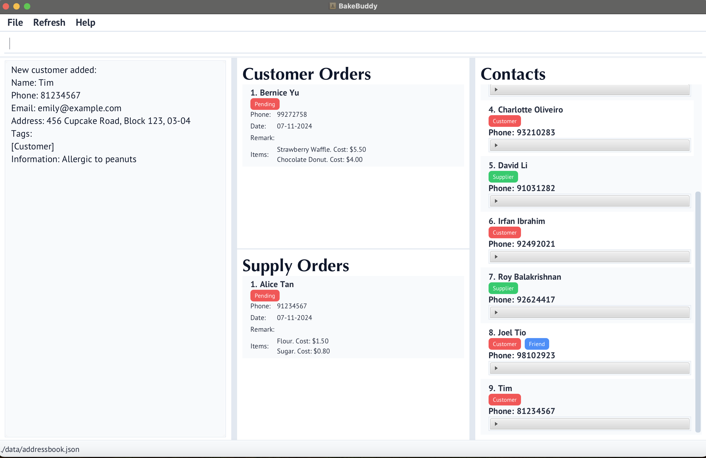
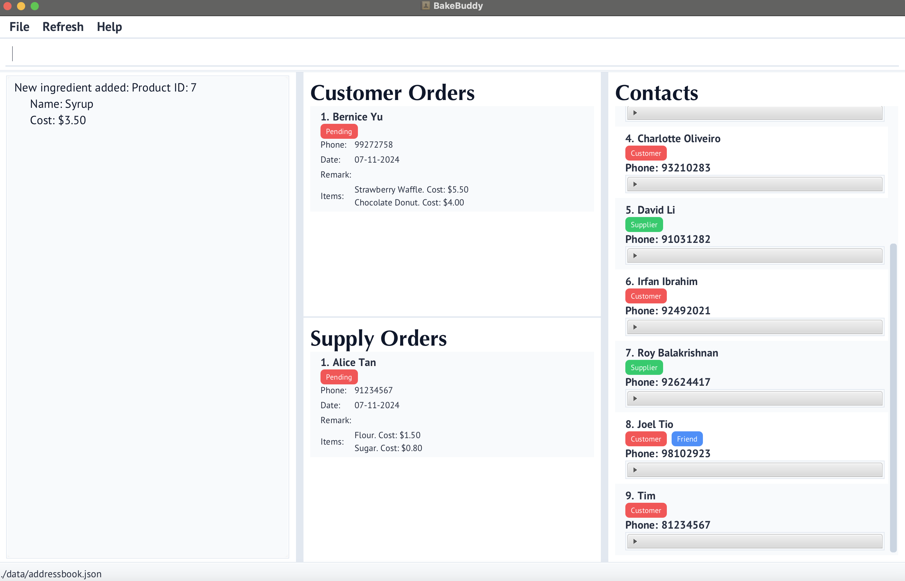

# Welcome to BakeBuddy

BakeBuddy is your all-in-one command-line companion for managing your home bakery business. Designed with speed and
efficiency in mind, it combines the power of a Command Line Interface (CLI) with intuitive features to help you focus
on what matters most - creating delicious baked goods.

BakeBuddy is a desktop application that streamlines your bakery operations by helping you manage:
- 🧁 Pastries and recipes
- 👥 Customers and their orders
- 📦 Suppliers and ingredients
- 📋 Order tracking and fulfillment
- 🗄️ Inventory management

## Why Choose BakeBuddy?

- **Speed First**: Execute commands quickly through our CLI, perfect for busy bakers
- **User-Friendly**: Simple GUI elements complement the CLI for enhanced usability
- **All-in-One Solution**: Manage every aspect of your bakery business from a single application
- **Efficiency Focused**: Designed specifically for home-based bakery owners who value their time

## Getting Started

This guide will walk you through everything you need to know about BakeBuddy, from basic commands to advanced features.

* Table of Contents
  {:toc}

--------------------------------------------------------------------------------------------------------------------

## Before You Begin ✔️

### Step 1: Check if Your Computer is Ready
First, we need to make sure your computer has Java 17 installed. Here's how to check:

1. Open your computer's terminal:
    - **For Windows**: Press the Windows key + R, type `cmd`, and press Enter
    - **For Mac**: Press Command + Space, type `terminal`, and press Enter

2. In the black window that appears, type exactly:
   ```
   java --version
   ```
   and press Enter

3. What you should see:
    - ✅ If you see "Java version 17" (or any number above 17), you're ready to go!
    - ❌ If you see "command not found" or a number below 17, visit [Java's download page](https://www.oracle.com/java/technologies/downloads/#java17) to install Java 17

### Step 2: Install BakeBuddy

1. Download BakeBuddy:
    - Click [this link](https://github.com/AY2425S1-CS2103T-T11-1/tp/releases) to download the latest BakeBuddy
    - Look for the file named `bakebuddy.jar`
    - Click on it to download

2. Create a home for BakeBuddy:
    - Create a new folder on your computer named `BakeBuddy`
    - Move the downloaded `bakebuddy.jar` file into this folder

3. Start BakeBuddy:
    - Open your terminal (like in Step 1)
    - Type `cd ` (with a space after cd)
    - Drag your BakeBuddy folder into the terminal window (this fills in the location automatically!)
    - Press Enter
    - Type:
      ```
      java -jar bakebuddy.jar
      ```
    - Press Enter

   You should see the BakeBuddy window appear!

### Step 3: Try Your First Commands

Now that BakeBuddy is running, let's add your first items. In the BakeBuddy window, you'll see a space to type commands at the top.

Refer to the [Features](#features) below for details of each command.

## Features


### **Add Contact Command**
Adds a new contact to the bakery’s database.

```bash
addContact n/NAME p/PHONE_NUMBER [e/EMAIL] [a/ADDRESS] [t/TAG]
```
- **Parameters:**
    - `n/NAME`: The person's name.
    - `p/PHONE_NUMBER`: The person's phone number.
    - `e/EMAIL`: (Optional) The person's email address.
    - `a/ADDRESS`: (Optional) The person's address.
    - `t/TAG`: (Optional) Tags for additional person information.

**Example:**
```bash
addContact n/Tim p/81234567 e/emily@example.com a/456 Cupcake Road, Block 123, 03-04 
```


### **Add Customer Command**
Adds a new customer to the bakery’s customer database.

```bash
addContact n/NAME p/PHONE_NUMBER [e/EMAIL] [a/ADDRESS] [i/INFORMATION] [t/TAG]
```
- **Parameters:**
    - `n/NAME`: The customer's name.
    - `p/PHONE_NUMBER`: The customer's phone number.
    - `e/EMAIL`: (Optional) The customer's email address.
    - `a/ADDRESS`: (Optional) The customer's address.
    - `s/INFORMATION`: (Optional) Additional information of the customer such as dietary preference.
    - `t/TAG`: (Optional) Tags for additional customer information.

**Example:**
```bash
addCustomer n/Tim p/81234567 e/emily@example.com a/456 Cupcake Road, Block 123, 03-04 i/Allergic to peanuts
```


### **Add Ingredient Command**
Adds a new ingredient to the bakery's ingredient catalogue, along with its cost.

```bash
addIngredient NAME COST
```
- **Parameters:**
    - `NAME`: The name of the ingredient.
    - `COST`: The cost of the ingredient.

**Example:**
```bash
addIngredient Syrup 3.50 
```


### **Add Customer Order Command**
Adds a customer order by providing the customer's name, phone number and the pastry IDs from the pastry catalogue.

```bash
addCustomerOrder [n/NAME] p/PHONE_NUMBER o/PASTRYIDS [MORE_PASTRYIDSs...] [r/REMARK]
```
- **Parameters:**
    - `n/NAME`: (Optional) The customer's name.
    - `p/PHONE_NUMBER`: The phone number of the customer (new customer will be added with the name if phone number not found in contacts).
    - `o/PRODUCTID`: One or more pastry IDs for the items being ordered.
    - `r/REMARK`: (Optional) Information about the customer order.

**Example:**
```bash
addCustomerOrder n/John Doe p/98765432 o/1 2 3 r/Delivery at 6pm 
```


### **Add Pastry Command**
Adds a new pastry to the bakery's pastry catalogue, along with its ingredients.

```bash
addPastry NAME COST INGREDIENT [MORE_INGREDIENTS...]
```
- **Parameters:**
    - `NAME`: The name of the pastry.
    - `COST`: The cost of the pastry.
    - `INGREDIENT`: One or more ingredient names.

**Example:**
```bash
addPastry Croissant 3.50 Flour Cream Sugar
```


### **Add Supplier Command**
Adds a new supplier to the bakery’s supplier database.

```bash
addSupplier n/NAME p/PHONE_NUMBER e/EMAIL a/ADDRESS s/INGREDIENTS_SUPPLIED [t/TAG]
```
- **Parameters:**
    - `n/NAME`: The supplier's name.
    - `p/PHONE_NUMBER`: The supplier's phone number.
    - `e/EMAIL`: (Optional) The supplier's email address.
    - `a/ADDRESS`: (Optional) The supplier's address.
    - `s/INGREDIENTS_SUPPLIED`: (Optional) List of ingredients supplied, comma separated
    - `t/TAG`: (Optional) Tags for additional supplier information.

**Example:**
```bash
addSupplier n/tim p/81234567 e/emily@example.com a/456 Cupcake Road, Block 123, #03-04 s/salt, chocolate
```


### **Add SupplyOrder Command**
Adds a supplier order by providing the supplier's name, phone number and the product IDs from the ingredient catalogue.

```bash
addSupplyOrder n/NAME p/PHONE_NUMBER o/PRODUCTID [MORE_PRODUCTIDs...]
```
- **Parameters:**
    - `n/NAME`: The supplier's name.
    - `p/PHONE_NUMBER`: The phone number of the supplier.
    - `o/PRODUCTID`: One or more product IDs for the items being supplied.

**Example:**
```bash
addSupplyOrder p/98765432 r/Delivery at 6pm o/1 2 3 n/John Doe
```


### **check Ingredient Stock Command**
Check the stock in the inventory for a certain ingredient.

```bash
checkIngredientStock INGREDIENT
```
- **Parameters:**
    - `INGREDIENT`: The name of the ingredient to be checked.

**Example:**
```bash
checkIngredientStock Flour
```


This command checks the inventory to confirm if sufficient ingredients are available to make a pastry,
helping ensure supplier order fulfillment.

### **check Pastry Stock Command**
Check the stock in the inventory for a certain pastry.

```bash
checkPastryStock PASTRY
```
- **Parameters:**
    - `PASTRY`: The name of the pastry to be checked.

**Example:**
```bash
checkPastryStock Croissant
```
This command checks the inventory to confirm if enough pastries are available,
helping ensure customer order fulfillment.

### Clearing all entries : `clear`
Clears all entries from the address book.

Format: `clear`
